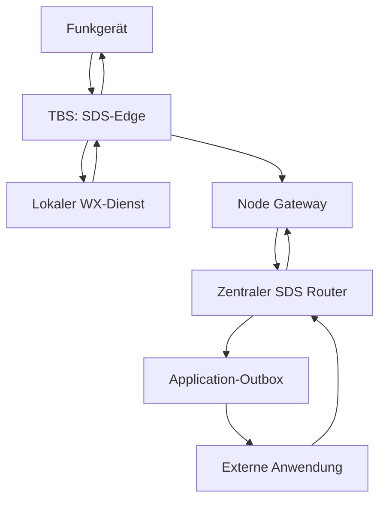

# Technische Abschlussdokumentation: Flowstation SDS-Services, Gateways und Bot-Architektur

## 1. Metadaten und Geltungsbereich

| Feld | Wert |
|---|---|
| Projekt | NetCore-Tetra |
| Thema | Informations-, Warn-, Telemetrie- und Automationsdienste über TETRA-SDS; Flowstation als Funkgateway und möglicher externer Service-Daemon |
| Ursprünglicher Chattitel | Nicht zugänglich. „Flowstation SDS-Services“ ist eine beschreibende Themenbezeichnung dieser Dokumentation. |
| Ursprünglicher Chatlink | Nicht im bereitgestellten Verlauf oder in der ergänzenden Verlaufssuche verfügbar |
| Erstellungsdatum | 2026-10-03, Zeitzone Europe/Berlin |
| Historischer Zeitraum | Die ergänzende Verlaufssuche ordnet die beiden Ausgangsfragen dem 2026-05-11 zu. Das ist ein indirekter Zeitnachweis; originale Chatmetadaten fehlen. |
| Zielrepository | [JanHG98/netcore-tetra](https://github.com/JanHG98/netcore-tetra) |
| Ausschließlicher Schreibbranch | `Archiving` |
| Ablage | Ausschließlich `Docs/archive/` |
| Zunächst geprüfter HEAD von `Archiving` | [`98fae39a4cb041d14e2a3633a4e36782124f79da`](https://github.com/JanHG98/netcore-tetra/commit/98fae39a4cb041d14e2a3633a4e36782124f79da) |
| Vor der Speicherung erneut geladene Schreibbasis | `98fae39a4cb041d14e2a3633a4e36782124f79da`; vorhandener Index und Archivdateien erneut geprüft |
| Zusätzlich geprüfter HEAD von `main` | [`6aa9be8f74ab731f72dc133a5f8e90c5018c626d`](https://github.com/JanHG98/netcore-tetra/commit/6aa9be8f74ab731f72dc133a5f8e90c5018c626d) |
| Zusätzlich geprüftes Upstream-Repository | `razvanzeces/flowstation`, `main`, [`0f4faa98b1abe9ec295cf7a94a7a1fa4b3a869b8`](https://github.com/razvanzeces/flowstation/commit/0f4faa98b1abe9ec295cf7a94a7a1fa4b3a869b8) |
| Historischer Code-Commit des Originalchats | Nicht überliefert; heutige Befunde werden nicht rückwirkend diesem unbekannten Stand zugeschrieben. |

Diese Datei archiviert den zugänglichen SDS-Service-Chat. Sie ist kein vollständiges Projektprotokoll und keine neue Implementierung. Die ebenfalls eingeblendeten Ausschnitte anderer NetCore-Chats dienen nur der Einordnung. Daraus werden keine zusätzlichen Aufträge abgeleitet.

### Statusbegriffe

| Status | Bedeutung in diesem Dokument |
|---|---|
| **Idee** | Als Möglichkeit oder Beispiel genannt; keine verbindliche Beauftragung oder Reservierung nachgewiesen |
| **Beschlossen/geplant** | Ausdrücklich als Ziel oder Auftrag festgelegt; noch kein Implementierungsnachweis |
| **Implementiert** | Konkrete Logik in den genannten Repository-Dateien am angegebenen Commit geprüft |
| **Getestet** | Ausgeführter Test mit verfügbarem Ergebnis; vorhandener Testcode allein reicht dafür nicht |
| **Im Betrieb bestätigt** | Beobachteter erfolgreicher Ablauf im realen Netz; im zugänglichen SDS-Service-Chat nicht belegt |

Bei Kombinationen wird die Grenze ausdrücklich genannt, beispielsweise „implementiert; Tests vorhanden, hier nicht ausgeführt“. Insbesondere sind Chat-Antworten, README-Funktionslisten und ETSI-Unterlagen für sich allein kein Nachweis einer erfolgreichen Funkzustellung.

## 2. Verfügbare Quellen und Auswertungslücken

### 2.1 Direkt zugänglicher Chat

Der übertragene fachliche Verlauf enthält zwei Nutzerfragen und die dazugehörigen Antworten:

1. Welche SDS-Services lassen sich in Flowstation integrieren? Wetter wurde als bereits möglich angesprochen; weitere Interessen waren „Flugfunk“ und APRS.
2. Die konkrete Aufforderung, [razvanzeces/flowstation](https://github.com/razvanzeces/flowstation) zu prüfen.

Die erste Antwort war eine breite Ideensammlung. Die zweite behauptete eine Repository-Prüfung und empfahl einen externen „FlowStation SDS Service Daemon“. Im übertragenen Verlauf folgen keine ausdrückliche Implementierungsfreigabe, keine Patchdatei, kein Commit, keine Installation und kein erfolgreicher Funk-Test dieses Daemons.

Beide fachlichen Antworten sind im übertragenen Kontext vorhanden, teils über mehrere Übertragungsblöcke verteilt. Die erste enthält auch die abschließenden Aussagen zu Robustheit, Store-and-forward und Endgeräteunterstützung; die zweite endet mit dem Vorschlag zum Parser, Router und Rückantwortpfad. Historische Verweise wie `turn4file0`, `turn5file0` und `turn6file0` lassen sich hier nicht zu den damaligen Originalabrufen auflösen. Deshalb wurde der Code neu an festen heutigen Commits geprüft.

### 2.2 Ergänzende Verlaufssuche

Die Suche bestätigte die Ausgangsfragen und lieferte keine eindeutig belegte spätere Korrektur derselben Unterhaltung. Daneben erschienen weitere SDS-Planungsnotizen: Echo, Uhrzeit, Terminalinfo, ZKN/Watchtower sowie TetraStatus, TetraDiag, TetraAlert, TetraPrint und optional TetraGuard. Sie sind als ergänzende Fortsetzungshinweise in Abschnitt 11 erfasst. Ihre vollständigen Originalnachrichten und die eindeutige Zuordnung zu diesem Chat fehlen.

Andere Suchtreffer nannten Remote-Restart, PEI-over-IP, MQTT-/REST-Bridges und einen älteren WX/METAR-Funktionsstand. Diese Hinweise ersetzen keine Quellcodeprüfung und werden nicht als neue endgültige Entscheidungen dieses Chats ausgegeben. Ein älteres Handbuch und ein unspezifisch benannter Textanhang aus der Suche wurden nicht als aktuelle Implementierungsbelege verwendet.

### 2.3 Zugängliche Anhänge

Alle 25 bereitgestellten PDF-Dateien waren lokal lesbar. Ihre Titelseiten wurden zur Identifizierung geprüft. Vier unmittelbar relevante Normen wurden für gezielte Textprüfung extrahiert; insbesondere wurden SDS-Dienstbeschreibung, SDS-TL und Textnachrichten in EN 300 392-2 geprüft. Eine vollständige Lektüre aller Normen, eine Prüfung neuerer Normfassungen oder eine Konformitätsbewertung ist nicht erfolgt.

Nicht verfügbar sind originale Chatlinks, sämtliche möglicherweise nicht übertragenen Nachrichten, ein damaliger Commit-Snapshot, reale Geräte- und Dienstkonfigurationen, Laufzeitlogs sowie Nachweise aus dem Live-Netz. Die Vollständigkeit gilt ausschließlich für den tatsächlich zugänglichen Inhalt.

## 3. Ziel, Ausgangslage und Ergebnis des historischen Chats

### 3.1 Ziel

Flowstation sollte als Schnittstelle zwischen TETRA-SDS und externen Informations- oder Automationsdiensten bewertet werden. Ein Funkgerät könnte kurze Kommandos senden, ein Dienst Daten abrufen oder eine Aktion ausführen und eine kompakte SDS an den Absender zurückgeben. Zusätzlich wurden Push-Meldungen an einzelne ISSIs oder Gruppen-GSSIs diskutiert.

### 3.2 Damalige Ausgangslage laut Chat

Die damalige Antwort beschrieb Flowstation als Rust-Projekt auf Basis von tetra-bluestation mit:

- SDS-Empfang über RF;
- lokaler Individual- und Gruppenweiterleitung;
- SDS-Anbindung über Brew und die Control-Schnittstelle;
- Web-Dashboard auf Port 8080;
- Terminalübersicht, Live-Logs und manuellem SDS-Versand;
- einem WebSocket-Kommando `"sds"`, das `ControlCommand::SendSds` erzeugt;
- hart gesetzter Absender-SSI `9999` im betreffenden Dashboard-Pfad.

Diese Aussagen sind historische Chatbefunde ohne damalige Commitbindung. Die wichtigen Schnittstellen und die Upstream-Absenderadresse wurden am heute zugänglichen Upstream-Code erneut bestätigt. NetCore verwendet inzwischen andere lokale Systemadressen; siehe Abschnitt 7.

### 3.3 Tatsächliches historisches Ergebnis

**Status: technische Ideensammlung und Architekturvorschlag.** Der Nutzer beauftragte die Machbarkeitsprüfung, nicht den Einbau der gesamten Liste. Eine verbindliche Providerwahl, ein fertiges Plugin-System oder eine feste Implementierungsreihenfolge sind nicht belegt.

Die Empfehlung lautete: Fachlogik in einen externen Daemon auslagern, SDS im Funkstack empfangen und dekodieren, Kommandos routen, Service ausführen, Ergebnis formatieren und über den vorhandenen Control-Versandpfad zurücksenden. Die Aussage „Parser, Service-Router und Rückantwort fehlen“ muss heute differenziert werden: Für WX/METAR existiert dieser Ablauf bereits; ein universeller Bot für die gesamte Liste ist weiterhin nicht nachgewiesen.

## 4. Anforderungen, Entscheidungen und Begründungen

| Punkt | Historischer Status | Begründung bzw. Grenze |
|---|---|---|
| SDS als Kanal für kurze Abfragen und Antworten | Idee/Machbarkeit untersucht | Kleine Text- und Datenpakete passen zum SDS-Bearer; konkrete Antwortlängen und Kodierung müssen zum Endgerät passen. |
| Wetter als Einstieg | Nutzer nannte Wetter als bereits möglich | Heute durch WX-/METAR-Code belegbar, jedoch ohne Betriebsnachweis dieses Chats |
| APRS und Luftfahrtinformationen | Ausdrückliches Nutzerinteresse | Technischer Umfang wurde noch nicht verbindlich festgelegt. |
| Externer SDS-Service-Daemon | Empfehlung des Assistenten | Externe APIs, Caching und Fachlogik sollen getrennt vom zeitkritischen Funkstack arbeiten. Keine endgültige Architekturfreigabe überliefert. |
| Modularer Service-Router/Plugins | Architekturidee | Erweiterbarkeit für Wetter, APRS, ADS-B, Pegel, Monitoring und Alarme |
| Antwort an die ursprüngliche Absender-ISSI | Bestandteil des Vorschlags | Erforderlich für brauchbares Request/Response; heute für WX konkret implementiert |
| Push an ISSI/GSSI | Idee | Geeignet für Warnungen und Ereignisse; darf nicht mit vorhandenen Dienstpfaden doppelt aufgebaut werden. |
| Statuswerte `40001–40007` als Shortcuts | Beispiel des Assistenten | Keine bestätigte Belegung und keine ETSI-standardisierten Funktionsnamen |
| Änderungen und Speicherung dieser Abschlussdokumentation | Beschlossen/beauftragt | Ausschließlich Archivdatei und Archivindex auf dem vorhandenen Branch `Archiving`; kein Merge, kein Force-Push, keine Produktivcodeänderung |

Es wurde kein SDS-Service ausdrücklich verworfen. Die Reihenfolge „einfach / gut machbar / wild“ aus der Antwort ist eine grobe Einschätzung, keine belastbare Aufwandsschätzung.

## 5. Vollständige historische Service- und Nebenideen

Alle Beispiele in diesem Abschnitt sind historische Bedienideen, keine automatisch verfügbaren Befehle. Konkrete Datenwerte in Beispielantworten waren illustrativ.

| Bereich | Genannte Funktionen, Quellen und Kommandos | Heutige Einordnung |
|---|---|---|
| Wetter und Umwelt | DWD/WarnWetter, aktuelle Bedingungen, Regenradarstatus, Wind-/Gewitter-/Unwetterwarnungen, UV-Index, Sonnenauf-/untergang; `WX HAMBURG` | WX/METAR vorhanden; diese komplette Umwelt-Liste nicht implementiert nachgewiesen |
| Pegel/Hochwasser | Pegelstand, Trend und Warnungen; `WATERLEVEL` | Eigenständiger Abfragedienst nicht nachgewiesen; Warnfeed und Live-Pegelabfrage sind verschiedene Funktionen. |
| Luftfahrt | Lokales ADS-B mit dump1090/readsb/tar1090; `PLANE`, `PLANE OVERHEAD`; Kennung, Typ, Höhe, Kurs, Entfernung | Idee; kein geprüfter SDS-ADS-B-Handler |
| APRS | APRS-IS, aprs.fi oder lokaler SDR; `APRS DB0ABC`, `APRS NEAR`; Position, Bewegung, Alter; automatische APRS→SDS-Übertragung | Abfragen und Gegenrichtung offen; vorhandener Brew-LIP→APRS-IS-Pfad ist gesondert dokumentiert. |
| Warnung/Alarmierung | NINA, KATWARN, DWD, CAP, Leitstellenfeeds, eigene Trigger; `ALERT TEST`; Individual- und Gruppenmeldungen | Warnservice und SDS-Versand vorhanden; sämtliche Quellen und Befehle nicht pauschal bestätigt |
| GPS/Lage | `GPS 53.1234 9.1234`, Speicherung, Karte, ETA, Entfernung, nächster Node oder nächstes Fahrzeug | LIP/GPS-Bausteine vorhanden; manuelle GPS-Kommandos, ETA und „nächster Node“ als SDS-Dienst offen |
| BOS-/Einsatzinformationen | Krankenhauskapazität/ZNA/CT/Stroke, beispielhaft `KH HH`; Gefahrstoff-/UN-Abfrage `UN 1203`; Giftinfo; `CPR START` und periodische Timer-SDS | Ideen ohne Datenzugang, fachliche Validierung oder garantierte Zeitzustellung; keine bestätigten medizinischen Einsatzfunktionen |
| Infrastruktur | CPU-Temperatur, USV/Batterie, VPN, GPS, SDR und Dienste; `TEMP CPU 72`, `UPS LOW`, `VPN DOWN` | Lokale IP/Temperatur/Info-Abfragen und MQTT-Bausteine vorhanden; umfassender SDS-Monitoring-Bot offen |
| Funknetz | `PING NODE04`, `NET`, `NODE 04`, `TG 911`; Nodes, Backhaul/Core, Teilnehmer und Gruppeninformationen; RSSI/BER-Reichweitentest | Telemetrie als Grundlage; konkrete PING-/NET-/TG-Textkommandos nicht belegt. RSSI/BER müssen aus verfügbaren Messungen stammen. |
| KI/Diagnose | `ASK Warum ist Node04 offline?`, `LOG LAST`; kurze Logdiagnose und Automationshilfe | Idee; kein SDS-KI-Handler geprüft, keine Verlässlichkeit einer automatischen Ursachenbehauptung belegt |
| Kameras/Sensorik | `CAM NODE04`, Snapshot-Link oder Kurzstatus, Temperatur-/Wasserstandsabfragen | Idee; große Bilddaten gehören nicht in einen einzelnen SDS-Text. |
| Hilfe/Command-Menü | `HELP` mit WX/APRS/PLANE/NET/PING/GPS/NODE/ALERT; Serviceentdeckung am Funkgerät | Universelles Menü offen; der vorhandene WX-Parser ignoriert HELP. |
| Monitoring-/Softwareintegration | Uptime Kuma, Prometheus, Grafana, GitLab/Gitea-Deploystatus, Home Assistant, OPNsense, Paperless, Pretix, FreePBX | Integrationsideen; MQTT/Home-Assistant-Grundlagen heute vorhanden, konkrete SDS-Adapter dieser gesamten Liste nicht bestätigt |
| Webhooks | SDS→Webhook und Webhook→SDS; manuelle SDS über Dashboard/API | SDS-Versand/API vorhanden; allgemeine Webhook-Bridge mit Ingress/Antwortkorrelation offen |
| Weitere SDR-Daten | AIS, Pager, APRS, ADS-B, Wettersonden, Satelliten, LoRa, PMR-Scan, DMR-Beacons | Als Datendienst-Ideen erwähnt; kein Implementierungs- oder Betriebsnachweis dieser Adapter |
| Spielerische Automation | Kaffeemaschinenstatus mit `COFFEE`, Tier-/Raumstatus mit `CAT` | Nebenideen; die damalige „Bürokatze Dagur“-Formulierung war sachlich falsch: Dagur ist Jans Hund. |

„Flugfunk“ wurde in der Antwort hauptsächlich als ADS-B-/Flugtracking behandelt. **Ein VHF-Flugfunk-Audiogateway, eine Transkription oder ein bidirektionaler Sprachfunkdienst wurde nicht spezifiziert.** ADS-B-Zieldaten und Flugfunk-Audio dürfen bei einer Fortsetzung nicht gleichgesetzt werden. Die Idee „höchstes Flugzeug über dir“ bei `PLANE OVERHEAD` war ebenfalls nicht fachlich definiert; Suchradius, Position und Auswahlkriterium fehlen.

## 6. Historischer Kommando- und Statusentwurf

### 6.1 Vorgeschlagene Startkommandos

```text
HELP
WX
WARN
APRS <CALL>
PLANE
NET
NODE <ID>
PING
GPS
```

**Status: Idee.** `WX` ohne Ortsangabe war in der Startliste enthalten. Der heute geprüfte WX-Parser akzeptiert dagegen nur `WX <location>` oder `METAR <ICAO>`; ein nacktes `WX` ist damit kein bestätigter Aufruf.

### 6.2 Vorgeschlagene Status-Shortcuts

| Beispielwert | Vorgeschlagene Bedeutung | Belegstatus |
|---|---|---|
| `40001` | HELP | Idee |
| `40002` | Netzstatus | Idee |
| `40003` | Node-Status | Idee |
| `40004` | Wetter | Idee |
| `40005` | Warnungen | Idee |
| `40006` | APRS in der Nähe | Idee |
| `40007` | ADS-B über dem eigenen Standort | Idee |

Diese Tabelle ist kein gültiger NetCore-Adressplan. Eine **Ziel-ISSI** bezeichnet den Empfänger, ein **pre-coded Statuswert** die in U-STATUS/D-STATUS übertragene Information. Dieselbe Zahl kann in beiden Feldern vorkommen und hat dann eine andere Bedeutung. Auch ein Text `STATUS 40004` ist ohne Parser kein U-STATUS-Paket.

Der eigenständige Wetter-Archivchat nennt `40004` als Beispiel einer Serviceadresse. Das ist eine andere Verwendung derselben Zahl und begründet keine Reservierung. Vor Umsetzung müssen Service-ISSIs, Status-Shortcuts und vorhandene Systemadressen gemeinsam abgeglichen werden.

## 7. Zusätzlich geprüfter Repository-Stand am 2026-10-03

### 7.1 Prüfverfahren und Branchunterschiede

Die Branch-Referenzen wurden über die GitHub-Schnittstelle gelesen; anschließend wurden Dateien an festen Commit-SHAs geladen. Die rekursiven Git-Bäume von `Archiving`, `main` und Flowstation waren vollständig, nicht abgeschnitten. Im geprüften NetCore-Baum gab es keine `AGENTS.md`-Datei.

Folgende relevante Dateien hatten auf den geprüften NetCore-Snapshots identische Blob-SHAs: SDS-Subentity, CMCE-BS, WX-Service, WX-Konfigurationsmodul, Control-Kommandos, Router-Zustandslogik, Alert-Service-Logik und Brew-APRS-Forwarder. Die Dashboard-Server- und Router-HTTP-Dateien unterscheiden sich zwischen `Archiving` und `main`; die umfassende Detailprüfung hier bezieht sich auf `Archiving`. Der SDS-Absender `4010001` wurde zusätzlich im Dashboard-Server von `main` geprüft. UI-Umbauten und sonstige Branchdifferenzen wurden nicht vollständig analysiert.

### 7.2 SDS-Basis und Control-Schnittstelle

**Status: implementiert; hier kein Funk-Livetest.**

Relevante Pfade:

- `crates/tetra-entities/src/cmce/subentities/sds_bs.rs`: RF-Ingress, lokale Sonderfunktionen, lokale/zentralisierte Weiterleitung, Brew-/Control-Pfade, Antwortversand;
- `crates/tetra-entities/src/cmce/cmce_bs.rs`: Weiterleitung der Control-Befehle und WX-Ticks;
- `crates/tetra-entities/src/net_control/commands.rs`: `ControlCommand` und Antworten;
- `crates/tetra-entities/src/net_telemetry/events.rs`: unter anderem `TelemetryEvent::SdsEdgeIngress`;
- `crates/tetra-pdus/src/cmce/pdus/u_sds_data.rs` und `d_sds_data.rs`: Luftschnittstellen-PDUs;
- `crates/tetra-saps/src/control/enums/sds_user_data.rs`: SDS-Nutzdatenmodell.

`SendSds` enthält mehr als die im historischen Chat verkürzt genannten Felder:

```rust
SendSds {
    handle: u32,
    source_ssi: u32,
    dest_ssi: u32,
    dest_is_group: bool,
    len_bits: u16,
    payload: Vec<u8>,
}
```

Das ist eine verkürzte Wiedergabe der tatsächlich geprüften Enum-Variante, keine neue API. `SendRawSdsType4` und das heutige zentrale `DeliverSds` haben jeweils andere Zuständigkeiten. Raw-Type-4-Nutzdaten dürfen nicht unbeabsichtigt ein zweites Mal als Text/SDS-TL verpackt werden. Statusversand besitzt den eigenen `SendStatus`-Pfad.

Der historische Hinweis auf `crates/tetra-saps/src/control/` beschreibt eine Schnittstellenfamilie; die konkrete `ControlCommand`-Definition liegt im geprüften Code unter `net_control/commands.rs`.

### 7.3 Dashboard-Absender und lokale Systemadresse

| Funktion/Stand | Adresse bzw. Verhalten |
|---|---|
| Flowstation Upstream, geprüftes `Some("sds")` | `source_ssi: 9999`, individueller Versand |
| NetCore `Archiving`, entsprechender Dashboard-Pfad | `source_ssi: 4010001`, individueller Versand |
| NetCore `main`, zusätzlich geprüfter Dashboard-Pfad | ebenfalls `source_ssi: 4010001` |
| Lokale SDS-/Status-Sonderbehandlung in NetCore | `DASHBOARD_ISSI = 4010001` |

Der ausgewertete WebSocket-Zweig setzt `dest_is_group: false`. Dass die allgemeine Control-Schnittstelle auch Gruppen adressieren kann, bedeutet nicht, dass jeder manuelle Dashboard-Aufruf automatisch Gruppen-SDS erzeugt.

### 7.4 WX-/METAR-Dienst ist bereits eingebaut

**Status: implementiert auf beiden geprüften NetCore-Snapshots und im geprüften Upstream; kein Betriebsnachweis dieser Archivierung.**

Geprüfte Funktionen und Dateien:

- `wx_service.rs`: `WxRequest`, `parse_wx_request`, `fetch_wx`, `fetch_metar_raw`, `fetch_metar_decoded`, `decode_metar`, TOML-Persistierung;
- `sds_bs.rs`: Adressprüfung vor allgemeinem Routing, `handle_wx_request`, `queue_wx_reply`, `tick_periodic_wx`;
- `bins/bluestation-bs/src/main.rs`: tatsächliche Verkabelung über `cmce.set_wx_cmd_sender(d.clone_sender())`;
- `sec_wx.rs`: Konfiguration und Mindestintervall;
- Dashboard-Server: `GET /api/wx` und `POST /api/wx`.

Aktuelle Syntax:

```text
WX Hannover
METAR EDDV
```

Der Parser behandelt die Präfixe ohne Beachtung der Groß-/Kleinschreibung. `WX` benötigt einen nicht leeren Ort. Die ICAO-Sanitisierung begrenzt auf bis zu vier Buchstaben; der Parser akzeptiert bereits mindestens drei, was nicht einer strengen Prüfung eines vierstelligen ICAO-Codes entspricht. `HELP`, `PING`, nacktes `LROP`, nacktes `WX` und beliebiger Text werden in diesem Parser ausdrücklich nicht als Wetterkommandos beantwortet. Einige ältere Kommentare nennen noch nackte ICAO-Anfragen; ausführbare Parserlogik und vorhandene Tests widersprechen dieser Beschreibung.

Provider und Transport:

- METAR: `https://aviationweather.gov/api/data/metar?ids=<ICAO>&format=raw&taf=false`;
- WX: `https://wttr.in/<location>?format=%l||%C||%t||%f||%h||%w`;
- blockierender HTTP-Client mit 10 Sekunden Timeout, ausgeführt in Worker-Threads;
- individuelle Rückantwort von der konfigurierten Service-ISSI an die ursprüngliche Absender-ISSI;
- Kürzung im WX-Antwortpfad auf 220 Payload-Bytes;
- periodischer Versand holt einen konfigurierten METAR und kann individuell oder an eine Gruppe adressieren;
- TOML-Schreibpfad erzeugt eine Sicherung mit der Endung `.wx.bak`.

Die Absicht ist kompakter Text mit ASCII-/LATIN-kompatibler Darstellung. Im WX-Formatter werden Orts- und Zustandsstrings jedoch direkt eingesetzt; eine vollständig durchgängige ASCII-Normalisierung ist anhand dieses Pfads nicht garantiert. Unicode und byteweise Kürzung sind deshalb sinnvolle spätere Testfälle. Der Endpunkt und die Anbieter wurden als im Code verwendete Abhängigkeiten identifiziert, nicht mit einer erfolgreichen Live-Abfrage getestet.

Konfiguration muss in drei Ebenen unterschieden werden:

| Parameter | Code-Default in `sec_wx.rs` | Tatsächlicher Wert in der geprüften Repository-`config.toml` |
|---|---|---|
| `enabled` | `false` | `true` |
| `service_issi` | `9998` | `4010001` |
| `periodic_enabled` | `false` | nur kommentiertes Beispiel; Default greift ohne Runtime-Override |
| `periodic_issi` | `0` | nur kommentiertes Beispiel |
| `periodic_is_group` | `false` | nur kommentiertes Beispiel |
| `periodic_icao` | leer | nur kommentiertes Beispiel `LROP` |
| `periodic_interval_secs` | `1800` | nur kommentiertes Beispiel |
| wirksames Mindestintervall | `300` Sekunden | durch `effective_interval_secs()` begrenzt |

Das untersuchte Repository aktiviert den On-demand-Dienst also an `4010001`. Daraus folgt **nicht**, dass diese Datei auf Jans TBS geladen ist. Zusätzlich können Dashboard-Runtime-Overrides den wirksamen Zustand ändern. `9998` ist der Code-Default, nicht die geprüfte Projektkonfiguration.

Die lokale WX-Adressbehandlung liegt vor der allgemeinen Zentralrouting-Übergabe. Eine externe Anwendung an derselben Adresse erhält solche Requests daher nicht einfach zusätzlich. Adressplan und Routing müssen diese lokale Übernahme berücksichtigen.

### 7.5 Bereits vorhandener zentraler SDS Router

**Status: implementiert; Open-Lab-Konfiguration, hier nicht gestartet.**

`system-backend/sds-router/` enthält einen eigenständigen Rust-Dienst mit API/WebUI, Persistenz, Teilnehmer-/Gruppenpräsenz, TTL, Retry/Backoff, Duplikaterkennung, Statusbehandlung und Application-Outbox. README, HTTP-Routen und wesentliche Zustandslogik wurden gemeinsam geprüft.

Die zentrale Übergabe ist über `[control_room].central_sds_routing = true` vorgesehen. Lokale Sonderfunktionen verbleiben auf der TBS. Der Datenfluss ist:



Der Zweig zur externen Anwendung zeigt die vorhandene Outbox/API-Anbindung; er bedeutet nicht, dass ein universeller SDS-Bot schon läuft.

Der konkrete Code unterstützt Routen nach `protocol`, `individual` und `group`, Ziele `node` oder `application` und Modi `tap`, `route`, `intercept`. Für einen Bot kann daher eine **gezielte Individualroute auf eine Service-ISSI zu einer Anwendung** geprüft werden. Ein pauschales Intercept aller Text-PIDs würde auch normale SDS erfassen und wäre keine angemessene Standardlösung.

Wichtige API-Pfade:

```text
GET  /api/v1/status
GET  /api/v1/messages
POST /api/v1/messages
GET  /api/v1/routes
POST /api/v1/routes
GET  /api/v1/application-outbox?application=<name>
POST /api/v1/application-outbox/<name>/<message-id>/ack
GET  /api/v1/events
GET  /api/v1/events/netcore?limit=100
GET  /metrics
GET  /health/live
GET  /health/ready
GET  /openapi.json
```

Application-ACK ist die Bestätigung der Verarbeitung durch die Anwendung. Die TBS-Rückmeldung `ControlResponse::SdsDeliveryResponse` bestätigt die Annahme am Funk-Edge. Ein späterer SDS-TL-Terminalreport ist eine weitere, getrennte Information. Keine dieser Stufen darf ohne passende Semantik als „vom Menschen gelesen“ dargestellt werden.

Der Router besitzt persistente Store-and-forward- und Retry-Logik. Die frühere pauschale Aussage, SDS sei automatisch ein fertiger Store-and-forward-Dienst, war zu weitgehend: Dafür müssen Core-/SDS-TL-Funktionen, erreichbare Teilnehmer und eine passende Policy vorhanden sein. Warnaufträge mit `at_most_once` verwenden bewusst andere Wiederholungsregeln.

### 7.6 Bereits vorhandener Warnservice

**Status: implementiert; hier kein Feed- oder Funk-Livetest.**

`system-backend/alert-service/` ist ein Python-3.11+-Dienst mit eigenem LXC-Installationspfad. README, `nina.py` und `service.py` belegen BBK-Feedverarbeitung, Geometrie-/Teilnehmerbezug und `POST /api/v1/messages` an den SDS Router.

Die dokumentierten Standardquellen sind `mowas`, `katwarn`, `biwapp`, `dwd`, `lhp`; `police` ist zusätzlich als erlaubte Quelle aufgeführt. KATWARN wird über die öffentlich verfügbaren BBK-Daten berücksichtigt, nicht über einen nachgewiesenen unabhängigen Partnerzugang.

Der Dienst arbeitet mit individuellen, positionsbezogenen Warnungen, dauerhafter Zustellhistorie/Idempotenz und `at_most_once`. Die vorhandene Umsetzung ist daher präziser als die historische Idee „einfach jede Warnung an eine Gruppe senden“. Warnung, Entwarnung, Wiederholung und Empfängerwahl sollten auf diesen bestehenden Dienst abgestimmt werden. Der Funktext ist dort standardmäßig auf 120 ASCII-Zeichen begrenzt; das ist eine andere Grenze als die 220 Bytes des WX-Pfads.

### 7.7 APRS: vorhandener Teilpfad, fehlender Abfragebot

**Status: LIP→APRS-IS-Forwarder im mitgeführten Brew-Server implementiert; heutiger Betrieb nicht bestätigt.**

`misc/brew-server/src/aprs.rs` nimmt dekodierte TETRA-LIP-Positionen entgegen, entkoppelt sie über eine Queue und sendet APRS-Objektberichte über eine wiederverbindende APRS-IS-Verbindung. Das ist **keine** Implementierung von `APRS <CALL>`, `APRS NEAR` oder APRS→SDS-Rückantworten.

Die Existenz unter `misc/brew-server/` beweist weder, dass der in Jans Netz laufende Brew-Server diesen Stand verwendet, noch dass APRS aktiviert ist. Zugangswerte wurden nicht übernommen. Server/Port und Freigaben müssen aus der tatsächlich genutzten Konfiguration ermittelt werden.

### 7.8 Monitoring, MQTT und lokale Statuskommandos

**Status: einzelne Bausteine implementiert; kein allgemeiner NET-/NODE-/PING-Textbot nachgewiesen.**

- Der lokale U-STATUS-Kommandopfad verwendet `cell.sds_command_control`, `authorized_issis` und konfigurierbare `status_code`-Zuordnungen. Geprüfte Aktionen: `restart`, `shutdown`, `kick_all`, `ip`, `temp`, `info`. IP, Temperatur und Stackinformation können eine SDS-Rückantwort erzeugen.
- NetCore verwendet für diese lokale Sonderbehandlung die aktuelle Systemadresse `4010001`. Alte Kommentare/Tests enthalten teilweise noch `9999`; ein vorhandener historischer Statuswert ist keine neue Bot-Reservierung.
- `system-backend/iot-gateway/` bietet `netcore-event-v1`, MQTT, `netcore-command-v1`, `netcore-command-ack-v1`, Policies und Home-Assistant-/Homematic-Bausteine. README und MQTT-Code wurden geprüft.
- Diese Infrastruktur ist ein möglicher Anschluss für spätere SDS-Automationen. Sie beweist nicht, dass ein am Funkgerät eingegebenes `COFFEE`, `NET` oder `NODE 04` bereits dorthin geroutet wird.

### 7.9 Statusübersicht

| Funktion | Historischer Chat | Heutiger Nachweis |
|---|---|---|
| SDS RF/lokal/Brew/Control | Als vorhanden beschrieben | konkrete SDS-/Control-Logik geprüft |
| Dashboard-SDS | Als vorhanden beschrieben, Quelle `9999` | Upstream bestätigt; NetCore verwendet `4010001` |
| WX/METAR-Abfrage mit Rückantwort | Wetter als möglich; generischer Rückpfad als fehlend beschrieben | für WX/METAR bereits implementiert und verkabelt |
| Periodischer METAR | nicht verbindlich festgelegt | konfigurierbarer Code vorhanden |
| Zentraler SDS Router/Application-Outbox | externer Router empfohlen | zentraler Dienst bereits vorhanden; universelle Fachhandler fehlen weiterhin als Nachweis |
| DWD/NINA/KATWARN-Warnverteilung | Integrationsidee | Alert Service vorhanden; keine neue Live-Prüfung |
| LIP→APRS-IS | APRS allgemein als Idee | Forwarder im mitgeführten Brew-Server vorhanden |
| APRS-Abfrage/NEAR→SDS | Idee | in den geprüften Pfaden kein Fachhandler belegt |
| ADS-B/PLANE→SDS | Idee | in den geprüften Pfaden kein Fachhandler belegt |
| HELP/PING im WX-Dienst | als mögliche Kommandos vorgeschlagen | Parser ignoriert diese bewusst |
| Status→IP/Temperatur/Info | Monitoringidee | lokaler Status-Kommandopfad vorhanden |
| Vollständiger Plugin-/Bot-Katalog | Idee | keine entsprechende fertige Implementierung nachgewiesen |
| Erfolgreicher Daemon-/TBS-/MS-Livetest dieses Chats | keiner überliefert | keiner durchgeführt |

Negativaussagen beziehen sich auf den beschriebenen Prüfumfang. Es wurde nicht jede Datei des gesamten Projekts inhaltlich untersucht und keine exhaustive Git-Historienanalyse ausgeführt.

## 8. Ports, Konfigurationen, Protokolle und Betriebsdateien

| Komponente | Geprüfter Port/Protokoll oder Pfad | Bedeutung/Grenze |
|---|---|---|
| TETRA-Luftschnittstelle | U-SDS-DATA/D-SDS-DATA, U-STATUS/D-STATUS, SDS-TL | Kommandotext und pre-coded Status bleiben getrennte Nachrichtentypen. |
| TBS-Dashboard | HTTP/WebSocket, Default TCP `8080` | konkrete Bind-Adresse/Anmeldung aus wirksamer Konfiguration ermitteln |
| WX-Einstellungen | `GET/POST /api/wx`, `[wx_service]`, `.wx.bak` | Runtime-Override und gespeicherte TOML getrennt prüfen |
| Wetterprovider | HTTPS, üblicherweise TCP `443` | wttr.in und aviationweather.gov; Erreichbarkeit hier nicht getestet |
| SDS Router | HTTP/API/Metrics, Standard TCP `8150` | Beispiel `0.0.0.0:8150`, Open-Lab-Konfiguration |
| Router→Node Gateway | WebSocket `/ws/backend` | Beispiel-URL `ws://10.0.1.20:8080/ws/backend`; kein Nachweis der aktuellen Live-Topologie |
| Router-Konfiguration | `/etc/netcore/sds-router.toml` | Beispiel unter `system-backend/sds-router/config/` |
| Router-Persistenz | `/var/lib/netcore-sds-router/messages.json` und `.json.bak` | Betriebszustand, kein bloßer wegwerfbarer Cache |
| Router-Binary/Unit | `/usr/local/bin/netcore-sds-router`, `netcore-sds-router.service` | Unit startet mit `--config /etc/netcore/sds-router.toml`, Benutzer `netcore` |
| Warnservice | HTTP, Standard TCP `8310` | `/api/` benötigt eine Dienstanmeldung; keine Zugangswerte archiviert |
| IoT Gateway | HTTP/API/Metrics, TCP `8240`; MQTT-Beispiel TCP `1883` | MQTT-/Home-Assistant-Bausteine; Open-Lab-Defaults |
| APRS-IS | TCP-Stream, konfigurierbarer Server | im Testcode Beispiel Port `14580`; Live-Port hier unbekannt |
| Externer SDS-Service-Daemon | kein Port, Dienstname oder Installationspfad verbindlich festgelegt | vorgeschlagene Dateinamen sind kein existierendes Deployment |

Router-Beispielparameter: Default-TTL `300 s`, maximale TTL `86400 s`, maximal `5` Versuche, Retry zunächst `2 s` bis `60 s`, Deduplikationsfenster `30 s`, Presence-Timeout `90 s`. Die HTTP-Body-Grenze von `2097152` Bytes und interne Payload-Grenze von `2048` Bytes sind **keine** zulässige Größe einer einzelnen TETRA-Type-4-Luftnachricht.

Das geprüfte Router-Beispiel läuft als `open_lab` ohne Benutzerkonten, Token oder TLS. Das ist ein realer Konfigurationsbefund und begrenzt seine Eignung als frei erreichbares Anwendungsgateway. Eine spätere Dienstidentitäts-/RBAC-Integration ist als Fortsetzungspunkt aufzunehmen, nicht als in diesem Chat fertiggestellt auszugeben.

## 9. Fehler, Diagnose, Lösungen und verbleibende technische Probleme

### 9.1 Keine ursprüngliche Fehlerbehebung in diesem Chat

Im historischen SDS-Service-Chat wurde kein Fehlerlog analysiert und kein reparierter Betriebsablauf dokumentiert. Die folgenden Punkte stammen aus der heutigen Codeprüfung und werden deshalb nicht als damalige Nutzerstörungen ausgegeben.

### 9.2 Schutz vor WX-Antwortschleifen

Codekommentare beschreiben eine frühere SDS-Sturm-Ursache: Zustellreports einer Wetterantwort wurden als neue Anfrage interpretiert; die nächste Antwort provozierte den nächsten Report.

Die geprüfte Lösung ist `is_sds_tl_report`: mindestens vier Bytes, PID `0x82` oder `0x89`, zweites Byte `0x10`. Solche Reports an den aktiven WX-Dienst werden konsumiert, ohne eine neue Wetterantwort zu erzeugen. Für eine neue Anfrage kann der Code einen Short Report `[0x82, 0x10, 0x00, MR]` zurücksenden, wobei `MR` die Message Reference bezeichnet.

**Status: Schutzlogik implementiert; historische Ursache aus Codekommentar, keine eigene Reproduktion oder erneute Funkabnahme.** Neue Fachhandler müssen Datennachrichten, Zustellreports und eigene Antworten ebenfalls unterscheiden.

### 9.3 Überholte Aussagen und Kommentare

- „Inbound-Parser und Rückantwort fehlen“: für einen allgemeinen Bot noch nicht nachgewiesen, für WX/METAR heute überholt.
- „WX/METAR benötigt zwingend einen externen Daemon“: heute falsch; vorhandener Dienst läuft in der TBS.
- „Quelle ist immer 9999“: trifft auf den geprüften Upstream-Dashboard-Zweig zu; NetCore setzt dort `4010001`.
- „LROP allein löst Wetter aus“: veraltete Kommentare; heutiger Parser und Negativtest ignorieren nackte ICAO-Eingaben.
- „Alle Funkgeräte können jedes Beispiel anzeigen“: aus dem Chat nicht ableitbar; Emoji/Unicode und konkrete SDS-TL-Profile sind geräteabhängig zu prüfen.
- „SDS funktioniert auch bei schlechtem Netz garantiert“: keine belastbare Zustellgarantie; Erreichbarkeit, Funkressourcen, Retry/TTL und Reports müssen berücksichtigt werden.

Die verwandte [Wetter-Archivdatei](2026-10-03_flowstation-wetterdaten-sds-weatherbot.md) enthält die Aussage, allgemeine Wetterdaten und ein WX-Abfragepfad seien nicht nachgewiesen. Die hier geprüften Dateien belegen einen wttr.in-WX-Pfad mit Rückantwort. Das ist ein sachlicher Widerspruch im aktuellen Archivbestand. Diese andere Chatdatei wurde in diesem Auftrag nicht überschrieben; eine spätere gezielte Korrektur sollte interaktive allgemeine WX-Daten von einem noch offenen DWD-/Forecast-WeatherBot unterscheiden.

### 9.4 Offene Implementierungsfragen

- Gemeinsamer Adress-/Statusplan und Überschneidung mit dem lokal aktiven WX-Dienst an `4010001`;
- exakte Abgrenzung eines neuen Fachrouters von vorhandenen Application-Routen, Alert Service und IoT Gateway;
- API-Timeouts, Caching, kontrollierte Parallelität und Request-Limits für externe Datenquellen;
- lokale WX-Arbeit startet pro Anfrage einen Thread; im geprüften Handler ist keine allgemeine Bot-Rate-Limit-/Cache-Schicht sichtbar;
- Ortsparameter werden im WX-URL-Aufbau nur durch Ersetzen von Leerzeichen behandelt; Validierung und saubere URL-Kodierung sollten geprüft werden;
- Quelle/Zeitpunkt/Alter von APRS-, Wetter- und ADS-B-Daten müssen erkennbar sein;
- keine Doppeleinspeisung oder Antwortschleife zwischen Brew, Router, Webhooks und SDS-Bots;
- Dienstannahme, Terminalreport und erfolgreiche Fachverarbeitung brauchen getrennte Statuswerte;
- Legacy-Tests adressieren teilweise `9999`, während aktuelle lokale Sonderfunktionen `4010001` verwenden. Ob Tests dadurch scheitern, wurde nicht ausgeführt und wird nicht behauptet.

## 10. Befehle, Installationsabläufe und Tests

### 10.1 Historisch tatsächlich ausgeführt

Keine Installation, kein Deployment, keine Reparatur und kein erfolgreicher Test eines SDS-Service-Daemons ist im ursprünglichen Chat belegt. Die damalige Repository-Inspektion wurde behauptet, aber ihre Originaltool-Ausgaben/Commitbindung sind hier nicht vollständig verfügbar.

### 10.2 Für diese Archivierung tatsächlich durchgeführt

**Erfolgreich:** GitHub-Referenz- und Dateiabfragen, vollständige Git-Baumabfragen, feste Commitbindung der gelesenen Dateien, lokale Textsuche mit `rg`, Identifizierung aller PDF-Titelseiten und gezielte Extraktion/Prüfung der SDS-relevanten Normstellen mit `pdftotext`.

Zwei zunächst angenommene Quellpfade lieferten 404, weil `tetra-config/src/bluestation.rs` modularisiert unter `bluestation/` liegt und Telemetrie unter `tetra-entities/src/net_telemetry/events.rs` definiert ist. Die korrekten Pfade wurden über den Git-Baum ermittelt und gelesen. Das waren Recherchefehler, keine Fehler des Projekts.

Es wurden keine externen Wetter-/APRS-/ADS-B-Provider aufgerufen, keine produktiven SDS gesendet und keine TBS, LXC oder VM verändert. Die ausgeführten Dokumentprüfungen werden beim Speichern separat bewertet; sie sind keine Funktionsabnahme des SDS-Stacks.

### 10.3 Vorhandene Installations-/Startbefehle, hier nicht ausgeführt

Aus der geprüften Router-README:

```bash
cargo run -p netcore-sds-router -- --no-config --bind 0.0.0.0:8150
```

Mit eigener, geprüfter Konfiguration:

```bash
cp system-backend/sds-router/config/sds-router.example.toml /etc/netcore/sds-router.toml
cargo run -p netcore-sds-router -- --config /etc/netcore/sds-router.toml
```

Die Kopieranweisung ist ein Ersteinrichtungsbeispiel und darf bei späterer Fortsetzung keine vorhandene Betriebsdatei unbesehen ersetzen. Installer, Updater und Uninstaller liegen unter `system-backend/sds-router/install/`; die Unit verwendet den genannten persistenten Konfigurationspfad.

Für den vorgeschlagenen universellen SDS-Service-Daemon gibt es in diesem Chat keinen erfolgreich ausgeführten Installationsbefehl, keine definierte systemd-Unit und keinen festgelegten Runtime-Stack. Die Beispielstruktur `/services/weather.py`, `/services/aprs.py`, `/services/adsb.py`, `/services/netmon.py`, `/services/alerts.py` war eine Modulskizze, keine nachgewiesene Projektstruktur.

### 10.4 Im Repository vorhandene Tests, hier nicht ausgeführt

| Testbereich | Gelesene Beispiele | Aussagegrenze |
|---|---|---|
| WX-Parser/Decoder/TOML | `request_metar_prefix`, `request_wx_prefix`, `request_only_two_commands`, `decode_basic`, `decode_gust_and_negative_temp`, `write_toml_replace_section` | Tests vorhanden; keine Ausführung oder Providerabnahme in diesem Auftrag |
| SDS lokal/Brew/Gruppen | `test_sds_local_delivery`, `test_sds_brew_forward`, `test_sds_from_brew_to_local`, `test_sds_group_delivery` | Testcode vorhanden; kein aktuelles PASS behauptet |
| Funkzustand/Energy Economy | `test_sds_to_in_call_ms_is_deferred_then_delivered_on_mcch`, `test_sds_to_ee_ms_defers_until_monitoring_window` | decken modellierte Stackzustände ab, keine gemessene Funkzustellung |
| Status-Kommandos | `test_u_status_command_ip_replies_to_authorized`, `test_u_status_command_unauthorized_no_reply` | einschließlich historischer Zieladressierung prüfen |
| Router | `text_message_is_wrapped_as_sds_tl_type4`, `fixed_size_sds_rejects_non_exact_payload_length`, `durable_idempotency_survives_restart_conflicts_and_deletion`, `at_most_once_never_retransmits_after_restart_or_disconnect` | relevante Testfälle vorhanden; hier nicht ausgeführt |
| Statische Routerprüfung | `tools/check_sds_router.py` | Struktur-/Quelltextprüfung, kein gleichwertiger Integrationstest |

Da dieser Auftrag ausschließlich Dokumentation ändert, wurde kein Cargo-Build und keine bestehende Funktionstest-Suite gestartet. Neue Testfälle wurden nicht als Scheinnachweis hinzugefügt.

## 11. Ergänzende SDS-Fortsetzungshinweise aus der Verlaufssuche

Diese Punkte stammen aus indirekten Suchtreffern zu weiteren SDS-Planungsdiskussionen. Sie sind **keine eindeutig nachgewiesene spätere Freigabe dieses Originalchats**:

| Bezeichnung/Idee | Indirekt genannter Wert oder Inhalt | Weiterer Klärungsbedarf |
|---|---|---|
| Echo/Uhrzeit | kurze Rückantwort/Zeitauskunft | Syntax, Adresse und heutige Umsetzung unbekannt |
| Terminalinfo | Geräte-/Teilnehmerauskunft | Registry/Directory-Quelle und Berechtigungen bestimmen |
| ZKN/Watchtower | Status-/Überwachungsdienste | fachlichen Umfang im Originalkontext prüfen |
| TetraStatus | `40010` | Zahlenrolle/Reservierung nicht gesichert |
| TetraDiag | `40011` | Diagnoseumfang und Zahlenrolle nicht gesichert |
| TetraAlert | `40032` | mit vorhandenem Alert Service abgleichen |
| TetraPrint | `40033` | Druckworkflow, Empfänger und Freigaben im Originalkontext prüfen |
| TetraGuard, optional | `40034` | Funktion und Berechtigung offen |
| Remote-Restart | anderer Chat: U-STATUS `50005`, historisch an `9999` | heutige Systemadresse und konkrete Konfiguration prüfen; nicht als SDS-Textkommando übernehmen |
| PEI-over-IP/MQTT/REST | zusätzliche Gateways und Transportbrücken | von bereits vorhandenen Control-/Router-/IoT-Schnittstellen abgrenzen |

Die Zahlen werden bewusst nicht in die historische Tabelle `40001–40007` eingemischt. Dazu fehlen Original-Adressplan und nachgewiesene endgültige Festlegungen.

## 12. Roadmap-Kandidaten und konkrete nächste Schritte

Keine verbindliche neue Priorität oder Frist wurde im historischen Chat vereinbart. Die folgende Reihenfolge ist eine **heutige technische Empfehlung auf Basis des geprüften Stands**, kein bereits zugesagter Implementierungsplan. Sie wird ausschließlich hier im Archiv erfasst.

1. **Adressplan und wirksame Konfiguration prüfen.** Code-Defaults, Repository-`config.toml`, Runtime-Overrides und tatsächlich betriebene TBS abgleichen. Service-ISSIs, U-STATUS-Shortcuts und `4010001` gemeinsam dokumentieren. Voraussetzung für kollisionsfreies Routing.
2. **Vorhandene Bausteine als Basis verwenden.** SDS Router/Application-Outbox, lokaler WX-Dienst, Alert Service und IoT Gateway gegen die gewünschten Fachfunktionen abgrenzen. Einen neuen Daemon nur für die noch fehlende Fachlogik vorsehen.
3. **Kleinsten externen Request/Response-Pfad verifizieren.** Eine gezielte Anwendungsroute, Outbox-Lesen, Verarbeitung mit eigener Korrelation/Idempotenz, ACK und individuelle Antwort über `POST /api/v1/messages`. Keine pauschale Umleitung aller Textnachrichten. Lokale WX-Übernahme berücksichtigen.
4. **Gemeinsamen Command-Parser spezifizieren.** HELP, unbekannte Kommandos, Parameter, Absender-/Zielprüfung, Limits, Quellenalter, Fehlerantworten und Trennung von Daten/Reports/eigenen Antworten. Einheitliche Grenze für Textbytes und Kodierung vereinbaren.
5. **Wetter konsolidieren.** Vorhandenes `WX <Ort>`/`METAR <ICAO>` kontrolliert testen. DWD-Warnungen im Alert Service von DWD-Wetterdaten, Forecast, UV, Radar und Pegelabfragen trennen. Caching, Workerlimits, URL-Kodierung und Unicode-Kürzung prüfen.
6. **APRS-Fachumfang entscheiden.** Reicht LIP→APRS-IS, oder werden `APRS <CALL>`, `APRS NEAR` und APRS→SDS gewünscht? Erst dann APRS-IS/API/SDR-Provider und Positionsalter/Radius definieren.
7. **Luftfahrt-Fachumfang entscheiden.** ADS-B-JSON aus einem lokalen readsb/dump1090-Setup oder eine andere Quelle; „overhead“ fachlich definieren. Ein etwaiger Flugfunk-Audiowunsch ist ein separater Umfang.
8. **NET/NODE/Monitoring anschließen.** Vorhandene Telemetrie und lokale Statusabfragen verwenden; fehlende Daten kenntlich machen. RSSI/BER nicht aus einem einfachen Echo-Paket erfinden. Wiederholte Alarme deduplizieren.
9. **Push- und Automationsadapter ergänzen.** Warnservice, Home Assistant, Webhooks, Monitoring und weitere genannte Systeme nach Bedarf. Aktionen mit Auswirkungen benötigen gezielte Policies und nachvollziehbare Quittierung.
10. **Betriebsgrenzen schließen.** Dienstidentitäten/RBAC, sichere Anwendungsanbindung, Logs, Metriken, Health/Ready, Provider-Staleness, Wiederanlauf und Backups festlegen. Open-Lab-Konfiguration nicht als fertigen abgesicherten Betrieb dokumentieren.
11. **Gestufte Tests durchführen.** Parser/Formatter mit Randfällen; Mock-Provider mit Timeout/Fehlern; Router-Anwendung-Integration; kontrollierter TBS/MS-Test; offline Teilnehmer, Retry/TTL, Gruppenverteilung, identische Requests und SDS-TL-Reports. Erst nach beobachteter Abnahme „getestet“ bzw. „im Betrieb bestätigt“ setzen.
12. **Archivwiderspruch gezielt bereinigen.** Die verwandte Wetter-Zusammenfassung bei späterer Beauftragung an den belegten WX-Stand anpassen. Hier bleiben ihre Datei und ihr bestehender Indexeintrag erhalten.

Die kleineren Nebenideen aus Abschnitt 5 bleiben als mögliche Erweiterungen erhalten. Krankenhaus-/Gefahrstoffdaten und zeitkritische Timer sind nicht als sofort nutzbare Einsatzfunktionen priorisiert; Datenzugang, fachlicher Umfang und Zuverlässigkeit sind dafür noch offen.

## 13. Quellen, Dateien, Branches und Anhänge

### 13.1 Reproduzierbare Repository-Quellen

Die folgenden Links verweisen auf feste geprüfte Commits. Sie bleiben von späteren Branchbewegungen unabhängig:

| Quelle | Geprüfte Datei/Verwendung |
|---|---|
| [NetCore SDS-Subentity](https://github.com/JanHG98/netcore-tetra/blob/98fae39a4cb041d14e2a3633a4e36782124f79da/crates/tetra-entities/src/cmce/subentities/sds_bs.rs) | Ingress, WX, Reports, Control, Statuskommandos |
| [NetCore CMCE-BS](https://github.com/JanHG98/netcore-tetra/blob/98fae39a4cb041d14e2a3633a4e36782124f79da/crates/tetra-entities/src/cmce/cmce_bs.rs) | Weiterleitung zentraler SDS-/Statusbefehle und periodischer WX-Tick |
| [NetCore WX-Service](https://github.com/JanHG98/netcore-tetra/blob/98fae39a4cb041d14e2a3633a4e36782124f79da/crates/tetra-entities/src/net_dashboard/wx_service.rs) | Parser, Provider, Decoder, Formatierung, TOML-Schreiben, Tests |
| [WX-Konfigurationsmodul](https://github.com/JanHG98/netcore-tetra/blob/98fae39a4cb041d14e2a3633a4e36782124f79da/crates/tetra-config/src/bluestation/sec_wx.rs) | Code-Defaults und Mindestintervall |
| [Control-Kommandos](https://github.com/JanHG98/netcore-tetra/blob/98fae39a4cb041d14e2a3633a4e36782124f79da/crates/tetra-entities/src/net_control/commands.rs) | SendSds, SendRawSdsType4, DeliverSds, SendStatus |
| [BS-Start und Verkabelung](https://github.com/JanHG98/netcore-tetra/blob/98fae39a4cb041d14e2a3633a4e36782124f79da/bins/bluestation-bs/src/main.rs) | WX-Command-Sender tatsächlich angeschlossen |
| [Dashboard-Server auf Archiving](https://github.com/JanHG98/netcore-tetra/blob/98fae39a4cb041d14e2a3633a4e36782124f79da/crates/tetra-entities/src/net_dashboard/server.rs) | WebSocket-SDS und `/api/wx` |
| [Dashboard-Server auf main](https://github.com/JanHG98/netcore-tetra/blob/6aa9be8f74ab731f72dc133a5f8e90c5018c626d/crates/tetra-entities/src/net_dashboard/server.rs) | zusätzlich geprüfte Absenderadresse im SDS-Zweig |
| [SDS Router README](https://github.com/JanHG98/netcore-tetra/blob/98fae39a4cb041d14e2a3633a4e36782124f79da/system-backend/sds-router/README.md) | Dienstumfang, API und Startbefehle |
| [Router-Zustandslogik](https://github.com/JanHG98/netcore-tetra/blob/98fae39a4cb041d14e2a3633a4e36782124f79da/system-backend/sds-router/src/state.rs) | Routing, Application-Legs, Textverpackung, Persistenz, Reports und Tests |
| [Router HTTP](https://github.com/JanHG98/netcore-tetra/blob/98fae39a4cb041d14e2a3633a4e36782124f79da/system-backend/sds-router/src/http.rs) | konkrete API-Routen |
| [Router-Beispielkonfiguration](https://github.com/JanHG98/netcore-tetra/blob/98fae39a4cb041d14e2a3633a4e36782124f79da/system-backend/sds-router/config/sds-router.example.toml) | Ports, Persistenz, Limits, Open-Lab-Defaults |
| [Alert Service](https://github.com/JanHG98/netcore-tetra/blob/98fae39a4cb041d14e2a3633a4e36782124f79da/system-backend/alert-service/README.md) | Warnworkflow, Quellen, Zustellgrenzen; zusätzlich `nina.py` und `service.py` gelesen |
| [Brew APRS-Forwarder](https://github.com/JanHG98/netcore-tetra/blob/98fae39a4cb041d14e2a3633a4e36782124f79da/misc/brew-server/src/aprs.rs) | LIP→APRS-IS, kein APRS-Abfragebot |
| [IoT Gateway](https://github.com/JanHG98/netcore-tetra/blob/98fae39a4cb041d14e2a3633a4e36782124f79da/system-backend/iot-gateway/README.md) | MQTT/Event-/Command-Modell; zusätzlich `src/mqtt.rs` gelesen |
| [SDS-Tests](https://github.com/JanHG98/netcore-tetra/blob/98fae39a4cb041d14e2a3633a4e36782124f79da/crates/tetra-entities/tests/test_sds_bs.rs) | vorhandene lokale/Brew-/Status-/EE-Testfälle |
| [Flowstation README](https://github.com/razvanzeces/flowstation/blob/0f4faa98b1abe9ec295cf7a94a7a1fa4b3a869b8/README.md) | Upstream-Herkunft, Dashboard, Funktionsliste |
| [Flowstation Dashboard](https://github.com/razvanzeces/flowstation/blob/0f4faa98b1abe9ec295cf7a94a7a1fa4b3a869b8/crates/tetra-entities/src/net_dashboard/server.rs) | Upstream-SDS-Absender `9999` |
| [Flowstation WX-Service](https://github.com/razvanzeces/flowstation/blob/0f4faa98b1abe9ec295cf7a94a7a1fa4b3a869b8/crates/tetra-entities/src/net_dashboard/wx_service.rs) | heutiger Upstream-WX-/METAR-Parser |

Weiter gelesen: Router-Dokumente `docs/architecture.md` und `docs/application-routing.md`, `src/gateway.rs`, `systemd/netcore-sds-router.service`, `install/install.sh`, `tools/check_sds_router.py`, NetCore-Dashboard-Konfiguration und Telemetrie-Events. Die tatsächlichen Zugangsdaten aus Konfigurationen wurden nicht in dieses Dokument übernommen.

Es gibt keinen im Originalchat belegten Implementierungs-PR oder Release für den vorgeschlagenen Daemon. Andere Projekt-PRs werden deshalb nicht als Nachweis dieser Umsetzung angeführt. Der neue Archivcommit ist über die Git-Historie dieser Datei und die Abschlussmeldung identifizierbar; eine Datei kann ihre eigene resultierende Commit-SHA nicht sinnvoll vorab enthalten.

### 13.2 Normenbestand und tatsächlicher Prüfumfang

| Anhang | Identifikation anhand der Titelseite | Verwendung in dieser Archivierung |
|---|---|---|
| `en_3003920308v010401p.pdf` | EN 300 392-3-8 V1.4.1: Generic Speech Format Implementation | Titelseite; keine SDS-Service-Detailprüfung |
| `en_30039209v010701p.pdf` | EN 300 392-9 V1.7.1: allgemeine Supplementary Services | Titelseite |
| `ts_10081201v020205p.pdf` | TS 100 812-1 V2.2.5: SIM-ME/UICC | Titelseite |
| `en_3003921201v010202p.pdf` | EN 300 392-12-1 V1.2.2: Call Identification, Stage 3 | Titelseite |
| `en_3003920304v010301p.pdf` | EN 300 392-3-4 V1.3.1: ANF-ISISDS | Titelseite/Text für SDS-/ISI-Einordnung; kein Nachweis einer ETSI-ISI-Implementierung |
| `en_3003921117v010102p.pdf` | EN 300 392-11-17 V1.1.2: Include Call | Titelseite |
| `en_3003921114v010101p.pdf` | EN 300 392-11-14 V1.1.1: Late Entry | Titelseite |
| `es_20081202v020401m.pdf` | Final draft ES 200 812-2 V2.4.1: TSIM-Anwendung | Titelseite; Entwurfsstatus ausdrücklich erhalten |
| `es_20081201v020205p.pdf` | ES 200 812-1 V2.2.5: TSIM-ME/UICC | Titelseite |
| `en_300812v020101p.pdf` | EN 300 812 V2.1.1: SIM-ME/Sicherheit | Titelseite |
| `en_3003921101v010201p.pdf` | EN 300 392-11-1 V1.2.1: Call Identification, Stage 2 | Titelseite |
| `en_3003921006v010401p.pdf` | EN 300 392-10-6 V1.4.1: Call Authorized by Dispatcher | Titelseite |
| `en_3003921018v010301p.pdf` | EN 300 392-10-18 V1.3.1: Barring of Outgoing Calls | Titelseite |
| `en_3003921216v010400a.pdf` | Draft EN 300 392-12-16 V1.4.0: Pre-emptive Priority Call | Titelseite; Entwurf 2026-03 |
| `en_30039201v010601p.pdf` | EN 300 392-1 V1.6.1: General network design | Titelseite/Text zur Netz-/SDS-Einordnung |
| `ets_30039214e01v.pdf` | Final draft pr ETS 300 392-14, 1997: PICS | Titelseite; keine ausgefüllte Konformitätserklärung |
| `en_30039207v030501p.pdf` | EN 300 392-7 V3.5.1: Security | Titelseite |
| `en_30039401v030301p.pdf` | EN 300 394-1 V3.3.1: Radio conformance testing | Titelseite; kein Konformitätstest durchgeführt |
| `en_3003920313v010201p.pdf` | EN 300 392-3-13 V1.2.1: transportunabhängiges ANF-ISIGC | Titelseite |
| `en_30039502v010303p.pdf` | EN 300 395-2 V1.3.3: TETRA codec | Titelseite |
| `en_3003920303v010301p.pdf` | EN 300 392-3-3 V1.3.1: ANF-ISIGC | Titelseite |
| `en_30039205v020701p.pdf` | EN 300 392-5 V2.7.1: PEI | Titelseite/Text als Schnittstellenreferenz |
| `en_3003920315v010500a.pdf` | Draft EN 300 392-3-15 V1.5.0: transportunabhängiges ANF-ISIMM | Titelseite; Entwurf 2026-04 |
| `en_30039202v030801p.pdf` | EN 300 392-2 V3.8.1: Air Interface | gezielt Abschnitte 13, 29.0/29.1 und Textnachrichtenbezüge 29.5.2/29.5.3 |
| `ETSI.pdf` | Titelseite ebenfalls EN 300 812 V2.1.1 | anhand der Titelseite derselbe Normtitel wie `en_300812v020101p.pdf`; keine Byteidentität geprüft |

Unmittelbar relevant ist EN 300 392-2: SDS umfasst vordefinierte Statusmeldungen und benutzerdefinierte Nachrichten; feste Nutzdatenlängen sind 16/32/64 Bit, Type 4 erlaubt bis zu 2047 Bit. SDS-TL liegt innerhalb dieses Type-4-Nutzdatenraums und ergänzt unter anderem Ende-zu-Ende-Reports und Store-and-forward-Mechanismen. Für einfachen Text bzw. SDS-TL-Text sind die genannten Textabschnitte maßgeblich. Nutzbarer Textplatz ist deshalb nicht mit 2047 Zeichen oder 2048 Bytes gleichzusetzen.

Brew-Anbindung ist durch ihre Existenz nicht als vollständige ETSI-ISI/ANF-ISISDS-Implementierung zertifiziert. Ebenso sind die mitgelieferten Entwürfe keine Nachweise implementierter Supplementary Services. Normenbestand, Codeumfang und erfolgreiche Konformitätsprüfung bleiben getrennt.

## 14. Archivierung und Speichergrenzen

Diese Abschlussdokumentation ist eindeutig dem breiten SDS-Service-/Gateway-Chat zugeordnet. Der separate Wetterchat und die separate Basisstations-ISSI-Dokumentation wurden gelesen bzw. als bestehende Archiveinträge erkannt und werden nicht überschrieben.

Zum Auftrag gehören genau diese Datei und die Ergänzung des vorhandenen `Docs/archive/README.md`. Zwischenzeitliche Änderungen anderer Chats müssen vor der Commit-Erzeugung durch erneutes Laden des Branch-HEADs und des Indexes berücksichtigt werden. Der Git-Baum wird auf dessen bestehendem Baum aufgebaut; die Branch-Referenz darf ausschließlich per Fast-forward aktualisiert werden. Bei einer konkurrierenden Branchbewegung wird auf dem neuen Stand neu aufgebaut, niemals erzwungen gepusht.

Die gespeicherte Fassung wird anschließend anhand des tatsächlichen Commits und der Dateien auf `Archiving` geprüft. Der Archivcommit verändert keine Dateien außerhalb von `Docs/archive/` und führt keinen Branch-Merge aus. Das manuelle Archivieren des Chats bleibt beim Nutzer.
