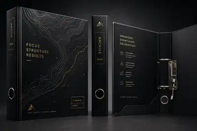
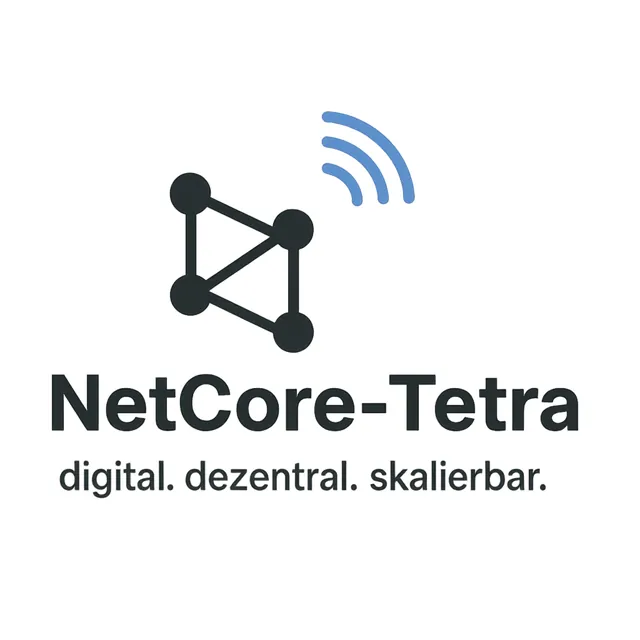
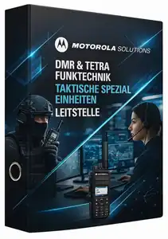

# Brainstorming: NetCore-Tetra Aktenordner – Branding, helle V2 und Hochkantpräsentation

> **Ergebnis:** Ein iterativ entwickeltes Gestaltungskonzept für einen physischen NetCore-Tetra-Aktenordner. Die jüngste ausdrücklich gewünschte Richtung ist **das eigene Logo, keine Motorola-zentrierte Gestaltung, eine helle V2 und eine Präsentation im Zielseitenverhältnis 9:16**. Es existieren gerenderte Entwürfe, aber keine freigegebene Druckvorlage und kein nachgewiesener physischer Prototyp.
>
> **Einordnung der Mockups:** Weder ein gerenderter Netzwerkplan noch aufgedruckte Dashboard-Adressen, QR-Codes oder Sicherheitsbegriffe sind Nachweise für implementierte oder betriebene NetCore-Funktionen. Die letzte Bilddatei ist mit **941 × 1672 Pixeln nur annähernd 9:16**. Die in mehreren Entwürfen sichtbare Jahreszahl **2024** ist kein verifiziertes Ausgabedatum.

## 1. Rahmen und Quellenstand

| Feld | Wert |
|---|---|
| Projekt / Thema | NetCore-Tetra; Aktenordner-/Operations-Binder-Design und Archivierung der Entwurfsreihe |
| Notizstand | 2026-10-03; Bezugszeitzone Europe/Berlin |
| Repository | `JanHG98/netcore-tetra` |
| Geprüfter Branch | `Archiving` |
| Geprüfter Ausgangscommit | `009874f602bb7fc0c959b87bf920e7c5eb4055fa` |
| Root-Tree des Ausgangsstands | `36f63c8b51b8458014519763b2bb28b07c0ebebc` |
| Commitnachricht / Zeit | `Add files via upload`; 2026-10-03T21:31:39Z |
| Zielpfad dieses Dokuments | `Docs/archive/2026-10-03_netcore-tetra-aktenordner-design-helle-v2-9x16.md` |
| Zugehöriger Index | `Docs/archive/README.md` |

**Grundlage:** Fünf Rasterentwürfe und zwei Bildvorlagen, jeweils lokal lesbar. Die 25 PDF-Projektbeilagen wurden nach Dateiname, Seitenzahl, Titelblatt und Hash inventarisiert; sie wurden für diese Gestaltung nicht vollständig fachlich geprüft.

**Grenzen:** Die Entwurfsreihe besitzt keine vollständigen individuellen Datierungen. Verwandte Wallpaper-Notizen liefern keine zusätzlichen Anforderungen für den Ordner.

## 2. Ziel, Ausgangslage und behandelte Themen

Gewünscht war ein auffälliger, hochwertig wirkender Aktenordner, der erkennbar zum eigenen Projekt NetCore-Tetra gehört. Der erste, generische Schwarz-Gold-Entwurf traf zwar eine hochwertige Büroästhetik, aber nicht die Projektidentität. Der fehlende Projektbezug wurde ausdrücklich verworfen.

Anschließend wurden unterschiedliche Stilrichtungen, die Verwendung des echten Logos, eine grobe produktfotografische Referenz, Außen- und Innengestaltung sowie die Präsentation der hellen Variante im Hochformat behandelt. Die Arbeit blieb eine **visuelle Konzeptentwicklung**. Ein vollständiges Betriebs- oder Systemhandbuch, ein Softwarefeature, ein Druckauftrag oder eine physische Fertigung waren in dieser Entwicklungsphase nicht ausgeführt worden.

Die Motorola-Beispielgrafik diente ausdrücklich nur als grobe Orientierung. Sie war kein Auftrag, Herstellerlogo, Gerätewerbung oder taktische Spezialkräfte als verbindlichen Inhalt zu übernehmen.

## 3. Chronologie und Vorrang späterer Korrekturen

| Schritt | Auftrag bzw. Ergebnis | Einordnung für die Fortsetzung |
|---|---|---|
| 1 – G01 | Generierter schwarzer Ordner mit Goldakzenten, Höhenlinien und „FOCUS / STRUCTURE / RESULTS“ sowie „ARCHIVE 2024“. | Historischer Fehlansatz: kein NetCore-Bezug. Als verworfene Referenz erhalten. |
| 2 | Fehlender NetCore-Bezug im Erstentwurf verworfen | Verbindliche Korrektur: NetCore-Tetra muss die Gestaltung bestimmen. |
| 3 | Entwurfsideen: NetCore Classic, FieldOps und ZKN Dark samt Innenleben. | Vorschläge, keine einzeln bestätigten Projektentscheidungen. |
| 4 – G02 | Als freie Stilvariation entsteht ein rauer Schwarz-Gelb-Entwurf mit Warnstreifen, erfundenem geometrischem Logo und taktischer Anmutung. | Generierter Zwischenstand; kein Beleg für eine Wahl von ZKN oder einer Sicherheitsklassifizierung. |
| 5 – U01/U02 | Projektlogo und grobes Motorola-Beispiel als Referenzen; Motorola-Ausrichtung ausdrücklich relativiert. | Eigenes Logo wird maßgebliche Referenz. Fremdbranding nicht als Projektidentität verwenden. |
| 6 – G03 | Dunkler, auf NetCore bezogener Entwurf: Schwarz, Blau, Netzwerkgraph, Wortmarke, Rückseite, Rücken, Innenseiten und Detailansicht. | Erzeugter Designstand nach der Logo-Korrektur. Keine Druckfreigabe. |
| 7 – G04 | Helle V2 verbindlich angefordert; weiß-/hellgrauer Entwurf mit blauen Akzenten. | Explizit gewünschte zusätzliche helle Variante. Der dunkle Entwurf wurde nicht ausdrücklich insgesamt verboten. |
| 8 – G05 | Seitenverhältnis 9:16 verbindlich angefordert; vertikale Präsentation der hellen Variante. | Letzter sichtbarer Gestaltungsauftrag. Ziel 9:16; tatsächliche Datei nur näherungsweise passend. |
| 9 | Dokumentation mit GitHub-Ziel und Bildsicherung. | Bildsicherung und Dokumentation; keine Druck- oder Fertigungsfreigabe. |

Verbindliche Richtung sind das Projektlogo, die helle V2 und die 9:16-Präsentation. FieldOps bleibt eine frühere Idee. Eine Druckfreigabe oder vollständige Abnahme der letzten Fassung liegt nicht vor.

## 4. Anforderungen, Entscheidungen und Reifegrade

### 4.1 Belegte Anforderungen

| Gegenstand | Status | Grundlage / Begründung |
|---|---|---|
| Erkennbarer NetCore-Tetra-Bezug | **beschlossen/geplant**; in späteren Renderings gestalterisch umgesetzt | Ausdrückliche Zurückweisung des generischen Erstentwurfs. |
| Projektlogo als Gestaltungsvorlage | **beschlossen/geplant**; visuell aufgegriffen | Tatsächliches Logo wurde ausdrücklich geliefert. Keine verbindliche neue Wort-/Bildmarke erfinden. |
| Keine Motorola-zentrierte Gestaltung | **beschlossen/geplant**; in den nachfolgenden Ordnerentwürfen berücksichtigt | Die Referenz dient ausdrücklich nur der groben Orientierung. |
| Helle V2 | **beschlossen/geplant** und als Rasterentwurf **implementiert** | Expliziter Auftrag; G04 und G05 liegen als Bilddateien vor. |
| Hochkantdarstellung mit Ziel 9:16 | **beschlossen/geplant**, nur näherungsweise **implementiert** | G05 wurde erzeugt; Pixelprüfung ergibt 941 × 1672. |
| Zusätzliche Schlagworte, QR-Pocket und Kapitelregister | **Idee / visualisierter Vorschlag** | Als Idee vorgeschlagen bzw. im Mockup enthalten; keine einzeln bestätigte Inhaltsfreigabe. |
| Druckmaster, Fertigungsdaten, Prototyp | **offen**, nicht implementiert oder getestet | Keine entsprechenden Dateien, Maße oder Fertigungsnachweise im Verlauf. |
| Einsatz des Ordners im Alltag | **nicht im Betrieb bestätigt** | Keine physische Herstellung oder Nutzung berichtet. |

### 4.2 Bedeutung der Statuswörter

**Idee** bezeichnet einen Vorschlag ohne bestätigte Umsetzung. **Beschlossen/geplant** bezeichnet eine ausdrückliche Anforderung oder vereinbarte Absicht. **Implementiert** bedeutet hier bei den Entwürfen ausschließlich, dass eine Bilddatei tatsächlich erzeugt wurde; es bedeutet nicht, dass ein physischer Ordner existiert. **Getestet** wird nur für die unten dokumentierten Datei-, Hash-, Sicht- und Seitenverhältnisprüfungen verwendet. **Im Betrieb bestätigt** erfordert reale Nutzungs- oder Betriebsnachweise, die in dieser Entwicklungsphase für den Ordner fehlen.

## 5. Gestaltungssystem und Komponenten

### 5.1 Logo und Typografie

U01 zeigt ein dunkles Netzwerkzeichen mit vier Knoten und Verbindungen, darüber beziehungsweise rechts davon drei blaue Funkbögen. Dazu gehören die Wortmarke **NetCore-Tetra** und der Claim **„digital. dezentral. skalierbar.“**. Dies ist die maßgebliche gelieferte Markenvorlage.

In den Renderings werden Form, Stellung, Farbe und Typografie teilweise gestalterisch interpretiert. Beispielsweise wird „dezentral.“ in der hellen Variante blau hervorgehoben. Daraus entsteht keine neue verbindliche Corporate-Design-Regel. Für einen späteren Druckmaster muss das gelieferte Logo unverzerrt eingebunden werden; die generierte Nachzeichnung ist kein verlässlich identisches Ersatzasset. Exakte Schriftfamilien, Schriftgrößen, Farbwerte, Schutzräume und Druckfarben wurden nicht festgelegt.

### 5.2 Außenflächen

Die jüngste helle Richtung verwendet einen weißen bis hellgrauen Grund, dunkle Schrift, blaue Linien und zurückhaltende technische Rahmen. Ein Netzwerkgraph mit unterschiedlich betonten Knoten bildet das zentrale Flächenmotiv. Front, Rücken und Detailansichten schaffen den Eindruck eines zusammenhängenden Produktdesigns.

Im Mockup erscheinen unter anderem **„OPERATIONS BINDER“**, **„NCT-OPS“** und **„NETZWERK. KOMMUNIKATION. EINSATZ.“**. Die Rückenbeschriftung orientiert sich an Logo und Projektname; ein Griffloch mit Metallring ist dargestellt. Diese Elemente sind Entwurfselemente, keine bereits spezifizierten mechanischen Maße.

Die frühere dunkle Fassung zeigt zusätzlich eine gestaltete Rückseite. Das jüngste Hochkantbild zeigt keine eigenständige vollständige Rückseitenansicht; deren Übertragung in die helle Variante ist deshalb nicht als fertig dokumentiert.

### 5.3 Innenleben

Das vorgeschlagene Inhaltsraster umfasst fünf Bereiche:

| Bereich | Im Entwurf vorgesehene Inhalte | Reifegrad |
|---|---|---|
| Übersicht | Netzwerk, Infrastruktur, Nodes | Gestalterischer Kapitelvorschlag |
| Kommunikation | TETRA, Funk, Endgeräte | Gestalterischer Kapitelvorschlag |
| Sicherheit | VPN, Firewall, Backup | Gestalterischer Kapitelvorschlag |
| Einsatz | FieldOps, Checklisten, SOPs | Gestalterischer Kapitelvorschlag |
| Troubleshooting | Fehleranalyse und Lösungen | Gestalterischer Kapitelvorschlag |

Weitere Innenideen sind eine Einstecktasche, eine Quick-Access-Karte, ein QR-Code sowie der Schriftzug **„VERBINDEN. SCHÜTZEN. VERNETZEN. ÜBERALL.“**. Es wurden keine echten Runbooks oder freigegebenen Kontaktkarten ausgearbeitet. Registerbezeichnungen und Kleinschrift sind aus dem Rendering nicht durchgehend zuverlässig lesbar; unleserliche Angaben werden nicht erfunden.

### 5.4 Hochkantpräsentation

G05 ordnet die Produktansichten vertikal an: große stehende Front-/Rückenansicht, waagerechte Rückenansicht, geöffneter Ordner und Detailaufnahme. Der technische Hintergrund mit Funkgerät, Bildschirm und weiteren Requisiten vermittelt Projektbezug. Diese Requisiten belegen keine reale Ausstattung, Beschaffung oder Geräteintegration.

**9:16 bezieht sich auf die Präsentationsgrafik, nicht auf ein verbindliches Seitenverhältnis des physischen Ordnerdeckels.** Eine gestreckte Übernahme der gesamten Collage als Deckeldruck wäre keine abgeleitete Fertigungsvorlage.

## 6. Architektur, Schnittstellen und Abhängigkeiten

### Historischer Entwicklungsstand

Es wurde keine NetCore-Tetra-Softwarearchitektur geändert. Keine Dienste wurden angelegt, keine APIs entwickelt, keine Funkparameter geändert und keine produktiven Verbindungen eingerichtet. Begriffe wie Mesh, VPN, Nodes, Cluster und Leitstelle waren Gestaltungsmotive oder mögliche Handbuchthemen.

Die in den Entwürfen ergänzten Bezeichnungen **ZKN**, „ZKN READY“, „CLASSIFIED NODE ACCESS“, „VERTRAULICH“, „NODE 01“, „Lighthouse“, „Masterkarte“ und ähnliche Formulierungen sind hier **keine belegten Architektur-, Berechtigungs- oder Betriebsfestlegungen**. Ebenso sind Ranger/ELW, Acifort und PSA aus der früheren Antwort nicht als neue bestätigte Anforderungen dieses Vorhabens zu übernehmen.

### Für die Weiterbearbeitung benötigte Abhängigkeiten

Ein belastbarer Druckentwurf benötigt die Originalmarke, freigegebene Texte, ein konkretes Ordnermodell und dessen Druck-/Stanzvorlage. Für eine echte Quick-Access-Karte müssen später gültige Zieladressen, Ansprechpartner und gegebenenfalls Zugriffsanforderungen bestimmt werden. Zugangsdaten gehören nicht auf die Außenfläche, in öffentliche QR-Codes oder in dieses Archiv.

### Zusätzlich überprüfter Repository-Stand

Am Prüfcommit ist das WebUI-Logo unter `crates/tetra-entities/src/net_dashboard/ui/netcore-logo.png` vorhanden. `crates/tetra-entities/src/net_dashboard/html.rs` bindet es mit folgender tatsächlich gelesener Quelltextzeile ein:

```rust
pub const NETCORE_LOGO: &[u8] = include_bytes!("ui/netcore-logo.png");
```

Das belegt eine **Logo-Einbindung im Quelltext**, nicht einen erfolgreich gebauten oder laufenden Webdienst. Der entsprechende Build wurde in der Quellenprüfung vom 03.10.2026 nicht ausgeführt. Es wurde auch keine Verbindung zwischen diesen WebUI-Dateien und einem automatisch erzeugten Ordner-Druckmaster nachgewiesen.

Das Repository-PNG hat den Blob `9554379d4ede8da7c80cbd76b1b607bf33c6f8ad` und 212935 Bytes. Der gelieferte Logoanhang hat den anderen Blob `b89e1ea551aa7f6f654ae7bdb093401281542d3c` und 939825 Bytes. Sie sind **nicht byteidentisch**; eine visuelle oder pixelgenaue Gleichwertigkeit wurde nicht geprüft. Das vorhandene WebUI-Asset ersetzt daher nicht stillschweigend den ursprünglichen Logoanhang.

## 7. Dateien und technische Parameter

### 7.1 Bildbestand

Die Kennungen G01–G05 bezeichnen generierte Entwürfe, U01–U02 Projektvorlagen. Abmessungen wurden aus den tatsächlich vorhandenen Dateien gelesen, nicht aus Vorschaudarstellungen geschätzt.

| ID | Bedeutung | Quelldatei: Pixel / Format | Ablagestatus in Git |
|---|---|---|---|
| G01 | Generisch, Schwarz-Gold, verworfen | 1536 × 1024; PNG, RGB | Neue verkleinerte WebP-Referenz, 400 × 267; Original zusätzlich im Downloadpaket |
| G02 | Taktischer Schwarz-Gelb-Zwischenstand | 1402 × 1122; PNG, RGB | Bereits vorhandenes vollständiges PNG, byteidentisch zur Quelldatei |
| G03 | NetCore dunkel nach Logo-Vorlage | 1203 × 1307; PNG, RGB | Bereits vorhandenes vollständiges PNG, byteidentisch zur Quelldatei |
| G04 | Helle V2 | 1402 × 1122; PNG, RGB | Bereits vorhandenes vollständiges PNG, byteidentisch zur Quelldatei |
| G05 | Helle V2, Hochkantpräsentation | 941 × 1672; PNG, RGB | Bereits vorhandenes vollständiges PNG, byteidentisch zur Quelldatei |
| U01 | Original-Logo mit Wortmarke und Claim | 2048 × 2048; PNG, RGBA | Neue WebP-Vorschau, 640 × 640, für die Vorschau auf Weiß gesetzt; Original-PNG zusätzlich im Downloadpaket |
| U02 | Grobe Motorola-Beispielvorlage | Gesamtscreenshot 944 × 2048; PNG, RGBA | Neue WebP-Referenz des datensparsamen Ausschnitts, 211 × 300; Ausschnitt in voller Auflösung zusätzlich im Downloadpaket |

**Keine verlustfreie Vollarchivierung aller sieben Quellen in Git behaupten:** Vier vollständige Original-PNGs liegen bereits in Git. Drei zusätzliche visuelle Quellen werden hier als verkleinerte, verlustbehaftete WebP-Referenzen ergänzt. G01 und U01 sind als Original-PNG sowie U02 als hochauflösender, datensparsam zugeschnittener PNG-Ausschnitt im begleitenden Downloadpaket erhalten. Diese drei vollständigen PNG-Ergänzungen wurden in diesem Lauf nicht zusätzlich nach Git übertragen.

Das maschinenlesbare [Asset-Manifest](assets/2026-10-03_netcore-tetra-aktenordner-design/asset-manifest.json) dokumentiert ursprüngliche Dateinamen, Größen, SHA-256, Git-Blob-Hashes, Repository-Pfade und Transformationen. Es unterscheidet ausdrücklich Repository-Ablage und Paketdateien; ein im Manifest genannter Paketpfad ist kein behaupteter existierender Git-Pfad.

### 7.2 Seitenverhältnis

Die exakte Sollrelation beträgt `9 / 16 = 0,5625`. Für G05 gilt `941 / 1672 ≈ 0,562799`. Die relative Abweichung beträgt rund **+0,0532 %**. Eine exakte Relation erfordert `Breite × 16 == Höhe × 9`; hier stehen **15056** und **15048** gegenüber.

Das Bild ist erkennbar hochkant, erfüllt jedoch nicht eine strikt pixelgenaue 9:16-Vorgabe. Für einen späteren Export wäre beispielsweise eine ausdrücklich neu festzulegende 1080 × 1920-Leinwand möglich. Diese Auflösung wurde ursprünglich nicht vereinbart. Beschnitt, Randergänzung oder neue Anordnung sind erst zu entscheiden; eine solche Korrektur wurde hier nicht ausgeführt.

### 7.3 Nicht festgelegte Fertigungsparameter

Ordnergröße, Rückenbreite, Deckelmaße, Grifflochlage, Ring-/Hebelmechanismus, Papierformat, Beschnitt, Falz- und Sicherheitsabstände, Materialstärke, Oberflächenverfahren, CMYK-/Sonderfarben und Farbprofil sind offen. Sichtbare Prägung, Textur und Metallteile sind Rendering-Effekte, keine Lieferantenspezifikation. Pixelmaße der Collage liefern weder eine Druckauflösung für einen bestimmten Deckel noch eine maßstäbliche Abwicklung.

### 7.4 Dienste, Ports und Adressen

Es gibt keine aus dieser Entwicklungsphase zu übernehmenden Dienstnamen, Ports, Funkfrequenzen oder installierten Konfigurationen. Dashboard-, Netzwerk- und Telefonnummern sowie QR-Muster auf den Entwürfen sind unbestätigte Mockup-Inhalte. Sie dürfen insbesondere nicht als tatsächliche Serveradressen oder verwendbare Zugangsdaten in Installationsanleitungen übernommen werden.

## 8. Erreichter Entwicklungs- und Betriebsstand

**Im Designlauf erarbeitet:** fünf Rasterentwürfe; iterative Korrektur des Projektbezugs; visuelle Einbindung des gelieferten Logos; dunkle und helle Variante; vertikale Präsentation des letzten hellen Entwurfs.

**Bei der zusätzlichen Repository-Prüfung erreicht:** Vier relevante Originalbilder wurden schon vor den Änderungen der Quellenprüfung vom 03.10.2026 im Zielbranch gefunden. Ihr gemeinsamer Upload ist durch Commit `009874f602bb7fc0c959b87bf920e7c5eb4055fa` belegt. Der Größen- und Git-Blob-Abgleich mit den lokalen Quelldateien bestätigt die Zuordnung. Diese Originalbilder werden nicht als neu durch die Dokumentation hochgeladen ausgegeben.

**Nicht erreicht oder nicht belegt:** editierbarer Layoutmaster, maßstäbliche Druckdaten, vollständiger Handbuchinhalt, echte Quick-Access-Ziele, Druckproof, Bestellung, Fertigung, Wetter-/Abriebfestigkeit, Prototypentest oder tatsächliche Benutzung.

## 9. Ausgeführte Abläufe, Befehle und Reparaturen

### 9.1 Historische Designarbeit

Es wurden Bildgenerierung und eine Formatvariation ausgeführt. Es gab keine Installations-, Deployment- oder Reparaturbefehle für NetCore-Tetra. Kein Git-Commit aus dem früheren Designlauf war in den Arbeitsnotizen nachgewiesen; der zusätzlich gefundene Bild-Upload ist separat oben dokumentiert.

### 9.2 Quellenprüfung

In diesem Lauf wurden die sieben Bildquellen mit Pillow geöffnet und dekodiert, Bildmaße ausgelesen sowie SHA-256 und Git-Blob-Hashes berechnet. Die Git-Blob-Berechnung verwendet tatsächlich:

```python
hashlib.sha1(f"blob {len(data)}\0".encode() + data).hexdigest()
```

Für die öffentliche Archivierung wurde U02 deterministisch auf den relevanten Vorlagenbereich zugeschnitten:

```python
Image.open(source).crop((86, 478, 863, 1585)).convert("RGB")
```

Der Ausschnitt ist **777 × 1107 Pixel** groß. Die Koordinaten beziehen sich auf den vollständigen 944 × 2048-Screenshot; rechts und unten sind die exklusiven Grenzen der Pillow-Box. Der ausgeschnittene Vorlagenbereich wurde sichtbar geprüft. Die private Galerie und die umgebende Bedienoberfläche werden weder ins Git-Archiv noch in das Downloadpaket übernommen. Es erfolgte keine generative Bearbeitung der Referenz.

Die drei ergänzenden Git-Bildreferenzen wurden als WebP abgeleitet. Die Logo-Vorschau wurde nur für die Darstellung auf Weiß gesetzt; das Original mit Alphakanal bleibt im Paket unverändert erhalten. Für die Referenz wurde nach einem abgebrochenen größeren Blob-Transfer eine kompaktere 211 × 300-Vorschau erzeugt und erfolgreich als Blob gespeichert. Der erste Transfer endete mit `ReadTimeout`; die anschließende Abfrage des erwarteten alten Blob-Hashes lieferte 404. Daraus wird kein erfolgreicher erster Upload abgeleitet.

Geprüft wurden Branch, Archivbaum, Index und ausgewählte Quelldateien. Der Datei- und Commit-Abgleich ist in den Quellenreferenzen dokumentiert.

## 10. Fehler, Diagnose und verbleibende Probleme

| Problem | Diagnose / Ursache | Lösung oder weiterer Handlungsbedarf |
|---|---|---|
| Erstentwurf ohne NetCore-Bezug | Generische Geschäftsordner-Ästhetik statt Projektbranding | Präzisierung aufgenommen; G01 nicht als Zielversion verwenden. |
| Erfundenes Logo und ZKN-/Taktik-Kontext | Entwurf überschritt den festgelegten Projektbezug | Geliefertes Projektlogo und spätere Vorgaben haben Vorrang. ZKN, Klassifizierung und Ausstattung nicht nachträglich zu Projektfakten erklären. |
| Motorola-lastiges Beispiel | Fremdproduktdarstellung als Referenz, nicht als eigene Markenidentität | NetCore-Wort-/Bildmarke verwenden; keine Herstellerdominanz aus der Vorlage ableiten. |
| Dunkle Gestaltung sollte eine helle Variante erhalten | Zusätzliche ausdrückliche Anforderung | G04/G05 erfüllen die helle Stilrichtung als Rendering. Keine automatische Druckfreigabe. |
| „2024“ in mehreren Mockups | Unbestätigter generierter Bildtext | Vor einer neuen Ausgabe entfernen oder bewusst festlegen. Im historischen Original nicht stillschweigend übermalen. |
| 9:16 nicht exakt | Gemessene Datei 941 × 1672 statt exakter Relation | Offener pixelgenauer Export; tatsächliche Maße nicht als 1080 × 1920 bezeichnen. |
| Kleine Schriften, QR und Daten wirken echt | Rasterrendering enthält nicht validierte technische Inhalte | Neu als echten Text setzen und QR aus freigegebenenem Ziel erzeugen; nicht unleserliche Angaben ergänzen. |
| Realistische Oberfläche / Mechanik suggeriert Fertigprodukt | Bildgestaltung ist kein physischer Nachweis | Ordnermodell, Maße, Materialien und Proof erst festlegen und testen. |
| Private Fotos rund um die Referenz | Referenz-Screenshot enthält mehr als den relevanten Designinhalt | Galerie vollständig ausgeschlossen; Zuschnitt und Transformation im Manifest festgehalten. |
| Zusatzquellen nicht in voller Auflösung in Git | Vier Originale wiederverwendbar, drei ergänzende Referenzen kompakt übertragen | Vollauflösende Ergänzungen im Downloadpaket sichern; vollständigen Git-Nachtrag als Restaufgabe markieren. |

## 11. Durchgeführte Tests und ihre Grenzen

| Prüfung | Ergebnis | Grenze |
|---|---|---|
| Dekodieren der sieben ursprünglichen PNG-Dateien | Erfolgreich; Maße, Modus, Dateigröße und Hash erfasst | Keine Aussage zu Druckbarkeit oder Designfreigabe |
| Vergleich G02–G05 mit dem vorhandenen Archivbaum | Alle vier lokalen Git-Blob-Hashes und Größen stimmen mit GitHub überein | Kein separat wieder heruntergeladener Binärvergleich; identische Git-Objektkennung plus Größe als Zuordnungsnachweis |
| Mathematische 9:16-Prüfung für G05 | Exakte Relation nicht erfüllt; Abweichung dokumentiert | Keine Korrektur am Originalbild vorgenommen |
| Sichtprüfung des U02-Zuschnitts | Relevante Ordnerreferenz erhalten; private Galerie und App-Rahmen ausgeschlossen | Keine Prüfung der Herkunft oder Lizenzgeschichte des Beispielmotivs |
| Lesen der WebUI-Logo-Einbindung | `include_bytes!` im angegebenen Rust-Quelltext bestätigt | Kein Build, UI-Lauf oder End-to-End-Test |
| Prüfen der ergänzenden WebP-Dateien und Blob-Antworten | Lokale Dateien dekodierbar; erfolgreiche Upload-Hashes für die finale Auswahl stimmen | Nur Vorschauqualität; keine identischen Ersatzdateien für die Original-PNGs |

Es wurden **keine** QR-Decodierung, URL-Erreichbarkeit, Farbandrucke, Lesbarkeitstests am physischen Rücken, mechanischen Tests, Funk-/Netzwerkfunktionstests oder CI-/Rust-Builds durchgeführt. Iteratives Feedback ist Anforderungslenkung, nicht automatisch eine vollständige Abnahme des jeweils erzeugten Bildes.

## 12. Verworfen, ersetzt oder nicht beschlossen

**Verworfen als Projektrichtung:** G01 ohne NetCore-Bezug. **Durch die spätere Vorlage überholt:** das frei erfundene Logo in G02. **Nicht die jüngste Zielvariante:** der raue Schwarz-Gelb-Look und die dunkle Produktpräsentation; letztere bleibt als frühere Alternative erhalten. **Nicht beschlossen:** ZKN Dark, Geheimhaltungsaufdrucke, eine feste Node-Nummer und alle unbestätigt ergänzten Einsatz- oder Produktzusagen.

„WE SEE BEFORE IT FAILS.“ und weitere Zusatzslogans bleiben Textideen, keine zugesicherte Vorhersage- oder Überwachungsfunktion. Die Projekt-Wortmarke und ihr tatsächlich geliefertes Motto sind davon getrennt zu behandeln. Die Jahreszahl 2024 wird nicht durch eine vermeintliche historische Datierung legitimiert.

## 13. Offene Ideen, Wünsche und Roadmap-Kandidaten

| Kandidat | Herkunft / Status | Konkretes Ergebnis für eine Fortsetzung |
|---|---|---|
| Helle NetCore-V2 mit 9:16-Präsentation fertigstellen | Explizite Anforderung; noch nicht pixelgenau erfüllt | Exaktes Ausgabeformat wählen und passend exportieren, ohne das Produktmotiv zu verzerren. |
| Originalmarke und freigegebene Texte sauber setzen | Aus Logoauftrag abgeleitete, hier empfohlene nächste Arbeit | Original-PNG bzw. bereitgestellten Vektormaster verwenden; Schreibweisen, Jahr und Typografie prüfen. |
| Vollauflösende Zusatzquellen in Git nachführen | Restaufgabe der Quellenprüfung vom 03.10.2026 | G01, U01 und zugeschnittenes U02 aus dem Paket bei Bedarf als vollständige PNGs ergänzen; keine privaten Galeriebilder. |
| Editierbarer Deckel-, Rücken- und Rückseitenmaster | Neuer Roadmap-Vorschlag aus dem erreichten Konzeptstand | Ebenen, echte Texte und Logo von der perspektivischen Präsentationscollage trennen. |
| Passendes Ordnermodell / Druckverfahren festlegen | Offene Voraussetzung, nicht historische Entscheidung | Herstellerabwicklung, Rückenbreite, Mechanik und drucktechnische Vorgaben beschaffen. |
| Wechselbare Rücken-/Node-Beschriftung | Frühere Entwurfsidee | Austauschbares Feld statt fest angenommener „NODE 01“; Inhalt verbindlich festlegen. |
| Quick-Access-Karte und echte QR-Verknüpfung | Frühere Entwurfsidee und visualisierter Innenbereich | Freigegebenes Dashboard-/Doku-Ziel, Kennzeichnung, Offline-Ersatz und Zugriffsgrenzen festlegen; keine Geheimnisse codieren. |
| Kapitelregister und Innenlayout | Früherer Vorschlag | Übersicht, Kommunikation, Sicherheit, Einsatz, Troubleshooting inhaltlich bestätigen und gestalten. |
| Infrastruktur-/Field-Runbooks | Frühere Entwurfsidee | Später echte Netzwerkübersicht, Aufbau-/Antennen-/Mastchecklisten, Log- und Fehlerdiagnose aufnehmen; aktuelle Daten unabhängig verifizieren. |
| Notfallzugriff als sicherer Verweis | Frühere Quick-Response-Idee | Höchstens auf ein freigegebenes Verfahren verweisen, keine Masterkennwörter oder Schlüssel drucken. |
| Dunkle und helle Variantenfamilie | Dunkle Variante existiert; Familienpflege hier nur Empfehlung | Gemeinsame Markengeometrie und Inhaltsstruktur; kein zusätzlich vereinbartes Lieferpaket. |
| Druckproof und Lesbarkeitsprüfung | Hier empfohlener Qualitätsschritt | Erst nach Maß- und Textfreigabe; Griffloch, Falze, Beschriftung, Kontrast und QR prüfen. |

**Keine vereinbarte Termin- oder P0/P1-Priorität ist im Designlauf belegt.** Eine sinnvolle neue Reihenfolge ist: Quellen sichern → Texte/Logo und Ausgabeformat bestätigen → Ordnermodell/Abwicklung wählen → editierbaren Druckmaster erstellen → Proof und Nutzungsprüfung. Dies ist ein Vorschlag dieses Entwicklungsdokuments, keine rückdatierte Zusage. Roadmap-Kandidaten werden nur hier erfasst; zentrale Roadmap-Dateien außerhalb `Docs/archive/` bleiben unverändert.

## 14. Historischer Stand und zusätzlich verifizierter Repository-Stand

| Historisches Entwicklungsergebnis | Zusätzlicher Repository-Befund am Prüfcommit | Folgerung |
|---|---|---|
| Entwürfe wurden in den Arbeitsnotizen generiert | G02–G05 liegen als Original-PNG im Archiv; Uploadcommit und Hashzuordnung geprüft | Vier Dateien waren bereits gespeichert. Nicht als eigene neue Implementierung ausgeben. |
| Eigenes Logo wurde geliefert | Separates WebUI-PNG und Einbindung im Rust-Quelltext vorhanden | Projektbranding existiert im Quelltext; keine Gleichsetzung mit dem gelieferten Dateistand oder Druckmaster. |
| Keine Git-Dokumentation aus dem frühen Designlauf belegt | Vorhandener Archivindex und vollständige direkte Archiv-Dateiliste geprüft; noch keine eindeutig zugehörige Ordner-Zusammenfassung gefunden | Eigenes Dokument anlegen, andere Archivnotizen erhalten. |
| 9:16 angefordert | Lokal aus dem zugeordneten Original 941 × 1672 gelesen | Die geringe Formatabweichung bleibt offen und wird nicht durch bloße Speicherung behoben. |
| Eindruck von Betriebsdaten und Sicherheitsfunktionen im Mockup | Kein solcher Funktionsnachweis für diesen Auftrag geprüft | Keine Betriebsfähigkeit oder Protokollimplementierung aus Bildern ableiten. |

Der geprüfte Abgleich ist **bewusst themenbezogen**, kein Audit aller NetCore-Tetra-Dienste. Andere Branches, Releases, produktive Systeme oder die gesamten Anwendungsquellen wurden dafür nicht geprüft. Es gibt keinen aus dieser Entwicklungsphase belegten Pull Request; der Bild-Upload erfolgte als gewöhnlicher Commit.

## 15. Bildgalerie und Herkunft

Die Links zeigen entweder bereits vorhandene unveränderte PNGs oder ausdrücklich bezeichnete neue WebP-Referenzen. Alle Zielpfade befinden sich unter `Docs/archive/`.

### Letzte Fassung: G05 – helle V2, Hochkant


### G04 – helle V2 vor der Hochkantvariation


### G03 – dunkler NetCore-Entwurf nach Logo-Vorlage


### G02 – früher Schwarz-Gelb-Zwischenstand


### G01 – verworfener generischer Erstentwurf, Vorschau



### U01 – gelieferte Marke, Vorschau



### U02 – grobe Produktreferenz, zugeschnittene Vorschau



Die Urheberschaft/Herkunft des fremden Beispielmotivs ist in den Arbeitsnotizen nicht genauer angegeben. Es wird als bereitgestellte Referenz gekennzeichnet, nicht als eigener NetCore-Entwurf. Personen außerhalb des relevanten Motivs werden nicht archiviert; ihre Identität ist für das Projekt nicht relevant.

## 16. Relevante Quellen, Repository-Dateien und Anhänge

### 16.1 Repository-Nachweise

- [Prüfcommit und vorhandener Upload der vier Ordnerbilder](https://github.com/JanHG98/netcore-tetra/commit/009874f602bb7fc0c959b87bf920e7c5eb4055fa).
- [Logo-Einbindung im geprüften Rust-Quelltext](https://github.com/JanHG98/netcore-tetra/blob/009874f602bb7fc0c959b87bf920e7c5eb4055fa/crates/tetra-entities/src/net_dashboard/html.rs), Datei-Blob `caf9cd6932346141021ed2f4ef62fbc79562fece`.
- [WebUI-Logo am geprüften Stand](https://github.com/JanHG98/netcore-tetra/blob/009874f602bb7fc0c959b87bf920e7c5eb4055fa/crates/tetra-entities/src/net_dashboard/ui/netcore-logo.png), Blob `9554379d4ede8da7c80cbd76b1b607bf33c6f8ad`.
- [Archivindex](README.md). Vor der Ergänzung gelesener Blob: `563325ea37b0bf7beb7d0df4143ccecc472bfc24`.
- [Verwandte Wallpaper-Notizen](2026-10-03_netcore-wallpaper-und-branding.md), nur Querverweis; seine Korrekturen sind keine neuen Ordneranforderungen.
- [Bildherkunft und Integritätsdaten](assets/2026-10-03_netcore-tetra-aktenordner-design/asset-manifest.json).

### 16.2 PDF-Beilagen: Inventar, keine normative Auswertung

Die folgenden Dokumente waren als Projektbeilagen zugänglich. Ihre Existenz begründet weder ein besprochenes Feature noch eine Normkonformitätsaussage für NetCore-Tetra. Die angegebenen Versionen und Entwurfsstände stammen aus den vorliegenden Titelblättern, nicht aus einer aktuellen Prüfung des ETSI-Veröffentlichungsstatus. Die PDFs selbst werden hier nicht erneut in Git hochgeladen. Dateihashes und Seitenzahlen stehen im [PDF-Inventar](assets/2026-10-03_netcore-tetra-aktenordner-design/pdf-inventar.tsv).

| Datei | Gelieferte Ausgabe / Thema | Seiten |
|---|---|---:|
| `en_3003920308v010401p.pdf` | EN 300 392-3-8 V1.4.1, 2020-04; Generic Speech Format am ISI | 22 |
| `en_30039209v010701p.pdf` | EN 300 392-9 V1.7.1, 2020-04; allgemeine Supplementary-Service-Anforderungen | 46 |
| `ts_10081201v020205p.pdf` | TS 100 812-1 V2.2.5, 2003-10; UICC, physische/logische Eigenschaften | 8 |
| `en_3003921201v010202p.pdf` | EN 300 392-12-1 V1.2.2, 2007-08; Call Identification, Stage 3 | 56 |
| `en_3003920304v010301p.pdf` | EN 300 392-3-4 V1.3.1, 2010-08; ANF-ISISDS | 28 |
| `en_3003921117v010102p.pdf` | EN 300 392-11-17 V1.1.2, 2002-01 laut Titelblatt; Include Call, Stage 2 | 18 |
| `en_3003921114v010101p.pdf` | EN 300 392-11-14 V1.1.1, 2002-07; Late Entry, Stage 2 | 23 |
| `es_20081202v020401m.pdf` | Final draft ES 200 812-2 V2.4.1, 2005-08; TSIM-Anwendung | 139 |
| `es_20081201v020205p.pdf` | ES 200 812-1 V2.2.5, 2003-12; UICC, physische/logische Eigenschaften | 8 |
| `en_300812v020101p.pdf` | EN 300 812 V2.1.1, 2001-12; SIM-ME-Schnittstelle | 156 |
| `en_3003921101v010201p.pdf` | EN 300 392-11-1 V1.2.1, 2004-01; Call Identification, Stage 2 | 44 |
| `en_3003921006v010401p.pdf` | EN 300 392-10-6 V1.4.1, 2006-08; Call Authorized by Dispatcher | 20 |
| `en_3003921018v010301p.pdf` | EN 300 392-10-18 V1.3.1, 2003-10; Barring of Outgoing Calls | 17 |
| `en_3003921216v010400a.pdf` | DRAFT EN 300 392-12-16 V1.4.0, 2026-03; Pre-emptive Priority Call | 67 |
| `en_30039201v010601p.pdf` | EN 300 392-1 V1.6.1, 2020-04; General network design | 182 |
| `ets_30039214e01v.pdf` | FINAL DRAFT prETS 300 392-14, 1997-09; PICS proforma | 61 |
| `en_30039207v030501p.pdf` | EN 300 392-7 V3.5.1, 2019-07; Security | 216 |
| `en_30039401v030301p.pdf` | EN 300 394-1 V3.3.1, 2015-04; Radio conformance testing | 169 |
| `en_3003920313v010201p.pdf` | EN 300 392-3-13 V1.2.1, 2020-04; transportunabhängiges ANF-ISIGC | 191 |
| `en_30039502v010303p.pdf` | EN 300 395-2 V1.3.3, 2025-02; TETRA codec | 94 |
| `en_3003920303v010301p.pdf` | EN 300 392-3-3 V1.3.1, 2011-11; ANF-ISIGC | 251 |
| `en_30039205v020701p.pdf` | EN 300 392-5 V2.7.1, 2020-04; PEI | 320 |
| `en_3003920315v010500a.pdf` | Draft EN 300 392-3-15 V1.5.0, 2026-04; ANF-ISIMM | 380 |
| `en_30039202v030801p.pdf` | EN 300 392-2 V3.8.1, 2016-08; Air Interface | 1445 |
| `ETSI.pdf` | Umfangreiche Beilage; beginnt mit EN 300 812 V2.1.1. Innere Zusammenstellung nicht vollständig ausgewertet. | 4100 |

### 16.3 Verbleibende Offene Nachweise

Editierbare Quelldateien der Bildkompositionen fehlen. Nicht durchgeführt wurden eine vollständige Normenprüfung, gesamte Codeprüfung, Druck-/Materialtests oder produktive Betriebsprüfungen. Für die drei ergänzenden Bildquellen liegt in Git nur eine Vorschau vor; die vollständigen PNG-Ergänzungen sind aus dem Downloadpaket zu sichern oder nachzuführen.

## 17. Übergabe für den nächsten Arbeitslauf

Mit **G05 als letzter heller Präsentationsrichtung** und **U01 als tatsächlicher Markenvorlage** weiterarbeiten. Vor weiteren Renderings oder Druckexporten zunächst exaktes Ausgabeformat, freigegebenen Wortlaut, Umgang mit der Jahreszahl und reales Ordnermodell klären. Die generischen oder taktisch ausgeschmückten Zwischenstände sind historische Referenzen, keine versteckten Zusatzanforderungen. Kein QR, Hostname, Geheimhaltungslabel oder Service aus einem Mockup darf ungeprüft in ein echtes Betriebsdokument wandern.
