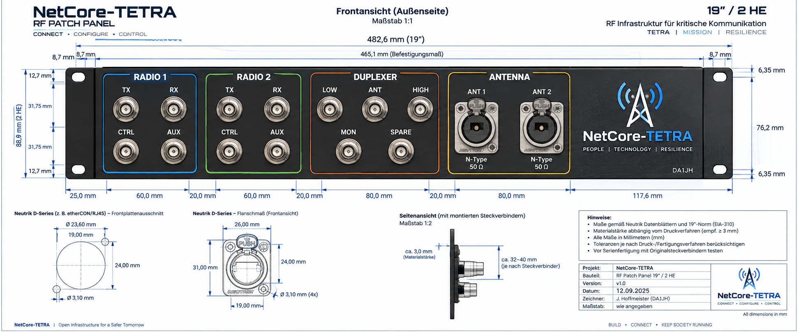
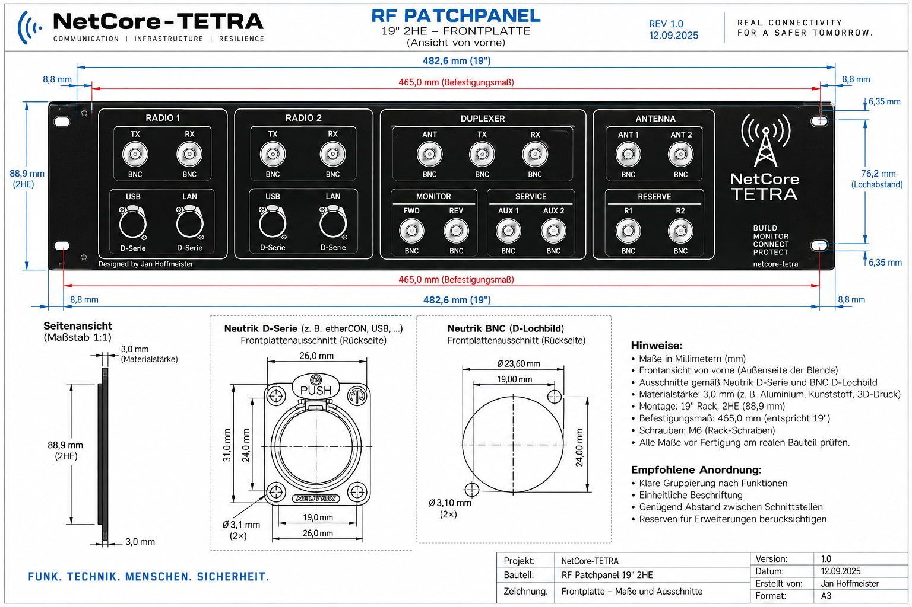
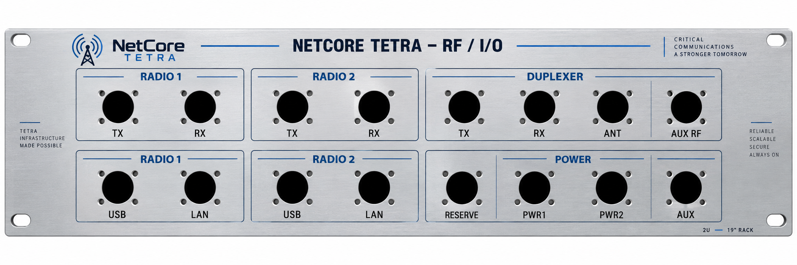

# Brainstorming: Mobile TBS – Koaxkabel, Antennen und RF-/I/O-Patchpanel

**Archivhinweis, 09.10.2026:** Diese Datei dokumentiert das im Titel beziehungsweise Quellenrahmen genannte Gespräch und dessen damalige Entscheidungen. Historische Kommandos, Planungen, Versionsangaben und Fehlerbilder bleiben erhalten; der heutige technische Stand steht in der [Gesamtroadmap](../roadmaps/gesamtroadmap.md) und in den [aktuellen Dienstanleitungen](../services/README.md). Die Archivaufnahme bestätigt keine spätere Implementierung oder Live-Abnahme.

> **Ergebnis:** Für die portable TBS in einer Großstadt wurde Aircell 7 gegenüber Ecoflex 10 als praktischer Kompromiss bevorzugt. Eine bezahlbare Rundstrahlantenne für Mast/Stativ blieb gesucht; ein Kauf oder erfolgreicher Antennenbetrieb ist nicht belegt. Später entstanden für das RF-/I/O-Patchpanel echte mehrteilige, mehrfarbige 3MF-Konstruktionsdateien. Diese sind verfügbar und rechnerisch dokumentiert, aber weder als erfolgreich gedruckt noch als mechanisch oder elektrisch abgenommen bestätigt. Die frühere pauschale Empfehlung **ATTB 4930.01 für 380–470 MHz** ist angesichts der am Prüfdatum gelesenen **380–410-MHz-Herstellerangaben** für einen TX bei 418 MHz **nicht ausreichend belegt**.

## Zielbild und Festlegungen

- Portable TBS für Großstadtbetrieb an Mast/Stativ; handhabbare Verkabelung und bezahlbarer Rundstrahler.
- **Aircell 7** ist der bevorzugte Kabelkompromiss. Ein Antennenmodell ist noch nicht verbindlich gewählt.
- Mehrteilige 3MF-Dateien mit getrennt einfärbbarer Platte, Schrift und Logo/Linien liegen vor.
- Offen: Antenneneignung bei **418 MHz**, 50-Ω-BNC-Auswahl, reale Druck-/Passprüfung und elektrische Abnahme.

## 1. Arbeitsstand und Quellenbasis

| Feld | Inhalt |
|---|---|
| Projekt | NetCore-Tetra |
| Thema | Koaxauswahl, Antennenbudget, portable Mastaufstellung, SMA/BNC/N-Verkabelung und mehrfarbiges 19-Zoll-/2-HE-Patchpanel für Dual-SDR |
| Planungszeitraum | Der kontinuierlich übertragene Antennenabschnitt enthält keine verlässlich zugeordneten Entwurfsdaten. Projektkontext und Dateimetadaten ordnen die Patchpanel-Arbeiten dem **12.09.2026** zu. Die am Prüfdatum vorliegende Druckpaket-Dokumentation nennt **03.10.2026**. Dies sind getrennte Quellenangaben, keine lückenlose Zeitachse. |
| Erstellungsdatum dieser Notizen | **2026-10-04**, Zeitzone **Europe/Berlin** |
| Repository | `JanHG98/netcore-tetra` |
| Gelesener Ausgangsstand von `Archiving` | **`6d375aa9035ec8c8a346373c23fc2b3483798d2e`** |
| Tree dieses Ausgangsstands | `32cac72e36ff330d86842a62871b9f8153788514` |
| Zusätzlich gelesener geprüfter Standardbranch | **`main`**, Commit **`7137e0dd69877e1b604bf89148fd8b6b590c1a97`**, Tree `e68558c4df13d3d8b56df8c3611ac682b02889c1` |
| Archivdatei | `Docs/archive/2026-10-04_mobile-tbs-koax-antennen-und-3d-druck-rf-patchpanel.md` |
| Index | `Docs/archive/README.md` |
| Zugehörige Binärdateien und Quellauszüge | `Docs/archive/assets/2026-10-04_mobile-tbs-koax-antennen-und-patchpanel/` |

### 1.1 Was tatsächlich zugänglich war

Die Quellenbasis besteht aus vier Ebenen:

1. **H1 – Koax- und Antennenplanung:** Händlerdaten, Festlegung auf eine mobile TBS, etwa 130 Euro Kabelkosten, Großstadt/Mast/Stativ, zwei Antennendatenblöcke und Kathrein-Referenz. Der frühe Planungsstand ist unvollständig.
2. **H2 – Patchpanel-Anforderungen:** korrigierte Maße, echte 3MF-Dateien mit getrennt einfärbbarer Schrift und Platte; drei ZIP-/3MF-Referenzen.
3. **H3 – ergänzende Planungsfragmente:** SMA/BNC/N, vorhandene 20-m-Leitungen, Patchkabelmengen, Funktionsgruppen und Servicezubehör. Widersprüchliche Portzahlen bleiben offen.
4. **R – Artefakt- und Repository-Prüfung vom 04.10.2026:** verfügbare Druckpakete und relevante HF-Konfigurationen an den angegebenen Commits.

Originale Produktkarten, Produkt-IDs und das im Druckpaket erwähnte Neutrik-Maßblatt fehlen. Drei verfügbare Konzeptbilder sind als Assets erhalten; sie ersetzen das Maßblatt nicht.

### 1.2 Verbindliche Statuskonvention

| Status | Bedeutung in diesem Archiv |
|---|---|
| **Idee** | Erwogen oder vorgeschlagen; keine verbindliche Auswahl. |
| **Beschlossen/geplant** | Ausdrückliches Planungsziel oder akzeptierte Richtung; noch kein Umsetzungsnachweis. |
| **Implementiert** | Konkretes Artefakt oder konkreter Repository-Inhalt vorhanden. Bei CAD bedeutet dies nur konstruiert, nicht gefertigt. |
| **Getestet** | Benannter tatsächlich ausgeführter Test mit Ergebnis und begrenztem Prüfumfang. |
| **Im Betrieb bestätigt** | Nachvollziehbare dokumentierte Bestätigung des realen Einsatzes. |

Eine Empfehlung ist keine Bestellung. Ein Konfigurationswert beweist keine aktive Gerätefrequenz. Eine vorhandene 3MF beweist keinen gelungenen Druck. Ein fremdes Prüfprotokoll wird als **mitgeliefertes Quellartefakt**, nicht als zum Prüfdatum erneut ausgeführter Test ausgegeben.

## 2. Ziel, Ausgangslage und endgültige Anforderungen

Gesucht war eine bezahlbare HF-Kette für eine **mobile beziehungsweise transportable TBS**, die nach dem Transport an einem **portablen Mast oder Stativ in einer Großstadt** aufgebaut werden soll. Der Schwerpunkt lag auf einem praktikablen Rundstrahler und handhabbaren Kabeln statt einer kostspieligen professionellen Festinstallation. Später wurde die rackinterne Verkabelung um ein selbst gedrucktes und klar beschriftetes Patchpanel ergänzt.

| Anforderung / Festlegung | Nachweis und Stand |
|---|---|
| TETRA-Anwendung | Ausdrücklich genannt. „Datenlastig“ war die Einordnung des Anwendungsfalls; daraus folgt kein eigener Koaxstandard. |
| Portable TBS, Großstadt, Mast/Stativ | Ausdrücklich genannt; kein konkreter Aufstellort, Masttyp oder Höhenwert beschlossen. |
| Kostenbewusstsein | Kabel kosten laut Kostenangabe bereits rund **130 Euro**; gesucht wird eine bezahlbare Antenne. Kein endgültiges Gesamtbudget vereinbart. |
| Aircell 7 als mobile Kabelrichtung | Ausdrücklich als sinnvoll eingeschätzt und in der Planung beibehalten. Kauf, Konfektionierung und Messung nicht belegt. |
| Rundstrahlantenne | Planungsrichtung und Kathrein-Referenz; keine abschließende Modellbestellung sichtbar. |
| Antenne ähnlich Kathrein K751121 | Ausdrücklicher Vergleichswunsch „Sowas in Bezahlbar“; keine Festlegung auf Kathrein. |
| 10 m Kabel | Vergleichslänge des Antennendialogs. Ergänzende Recherche nennt später vorhandene **20-m-Leitungen**; diese Angaben dürfen nicht ungeprüft zu einer einzigen Leitung zusammengezogen werden. |
| Steckersysteme | SDR: SMA-Buchsen; Duplexer: BNC-Buchsen; Patchfeld: BNC-Buchsen auf beiden Seiten; Antennenweg: N. Genaue Artikelnamen und manche Stecker-/Buchsenrichtungen bleiben abzugleichen. |
| Panel selbst drucken | Planungsziel; Platte, Beschriftung, Logo und Gruppierungsrahmen gehören dazu. |
| Funktionale Gruppierung | RADIO 1 und RADIO 2 je als vertikaler Block: TX/RX oben, USB/LAN unten; DUPLEXER eigener Bereich, POWER darunter. |
| Spätere Korrektur der Ausgabeform | Maße korrigieren; keine weiteren Konzeptbilder. Anschließend ausdrücklich echte mehrfarbige **3MF** gewünscht, mit separat zuweisbaren Farben für Platte und Schrift. |
| Keine eigenen ANT1-/ANT2-Patchbuchsen | In ergänzenden Verlaufstreffern als Korrektur bewahrt; Direktantennen über vorhandene SDR-Patchports. Das spätere 3MF-Layout hat ebenfalls keinen separaten ANT1-/ANT2-Block. |

Nicht verbindlich festgelegt: Antennenmodell, Stückzahl/Zuordnung der Antennen für diesen Teilaufbau, reale TX-Leistung, Duplexer-Typ und Abstimmung, endgültige Koaxlängen, konkrete Neutrik-Artikel, POWER-Ausführung, Filament, Lastaufnahme und Mastbefestigung.

## 3. Historischer Verlauf und ersetzte Empfehlungen

### 3.1 Kabelentscheidung

Die zunächst pauschale Bevorzugung von Ecoflex 10 wurde für den Einsatzfall **mobile TBS** revidiert: Aircell 7 ist wegen geringeren Gewichts und kleinerer Biegeradien der praktikablere Kompromiss. Die spätere portable Mast-/Stativnutzung bestätigte diese Richtung.

**Bewahrter Planungsstand:** Aircell 7 ist ein plausibler Kompromiss für kurze, häufig gehandhabte Leitungen. Die frühere Aussage „bei TETRA immer Ecoflex“ ist **überholt**. Ebenso ist die spätere Gegenbehauptung, Ecoflex sei eine „Laborlösung“ oder mobil grundsätzlich unpraktisch, **nicht belastbar**. Beide genannten Kabel haben einen flexiblen Litzeninnenleiter; keine Ausfall- oder Biegelebensdauer wurde gemessen.

### 3.2 Antennenentscheidung

1. Eine unbekannte, abstimmbare 365–470-MHz-5/8-Groundplane wurde diskutiert und für den portablen Aufbau grundsätzlich als Kandidat angesehen.
2. Eine 2-m-/70-cm-Dualbandantenne mit 255 cm Länge wurde zunächst verworfen. Die Begründung bezog sich dabei überwiegend auf BOS-Frequenzen um 380/390 MHz und war nicht sauber auf den NetCore-Frequenzkontext abgestimmt.
3. Budget, Großstadt und Mast/Stativ wurden als Randbedingungen ergänzt. Mehrere nur teilweise identifizierbare Budgetprodukte wurden vorgeschlagen.
4. Kathrein K751121 wurde ausdrücklich als Form-/Qualitätsreferenz verlinkt.
5. Als letzte Antennenidee wurde **ATTB 4930.01 + Aircell 7** als günstige Alternative genannt, mit unbelegtem Bereich 380–470 MHz. Eine verbindliche Festlegung für dieses Modell fehlt.

**Zusätzliche Korrektur am Dokumentationstag:** Die modellgenaue ATTB-Herstellerseite und das zugehörige Datenblatt nennen 380–410 MHz. Der im Repository eingetragene Downlink liegt bei 418 MHz. Deshalb bleibt die damalige Empfehlung **historisch dokumentiert, technisch aber für diesen Frequenzplan unbestätigt**. Keine stille Umdeutung in eine andere ATTB-Variante.

### 3.3 Patchpanel und echte Druckdateien

Frühe KI-Konzeptgrafiken enthielten zusätzliche ANT1/ANT2-/Monitor-/Serviceports, inkonsistente Anschlussdarstellungen sowie falsche oder ungeprüfte Lochbilder. Die späteren Anforderungen konzentrierten sich auf die richtige Gruppierung und bemaßte, tatsächlich druckbare Konstruktion.

Das am Prüfdatum vorliegende Paket enthält eine **19-Zoll-/2-HE-Konstruktion in zwei Hälften**, echte Volumennetze für Platte, Schrift und Akzente, einen Neutrik-Passformtest, Verbindungsteile und STL-Ausweichdateien. Es korrigiert die frühen Konzeptmaße und ist der greifbare **CAD-Artefaktstand**. Die alten Bilder bleiben historische Designstufen und dürfen nicht wieder zur Fertigungsgrundlage werden.

## 4. Koaxkabel: überlieferte technische Daten und Berechnungen

### 4.1 Händlerangaben aus den Arbeitsnotizen

Die folgende Tabelle bewahrt die ausdrücklich eingefügten Händlerdaten. Produktversion, Herkunft und Messbedingungen wurden nicht unabhängig an den konkreten gelieferten Kabeln überprüft.

| Merkmal | Ecoflex 10 | Aircell 7 |
|---|---|---|
| Preis als Meterware im damaligen Angebot | **5,90 €/m** | **3,60 €/m** |
| Außendurchmesser | 10,2 mm | 7,3 mm |
| Impedanz | 50 Ω | 50 Ω |
| Innenleiter | 7-adrige Kupferlitze, 2,9 mm | Kupferlitze; Durchmesser nicht genannt |
| Dielektrikum | PE-LLC | Geschäumtes PE-Compound mit laut Händler über 50 % Luftanteil |
| Schirmung | Kupferfolie und Kupfergeflecht | Kupferfolie und Kupfergeflecht |
| Folienaufbau | Überlappende, innen PE-beschichtete Kupferfolie | Überlappende, innen PE-beschichtete Kupferfolie |
| Außenmantel | Elastisches, UV-stabilisiertes PVC, schwarz | UV-stabilisiertes PVC, schwarz |
| Verkürzungsfaktor | 0,86 | 0,83 |
| Kapazität | 77 pF/m | 74 pF/m |
| Genannter minimaler Biegeradius | 40 mm | 25 mm |
| Einsatztemperatur | −40 bis +85 °C | −30 bis +80 °C |
| DC-Widerstand Innenleiter | 0,32 Ω/100 m | 0,86 Ω/100 m |
| DC-Widerstand Außenleiter | 0,84 Ω/100 m | 0,85 Ω/100 m |
| Gewicht | 13,1 kg/100 m | 7,2 kg/100 m |
| Angegebenes Schirmungsmaß | 90 dB bei 1 GHz | Kein Zahlenwert im überlieferten Datenblock |
| Spannungsfestigkeit | 1 kV | Nicht genannt |
| Im Beschreibungstext genannter Einsatzbereich | Bis 6 GHz | Bis 3 GHz; trotzdem Dämpfungstabelle bis 6 GHz mitgeliefert |

Die kleinen Biegeradien sind **keine geprüfte Freigabe für dauernde Bewegung** an genau diesem Radius. Bei Konfektionierung, Lagerung und mobiler Handhabung zwischen einmaliger Biegung und wiederholter Bewegung unterscheiden; passende Stecker und Zugentlastung bestimmen die tatsächliche Handhabbarkeit.

### 4.2 Dämpfungstabellen aus dem Händlertext

Einheit jeweils **dB/100 m**. Ecoflex wurde ausdrücklich bei **20 °C** angegeben; für die Aircell-Tabelle fehlt im eingefügten Text eine Temperatur. Striche bedeuten „nicht angegeben“, nicht null Verlust.

| Frequenz | Ecoflex 10 | Aircell 7 |
|---|---:|---:|
| 5 MHz | 0,8 | 1,6 |
| 10 MHz | 1,2 | 2,2 |
| 50 MHz | — | 4,5 |
| 100 MHz | 4,0 | 6,3 |
| 144/145 MHz | 4,8 bei 145 | 7,6 bei 144 |
| 200 MHz | — | 9,0 |
| 300 MHz | 7,3 | 11,2 |
| 432/433 MHz | **8,9 bei 433** | **13,6 bei 432** |
| 500 MHz | — | 14,7 |
| 800 MHz | — | 19,0 |
| 1 GHz | 14,2 | 21,5 |
| 1,3 GHz | 16,5 | 24,8 |
| 1,5 GHz | 17,9 | 27,1 |
| 1,8 GHz | — | 30,0 |
| 2 GHz | 21,2 | 31,9 |
| 2,4 GHz | 23,6 | 35,6 |
| 3 GHz | 27,0 | 40,1 |
| 4 GHz | 32,2 | 49,1 |
| 5 GHz | — | 57,0 |
| 6 GHz | — | 65,0 |

### 4.3 Angegebene Belastbarkeit

Ecoflex-Werte gelten laut Händler bei **40 °C**. Beim Aircell-Datenblock fehlen Temperatur und weitere Betriebsbedingungen. Diese Werte sind **keine Leistungsangabe der TBS** und keine gemeinsame Freigabe der kompletten Kette einschließlich Steckern und Antenne.

| Frequenz | Ecoflex 10 | Aircell 7 |
|---|---:|---:|
| 10 MHz | 3960 W | 2040 W |
| 100 MHz | 1210 W | 620 W |
| 500 MHz | 510 W | 260 W |
| 1 GHz | 350 W | 180 W |
| 2 GHz | 230 W | 120 W |
| 3 GHz | 180 W | 90 W |
| 4 GHz | 150 W | — |
| 5 GHz | 130 W | — |
| 6 GHz | 120 W | — |

### 4.4 Verlust-, Preis- und Laufzeitvergleich

Die folgenden Werte wurden bei der Quellenprüfung aus den überlieferten Tabellen **neu nachgerechnet**, nicht gemessen. Die Werte bei 432/433 MHz dienen als Näherung für den diskutierten UHF-Bereich; sie sind keine exakt bestätigte Dämpfung bei 408 oder 418 MHz.

`L_Kabel = Dämpfung_pro_100m × Länge / 100`

`P_am_Ende / P_am_Anfang = 10^(−L_Kabel/10)`

| Länge | Ecoflex-Verlust | Aircell-Verlust | Differenz | Ecoflex-Meterware | Aircell-Meterware |
|---|---:|---:|---:|---:|---:|
| 5 m | 0,445 dB | 0,680 dB | 0,235 dB | 29,50 € | 18,00 € |
| 10 m | **0,890 dB** | **1,360 dB** | **0,470 dB** | **59,00 €** | **36,00 €** |
| 20 m | 1,780 dB | 2,720 dB | 0,940 dB | 118,00 € | 72,00 € |

Auf 10 m bleiben rechnerisch etwa **81,47 %** beziehungsweise **73,11 %** der eingespeisten Leistung am Kabelende. Ecoflex liefert damit rund 11,4 % mehr Endleistung als Aircell bezogen auf Aircell; das ist **keine entsprechende prozentuale Reichweitenzusage**. Stecker, Patchfeld, Filter/Weiche und Fehlanpassung sind nicht in dieser Rechnung enthalten. Die erwähnten 130 Euro Gesamtkabelkosten lassen sich ohne vollständige Bestellung nicht aus dem einzelnen 10-m-Beispiel rekonstruieren.

Bei 10 m beträgt die Kabel-Laufzeit aus den genannten Verkürzungsfaktoren etwa **38,79 ns** für Ecoflex und **40,19 ns** für Aircell. Diese Differenz erklärt keine pauschal behaupteten TDMA-Probleme. Der TETRA-TDMA-Rahmen hat nach EN 300 392-2, Abschnitt 9.3.4, vier Slots und ungefähr 56,67 ms Dauer; vgl. Abschnitt 11.

## 5. Antennen: überlieferte Spezifikationen und korrigierte Bewertung

### 5.1 Unbekannte abstimmbare 5/8-Groundplane

| Parameter | Ausdrücklich genannter Wert |
|---|---|
| Frequenzbereich | **365–470 MHz, abstimmbar** |
| Maximale Sendeleistung | 150 W |
| Gewinn | 2,5 dBd / 4,65 dBi |
| SWR bei Mittenfrequenz | 1,2:1 |
| Bandbreite | 15 MHz; Klammerangabe „365,5 MHz, SWR 1:1,5“ ist in der Vorlage mehrdeutig |
| Elektrische Länge | 5/8 λ |
| Gesamthöhe | Maximal 99 cm |
| Radials | Vier, jeweils ungefähr 20 cm |
| Anschluss / Impedanz | N-Buchse / 50 Ω |
| Mastdurchmesser | 35–54 mm |
| Gewicht | Ungefähr 730 g |

**Historischer Status:** Als sinnvolle portable Rundstrahl-Kandidatin empfohlen; exaktes Modell und Kaufpreis fehlen. Keine Abstimmung, Messung oder Bestellung belegt.

**Fachliche Einordnung:** „Abstimmbar 365–470 MHz“ bedeutet nicht automatisch, dass die Antenne gleichzeitig über diesen ganzen Bereich angepasst ist. Für die gemeinsame Abdeckung von 408 und 418 MHz müsste die reale, richtig abgestimmte Bandbreite beide Frequenzen einschließlich der genutzten Träger erfassen. Die genannte 15-MHz-Bandbreite lässt das grundsätzlich als Prüfgegenstand erscheinen, beweist es aber nicht. Eine rechnerische Mitte wäre etwa 413 MHz; ein konkreter Strahlerzuschnitt wurde nicht beschlossen.

Die Umrechnung 2,5 dBd + 2,15 = 4,65 dBi ist schlüssig. Aus dem Datenblock allein folgen weder gemessener Wirkungsgrad noch ein geprüftes Strahlungsdiagramm. Die rund 20 cm langen Radials wurden früher pauschal als kurz bezeichnet; sie liegen bei etwa 400 MHz bereits in der Größenordnung einer Viertelwelle. Radialwinkel und Montage sind nach dem **tatsächlichen Modell**, nicht nach einer universellen 30–45°-Regel festzulegen.

### 5.2 Unbekannte Dualbandantenne 2 m / 70 cm

| Parameter | Ausdrücklich genannter Wert |
|---|---|
| Optimierte Bereiche / Gewinnangaben | 144–146 MHz: 6 dB; 430–440 MHz: 8 dB |
| SWR im Hauptbereich | Besser als 1,5:1 |
| Erweiterter Bereich bei SWR 2:1 | 139–148 MHz und **415–450 MHz** |
| Maximale Sendeleistung | 200 W |
| Elektrische Länge | 4 × 5/8 λ auf 70 cm, 2 × 5/8 λ auf 2 m |
| Höhe | Etwa 255 cm |
| Radials | Drei, etwa 5 cm |
| Mastdurchmesser | 30–46 mm |
| Maximal genannte Windgeschwindigkeit | 50 m/s |
| Anschluss / Gewicht | N-Buchse / etwa 1 kg |

Die „dB“-Gewinnangaben nennen in der Vorlage keine Bezugsantenne; sie dürfen nicht stillschweigend als dBd oder dBi verglichen werden.

**Historisch abgelehnt**, damals mit Bezug auf BOS um 380/390 MHz. Für den geprüften NetCore-Beispielplan ist die konkrete Prüfung anders: **418 MHz TX liegt innerhalb des erweiterten 415–450-MHz-Bereichs, 408 MHz RX außerhalb.** Damit ist die gemeinsame Eignung für das Frequenzpaar weiter unbestätigt. Die Aussage, jede Amateurfunkantenne sei grundsätzlich für TETRA ungeeignet, ist falsch; Frequenzgang, Anpassung, Richtdiagramm und Belastbarkeit entscheiden, nicht die Produktkategorie.

Ein hohes nominelles Gewinnmaß allein ersetzt keine Prüfung auf den tatsächlichen Uplink und Downlink. Ein enges vertikales Diagramm kann außerdem in urbaner Umgebung andere Abdeckungsprobleme erzeugen als ein Rundstrahler mit moderatem Gewinn. Hierzu wurden keine Pattern- oder Abdeckungsmessungen durchgeführt.

### 5.3 Kathrein K751121 als Referenz

Referenzlink: [Kathrein K751121, 406–470 MHz](https://www.funkhandel.com/Kathrein-K751121-Feststationsantenne-406-470-MHz-0dB).

Gesucht war eine **vergleichbare bezahlbare Bauform**, nicht die Bestellung dieses Modells. Die am Prüfdatum vorliegende verlinkte Angebotsseite nennt 406–470 MHz, N-Buchse und die Kennzeichnung 0 dB / 2 dBi; sie führt den Nachfolger Huber+Suhner K862232 und zeigte beim Abruf 416,50 Euro. Das ist ein **zusätzlicher geprüfter Angebotsbefund**, keine damalige Preisfestlegung oder Lieferzusage. Die frühere Preisschätzung „150–300 Euro“ war kein belastbares Angebot.

Die nominelle Frequenzangabe deckt den geprüften 408/418-MHz-Beispielplan ab. Das beweist weder die Eigenschaften eines konkreten gebrauchten Exemplars noch die Abnahme der eigenen Installation. Eine ältere Kathrein-Unterlage wurde zusätzlich als Hersteller-PDF auf einem Vertriebsmirror gefunden; daraus wurde hier keine neue vollständige Modellspezifikation abgeleitet.

### 5.4 ATTB 4930.01: historische Empfehlung und geprüfter Quellenwiderspruch

Die Planung nannte **ATTB 4930.01 + Aircell 7**, bezeichnete das Modell als 380–470-MHz-Lösung und nannte ungefähr 60–64 Euro. Eine Bestellung oder ausdrückliche Modellfreigabe ist nicht vorhanden.

**Heute zusätzlich geprüft:** Die modellgenaue [ATTB-Herstellerseite](https://produkte-attb.de/4930.01-Stationsantenne-TETRA/4930.01) nennt **380–410 MHz**, ein fest verbundenes HF-Kabel und Montage an Kunststoffflächen. Das [Herstellerdatenblatt, Release 25.01.2024](https://antennenshop.com/static/pic/2241.pdf) nennt:

| Parameter | Modellgenauer Herstellerbefund |
|---|---|
| Frequenz | **380–410 MHz** |
| Impedanz / Anpassung | 50 Ω / ≤ 2,0:1 |
| Gewinn | 2 dBi |
| Maximale Leistung | 20 W |
| Kabel / Anschluss | **5 m RG58**, FME-Buchse |
| Baugröße / Gewicht | 25 × 370 × 25 mm / 0,385 kg |
| Schutzart / Temperatur | IP54 / −40 bis +75 °C |

Die [PUC-Vertriebsseite](https://antennenshop.com/de/stationsantenne_tetra_380_470_mhz_;_5_0m_rg_58_fme_f_380_470mhz_5m_rg58_fme_f_-4930.01.html) hat weiterhin **380–470 MHz im Titel**, nennt im technischen Text aber **380–410 MHz**; sie zeigte 63,90 Euro inklusive MwSt. zuzüglich Versand und weist sich als Fachhändlershop aus. Breitere Produktfamilienangaben lösen die modellgenaue Abweichung nicht auf.

**Folgerung, keine Messung:** Bei 418 MHz liegt der TX außerhalb der gelesenen modellgenauen Spezifikation. Das Modell kann daher für diesen TBS-Frequenzplan nicht unverändert als bestätigte Kaufempfehlung übernommen werden. Vor einer Auswahl wären Variante/Frequenzdaten mit Hersteller oder Händler zu klären. Der fest montierte RG58-Weg bleibt zudem Bestandteil des Verlustbudgets; eine zusätzliche Aircell-Verlängerung entfernt diese 5 m nicht. Metallmastnähe und FME-/N-Übergang sind weitere konkrete Anpassungspunkte. Die RG58-Dämpfung wurde mangels eindeutiger Kabelausführung nicht erfunden.

### 5.5 Weitere historische Budgetideen

| Idee | Damaliger Kontext | Bewahrte Einschränkung |
|---|---|---|
| HYS-Yagi, 400–470 MHz, angeblich 9 dBi | Als günstige Alternative vorgeschlagen | Produktkarte ohne verifizierbares exaktes Modell; Richtwirkung passt nicht automatisch zur gewünschten Rundumversorgung. |
| Unbekannter TETRA-Strahler, 380–430 MHz, etwa 2 dBi | Angeblich etwa 40–45 Euro | Nur Produktvorschlag, keine vollständige Modell-/Montagespezifikation. |
| Groundplane, 410–470 MHz | Angeblich etwa 90 Euro | Wenn 410 MHz tatsächlich Untergrenze ist, wäre 408 MHz RX nicht abgedeckt; keine Modellbestätigung. |
| LMR-400 / LMR-400UF, Aircell 10, Aircom Premium | Kabelalternativen andiskutiert | Keine konkret ausgewählte Ausführung, Bestellung oder Messung. |
| Antennenleitung auf 5–7 m verkürzen | Spar-/Verlustidee | Nur sinnvoll, wenn die gewünschte Mastposition damit erreichbar bleibt. Nicht als geänderte Anforderung behandeln. |

Die überlieferten Produktkarten waren teilweise leer beziehungsweise fehlerhaft formatiert. Daraus lassen sich keine belastbaren Preise, Verfügbarkeiten oder Produktspezifikationen rekonstruieren.

## 6. Fachliche Korrekturen früherer Aussagen

| Frühere Aussage / Vereinfachung | Gültiger Archivstand |
|---|---|
| TETRA sei besonders „datenlastig“ und verlange deshalb grundsätzlich dickeres Koax. | Kabeldimensionierung folgt Frequenz, Länge, Verlustbudget, Leistung und Mechanik. TDMA und digitale Modulation schaffen keinen eigenen Kabeltyp. |
| 0,5 dB entscheide grundsätzlich zwischen stabil und unbrauchbar. | 0,47 dB ist eine reale Reserveänderung. Ob sie relevant wird, hängt vom konkreten Linkbudget ab; kein Grenzpegeltest vorhanden. |
| Weniger DC-Innenleiterwiderstand beweise bessere HF-Eigenschaften insgesamt. | DC-Widerstand ist kein vollständiger UHF-Verlust-/Schirmungsnachweis. Die angegebenen Dämpfungswerte sind für den Vergleich geeigneter. |
| Ecoflex sei besser geschirmt, weil es dicker ist. | Für Aircell fehlt ein numerischer Schirmungswert. Ein belastbarer Vergleich ist aus diesen Angaben nicht möglich. |
| Aircell habe als einziges Kabel einen flexiblen Innenleiter. | Beide beschriebenen Kabel verwenden Kupferlitze. |
| Schlechte Stecker kosteten immer 0,2–0,5 dB pro Übergang. | Ohne Typ, Zustand und Messung gibt es keinen allgemeinen Verlustwert. Passende, richtig montierte Steckverbinder können deutlich günstiger im Verlustbudget liegen. |
| Crimpen sei eine Billiglösung. | Herstellerkonforme Crimp-, Klemm- und Lötverfahren sind unterschiedliche fachgerechte Verfahren; Ausführung entscheidet. |
| Viertelwellenantennen seien eine Notlösung, 5/8 λ genau die richtige TETRA-Bauform. | Beide können geeignet sein. Anpassung, Wirkungsgrad und horizontales/vertikales Diagramm sind modell- und montageabhängig. |
| 4–5 m Höhe seien optimal; +2 m brächten mehr als +3 dB. | Plausible Aufstellidee, aber ohne Standort und Messung keine allgemeine Zahl. Höhe, Abschattung, Mastgrenzen und gewünschte Nahversorgung gemeinsam prüfen. |
| Kleine Koaxschleife am Fußpunkt beseitige Mantelwellen. | Eine Schleife allein ist keine nachgewiesene UHF-Mantelwellensperre. Keine Sperrimpedanz gemessen. |
| Durch die Montage ließen sich pauschal 20–30 % oder 80–90 % Leistung gewinnen. | Unbelegte Prozentangaben werden nicht als Projektziel oder Testergebnis übernommen. |
| Alle TETRA-Aufbauten seien BOS-380/390-MHz-Aufbauten. | Der am Prüfdatum gelesene NetCore-Beispielstand ist 408/418 MHz. Reale Betriebsfrequenzen gesondert erfassen. |
| ATTB 4930.01 decke das benötigte Band sicher ab. | Modellgenaue Herstellerangaben nennen 380–410 MHz; 418-MHz-TX-Eignung nicht belegt. |
| Ein gut aussehendes Patchpanel-Bild sei eine passende technische Zeichnung. | Frühe KI-Grafiken enthalten Fehler. Fertigungsgrundlage sind überprüfte CAD-Geometrie und die konkreten Buchsendaten. |

Für SWR allein ergeben sich rechnerisch folgende Werte: 1,2:1 → etwa 0,83 % reflektierte Leistung / 0,036 dB Fehlanpassungsverlust; 1,5:1 → 4 % / 0,177 dB; 2:1 → 11,11 % / 0,512 dB. Das sind einfache 50-Ω-Modellrechnungen. SWR beweist weder Antennengewinn noch Richtdiagramm oder ungestörten TBS-Empfang bei eigenem TX.

## 7. HF-Architektur, Schnittstellen und ergänzend recherchierte Kabelplanung

### 7.1 Komponenten und mögliche Signalwege

| Komponente | Aufgabe / Schnittstelle | Stand und Abhängigkeit |
|---|---|---|
| TBS-Rechner / SDR beziehungsweise SXceiver | TETRA-Basisstationsfunk; SMA-Geräteanschlüsse laut ergänzendem Verlauf | Konkrete mobile Hardwareversion, Treiber, Kanäle und Leistung nicht aus dieser Entwicklungsphase abgenommen. |
| RADIO 1 / RADIO 2 | Je TX/RX sowie USB/LAN im Panel | Zwei funktionale Geräteblöcke im 3MF vorhanden; nicht mit „zwei Carriern“ gleichsetzen. Zwei Träger können auch in einem SDR-Passband liegen. |
| RF-Patchfeld | BNC-Durchführungen | Beide Seiten als Buchsen beschrieben; Artikel und **50-Ω-Ausführung** prüfen. |
| Duplexer | TX/RX/ANT-Pfade | BNC-Buchsen im ergänzenden Verlauf; Typ, Isolation, Einfügedämpfung und Belastbarkeit unbekannt. |
| Antennenleitung | N-System, im Antennendialog Aircell-7-Richtung | Spätere vorhandene 20-m-Leitungen sind nicht eindeutig als Aircell identifiziert. |
| Antenne(n), portabler Mast | Vertikale Rundumversorgung | Modell und reale Aufstellung offen. |
| USB / LAN | Daten-/Netzwerkdurchführung | Exakte Neutrik-Ausführung und elektrische Anforderungen nicht festgelegt. Keine neuen TCP-/UDP-Ports aus diesem Panel abzuleiten. |
| POWER 1 / POWER 2 | Mechanisch vorgesehene Stromanschlusspositionen | Spannung, Buchsenmodell, Einbauraum und elektrische Ausführung offen. |

**Duplexer-Variante als Signalweg:** SDR-TX → passende SMA/BNC-Brücke → Patchfeld → Duplexer-TX; SDR-RX ← Brücke/Patchfeld ← Duplexer-RX; Duplexer-ANT → N-Antennenleitung → Antenne. Die exakte Zahl der Panelübergänge ist erst durch eine reale Port-zu-Port-Zeichnung bestimmt.

**Direktantennen-Variante als Idee:** Getrennte Antennenwege über vorhandene SDR-Patchports, ohne zusätzlichen ANT1-/ANT2-Frontplattenblock. Ein mechanisch mögliches Umstecken beweist keine ausreichende TX/RX-Entkopplung. Keine beiden aktiven TX-Ausgänge ohne geeignetes und spezifiziertes Kombinationsnetzwerk zusammenschalten.

Ein anderes bereits vorhandenes Archiv behandelt zwei Sirio SPO 380-2 und einen ausdrücklich ausgeschlossenen Duplexer. Es wird unter Abschnitt 13 als **separater Projektentwurf** verlinkt. Dessen Entscheidungen werden nicht stillschweigend auf die hier vorliegende Duplexer-/Patchpanel-Planung übertragen.

### 7.2 Ergänzend wiedergefundene Kabel-/Serviceideen

Die folgende Stückliste stammt aus fragmentarisch recherchierten **Empfehlungen**, nicht aus einer belegten Bestellung:

| Menge | Kabel / Teil | Länge / Einschränkung |
|---:|---|---|
| 5 | SMA-Winkel → BNC | Länge und endgültige Stecker-/Buchsenrichtung nicht vollständig verfügbar. |
| 4 | BNC → BNC | 30 cm |
| 6 | BNC-Winkel → BNC-Winkel | 30 cm |
| 3 | BNC → N-Buchse, Aircell 7 | 1 m |
| Offen | Zusätzliche Servicekabel und N-Kupplungen | Keine verlässliche Menge. |
| Offen | Kurze ULTRAFLEX-10-BNC/N-Leitungen | In einer früheren Fundstelle für zwei Antennen andiskutiert; Verhältnis zur später genannten Aircell-7-Liste nicht eindeutig. |

Bei Steckverbindern ist neben der Serie ausdrücklich **männlich/weiblich** zu dokumentieren. Die recherchierte Formulierung „Antenne und vorhandene 20-m-Kabel N-Stecker“ ist ohne Originalfoto mehrdeutig; sie wird nicht zum Nachweis eines ungewöhnlichen Antennenanschlusses umgedeutet.

**Widerspruch in der Portzählung:** Eine Fundstelle spricht von „nur 5 BNC-Ports“, nennt zugleich SDR1 TX/RX, SDR2 TX/RX sowie Duplexer TX/RX/ANT. Diese Aufzählung ergibt **sieben** RF-Funktionen, nicht fünf. Das am Prüfdatum vorliegende CAD zeigt diese sieben plus eine optionale AUX-RF-Position. Vor Bestellung die tatsächliche Anzahl abgleichen; die unvollständige Recherche ist keine Grundlage für ein automatisches Redesign.

Bewahrte Zubehörideen: 50-Ω-Dummyload, geeignete Dämpfungsglieder, TETRA-tauglicher Richtkoppler, DC-Block bei tatsächlich vorhandenem DC-Pfad, Überspannungsableiter, BNC-Schutzkappen, N-Kupplungen und VNA-Messung. Keine Beschaffung, Bemessung oder erfolgreiche Verwendung belegt. Ein DC-Block oder Ableiter wird nicht pauschal in jeden Pfad eingeplant.

## 8. RF-/I/O-Patchpanel: verfügbarer CAD-Artefaktstand

Quellstand ist das unverändert archivierte [Originalpaket](assets/2026-10-04_mobile-tbs-koax-antennen-und-patchpanel/NetCore_Tetra_Patchpanel_3MF_Paket.zip) mit [Druck-/Montage-README](assets/2026-10-04_mobile-tbs-koax-antennen-und-patchpanel/druck-und-montage.md). Die folgende Darstellung fasst **vorhandene Konstruktion** zusammen; sie macht daraus keine mechanische oder elektrische Freigabe.

### 8.1 Endgültiger im Paket vorhandener Funktionsplan

| Spalte | X-Mitte, mm | Oben | Unten |
|---:|---:|---|---|
| 1 | 48 | RADIO 1 TX | RADIO 1 USB |
| 2 | 94 | RADIO 1 RX | RADIO 1 LAN |
| 3 | 158 | RADIO 2 TX | RADIO 2 USB |
| 4 | 204 | RADIO 2 RX | RADIO 2 LAN |
| 5 | 274 | DUPLEXER TX | RESERVE |
| 6 | 320 | DUPLEXER RX | PWR 1 |
| 7 | 366 | DUPLEXER ANT | PWR 2 |
| 8 | 430 | AUX RF | AUX |

Dies ist eine **8-Spalten-/2-Reihen-Blende mit 16 Positionen**, nicht eine Behauptung von 16 bestellten Buchsen. AUX RF, RESERVE und AUX können mit den drei mitgelieferten Blindplatten geschlossen werden. RADIO 1 und RADIO 2 bilden je einen 2×2-Block; DUPLEXER und POWER sind getrennt beschriftet.

### 8.2 Tatsächliche Konstruktionsmaße

Bezugssystem: **Vorderansicht, linke Unterkante der tatsächlichen montierten Platte**, Einheit mm.

| Merkmal | Vorhandener Modellwert |
|---|---:|
| Gesamtbreite | **482,6** |
| Tatsächliche Plattenhöhe | **88,1** |
| Nominaler 2-HE-Bauraum | 88,9 |
| Freiraum im nominalen Raster | Je 0,4 oben/unten |
| Frontplattenstärke | **3,0** |
| Zusätzliche rückseitige Rippen | 6,0 |
| Gesamttiefe mit Rippen | **9,0** |
| Bündige Farbeinlagen | **0,6** tief |
| Breite je Druckhälfte | 241,2 |
| Mittelnaht / Fuge | 0,2 |
| Lochreihen, Y-Mitte | **22,1 / 63,1** |
| Reihenabstand | 41,0 |
| Große Anschlussausschnitte | **Ø 24,2** |
| Kleine Befestigungsbohrungen | **Ø 3,3** |
| Diagonales D-Schraubraster | **19,0 × 24,0** |
| Rack-Befestigungsraster X/Y | **465,1 / 76,2** |
| Rack-Langlöcher | 10,0 × 6,6 |
| Rückseitige Verbindungsplatte | **36 × 72 × 4** |
| Verbindungslöcher, X | 233,3 / 249,3 |
| Verbindungslöcher, Y | 14 / 44 / 74 |

Die zwei D-Befestigungsbohrungen liegen in der Vorderansicht **links oben und rechts unten**, jeweils ±9,5 mm in X und ±12 mm in Y zur Anschlussmitte. Die in alten Bildern enthaltene pauschale Vierlochdarstellung gilt nicht für dieses CAD-Lochbild.

Die Druck-README dokumentiert als zusätzlich geprüfte Referenz eine offizielle NE8FDP-Zeichnung mit mindestens Ø 24 mm und Befestigungsbohrungen ab Ø 3,2 mm. Die CAD-Zugaben Ø 24,2/3,3 mm sind **Konstruktionsentscheidungen für den ersten FDM-Prototyp**, keine bereits bestätigten Drucktoleranzen. Das früher gezeigte Ø-23,6-mm-Maß wird deshalb im Passformtest mitgeführt. Ein in früheren Unterlagen genanntes Befestigungsmaß 453,6 mm wird im am Prüfdatum vorliegenden Paket nicht verwendet; die drei hier archivierten Bilder liefern dafür keinen einheitlichen Beleg.

### 8.3 Mehrfarbigkeit, Druckorientierung und Druckbett

Je Hälfte sind drei getrennte Teile vorhanden:

| Namensende | Inhalt | Darstellungsfarbe des Pakets |
|---|---|---|
| `_Platte` | Platte einschließlich Rippen | Anthrazit |
| `_Schrift` | Titel und Anschlussbeschriftung | Weiß / hell |
| `_Logo_Linien` | Vereinfachtes Antennenlogo, Rahmen und Gruppenüberschriften | Blau |

Für zwei Farben erhalten Schrift und Logo/Linien dasselbe Filament; für drei Farben getrennte AMS-Zuordnung. Die Farben sind **voreingestellte Darstellung**, keine verpflichtende Farbfestlegung. Eine originale Logo-Vektordatei lag laut Paket nicht vor; das Logo ist eine vereinfachte Druckgeometrie.

Die Hauptdatei [NetCore_Tetra_Patchpanel_A1_Mehrfarbig.3mf](assets/2026-10-04_mobile-tbs-koax-antennen-und-patchpanel/NetCore_Tetra_Patchpanel_A1_Mehrfarbig.3mf) enthält beide Hälften als Baugruppen auf einem 256×256-mm-Layout. Modellgrenzen laut mitgeliefertem Prüfbericht: X 7,4–248,6, Y 10–196,1, Z 0–9 mm. **Brim, Spülturm und Slicer-Sperrflächen sind darin nicht mitvalidiert.**

Die beschriftete Front liegt im Drucklayout **nach unten**. Eine aus der Rückansicht spiegelverkehrt erscheinende Schrift ist nicht zusätzlich zu spiegeln. Die Teile einer Baugruppe nicht voneinander lösen, einzeln neu auf das Bett absenken oder separat automatisch anordnen: ihre relativen Positionen definieren die bündigen Einlagen.

Die 482,6-mm-Montageansicht ist **kein A1-Drucklayout**. Die beiden Einzelhälften und Zubehördateien im ZIP erlauben separate Druckläufe. STL-Dateien dienen nur als Ausweichformat: zusammengehörige Farbteile gemeinsam als ein Objekt mit mehreren Teilen importieren.

**Historisch vorgeschlagene, ungetestete Startparameter im Paket:** 0,4-mm-Düse, 0,20-mm-Schichten, 4–5 Wände, ungefähr fünf obere/untere Schichten, 30–40 % Infill und gegebenenfalls ungefähr 4 mm Außen-Brim. Diese Werte sind kein erprobtes Druckprofil. Drei 0,20-mm-Schichten entsprechen der 0,6-mm-Einlage. Die erste Schicht und dünne Schrift-/Logokonturen in der eigenen Slicer-Vorschau kontrollieren.

PLA+ wurde im Paket als Passformtest-Kandidat andiskutiert, PETG als möglicher Kandidat für die endgültige Blende. Keine konkrete Temperatur-/Lebensdauerfreigabe; keine ungeprüfte Kombination unterschiedlicher Materialfamilien für Platte und Einlagen. Bambu-A1-/AMS-Zuordnung und das eigene Profil müssen beim Slicen gesetzt werden; die Dateien sind **nicht gesliced**.

### 8.4 Mechanische Verbindung und offene elektrische Anforderungen

Das Paket schlägt sechs M3×12-Durchgangsschrauben mit Muttern und Unterlegscheiben für die rückseitige Verbindungsplatte vor; Längen am realen Aufbau prüfen. Rack-Langlöcher sind für übliche M6-Verschraubung vorgesehen. Verbindungsschrauben sind nicht automatisch passende Schrauben für Neutrik-Kunststoffgewinde.

Schwere Koaxleitungen und häufiges Patchen dürfen nicht ausschließlich an der gedruckten Mittelnaht ziehen. Ein Metallträger und gesonderte Zugentlastung sind **weiterhin Ideen**, keine enthaltene Lastfreigabe. Reale Racktemperatur, Verzug, Schichthaftung und Montagekräfte sind ungetestet.

**POWER bleibt vorläufig:** Das allgemeine D-Lochbild bestätigt keine Passung für jede powerCON-Variante. Genaue Artikel, Spannung, Gehäusekonturen und Anschlussraum fehlen. Eine Kunststoffblende ersetzt keine Schirmung, Schutzleiterführung oder ein geprüftes Stromanschlussgehäuse.

**BNC-Impedanz bleibt ein wichtiger Prüfpunkt:** Neutrik [NBB75DFI](https://www.neutrik.com/en/product/nbb75dfi) ist laut Hersteller tatsächlich **75 Ω**. D-Form oder mechanische Passung beweisen deshalb keine 50-Ω-HF-Eignung. Für die konkrete TBS-Kette müssen die eingesetzten BNC-Durchführungen ausdrücklich identifiziert werden; daraus folgt keine Behauptung, dass dieses 75-Ω-Modell bereits verbaut ist.

## 9. Historischer Planungsstand und Repository-Abgleich vom 04.10.2026

### 9.1 Heute tatsächlich gelesene Dateien

Die Repository-Trees von `Archiving` und `main` wurden ohne Abschneidung geladen. Die drei fachlich relevanten Dateien sind in beiden Prüfständen **blob-identisch**:

| Datei | Gelesener Befund | Blob-SHA in beiden Branches |
|---|---|---|
| `config.toml`, Anfang bis Zeile 185 | SoapySDR, TX/RX, Centerfrequenzen, Sample-Rate und Zellparameter | `3f54ad275b956699dd7b38de1b7d2c0711133c00` |
| `crates/tetra-core/src/freqs.rs` | Carrierformel und Duplexspacing-Tabelle | `aa8469b09ef10f28929d2771f1796277c4ca4006` |
| `wiki/Hardware-und-RF.md` | HF-Signalweg, passive/aktive Abnahme, Dual-Carrier-Beispiel, Gerätediagnose | `42d456630bdbdbd80f4843d87de5caf7cd8ab9f6` |

Es wurde keine mobile Geräteinstallation fernbedient. Keine Software gebaut und kein Hardwaretest ausgeführt. Die Quellenprüfung beinhaltet keinen vollständigen Codeaudit.

### 9.2 Eingetragener Beispiel-Frequenzplan

| Pfad / Schlüssel | Heute gelesener Wert |
|---|---|
| `[phy_io].backend` | `SoapySdr` |
| `[phy_io.soapysdr].tx_freq` | **418000000 Hz** |
| `[phy_io.soapysdr].rx_freq` | **408000000 Hz** |
| `sample_rate` | **600000 Samples/s** |
| `tx_center_freq` / `rx_center_freq` | **418012500 / 408012500 Hz** |
| `[net_info].mcc` / `mnc` | **901 / 1510** |
| `[cell_info].freq_band` | **4** |
| `main_carrier` / `secondary_carrier` | **720 / 721** |
| `duplex_spacing` / `freq_offset` | **0 / 0** |
| `reverse_operation` | **false** |
| `location_area` / `colour_code` | **1 / 1** |
| `timezone` | **Europe/Berlin** |

`FreqInfo::get_freqs()` bildet den Downlink aus `100 MHz × band + 25 kHz × carrier + offset`. Für Band 4, Carrier 720/721 ergeben sich **418,000 / 418,025 MHz**; die gelesene Duplexspacing-Tabelle liefert bei Index 0 und Band 4 **10 MHz** Abstand, also **408,000 / 408,025 MHz** Uplink. Die Center liegen dazwischen und sind keine zusätzlichen dritten Träger.

**Dokumentationsabweichungen:** Der Kommentar zu `duplex_spacing = 0` in `config.toml` nennt fälschlich **5 MHz**; ein Carrier-Kommentar enthält eine veraltete Rechnung mit **1521**, obwohl der aktive Wert **720** ist. Code und eingetragene Frequenzen passen zum 10-MHz-Plan. Diese Kommentare wurden durch den Dokumentationslauf nicht verändert; eine spätere Korrektur ist ein gesonderter Roadmap-Kandidat.

### 9.3 Aussagevergleich und Grenzen

| Historische Aussage / Erwartung | Überprüfter geprüfter Befund |
|---|---|
| Antennenauswahl nur aus „TETRA“ / BOS-Band ableiten | Am Prüfdatum vorliegende Beispielkonfiguration konkretisiert 408/418 MHz. |
| Aircell 7 oder ATTB sei im Projekt umgesetzt | In den geladenen Pfadverzeichnissen kein zuordenbarer Beschaffungs-/Mess-/Betriebsnachweis gefunden. Keine Aussage über jeden beliebigen Binärinhalt des gesamten Repos. |
| Mehrfarbiges Panel existiere nur als Bild | Am Prüfdatum vorliegende bereitgestellte ZIP-/3MF-Dateien sind vorhanden; echte Modellgeometrie und getrennte Farbteile nachgewiesen. |
| Druckdateien seien bereits in Git | Vor diesem Prüflauf kein entsprechender Patchpanel-3MF-/STL-/SCAD-Pfad im geprüften Repository-Tree gefunden. Dokumentation ergänzt die Dateien unter `Docs/archive/`; kein Hardware-Quellverzeichnis verändert. |
| HF-Abnahme sei erledigt | Hardware-Wiki fordert passive Kettenmessung und Empfangstest bei eigenem TX; Ergebnisse für diesen Aufbau fehlen. |
| AI-HAT sei nötig | Das Hardware-Wiki stellt klar, dass ein AI-HAT keine Voraussetzung des beschriebenen TETRA-Stacks ist. Keine Änderung dieser Planung. |

Die PA-Dateien unter `PA/` sind im Repository vorhanden; ihre Existenz beweist weder die Bestückung einer mobilen PA noch deren Ausgangsleistung. Für diesen Kabel-/Panel-Entwurf wurde kein Implementierungs-PR oder historischer Codecommit identifiziert. Die Dokumentationsänderung ist keine Funktionsimplementierung der Funkstation.

## 10. Fehler, Diagnose, Tests und erreichter Stand

### 10.1 Aufgetretene Probleme

| Problem | Diagnose / Ursache | Ergebnis / verbleibende Aufgabe |
|---|---|---|
| Kabel-/Antennenkosten | Kostenangabe: bereits ungefähr 130 Euro für Kabel | Aircell als Kompromiss; vollständige Stückliste und Gesamtkosten offen. |
| Übertriebene Koaxbewertung | Pauschale Digital-/TDMA-/Reichweitenaussagen ohne Messung | In Abschnitt 6 korrigiert; reales Verlustbudget fehlt. |
| Falscher Frequenzbezug bei Dualbandantenne | BOS-Annahme statt konkretem NetCore-Frequenzpaar | Heute 408/418-MHz-Abgleich getrennt dokumentiert. |
| ATTB-Frequenzwiderspruch | Shop-Titel 380–470 versus Modellseite/Datenblatt 380–410 MHz | Für 418-MHz-TX keine unveränderte Kaufempfehlung. Modell-/Variantenklärung offen. |
| Fehlerhafte Produkt-/Bildkarten | Leere IDs, kaputte Vergleichstabelle und nicht exportierte Karussellbilder | Nicht als reale Quellen oder Bilddateien ausgegeben. |
| Falsche alte Paneldarstellungen | Zusätzliche Ports, Vierlochflansche, Maß-/Anschlussfehler, Bilddatum 2025 | Korrigierte CAD-Konstruktion vorhanden; Originalbilder als historische Stufen bewahrt. |
| Widersprüchliche Portzahl | Recherche nennt fünf, zählt aber sieben RF-Funktionen auf | Keine Mengenfestlegung aus dem Fragment; CAD-Portplan als Artefaktstand festgehalten. |
| Nicht bestätigte Buchsenpassung | Artikelnummern insbesondere bei POWER fehlen | Passformtest und Artikelabgleich erforderlich. |
| 50-/75-Ω-Verwechslung möglich | Neutrik-D-BNC-Form sagt nichts über Impedanz | Tatsächliche Buchse prüfen, nicht alle D-BNC automatisch übernehmen. |

Es gibt hier **keinen dokumentierten realen Funkdefekt**, dessen Ursache nachweislich ein Kabel oder eine Antenne war. Allgemeine Aussagen über möglichen schlechten RSSI oder Aussetzer waren hypothetisch; sie sind keine Betriebsdiagnose.

### 10.2 Tatsächlich durchgeführte Prüfungen

| Prüfung | Ergebnis | Grenze / Herkunft |
|---|---|---|
| Drei Original-PNGs wiederhergestellt und geöffnet | Lesbar; 1942×809, 1536×1024 und 2172×724 Pixel | Zusätzliche Dateiprüfung und Sichtung; keine technische Genauigkeitsfreigabe. |
| Original-ZIP: CRC/ZIP-Integrität | `ZipFile.testzip()` ohne Fehler | Zusätzliche Dateiprüfung; kein CAD-/Slicer-/Lasttest. |
| SHA-256-Vergleich der sechs 3MFs im ZIP mit `3MF_Validierung.json` | Alle sechs stimmen mit dem mitgelieferten Bericht überein | Belegt Zuordnung der Dateien zum Bericht, nicht erneute Durchführung aller Berichtstests. |
| Separate Haupt-3MF und Passformtest gegen ZIP-Inhalt verglichen | Beide byte-identisch zu den gleichnamigen Dateien im Paket | Zusätzliche Datei-/Versionsprüfung. |
| 3MF-XML-Struktur der beiden separaten Dateien | Einheit Millimeter; Hauptdatei sechs Meshes, zwei Build-Baugruppen; Passformtest zwei Meshes, eine Build-Baugruppe | XML parsebar; kein Bambu-Studio-GUI-Import und keine neu erzeugten Druckbahnen. |
| Mitgeliefertes `3MF_Validierung.json` | Bericht vom 03.10.2026: lib3MF 1.8.1 und trimesh 4.11.1, Lesbarkeit, geschlossene/orientierte Netze, positive Volumina und Bettgrenzen für Drucklayouts als bestanden dokumentiert | **Übernommenes Prüfartefakt**, im Prüflauf nicht vollständig erneut nachgerechnet. Montageansicht ist ausdrücklich außerhalb des 256-mm-Bauraums. |
| Preis-/Dämpfungs-/SWR-/Laufzeitrechnungen | Zahlen in Abschnitten 4 und 6 nachgerechnet | Rechenbeispiele, keine Messungen. |
| Relevante Repository-Blobs auf `main`/`Archiving` verglichen | Drei Dateien identisch | Keine Aussage über gesamten Branchinhalt oder Live-Deployment. |
| Modellgenaue ATTB-Quellen gelesen | 380–410 MHz und feste RG58-Anschlussleitung bestätigt | Keine eigene Antennenmessung und keine Auslegung anderer Varianten. |

**Nicht durchgeführt:** VNA-Anpassungs-/S21-Messungen, TBS-TX/RX-Entkopplung, Sendeleistungsmessung, Reichweiten-/BER-/FER-Vergleich, praktische Mastabnahme, Bestellung, Bambu-Studio-Slicing, Passformdruck, Schichthaftungs-/Temperatur-/Transportlasttests oder elektrische POWER-Abnahme.

### 10.3 Statusübersicht

| Arbeitspunkt | Status |
|---|---|
| Portable, preisbewusste TBS-HF-Kette | **Beschlossen/geplant** |
| Aircell 7 als geeignete mobile Richtung | **Beschlossen/geplant**, konkrete Kabelausführung unbestätigt |
| Günstige Rundstrahlantenne ausgewählt und gekauft | **Offen** |
| ATTB 4930.01 als Variante diskutiert | **Idee / historische Empfehlung**, Eignung für 418 MHz nicht belegt |
| RADIO-/DUPLEXER-/POWER-Layout | **Geplant**; konkrete CAD-Ausführung **implementiert als Datei** |
| Mehrfarbige 3MFs, STL-Fallback, Verbindung und Passformtest | **Implementiert als Konstruktionsartefakte** |
| Dateiintegrität / dokumentierte rechnerische Modellprüfungen | **Getestet im jeweils angegebenen Umfang** |
| Panel erfolgreich gedruckt und eingebaut | **Nicht bestätigt** |
| HF-Kette erfolgreich gemessen und im mobilen Betrieb | **Nicht bestätigt** |
| POWER sicher eingebaut / elektrisch abgenommen | **Nicht bestätigt** |

## 11. Befehle, Druck-/Montageablauf und Normbezug

### 11.1 Historische Ausführung versus Vorschlag

Im kontinuierlich sichtbaren Antennenverlauf wurden **keine Shell-Kommandos ausgeführt**, keine Software installiert und keine Konfigurationsdatei geändert. Die VNA-, Radial-, Mast- und Kabelvorschläge waren nur Empfehlungen.

Die vorhandene Druckpaket-README enthält folgenden **Beispielbefehl**, um nach einem realen Passformtest einen geänderten Durchmesser zu erzeugen:

```bash
python build_panel.py --output ./Panel_angepasst --hole-d 24.0 --screw-d 3.3
```

Dieser konkrete Aufruf wurde im Prüflauf **nicht ausgeführt**. `build_panel.py` liegt im ZIP unter `NetCore_Tetra_Patchpanel_v1/`. Laut Paket benötigt der Generator Python 3, numpy, shapely ab 2.1 mit GEOS ab 3.10, trimesh, matplotlib und cairosvg sowie eine passende lokal installierte fette DejaVu-Sans-Schrift. Eine historische Installation dieser Abhängigkeiten auf dem Zielrechner ist nicht belegt.

Das am Prüfdatum gelesene Hardware-Wiki enthält folgende **Diagnosevorschläge**, ebenfalls nicht auf der Ziel-TBS ausgeführt:

```bash
SoapySDRUtil --info
SoapySDRUtil --find
SoapySDRUtil --probe="driver=<TATSÄCHLICHER-TREIBER>"
```

Der Treiber ist ein Platzhalter. Diese Befehle können Gerät und Einstellungen identifizieren; sie ersetzen keine Antennen-, Leistungs- oder Isolationsmessung.

### 11.2 Fortsetzbarer Druck-/Montageplan

1. Konkrete BNC-/USB-/LAN-/POWER-Artikel und Lochbilder erfassen. HF-Impedanz gesondert prüfen.
2. [Neutrik-Passformtest](assets/2026-10-04_mobile-tbs-koax-antennen-und-patchpanel/ZUERST_DRUCKEN_Neutrik_Passformtest.3mf) zuerst im eigenen Slicer prüfen und drucken; Resultat mit realen Buchsen protokollieren.
3. Nur bei benötigter Anpassung die CAD-Parameter ändern; nicht das gesamte Panel zur Lochkorrektur skalieren.
4. Hauptdatei als zwei Baugruppen importieren, A1-Profil und Filamente zuweisen, relatives Teilelayout bewahren. Brim/Spülturm/Bettgrenzen und erste Farb-/Schriftlagen prüfen.
5. Verbindung und Blindplatten separat drucken; Montage und Kabelzugentlastung vor Belastung prüfen.
6. Elektrische Komponenten und HF-Pfade unabhängig von der Kunststoffgeometrie abnehmen.

Dies ist ein **geplanter Ablauf**, kein ausgeführtes Druck-/Montageprotokoll. Es wird kein Netzspannungsanschlussverfahren aus dem generischen POWER-Lochbild abgeleitet.

### 11.3 Tatsächlich verwendeter ETSI-Kontext

- **EN 300 392-2 V3.8.1 (2016-08), Abschnitt 9.3.4, gedruckte Seite 159:** Vier Timeslots bilden einen TDMA-Rahmen mit ungefähr 56,67 ms. Das ordnet die Nanosekunden-Kabellaufzeit ein; es begründet keine pauschale Koaxmarkenentscheidung.
- **EN 300 394-1 V3.3.1 (2015-04), Abschnitt 7.2.5, gedruckte Seite 43:** Blocking beschreibt Empfang bei gleichzeitig vorhandenem starkem Störsignal. Der Normtest für Phasenmodulation enthält unter festgelegten Bedingungen auch einen CW-Störer bei ±10 MHz. Das erklärt, weshalb eigene TX/RX-Trennung zusätzlich zur Antennenanpassung geprüft werden muss. Es ist **kein Nachweis**, dass der konkrete SXceiver oder portable Aufbau diese Testbedingungen erfüllt, und keine direkt daraus abgeleitete Mastabstandsfreigabe.

Keine formale ETSI-Konformitätsprüfung durchgeführt. Die Normausgaben wurden nicht vollständig gegen die neuesten Veröffentlichungen verglichen.

## 12. Offene Aufgaben, Roadmap-Kandidaten und Prioritäten

Historisch klar priorisiert waren **Bezahlbarkeit, portable Handhabung und korrekt gruppiertes Patchpanel**. Die folgenden IDs/Prioritätsstufen dienen der Dokumentation; sie sind keine früher vereinbarten Termine oder automatisch freigegebenen Implementierungsaufträge.

| ID | Priorität / Status | Konkrete nächste Aufgabe | Abhängigkeit / Abschlusskriterium |
|---|---|---|---|
| RF-CAB-01 | P0, offen | Tatsächliche mobile TBS-Hardware, TX-Leistung, RX-/TX-Frequenzen und vorhandene 10-/20-m-Leitungen erfassen. | Grundlage für Antennenauswahl und Kabelbudget. |
| RF-ANT-01 | P0, offen | Geeignete bezahlbare Rundstrahlantenne für den tatsächlichen gesamten Frequenzplan auswählen; ATTB-4930.01-Widerspruch modellgenau klären. | Herstellerdaten zu RX und TX, Anschluss, Leistung, Mastmontage; keine Bestellung aus alter Produktkarte. |
| RF-PNL-01 | P0, offen | Buchsenartikel, Geschlechter, 50-Ω-BNC-Ausführung, POWER-Typ und tatsächliche Portanzahl festlegen. | Widerspruch fünf/sieben RF-Funktionen auflösen; CAD hat sieben Kernfunktionen plus AUX RF. |
| RF-PNL-02 | P1, geplant | Passformtest drucken und reale Steckerteile prüfen. | Artikelbekanntheit; dokumentierte Ausschnitt-/Schraub-/Flanschpassung. |
| RF-PNL-03 | P1, geplant | Hauptpanel slicen, Farben zuweisen, Bett mit Brim/Spülturm prüfen; beide Hälften und Verbindung fertigen. | Positiver Passformtest; keine Last- oder Temperaturfreigabe allein aus CAD-Checks. |
| RF-CAB-02 | P1, offen | Eindeutige Port-zu-Port-Kabelliste mit Länge, Serie, Impedanz und Stecker-/Buchsenrichtung erstellen. | Vorhandene Bestände und Panelportzahl; zusätzliche Adapterkosten im Gesamtbudget. |
| RF-TEST-01 | P1, geplant als Prüfbedarf | Passive Kabel-/Stecker-/Patchfeld-/Filter-/Antennenpfade messen; Verluste und Anpassung dokumentieren. | Geeignete Messmittel, Bezugsebenen und konkrete Frequenzen. |
| RF-TEST-02 | P1, geplant als Prüfbedarf | Empfang bei aktivem eigenem Downlink sowie realen Einzel-/Mehrträgerbetrieb prüfen. | Passive Abnahme und erfasste Pegel; Nutzsignal/BER-/FER-/Registrierungs-/Rufergebnisse mit Testgrenzen. |
| RF-MAST-01 | P1, offen | Portablen Mast/Stativ mit passender Halterung, Kabelführung und Zugentlastung festlegen. | Standort, verfügbare Höhe, Antennen-/Kabelgewicht und reale Herstellerbefestigung. |
| RF-PNL-04 | P2, bedingte Idee | Metallträger oder zusätzliche Verstärkung für häufiges Patchen, Transport und schwere Koaxleitungen erproben. | Reale Belastung und Temperatureinsatz; keine pauschale Festigkeitszusage. |
| RF-DOC-01 | P2, neuer Kandidat | Fehlerhafte 5-MHz-/Carrierkommentare in `config.toml` separat korrigieren. | Separate Konfigurationskorrektur; funktionierende Frequenzwerte nicht allein wegen Kommentaren ändern. |
| RF-DOC-02 | P2, offen | Original-Neutrik-Zeichnung, tatsächliche Bestellliste, Slicerdatei, Fotos und Messkurven nacharchivieren, sobald verfügbar. | Eindeutige Quellenzuordnung; keine KI-Bilder als Ersatz für Originalmaße. |

Weitere kleine Ideen bleiben erhalten: alternative Kurzleitungen; N-System außen; BNC-Schutzkappen; Servicekabel; Dummyload/Dämpfungsglieder/Richtkoppler; bedarfsabhängiger DC-Block/Ableiter; Mantelwellensperre erst nach passender Auslegung; getrennte Druckhälften als Slicer-Ausweichroute; zwei statt drei Druckfarben; drei Blindplatten; Metallträger und eigene Kabelzugentlastung. GFK versus Alu für den Mast wurde angeboten, aber nicht entschieden. Die spätere Auswahl zwischen Dach, Balkon und Freifeld bleibt offen.

## 13. Archivierte Bilder, Dateien, Quellen und Abgrenzung

### 13.1 Originalbilder dieses Themenverlaufs

Die drei wiedergefundenen Dateien wurden **ohne Bildbearbeitung und in Originalauflösung** ins Archiv übernommen. Ihre SHA-256-Werte und ursprünglichen Dateinamen stehen im [Asset-Manifest](assets/2026-10-04_mobile-tbs-koax-antennen-und-patchpanel/asset-manifest.json). Die auf den beiden Zeichnungen gedruckte Datierung **12.09.2025** ist eine Eigenschaft der alten generierten Bilder, **kein Beleg für das Planungsdatum**; die Dateimetadaten ordnen die Erstellung dem 12.09.2026 zu.

**Bild 1 – frühes RF-Patchpanel-Konzept:** Zusatzports und ANT1/ANT2-Block, gemischte Anschlussdarstellungen, widersprüchliche Vierloch-/Zweilochdetails. Historisch bewahren, nicht fertigen.



**Bild 2 – alternative Konzeptzeichnung:** Vertikale RADIO-Gruppierung erkennbar, aber weiterhin ANT1/ANT2-, Monitor-/Service-/Reserve-Ausbau und ungeprüfte D-Darstellungen. Kein endgültiger Portplan.



**Bild 3 – RF-/I/O-Layoutkonzept:** RADIO 1/2 oben TX/RX und unten USB/LAN; DUPLEXER und POWER getrennt; Struktur entspricht der späteren CAD-Richtung. Die im Bild gezeigten vier kleinen Flanschlöcher bleiben durch das diagonale Zweiloch-CAD ersetzt.



Nicht nacharchivierbar waren die einzelnen Web-Karussellbilder zu Groundplane/Mast aus der alten Entwurfsfassung und das nicht eindeutig verfügbare originale Neutrik-Bild. Es wurden keine Ersatzbilder neu erzeugt.

### 13.2 Vollständige technische Druckartefakte

| Archivierter Pfad im zugehörigen Assetordner | Inhalt |
|---|---|
| [NetCore_Tetra_Patchpanel_3MF_Paket.zip](assets/2026-10-04_mobile-tbs-koax-antennen-und-patchpanel/NetCore_Tetra_Patchpanel_3MF_Paket.zip) | Vollständiges unverändertes Paket mit sechs 3MF-Dateien, sieben STL-Fallbacks, Generator, Lochkoordinaten, Geometrieprüfung, Validierung und README. |
| [NetCore_Tetra_Patchpanel_A1_Mehrfarbig.3mf](assets/2026-10-04_mobile-tbs-koax-antennen-und-patchpanel/NetCore_Tetra_Patchpanel_A1_Mehrfarbig.3mf) | Hauptdatei separat, byte-identisch zum Paket. SHA-256 `1a1ed07b01c41176227d60cd7e42d7123dd09bd1203fc13b7b4bf2e7b943c47e`. |
| [ZUERST_DRUCKEN_Neutrik_Passformtest.3mf](assets/2026-10-04_mobile-tbs-koax-antennen-und-patchpanel/ZUERST_DRUCKEN_Neutrik_Passformtest.3mf) | Passformtest separat, byte-identisch zum Paket. SHA-256 `864c66a2eebee3dfbd5a695ef39819521d3b2d6b0635ccc09428526845697683`. |
| [druck-und-montage.md](assets/2026-10-04_mobile-tbs-koax-antennen-und-patchpanel/druck-und-montage.md) | Unveränderter README-Auszug mit Stand 03.10.2026. |
| [3MF_Validierung.json](assets/2026-10-04_mobile-tbs-koax-antennen-und-patchpanel/3MF_Validierung.json) | Mitgeliefertes früheres rechnerisches Prüfprotokoll; keine am Prüfdatum vorliegende physische Abnahme. |
| [Geometriepruefung.json](assets/2026-10-04_mobile-tbs-koax-antennen-und-patchpanel/Geometriepruefung.json) | Modellmaße, Textpositionen und rechnerische Prüfwerte. |
| [Lochkoordinaten_mm.csv](assets/2026-10-04_mobile-tbs-koax-antennen-und-patchpanel/Lochkoordinaten_mm.csv) | Vollständige Lochmittelpunkte als unveränderter Paketauszug. |
| [asset-manifest.json](assets/2026-10-04_mobile-tbs-koax-antennen-und-patchpanel/asset-manifest.json) | Archivdateinamen, Originalnamen, Dateigrößen, Bildauflösungen und SHA-256-Nachweise. |

Die Generator-/STL-/Einzelhälften-Dateien verbleiben vollständig im ZIP; sie wurden nicht heimlich in Quellcode- oder Hardwareordner des Projekts eingebaut.

### 13.3 Repository-Quellen des zusätzlichen geprüften Abgleichs

- [Konfiguration am geprüften `main`-Commit](https://github.com/JanHG98/netcore-tetra/blob/7137e0dd69877e1b604bf89148fd8b6b590c1a97/config.toml), Anfang bis Zeile 185; nur sachrelevante, nicht geheime Werte übernommen.
- [Frequenzberechnung am geprüften `main`-Commit](https://github.com/JanHG98/netcore-tetra/blob/7137e0dd69877e1b604bf89148fd8b6b590c1a97/crates/tetra-core/src/freqs.rs).
- [Hardware-/RF-Wiki am geprüften `main`-Commit](https://github.com/JanHG98/netcore-tetra/blob/7137e0dd69877e1b604bf89148fd8b6b590c1a97/wiki/Hardware-und-RF.md).
- [Separates vorhandenes Archiv: Sirio SPO 380-2, RX/TX-Mast und Entkopplung](2026-10-03_sirio-spo-380-2-rx-tx-antennenmast-und-entkopplung.md). Verwandtes Thema, **anderer Projektentwurf**; dessen ausdrückliche Duplexer-Ablehnung nicht auf diesen Verlauf übertragen.

### 13.4 Externe Quellen und historische Referenzen

| Quelle | Verwendung / Grenze |
|---|---|
| [ATTB 4930.01 Herstellerseite](https://produkte-attb.de/4930.01-Stationsantenne-TETRA/4930.01) | Heute gelesen; modellgenauer Frequenzbereich, feste HF-Leitung und Montagehinweise. |
| [ATTB-Datenblatt 4930.01, Release 25.01.2024](https://antennenshop.com/static/pic/2241.pdf) | Heute gelesen; Hersteller-PDF auf Vertriebsmirror, technische Parameter aus Abschnitt 5.4. |
| [PUC-Angebotsseite 4930.01](https://antennenshop.com/de/stationsantenne_tetra_380_470_mhz_;_5_0m_rg_58_fme_f_380_470mhz_5m_rg58_fme_f_-4930.01.html) | Heute gelesen; Widerspruch Titel/technischer Text und Preis als Momentaufnahme. |
| [Kathrein-/Huber+Suhner-Angebot](https://www.funkhandel.com/Kathrein-K751121-Feststationsantenne-406-470-MHz-0dB) | Referenzlink und geprüfter Angebotsabgleich; keine Bestellung oder Lieferzusage. |
| [Älteres Kathrein-Hersteller-PDF auf Vertriebsmirror](https://www.defranchissrl.it/pdf/kathrein/K737003.pdf) | Zusätzliche Referenz gefunden; keine vollständige am Prüfdatum vorliegende Modellfreigabe daraus abgeleitet. |
| [Neutrik NBB75DFI](https://www.neutrik.com/en/product/nbb75dfi) | Heute geprüft: ausdrücklich 75 Ω; mechanische D-Form nicht als 50-Ω-Nachweis verwenden. |
| [Neutrik NE8FDP](https://www.neutrik.com/en/product/ne8fdp) | Heute Produktseite gelesen; konkrete Zeichnungsmaße als Referenz des vorhandenen Druckpakets bewahrt. |
| [NE8FDP-Zeichnung](https://www.neutrik.com/media/8668/download/ne8fdp-3.pdf?v=1), [METCASE M6019020](https://www.metcaseusa.com/en/19-Front-Panels/M6019020.htm), [Bambu A1](https://bambulab.com/pl/a1/tech-specs) | In der Paket-README genannte Maß-/Druckerreferenzen; hier kein vollständiger erneuter Zeichnungs-/Druckerabgleich. |
| [3MF Core Specification](https://github.com/3MFConsortium/spec_core/blob/master/3MF%20Core%20Specification.md) | Paketquelle zum Format; keine vollständige Slicerkompatibilitätsprüfung. |
| [Historische Koax-Datensammlung](https://dd1us.de/Downloads/Daten%20Koaxialkabel.pdf), [historischer Kabelvergleich](https://www.koax24.de/uebersichten/kabelvergleich/vergleich-lmr-und-rf.html) | Frühere Referenzlinks; nicht als geprüfter Herstellerdatenabgleich verwendet. Die maßgeblichen historischen Kabeldaten sind in der Planung überliefert. |

### 13.5 Inventar der zugänglichen ETSI-PDF-Anhänge

Dateinamen sind **Anhangsbezeichner**, keine neu angelegten Repository-Pfade. Die PDFs wurden nicht kopiert; Tabellen-, Maß- und Prüfdateien des eigenen Panels sind davon getrennt. Nur die in Abschnitt 11.3 benannten Normstellen wurden fachlich verwendet.

| Anhang | Identifikation laut Titelseite | Seiten / Sichtungsumfang |
|---|---|---|
| `en_3003920308v010401p.pdf` | EN 300 392-3-8 V1.4.1, 2020-04; Generic Speech Format Implementation | 22; Titel/Inventar |
| `en_30039209v010701p.pdf` | EN 300 392-9 V1.7.1, 2020-04; General requirements for supplementary services | 46; Titel/Inventar |
| `ts_10081201v020205p.pdf` | TS 100 812-1 V2.2.5, 2003-10; UICC physical/logical characteristics | 8; Titel/Inventar |
| `en_3003921201v010202p.pdf` | EN 300 392-12-1 V1.2.2, 2007-08; Call Identification stage 3 | 56; Titel/Inventar |
| `en_3003920304v010301p.pdf` | EN 300 392-3-4 V1.3.1, 2010-08; ISI Short Data Service | 28; Titel/Inventar |
| `en_3003921117v010102p.pdf` | EN 300 392-11-17 V1.1.2, 2002-01; Include Call stage 2 | 18; Titel/Inventar |
| `en_3003921114v010101p.pdf` | EN 300 392-11-14 V1.1.1, 2002-07; Late Entry stage 2 | 23; Titel/Inventar |
| `es_20081202v020401m.pdf` | **Final draft** ES 200 812-2 V2.4.1, 2005-08; TSIM application | 139; Titel/Inventar |
| `es_20081201v020205p.pdf` | ES 200 812-1 V2.2.5, 2003-12; UICC physical/logical characteristics | 8; Titel/Inventar |
| `en_300812v020101p.pdf` | EN 300 812 V2.1.1, 2001-12; SIM-ME interface | 156; Titel/Inventar |
| `en_3003921101v010201p.pdf` | EN 300 392-11-1 V1.2.1, 2004-01; Call Identification stage 2 | 44; Titel/Inventar |
| `en_3003921006v010401p.pdf` | EN 300 392-10-6 V1.4.1, 2006-08; Call Authorized by Dispatcher | 20; Titel/Inventar |
| `en_3003921018v010301p.pdf` | EN 300 392-10-18 V1.3.1, 2003-10; Barring of Outgoing Calls | 17; Titel/Inventar |
| `en_3003921216v010400a.pdf` | **Draft** EN 300 392-12-16 V1.4.0, 2026-03; Pre-emptive Priority Call | 67; Titel/Inventar |
| `en_30039201v010601p.pdf` | EN 300 392-1 V1.6.1, 2020-04; General network design | 182; Titel/Inventar |
| `ets_30039214e01v.pdf` | **Final draft prETS** 300 392-14, 1997-09; PICS proforma | 61; Titel/Inventar; keine ausgefüllte Konformitätserklärung |
| `en_30039207v030501p.pdf` | EN 300 392-7 V3.5.1, 2019-07; Security | 216; Titel/Inventar |
| `en_30039401v030301p.pdf` | EN 300 394-1 V3.3.1, 2015-04; Conformance testing, Radio | **169; Abschnitt 7.2.5 gezielt gelesen** |
| `en_3003920313v010201p.pdf` | EN 300 392-3-13 V1.2.1, 2020-04; transportunabhängiger ISI Group Call | 191; Titel/Inventar |
| `en_30039502v010303p.pdf` | EN 300 395-2 V1.3.3, 2025-02; TETRA codec | 94; Titel/Inventar |
| `en_3003920303v010301p.pdf` | EN 300 392-3-3 V1.3.1, 2011-11; ISI Group Call | 251; Titel/Inventar |
| `en_30039205v020701p.pdf` | EN 300 392-5 V2.7.1, 2020-04; PEI | 320; Titel/Inventar |
| `en_3003920315v010500a.pdf` | **Draft** EN 300 392-3-15 V1.5.0, 2026-04; ISI Mobility Management | 380; Titel/Inventar |
| `en_30039202v030801p.pdf` | EN 300 392-2 V3.8.1, 2016-08; Air Interface | **1445; TDMA-Abschnitt 9.3.4 gezielt gelesen** |
| `ETSI.pdf` | 4100-seitige Sammlung; erste Titelseite EN 300 812 V2.1.1, 2001-12 | Nur erste Titelseite/Umfang; keine Vollanalyse oder Gesamtausgabe erfunden |

## 14. Fortsetzungsnotiz

Bei Wiederaufnahme mit dem vorhandenen CAD-Paket und den tatsächlichen Buchsen beginnen, die alten Konzeptgrafiken nicht nachbauen. Die vertikale RADIO-Gruppierung und separat einfärbbare Schrift/Platte erhalten. Zuerst Passformtest, danach Slicer-/Druck-/Belastungsprüfung und eindeutige Port-zu-Port-Verkabelung.

Für die mobile Antenne den realen RX/TX-Frequenzplan verwenden. Aircell 7 bleibt die bevorzugte Planungsrichtung für handhabbare Leitungen; daraus folgt keine pauschale Ecoflex-Ablehnung. Die ATTB-4930.01-Empfehlung bleibt bis zur Auflösung der modellgenauen Bandgrenze für 418 MHz unbestätigt. Den Betriebsstatus erst mit Messung und nachvollziehbarer Einsatzbestätigung auf „im Betrieb“ setzen.
