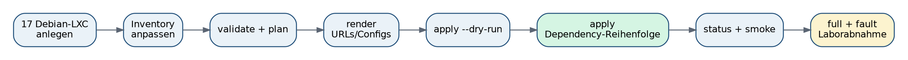
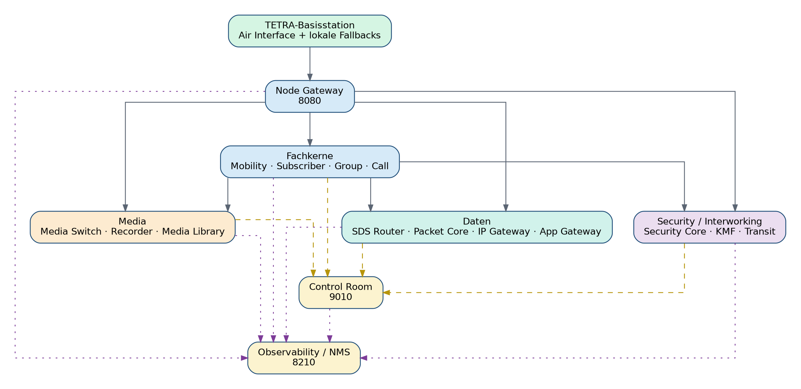
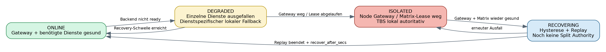

# Brainstorming: Recorder-LXC, Edge-Fallback, Echtzeit-Medienpfad und Buildfehler

Planungs- und Entwicklungsnotizen zum zentralen Recorder, lokalem Fallback und beschleunigten Medienpfad. Der Entwicklungsstand vom Juli 2026 wird mit den verfügbaren Paketen und dem Repository-Befund vom **04.10.2026** abgeglichen. Installation und Funklatenzen auf den Zielsystemen bleiben unbestätigt.

## Zielbild und Festlegungen

- Zentraler Recorder archiviert codierte Frames passiv; Recorderausfall darf den Sprachpfad nicht blockieren.
- Lokaler TBS-Betrieb soll bei Core-/WAN-Ausfall erhalten bleiben, mit dienstbezogenem Fallback und begrenztem Kontroll-/SDS-Spool.
- Rufaufbau soll durch Push-Ereignisse, Leg-/Route-Ready und Vorpuffer schneller werden; erste Sprachframes sollen erhalten bleiben.
- Paket- und Codebefunde liegen vor. Offen sind die letzten Buildfehler, Zielsystem-Abnahme und gemessene Ende-zu-Ende-Latenzen.

## 1. Arbeitsstand und Quellenbasis

| Merkmal | Wert |
|---|---|
| Repository | [JanHG98/netcore-tetra](https://github.com/JanHG98/netcore-tetra) |
| Archivdatum | **2026-10-04**, Zeitzone Europe/Berlin |
| Überlieferter Entwicklungszeitraum | 2026-07-24 17:45:56 bis 2026-07-25 06:43:21, Europe/Berlin |
| Geprüfter Remote-/Checkout-Stand `Archiving` vor dieser Archivänderung | [`2e843d2b30089e24d4ee536c9615cffce8bce2f8`](https://github.com/JanHG98/netcore-tetra/commit/2e843d2b30089e24d4ee536c9615cffce8bce2f8) |
| Zusätzlich abgefragter `main`-Stand | [`7137e0dd69877e1b604bf89148fd8b6b590c1a97`](https://github.com/JanHG98/netcore-tetra/commit/7137e0dd69877e1b604bf89148fd8b6b590c1a97) |
| Eindeutige Archivdatei | `Docs/archive/2026-10-04_recorder-lxc-edge-fallback-echtzeit-und-buildfehler.md` |
| Bildablage | `Docs/archive/assets/2026-10-04_recorder-lxc/` |

Die beiden Branchspitzen wurden über Git vom Remote geprüft; `Archiving` wurde für die Dokumentation separat ausgecheckt. Beim Vergleich der beiden genannten Commits gibt es außerhalb von `Docs/archive/` ausschließlich eine Abweichung in `Docs/Control_Room/Readme.md`: Diese Datei liegt im geprüften `Archiving`, aber nicht in `main`. Die hier untersuchten Implementierungen stimmen zwischen diesen beiden Ständen überein. Das bedeutet keine Gleichheit der beiden Branchhistorien und keine Aussage über installierte Binärdateien.

### 1.1 Evidenzklassen

- **Entwicklung:** historisch dokumentierte Anforderung, Diagnose oder Paketbericht; ohne unabhängige Ausgabe kein Ausführungsnachweis.
- **Anhang:** am Archivdatum gelesene Originaldateien aus zwei zugänglichen ZIP-Anhängen; Dateihashes sind unten festgehalten. Quellcode und Dokumentation wurden themenbezogen geprüft, nicht als vollständiges Sicherheitsaudit aller ZIP-Dateien.
- **Repository:** am genannten Commit gelesene Implementierungen, Konfigurationen und Dokumente.
- **Prüfung am Dokumentationsdatum:** ausdrücklich protokollierte lokale Prüfungen der Quellenprüfung.
- **Offen:** fehlender Verlauf, nicht verfügbare Originalausgabe, fehlende Build-/Betriebsevidenz oder festgestellte Abweichung.

### 1.2 Zugänglicher Verlauf und Lücken

Die verfügbaren Entwicklungsnotizen umfassen **24.07.2026, 17:45:56 bis 25.07.2026, 06:43:21**, Europe/Berlin. Frühere Recorder-Implementierungsschritte sind nur teilweise durch die mitgelieferten Paketdokumente und Quellstände rekonstruierbar.

Der letzte dokumentierte Stand fordert den Echtzeit-Umbau und enthält den vollständigen Compilerfehlerblock. Ein anschließendes Reparaturpaket oder erfolgreicher Neubau ist nicht belegt. Ursprüngliche Downloadpakete und Werkzeugprotokolle fehlen; Guide und Begleitkonfigurationen sind teilweise im zweiten ZIP erhalten. Quellenverweise für Timing/Energy Economy lassen sich nicht auflösen: die Latenzwerte bleiben Schätzungen.

### 1.3 Zugängliche ZIP-Anhänge

Die von den Arbeitsnotizenwerkzeug gelieferten beiden ZIP-Dateien wurden lokal geöffnet. Die Namen alleine belegen weder einen Git-Commit noch eine bestimmte Zuordnung zu einem einzelnen Entwicklungsstand; die folgende Einordnung beruht auf ihrem Inhalt.

| Originalname | Größe | Dateien ohne Verzeichniseinträge | Inhaltlicher Befund | SHA-256 |
|---|---:|---:|---|---|
| `netcore-tetra-swmi(1).zip` | 28.049.383 Byte | 1.236 | Recorder-/Media-Library-/Core-Quellstand; 25 PDFs; kein Komplettguide unter den späteren Guide-Dateinamen | `83293162847de9337bbc594bc1dec9a376a85c1138693d152956ba0d964dbce9` |
| `netcore-tetra-swmi(2).zip` | 30.248.276 Byte | 1.254 | Zusätzlich Edge-Fallback-Dokumentation, generierter 17-Service-Audit und Komplettguide; 27 PDFs einschließlich zweier Guide-Kopien | `6ad446945bac235b91b32ebb59cc852fe1cd68e515228637c6aae34c6d4678f0` |

Beide Archive haben den Wurzelordner `netcore-tetra-swmi/`. Die erste ZIP-Datei enthält 1.549 Einträge einschließlich Verzeichnissen, die zweite 1.567. Auf oberster Archivebene und in den normalen Dateibäumen wurden keine eigenständigen PNG/JPEG/GIF/WebP/BMP/SVG/ICO-Dateien gefunden. Im DOCX des zweiten ZIP sind dagegen drei PNG-Grafiken eingebettet; sie sind tatsächlich zugänglich und werden in Abschnitt 10 unverändert archiviert.

Diese Anhänge sind **nicht** mit dem in der Planung behaupteten „No-PDF“-Finalpaket gleichzusetzen. Insbesondere passen Dateigröße, Dateizahl und vorhandene PDFs nicht zu dessen Beschreibung. Die damalige Paketprüfsumme darf daher keinem dieser beiden ZIPs zugeschrieben werden.

## 2. Ziel, Ausgangslage und Entwicklung der Anforderungen

Der technische Ausgangspunkt war ein bereits auf mehrere LXCs aufgeteilter NetCore-Core mit lokaler TETRA-Basisstation. Der zentrale Recorder sollte codierte Sprachframes passiv archivieren; ein Ausfall der Aufzeichnung sollte laufende Rufe nicht behindern. Danach wurden die Dienste zusammen geprüft, die Basisstation für Core-/WAN-Ausfälle ertüchtigt, ein kompletter Installations- und Bedienguide angefordert und schließlich die Multi-Site-Latenz sowie konkrete Rust-Buildfehler adressiert.

| Zeitpunkt, Europe/Berlin | Verfügbarer Inhalt | Belastbarer Abschlussstand |
|---|---|---|
| 2026-07-24 17:45:56 | Anforderung: erneute Gesamtprüfung und Fallback bei nicht erreichbaren Diensten/fehlendem Internet. | Noch ohne dokumentiertes Ergebnis. |
| 2026-07-24 17:47:14 | Erneute gleichlautende Anforderung mit Dateianhang; Paketbericht nennt Full-System-Audit und TBS-Edge-Fallback. | Umsetzung und zahlreiche statische Prüfungen werden behauptet; Rust-Build, reale LXC-Ausfälle und On-Air-Abnahme ausdrücklich offen. Zweites zugängliches ZIP enthält passende Fallback-Dateien und Auditbericht. |
| 2026-07-24 19:21:22 | Vollständiger Guide für Basisstation und alle LXCs: Installation, Konfiguration und Bedienung. | Paketbericht nennt etwa 60 Seiten, PDF/DOCX/Markdown, korrigiertes Inventar und bereinigte TBS-Konfiguration. Entsprechende Dateien sind im zweiten ZIP tatsächlich enthalten. Seitenzahl/Layout wurden hier nicht neu abgenommen. |
| 2026-07-24 22:56:48 | Frage nach Sprachübertragung von Funkgerät A über TBS A zu TBS B/Funkgerät B, Internetgeschwindigkeit ausgenommen. | Analyse behandelt festen Jitterpuffer und 2-s-Reconcile und schlägt Push-Ereignisse, Leg-/Route-Ready, Vorpuffer und adaptiven Jitter vor. Es handelt sich um Planung und geschätzte Zeitbudgets. |
| 2026-07-25 06:43:21 | Entwicklungsziel: den vorgeschlagenen Umbau auf „fast Echtzeit“ und Beseitigung der Compilerfehler/-warnung. | Sieben Compilerfehler und eine Warnung dokumentiert. Keine zugängliche nachfolgende Reparatur-/Erfolgsmeldung. Geprüfter Repository-Stand wird separat bewertet. |

### 2.1 Endgültige fachliche Anforderungen

1. Recorder als eigener Dienst außerhalb des zeitkritischen Sprachpfads, mit vollständigen Frames, Metadaten, Integrität, Wiederanlauf und Verwaltung.
2. Alle Dienste und ihre Verträge gemeinsam prüfen; vorhandene lokale TBS-Funktionen bei Core-, VPN- oder WAN-Ausfall erhalten.
3. Ausfälle dienstbezogen behandeln: Ein einzelner Backend-Ausfall darf nicht automatisch alle noch erreichbaren zentralen Funktionen abschalten.
4. Lokale Autorität bei Gateway-Verlust oder veralteter Gesamtmatrix, mit Hysterese, Policy-Cache und begrenztem persistentem Kontroll-/SDS-Spool; alte Sprache nicht nachträglich senden.
5. Vollständiger Installations-, Konfigurations-, Bedienungs-, Backup- und Abnahmeguide für TBS und LXCs.
6. Rufaufbau und Sprachtransport beschleunigen, insbesondere das periodische 2-s-Routingpolling aus dem normalen Sprachpfad entfernen und verlorene erste Sprachframes vermeiden.
7. Die konkret gemeldeten Buildfehler und Warnungen beseitigen; ein bloßer statischer Projektchecker reicht dafür nicht.
8. Historisch war der offene Labormodus ohne Benutzerkonten, Management-Tokens und TLS ausdrücklich beibehalten. Das ist eine damalige Testkonfiguration, keine nachgewiesene Produktionsabsicherung.

Die spätere Aufforderung zum Echtzeit-Umbau ersetzt die frühere Bewertung „funktional, aber beim ersten PTT zu träge“ als Entwicklungsziel. Sie macht aus den zuvor geschätzten Latenzwerten keine Messwerte. Auch die damalige positive Auditmeldung wird durch den später gemeldeten Buildabbruch in ihrem Geltungsbereich begrenzt.

## 3. Recorder-Architektur und angrenzende Medienkomponenten

### 3.1 Verantwortlichkeiten und Datenweg

```text
Funkgerät A -> TBS A / UMAC -> TBS-Node-Worker
                                  |
                                  v
                         Node Gateway /ws/node
                                  |
                         Backend /ws/backend
                                  |
                                  v
Call Control -----------> Media Switch ---------> Gateway -> TBS B/C/... -> Funkgeräte
logische Calls/Legs        Routing + Jitter
und Floor                 |
                          +--> begrenzter Vollframe-Tap-Ring
                                      |
                                      v HTTP-Cursor-Polling
                                Recorder-LXC
                                      |
                         TACELP + JSONL + Metadaten + Hashes
```

Call Control verwaltet logische Rufe, Teilnehmer-Legs und Floor. Der Media Switch übernimmt bereits codierte Sprachframes und verteilt sie auf bereite Ziel-Legs. Recorder und Player sind externe Verbraucher beziehungsweise Einspeiser. Im Recorder-Pfad gibt es keine synchrone Rückfrage, auf die der Sprachtransport warten müsste.

Der zentrale Recorder ist von der lokalen TBS-Aufzeichnung in `crates/tetra-entities/src/net_recorder/` zu unterscheiden. Letztere kann bei Core-Ausfall weiterarbeiten, sofern sie auf der TBS aktiviert und funktionsfähig ist. Eine lokale Aufnahme ersetzt nicht automatisch die lückenlose zentrale Multi-Site-Aufzeichnung.

Die alten Paketdokumente `Docs/SWMI_CORE_1_PACKAGE_E_RECORDER.md`, `Docs/SWMI_CORE_1_PACKAGE_E_APPLY.md` und `system-backend/recorder/docs/` in den Anhängen belegen diesen Entwurf. Im geprüften Repository sind die entsprechenden Implementierungen weiterhin vorhanden. [Quellen R1, R2 und R11](#11-repository-quellen-zum-geprüften-stand).

### 3.2 Frame- und Tap-Verträge

| Schnittstelle/Format | Bedeutung |
|---|---|
| `GET /api/v1/taps?limit=<n>` | Diagnose-Tap ohne Sprachpayload; ungeeignet als Recorderquelle. |
| `GET /api/v1/recorder/taps?after=<seq>&limit=<n>` | Replay-fähiger Vollframe-Tap mit monotoner Tap-Sequenz, Call-/Sprecher-/Node-/Timeslot-Daten und Payload. |
| `oldest_available_seq`, `newest_available_seq`, `dropped_before` | Verfügbare Ringgrenzen und sichtbare Lücke bei zu altem Cursor. |
| `audio.tacelp` | Hintereinander gespeicherte gepackte 35-Byte-TETRA-ACELP-Transportframes; nominell 60 ms Audio je Transportframe. |
| `frames.jsonl` | Index mit Zeit, Tap-/Quellsequenz, Herkunft, Sprecher und Byte-Offset. |
| `POST /api/v1/sessions/{call-id}/inject` | Ein einzelner gültiger 35-Byte-Frame in eine vorhandene Session; ursprünglicher Media-Library-/Player-Anschluss. |

Ein Recorder-Datensatz kann logische Call-ID, Rufart/-phase, Source-ISSI, GSSI oder Calling-/Called-ISSI, Priorität, Notrufkennzeichen, Floor-Holder/Sprecher, TBS, logischen Timeslot, Quellsequenz, Zielanzahl, Codec und Injection-Kennzeichen enthalten. Duplikate, ungültige Frames und Tap-Lücken werden erkannt beziehungsweise gezählt.

Der Ring ist flüchtig und begrenzt, kein Archiv. `recorder_tap_history_frames = 20000` bedeutet bei einem kontinuierlichen Stream mit 60 ms je Frame rechnerisch etwa 1.200 Sekunden Puffer; bei mehreren gleichzeitig aufgezeichneten Streams entsprechend weniger. Das ist eine Kapazitätsrechnung, keine garantierte Ausfallüberbrückung. Ein Neustart des Media Switch verliert den Ring.

„Verlustfrei“ bezieht sich auf die unveränderte Ablage akzeptierter codierter Payloads. Es bedeutet nicht, dass bei Ringüberlauf, Netzunterbrechung, Speicherknappheit oder Prozessabsturz keine Frames fehlen können.

### 3.3 Storage, Recovery und Verwaltung

```text
/var/lib/netcore-recorder/recordings/YYYY/MM/DD/<recording-id>/
  audio.tacelp
  frames.jsonl
  metadata.json
  integrity.json

aktive Aufnahme:
  audio.tacelp.part
  frames.jsonl.part
  metadata.active.json

Exporte:
  /var/lib/netcore-recorder/exports/
```

Die Implementierung enthält Schreiben der 35-Byte-Payload, Sprechersegmente, SHA-256 für Audio und Index, Finalisierung, Wiederanlauf aus aktiven Manifesten, Retention, Legal Hold und TAR-Export. `fsync_every_frames = 50` ist ein konfigurierter Synchronisationsabstand; daraus folgt keine Zusage, dass ein Stromausfall jedes zuletzt empfangene Frame erhält. Legal Hold ist eine Anwendungssperre gegen die vorgesehenen Lösch-/Retention-Aktionen, keine WORM-Dokumentation.

| Recorder-Parameter, geprüftes Beispiel | Wert |
|---|---:|
| HTTP/WebUI | `0.0.0.0:8140` |
| Tap-Pollintervall | 100 ms |
| Session-Abgleich | 1.000 ms |
| HTTP-Timeout | 3 s |
| Batchlimit | 500 Frames |
| Framezeit | 60 ms |
| Schonfrist nach Verschwinden der Session | 3 s |
| Maximaler Idle-Zeitraum | 600 s |
| Standardaufbewahrung / Retention-Scan | 30 Tage / 60 s |
| Sync-Abstand | 50 Frames |
| Freier Mindestplatz | 512 MiB, Konfigurationsfeld `minimum_free_space_mb` |
| Aktive / gesamte Aufnahmen, Limits | 1.000 / 100.000 |
| API-Bodylimit | 1.048.576 Byte |

Relevante Management-Endpunkte sind `/health/live`, `/health/ready`, `/metrics`, `/openapi.json`, `/api/v1/status`, `/api/v1/active`, `/api/v1/recordings` und `/api/v1/events`. Unter `/api/v1/recordings/{id}` gibt es Metadaten sowie `verify`, `retention`, `hold`, `finalize`, `delete`, `export` und `audio.tacelp`. Schreibaktionen werden hier nicht ausgeführt.

Der Dienst läuft gemäß Unit als Benutzer/Gruppe `netcore`, Binary `/usr/local/bin/netcore-recorder`, Konfiguration `/etc/netcore/recorder.toml`, Unit `netcore-recorder.service`, mit `Restart=on-failure`, `RestartSec=2` und beschränkten Schreibpfaden unter `/var/lib/netcore-recorder`. Das historische LXC-Dokument schlägt Debian 12/13, 2 vCPU, 2 GiB RAM und passend dimensioniertes Storage vor; dies ist eine Planungsvorgabe ohne vorliegende Lastmessung.

### 3.4 Media Library: historische Grenze und zusätzliche Erweiterung

Im angehängten Paket O importiert die Media Library WAV, MP3 und TACELP, erzeugt Vorschauen, verwaltet Freigaben, importiert Recorder-Rohdaten und archiviert versionierte Kopien mit Manifest/Hashes. Das Previewformat ist 8 kHz, mono, PCM16. Der damalige direkte Playout-Pfad benötigt bereits vorhandene Media-Switch-Sessions und für WAV/MP3 einen echten externen TETRA-Encoder; die Library selbst erzeugt weder CMCE-Ruf noch Floor.

Heute dokumentieren und konfigurieren `system-backend/media-library/` und die TBS-Audio-Player-Integration zusätzlich `playout.mode = "basisstation"`: Die Library delegiert über `/api/audio/play` an eine ausgewählte Basisstation, die die WAV-Datei vollständig lädt, lokal cached, mit ihrem nativen Codec verarbeitet, den Ruf aufbaut und beendet. Der alte Modus `media_switch` bleibt als Spezialpfad bestehen. Im Modus `shadow` wird nicht gesendet. Außerdem ist zentrale Piper-TTS-Erzeugung in der Media Library dokumentiert.

Deshalb ist die alte Guide-Aussage „WAV/MP3 benötigen einen Encoder im Library-Pfad und eine vorhandene Session“ keine allgemeingültige Beschreibung des geprüften empfohlenen TBS-Playouts. Diese Erweiterungen sind zusätzliche Repository-Befunde, keine im historischen Entwicklungsstand belegte Fertigstellung. [Quelle R9](#11-repository-quellen-zum-geprüften-stand).

## 4. Offline-Fallback und Wiederanlauf

### 4.1 Historisch beschriebene Entscheidungskette

Der Node Gateway prüft die tatsächlichen `/health/ready`-Endpunkte der Backenddienste. Er überträgt eine vollständige revisionierte `CoreServicesSnapshot`-Matrix über die bestehende Node-WebSocket-Verbindung. Ein öffentlicher Internet-Ping ist kein Entscheidungskriterium. Die TBS verbindet ihren `[control_room]`-Client in dieser Topologie zum Node Gateway, standardmäßig `/ws/node` auf Port 8080, nicht direkt zur zentralen Control-Room-WebUI auf Port 9010.

| Zustand | Historische Bedeutung und geprüfter Codebezug |
|---|---|
| `online` | Gateway/frische Matrix und erforderliche Dienste gesund; Recovery-Hysterese erfüllt. |
| `degraded` | Einzelne erforderliche Dienste fehlen oder kurze Übergangsphase vor vollständiger Isolation; dienstbezogene Fallbacks. |
| `isolated` | Gateway nicht erreichbar oder Matrix-Lease abgelaufen und Eintrittshysterese erfüllt; lokale TBS-Autorität. |
| `recovering` | Voraussetzungen wieder gesund, aber zusammenhängende gesunde Zeit noch kürzer als die Recovery-Hysterese. |

Die Entwurfsfassung formuliert pauschal, jeder einzelne Dienstausfall setze den Gesamtmodus auf `degraded`. Der geprüfte Worker bildet den globalen Modus konkret aus `required_services`, Gateway und Matrixfrische. Ein optionaler Dienst kann separat als ausgefallen erscheinen, ohne allein den globalen Modus umzuschalten. Diese Unterscheidung gehört in die spätere Betriebsabnahme.

### 4.2 Konfiguration und Diagnose

| TBS-/Gateway-Parameter | Geprüfter Wert/Bedeutung |
|---|---|
| `edge_fallback.enabled` | `true` |
| `enter_after_secs` / `recover_after_secs` | 15 s / 20 s |
| `service_matrix_lease_secs` | 60 s |
| `unknown_service_is_available` | `false` |
| `keep_last_known_policy` | `true` |
| `policy_cache_path` | `/var/lib/flowstation/edge-policy-cache.json` |
| `policy_cache_max_age_secs` | 604.800 s = 7 Tage; kein automatisches Öffnen des Netzes bei veralteter Policy |
| `event_spool_path` | `/var/lib/flowstation/edge-event-spool.jsonl` |
| Spoolgrenzen | 10.000 Einträge, 16.777.216 Byte |
| `replay_batch_size` | 128 |
| Erforderliche Dienste | Subscriber Core, Group Core, Mobility Core, Call Control, Media Switch, SDS Router |
| Gateway-Monitor | 5-s-Intervall, 1.500-ms-Timeout, je zwei Fehl-/Erfolgsergebnisse bis zur Schwelle |

Die 60 Sekunden sind die Matrix-Lease, nicht in jedem Fall die gesamte Umschaltzeit bis `isolated`: Der Worker prüft zusätzlich die Eintrittshysterese. Bereits zuvor werden Matrixfrische und Verfügbarkeit entsprechend bewertet. Kleinere Matrixrevisionen werden abgewiesen; gleiche Revisionen akzeptiert der gelesene Code weiterhin. Eine pauschale Behauptung „nur strikt größere Revisionen erneuern die Lease“ wäre daher falsch.

Diagnosepunkte:

```text
Node Gateway: GET /api/v1/core-services
TBS:          GET /api/edge-fallback
```

Die TBS-Diagnose nennt unter anderem `gateway_connected`, `service_matrix_fresh`, `service_matrix_received_at`, `mode`, `reason`, `service_revision`, `services`, `policy_cache` und `event_spool`.

### 4.3 Was lokal erhalten bleiben soll

Die dokumentierten Fallbacks umfassen lokale Registrierung/Location Area, Gruppenaffiliation, lokale Gruppen- und Einzelrufe, lokale Air-Interface-Medien, lokalen Recorder, lokale SDS-Zustellung, persistentes Store-and-Forward für geeignete nichtlokale SDS/Ereignisse, lokale SNDCP-/PDP-Kontexte und lokal eingerichtetes TUN-/IP-Routing. Subscriber-/Group-Policies werden aus dem letzten bekannten Cache verwendet; installierte Schlüssel bleiben verwendbar, ohne neue OTAR-Transaktionen zu erfinden. Lokales Dashboard, Logs und erreichbare lokale Integrationen bleiben eigene Funktionen.

Der Spool speichert ausgewählte Kontroll-/SDS-Telemetrie und wird synchronisiert. Der Parser toleriert einen abgerissenen letzten JSONL-Eintrag ohne abschließenden Zeilenumbruch; Beschädigungen in der Mitte werden dadurch nicht pauschal ignoriert. Bereits lokal zugestellte Gruppen-SDS werden mit `air_fallback_local_delivered` gekennzeichnet, damit die spätere zentrale Zustellung nicht erneut die Ursprungszelle bedient. Alte Sprach-/RF-Frames werden bewusst nicht dauerhaft zum späteren Aussenden aufgestaut.

Die historische Fallback-Grafik nennt „Replay beendet + recover_after_secs“ als Übergang zu `online`. Im am Prüfdatum gelesenen `update_edge_mode` ist die globale Online-Freigabe an gesunde Voraussetzungen und die Zeit gebunden, ohne dort eine zusätzliche Prüfung auf leeren Spool. Ob alle betroffenen zentralen Aktionen anderweitig bis zum Replay-Ende gesperrt werden, wurde nicht Ende-zu-Ende nachgewiesen. Die Grafik ist deshalb als historische Zielbeschreibung archiviert.

### 4.4 Drift der Dienstabdeckung

| Quelle/Stand | Anzahl und Grenze |
|---|---|
| Entwicklungsnotizen und Audit im ZIP (2) | 17 Runtime-Dienste, 16 Gateway-Health-Ziele, 17 explizite Fallbackregeln |
| Aktuelles `system-backend/services.toml` | 26 Einträge, davon `shared` ohne eigenen Runtime-Port; 25 Runtime-Dienste |
| Aktuelles Open-Lab-Inventar | 25 Dienste einschließlich `alert-service` |
| Am Prüfdatum vorliegende `config.toml`-Fallbackmap | 24 Dienste; `alert-service` fehlt |
| Am Prüfdatum vorliegende Node-Gateway-Beispiel-/generierte Monitorziele | 23 Ziele; Gateway selbst nicht als Ziel, `alert-service` fehlt |
| Gespeicherter geprüfter `Docs/generated/full-system-integration-audit.md` | Meldet weiterhin PASS für 24 Dienste / 23 Ziele / 24 Fallbacks; kein am Prüfdatum vorliegender 25-Service-Nachweis |
| Rust-Defaults in `sec_edge_fallback.rs` | Weiterhin 17 Basisregeln; explizite Konfiguration erweitert diese |

Der am Archivdatum ausgeführte Fallback-Referenztest bestätigt die fehlende Zuordnung von `alert-service`. Der alte Auditbericht darf daher nicht als Beweis einer zum Prüfdatum vollständigen Dienstematrix verwendet werden. [Quellen R6–R8 und Prüfprotokoll in Abschnitt 9](#9-am-archivdatum-ausgeführte-prüfungen).

## 5. Sprachlatenz und Echtzeit-Umbau

### 5.1 Historisch untersuchter Zustand

Beide zugänglichen ZIPs enthalten im Media-Switch-Beispiel tatsächlich:

```toml
[call_control]
reconcile_secs = 2

[media]
frame_duration_ms = 60
jitter_buffer_frames = 3
max_jitter_buffer_frames = 12
```

Die Entwurfsfassung leitete daraus 180 ms festen Jitterpuffer ab. Für den gesamten aktiven Funkweg wurde folgendes grobes Budget genannt:

| Abschnitt | Historische Schätzung |
|---|---:|
| Empfang/Vervollständigung des codierten Sprachframes an TBS A | 30–60 ms |
| TBS A → Gateway → Media Switch | 5–20 ms |
| Fester Jitterpuffer | 180 ms |
| Media Switch → Gateway → TBS B | 5–20 ms |
| Einordnung in den nächsten Downlink | 0–60 ms |
| Dekodierung/Audioausgabe Funkgerät B | 30–60 ms |
| Mund-zu-Ohr gesamt | ungefähr 250–400 ms |
| Ab fertig vorhandenem Sprachframe an TBS A bis Aussendung TBS B | ungefähr 190–280 ms |

Für einen neuen Ruf wurde der 2-s-Abgleich als wesentliche zusätzliche Verzögerung angesehen, einschließlich möglicher Verwerfung noch unbekannter Streams. Genannte PTT-bis-Audio-Schätzungen: günstig 500–900 ms, typisch 1–2 s, ungünstig 2–3 s. Energy-Economy-Empfangsfenster, Frame-18-/Common-SCCH-Gelegenheiten und Endgeräteverhalten können zusätzlich verzögern. Die damaligen externen Normverweise sind nicht auflösbar; die Zahlen sind keine protokollierten Messungen.

Die Planung unterschied Soft-Realtime über Linux/LXC/JSON-WebSocket/TCP von lokaler zeitkritischer TDMA-Verarbeitung. Mehrere Zielzellen sollten per Fan-out bedient werden, ohne eine serielle Kette von Basisstationen aufzubauen. Daraus folgt weder identischer Aussendezeitpunkt noch ein SFN-/Simulcast-Konzept für überlappende Gleichkanalzellen.

### 5.2 Vorgeschlagener und geplanter Umbau

1. Call Control pusht Call-/Leg-/Floor-Änderungen sofort an den Media Switch; das bisherige periodische Polling soll den Normalfall nicht mehr bestimmen. Der Entwurf nannte beispielhaft `CallCreated`, `LegAdded`, `LegReady`, `FloorGranted`, `CallReleased`.
2. Ziel-Legs reservieren/bestätigen ihre Medienressourcen; der Media Switch meldet `RouteReady`; erst danach Floor-Freigabe. Ziel ist insbesondere der Erhalt der ersten Wörter.
3. Kurzer Vorpuffer an der Quell-TBS wurde vorgeschlagen: vier oder fünf 60-ms-Frames, im Rechenbeispiel vier Frames = 240 ms.
4. Adaptiver Jitter mit zwei Frames als Startempfehlung; ein Frame für sehr stabile Bedingungen mit geringerer Reserve.

Als Ziele wurden unter anderem 120–200 ms TBS-zu-TBS, 180–300 ms Mund-zu-Ohr und 300–600 ms für neue Gruppenrufe mit StayAlive-Geräten genannt. An anderer Stelle der gleichen Entwurf standen 170–280 ms bei zwei Frames und 110–220 ms bei einem Frame. Diese überlappenden Bereiche sind grobe Abschätzungen mit nicht vollständig spezifizierten Annahmen. Auch die behauptete Verbesserung der Routinginformation von bis zu 2.000 ms auf etwa 5–30 ms wurde nicht gemessen.

### 5.3 Zusätzliche Implementierung: bereits vorhanden, aber nicht als damaliger Entwicklungsabschluss belegt

| Aspekt | Befund am geprüften Commit |
|---|---|
| Topologie-Push | Call Control bietet `/ws/media`; Subprotokoll `netcore-call-control-media-v1`. |
| Ereignisse | Initialer `snapshot`, danach unter anderem `call_created`, `leg_ready`, `floor_changed`, `call_updated`, `call_released`. Die tatsächlichen Namen unterscheiden sich von den Planungsbeispielen. |
| HTTP-Snapshot | `GET /api/v1/calls` bleibt für Start, Wiederverbindung und Fallback erhalten. Im normalen verbundenen Eventloop ist `reconcile_secs = 15` das Sicherheitsnetz. |
| Medienbereitschaft | `POST /api/v1/media/route-ready` mit logischer Call-ID und Revision; zu alte/zukünftige Revisionen und unbereite Legs werden abgelehnt. |
| Floor-Voraussetzungen | `request_floor` verlangt aktive nichtterminale Legs mit Call-ID/Timeslot sowie ausreichend neue RouteReady-Bestätigung. Bei fehlender Bereitschaft liefert die Methode einen Fehler. |
| ACK-Wiederholung | Eventclient versucht fehlgeschlagene RouteReady-Bestätigungen erneut, unter anderem in einem 1-s-Retryzweig. |
| Jitter | Startwert 2 Frames, Minimum 1, Maximum 12, adaptive Anpassung aktiv. |
| Kaltstart | `early_uplink` liegt im **Media Switch**, maximal fünf Frames je Quellstream, maximale Empfangsalterung 600 ms. |
| Unbekannte/unbereite Streams | Werden im vorgesehenen begrenzten Kaltstartpfad gepuffert; Zähler für unbekannte Streams und abgelaufene/überzählige Frames bestehen weiter. |

Die am Prüfdatum vorliegende Beispielkonfiguration lautet für den Kern dieses Umbaus:

```toml
[call_control]
url = "http://10.0.1.24:8120/api/v1/calls"
events_url = "ws://10.0.1.24:8120/ws/media"
route_ready_url = "http://10.0.1.24:8120/api/v1/media/route-ready"
reconcile_secs = 15
reconnect_secs = 1
request_timeout_secs = 2

[media]
frame_duration_ms = 60
jitter_buffer_frames = 2
min_jitter_buffer_frames = 1
max_jitter_buffer_frames = 12
adaptive_jitter = true
adaptive_jitter_up_threshold_ms = 18
adaptive_jitter_down_stable_frames = 120
cold_start_buffer_frames = 5
cold_start_buffer_max_age_ms = 600
```

Die Adressen sind Repository-Beispiele, keine abgefragten Live-Ziele. [Quellen R2–R5](#11-repository-quellen-zum-geprüften-stand).

Der adaptive Code verwendet die Abweichung der Ankunftsabstände von der konfigurierten Framezeit und erhöht/verringert das Frameziel innerhalb der Grenzen. Zwei Frames entsprechen rechnerisch 120 ms, der mögliche Bereich einem bis zwölf Frames beziehungsweise 60–720 ms. Ein fünf Frames großer Kaltstartpuffer fasst nominell 300 ms Sprache; sein Maximalalter von 600 ms ist ein Verwerfungsgrenzwert und kein ständig aufgeschlagener zusätzlicher Pufferdelay. Bei voller Kaltstartqueue schützt der Code ältere gepufferte Frames und verwirft neuere Eingänge.

Für die Fortsetzung sind drei Grenzen wesentlich:

- Ein im Switch vorhandener Vorpuffer belegt nicht die zusätzlich vorgeschlagene Speicherung **an TBS A** vor einem Gateway-/Netzausfall. Im untersuchten TBS-Worker wurde kein entsprechender fünf Frames umfassender Kaltstartpuffer nachgewiesen.
- Die Floor-Methode verweigert zu frühe Anforderungen. Dass jede reale PTT-Anforderung danach automatisch erneut ausgeführt wird und die Ende-zu-Ende-Autorität korrekt zusammenwirkt, muss mit TBS und Endgeräten geprüft werden; aus einem Fehlertext „held“ folgt keine nachgewiesene wartende Anforderungsqueue.
- CPU-Last, TCP-Stau, verlorene Verbindungen, ACK-Retries, Wiederverbindungen, Funk-Scheduler und Energy Economy bleiben Laufzeitfaktoren. Der zusätzliche Code belegt keine garantierte obere Mund-zu-Ohr-Latenz.

## 6. Compilerfehler: historische Ursache und geprüfter Quellstand

### 6.1 Tatsächlich fehlgeschlagener Befehl

Das Buildprotokoll dokumentiert auf `jan@SRV-M-TBS-01`, im Verzeichnis `~/netcore-tetra` beziehungsweise `/home/jan/netcore-tetra`, folgenden Build:

```bash
cargo build --release \
  -p bluestation-bs \
  -p netcore-control-room \
  -p netcore-control-room-operator \
  --features "bluestation-bs/asterisk,bluestation-bs/recording,bluestation-bs/audio-player"
```

Status: **im Originalchat tatsächlich ausgeführt und fehlgeschlagen**. Die Ausgabe nennt `tetra-core`, `tetra-saps`, `tetra-config`, `tetra-pdus`, `tetra-entities` jeweils als `v1.3.0`, anschließend sieben Fehler und eine Warnung. Die Versionszahl identifiziert keinen eindeutigen Git-Commit; auch der am Prüfdatum geprüfte Cargo-Workspace trägt noch `1.3.0`.

### 6.2 Fehlerregister

| Meldung und historische Fundstelle | Ursache im zugänglichen Quellstand | Geprüfter Befund und Grenze |
|---|---|---|
| `E0432`, `mm/mm_bs.rs:7–8`: `GroupMembershipPolicy`, `GroupPolicyDefinition`, `MobilityClassOfMs`, `MobilityClientState`, `MobilityContextPayload` nicht in `net_control` importierbar | Typen sind in `net_control::commands` definiert; beide ZIPs exportieren sie nicht passend über `net_control/mod.rs`. Der Compiler schlägt direkte Imports aus `commands` vor. | Das zusätzliche `net_control/mod.rs` reexportiert alle fünf Typen; Definitionen in `commands.rs` vorhanden. Diese konkrete fehlende Exportursache ist im gelesenen Code beseitigt. |
| Warnung `unused import: TlmcConfigureReq`, `umac/umac_ms.rs:9` | Beide ZIPs importieren `TlmcConfigureReq` und `TlmcReportInd`; der erstgenannte Typimport wird nicht gebraucht. | Geprüfter Import enthält dort nur `TlmcReportInd`. Die weiterhin vorkommende Enumvariante `SapMsgInner::TlmcConfigureReq` ist etwas anderes als der ungenutzte Typimport. |
| `E0124` und `E0062`, `cmce/call_restore_runtime.rs:339/349`: `request_to_transmit` doppelt | In beiden ZIPs enthält **derselbe** `CallRestoreTransaction`-Struct das Feld zweimal. Dies ist anhand des Anhangs direkt nachvollziehbar. | Im geprüften Code enthalten `CallRestoreRequest`, `CallRestoreTransaction` und `CallRestoreTransactionSnapshot` das Feld jeweils einmal. Gleichnamige Felder verschiedener Structs sind hier keine Dublette. |
| Zweimal `E0624`, `cc_bs/timers.rs:40/48`: `drive_queued_call_restores` und `send_timed_out_restore_release` privat | Beide Methoden sind in den ZIPs im Untermodul `procedures/restoration.rs:852/904` nur `pub(super)`; der Zugriff aus dem Geschwistermodul `timers` liegt außerhalb dieses Sichtbarkeitsbereichs. | Die genannten Methoden und Aufrufe existieren in der geprüften untersuchten `cc_bs`-Struktur nicht mehr. `fsm_on_u_call_restore` verwendet einen expliziten Sichtbarkeitsbereich bis `cc_bs`. Das ist ein inzwischen veränderter Ablauf, kein Beleg für den isolierten historischen Zweizeilen-Fix oder gleichwertige Queue-/Timeout-Semantik. |
| Zweimal `E0004`, `net_dashboard/server.rs:782/1229`: `TelemetryEvent::SdsEdgeIngress` fehlt in Matches | Neue Eventvariante ist im Enum vorhanden; beide historischen Dashboard-Matches behandeln sie nicht. Die ZIP-Dashboarddateien enthalten keine entsprechenden Variantennamen. | Heutiges `server.rs` enthält explizite `SdsEdgeIngress`-Arme in beiden betroffenen Verarbeitungsbereichen, am geprüften Stand etwa Zeilen 1321 und 1530. |

Die naheliegenden historischen Reparaturschritte waren vollständige Reexports beziehungsweise konsistente direkte Imports, Entfernen des doppelten Structfeldes, passende Methodensichtbarkeit oder Umorganisation der Aufrufgrenze, vollständige Behandlung der Eventvariante und Entfernen des ungenutzten Imports. Diese Ursachenanalyse ist durch Buildprotokoll und Anhänge gestützt. Ein damals erfolgreicher Patch oder Testlauf ist trotzdem nicht zugänglich.

Für zum Prüfdatum lautet die Aussage daher: Mehrere konkrete Ursachen sind im Source behoben; der Restore-Code wurde darüber hinaus umgebaut. **Ein erfolgreicher am Prüfdatum vorliegender Linux-/ARM64-Releasebuild mit genau obigem Featurepaket wurde in der Quellenprüfung nicht durchgeführt.** Auch neue Compilerwarnungen oder Verhalten unter Last sind damit nicht ausgeschlossen. [Quelle R10](#11-repository-quellen-zum-geprüften-stand).

## 7. Installationsguide, Dienstematrix und Konfigurationspfade

### 7.1 Tatsächlich wiedergefundene Guide-Dateien

Im zweiten ZIP liegen die folgenden Dateien unter `netcore-tetra-swmi/Docs/` und nochmals identisch unter `netcore-tetra-swmi/wiki/`. Die Bytegleichheit dieser Doppelablage wurde geprüft.

| Datei | Größe | SHA-256 der Originalbytes im ZIP |
|---|---:|---|
| `NetCore-Tetra-Komplettguide.md` | 136.615 Byte, 2.453 Zeilen | `313065eca44eec74f52996251214da74ce20257b71bf69cd4360fcf507bc1bdf` |
| `NetCore-Tetra-Komplettguide.pdf` | 1.969.688 Byte | `3c73eae88f0f5691443c616c1df8720a1fe4427873e4296c7dbe173891257dd2` |
| `NetCore-Tetra-Komplettguide.docx` | 409.470 Byte | `5f287f0519abcb7058d7c83e53ebf99532e6d8550246de99f5ae48ac8833d816` |
| `inventory.open-lab.corrected.example.toml` | 6.923 Byte | `9467686968b5621a287acbed2e94f7660c03052615b7c606ce5908137fb8f45d` |
| `basisstation.config.sanitized.example.toml` | 49.235 Byte | `a428ad26d9458c46d2e263ce7d71933c14b1043331b5c19eea9848d8f663f109` |

Der Guide trägt den Stand 24. Juli 2026 und beschreibt 17 LXCs. Seine Markdown-Fassung wurde für Gliederung, Installation, Deployment, Medienbedienung, Offline-Fallback und Abnahme geprüft. Die PDF-/DOCX-Dateien wurden identifiziert und gehasht; der DOCX-Bildcontainer wurde gelesen. Eine neue vollständige Seiten-/Layoutprüfung von PDF und Word ist nicht erfolgt.

Behandelt werden Netz-/Storage-Planung, SDR/TBS-Installation, systemd, RF-/Zellparameter, Packet Data, SDS, Dashboard/Recording/Audio/TTS, Node-Anbindung, Proxmox-LXC, SSH, TUN, NFS, automatisches und manuelles Deployment, alle damaligen Dienstkonfigurationen, Operatorprofile, Teilnehmer-/Gruppenbetrieb, Security/KMF, Control Room, Observability, Backup, Update, Rollback, Smoke-/Full-/Fault- und On-Air-Abnahme.

Heute enthält das Repository außerdem `Docs/NetCore-Tetra-Komplettguide-2026-09-27.*` und `Docs/NetCore-Tetra-Komplettguide-2026-09-28.*`, deren Markdown-Titel 25 LXCs nennen. Sie wurden hier als spätere Artefakte identifiziert, nicht vollständig neu abgenommen. Der alte 17-LXC-Guide darf nicht als vollständiger am Prüfdatum vorliegender Installationssatz ausgegeben werden.

### 7.2 Historisch in der Planung genannte Originalpakete

| Genannte Ausgabe | Historische Aussage; zusätzliche Evidenzgrenze |
|---|---|
| `netcore-tetra-swmi-full-system-edge-fallback-open-lab-no-pdf.zip` | Etwa 2,9 MB, 1.215 Dateien, keine PDFs/Python-Caches; SHA-256 laut Paketbericht `e1df26e2d44abd4a70b6f3be90bb55d931bf8457a231d60ae19f89d78a0ad84c`. Diese konkrete Ausgabe wurde hier nicht erneut gehasht oder als identischer Download gefunden. |
| `NetCore-Tetra-Guide-Starterpaket.zip` | PDF, DOCX, Markdown, korrigiertes Inventar und bereinigte TBS-Konfiguration; SHA-256 laut Paketbericht `61512b91004a360207b0b5b1ee58582f7074fe2b34afbbf29fb2711ad1ee4de4`. Die genannten Inhalte sind teilweise/entsprechend im ZIP (2) vorhanden; die Identität des ursprünglichen äußeren Starterpakets ist unbestätigt. |
| `full-system-integration-audit.md` | Im ZIP (2) tatsächlich vorhanden; dort PASS für 17 Dienste/16 Ziele/17 Fallbacks. Der Bericht ist eine gespeicherte Ausgabe ohne vollständiges damaliges Ausführungsprotokoll. |

### 7.3 Historische 17 Dienste und zusätzliche Erweiterungen

Die folgende Tabelle verwendet die geprüften Beispieladressen aus `deploy/open-lab/inventory.example.toml`. Sie sind **kein** Ergebnis von Live-Probes. Das historische Guide-Beispielnetz ist ebenfalls `10.0.20.0/24`; einzelne Dienstbeispiele verwenden weiterhin `10.0.1.x`, weshalb vor Deployment ein konsistentes Inventar gerendert und geprüft werden muss.

| Dienst | Beispielhost | Port | Einordnung |
|---|---|---:|---|
| node-gateway | `10.0.20.10` | 8080 | Historischer Kern; Node-/Backend-WebSockets und Health-Matrix |
| mobility-core | `10.0.20.11` | 8090 | Historischer Kern |
| subscriber-core | `10.0.20.12` | 8100 | Historischer Kern |
| group-core | `10.0.20.13` | 8110 | Historischer Kern |
| call-control | `10.0.20.14` | 8120 | Historischer Kern; Calls, Legs, Floor und zum Prüfdatum Media-Events |
| media-switch | `10.0.20.15` | 8130 | Historischer Kern; Medienrouting und Recorder-Tap |
| recorder | `10.0.20.16` | 8140 | Gegenstand dieses Archivs |
| sds-router | `10.0.20.17` | 8150 | Historischer Kern |
| packet-core | `10.0.20.18` | 8160 | Historischer Kern |
| ip-gateway | `10.0.20.19` | 8170 | Historischer Kern |
| security-core | `10.0.20.20` | 8180 | Historischer Kern |
| kmf | `10.0.20.21` | 8190 | Historischer Kern |
| transit | `10.0.20.22` | 8200 | Historischer Kern |
| application-gateway | `10.0.20.23` | 8220 | Historischer Kern |
| media-library | `10.0.20.24` | 8230 | Historischer Kern, später erweitert |
| control-room | `10.0.20.25` | 9010 | Historischer Kern; besonderer Konfigurationspfad |
| observability | `10.0.20.26` | 8210 | Historischer Kern |
| iot-gateway | `10.0.20.27` | 8240 | Zusätzliche Erweiterung gegenüber dem Guide |
| hardware-gateway | `10.0.20.28` | 8250 | Zusätzliche Erweiterung |
| rf-monitor | `10.0.20.29` | 8260 | Zusätzliche Erweiterung |
| alarm-workflow | `10.0.20.30` | 8270 | Zusätzliche Erweiterung |
| task-workflow | `10.0.20.31` | 8280 | Zusätzliche Erweiterung |
| asset-management | `10.0.20.32` | 8290 | Zusätzliche Erweiterung |
| sip-switch | `10.0.20.33` | 8300 | Zusätzliche Erweiterung |
| alert-service | `10.0.20.34` | 8310 | Zusätzliche Erweiterung; Fallback-/Monitorlücke festgestellt |

Weitere im alten Guide genannte Ports sind Piper 5005/TCP, DNS 53/UDP, IP-Gateway-HTTP/WAP-Testserver 8088/TCP, UDP-Echo 7007/UDP, Grafana 3000/TCP, Prometheus 9090/TCP, Alertmanager 9093/TCP und Loki 3100/TCP. Ihre tatsächliche Aktivierung wurde nicht geprüft.

### 7.4 Control-Room-Pfadkorrektur: im Guide enthalten, im am Prüfdatum vorliegenden Inventar noch widersprüchlich

Die Guide-Begleitdatei korrigierte ausdrücklich:

```text
alter Inventar-Zielpfad:  /etc/netcore/control-room.toml
Installer-/Unit-Pfad:    /etc/netcore-control-room/control-room.toml
```

Diese Korrektur ist im gehashten `inventory.open-lab.corrected.example.toml` des Anhangs nachweisbar. **Das zusätzliche reguläre `deploy/open-lab/inventory.example.toml` verwendet aber erneut/weiterhin den ersten Pfad.** Installer und `netcore-control-room.service` verwenden den zweiten. `netcore-deploy.py` installiert die gerenderte Konfiguration an `service.config_target`; damit kann der Deployer eine andere Datei aktualisieren als die vom Dienst gelesene.

Dies ist ein konkreter am Prüfdatum vorliegender Widerspruch und kein bloß unbekannter historischer Status. Vor einer nächsten Installation sind Inventar, aktive Unit und effektive Konfiguration gemeinsam abzugleichen. In dieser ausschließlich archivierenden Änderung bleibt der Implementierungs-/Inventarstand unverändert. [Quelle R12](#11-repository-quellen-zum-geprüften-stand).

## 8. Befehle, Installation, Betrieb und Reparaturstatus

### 8.1 Status der Abläufe

| Ablauf | Was tatsächlich belegt ist |
|---|---|
| Historischer TBS-Releasebuild mit drei Paketen/Features | Ausdrücklich ausgeführt; mit sieben Fehlern/einer Warnung gescheitert. |
| Damalige 27 Projektchecker und zahlreiche Format-/Paketprüfungen | Im Paketbericht als erfolgreich beschrieben; vollständige Logs fehlen, Auditdatei teilweise vorhanden. |
| Damaliges Rust `build`, `test`, `fmt`, `clippy` | In der Full-System-Paketbericht ausdrücklich nicht ausgeführt: damalige Umgebung ohne Rust-Toolchain. |
| Deployment-Render, Plan, SSH-Dry-Run | Damals als erfolgreich gemeldet; kein tatsächlicher LXC-Rollout dadurch belegt. |
| Echte 17-LXC-Ausfalltests und On-Air-Tests | Damals ausdrücklich offen; auch in der Quellenprüfung nicht durchgeführt. |
| Guide-Installation/Bedienkommandos | Dokumentierte Anleitungen, keine Ausführungslogs. |
| Am Prüfdatum vorliegende lokale Prüfungen | Siehe Abschnitt 9; kein Rust-Build, kein Dienstneustart, keine Funk-/SDS-Aussendung. |

### 8.2 Historisch vorgesehener Installations-/Upgradeweg

Paket E beschreibt ein Wartungsfenster, Stop von Recorder/Media Switch, Backup von `/etc/netcore` und `/var/lib/netcore-recorder`, Entpacken in eine frische Arbeitskopie, statische/Rust-Prüfungen, zuerst Media-Switch-Update mit Vollframe-Tap, dann Recorder-Konfiguration und Installation. Als vereinfachte Kernreihenfolge gilt Gateway → Subscriber/Group/Mobility → Call Control → Media Switch → Recorder; TBS und weitere Dienste werden mit passender Konfiguration eingebunden. Der Recorder darf später starten; sein Ausfall darf nicht zur Voraussetzung für Sprachbereitschaft werden.

Die damalige Installationsanleitung enthält den Aufruf:

```bash
sudo system-backend/recorder/install/install.sh
```

**Status: historisch vorgeschlagen, hier nicht ausgeführt.** Der zusätzliche gelesene Recorder-Installer stoppt den Dienst, entfernt die installierte Binary, löscht das Repository-`target` und führt `cargo clean` **vor** dem erfolgreichen Neubau aus. Damit ist er kein nachgewiesener atomarer Update-/Rollback-Ablauf. Vor Wiederverwendung sind Binary-/Konfigurations-/State-Backup und ein erfolgreicher Build vor dem Austausch sicherzustellen; vorhandene Buildartefakte sollten auf knappem TBS-/Pi-RAM nicht unnötig beseitigt werden. Die alte Guide-Zeile `cargo clean && rm -rf target` wird deshalb nicht als am Prüfdatum vorliegende Reparaturempfehlung übernommen.

Auch der alte Vorschlag zum vollständigen Austausch eines ZIP-Checkouts ist als historischer Ablauf zu lesen. Ein damaliges ZIP darf nicht ungeprüft über zusätzliche Runtime-Dateien, Konfiguration, Zugangsdaten, Datenbanken, Schlüssel oder neuere Implementierungen kopiert werden.

### 8.3 Reproduzierbare Buildprüfung für eine spätere Linux-/ARM64-Abnahme

Folgende Befehle sind **vorgeschlagene nächste Prüfungen, in der Quellenprüfung nicht ausgeführt**. Sie müssen in einem gesicherten Checkout des tatsächlich zu installierenden Commits und auf einer passenden Linux-/ARM64-Buildumgebung laufen:

```bash
git rev-parse HEAD
git status --short
CARGO_BUILD_JOBS=1 cargo build --release \
  -p bluestation-bs \
  -p netcore-control-room \
  -p netcore-control-room-operator \
  --features "bluestation-bs/asterisk,bluestation-bs/recording,bluestation-bs/audio-player"

cargo test -p netcore-media-switch -p netcore-recorder -p netcore-call-control
cargo fmt --all -- --check
cargo clippy -p netcore-media-switch -p netcore-recorder -p netcore-call-control \
  --all-targets -- -D warnings
```

Für die Abnahme sind vollständige Logs, Zielarchitektur, Toolchain, Commit, tatsächlich verwendete Konfiguration und installierte Binary festzuhalten. Der Dokumentationsbranch ist durch diese Dokumentation keine pauschale Empfehlung als Produktions-Updatequelle.

### 8.4 Diagnose- und Recorder-Abnahmeablauf

Beispielhafte lesende Diagnose auf dem jeweiligen Host; **hier nicht gegen laufende Systeme ausgeführt**. Die Loopback-Adressen gelten nur, wenn der betreffende Dienst dort tatsächlich gebunden ist:

```bash
# Recorder-LXC
systemctl status netcore-recorder.service --no-pager
journalctl -u netcore-recorder.service -n 150 --no-pager
curl -fsS http://127.0.0.1:8140/health/live
curl -fsS http://127.0.0.1:8140/health/ready
curl -fsS http://127.0.0.1:8140/api/v1/status
curl -fsS http://127.0.0.1:8140/api/v1/active

# Media-Switch-LXC
curl -fsS 'http://127.0.0.1:8130/api/v1/recorder/taps?after=0&limit=1'

# Node-Gateway-LXC
curl -fsS http://127.0.0.1:8080/api/v1/core-services

# Basisstation, gegebenenfalls mit ihrem konfigurierten Dashboard-Login
curl -fsS http://127.0.0.1:8080/api/edge-fallback
```

Die geplante Funktionsabnahme: Gruppenruf mit mindestens zwei Sprecherwechseln, geordnetes Rufende, Aufnahme/ISSI/GSSI/TBS/Framezahl kontrollieren, Hashprüfung, TAR-Export und Inhalt prüfen. Danach gezielt Recorder-Neustart bei aktiver Aufnahme, Tap-Ringüberlauf, Cursorreset nach Media-Switch-Neustart, knappen Speicher, Retention und Legal Hold testen. Aufzeichnungsausfälle dürfen dabei den Medienpfad nicht blockieren. Für diese Fälle fehlen reale Zielprotokolle.

### 8.5 Deployment- und Fault-Testkommandos aus dem Guide

Historischer Ablauf nach Anpassung eines **eigenen** Inventars:

```bash
python3 deploy/open-lab/netcore-deploy.py --inventory deploy/open-lab/inventory.toml validate
python3 deploy/open-lab/netcore-deploy.py --inventory deploy/open-lab/inventory.toml plan
python3 deploy/open-lab/netcore-deploy.py --inventory deploy/open-lab/inventory.toml render
python3 deploy/open-lab/netcore-deploy.py --inventory deploy/open-lab/inventory.toml apply --dry-run
```

`render` erzeugt Dateien; `apply` ohne `--dry-run` installiert auf Zielen. Der Guide nennt ferner:

```bash
python3 deploy/open-lab/netcore-deploy.py --inventory deploy/open-lab/inventory.toml \
  test --profile full --allow-mutations --timeout 35

python3 deploy/open-lab/netcore-deploy.py --inventory deploy/open-lab/inventory.toml \
  test --profile fault --allow-mutations --allow-restarts --timeout 45
```

**Status: historische Anleitung, nicht ausgeführt.** Diese Profile verändern Testdaten beziehungsweise stoppen Dienste. `edge-service-outages` ist als Szenario vorhanden. Die damalige Beschreibung „alle 16 Remote-LXCs“ muss an die tatsächliche zusätzliche Inventar-/Monitorabdeckung angepasst werden. Nach einem realen Fault-Test sind alle betroffenen Dienste wieder in `active/ready`, die TBS-Recovery und die Entfernung der Testfixtures zu verifizieren.

## 9. Am Archivdatum ausgeführte Prüfungen

Die folgenden Ergebnisse beziehen sich auf den in Abschnitt 1 genannten `Archiving`-Quellstand. Die Prüfungen wurden lokal mit Python 3.14 unter Windows ausgeführt; `-X utf8` stellt die Textkodierung sicher, `-B` vermeidet neue Python-Bytecode-Dateien. Es wurden vorhandene Prüfungen verwendet, keine neuen Implementierungstests geschrieben.

| Befehl | Ergebnis am 2026-10-04 | Aussagegrenze |
|---|---|---|
| `python -X utf8 -B tools/check_recorder.py` | Exit 1: `Missing Recorder files: .github/workflows/swmi-core-recorder.yml` | Bricht bei der Dateiliste ab; die nachfolgenden inhaltlichen Assertions wurden nicht erreicht. Kein Laufzeitfehler des Recorders damit bewiesen. |
| `python -X utf8 -B tools/check_media_switch.py` | Exit 1: `Missing files: .github/workflows/swmi-core-media-switch.yml` | Ebenfalls früher Abbruch wegen fehlender Workflowdatei. |
| `python -X utf8 -B tools/check_call_control.py` | Exit 1: `Missing files: .github/workflows/swmi-core-call-control.yml` | Ebenfalls früher Abbruch wegen fehlender Workflowdatei. |
| `python -X utf8 -B -m unittest discover -s tests/e2e/unit -p test_edge_fallback_reference.py -v` | 6 Tests, 5 erfolgreich, 1 fehlgeschlagen | Fehlgeschlagen ist `test_inventory_gateway_and_tbs_fallback_maps_are_identical`: `alert-service` fehlt in der TBS-Fallbackmap gegenüber dem Inventar. |

Die fünf erfolgreichen Python-Referenztests betreffen Gateway-/Lease-Isolation nach Hysterese, partiellen Ausfall ohne vollständige Isolation, Recovery-Hysterese, veraltete Matrix mit konservativer zentraler Verfügbarkeit und die Erhaltung vorheriger JSONL-Datensätze bei abgerissenem letztem Eintrag. Sie prüfen ein Referenzmodell und Konfigurationsbezüge, keine ausgeführte Rust-TBS und keine realen Funkgeräte.

Beim Lesen des Media-Switch-Checkers fiel zusätzlich eine veraltete Annahme auf: Er sucht eine als Rust-Raw-String eingebettete `INDEX_HTML`-Definition, während die am Prüfdatum vorliegende HTTP-Implementierung `include_str!("../web-ui/index.html")` verwendet. Diese Assertion wurde wegen des früheren Workflowabbruchs nicht erreicht. Auch nach Wiederherstellen/Anpassen der Workflowprüfung ist daher der Checker an den geprüften UI-Aufbau anzupassen; die UI selbst wurde hier nicht als defekt bewertet.

Weitere tatsächlich durchgeführte lesende Arbeiten:

- Remote-Abfrage beider Branchspitzen, frischer separater Checkout von `Archiving`, Vergleich mit dem abgefragten `main`.
- Abgleich mit vorhandenen themengleichen Projektnotizen.
- Themenbezogener Vergleich der beiden Anhänge und des geprüften Codes, einschließlich der konkreten historischen Compilerursachen.
- ZIP-Inventur, SHA-256-Prüfung der zwei ZIPs und fünf Guide-Artefakte, Bytevergleich der doppelten `Docs/`-/`wiki/`-Guideablage.
- Extraktion und visuelle Prüfung der drei eingebetteten PNGs; unveränderte Originalbytes und ihre Prüfsummen erhalten.
- Prüfung aller 45 unterschiedlichen, commitgebundenen Repository-Dateilinks gegen vorhandene Git-Objekte sowie der lokalen Bildverweise und Bildprüfsummen.

Nicht durchgeführt wurden Rust-Build/Clippy/Tests, ein erneuter vollständiger Systemaudit mit Generierung außerhalb des Archivverzeichnisses, PDF-/DOCX-Neurendering, SSH-Deployment, systemd-Neustarts, RF-Aussendungen, SDS-Versand oder Live-Latenzmessungen. Gespeicherte PASS-Berichte und zusätzliche lokale Prüfungen werden nicht zu einer erfolgreichen Gesamtabnahme zusammengefasst.

### 9.1 Historische Prüfzahlen aus der Entwurfsfassung

Zur späteren Nachverfolgung bleiben die damals genannten Zahlen erhalten: 27 Projektchecker, 17-Service-Abhängigkeitsgraph, 16 Monitorziele, 17 Fallbackregeln, 13 E2E-Szenarien, 10 Edge-Fallback-Unit-/Referenztests, Abgleich von 28 Cargo-Workspace-Mitgliedern mit `Cargo.lock`, 76 TOML-, 35 YAML-, 17 JSON-Dateien, 55 Shellskripte und 21 eingebettete WebUI-JavaScript-Blöcke. Hinzu kamen Deployment-Render/-Plan, SSH-Dry-Run, deterministisches No-PDF-Bundle und Prüfung des frisch entpackten finalen ZIPs.

Dies sind **historische Paketangaben**. Die am Prüfdatum vorliegende Python-Referenztestdatei enthält sechs Tests; die alte Zahl zehn darf nicht als Ergebnis dieses geprüften Laufs angegeben werden. Die damalige Antwort schloss Rust-Toolchain-Prüfungen und echte Labor-/On-Air-Abnahme ausdrücklich aus.

## 10. Archivierte Originalgrafiken und ihre Herkunft

Es wurden keine Bilder erzeugt oder aus Beschreibungen rekonstruiert. Die drei hier abgelegten PNGs stammen aus:

```text
netcore-tetra-swmi(2).zip
  netcore-tetra-swmi/Docs/NetCore-Tetra-Komplettguide.docx
    word/media/image1.png
    word/media/image2.png
    word/media/image3.png
```

Der DOCX liegt im ZIP zusätzlich bytegleich unter `wiki/`. Jede Grafik wird nur einmal archiviert. Die Markdown-Fassung des Guides verweist auf `assets/deployment.png`, `assets/architecture.png` und `assets/fallback.png`; diese normalen Guide-Assetdateien fehlen im äußeren ZIP. Die eingebetteten DOCX-Bilder sind die tatsächlich verfügbare Bildquelle. Es handelt sich um **Grafiken eines Dokumentpakets**, nicht um nachgewiesene eigenständige Bild-Uploads im Nachrichtenverlauf.

| Archivdatei | Originaleintrag | Originalauflösung | Dateigröße | SHA-256 |
|---|---|---:|---:|---|
| [`guide-deployment.png`](assets/2026-10-04_recorder-lxc/guide-deployment.png) | `word/media/image1.png` | 2415 × 162 | 51.939 Byte | `e1bde2a1fc7e91ba201f77b2fa5bbd851ce0e02efbcc4fd8a1d7fc16c2fe652b` |
| [`guide-architecture.png`](assets/2026-10-04_recorder-lxc/guide-architecture.png) | `word/media/image2.png` | 2384 × 1160 | 150.347 Byte | `51c023b2c9918345ba1cb69ea57d2afe06f684b883a8547f28f23e70f64afa56` |
| [`guide-fallback.png`](assets/2026-10-04_recorder-lxc/guide-fallback.png) | `word/media/image3.png` | 3515 × 307 | 141.042 Byte | `19b8ffc2982e26713dd9bb34c572770a3563102e016893b2a12f13cc5dc512e6` |

### 10.1 Historischer Deploymentablauf



Die Zahl 17 gehört zum Guide-Stand Juli 2026. Sie ist gegenüber den zum Prüfdatum 25 Inventardiensten überholt.

### 10.2 Historische Systemarchitektur



Die Grafik zeigt die damalige logische Gruppierung, keinen vollständigen am Prüfdatum vorliegenden Deploymentgraphen und keine paketgenaue Medien-/Steuerschnittstelle.

### 10.3 Historische Fallback-Zustände



Die Grafik bleibt unverändert. Einschränkungen der geprüften globalen Moduswahl, Lease-/Hysteresezeit und Replay-Freigabe sind in Abschnitt 4 erläutert.

## 11. Repository-Quellen zum geprüften Stand

Alle folgenden Links sind auf den **geprüften Implementierungscommit** `2e843d2b30089e24d4ee536c9615cffce8bce2f8` festgelegt. Der spätere Dokumentationscommit verändert diese Implementierungen nicht.

| Kennung | Konkrete Quellen und Bedeutung |
|---|---|
| R1 | Recorder: [README](https://github.com/JanHG98/netcore-tetra/blob/2e843d2b30089e24d4ee536c9615cffce8bce2f8/system-backend/recorder/README.md), [state.rs](https://github.com/JanHG98/netcore-tetra/blob/2e843d2b30089e24d4ee536c9615cffce8bce2f8/system-backend/recorder/src/state.rs), [Konfiguration](https://github.com/JanHG98/netcore-tetra/blob/2e843d2b30089e24d4ee536c9615cffce8bce2f8/system-backend/recorder/config/recorder.example.toml), [systemd-Unit](https://github.com/JanHG98/netcore-tetra/blob/2e843d2b30089e24d4ee536c9615cffce8bce2f8/system-backend/recorder/systemd/netcore-recorder.service). |
| R2 | Media Switch: [README](https://github.com/JanHG98/netcore-tetra/blob/2e843d2b30089e24d4ee536c9615cffce8bce2f8/system-backend/media-switch/README.md), [Beispielkonfiguration](https://github.com/JanHG98/netcore-tetra/blob/2e843d2b30089e24d4ee536c9615cffce8bce2f8/system-backend/media-switch/config/media-switch.example.toml), [Recorder-/Player-Vertrag](https://github.com/JanHG98/netcore-tetra/blob/2e843d2b30089e24d4ee536c9615cffce8bce2f8/system-backend/media-switch/docs/recorder-player-interfaces.md). |
| R3 | Media-Switch-Eventclient, Snapshot/Fallback und RouteReady-ACK: [call_control.rs](https://github.com/JanHG98/netcore-tetra/blob/2e843d2b30089e24d4ee536c9615cffce8bce2f8/system-backend/media-switch/src/call_control.rs); [Protokollversion](https://github.com/JanHG98/netcore-tetra/blob/2e843d2b30089e24d4ee536c9615cffce8bce2f8/system-backend/media-switch/src/protocol.rs). |
| R4 | Call-Control-Revisionen, Leg-Prüfung und Floor-Sperre: [state.rs](https://github.com/JanHG98/netcore-tetra/blob/2e843d2b30089e24d4ee536c9615cffce8bce2f8/system-backend/call-control/src/state.rs), [HTTP-Routen](https://github.com/JanHG98/netcore-tetra/blob/2e843d2b30089e24d4ee536c9615cffce8bce2f8/system-backend/call-control/src/http.rs), [Media-WebSocket](https://github.com/JanHG98/netcore-tetra/blob/2e843d2b30089e24d4ee536c9615cffce8bce2f8/system-backend/call-control/src/media_ws.rs). |
| R5 | Routing, `early_uplink`, Ablaufgrenze und adaptive Jitterberechnung: [Media-Switch-state.rs](https://github.com/JanHG98/netcore-tetra/blob/2e843d2b30089e24d4ee536c9615cffce8bce2f8/system-backend/media-switch/src/state.rs). |
| R6 | [TBS-Fallback-Defaults](https://github.com/JanHG98/netcore-tetra/blob/2e843d2b30089e24d4ee536c9615cffce8bce2f8/crates/tetra-config/src/bluestation/sec_edge_fallback.rs), [explizite TBS-Konfiguration](https://github.com/JanHG98/netcore-tetra/blob/2e843d2b30089e24d4ee536c9615cffce8bce2f8/config.toml), [Node-Gateway-Monitorbeispiel](https://github.com/JanHG98/netcore-tetra/blob/2e843d2b30089e24d4ee536c9615cffce8bce2f8/system-backend/node-gateway/config/node-gateway.example.toml). |
| R7 | TBS-Worker für Matrix/Lease/Zustände: [worker.rs](https://github.com/JanHG98/netcore-tetra/blob/2e843d2b30089e24d4ee536c9615cffce8bce2f8/crates/tetra-entities/src/net_control_room/worker.rs); persistenter Spool/Recovery: [edge_store.rs](https://github.com/JanHG98/netcore-tetra/blob/2e843d2b30089e24d4ee536c9615cffce8bce2f8/crates/tetra-entities/src/net_control_room/edge_store.rs). |
| R8 | Dienstabdeckung: [services.toml](https://github.com/JanHG98/netcore-tetra/blob/2e843d2b30089e24d4ee536c9615cffce8bce2f8/system-backend/services.toml), [Inventar](https://github.com/JanHG98/netcore-tetra/blob/2e843d2b30089e24d4ee536c9615cffce8bce2f8/deploy/open-lab/inventory.example.toml), [gespeicherter Auditbericht](https://github.com/JanHG98/netcore-tetra/blob/2e843d2b30089e24d4ee536c9615cffce8bce2f8/Docs/generated/full-system-integration-audit.md). |
| R9 | Zusätzliche Media Library: [README](https://github.com/JanHG98/netcore-tetra/blob/2e843d2b30089e24d4ee536c9615cffce8bce2f8/system-backend/media-library/README.md), [Worker mit TBS-Playout](https://github.com/JanHG98/netcore-tetra/blob/2e843d2b30089e24d4ee536c9615cffce8bce2f8/system-backend/media-library/src/worker.rs), [Moduskonfiguration](https://github.com/JanHG98/netcore-tetra/blob/2e843d2b30089e24d4ee536c9615cffce8bce2f8/system-backend/media-library/src/config.rs). |
| R10 | Compilerbefunde: [net_control/mod.rs](https://github.com/JanHG98/netcore-tetra/blob/2e843d2b30089e24d4ee536c9615cffce8bce2f8/crates/tetra-entities/src/net_control/mod.rs), [commands.rs](https://github.com/JanHG98/netcore-tetra/blob/2e843d2b30089e24d4ee536c9615cffce8bce2f8/crates/tetra-entities/src/net_control/commands.rs), [call_restore_runtime.rs](https://github.com/JanHG98/netcore-tetra/blob/2e843d2b30089e24d4ee536c9615cffce8bce2f8/crates/tetra-entities/src/cmce/call_restore_runtime.rs), [restoration.rs](https://github.com/JanHG98/netcore-tetra/blob/2e843d2b30089e24d4ee536c9615cffce8bce2f8/crates/tetra-entities/src/cmce/subentities/cc_bs/procedures/restoration.rs), [timers.rs](https://github.com/JanHG98/netcore-tetra/blob/2e843d2b30089e24d4ee536c9615cffce8bce2f8/crates/tetra-entities/src/cmce/subentities/cc_bs/timers.rs), [Dashboard-server.rs](https://github.com/JanHG98/netcore-tetra/blob/2e843d2b30089e24d4ee536c9615cffce8bce2f8/crates/tetra-entities/src/net_dashboard/server.rs), [umac_ms.rs](https://github.com/JanHG98/netcore-tetra/blob/2e843d2b30089e24d4ee536c9615cffce8bce2f8/crates/tetra-entities/src/umac/umac_ms.rs). |
| R11 | Lokaler TBS-Recorder: [net_recorder/mod.rs](https://github.com/JanHG98/netcore-tetra/blob/2e843d2b30089e24d4ee536c9615cffce8bce2f8/crates/tetra-entities/src/net_recorder/mod.rs); [TBS-Features](https://github.com/JanHG98/netcore-tetra/blob/2e843d2b30089e24d4ee536c9615cffce8bce2f8/bins/bluestation-bs/Cargo.toml). |
| R12 | Control-Room-Pfade: [Unit](https://github.com/JanHG98/netcore-tetra/blob/2e843d2b30089e24d4ee536c9615cffce8bce2f8/system-backend/control-room/systemd/netcore-control-room.service), [Installer](https://github.com/JanHG98/netcore-tetra/blob/2e843d2b30089e24d4ee536c9615cffce8bce2f8/system-backend/control-room/install/install.sh), [Deployer](https://github.com/JanHG98/netcore-tetra/blob/2e843d2b30089e24d4ee536c9615cffce8bce2f8/deploy/open-lab/netcore-deploy.py); dazu Inventar unter R8. |
| R13 | Zusätzliche Prüfungen: [Recorder-Checker](https://github.com/JanHG98/netcore-tetra/blob/2e843d2b30089e24d4ee536c9615cffce8bce2f8/tools/check_recorder.py), [Media-Switch-Checker](https://github.com/JanHG98/netcore-tetra/blob/2e843d2b30089e24d4ee536c9615cffce8bce2f8/tools/check_media_switch.py), [Call-Control-Checker](https://github.com/JanHG98/netcore-tetra/blob/2e843d2b30089e24d4ee536c9615cffce8bce2f8/tools/check_call_control.py), [Fallback-Referenztests](https://github.com/JanHG98/netcore-tetra/blob/2e843d2b30089e24d4ee536c9615cffce8bce2f8/tests/e2e/unit/test_edge_fallback_reference.py), [E2E-Szenarien](https://github.com/JanHG98/netcore-tetra/blob/2e843d2b30089e24d4ee536c9615cffce8bce2f8/tests/e2e/netcore_e2e/scenarios.py). |
| R14 | [Recorder-Installer mit vorzeitigem Entfernen/Clean](https://github.com/JanHG98/netcore-tetra/blob/2e843d2b30089e24d4ee536c9615cffce8bce2f8/system-backend/recorder/install/install.sh); [historischer Paket-E-Ablauf im geprüften Repo](https://github.com/JanHG98/netcore-tetra/blob/2e843d2b30089e24d4ee536c9615cffce8bce2f8/Docs/SWMI_CORE_1_PACKAGE_E_APPLY.md). |
| R15 | Spätere Guides: [27. September](https://github.com/JanHG98/netcore-tetra/blob/2e843d2b30089e24d4ee536c9615cffce8bce2f8/Docs/NetCore-Tetra-Komplettguide-2026-09-27.md), [28. September](https://github.com/JanHG98/netcore-tetra/blob/2e843d2b30089e24d4ee536c9615cffce8bce2f8/Docs/NetCore-Tetra-Komplettguide-2026-09-28.md). |

## 12. Offene Punkte und geordnete Fortsetzung

| Priorität | Aufgabe | Erforderlicher Nachweis |
|---|---|---|
| 1 | Aktuellen Build mit dem gemeldeten Paket-/Featureumfang auf passender Linux-/ARM64-Umgebung durchführen; Compilerwarnungen und Restore-Regression prüfen. | Commit, Toolchain, vollständige Build-/Testlogs und installierte Binary; besonders Queue-/Timeout-Verhalten nach dem geprüften Restore-Umbau. |
| 1 | Control-Room-Zielpfad im regulären Deploymentinventar mit Installer/Unit abgleichen. | Gerenderte und tatsächlich gelesene Konfiguration identisch; richtige Endpunkte nach Neustart. |
| 1 | `alert-service` sowie am Prüfdatum vorliegende Dienste konsistent in Inventar, Fallbackmap, Gateway-Monitor, Defaults und Audit abbilden. | Fallback-Referenztests erfolgreich; am Prüfdatum vorliegender generierter Audit mit korrekt erklärter Dienstzahl. |
| 1 | Komponentenchecker an existierende CI-Struktur und ausgelagerte WebUI anpassen. | Die drei Prüfungen erreichen ihre inhaltlichen Assertions und bestehen; Workflow-/Buildabdeckung separat belegen. |
| 1 | Echtzeitpfad Ende-zu-Ende mit mindestens zwei TBS und realen Funkgeräten abnehmen. | Zeitmarken für PTT, LegReady, RouteReady, Floor, erstes gesendetes/gehörtes Audio; Warm-/Kaltstart getrennt; Verteilungen unter Last statt nur Einzelwert. |
| 2 | Frühzeitige Floor-Anforderung und deren Wiederholung, Switch-Vorpuffer versus Quell-TBS-Vorpuffer, Jitter und ACK-Recovery prüfen. | Keine verlorenen ersten Wörter innerhalb definierter Grenzen; definierte Verwerfung bei Ablauf/Überlast; Wiederverbindung ohne falsche alte Route. |
| 2 | Recorder-Recovery, Ringüberlauf, Speichergrenzen, Hashes, Sprechersegmente, Hold/Retention und Export testen. | Aktive Rufe laufen auch bei Recorder-Ausfall weiter; Lücken und unsaubere Finalisierung nachvollziehbar. |
| 2 | Offline-Matrixlease, optionale versus erforderliche Dienste, Wiederanlauf und Spoolreplay auf realer TBS testen. | Korrekte lokale Autorität, keine doppelten SDS, keine alte Sprache, dokumentierte Beziehung zwischen Replay-Ende und zentraler Freigabe. |
| 2 | Installations-/Updateabläufe vor Einsatz sichern und atomarer gestalten. | Vorher erfolgreich gebaut, vorhandene Binary/Config/State gesichert, reproduzierbarer Rückweg, keine unnötige Löschung aller Buildartefakte. |
| 2 | Guide-Versionen und Medienabläufe konsolidieren. | 25-Dienste-Inventar, korrekte Pfade, zeitgemäßer TBS-Playout und tatsächlich eingesetzte Konfiguration; alte 17-Service-/Encoderannahmen markiert. |
| 3 | Fehlenden frühen Entwicklungsstand und mögliche damalige Reparatur-/Finalpakete nacharchivieren, falls sie später zugänglich werden. | Originaldateien/-protokolle mit Herkunft und Hash; keine rückwirkend erfundene Fertigstellung. |

Der erreichte Archivstand bewahrt den zugänglichen Planungsinhalt, belegte Anhangsinhalte, drei Originalgrafiken, den am Prüfdatum vorliegenden Implementierungsvergleich und die real ausgeführten lokalen Prüfergebnisse. Offen bleiben ausdrücklich der fehlende frühe Verlauf, der fehlende Reparatur-/Neubau-Nachweis nach dem letzten Buildabbruch, die Identität der ursprünglichen Downloadpakete und die technische Abnahme auf den tatsächlichen Zielsystemen.
