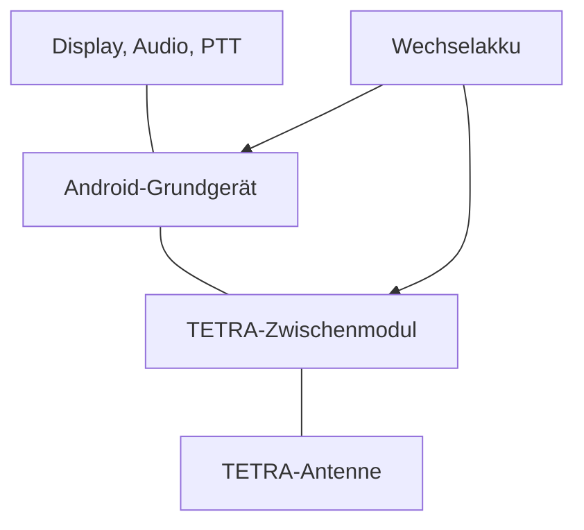
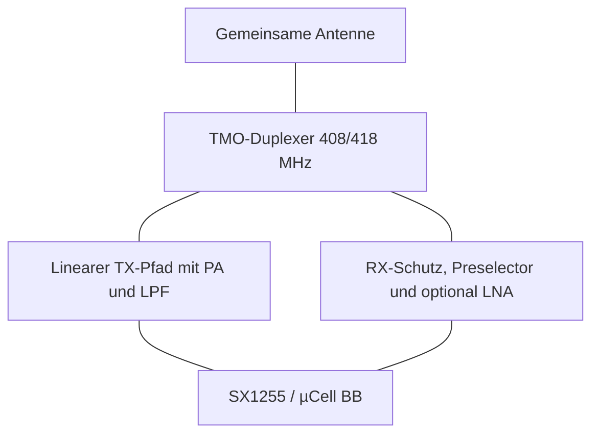
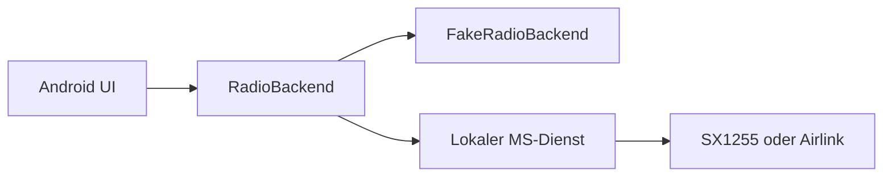
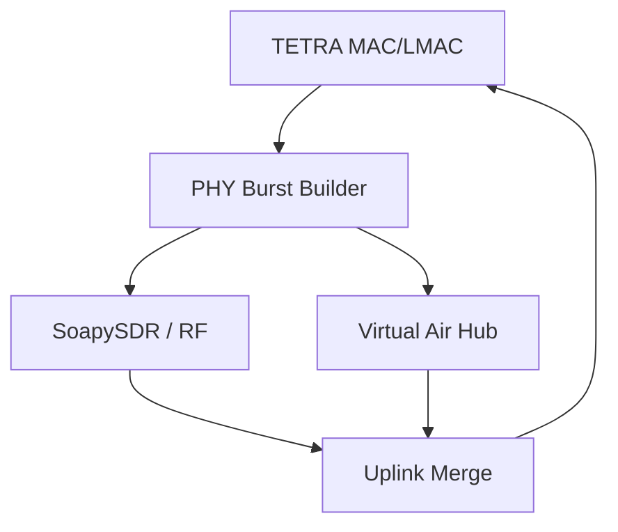
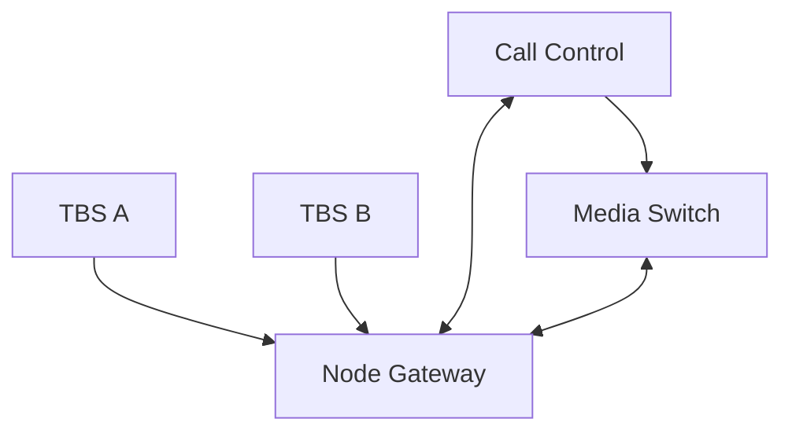
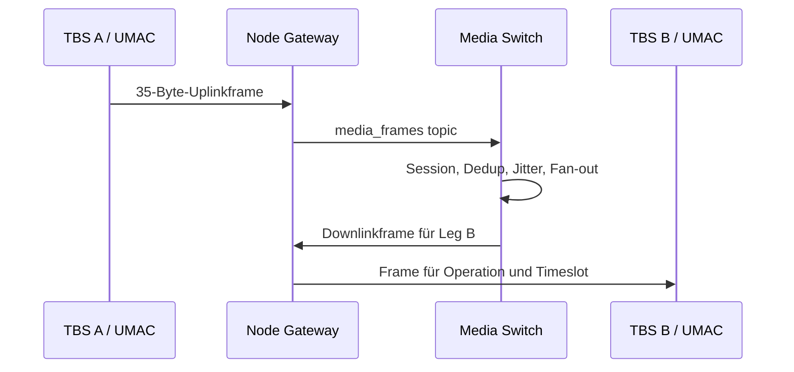

# Brainstorming: Android-TETRA-Modul, virtueller Airlink und Realtime Core

**Archivhinweis, 09.10.2026:** Diese Datei dokumentiert das im Titel beziehungsweise Quellenrahmen genannte Gespräch und dessen damalige Entscheidungen. Historische Kommandos, Planungen, Versionsangaben und Fehlerbilder bleiben erhalten; der heutige technische Stand steht in der [Gesamtroadmap](../roadmaps/gesamtroadmap.md) und in den [aktuellen Dienstanleitungen](../services/README.md). Die Archivaufnahme bestätigt keine spätere Implementierung oder Live-Abnahme.

**Arbeitsstand:** 2026-10-05. Historische Betriebsbeobachtungen und der an diesem Datum geprüfte Repository-Stand sind getrennt ausgewiesen.

## 1. Arbeitsstand und Bezugsquellen

| Feld | Wert |
|---|---|
| Thema | Modulares Android-/TETRA-Handgerät, parallele RF-/WebSocket-Luftschnittstelle und zentraler Echtzeitdienst als NetCore-eigener Brew-Ersatz |
| Zusammenfassung erstellt | 2026-10-05, Zeitzone Europe/Berlin |
| Repository | [`JanHG98/netcore-tetra`](https://github.com/JanHG98/netcore-tetra) |
| Zielbranch | `Archiving` |
| Vor dem Schreiben geprüfter Branch-Commit | [`40330525f1dafeef0d939313c5cd403a6050a543`](https://github.com/JanHG98/netcore-tetra/tree/40330525f1dafeef0d939313c5cd403a6050a543) |
| Zusätzlich abgefragter `main`-Commit | [`9116c15d645458f99e236712b67a1ad970432791`](https://github.com/JanHG98/netcore-tetra/tree/9116c15d645458f99e236712b67a1ad970432791) |
| Vergleich `Archiving`/`main` | Die für dieses Thema relevanten Source-Bäume unter `crates/`, `bins/` und den Dienst-`src`-Verzeichnissen waren identisch. `main` enthielt zusätzlich neuere Roadmap-/IAM-/Drive-Dokumentation. |
| PR | Für diesen Arbeitsstand wurde kein Pull Request angelegt, referenziert oder gemergt. |

## 2. Quellenumfang, Lücken und Belegstufen

### 2.1 Quellenbasis und offene Schnittstellen

Arbeitsgrundlagen sind die Hardwareplanung mit SCL3/SC28, der Entwurf eines Android-Prototyps, der WebSocket-Airlink und der geplante Brew-Ersatz. Der Repository-Abgleich bezieht sich auf die oben genannten `Archiving`-/`main`-Commits vom 5. Oktober 2026. Hinzu kommen die 24 ETSI-Einzeldokumente, `ETSI.pdf`, offene Hardware-/Softwareprojekte und die offizielle Sepura-SCL3-Produktinformation.

Offen bleiben die proprietäre Pinbelegung und das Hostprotokoll des SC28/SC2822-Moduls. Ein vollständiger früherer Entwicklungsstand, Originalbilder und Ausführungsprotokolle stehen nicht zur Verfügung. Es wurden weder reales Labornetz noch Android-VM, Funkgeräte oder HF-Messplatz geprüft.

### 2.2 Statusbegriffe

| Status | Bedeutung in dieser Dokumentation |
|---|---|
| **Idee** | Diskutierte Möglichkeit ohne verbindliche technische Festlegung. |
| **Beschlossen/geplant** | In der Diskussion als Zielarchitektur oder nächster Schritt festgelegt, aber noch nicht als Code nachgewiesen. |
| **Implementiert** | Am geprüften Repository-Commit im Quellcode oder in eingecheckter Konfiguration vorhanden. |
| **Getestet** | Durch einen tatsächlich ausgeführten, hier protokollierten Test belegt. Reine Codeinspektion zählt nicht. |
| **Im Betrieb bestätigt** | An realer Zielhardware beziehungsweise in einer laufenden Mehrzellenumgebung erfolgreich beobachtet. |
| **Überholt** | Durch eine spätere ausdrückliche Korrektur oder einen geprüften Repository-Befund ersetzt. |

Eine Aussage in der Planung allein wird nicht zu „implementiert“, „getestet“ oder „im Betrieb bestätigt“ hochgestuft.

## 3. Ziel, Ausgangslage und Gesamtfazit

Die Planung umfasst drei zunächst getrennte Ziele:

1. Ein SCL3-artiges Android-Handgerät, dessen TETRA-Funktion als flaches Modul zwischen Grundgerät und Wechselakku sitzt.
2. Eine virtuelle Luftschnittstelle, die jeden lokal erzeugten beziehungsweise empfangenen PHY-Burst zusätzlich über WebSocket ausgibt und RF- sowie WebSocket-Empfang parallel zusammenführt.
3. Einen zentralen, selbst betriebenen LXC-Echtzeitkern, der Gespräche, Call-Legs, Floor-Zustände und codierte Sprache zwischen mehreren Basisstationen verteilt und damit die benötigten Brew-Funktionen schrittweise durch NetCore-eigene Dienste ersetzt.

Das wichtigste Endergebnis ist die klare Trennung dieser Ebenen:

| Ebene | Zweck | Geeignete Nutzdaten | Stand am geprüften Commit |
|---|---|---|---|
| Virtueller Airlink | Virtuelle MS/TBS an dieselbe logische Luftschnittstelle anbinden; RF und virtuelle Teilnehmer parallel betreiben | Zeitmarkierte, gepackte PHY-Slot-/Burstbits plus Zell-/Carrierkontext | **Beschlossen/geplant, nicht implementiert** |
| Realtime Control | Netzweite Calls, Legs, Floor, Restore und Routing koordinieren | Ruf- und Leg-Zustände, Kommandos, Bestätigungen | **Weitgehend implementierte NetCore-Bausteine vorhanden** |
| Realtime Media | Sprache zwischen bereits aufgebauten TBS-Legs verteilen | Gepackte 274-Bit-TCH/S-Nutzdaten als 35-Byte-Frames | **Implementiert; keine reale Mehrzellenabnahme für diesen Arbeitsstand** |
| Android-MS | Benutzeroberfläche und simuliertes beziehungsweise reales Teilnehmergerät | Hochrangige Radiozustände, Call Control, SDS und Audioframes | **Idee/Plan; keine Android-App im Repository** |
| Modulares Handgerät | Physische Host-/TETRA-/Akkuintegration | SPI/I²S/GPIO/Power/RF sowie mechanische Schnittstellen | **Hardwarekonzept; kein NetCore-PCB implementiert** |

Die zentrale Gesprächsverteilung sollte deshalb **nicht** als Kopie der gesamten TETRA-Luftschnittstelle zwischen Basisstationen gebaut werden. Zwischen TBS-Standorten reichen Call-/Floor-Signalisierung und die bereits codierten Sprachframes. SYSINFO, MCCH, Scrambling, TDMA-Scheduling und andere PHY/MAC-Inhalte bleiben zelllokal. Der virtuelle Airlink ist ein eigener, zusätzlicher Vertrag für virtuelle Funkteilnehmer.

## 4. Chronologie und spätere Korrekturen

| Reihenfolge | Planungsstand | Endgültige Einordnung |
|---:|---|---|
| 1 | Pi/Compute Module, SX1255, Display, Audio, Tasten und PA sollten möglichst auf einer flachen Hauptplatine zusammengeführt werden. | **Geplant**, später zugunsten eines modularen Grundgerät-/TETRA-Einschub-Konzepts erweitert, nicht vollständig verworfen. |
| 2 | Ein „Combiner“ für TX/RX wurde erwogen. | **Präzisiert:** Ein gewöhnlicher passiver Combiner ist ungeeignet; für getrennte TMO-Frequenzen ist eine ausreichend isolierende frequenzselektive Duplexweiche erforderlich. |
| 3 | Ein einfacher schneller TX/RX-Antennenumschalter wurde zunächst als bevorzugte TMO-Lösung vorgeschlagen. | **Überholt:** Der vorhandene TMO-/MS-Aufbau wurde mit parallelen RX-/TX-Pfaden präzisiert. Für die zu übernehmende Full-Duplex-Frontend-Architektur ist ein einfacher T/R-Schalter kein Drop-in-Ersatz. |
| 4 | DMO sollte über denselben Duplexer laufen. | **Überholt/präzisiert:** DMO liegt auf derselben Frequenz und braucht einen gesonderten Bypass-/Umschaltpfad. Das geprüfte `ms-mode` führt DMO derzeit ausdrücklich als nicht implementiert. |
| 5 | Das Gerät sollte eine komplette integrierte TETRA-Hauptplatine erhalten. | **Erweitert:** Nach dem SCL3-Hinweis wurde ein Android-Grundgerät plus TETRA-Zwischenmodul im Akkuschacht als bevorzugtes mechanisches Konzept festgehalten. |
| 6 | Eine Android-VM sollte das Gerät zunächst „pseudomäßig“ abbilden. | **Geplant:** UI mit `RadioBackend` und `FakeRadioBackend`, später austauschbar gegen den echten lokalen MS-Dienst. Kein Projekt wurde für diesen Arbeitsstand angelegt. |
| 7 | Alles, was über RF gesendet/empfangen wird, sollte zusätzlich über WebSocket laufen. | **Geplant:** eigenständiger virtueller Airlink auf Burstebene, parallel zum SoapySDR-Pfad, nicht als exklusives neues PHY-Backend. |
| 8 | Derselbe Socket sollte Basisstationen für Gespräche synchronisieren und Brew ersetzen. | **Präzisiert:** Call-/Media-Verteilung nutzt eigene Control-/Media-Protokolle und codierte 35-Byte-Sprachframes. Der Airlink bleibt getrennt. Ein zentraler LXC darf mehrere Dienste beherbergen, sollte sie aber logisch getrennt halten. |
| 9 | Frühere Repository-Einschätzung: zentraler Call Control beobachte Rufe, baue aber möglicherweise keine Ziel-Legs auf. | **Am Prüfdatum teilweise überholt:** Operator-/API-gestartete Calls erzeugen aktuelle `CallControlGroupStart`-/`CallControlIndividualStart`-Kommandos. Für einen nur aus TBS-Telemetrie beobachteten teilnehmergestarteten Gruppenruf wurde im aktuellen `observe_group_start` jedoch weiterhin kein automatischer Fan-out zu weiteren affiliierten Zellen nachgewiesen. |

## 5. Endgültige Anforderungen und Entscheidungen

### 5.1 Modulares Android-/TETRA-Gerät

**Beschlossen/geplant:** Das eigene Gerät soll aus drei mechanisch und elektrisch klaren Schichten bestehen:



- Das Grundgerät enthält Android/Linux-Host, Display, Touch, Audio, WLAN/Bluetooth und Bedienelemente.
- Das TETRA-Modul enthält SX1255/µCell-BB-Funkteil, Referenztakt, HF-Frontend, Endstufe, Schutz/Filter, Messung und Modulidentifikation.
- Der Akku sitzt hinter dem TETRA-Modul und versorgt Modul sowie Grundgerät.
- Für ein selbst entwickeltes Grundgerät soll **nur ein** leistungsfähiger Hostrechner verwendet werden. Ein zweiter Pi im Funkmodul ist nicht erforderlich, solange SPI/I²S/GPIO sauber zur Modulgrenze geführt werden.
- Ein separates kleines Supervisor-MCU, in der Diskussion als RP2040 vorgesehen, darf PTT, Notruf, Tasten, Drehgeber, PA-Freigabe, Temperatur, Vor-/Rücklaufleistung, Watchdog und Soft-Power übernehmen.
- Seitliche Tasten können auf einer Flex-/Nebenplatine sitzen; das widerspricht nicht dem Ziel eines integrierten Gesamtsystems.

Das offizielle SCL3 bestätigt nur das Produktprinzip: Android-/Breitbandgerät, optionales, entnehmbares SC28-TETRA-Modul und Hot-Swap-Akku. Die offizielle Konformitätserklärung nennt das Modul `SC2822`. **Nicht verfügbar** sind Steckverbinderbelegung, Hostprotokoll, Authentifizierung oder interne HF-Topologie. Ein eigenes Modul für ein originales SCL3 ist daher ohne Reverse Engineering und rechtlich/technisch zulässige Schnittstellendokumentation nicht planbar. Das Projektziel ist folglich ein **eigenes modulares Gerät**, nicht die Behauptung eines kompatiblen SCL3-Nachbaus.

### 5.2 Geplante Modulschnittstelle

| Signalgruppe | Geplanter Zweck | Status |
|---|---|---|
| Akku-/Systemspannung und Masse | Gemeinsame Versorgung; getrennte robuste Leistungskontakte | **Geplant** |
| Geregelte 3,3 V/5 V nach konkretem Power-Tree | Logik, SX1255, Referenz, Peripherie | **Geplant; noch nicht dimensioniert** |
| SPI | SX1255-Konfiguration und Registerzugriff | **Geplant** |
| I²S beziehungsweise bestehende digitale I/Q-Schnittstelle | Funkdatenstrom zum Host | **Geplant; Pin-/Taktvertrag offen** |
| `TX_EN`, `RX_EN`, `PA_ENABLE`, `RESET` | RF- und Modulsteuerung | **Geplant** |
| I²C/EEPROM | Modulkennung, Revision, Kalibrierdaten | **Geplant** |
| Temperatur-/Fehler-/SWR-Signale | Schutzabschaltung und Diagnose | **Geplant** |
| Optional USB | Debugging oder alternative Modularchitektur | **Idee** |
| Koax-/definierter RF-Kontakt | Verbindung zur Gehäuseantenne | **Geplant; mechanisch offen** |

Ein feiner Board-to-Board-Steckverbinder darf Datensignale führen; Akku- und PA-Strom sollten über dafür ausgelegte, robuste Kontakte laufen. Es wurde kein konkreter Steckverbinder final ausgewählt.

### 5.3 TMO-/DMO-HF-Architektur: endgültige Korrektur

Für das in der Planung verwendete Beispiel gilt:

| Richtung am Handgerät | Frequenz |
|---|---:|
| TMO-Uplink / TX | 408 MHz |
| TMO-Downlink / RX | 418 MHz |
| Duplexabstand | 10 MHz |

**Beschlossen/geplant:** Das TMO-Frontend hält RX und TX unabhängig verfügbar. Der bestehende MS-Stack und die herangezogene `ms-mode`-Dokumentation gehen von getrennten RX-/TX-Ketten und einem offen bleibenden TX-Stream mit diskontinuierlichen Uplink-Bursts aus.



Die ETSI-Luftschnittstelle legt zwar den Uplink-Zeitrahmen gegenüber dem Downlink um zwei Timeslots zurück. Diese normative Zeitlage macht einen sorgfältig geplanten Halbduplexentwurf prinzipiell denkbar, ersetzt aber nicht die explizite Hardware-/Softwareannahme des vorhandenen Full-Duplex-Frontends. Für die direkte Übernahme des aktuellen MS-Ansatzes bleibt ein einfacher Antennenumschalter daher **verworfen**.

Für DMO wäre ein eigener, den TMO-Duplexer umgehender TX/RX-Pfad erforderlich. Das ist **Idee/Späterziel**; weder das modulare PCB noch DMO im geprüften `ms-mode` sind implementiert.

### 5.4 Baseband, PA und Stromversorgung

Die Planung legte keine produktionsfertige Schaltung fest. Der belastbare Stand ist:

- Der alte SX1255 Dev HAT am genannten Commit enthält KiCad-Schaltplan, PCB und Produktionsdaten, war laut Projekt aber ausdrücklich eine nicht produktionsoptimierte Entwicklungsplattform.
- Die aktuelle µCell-BB enthält KiCad-Quellen und freigegebene Produktionspakete. Die am Archivdatum geprüfte Dokumentation nennt SX1255, 38,4-MHz-TCXO mit 0,5 ppm, 400–510 MHz Abstimmbereich, 0–3 dBm gemessene TETRA-TX-Leistung im spezifizierten Bereich und etwa −117 dBm TETRA-T1-Empfindlichkeit für v1.0.
- Die µCell-PA-Mini besteht im geprüften Repository weiterhin nur aus einem Draw.io-Konzept mit `CMX90A007`, `CMX90A009`, Matching/LPF, Return Bridge/ADC, DAC, RP2040 und Spannungsversorgung. Die geprüfte µCell-Dokumentation beschreibt als Ziel ungefähr 1 W und sagt ausdrücklich, dass noch Arbeit bis zur Fertigbarkeit fehlt.
- Die frühere Entwicklungsidee, für ein Handgerät nur die kleinere PA-Stufe in einem ungefähr 1–2-W-Bereich zu verwenden, bleibt ein **Entwicklungsansatz**, keine geprüfte Schaltung und keine zugesicherte Linearität.
- TETRA benötigt eine lineare Verstärkung mit kontrollierter Nachbarkanalleistung. PA, TX-Filter, Duplexer/RX-Isolation, thermische Auslegung, Richtkoppler und Schutzabschaltung müssen gemeinsam vermessen werden.
- Für das Handgerät wurde ein 2S-Lithium-Ionen-System mit Power-Path, BMS, Temperaturmessung, Fuel Gauge, 5-V-Hostschiene und separater sauberer Analogversorgung vorgeschlagen. Kein Lade-/BMS-Bauteil wurde final ausgewählt.

Die ETSI-Leistungsklassen aus dem verfügbaren EN-300-394-1-Dokument wurden als Planungsreferenz genannt: Klasse 3 = 35 dBm, 3L = 32,5 dBm, 4 = 30 dBm und 4L = 27,5 dBm. Daraus folgt keine Konformität des geplanten Geräts. Eine echte Abnahme braucht unter anderem Leistung, Frequenzfehler, Modulation/EVM, Nachbarkanalleistung, Oberwellen, Schalttransienten und RX-Empfindlichkeit.

### 5.5 Android-VM und Backend-Abstraktion

**Beschlossen/geplant:** Die erste Android-Ausbaustufe sollte kein bloßes Klickbild werden, sondern eine ausführbare UI gegen einen simulierten Funkdienst.



Der geplante UI-/Backend-Vertrag umfasst mindestens:

- Modul eingesetzt/entfernt und Teilnehmeridentität;
- Netzsuche, Synchronisation, Registrierung und Dienststatus;
- TMO/DMO-Anzeige, wobei DMO zunächst simuliert bleibt;
- Gruppenliste, aktive Gruppe, Affiliation und Late Entry;
- PTT, Floor-Status, Sprecherkennung, Rufpriorität und Notruf;
- Individual-/Duplexrufstatus;
- SDS/Statusnachrichten;
- RSSI/Qualität, Fehler und Reconnect;
- Audioeingang/-ausgang sowie 274-Bit-TCH/S-Sprachframes.

Die zeitkritische TDMA-/PHY-Verarbeitung gehört nicht in Android-UI-Callbacks. Vorgesehen ist ein lokaler nativer Rust-/Linux-Dienst, in der Diskussion sinngemäß `netcore-ms-service`, während Android nur hochrangige Bedien- und Audioereignisse austauscht. Der genaue lokale IPC-Vertrag wurde noch nicht festgelegt.

**Geprüfter Befund:** Im NetCore-Repository existiert kein Android-Gradle-Projekt, keine `AndroidManifest.xml` und keine Kotlin-Datei. In der Prüfumgebung ist Java 17 vorhanden, aber weder Android-SDK/ADB/Emulator noch Gradle wurden gefunden. Es wurde keine APK gebaut und keine VM gestartet.

## 6. Virtueller RF-/WebSocket-Airlink

### 6.1 Funktionsziel

**Beschlossen/geplant:** Jeder von der TBS erzeugte PHY-Slot soll gleichzeitig an das reale SDR und an verbundene virtuelle Teilnehmer gehen. Empfangene RF-Slots und eingespeiste WebSocket-Slots sollen in eine gemeinsame, deterministische Uplink-Verarbeitung gelangen.



Der Airlink sollte als optionaler Tap/Sidecar am existierenden PHY-Pfad gebaut werden, nicht als zweites exklusives `PhyBackend`. Der aktuelle `PhyBackend` ist eine Auswahl zwischen `Undefined`, `None` und `SoapySdr`; würde WebSocket nur als weiterer exklusiver Backendwert ergänzt, wäre der verlangte Parallelbetrieb nicht erreicht.

### 6.2 Geplante Integrationspunkte im aktuellen Code

| Stelle | Geprüfte Funktion | Vorgesehene Airlink-Erweiterung |
|---|---|---|
| `crates/tetra-entities/src/phy/phy_bs.rs::build_dl_burst` | Erzeugt einen vollständigen `TIMESLOT_TYPE4_BITS`-Burst; die Konstante ist `255 * 2 = 510` Bits. | Den fertig gebauten Burst mit Carrier und `TdmaTime` zusätzlich nichtblockierend an den Hub geben. |
| `TxSlotBits` und `RxSlotBits` in `crates/tetra-pdus/src/phy/traits/rxtx_dev.rs` | Gemeinsamer Vertrag zwischen PHY und RF-Gerät. | Wire-Datentypen eng daran ausrichten, ohne geliehene Slices direkt über Thread-/Netzgrenzen zu tragen. |
| `RxTxDevSoapySdr::rxtx_timeslot` | Modulation/Demodulation und reale RF-I/O. | Nicht durch Netzwerk-I/O blockieren; RF bleibt autonom. |
| `PhyBs::split_rxslot_and_send_to_lmac` | Übergibt demodulierte Kandidaten an LMAC. | Validierte virtuelle RX-Slots an derselben fachlichen Grenze einspeisen. |
| bestehende Crossbeam-Kanäle | Entkoppeln bereits Medien-/Netzwerkpfade vom TDMA-Thread. | Dasselbe Muster mit begrenzten Queues und `try_send` verwenden. |

### 6.3 Empfohlener Wire-Vertrag `netcore-airlink-v1`

Der folgende Vertrag wurde in der Planung entworfen, aber **nicht implementiert**:

| Nachricht | Richtung | Inhalt |
|---|---|---|
| `hello` / `hello_ack` | beidseitig | Protokollversion, Client-ID, Rolle (`virtual_ms`, `virtual_bs`, `monitor`), Fähigkeiten, Authentisierungsresultat |
| `cell_config` | TBS → Client | stabile `cell_id`, MCC, MNC, LA, Colour Code, Carrier/Frequenzen und unterstützte Modi |
| `clock_sync` | TBS → Client | Hyperframe-/Multiframe-/Frame-/Timeslot-Kontext, monotone Zeit und zulässiges Einspeisefenster |
| `downlink_slot` beziehungsweise Batch | TBS → Client | `event_id`, `cell_id`, Carrier, `TdmaTime`, Bursttyp, 510 gepackte Bits, Flags |
| `uplink_slot` | Client → TBS | `client_id`, `event_id`, `cell_id`, Carrier, Ziel-`TdmaTime`, Burstbits und optionale Simulationsmetadaten |
| `stats` | beidseitig | Queuefüllung, Latenz, verworfene/zu späte/doppelte Slots und Verbindungsqualität |
| `error` | beidseitig | maschinenlesbarer Code, Korrelation und Diagnose ohne Geheimnisse |

V1 darf zur Fehlersuche JSON-Steuerdaten verwenden. Für Burstpayloads ist ein binäres WebSocket-Frame beziehungsweise ein kompakter binärer Envelope sinnvoller als Base64. Die genaue Kodierung ist noch per ADR festzulegen.

Die in der Planung vorgeschlagene Konfiguration lautete:

```toml
[airlink_ws]
enabled = true
bind = "0.0.0.0:8098"
path = "/v1/air"
mode = "hybrid"
max_clients = 32
max_late_slots = 1
merge_policy = "rf_preferred"
token_file = "/etc/netcore/airlink.token"
```

**Status:** reiner Vorschlag. Weder Abschnitt noch Port, Pfad, Tokenformat oder Protokollname kommen am geprüften Commit außerhalb älterer Archivtexte vor.

### 6.4 Zeit, Merge, Überlast und Sicherheit

Verbindliche Entwurfsregeln für eine spätere Implementierung:

- Netzwerk-I/O darf den RF-/TDMA-Thread nie blockieren.
- Alle Queues müssen begrenzt sein; Überlauf erzeugt Zähler und verwirft nach einer dokumentierten Echtzeitregel.
- Alte Sprache und alte PHY-Slots werden nach Reconnect nicht nachgesendet.
- Ein virtueller Slot braucht `cell_id`, Carrier, vollständige TDMA-Zeit, Client-/Ereignis-ID und Sequenzschutz.
- Mehrfach empfangene identische Ereignisse werden dedupliziert. Kollisionen verschiedener Quellen im selben Slot müssen sichtbar behandelt werden; stilles „last writer wins“ ist unzulässig.
- Für den ersten Hybridmodus wurde `rf_preferred` vorgeschlagen: valide reale RF-Daten haben bei einer identischen Slotbelegung Vorrang. Andere Simulationsmodi dürfen später bewusst konfiguriert werden.
- Zu spät eintreffende Slots werden verworfen; `max_late_slots` ist eine Toleranzgrenze, keine Aufforderung zum nachträglichen Einspeisen.
- Ein berechtigter Uplink-Injektor ist sicherheitstechnisch einem Sender gleichzustellen. Der aktuelle offene Labormodus des Node Gateway ist hierfür nicht ausreichend. Mindestens Netzisolation, gegenseitige Authentisierung, Rollen, Rate Limits und Auditereignisse sind erforderlich.
- `cell_id` darf nicht nur aus einer lokalen Carrierzahl bestehen. Sie muss Netzzusammenhang und Zelle eindeutig trennen, damit mehrere MCC/MNC-/Carrier-Kontexte später nicht kollidieren.

### 6.5 Was ausdrücklich nicht über den Airlink soll

- Keine dauerhafte rohe IQ-Übertragung als Standardmodus; sie ist bandbreiten- und latenzintensiv und bindet virtuelle Clients unnötig an die konkrete Modulation.
- Keine Vermischung mit Leitstellen-Telemetrie oder dem existierenden Node-Gateway-Backend-Protokoll.
- Keine Nutzung des Airlinks als Ersatz für Call Control oder Media Switch.
- Keine Behauptung von RF-Phasen-, Frequenz- oder Simulcast-Synchronisation zwischen Basisstationen.

## 7. Zentraler Echtzeitkern und Brew-Ersatz

### 7.1 Bedeutung von „Basisstationen synchronisieren“

Im letzten Projektwunsch bedeutet Synchronisation:

- derselbe logische Ruf ist auf mehreren Zellen bekannt;
- die benötigten lokalen TBS-Legs werden rechtzeitig aufgebaut;
- Gruppen-Floor und Sprecherzustand werden netzweit konsistent gehalten;
- codierte Sprachframes werden live an alle aktiven Ziel-Legs verteilt;
- bei Duplex-Individualrufen fließen zwei unabhängige Richtungen gleichzeitig.

Es bedeutet **nicht**:

- phasengleiche HF-Träger;
- Gleichkanal-Simulcast/SFN;
- zentrale Erzeugung sämtlicher Zell-SYSINFO-/MCCH-Bits;
- Ersetzung des lokalen TDMA-Schedulers durch einen entfernten LXC.

### 7.2 Zieltopologie

Ein einzelner LXC darf für ein kleines Labor die zentralen Prozesse gemeinsam beherbergen. Die Dienste sollen trotzdem getrennte Verantwortlichkeiten und Protokolle behalten:



Der tatsächliche Sprachweg ist am Prüfdatum:



Call Control bleibt Eigentümer des logischen Calls und der Legs. Der Media Switch darf keine Air-Interface-Calls erfinden; er baut seinen Routinggraphen aus den Call-Control-Ereignissen.

### 7.3 Warum 35-Byte-Sprachframes und nicht der PHY-Bitstream

Der aktuelle NetCore-Code definiert `TETRA_ACELP_FRAME_BYTES = 35`: Zwei 137-Bit-Sprachframes eines normalen TCH/S-Slots ergeben 274 Nutzbits, auf Bytes aufgerundet 35. Das verfügbare EN-300-395-2-Dokument bestätigt 137 Bits je 30-ms-Sprachframe und einen 274-Bit-Type-1-Block für zwei Sprachframes. Das ISI-Dokument EN 300 392-3-8 beschreibt ebenfalls Callreferenz, Framezählung und ungefähr 56,67-/60-ms-Sprachtransport.

Für TBS-zu-TBS-Verteilung sind diese codierten Nutzdaten die richtige Ebene:

- erheblich weniger Daten als IQ oder vollständige 510-Bit-PHY-Bursts;
- kein erneutes ACELP-Decodieren/Encodieren;
- Ziel-TBS kann den Frame in ihren eigenen lokalen TCH/S-Zeitschlitz einplanen;
- lokale Zellparameter und PHY-Synchronisation bleiben unabhängig;
- der gleiche Media Switch kann einen Quellstream an beliebig viele Legs auffächern.

Bei einem Vollduplex-Individualruf sind beide Richtungen eigenständige Sequenzströme. WebSocket/TCP ist bidirektional, aber „Duplex“ wird fachlich nicht durch einen einzigen gemischten Stream hergestellt.

### 7.4 Bestehende Implementierung am geprüften Commit

| Baustein | Nachgewiesener geprüfter Stand | Statusgrenze |
|---|---|---|
| TBS-Medienvertrag | `MediaUplinkFrame`/`MediaDownlinkFrame`, Codec `TetraAcelp0`, 35-Byte-Prüfung | **Implementiert** |
| UMAC-Brücke | Aktive UL-TCH/S-Nutzdaten werden gepackt; DL-Frames werden nur für gebundene Operation, offenen Circuit und gültigen logischen Timeslot eingeplant | **Implementiert** |
| Nichtblockierende Entkopplung | `media_bridge_channel(1_024)`; begrenzte Crossbeam-Queues; UMAC verarbeitet höchstens 16 DL-Frames pro Tick, Worker höchstens 64 UL-Frames pro Drain | **Implementiert; Dimensionierung nicht im Labor abgenommen** |
| Node-Protokoll | `/ws/node`, `netcore-control-room-node-v1`; JSON-Payload in WebSocket-Binärframes | **Implementiert** |
| Backend-Protokoll | `/ws/backend`, `netcore-node-gateway-backend-v1`; JSON-Text, Media Switch abonniert nur `media_frames` | **Implementiert** |
| Call-Control-Mediaevents | `/ws/media`, `netcore-call-control-media-v1`, TCP_NODELAY, revisionsbehaftete Snapshots/Ereignisse | **Implementiert** |
| RouteReady | `POST /api/v1/media/route-ready`; Floor erst nach aktiven Legs und passender bestätigter Revision | **Implementiert** |
| Media Switch | Session-/Leg-Routing, Dedup, adaptive 1–12-Frame-Jitterpufferung, Startwert 2 Frames, fünf Frames Kaltstartpuffer, Fan-out und Downlinkqueue | **Implementiert** |
| Managed Calls | API-/Operatorstart erzeugt `CallControlGroupStart` beziehungsweise `CallControlIndividualStart`; Ziel-TBS baut lokale CMCE-Ressourcen auf und bindet die Operation an UMAC | **Implementiert** |
| Beobachteter teilnehmergestarteter Gruppenruf | Quell-Leg wird aus Telemetrie erfasst; aktueller `observe_group_start` startet dabei nicht nachweisbar automatisch weitere affiliierte Ziel-Legs | **Teilweise implementiert/offen** |
| Nichtlokaler teilnehmergestarteter Individualruf | Der lokale CMCE-Setup-Pfad prüft weiterhin Brew und meldet bei deaktiviertem Brew „Brew disabled“ | **Brew-Abhängigkeit weiterhin vorhanden** |
| Produktionssicherheit | Node Gateway, Call Control und Media Switch akzeptieren nur `security.mode = "open_lab"`; kein Login/Token/TLS in diesen Dienstpaketen | **Nur isoliertes Labornetz** |

### 7.5 Verbleibender Brew-Umbau

Der vorhandene Brew-Code ist bereits transportabstrahiert: `BrewWorker<T: NetworkTransport>` kann prinzipiell WebSocket, QUIC oder TCP verwenden. Fachlich und im Datenmodell ist er aber weiterhin Brew/TetraPack-spezifisch.

Noch vorhandene Bezeichnungen und Kopplungen umfassen unter anderem:

- `BrewEntity` und `Brew2`;
- `brew_uuid`;
- `BrewNotification`;
- `NetworkCircuitSetupRequest`, `NetworkCircuitConnectRequest` und verwandte Nachrichten;
- Telemetrie `BrewConnected`;
- `/brew/` mit WebSocket-Subprotokoll `brew`;
- Brew-spezifische Registrierung, Affiliation, SDS, Group TX/Idle, Circuit- und DTMF-Nachrichten;
- den CMCE-Pfad, der nichtlokale P2P-Rufe bei nicht aktivem Brew abweist.

Als fachlicher Zielzustand wurden neutrale Begriffe vorgeschlagen:

| Am Prüfdatum Brew-spezifisch | Zielbegriff |
|---|---|
| `BrewEntity` | `CoreInterconnect` oder ein klar abgegrenzter Legacy-Brew-Adapter |
| `brew_uuid` | `network_call_id` beziehungsweise stabile `operation_id` |
| `BrewNotification` | `InterconnectEvent` |
| `BrewConnected` | `RealtimeCoreConnected` |
| `NetworkCircuitSetupRequest` | `CallOffer`/`CallLegSetup` im neutralen Core-Vertrag |

Diese Umbenennung allein genügt nicht. Der NetCore-Kern muss vor der Entfernung von Brew mindestens folgende Funktionen eigenständig übernehmen:

1. Teilnehmer-/Gruppenlage und Zielzellen bestimmen.
2. Einen MS-initiierten Gruppenruf in einen globalen Call überführen und weitere affiliierte TBS-Legs starten.
3. Einen nichtlokalen MS-initiierten Individualruf als zentrales `CallOffer` routen, statt ihn lokal wegen fehlendem Brew abzulehnen.
4. Floor-, Prioritäts-, Notruf-, Restore- und Release-Zustände idempotent korrelieren.
5. Erst nach bereiten Ziel-Legs Sprache freigeben beziehungsweise frühe Frames begrenzt puffern.
6. Bei Core-Ausfall lokale Zellrufe weiterlaufen lassen, aber niemals alte Audioframes nach Wiederverbindung abspielen.
7. Brew bei Bedarf zunächst als Adapter am Rand behalten, statt sein Protokoll in den neuen neutralen Kern zu kopieren.

### 7.6 Getrennte Protokolle

Als Arbeitsrichtung empfohlen wurde folgende begriffliche Trennung:

| Vertrag | Zweck | Geprüfte Entsprechung |
|---|---|---|
| `netcore-airlink-v1` | Virtuelle PHY-Slots/Bursts | **Noch nicht vorhanden** |
| `netcore-realtime-control-v1` | Geplanter neutraler Call-/Leg-/Floor-Interconnect | Am Prüfdatum auf mehrere vorhandene Verträge und `ControlCommand`/Telemetrie verteilt |
| `netcore-realtime-media-v1` | Geplanter neutraler Hochraten-Medienvertrag | Am Prüfdatum über `netcore-control-room-node-v1`, `netcore-node-gateway-backend-v1` und `netcore-call-control-media-v1` realisiert |

Ein späterer konsolidierter Vertrag muss nicht zwangsläufig alle geprüften Protokolle ersetzen. Wichtig ist, Control, Media und Airlink nicht auf eine einzige WebSocket-Verbindung zu zwingen. Getrennte Verbindungen reduzieren Head-of-Line-Blocking und erlauben unterschiedliche Grenzen, Rechte und Wiederverbindungsregeln. QUIC bleibt eine spätere Transportoption; V1 kann WebSocket nutzen.

## 8. Ports, Pfade, Protokolle und technische Parameter

### 8.1 Am Prüfdatum im Repository implementiert

| Komponente | Port/Pfad | Protokoll/Format | Status |
|---|---|---|---|
| Node Gateway | `0.0.0.0:8080`, `/ws/node` | `netcore-control-room-node-v1`, JSON als WS-Binärpayload | **Implementiert** |
| Node Gateway Backend | `0.0.0.0:8080`, `/ws/backend` | `netcore-node-gateway-backend-v1`, JSON; Topic `media_frames` | **Implementiert** |
| Call Control | `0.0.0.0:8120` | REST/WebUI; State standardmäßig `/var/lib/netcore-call-control/calls.json` und `.bak` | **Implementiert** |
| Call-Control-Mediaevent | `:8120/ws/media` | `netcore-call-control-media-v1`, JSON-Text | **Implementiert** |
| RouteReady | `POST :8120/api/v1/media/route-ready` | JSON/HTTP | **Implementiert** |
| Media Switch | `0.0.0.0:8130` | REST/WebUI; verbindet `/ws/backend` und `/ws/media` | **Implementiert** |
| Brew/TetraPack | konfigurierbarer Host/Port; Default im Parser `443`, Beispielkonfiguration `8081`; Endpoint `/brew/` | Subprotokoll `brew`, optional TLS und Digest Auth | **Implementiert; Legacy-/externer Interconnect** |

Keine Zugangsdaten aus Beispiel- oder Nutzerkonfigurationen wurden in dieses Archiv übernommen.

### 8.2 Am Prüfdatum relevante Medienparameter

| Parameter | Wert am geprüften Commit | Bedeutung |
|---|---:|---|
| TCH/S-Nutzdaten | 274 Bit, gepackt auf 35 Byte | Zwei 137-Bit-Sprachframes |
| `frame_duration_ms` | 60 ms | Konfigurierter Media-Switch-Takt |
| Jitter-Start | 2 Frames / 120 ms | Normaler Startwert |
| Jitterbereich | 1–12 Frames / 60–720 ms | Adaptive Grenzen |
| Kaltstartpuffer | 5 Frames | Schutz der ersten Wörter während Routenerstellung |
| Kaltstart-Maximalalter | 600 ms | Verwerfungsgrenze, kein dauerhafter Zusatzdelay |
| Media-Bridge-Kapazität an der TBS | 1.024 Frames je Richtung | Begrenzte Prozessqueue |
| UMAC-DL-Drain | maximal 16 Frames pro Tick | Schutz der zeitkritischen Verarbeitung |
| Node-Worker-UL-Drain | maximal 64 Frames pro Poll | Begrenzter Netzwerkbatch |
| Media-Switch-TCP | `TCP_NODELAY` aktiv | Reduziert Nagle-Verzögerung, garantiert aber keine obere Latenz |

### 8.3 Nur vorgeschlagener Airlink

| Parameter | Vorschlag | Status |
|---|---:|---|
| Port | `8098` | **Nicht implementiert/reserviert** |
| Pfad | `/v1/air` | **Nicht implementiert** |
| Protokoll | `netcore-airlink-v1` | **Nicht implementiert** |
| Betriebsart | `hybrid` | **Nicht implementiert** |
| Merge | `rf_preferred` | **Nicht implementiert** |
| Maximal verspätet | 1 Slot | **Noch per Test/ADR zu bestätigen** |
| Clients | 32 | **Unbegründeter Planungsstartwert; Lasttest offen** |

### 8.4 Normative Zeitbezüge

Aus dem verfügbaren EN 300 392-2 V3.8.1 wurden für diese Planung geprüft:

- vier Timeslots bilden einen TDMA-Frame von `170/3 ms`, ungefähr 56,67 ms;
- 18 Frames bilden ein Multiframe von 1,02 s;
- der Uplink-Zeitrahmen an der BS ist gegenüber dem Downlink um zwei Timeslots verzögert.

Diese Werte helfen bei Slotzeitstempeln und Latenzgrenzen. Sie belegen weder eine Airlink-Implementierung noch garantierte Internet-/LXC-Echtzeit.

## 9. Relevante Dateien und geprüfter Repository-Abgleich

Alle Implementierungslinks dieses Abschnitts sind auf den geprüften Ausgangscommit `40330525f1dafeef0d939313c5cd403a6050a543` festgelegt.

### 9.1 PHY und geplanter Airlink

- [`crates/tetra-entities/src/phy/phy_bs.rs`](https://github.com/JanHG98/netcore-tetra/blob/40330525f1dafeef0d939313c5cd403a6050a543/crates/tetra-entities/src/phy/phy_bs.rs): Burstbau, `TxSlotBits`, `rxtx_timeslot` und Weitergabe von RX-Kandidaten.
- [`crates/tetra-pdus/src/phy/traits/rxtx_dev.rs`](https://github.com/JanHG98/netcore-tetra/blob/40330525f1dafeef0d939313c5cd403a6050a543/crates/tetra-pdus/src/phy/traits/rxtx_dev.rs): geprüfter PHY-Gerätevertrag.
- [`crates/tetra-entities/src/phy/components/soapy_dev.rs`](https://github.com/JanHG98/netcore-tetra/blob/40330525f1dafeef0d939313c5cd403a6050a543/crates/tetra-entities/src/phy/components/soapy_dev.rs): reale SoapySDR-I/O.
- [`crates/tetra-config/src/bluestation/sec_phy.rs`](https://github.com/JanHG98/netcore-tetra/blob/40330525f1dafeef0d939313c5cd403a6050a543/crates/tetra-config/src/bluestation/sec_phy.rs): exklusive Backendauswahl; kein Airlink-Tap.

Repository-Suche nach `airlink`, `VirtualAir`, `netcore-airlink-v1`, `/v1/air`, `max_late_slots` und `rf_preferred` ergab außerhalb des Archivs keine Treffer. **Geprüfter Befund: nicht implementiert.**

### 9.2 Realtime Media und Node Gateway

- [`crates/tetra-entities/src/net_media/mod.rs`](https://github.com/JanHG98/netcore-tetra/blob/40330525f1dafeef0d939313c5cd403a6050a543/crates/tetra-entities/src/net_media/mod.rs): 35-Byte-Vertrag und begrenzte Kanäle.
- [`crates/tetra-entities/src/umac/umac_bs.rs`](https://github.com/JanHG98/netcore-tetra/blob/40330525f1dafeef0d939313c5cd403a6050a543/crates/tetra-entities/src/umac/umac_bs.rs): Packen des Uplinks, Operation-Bindung und DL-Scheduling.
- [`bins/bluestation-bs/src/main.rs`](https://github.com/JanHG98/netcore-tetra/blob/40330525f1dafeef0d939313c5cd403a6050a543/bins/bluestation-bs/src/main.rs): `media_bridge_channel(1_024)` und Worker-Verdrahtung.
- [`crates/tetra-entities/src/net_control_room/protocol.rs`](https://github.com/JanHG98/netcore-tetra/blob/40330525f1dafeef0d939313c5cd403a6050a543/crates/tetra-entities/src/net_control_room/protocol.rs) und [`codec.rs`](https://github.com/JanHG98/netcore-tetra/blob/40330525f1dafeef0d939313c5cd403a6050a543/crates/tetra-entities/src/net_control_room/codec.rs): Node-Nachrichten und JSON-Kodierung.
- [`system-backend/node-gateway/src/ws.rs`](https://github.com/JanHG98/netcore-tetra/blob/40330525f1dafeef0d939313c5cd403a6050a543/system-backend/node-gateway/src/ws.rs): Node-/Backend-WebSockets, Topic-Abonnement und Media-Weiterleitung.
- [`system-backend/media-switch/src/state.rs`](https://github.com/JanHG98/netcore-tetra/blob/40330525f1dafeef0d939313c5cd403a6050a543/system-backend/media-switch/src/state.rs): Routinggraph, Kaltstart, Dedup, Jitter, Fan-out und Recorder-Taps.
- [`system-backend/media-switch/config/media-switch.example.toml`](https://github.com/JanHG98/netcore-tetra/blob/40330525f1dafeef0d939313c5cd403a6050a543/system-backend/media-switch/config/media-switch.example.toml): geprüfte Beispielwerte.

### 9.3 Call Control und verbleibende Brew-Abhängigkeit

- [`system-backend/call-control/src/state.rs`](https://github.com/JanHG98/netcore-tetra/blob/40330525f1dafeef0d939313c5cd403a6050a543/system-backend/call-control/src/state.rs): logische Calls, managed Legs, Floor, RouteReady und beobachtete Calls.
- [`crates/tetra-entities/src/net_control/commands.rs`](https://github.com/JanHG98/netcore-tetra/blob/40330525f1dafeef0d939313c5cd403a6050a543/crates/tetra-entities/src/net_control/commands.rs): zentrale Start-/Release-/Floor-Kommandos und Antworten.
- [`crates/tetra-entities/src/cmce/subentities/cc_bs/central_control.rs`](https://github.com/JanHG98/netcore-tetra/blob/40330525f1dafeef0d939313c5cd403a6050a543/crates/tetra-entities/src/cmce/subentities/cc_bs/central_control.rs): Adapter vom zentralen Call Control zur lokalen CMCE-State-Machine.
- [`crates/tetra-entities/src/cmce/subentities/cc_bs/procedures/setup.rs`](https://github.com/JanHG98/netcore-tetra/blob/40330525f1dafeef0d939313c5cd403a6050a543/crates/tetra-entities/src/cmce/subentities/cc_bs/procedures/setup.rs): geprüfte Ablehnung eines nichtlokalen P2P-Setups bei deaktiviertem Brew.
- [`crates/tetra-entities/src/net_brew/entity.rs`](https://github.com/JanHG98/netcore-tetra/blob/40330525f1dafeef0d939313c5cd403a6050a543/crates/tetra-entities/src/net_brew/entity.rs), [`worker.rs`](https://github.com/JanHG98/netcore-tetra/blob/40330525f1dafeef0d939313c5cd403a6050a543/crates/tetra-entities/src/net_brew/worker.rs) und [`mod.rs`](https://github.com/JanHG98/netcore-tetra/blob/40330525f1dafeef0d939313c5cd403a6050a543/crates/tetra-entities/src/net_brew/mod.rs): Legacy-Interconnect und `/brew/`-Transport.

### 9.4 MS-Modus und Android

- [`ms-mode/docs/MS_MODE.md`](https://github.com/JanHG98/netcore-tetra/blob/40330525f1dafeef0d939313c5cd403a6050a543/ms-mode/docs/MS_MODE.md): MS-Architektur, Full-Duplex-Frontend und Featurestatus der eingebetteten Arbeitskopie.
- [`ms-mode/crates/tetra-entities/src/phy/phy_ms.rs`](https://github.com/JanHG98/netcore-tetra/blob/40330525f1dafeef0d939313c5cd403a6050a543/ms-mode/crates/tetra-entities/src/phy/phy_ms.rs), [`umac_ms.rs`](https://github.com/JanHG98/netcore-tetra/blob/40330525f1dafeef0d939313c5cd403a6050a543/ms-mode/crates/tetra-entities/src/umac/umac_ms.rs) und [`cmce_ms.rs`](https://github.com/JanHG98/netcore-tetra/blob/40330525f1dafeef0d939313c5cd403a6050a543/ms-mode/crates/tetra-entities/src/cmce/cmce_ms.rs): vorhandene MS-Stackbausteine.
- [`ms-mode/examples/ms-interface/README.md`](https://github.com/JanHG98/netcore-tetra/blob/40330525f1dafeef0d939313c5cd403a6050a543/ms-mode/examples/ms-interface/README.md): bestehende externe MS-Schnittstellenreferenz.

Es gibt am geprüften Commit keine Android-App und kein `FakeRadioBackend`. Diese Begriffe bleiben Roadmapkandidaten.

## 10. Erreichter Entwicklungs- und Betriebsstand

### 10.1 Festgehaltene Richtung

| Gegenstand | Stand dieser Planung |
|---|---|
| Hardwareblockdiagramm und Modulkonzept | **Beschlossen/geplant** |
| TMO-Korrektur Duplexer statt einfachem T/R-Schalter | **Beschlossen/geplant** |
| DMO-Bypasspfad | **Idee/Späterziel** |
| Android-Backendabstraktion | **Beschlossen/geplant** |
| Android-Projekt/APK/VM | **Nicht implementiert, nicht getestet** |
| Virtueller Airlink | **Protokoll-/Architekturentwurf, nicht implementiert** |
| Zentraler LXC als Brew-Ersatz | **Zielarchitektur; vorhandene NetCore-Komponenten identifiziert** |
| Änderung an NetCore-Runtime-Code | **Keine** |
| RF-, Android-, Mehrzellen- oder Duplex-Livetest | **Keiner** |

### 10.2 Zusätzlich am Prüfdatum im Repository nachgewiesen

- Der 35-Byte-Medienpfad zwischen TBS, Node Gateway und Media Switch ist im Code vorhanden.
- Call Control kann zentral verwaltete Gruppen- und Individual-Legs kommandieren.
- Call Control pusht Mediengraphänderungen über `/ws/media`; Media Switch bestätigt RouteReady.
- UMAC bindet Downlinkmedia an die konkrete Operation und verwirft alte/falsche Operations-IDs.
- Der bestehende Brew-Interconnect umfasst deutlich mehr als Sprache: Registrierung, Affiliation, SDS, Gruppen-/Circuitzustände, DTMF und Reconnect.
- Ein neutraler Airlink oder eine Android-App ist nicht vorhanden.
- Die Kernservices laufen laut Konfiguration nur im bewusst offenen Labormodus; daraus darf kein Produktionsstatus abgeleitet werden.

### 10.3 Nicht bestätigt

- Keine Aussage dieser Planung belegt, dass der Media-Pfad auf zwei realen TBS ohne verlorene erste Wörter arbeitet.
- Kein gemessener Mund-zu-Ohr-Latenzwert wurde erzeugt.
- Kein gleichzeitiger Duplex-Individualruf wurde in dieser Quellenprüfung ausgeführt.
- Kein Airlink-Client, keine virtuelle MS und kein RF/WS-Hybridbetrieb wurden getestet.
- Kein PCB wurde gefertigt oder vermessen.
- Kein Sepura-Modul wurde geöffnet, analysiert oder nachgebaut.
- Kein LXC wurde installiert, gestartet oder neu konfiguriert.

## 11. Fehler, Diagnosen und funktionierende Korrekturen

### 11.1 Überholter TMO-Umschalter

**Überholter Ansatz:** Ein einfacher TX/RX-Antennenumschalter wurde zunächst für TMO erwogen.

**Ursache:** Normativer Uplink-/Downlink-Zeitversatz wurde mit der konkreten Frontend- und Stackarchitektur gleichgesetzt.

**Korrektur:** Für den zu übernehmenden Full-Duplex-Frontend-Ansatz bleiben RX und TX parallel verfügbar; gemeinsame Antenne erfordert eine passende frequenzselektive Trennung. Ein Umschalter ist nur Teil eines bewusst neu entworfenen Halbduplex- oder DMO-Pfads.

### 11.2 „Combiner“ statt Duplexweiche

**Fehler:** Ein gewöhnlicher passiver Combiner würde die PA-Leistung in den empfindlichen RX-Zweig koppeln.

**Korrektur:** TMO-Duplexer/Filter mit nachgewiesener Isolation, RX-Schutz und PA-/Filterkette; bei 10 MHz Abstand ist die Isolation eine zentrale Entwicklungsaufgabe.

### 11.3 Produktionsreife der µCell-PA

**Fehlergefahr:** Aus dem Draw.io-Blockdiagramm könnte eine bestellbare PA-Platine abgeleitet werden.

**Befund:** Keine KiCad-Schaltung, kein PCB und kein Produktionssatz für `mu-cell-pa-mini`; geprüfte Projektdokumentation nennt das Design ausdrücklich unfertig.

### 11.4 Airlink und TBS-Medienpfad vermischt

**Fehlergefahr:** Eine einzige WebSocket-Verbindung sollte gleichzeitig virtuelle Funkstrecke, Rufsteuerung und Mehrzellen-Sprache transportieren.

**Korrektur:** Drei logisch getrennte Verträge. Basisstationsgespräche laufen als Call-/Media-Interconnect, virtuelle Funkteilnehmer über einen Burst-Airlink.

### 11.5 Brew bereits vollständig ersetzt

**Fehlergefahr:** Wegen vorhandener Call-Control-/Media-Switch-Dienste könnte Brew als entbehrlich betrachtet werden.

**Befund:** Managed Calls sind weit entwickelt, aber teilnehmerinitiierte netzweite Fan-out-/P2P-Pfade sind nicht vollständig Brew-unabhängig. Der aktuelle CMCE-Code enthält weiterhin explizite Brew-Routing- und Ablehnungslogik.

### 11.6 Lokale Build-/Testumgebung

**Fehler:** Der ausgeführte Rust-Testbefehl

```bash
cargo test --locked -p netcore-call-control -p netcore-media-switch
```

brach sofort mit `cargo: command not found` ab.

**Ursache:** In der Prüfumgebung ist keine Rust-Toolchain installiert.

**Lösung hier:** Keine Toolchain nachinstalliert, da der Auftrag ausschließlich die Archivdateien betraf. Der fehlgeschlagene Versuch wird nicht als Codefehler interpretiert.

### 11.7 Veraltete statische Komponentenchecker

`python3 tools/check_media_switch.py` und `python3 tools/check_call_control.py` brachen jeweils vor den Inhaltsprüfungen ab, weil sie nicht mehr vorhandene Einzelworkflows erwarteten:

- `.github/workflows/swmi-core-media-switch.yml`
- `.github/workflows/swmi-core-call-control.yml`

Die aktuelle CI hat die relevanten Rust-Pakete unter anderem in `phy-slotter-tests.yml`, `service-ui-tests.yml` und für Call Control zusätzlich `alert-service-tests.yml` konsolidiert. Die Checker sind an diese CI-Struktur anzupassen. Der frühe Abbruch beweist keinen Defekt der Dienste.

`python3 tools/check_node_gateway.py` lief erfolgreich durch. Das ist eine statische Architektur-/Dateiprüfung, kein gestarteter Gateway und kein WebSocket-Ende-zu-Ende-Test.

## 12. Tatsächlich ausgeführte Prüfungen und Grenzen

| Prüfung | Ergebnis | Aussagegrenze |
|---|---|---|
| `git ls-remote`, frischer Checkout und `git fetch` für `Archiving` | Branch vor Änderung bei `40330525...`; vor dem Schreiben erneut unverändert | Belegt nur Remote-/Checkoutstand. |
| Zusätzlicher Fetch von `main` | `9116c15d...` | Kein Merge; Sourcevergleich thematisch, nicht vollständige semantische Regression. |
| Vergleich relevanter Source-Bäume | Keine Abweichung zwischen `Archiving` und `main` in `crates/`, `bins/` und Dienst-`src`-Dateien; Unterschiede in Roadmap-/IAM-/Drive-Dokumenten | Archivbranch bleibt Ziel; `main` wurde nicht verändert. |
| Repository-Suche nach Airlink/Android | Keine Airlink-Konfiguration/-Implementierung und kein Android-Projekt gefunden | Schließt nicht externe/private Repositories aus. |
| Statische Inspektion von PHY, UMAC, Node Gateway, Call Control, Media Switch und Brew | Oben dokumentierte Codepfade bestätigt | Kein Compiler-/Laufzeitnachweis. |
| `cargo test --locked -p netcore-call-control -p netcore-media-switch` | Nicht gestartet; `cargo` fehlt | Kein Testergebnis über Rust-Code. |
| `python3 tools/check_node_gateway.py` | Exit 0, Check meldet alle Prüfungen bestanden | Statischer Guard, kein Dienstbetrieb. |
| `python3 tools/check_media_switch.py` | Exit 1 wegen fehlender alter Workflowdatei | Inhaltsprüfungen nicht erreicht. |
| `python3 tools/check_call_control.py` | Exit 1 wegen fehlender alter Workflowdatei | Inhaltsprüfungen nicht erreicht. |
| Android-Werkzeugprüfung | Java 17 vorhanden; Gradle, ADB, Emulator und Android-SDK nicht gefunden | Keine Android-Ausführung möglich. |
| PDF-Metadaten/Textprüfung | 25 PDFs inventarisiert; relevante Klauseln/Parameter textuell geprüft | Keine vollständige 4.100-Seiten-Sammeldatei Abschnitt für Abschnitt kartiert. |
| Externe Referenz-Repositories | µCell `6916e046...`, SX1255 Dev HAT `f93b3b5a...`, TETRA-Bluestation `ms-mode` `69a35330...` gelesen | Keine Hardware gebaut; externe Commits können später fortschreiten. |

Nicht durchgeführt wurden `cargo fmt`, Clippy, Rust-Unit-/Integrationstests, WebSocket-Lasttest, Packet-Capture, LXC-Deployment, Android-Build, RF-Aussendung, Spektrummessung, Duplexruf oder Mehrzellen-Gespräch.

## 13. Wichtige Befehle und Abläufe

### 13.1 Am Prüfdatum ausgeführte Prüfungen

Ausgeführt wurden ausschließlich lesende Repository-/PDF-Prüfungen, ein fehlgeschlagener Rust-Teststart und die statischen Python-Checker. Die genauen Git-Schreibbefehle für diese Archivdatei sind im späteren Archivcommit nachvollziehbar. Es wurden keine Zielsysteme verändert.

### 13.2 Reproduzierbare Rust-Prüfung für die Fortsetzung

**Vorgeschlagen, hier mangels Cargo nicht ausgeführt:**

```bash
git rev-parse HEAD
git status --short

cargo test --locked -p tetra-entities \
  --features recording,asterisk --lib central_control -- --nocapture
cargo test --locked -p tetra-entities \
  --features recording,asterisk --lib central_media -- --nocapture
cargo test --locked --manifest-path system-backend/call-control/Cargo.toml
cargo test --locked --manifest-path system-backend/media-switch/Cargo.toml
cargo test --locked -p netcore-node-gateway

cargo fmt --all -- --check
cargo clippy -p tetra-entities -p netcore-node-gateway \
  -p netcore-call-control -p netcore-media-switch --all-targets -- -D warnings
```

Die Featurekombination muss an den tatsächlich eingesetzten Build angepasst werden. Ein Erfolg auf x86_64 ersetzt den ARM64-/SoapySDR-Build der Ziel-TBS nicht.

### 13.3 Vorgeschlagene Dienstinstallation in einem zentralen Labor-LXC

**Nicht ausgeführt:**

```bash
sudo system-backend/node-gateway/install/install.sh
sudo system-backend/call-control/install/install.sh
sudo system-backend/media-switch/install/install.sh

systemctl status netcore-node-gateway.service --no-pager
systemctl status netcore-call-control.service --no-pager
systemctl status netcore-media-switch.service --no-pager

curl -fsS http://127.0.0.1:8080/health/ready
curl -fsS http://127.0.0.1:8120/health/ready
curl -fsS http://127.0.0.1:8130/health/ready
```

Vor Installation sind Beispiel-IP-Adressen, Systembenutzer, Pfade und Open-Lab-Netzisolation an die Zielumgebung anzupassen. Die drei Prozesse dürfen in einem LXC laufen, sollten aber eigene systemd-Units, Konfigurationen, State-Verzeichnisse und Ressourcenlimits behalten.

### 13.4 Künftiger Android-Prototyp

**Nur geplanter Ablauf:**

1. Android-SDK/Gradle in einer reproduzierbaren Buildumgebung bereitstellen.
2. UI-Modul und stabile `RadioBackend`-Schnittstelle anlegen.
3. `FakeRadioBackend` mit deterministischen Zustandsautomaten und Tests implementieren.
4. Registrierung, Gruppenruf, PTT/Floor, SDS, Notruf, TMO/DMO-Anzeige und Modul-Hotplug simulieren.
5. Lokalen nativen MS-Dienst über eine klar versionierte IPC anbinden.
6. Erst danach Airlink und reale SX1255-Hardware als austauschbare Transport-/Radioadapter ergänzen.

## 14. Verworfene oder ersetzte Ansätze

| Ansatz | Status | Grund |
|---|---|---|
| Einfacher passiver TX/RX-Combiner | **Verworfen** | Unzureichende Isolation; PA-Energie gelangt in den RX-Zweig. |
| Einfacher T/R-Antennenschalter als unveränderte TMO-Lösung | **Verworfen für den bestehenden MS-Stack** | Full-Duplex-Frontend und kontinuierlicher RX-Pfad; spätere Korrektur hat Vorrang. |
| 10-W-PA im Handgerät | **Verworfen als bevorzugter Entwurf** | Strom, Wärme, Linearität, Filtergröße und Akku passen nicht zum Handgerät. |
| µCell-PA-Mini direkt bei PCBWay bestellen | **Derzeit nicht möglich** | Nur Konzeptdatei, keine fertige KiCad-/Produktionsunterlage. |
| Zweiter kompletter Pi im eigenen TETRA-Modul | **Nicht bevorzugt** | Host kann den Stack direkt bedienen; Modul soll möglichst Funk-/Supervisorhardware enthalten. |
| Proprietäres SCL3 ohne Schnittstellendaten direkt nachrüsten | **Nicht planbar** | Pinout, Hostprotokoll und Modulerkennung fehlen öffentlich. |
| Android-UI als TDMA-Scheduler | **Verworfen** | UI-/Runtime-Jitter ist für Slotzeit ungeeignet; native lokale Funklogik nötig. |
| IQ-Daten als Standard-WebSocket-Airlink | **Verworfen für V1** | Unnötige Bandbreite, höhere Latenz und Hardwarekopplung. |
| Ein WebSocket für Airlink, Call Control und Sprache | **Verworfen** | Unterschiedliche Semantik, Rechte, Last und Head-of-Line-Risiken. |
| PHY-Bursts zwischen TBS für normale Gesprächsverteilung | **Verworfen** | Zelllokale Signalisierung bleibt lokal; codierte Sprachframes reichen. |
| „Brew ist bereits ersetzt“ | **Nicht bestätigt** | MS-initiierte netzweite Pfade und CMCE-Namen/Abhängigkeiten bleiben. |

## 15. Offene Ideen, Wünsche und Nebenpunkte

Alle folgenden Punkte bleiben erhalten, ohne sie als umgesetzt darzustellen:

- Ein steckbares TETRA-Modul soll auch an anderen eigenen Android-Grundgeräten wiederverwendbar sein.
- Ein EEPROM kann Hardwareversion, Kalibrierwerte, Seriennummer und unterstützte Frequenzvariante bereitstellen.
- Das Grundgerät soll ohne TETRA-Modul als Breitband-/WLAN-/Bluetooth-Gerät nutzbar bleiben.
- TMO und später DMO sollen dieselbe UI verwenden, aber unterschiedliche RF-Pfade und Backendfähigkeiten anzeigen.
- Ein USB-Audio-Codec vermeidet Konflikte mit einer durch den SX1255 belegten digitalen Audioschnittstelle.
- PTT und Notruf sollen hardwareseitig auch bei hängender Android-UI handhabbar bleiben.
- Vorwärts-/Rücklaufleistung, PA-Temperatur und schlechtes SWR sollen zu einer Hardwareabschaltung führen können.
- Ein interner Aluminiumrahmen kann Chassis und Wärmeverteiler sein; WLAN/Bluetooth-Antennen dürfen dadurch nicht abgeschirmt werden.
- Ein 3D-gedruckter Zwischenrahmen ist für den ersten Prototyp einfacher als ein sofort vollständig integriertes Industriegehäuse.
- Virtuelle MS-Clients können für Android-VM, Regression, Lasttest, Schulung und Demo dienen.
- Ein Airlink-Monitor darf passiv mitschneiden, ohne Uplink-Injektionsrecht zu besitzen.
- Packet Capture/Replays sollten eigene Offline-Testwerkzeuge sein; Live-Reconnect darf keine alten Slots/Audioframes replayen.
- Mehrere Netze/Carrier benötigen eindeutige Zell- und Netzidentitäten im Airlink.
- Der zentrale Echtzeitkern kann später einen Legacy-Brew-Adapter, Recorder-Tap, Media-Library-Injection und weitere Interconnects am Rand anbinden.
- QUIC oder Datagrammmedien bleiben eine spätere Option, wenn TCP-Head-of-Line unter Verlust messbar problematisch wird.
- Lizenzfragen wurden für den privaten Prototyp in der Diskussion bewusst nachrangig behandelt. Bei Veröffentlichung/Weitergabe bleiben die jeweiligen CC-/GPL-Bedingungen trotzdem relevant.
- HF-Tests dürfen unabhängig vom privaten Zweck nur im rechtlich zulässigen Rahmen, am Dummy Load oder abgeschirmt erfolgen.

## 16. Roadmap-Kandidaten und konkrete nächste Schritte

Die folgende Reihenfolge ist eine aus dem Endstand abgeleitete Empfehlung, keine im Repository bereits umgesetzte Roadmap.

### Priorität 0 – Begriffe und Verträge einfrieren

- ADR für die Trennung `Airlink`, `Realtime Control`, `Realtime Media` anlegen.
- „Synchronisation“ im Projekt explizit als Call-/Media-Koordination definieren, nicht als Simulcast.
- IDs festlegen: `cell_id`, `node_id`, `logical_call_id`, `operation_id`, Stream-/Epoch-ID und Sequenz.
- V1-Latenz-, Drop-, Reconnect- und Sicherheitsregeln dokumentieren.

**Abhängigkeit:** keine Hardware; zunächst Architektur-/Protokollarbeit.

### Priorität 1 – NetCore-Kern wirklich Brew-unabhängig machen

- Beobachtete MS-Gruppenrufe auf alle relevanten affiliierten Zellen ausweiten.
- Nichtlokale MS-Individualrufe zentral routen, ohne `brew::is_active` als Voraussetzung.
- Neutralen Interconnectvertrag einführen; Brew als optionalen Adapter behalten.
- Call-/Leg-/Floor-/Release-/Restore-Idempotenz und Reconnect testen.

**Abhängigkeit:** geprüfter Node Gateway, Call Control, Mobility/Group Core und lokale CMCE-Adapter.

### Priorität 2 – Zwei-TBS-Echtzeitpfad abnehmen

- Gruppenruf mit Teilnehmern auf mindestens zwei TBS starten.
- LegReady, RouteReady, Floor und ersten hörbaren Frame zeitlich protokollieren.
- Sprecherwechsel, Priorität/Notruf, Ziel-TBS-Ausfall und Reconnect prüfen.
- Duplex-Individualruf mit gleichzeitigem Verkehr beider Richtungen testen.
- Jitter, Verlust, Duplikate, Queueüberlauf und TCP-Stau messen.

**Abhängigkeit:** Priorität 1 für vollständig teilnehmerinitiierte Calls; managed API-Calls können schon früher als Testvehikel dienen.

### Priorität 3 – Virtuellen Airlink als isoliertes V1 implementieren

- Wire-Typen und Parser zunächst ohne Netzwerk in Unit-/Property-Tests bauen.
- Nichtblockierenden Downlink-Tap hinter `build_dl_burst` ergänzen.
- Virtuelle Uplinkvalidierung und Merge vor `split_rxslot_and_send_to_lmac` ergänzen.
- RF-only, WS-only und Hybridmodus testen.
- Deduplikation, Kollision, Spätverwerfung, Backpressure und Authentisierung abnehmen.

**Abhängigkeit:** Priorität 0; darf unabhängig vom Brew-Umbau entwickelt werden.

### Priorität 4 – Android-Prototyp

- `RadioBackend`/`FakeRadioBackend` mit reproduzierbaren Szenarien implementieren.
- Android-VM-Tests für Registrierung, Gruppenwahl, PTT, SDS, Notruf und Modul-Hotplug erstellen.
- Danach lokalen MS-Dienst und Airlinkadapter anbinden.

**Abhängigkeit:** Für Fake-UI nur der API-Vertrag; für echte virtuelle Funkteilnahme Priorität 3.

### Priorität 5 – Modulares RF-Board

- Erst eine kleine RF-Revision mit µCell-BB/SX1255, linearer PA, Filtern, Duplexer, Messkoppler und Testports entwickeln.
- Dummy-Load-/Spektrums-/Empfindlichkeitsmessungen durchführen.
- Erst nach erfolgreicher RF-Revision CM5/Android, Akku, Display, Audio und Mechanik integrieren.

**Abhängigkeit:** konkrete Frequenzvariante, Duplexer, PA-Linearität, Power-Tree und rechtlich zulässige Testumgebung.

## 17. Abnahmekriterien

### 17.1 „Airlink implementiert“

- Protokollversion und Schemas sind eingecheckt.
- RF-Ausgabe bleibt auch bei getrenntem oder langsamem WebSocket stabil.
- Virtuelle Uplinks werden zeit-, zell-, carrier- und rollenbezogen validiert.
- Alle Drop-/Kollisionsfälle besitzen Zähler und deterministische Regeln.
- Authentisierung und passive/injizierende Rollen sind getrennt.

### 17.2 „Realtime Core getestet“

- Mindestens zwei echte TBS und zwei Funkteilnehmer beteiligen sich an demselben Ruf.
- Gruppenruf-Fan-out funktioniert aus einem **teilnehmerinitiierten** Ruf, nicht nur über eine Operator-API.
- Duplex transportiert beide Richtungen gleichzeitig ohne gegenseitige Blockierung.
- Zeitmarken und Verteilungen für Callstart, RouteReady, Floor, erster Frame und Audio liegen vor.
- Ausfall/Wiederkehr eines Diensts spielt keine alte Sprache ab und zerstört lokale Zellrufe nicht.

### 17.3 „Android getestet“

- Instrumentierte UI-Tests und Backend-Vertragstests laufen reproduzierbar.
- Fake- und Realbackend liefern dieselben Zustandsmodelle.
- Modul entfernen/einsetzen, Verbindungsabbruch und Wiederanmeldung sind abgedeckt.
- PTT/Notruf bleiben bei UI-Problemen über die Hardwarelogik kontrollierbar.

### 17.4 „Hardware im Betrieb bestätigt“

- Schaltplan, Layout, BOM, Fertigungsdaten, Kalibrierdaten und Revision sind versioniert.
- PA-/Filter-/Duplexerpfad erfüllt definierte Messgrenzen am Dummy Load.
- RX bleibt während TMO-TX innerhalb der festgelegten Empfindlichkeitsgrenze.
- Temperatur, Stromspitzen, Akkulaufzeit, Lade-/Schutzfunktionen und Antennenfehlanpassung sind getestet.
- Erst danach erfolgen zulässige On-Air-Registrierungs-, Gruppen- und Duplexrufprüfungen.

## 18. Relevante externe Quellen

### 18.1 Hardware und MS-Stack

- [SX1255 Dev HAT, geprüfter Commit `f93b3b5`](https://github.com/Jankyneering/SX1255_dev_hat/tree/f93b3b5af9dd0c66f464cf8477cb72fe2aaa9b73): Entwicklungs-HAT, KiCad und Produktionsdaten; Hardware-Unterordner mit CC BY-NC-SA 4.0, Repository-Root mit CC BY-SA 4.0.
- [µCell, geprüfter Commit `6916e046`](https://github.com/Jankyneering/mu-cell/tree/6916e0460c57ed024d1382c8bc87aac37567dbaf): µCell-BB-Quellen/Produktionsstände und unfertiges PA-Mini-Konzept.
- [TETRA-Bluestation `ms-mode`, geprüfter Commit `69a35330`](https://github.com/misadeks/tetra-bluestation/tree/69a35330eea7110721ab0f98a9a1f052ffca3b15): Full-Duplex-Frontend, RX-getakteter MS-Modus und dokumentierter Featurestatus.
- [Sepura SCL3](https://sepura.com/devices/scl3-4g-radio/): offizielles Android-/Breitbandgerät mit optionalem, entnehmbarem SC28-TETRA-Modul.
- [Sepura UKCA-Konformitätserklärung](https://sepura.com/wp-content/uploads/2025/10/2-06-scl3-radio-ukca-doc.pdf): nennt `SC2822 TETRA Module TY Band`; enthält keine offene Hostschnittstelle.

### 18.2 Verwandte NetCore-Archive

- [Recorder-LXC, Edge-Fallback, Echtzeit-Medienpfad und Compilerfehler](2026-10-04_recorder-lxc-edge-fallback-echtzeit-und-buildfehler.md): detaillierter geprüfter Call-/Media-/RouteReady-Abgleich und Latenzgrenzen.
- [Basisstations-Funktionsroadmap von der Einzelzelle zum Multi-Site-Netz](2026-10-04_basisstation-funktionsroadmap-einzelzelle-bis-multisite.md): übergeordnete Reihenfolge von Einzelzelle zu Multi-Site und vollständiges ETSI-Anhangsinventar.
- [Ein Pi, ein SXceiver und ein dritter Carrier mit eigener MCC/MNC](2026-10-05_ein-pi-ein-sxceiver-dritter-carrier-mit-eigenem-mcc-mnc.md): Netz-/Carrieridentität, gemeinsame RF-Dienste und Multi-Netz-Isolation.

## 19. ETSI-Anhänge

### 19.1 Für dieses Thema relevante Dokumente

| Datei | Dokument | Verwendeter Bezug |
|---|---|---|
| `en_30039202v030801p.pdf` | EN 300 392-2 V3.8.1, Air Interface | TDMA-Struktur, ungefähr 56,67-ms-Frame und Zwei-Slot-UL/DL-Versatz |
| `en_30039502v010303p.pdf` | EN 300 395-2 V1.3.3, TETRA Codec | 137 Bit je 30-ms-Sprachframe; 274-Bit-Block für zwei Frames |
| `en_3003920308v010401p.pdf` | EN 300 392-3-8 V1.4.1, Generic Speech Format Implementation | ISI-Sprach-PDU, Callreferenz, Sequenz und 56,67-/60-ms-Raten |
| `en_3003920313v010201p.pdf` | EN 300 392-3-13 V1.2.1, transportunabhängiger ISI-Gruppenruf | kontrollierende/teilnehmende SwMI und netzübergreifender Gruppenruf |
| `en_3003920303v010301p.pdf` | EN 300 392-3-3 V1.3.1, ISI Group Call | ergänzende Gruppenruf-/ISI-Verfahren |
| `en_30039401v030301p.pdf` | EN 300 394-1 V3.3.1, Radio Conformance Testing | MS-Leistungsklassen und spätere RF-Prüfplanung |
| `en_30039201v010601p.pdf` | EN 300 392-1 V1.6.1, General Network Design | SwMI/ISI, Identitäten und Netzgrenzen |
| `en_3003921114v010101p.pdf` | EN 300 392-11-14 V1.1.1, Late Entry | Beitritt zu laufenden Gruppenrufen |

### 19.2 Vollständiges verfügbares Dateiinventar

Zusätzlich beziehungsweise im selben Anhangssatz verfügbar waren:

- `en_3003920304v010301p.pdf` – ISI SDS;
- `en_30039205v020701p.pdf` – PEI;
- `en_30039207v030501p.pdf` – TETRA Security;
- `en_30039209v010701p.pdf` – allgemeine Zusatzdienstanforderungen;
- `en_3003921006v010401p.pdf` – Call Authorized by Dispatcher;
- `en_3003921018v010301p.pdf` – Barring of Outgoing Calls;
- `en_3003921101v010201p.pdf` – Call Identification, Stage 2;
- `en_3003921117v010102p.pdf` – Include Call;
- `en_3003921201v010202p.pdf` – Call Identification, Stage 3;
- `en_3003921216v010400a.pdf` – Pre-emptive Priority Call, gelieferte Draftfassung;
- `en_3003920315v010500a.pdf` – ISI Mobility Management, gelieferte Draftfassung;
- `en_300812v020101p.pdf` – SIM-ME Security;
- `es_20081201v020205p.pdf`, `es_20081202v020401m.pdf` und `ts_10081201v020205p.pdf` – UICC/TSIM-ME;
- `ets_30039214e01v.pdf` – historische PICS-Proforma;
- `ETSI.pdf` – 4.100-seitige Sammeldatei ohne brauchbare Gesamttitelmetadaten; das erste Titelblatt entspricht EN 300 812 V2.1.1.

Die Sammeldatei wurde nicht vollständig in ihre Einzeldokumente zerlegt. Die Normen sind Referenzen und kein Beleg dafür, dass NetCore alle darin beschriebenen Funktionen implementiert. TSIM, OTAR, CAD, BOC, Include Call und weitere Zusatzdienste werden nicht allein wegen vorhandener PDFs zu beschlossenen Roadmapanforderungen.

## 20. Bilder und visuelle Inhalte der Planung

Es waren **keine eigenständigen Originalbilder, Fotos oder Screenshots dieser Planung** im bereitgestellten Arbeitsbereich vorhanden. Die verfügbaren Anhänge bestanden ausschließlich aus PDFs. Deshalb wurde kein fremdes Bild aus Webseiten kopiert und kein neu erzeugtes Ersatzbild als angebliches Originalbild abgelegt.

Die in der Diskussion verwendeten Architekturgedanken sind in dieser Datei als sechs versionierbare Mermaid-Diagramme erhalten:

- Schichten des Android-/TETRA-/Akku-Geräts;
- TMO-Duplexerpfad;
- Android-UI mit Fake- und Realbackend;
- paralleler RF-/Airlink-Pfad;
- zentrale Node-Gateway-/Call-Control-/Media-Switch-Topologie;
- zentraler Call-/Media-Datenweg.

Sollten später Originalbilder oder Screenshots eindeutig dieser Planung zugeordnet werden können, sind sie unter `Docs/archive/` mit Herkunft, Datum und Bezug nachzuarchivieren. PDF-Titelblätter oder Produktbilder aus externen Webseiten wurden nicht als Originalbilder umetikettiert.

## 21. Endgültiger Übergabestand

Die Zielarchitektur ist festgehalten; eine neue Runtime-Implementierung ist nicht nachgewiesen:

1. Das SCL3-artige Gerät wird als eigenes Android-Grundgerät mit TETRA-Zwischenmodul und Wechselakku gedacht.
2. TMO verwendet in der gewählten Full-Duplex-Frontend-Architektur keinen einfachen T/R-Schalter; geplant ist eine ausreichend isolierende Duplexweiche, DMO bleibt separater Zukunftspfad.
3. Die Android-UI erhält eine austauschbare Backend-Schnittstelle; zeitkritische Funklogik bleibt in einem lokalen nativen Dienst.
4. Der virtuelle Airlink spiegelt und empfängt PHY-Bursts parallel zu RF, ist aber vom Gesprächs-Backbone getrennt.
5. Mehrzellen-Gespräche werden als globale Calls/Legs/Floor plus 35-Byte-TETRA-Sprachframes verteilt, nicht als kopierte komplette Zell-Luftschnittstelle.
6. Node Gateway, Call Control und Media Switch bilden am Prüfdatum bereits einen großen Teil dieses Echtzeitkerns. Brew ist wegen verbleibender CMCE-/Routingpfade noch nicht vollständig ersetzt.

Die nächsten belastbaren Schritte sind daher zuerst die Brew-unabhängigen teilnehmerinitiierten Mehrzellenrufe und deren Zwei-TBS-Abnahme, danach der klar versionierte Airlink, anschließend Android-Prototyp und RF-Modul. Bis zu diesen Nachweisen bleiben alle Aussagen über vollständige Virtualisierung, Duplexbetrieb, SCL3-artige Hardware oder produktionsreifen Betrieb ausdrücklich Planungsstand.
