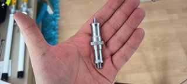
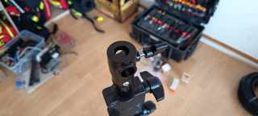
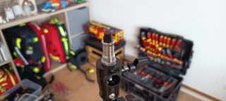

# Abschlussdokumentation: Antennenposition, Mastkopf, Querträger und 3D-Druck-Adapter

> **Ergebnis des Chats:** Der auf den Fotos gezeigte vertikale Zwei-Antennen-Aufbau ist als aktuell verfügbare, räumlich eingeschränkte Testanordnung technisch plausibel, aber nicht als ausreichend entkoppelter gleichzeitiger TX/RX-Betrieb bestätigt. Die Aussage „die untere Antenne trifft nur Aluminium“ ist kein HF-Nachweis. Für die geplante mechanische Weiterentwicklung wurde ein Hybridansatz festgehalten: vorhandener Metallspigot als tragender Kern, Aluminium-Querträger und ein 3D-gedrucktes Klemm-/Formteil. Eine leitfähige Verbindung des Querträgers zum Mast ist nicht pauschal Voraussetzung der Antennenfunktion; für Outdoor-Betrieb sind Potentialausgleich, statische Aufladung, Überspannungs- und Blitzschutz jedoch getrennt zu planen.

## 1. Metadaten und Auswertungsumfang

| Feld | Wert |
|---|---|
| Thema | Aktuelle RX/TX-Antennenposition am mobilen Mast; Mastkopf; Metallspigot; geplanter 3D-Druck-Adapter für einen Querträger; HF-Entkopplung und mechanische Lastpfade |
| Ursprünglicher Chattitel | Im verfügbaren Chat-/Werkzeugkontext nicht auslesbar |
| Chatlink | Nicht verfügbar |
| Zusammenfassung erstellt | 2026-10-05 |
| Repository | JanHG98/netcore-tetra |
| Zielbranch dieser Archivierung | Archiving |
| Geprüfter Archiving-Head vor dem Archiv-Commit | 2d4c6550a017fe1f951a391d5044aca1803aa127 |
| Zusätzlich geprüfter main-Head | 9116c15d645458f99e236712b67a1ad970432791 |
| Zielpfad | Docs/archive/2026-10-05_antennenposition-mastkopf-quertraeger-und-3d-druck-adapter.md |
| Zugehöriges älteres Archiv | [Sirio SPO 380-2 – RX/TX-Antennen an einem gemeinsamen Mast](2026-10-03_sirio-spo-380-2-rx-tx-antennenmast-und-entkopplung.md) |

Der sichtbare Verlauf dieses Chats wurde vollständig für die hier behandelten Themen ausgewertet. Dazu gehören die vier im Chat gezeigten Fotos, die Diskussion der aktuellen Antennenposition sowie die anschließende Diskussion des Mastkopfs und eines möglichen 3D-Druck-Querträgeradapters. Nicht sichtbar und daher nicht rekonstruierbar sind ein ursprünglicher Chattitel, ein dauerhafter Chatlink sowie gegebenenfalls außerhalb des zugänglichen Verlaufs liegende ältere Nachrichten.

**Wichtige Abgrenzung:** Diese Datei trennt den Gesprächsstand von einem zusätzlich am 2026-10-05 überprüften Repository-Stand. Aussagen aus dem Chat werden nicht als Implementierungsnachweis für Software oder Hardware behandelt.

### Statusbegriffe

| Status | Bedeutung in dieser Datei |
|---|---|
| **Idee** | Diskutiert, aber weder beschlossen noch umgesetzt |
| **beschlossen/geplant** | Als nächste Richtung gewählt, aber noch nicht umgesetzt oder abgenommen |
| **implementiert** | Physisch oder im Repository vorhanden; das sagt noch nichts über Funktionsprüfung aus |
| **getestet** | Eine konkrete Prüfung wurde tatsächlich durchgeführt und ein Ergebnis liegt vor |
| **im Betrieb bestätigt** | Reproduzierbarer beziehungsweise laufender Betrieb ist belegt |

## 2. Ziel und Ausgangslage

Ziel des Chats war zunächst die pragmatische Bewertung einer bereits aufgebauten Antennenposition. Auf einem mobilen Stativ-/Teleskopmast sind zwei vertikal polarisierte Antennen übereinander angeordnet. Der verfügbare Raum ist eingeschränkt; eine bessere räumliche Trennung ist aktuell nicht ohne zusätzliche Mechanik möglich.

Im zweiten Teil wurde der Mastkopf betrachtet. Vorhanden sind eine offene Mastkopfaufnahme mit seitlicher Klemmung und ein Metalladapter/Spigot, der laut Nutzer beidseitig in die Aufnahme passt. Daraus entstand die Idee, einen 3D-gedruckten Adapter zu konstruieren, der einen Querträger aufnehmen kann.

Die beiden Fragestellungen hängen zusammen:

1. **HF:** Reicht die aktuelle vertikale Trennung für getrennten TX/RX-Betrieb?
2. **Mechanik:** Wie lässt sich später eine belastbare Quertraverse befestigen?
3. **Elektrik/HF-Referenz:** Muss die Traverse beziehungsweise deren Halter elektrisch leitend mit dem Mast verbunden sein?

## 3. Bilddokumentation des aktuellen Aufbaus

Die Bilder wurden mit diesem Archiv-Commit unter Docs/archive/assets/2026-10-05_antennenposition-mastkopf-quertraeger/ abgelegt. Wegen der verfügbaren GitHub-Schreibschnittstelle wurden sie als verkleinerte, komprimierte JPEG-Archivkopien gespeichert. Sie sind zur technischen Dokumentation des Aufbaus geeignet, aber **nicht byteidentisch mit den hochauflösenden Chat-Uploads**.

### 3.1 Aktuelle Antennenposition

**Beobachtbar:** mobiler Dreibeinmast im Innenraum; zwei vertikal ausgerichtete Antennen am selben Mast; die obere Fiberglasstrecke steht weitgehend frei; die untere Antenne sitzt tiefer in unmittelbarer Nähe des Mast-/Haltebereichs. Exakte Antennenmitten, Halterhöhen und Abstände sind aus dem Bild nicht belastbar zu bestimmen.

### 3.2 Vorhandener Metalladapter / Spigot

**Beobachtbar:** metallischer, beidseitig nutzbarer Adapter mit Gewindeenden und gerändeltem Bereich. Gewindedurchmesser, Gewindesteigung, Materialgüte und zulässige Biege-/Zuglast wurden nicht vermessen.

### 3.3 Mastkopfaufnahme

**Beobachtbar:** zylindrische Mastkopfaufnahme mit axialer Bohrung/Steckaufnahme und seitlicher Klemmung. Eine Normgröße oder ein konkreter Lichtstativstandard wird aus dem Foto ausdrücklich nicht abgeleitet.

### 3.4 Metalladapter in der Mastkopfaufnahme

**Beobachtbar:** der Adapter sitzt mechanisch in der Mastkopfaufnahme. Damit ist die grundsätzliche Passung visuell belegt; nicht belegt sind Spielfreiheit unter Last, Verdrehsicherheit, Klemmlast, Biegemoment oder Dauerfestigkeit.

## 4. Endgültige Anforderungen und Entscheidungen

### 4.1 Aktuelle Antennenposition

**Beschlossen/geplant beziehungsweise temporär umgesetzt:** Die aktuelle vertikale Anordnung darf als momentan verfügbare Testkonfiguration bestehen bleiben. Sie wurde nicht als endgültig „HF-sicher“ freigegeben.

Die vertikale Anordnung zweier vertikal polarisierter Antennen kann gegenüber einer rein seitlichen Anordnung auf gleicher Höhe günstig sein, weil das Fernfeld vertikaler Rundstrahler entlang der Antennenachse typischerweise schwächer ist als in der horizontalen Hauptabstrahlrichtung. Daraus folgt jedoch **keine garantierte Isolation** im realen Aufbau. Nahfeld, Mast, Halter, Kabel, Reflexionen und die tatsächliche Antennenkonstruktion bleiben relevant.

Die im Gespräch anfänglich naheliegende Begründung, die untere Antenne „sehe“ nur den Aluminiumteil der oberen Montage, wurde ausdrücklich relativiert. HF-Kopplung folgt nicht einer optischen Sichtlinie.

### 4.2 Messung vor Freigabe

**Beschlossen/geplant:** Die aktuelle Geometrie soll passiv vermessen werden, bevor sie als belastbarer gleichzeitiger TX/RX-Aufbau bewertet wird.

Vorgesehene Messungen:

- S21 zwischen den beiden installierten Antennenpfaden;
- S11 beziehungsweise Anpassung jeder Antenne in genau der montierten Position;
- Sweep grob über 400 bis 425 MHz, damit die relevanten RX-/TX-Bereiche und das Verhalten dazwischen sichtbar werden;
- anschließend ein kontrollierter aktiver Desensibilisierungs-/Blocking-Test mit repräsentativer TX-Leistung und reproduzierbarem Nutzsignal am RX.

Im Chat wurde **kein** fixer dB-Grenzwert als Abnahmekriterium festgelegt. Ein sinnvoller Mindestwert hängt von TX-Leistung, Senderrauschen, Empfänger-Blocking, Kabel-/Filterverlusten und gewünschter Empfangsreserve ab.

### 4.3 Querträgeradapter

**Beschlossen/geplant als bevorzugte Konstruktionsrichtung:** Der vorhandene Metallspigot soll als tragender Kern genutzt werden. Um ihn herum kann ein gedrucktes Form-/Klemmteil entstehen, das einen Aluminium-Querträger positioniert und gegen Verdrehen sichert.

Bevorzugter Lastpfad:

~~~text
Antenne(n)
   │
Aluminium-Querträger
   │
3D-gedrucktes Klemm-/Formteil
   │
durchgehender Metallbolzen / Metallhülse oder direkte metallische Lastübertragung
   │
vorhandener Metallspigot
   │
Mastkopf
   │
Teleskopmast / Stativ
~~~

Das gedruckte Bauteil soll **nicht der einzige Bauteilquerschnitt sein, der das gesamte Biegemoment des Querträgers aufnehmen muss**.

### 4.4 Elektrische Verbindung zum Mast

Die frühere Annahme „der Adapter muss wegen der Antenne metallisch mit dem Mast verbunden sein“ wurde **nicht** als allgemeine Anforderung übernommen.

**Endstand:**

- Ob eine leitende Mastverbindung für die HF-Funktion nötig ist, hängt von der konkreten Antennenkonstruktion ab.
- Eine ground-independent Dipol-/Collinear-Konstruktion kann ohne Mast als Gegengewicht arbeiten.
- Eine explizit groundplane-abhängige Antenne kann andere Anforderungen stellen.
- Ein Durchgangstest zwischen Koax-Außenleiter und Metallhalter zeigt nur, ob diese Teile elektrisch verbunden sind. Er beweist nicht, dass der Mast als notwendige HF-Groundplane vorgesehen ist.
- Herstellerunterlagen beziehungsweise die konkrete Antennenkonstruktion sind maßgeblich.
- Für dauerhaften Outdoor-Betrieb bleibt ein **separates** Konzept für Potentialausgleich, statische Aufladung, Überspannungsableitung und Blitzschutz sinnvoll. Das ist nicht mit einer HF-Groundplane gleichzusetzen.

## 5. Technische Einordnung der aktuellen Frequenzlage

Der aktuelle main-Stand des Repositories wurde zusätzlich geprüft. Er ist kein Nachweis dafür, dass der fotografierte Aufbau mit exakt diesen Werten betrieben wurde, dokumentiert aber die derzeitige Projektkonfiguration.

Geprüft am main-Commit **9116c15d645458f99e236712b67a1ad970432791**:

| Parameter | Aktueller Repository-Wert |
|---|---:|
| tx_freq | 418000000 Hz |
| rx_freq | 408000000 Hz |
| tx_center_freq | 418012500 Hz |
| rx_center_freq | 408012500 Hz |
| main_carrier | 720 |
| secondary_carrier | 721 |
| duplex_spacing | 0 |

Quellen:

- [config.toml, main-Stand 9116c15d645458f99e236712b67a1ad970432791](https://github.com/JanHG98/netcore-tetra/blob/main/config.toml)
- [crates/tetra-core/src/freqs.rs, main-Stand 9116c15d645458f99e236712b67a1ad970432791](https://github.com/JanHG98/netcore-tetra/blob/main/crates/tetra-core/src/freqs.rs)
- [wiki/Hardware-und-RF.md, main-Stand 9116c15d645458f99e236712b67a1ad970432791](https://github.com/JanHG98/netcore-tetra/blob/main/wiki/Hardware-und-RF.md)

Bei 408 bis 418 MHz liegt die freie Wellenlänge grob zwischen 0,735 m und 0,717 m. Das ist nur eine Größenordnungshilfe; aus einem Abstand von ungefähr einer Wellenlänge folgt **keine** garantierte TX/RX-Isolation.

### 5.1 Repository-Abweichung: Duplex-Kommentar

Im aktuellen config.toml ist weiterhin der historische Kommentar vorhanden, duplex_spacing = 0 bedeute 5 MHz im 400-MHz-Band.

Im aktuell geprüften freqs.rs ist dagegen weiterhin ein 10-MHz-Duplexabstand im zugehörigen Test-/Berechnungsstand hinterlegt.

**Folgerung:** Diese Dokumentationsabweichung ist ein separater Roadmap-Kandidat. Sie wurde in diesem Archivierungsauftrag nicht außerhalb von Docs/archive/ geändert.

### 5.2 Repository-Abweichung: generisches Duplexer-Beispiel

Die aktuelle Hardware-und-RF-Wiki nennt weiterhin das frühere Laborbeispiel 418,000/418,025 MHz Downlink und 408,000/408,025 MHz Uplink.

Die Wiki beschreibt als generischen RF-Pfad auch Duplexer-/Filterthemen. Das darf **nicht** als Aussage verstanden werden, dass der hier diskutierte reale Aufbau einen Duplexer verwendet. Das ältere zugehörige Archiv dokumentiert ausdrücklich die Nutzerentscheidung für zwei getrennte Antennen ohne Duplexer.

## 6. Komponenten, Schnittstellen und Abhängigkeiten

| Komponente | Rolle | Status |
|---|---|---|
| Mobiles Dreibeinstativ / Teleskopmast | Mechanische Grundstruktur | **implementiert**, visuell belegt |
| Zwei vertikale Antennen | Getrennte TX-/RX-Pfade beziehungsweise vorgesehene getrennte Antennen | **implementiert als Montage**, HF-Funktion in dieser Geometrie nicht getestet |
| Oberer Metall-/Mastbereich | Mechanische Antennenbefestigung und HF-Umgebung | **implementiert**, genaue Geometrie nicht vermessen |
| Mastkopfaufnahme | Aufnahme für Spigot/Adapter | **implementiert**, visuell belegt |
| Metallspigot | Tragender Übergang vom Mast zum geplanten Adapter | **implementiert als vorhandenes Teil**, Passung visuell demonstriert |
| 3D-Druck-Klemmteil | Formschluss, Zentrierung, Klemmung/Anti-Rotation | **beschlossen/geplant**, noch nicht konstruiert |
| Aluminium-Querträger | Räumliche Trennung der Antennen | **beschlossen/geplant**, noch nicht vorhanden |
| Metallbolzen/-hülse | Lastdurchleitung durch den gedruckten Adapter | **Idee / bevorzugtes Detail**, noch nicht dimensioniert |
| Bonding-Leitung/Zahnscheibe | Optional definierter Potentialausgleich | **Idee**, nicht als RF-Pflicht festgelegt |
| Koaxleitungen 50 Ohm | Getrennte RF-Pfade | im Projekt erforderlich; konkrete Kabelführung dieses Fotos nicht vollständig belegt |
| VNA / Messaufbau | S11/S21-Abnahme | **beschlossen/geplant**, im Chat nicht durchgeführt |
| Kontrollierte RX-Nutzsignalquelle | aktiver Desense-Test | **beschlossen/geplant**, noch nicht durchgeführt |

## 7. Mechanische Konstruktionshinweise für den geplanten 3D-Druck-Adapter

Diese Punkte sind **Entwurfsregeln aus der Diskussion, keine statische Berechnung**:

- Metallspigot als Lastkern beibehalten.
- Aluminium-Querträger verwenden statt eines komplett gedruckten Auslegers.
- Durchgangsschraube, Metallhülse oder vergleichbare metallische Lastübertragung vorsehen.
- Gedrucktes Teil primär für Formschluss, Zentrierung, Klemmung und Anti-Rotation nutzen.
- Große Radien statt scharfer Kerben an hoch belasteten Übergängen.
- Gewinde nicht dauerhaft nur in gedrucktem Kunststoff tragen lassen; Durchgangsschrauben, Muttern oder geeignete Metalleinsätze bevorzugen.
- Querträger gegen Herausziehen und Verdrehen sichern.
- Druckorientierung so wählen, dass das dominante Biegemoment nicht nur Layer gegeneinander aufspaltet.
- Viele Perimeter sind für die mechanische Schale wichtiger als blind sehr hoher Infill-Anteil.
- Im Chat wurden etwa 6 bis 8 mm tragende Wandstärke am zentralen Adapter als **Vorentwurfsgröße** genannt. Das ist kein berechneter Mindestwert und muss nach realer Geometrie neu bewertet werden.

### Materialwahl

| Material | Bewertung für diesen Zweck |
|---|---|
| PLA | Nicht als dauerhafte Außen-/Fahrzeug-/Klemm-Lösung empfohlen; Wärme und Kriechen sind ungünstig |
| PETG | Gut für Passform-Prototyp und gelegentliche Nutzung |
| ASA | Bevorzugte Richtung für UV-/Outdoor-Nutzung, sofern drucktechnisch beherrscht |
| PA-CF / Nylon-CF | Technisch attraktiv für belastbare Teile, aber nur mit geeigneter Drucktechnik, Trocknung und Konstruktion |

Auch bei robustem Filament bleibt die Konstruktion ein Mast-/Windlastbauteil. Ein Materialwechsel ersetzt keine Lastprüfung.

## 8. Erreichter Entwicklungs- und Betriebsstand

| Thema | Status | Nachweis / Grenze |
|---|---|---|
| Zwei Antennen am selben Mast | **implementiert** | Foto vorhanden |
| Vertikale aktuelle Position | **implementiert / temporär akzeptiert** | Foto vorhanden; keine HF-Abnahme |
| Gleichzeitiger störungsfreier TX/RX-Betrieb | **nicht getestet / nicht im Betrieb bestätigt** | Keine S21-, Blocking- oder Desense-Daten |
| Metallspigot vorhanden | **implementiert** | Foto vorhanden |
| Spigot passt in Mastkopf | **implementiert, visuell demonstriert** | Foto vorhanden; keine Lastprüfung |
| 3D-Druck-Querträgeradapter | **beschlossen/geplant** | Konzept vorhanden, keine CAD-Datei |
| Aluminium-Querträger | **beschlossen/geplant** | Noch keine Maße/kein Bauteil dokumentiert |
| Elektrische Mastverbindung als HF-Pflicht | **verworfen als pauschale Forderung** | Antennenabhängig |
| Outdoor-Bonding/Potentialausgleich | **Idee / Planungsbedarf** | Noch keine Ausführung |
| S11/S21-Messung | **beschlossen/geplant** | Nicht durchgeführt |
| Aktiver Desensibilisierungstest | **beschlossen/geplant** | Nicht durchgeführt |
| Softwareänderung durch diesen Chat | **keine** | Nur Archivierung |
| Produktiver Mastbetrieb dieses Aufbaus | **nicht bestätigt** | Kein Betriebsprotokoll |

## 9. Relevante Konfigurationen, Pfade und technische Parameter

### Repository-Pfade

- <code>config.toml</code>: RF-Grundwerte und Dual-Carrier-Center.
- <code>crates/tetra-core/src/freqs.rs</code>: Frequenz-/Duplexberechnung.
- <code>wiki/Hardware-und-RF.md</code>: allgemeine RF-Abnahmehinweise.
- <code>Docs/archive/2026-10-03_sirio-spo-380-2-rx-tx-antennenmast-und-entkopplung.md</code>: Vorgängerarchiv zur Zwei-Antennen-/Kein-Duplexer-Entscheidung.
- Diese Datei: <code>Docs/archive/2026-10-05_antennenposition-mastkopf-quertraeger-und-3d-druck-adapter.md</code>.
- Bildarchiv: <code>Docs/archive/assets/2026-10-05_antennenposition-mastkopf-quertraeger/</code>.

### Protokolle und Ports

Für diesen Chat wurden keine neuen Netzwerkdienste, Ports, API-Protokolle oder Deploymentpfade definiert. Das Thema ist ausschließlich mechanisch/RF-seitig.

## 10. Befehle, Installations- und Reparaturabläufe

Es wurden **keine Shell-Befehle, Installationen oder Reparaturskripte** im Chat ausgeführt.

Vorgeschlagener Messablauf, noch nicht ausgeführt:

~~~text
1. Funktechnik von den beiden Antennenkabeln trennen.
2. VNA Port 1 -> vorgesehener TX-Antennenpfad.
3. VNA Port 2 -> vorgesehener RX-Antennenpfad.
4. Kalibrierte Bezugsebene dokumentieren.
5. Sweep ungefähr 400 ... 425 MHz.
6. S21 LogMag speichern.
7. Danach Anpassung der beiden Antennen in Einbaulage erfassen.
8. Geometrie, Kabel, Adapter und Messgrenze protokollieren.
9. Erst danach kontrollierter aktiver Test mit repräsentativer TX-Leistung.
~~~

**Status:** ausschließlich vorgeschlagen; im Chat nicht erfolgreich ausgeführt oder bestätigt.

## 11. Fehlerbilder, Diagnose und funktionierende Korrekturen

Es trat kein Softwarefehler auf. Die wichtigsten „Fehler“ waren Annahmen in der technischen Bewertung:

### 11.1 Optische Sichtlinie als HF-Kriterium

**Frühere Annahme:** Wenn die untere Antenne optisch nur den Aluminiumteil der oberen Montage „trifft“, sollte es gehen.

**Korrektur:** HF-Kopplung hängt von Feldern, Stromverteilung, Polarisation, Abstand, Haltern, Mast, Kabeln und Umgebung ab. Die optische Überdeckung ist kein belastbarer Isolationsnachweis.

**Endstand:** Aufbau testen, nicht aus der Ansicht allein freigeben.

### 11.2 Metallische Mastverbindung als zwingende Antennenanforderung

**Frühere Frage/Annahme:** Der geplante Adapter müsse metallisch mit dem Mast verbunden sein.

**Korrektur:** Das ist nur dann HF-seitig zwingend, wenn die konkrete Antenne diese leitfähige Referenz/Groundplane konstruktiv benötigt.

**Endstand:** Hersteller-/Antennenaufbau prüfen. Outdoor-Bonding separat aus Schutz- und Potentialausgleichssicht bewerten.

### 11.3 Komplett gedruckter tragender Mastkopf

**Nicht bevorzugter Ansatz:** gesamtes Querträgermoment ausschließlich über ein Kunststoffteil führen.

**Korrektur:** Metallspigot und Aluminiumquerträger als Primärstruktur nutzen; Druckteil als formgebende Klemm-/Adapterkomponente.

## 12. Durchgeführte Tests und Ergebnisse

### Tatsächlich durchgeführt

1. **Visuelle Prüfung des aktuellen Mastaufbaus** anhand des ersten Fotos.
2. **Visuelle Prüfung des Metallspigots** anhand des zweiten Fotos.
3. **Visuelle Prüfung der Mastkopfaufnahme** anhand des dritten Fotos.
4. **Visuelle Prüfung der Passung Spigot in Mastkopf** anhand des vierten Fotos.
5. **Repository-Abgleich** von Archiving und main sowie der drei relevanten Dateien <code>config.toml</code>, <code>freqs.rs</code> und <code>Hardware-und-RF.md</code>.

### Nicht durchgeführt

- keine S11-/SWR-Messung;
- keine S21-Isolationsmessung;
- keine Spektrumanalyse;
- kein TX-an/RX-Empfindlichkeitsvergleich;
- keine Empfänger-Blockingmessung;
- keine Messung der realen Antennenmitten oder Mastabstände;
- keine CAD-Konstruktion;
- kein 3D-Druck;
- kein statischer Biege-/Torsionstest;
- kein Windlasttest;
- kein Temperatur-/Kriechtest;
- kein Outdoor-Betriebstest;
- keine Prüfung eines Herstellerdatenblatts auf Groundplane-Anforderung in diesem Chat.

## 13. Verworfene oder ersetzte Ansätze

| Ansatz | Status | Grund |
|---|---|---|
| „Die Position passt, weil die untere nur Aluminium sieht“ | **ersetzt** | Kein HF-Isolationsnachweis |
| Vertikale Position als endgültige Entkopplung behandeln | **ersetzt** | Nur temporärer Testkandidat; S21/Desense fehlen |
| Mast müsse zwingend elektrisch Teil der Antenne sein | **verworfen als allgemeine Regel** | Antennenkonstruktion entscheidet |
| Vollständig gedruckter tragender Querträgerkopf | **nicht bevorzugt** | Biege-/Kriech-/Layer-Risiko; Metallkern ist robuster |
| Beliebiger dB-Grenzwert für S21 | **nicht festgelegt** | Muss aus realem TX/RX-Budget abgeleitet werden |

Der ältere Projektentscheid **„zwei getrennte Antennen, kein Duplexer“** bleibt unberührt. Die aktuelle vertikale Montage ist eine räumlich bedingte Zwischenlösung; ein Querträger ist weiterhin eine mögliche spätere Verbesserung.

## 14. Offene Aufgaben und Roadmap-Kandidaten

| ID | Priorität | Aufgabe | Abhängigkeit / Ergebnis |
|---|---|---|---|
| RF-ANT-09 | P0 | Mastkopf, Spigot, Gewinde, nutzbare Einstecktiefe und Klemmweg exakt vermessen | Voraussetzung für CAD |
| RF-ANT-10 | P0 | Abstand der realen Antennen-Bezugspunkte/Antennenmitten und verfügbare Bauhöhe/-breite erfassen | Vergleichbare RF-Geometrie |
| RF-ANT-11 | P0/P1 | S11/S22 und S21 der **aktuellen vertikalen Position** mit dokumentierten Kabeln/Bezugsebenen messen | Baseline, bevor Mechanik verändert wird |
| RF-ANT-12 | P1 | Parametrischen Querträgeradapter konstruieren: Metallspigot als Kern, formschlüssige Klemmung, Anti-Rotation, durchgehende Metalllastpfade | CAD/STL/3MF nach finalen Maßen |
| RF-ANT-13 | P1 | PETG-Prototyp für Passform; danach ASA oder PA-CF nur nach mechanischer Bewertung | Fit-/Klemmtest |
| RF-ANT-14 | P1 | Antennenhersteller/-modell und Groundplane-/Montageanforderung verifizieren; optional Durchgang Schirm ↔ Halter messen | Klärt elektrische Mastrolle |
| RF-ANT-15 | P1 | Kontrollierten aktiven Desensibilisierungs-/Blocking-Test mit repräsentativer TX-Leistung durchführen | Erst nach passiver Messung |
| RF-ANT-16 | P1 | Tripod/Mast gegen Kippen und Torsion sichern; Hebelarm des Querträgers statisch bewerten | Vor Außenbetrieb |
| RF-ANT-17 | P1/P2 | Outdoor-Bonding, Schirmanschluss, Überspannung und Blitzschutzkonzept planen | Kein Ersatz für Antennen-HF-Design |
| RF-ANT-18 | P2 | Nur bei unzureichender Reserve einzelne RX-/TX-Filter erneut bewerten | Kein Duplexer; Messbedarf zuerst |
| RF-ANT-19 | P2 | Später die Hardware-Wiki um die reale Zwei-Antennen-Variante samt Messwerten ergänzen | Änderung außerhalb dieses Archivauftrags |
| RF-ANT-20 | P2 | Historischen 5-MHz-Kommentar in config.toml gegen die reale Duplexberechnung bereinigen | Separate Code-/Dokuänderung |

### Bereits vereinbarte Reihenfolge

1. **Messen, was real vorhanden ist.**
2. **Aktuelle vertikale Geometrie als Baseline passiv vermessen.**
3. **Querträgermechanik auf Basis echter Maße konstruieren.**
4. **Prototyp mechanisch prüfen.**
5. **Neue Geometrie wieder S11/S21 messen.**
6. **Erst danach aktiven TX/RX-Test durchführen.**
7. **Outdoor-Schutz und dauerhafte Mechanik abschließen.**

## 15. Bezug zum älteren Antennenmast-Archiv

Die am 2026-10-03 archivierte Diskussion hatte bereits festgehalten:

- zwei getrennte Antennen am gemeinsamen Mast;
- kein Duplexer als Nutzerentscheidung;
- räumliche Entkopplung als bevorzugter Versuch;
- S21/SWR und aktiver Desense-Test noch offen;
- keine damals verfügbare Fotodokumentation des realen Mastaufbaus.

Dieser Chat ergänzt das ältere Archiv deshalb wesentlich um:

1. **den fotografisch belegten realen Zwischenaufbau**;
2. **die reale Mastkopf-/Spigot-Geometrie als Ausgangspunkt für eine Traverse**;
3. **die Entscheidung für einen hybriden Metall-/3D-Druck-Adapter statt einer rein gedruckten Laststruktur**;
4. **die Klarstellung, dass die elektrische Mastverbindung nicht pauschal Voraussetzung der Antennenfunktion ist**.

Das ältere Archiv wird nicht überschrieben; beide Dokumente sind komplementär.

## 16. Quellen, Anhänge, Repository-Dateien und Commitstände

### Chat-Anhänge

| Datei im Archiv | Inhalt | Archivstatus |
|---|---|---|
| [01_antennenposition_mast.jpg](assets/2026-10-05_antennenposition-mastkopf-quertraeger/01_antennenposition_mast.jpg) | Gesamtansicht Mast und zwei Antennen | komprimierte Archivkopie |
| [02_metalladapter_spigot.jpg](assets/2026-10-05_antennenposition-mastkopf-quertraeger/02_metalladapter_spigot.jpg) | vorhandener Metallspigot | komprimierte Archivkopie |
| [03_mastkopf_aufnahme.jpg](assets/2026-10-05_antennenposition-mastkopf-quertraeger/03_mastkopf_aufnahme.jpg) | Mastkopfaufnahme | komprimierte Archivkopie |
| [04_metalladapter_im_mastkopf.jpg](assets/2026-10-05_antennenposition-mastkopf-quertraeger/04_metalladapter_im_mastkopf.jpg) | Spigot in Mastkopf | komprimierte Archivkopie |

### Repository

- Archiving-Schreibbasis vor diesem Commit: **2d4c6550a017fe1f951a391d5044aca1803aa127**
- main-Prüfstand: **9116c15d645458f99e236712b67a1ad970432791**
- <code>config.toml</code>, Blob 3f54ad275b956699dd7b38de1b7d2c0711133c00
- <code>crates/tetra-core/src/freqs.rs</code>, Blob aa8469b09ef10f28929d2771f1796277c4ca4006
- <code>wiki/Hardware-und-RF.md</code>, Blob 42d456630bdbdbd80f4843d87de5caf7cd8ab9f6
- Vorgängerarchiv: [2026-10-03_sirio-spo-380-2-rx-tx-antennenmast-und-entkopplung.md](2026-10-03_sirio-spo-380-2-rx-tx-antennenmast-und-entkopplung.md)

Der endgültige Commit-SHA, der **diese Datei selbst** enthält, kann naturgemäß nicht vor seiner Erzeugung in seinen eigenen Inhalt geschrieben werden. Maßgeblich ist der Git-Commit, auf den der Branch Archiving nach diesem Schreibvorgang zeigt; er wird in der Abschlussmeldung des Archivierungslaufs genannt.

## 17. Auswertungslücken und ausdrücklich nicht behauptete Punkte

- Ursprünglicher Chattitel und Chatlink sind nicht verfügbar.
- Exakte Abmessungen des Masts, des Spigots und der Mastkopfaufnahme fehlen.
- Das konkrete Antennenmodell wird in diesem sichtbaren Chat nicht erneut am Typenschild verifiziert. Das ältere zugehörige Archiv nennt Sirio SPO 380-2; diese Identifikation wird hier nicht allein aus den Fotos neu abgeleitet.
- Kein Foto beweist, welcher Anschluss tatsächlich TX oder RX ist.
- Keine S-Parameter- oder Spektrummessung liegt vor.
- Keine reale TX-Leistung oder Empfänger-Blocking-Spezifikation wurde im Chat genannt.
- Keine CAD-/STL-/3MF-Datei wurde erstellt.
- Die vier GitHub-Bilder sind verkleinerte/komprimierte Archivkopien und nicht die byteidentischen Originaluploads.
- Keine Aussage in dieser Datei behauptet eine Funkzulassung, Blitzschutzfreigabe oder statische Freigabe des gezeigten Stativs.

## 18. Fortsetzungspunkt für einen neuen Chat

Für eine direkte Fortsetzung reichen idealerweise fünf Datensätze:

1. Durchmesser und Tiefe der Mastkopfaufnahme;
2. Spigot-Durchmesser, Gewindeart/-maß und freie Länge;
3. gewünschtes Querträgerprofil und gewünschte nutzbare Länge;
4. exakte Antennenhalter-/Antennenmittelabstände im aktuellen Aufbau;
5. erste S11-/S21-Messkurven der aktuellen vertikalen Position.

Mit diesen Daten kann der Querträgeradapter belastbar parametrisch ausgelegt und anschließend der RF-Vergleich „aktuell vertikal“ gegen „Querträger/Versatz“ durchgeführt werden.
