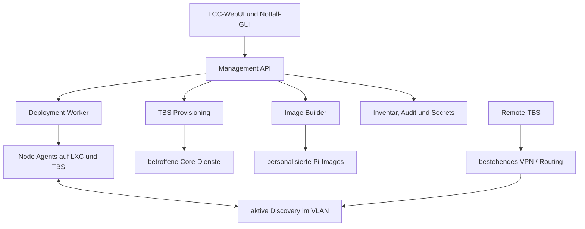

# Deployment-VM, selektive Releases, TBS-Imagebuilder und Auto-Discovery

## 1. Metadaten und Statusbegriffe

| Feld | Wert |
|---|---|
| Projekt | NetCore-TETRA, `JanHG98/netcore-tetra` |
| Ursprünglicher Chattitel | In der zugänglichen Oberfläche nicht überliefert; abgeleiteter Arbeitstitel: **Deployment-Controller, TBS-Imagebuilder und Auto-Discovery** |
| Ursprungsdialog / Chatlink | Nicht verfügbar; es wurde keine belastbare Chat-ID oder URL bereitgestellt |
| Zugänglicher Gesprächszeitraum | Inhaltlich ab 19.09.2026; Archivauftrag am 05.10.2026, Europe/Berlin |
| Erstellung dieser Abschlussdokumentation | **2026-10-05**, Europe/Berlin |
| Zielbranch | Bestehender Branch **`Archiving`** |
| Geprüfter Zielbranch vor dem Archivcommit | [`c65447b7d33186f8e0bf6b063e891357315c504c`](https://github.com/JanHG98/netcore-tetra/tree/c65447b7d33186f8e0bf6b063e891357315c504c) |
| Zusätzlich geprüfter heutiger Hauptzweig | [`main@9116c15d645458f99e236712b67a1ad970432791`](https://github.com/JanHG98/netcore-tetra/tree/9116c15d645458f99e236712b67a1ad970432791) |
| Historischer Entwicklungsstand | [`bbf039729b9b05f8d623b11195ca24a124f68d16`](https://github.com/JanHG98/netcore-tetra/tree/bbf039729b9b05f8d623b11195ca24a124f68d16), Komponente `0.2.3`, früherer Branch `feature/openlab-discovery-deployment` |
| Umfang des Archivauftrags | Nur diese Datei und der Archivindex unter `Docs/archive/`; kein Merge und keine Änderungen an Runtime-, Roadmap- oder Deployment-Dateien |

Der geprüfte Zielbranch ist die Quellenbasis vor dem Archivcommit. Der tatsächliche Commit, der dieses Dokument veröffentlicht, wird nicht vor seiner Erstellung erfunden; er steht in der Git-Historie und in der Abschlussmeldung.

Dieses Dokument verwendet folgende Statusbegriffe streng:

- **Idee:** diskutierte Option ohne abschließende Festlegung.
- **Beschlossen/geplant:** vom Nutzer ausdrücklich gewünschtes Zielbild oder verbindlich festgehaltene Architekturentscheidung; noch kein Umsetzungsnachweis.
- **Implementiert:** durch Quelltext oder Konfiguration an einem genau genannten Commit belegt.
- **Getestet:** durch einen konkret ausgeführten Test belegt; Testgrenzen werden genannt.
- **Im Betrieb bestätigt:** an realen LXCs, einer realen TBS oder Funkhardware beobachtet. Für die in diesem Chat entworfene Gesamtlösung liegt kein solcher Nachweis vor.

## 2. Kurzfassung des Ergebnisses

Der Chat legt ein zentrales Bedien- und Betriebsmodell für NetCore-TETRA fest:

1. Eine **Management-VM** verwaltet Releases, Nodes, Dienststände, TBS-Provisionierung und personalisierte Raspberry-Pi-Images über ein gemeinsames WebUI. Eine lokale GUI über die Proxmox-Konsole dient als Notzugang.
2. Updates werden **selektiv pro Komponente und Zielrolle** verteilt. Eine Änderung am SIP-Switch darf nicht alle LXCs oder TBS aktualisieren.
3. Eine neue TBS wird im LCC mit **Name, MCC, MNC, ISSI, LA und CC** angelegt. Der übrige technische Lebenszyklus soll automatisch erfolgen: Identität, dienstspezifische Zugänge, VPN, Konfiguration, Image, Enrollment, Release, Healthchecks und Aktivierung.
4. Das Ergebnis des Imagebuilders ist ein persönliches `.img.xz` mit Prüfsumme und Manifest, das mit Raspberry Pi Imager auf eine SD-Karte geschrieben werden kann. Dasselbe Verfahren soll eine defekte SD-Karte durch ein neu ausgestelltes Recovery-Image ersetzen.
5. Alle Dienste im gemeinsamen VLAN sollen sich **aktiv gegenseitig erkennen**. Discovery läuft automatisch und kann zusätzlich über einen Button **„Auto-Discovery starten“** je Dienst beziehungsweise global im LCC ausgelöst werden.
6. Ein universeller TBS-Schlüssel, der an alle LXCs verteilt wird, wurde verworfen. Die Zielarchitektur trennt Geräteidentität, Konfigurationssignatur und dienstspezifische Credentials.
7. Die Management-VM ist eine **Control Plane**, kein Bestandteil des zeitkritischen Funk-, Ruf-, SDS- oder Medienpfads. Ein Ausfall der VM darf bestehende TBS und Core-Dienste nicht stilllegen.

Der spätere Repository-Stand verändert die Einordnung wesentlich: Ein großer Teil dieses Zielbilds wurde im historischen Commit `bbf0397...` als Open-Lab-Entwicklung implementiert und statisch getestet. Dieser Code fehlt am 05.10.2026 jedoch sowohl in `main` als auch in `Archiving`. Die heutige zentrale Roadmap führt seine kontrollierte Wiederaufnahme deshalb als **Z01 / P0**. Vollständige, sichere Zero-Touch-Provisionierung mit PKI, automatisch erzeugten SIP-/VPN-Zugängen und transaktionaler Verteilung an alle Fachkerne ist auch im historischen Stand nicht belegt.

## 3. Quellenumfang und Auswertungslücken

### 3.1 Ausgewertete Quellen

Ausgewertet wurden:

- der vollständig in dieser Unterhaltung sichtbare Dialog über Release-Deployment, Versionsinventar, TBS-Provisionierung, Management-VM, Imagebuilder und VLAN-Discovery;
- der aktuelle Zielbranch `Archiving` bei `c65447b...`;
- der am Archivtag aktuelle Hauptzweig `main` bei `9116c15...`;
- der per vollständigem SHA weiterhin abrufbare historische Entwicklungsstand `bbf0397...`;
- die zentrale Roadmap, Open-Lab-Deploymentdateien, der heutige Provisioning Core und die historische Deployment-Core-Implementierung;
- neu ausgeführte statische Tests und lokale, nicht mutierende Deployment-Prüfungen, siehe Abschnitt 14.

### 3.2 Nicht verfügbare oder nicht belegte Inhalte

- Ursprünglicher Chattitel, Chat-ID und Chatlink waren nicht verfügbar und wurden nicht erfunden.
- Es gab keinen Zugriff auf die laufende Management-VM `VM-H-DEPLOY-01`, die 27 genannten LXCs, reale TBS, PBX, VPN-Gateway oder sonstige Live-Systeme.
- Laufende Versionsstände, aktuelle Konfigurationen, Credentials, Healthwerte und Installationsbelege der realen Hosts wurden nicht gelesen.
- Der frühere Branch `feature/openlab-discovery-deployment` existiert am Archivtag nicht mehr als Remote-Branch. Sein Commit `bbf0397...` ist noch direkt abrufbar; ein heutiger aktiver Branch daraus darf nicht behauptet werden.
- Die im aktuellen Turn verfügbaren 25 ETSI-PDFs wurden im fachlichen Dialog nicht verwendet. Sie liefern keinen Nachweis für Deployment, Imagebau oder IP-Service-Discovery und wurden deshalb nicht in dieses Archiv kopiert.
- Der sichtbare Chat enthält keine eigenständigen hochgeladenen Bilder. Die textuellen Mermaid-Skizzen werden als Diagramme im Markdown erhalten; es gab kein Bild-Binary, das unter `Docs/archive/` hochzuladen war.
- „LCC“ wurde im Gespräch als zentrales WebUI beziehungsweise Management verstanden. Die ausgeschriebene Produktbezeichnung und endgültige Systemgrenze wurden nicht formal festgelegt.

## 4. Ziel und Ausgangslage

Ausgangspunkt war der wachsende manuelle Pflegeaufwand einer verteilten NetCore-TETRA-Installation. Viele Dienste laufen auf eigenen LXCs; hinzu kommen eine oder mehrere Raspberry-Pi-TBS. Abhängige URLs und IP-Adressen mussten in zahlreichen `.toml`-Dateien von Hand eingetragen werden. Updates wurden als wiederholtes manuelles Holen des Quellstands und Neustarten einzelner Dienste gedacht. Daraus entstehen typische Risiken:

- verschiedene Nodes laufen unbemerkt auf verschiedenen Commits;
- ein Update wird auf falsche oder unnötige Hosts verteilt;
- installierter Quellstand und tatsächlich laufende Binary können voneinander abweichen;
- eine neue TBS muss an vielen Stellen separat bekannt gemacht werden;
- bei einer defekten SD-Karte ist der genaue Installations- und Credential-Stand schwer reproduzierbar;
- manuelle IP- und Endpoint-Pflege skaliert bei mehreren LXCs und TBS schlecht.

Der Nutzer wollte deshalb eine zentrale Befehlskette, bevorzugt auf Basis veröffentlichter GitHub-Releases, und später eine vollständig automatisierte TBS-Aufnahme sowie aktive Dienstsuche im gemeinsamen VLAN.

## 5. Entwicklung der Architekturentscheidung

### 5.1 Von manuellen Updates zum zentralen Rollout

Die erste Zielrichtung war ein zentraler Controller, der auf ein GitHub-Ereignis reagiert, Tests beziehungsweise einen freigegebenen Stand kennt und Updates abhängigkeitsbewusst ausrollt. Direkte `git pull`-Aufrufe auf allen Produktiv-LXCs wurden als ungeeignet bewertet.

Der Nutzer entschied sich anschließend ausdrücklich für **GitHub-Releases**, zunächst mit den automatisch bereitgestellten `Source code.zip`-Archiven. Daraus entstand das Ziel:

- neuer Release erscheint;
- zentraler Dienst lädt den Stand einmal;
- Unterschiede zum vorherigen Release werden Komponenten zugeordnet;
- nur Nodes mit betroffenen Rollen erhalten ein Update;
- Healthcheck und Rückweg entscheiden über den Abschluss.

Die automatische GitHub-`Source code.zip` wurde als MVP akzeptiert, aber nicht als ideales Produktionsartefakt. Sie enthält weder kontrolliert gebaute Binaries noch ein projektspezifisches Deploymentmanifest. Später vorgeschlagene eigene Artefakte waren:

```text
netcore-tetra-v1.9.0-mqtt.1.tar.zst
SHA256SUMS
deployment-manifest.yaml
```

Alternativ wurden getrennte Artefakte je Dienst vorgeschlagen. Dies blieb eine Verbesserungsidee, nicht die abschließend implementierte Form.

### 5.2 Vom Commit pro Host zum Komponentenstand

Die Frage, wie der Controller den Stand jedes LXC und jeder TBS kennt, führte zur Trennung von:

| Feld | Bedeutung |
|---|---|
| `desired_version` | vom Controller gewünschter Zielstand |
| `installed_version` / `reported_version` | vom Agent nach Installation gemeldeter Stand |
| `running_version` | vom laufenden Prozess tatsächlich ausgegebene Version oder Build-ID |

Ein einzelner Commit pro Host wurde verworfen, weil mehrere Dienste auf einem Node unterschiedliche Stände haben können und ein kopiertes, aber nicht gestartetes Update sonst fälschlich als aktiv gelten würde. Der lokale Agent sollte mindestens Release, Commit, Artefakt-Hash, Zeitpunkt, systemd-Zustand und Health je Komponente melden.

### 5.3 Vom Deployment-Controller zur TBS-Provisionierung

Der Nutzer erweiterte den Umfang: Der zentrale Dienst soll neue TBS im gesamten System anmelden. Ursprünglich war vorgesehen, einen TBS-Schlüssel oder Benutzer/Passwort ähnlich dem SIP-Switch zu erzeugen und an alle System-LXCs zu verteilen.

Diese Generalschlüssel-Idee wurde korrigiert. Endgültig geplant sind:

- eine eindeutige Geräteidentität der TBS;
- ein kurzlebiger oder einmaliger Bootstrap;
- dienstspezifische Zugangsdaten nur für tatsächlich betroffene Systeme;
- automatische Einträge beziehungsweise Policies in Node Gateway, Mobility Core, Call Control, SIP Switch, Media Switch, Group Core, SDS Router, optional Packet Core, Recorder und Observability;
- signierte TBS-Konfiguration;
- Auditspur und definierte Fehlerzustände.

### 5.4 Von einem Enrollment-Befehl zum personalisierten Image

Ein manuelles `netcore-enroll` mit Token wurde als mögliche innere Technik diskutiert. Der gewünschte Bedienweg wurde danach klarer und einfacher:

```text
Neue TBS im LCC anlegen
→ Image erzeugen
→ herunterladen
→ mit Raspberry Pi Imager schreiben
→ SD-Karte einsetzen
→ einschalten
→ automatischer Rest
```

Das Image soll Netzwerk, VPN, Agent, TBS-Profil und den freigegebenen Softwarestand vorbereiten. Bei defekter SD-Karte wird für dieselbe fachliche TBS ein neues Recovery-Image erzeugt; alte sicherheitsrelevante Identitäten werden nicht stillschweigend geklont.

### 5.5 Deployment-LXC wird Management-VM

Der zunächst diskutierte Deployment-LXC wurde ausdrücklich zur **VM** weiterentwickelt. Der Imagebuilder benötigt Loop-Devices, Partitionierung, Mounts und gegebenenfalls `chroot`- beziehungsweise Namespace-Funktionen. Eine VM isoliert diese privilegierten Abläufe besser als ein privilegierter LXC und kann zusätzlich eine lokale Notfall-GUI bereitstellen.

### 5.6 Zentrale Registry reicht nicht: echte VLAN-Discovery

Eine zunächst vorgeschlagene zentrale Service Registry entsprach nicht dem endgültigen Nutzerwunsch. Die Korrektur lautete:

- alle Dienste hängen in einem gemeinsamen VLAN;
- dort dürfen sie aktiv suchen und sich ankündigen;
- jeder Dienst erhält einen Button **„Auto-Discovery starten“**;
- das LCC kann einen globalen Suchlauf anstoßen;
- ein zentrales Inventar darf Ergebnisse sammeln, ist aber nicht die einzige Quelle der Dienstfindung.

Ein zusätzliches Pflicht-Provisionierungs-VLAN wurde verworfen. Remote-TBS sollen über eine bereits vorhandene VPN-/Routingverbindung eingebunden werden können.

## 6. Endgültige Anforderungen des Chats

### 6.1 Release- und Deploymentsteuerung

**Beschlossen/geplant:**

- Veröffentlichte Releases bilden freigegebene Sollstände.
- Ein Release wird einmal zentral geladen beziehungsweise aufgelöst.
- Änderungen werden Komponenten und Abhängigkeiten zugeordnet.
- Nur passende Zielrollen und Nodes werden aktualisiert.
- TBS werden gestaffelt und nicht während eines aktiven Rufes unkoordiniert neu gestartet.
- Installierter und laufender Stand werden getrennt erfasst.
- Konfiguration und Persistenz bleiben vom ausgetauschten Programmstand getrennt.
- Ein Update gilt erst nach Start- und Healthprüfung als erfolgreich.
- Ein dokumentierter Rückweg muss vorhanden sein.

**Noch nicht abschließend entschieden:**

- GitHub-`Source code.zip` dauerhaft verwenden oder eigene Artefakte bauen;
- automatische Pfad-/Impact-Erkennung oder explizites Releasemanifest als führende Quelle;
- ein Monorepo-Artefakt oder komponentenweise Pakete;
- automatische Freigabe oder manuelle Promotion von Staging nach Produktion.

### 6.2 TBS-Wizard und Zero-Touch

**Beschlossen/geplant:** minimale fachliche Eingabe im LCC:

| Feld | Zweck |
|---|---|
| Name | Anzeigename und Grundlage für Node-ID/Hostname |
| MCC | Mobile Country Code des TETRA-Netzes |
| MNC | Mobile Network Code |
| ISSI | Infrastruktur-/Audioidentität gemäß Projektprofil |
| LA | Location Area |
| CC | Colour Code |

Technische Werte wie RF-/SDR-Profil, Carrier, Center-Frequenzen und Timeslot-Mapping sollen aus einem geprüften TBS-/Standortprofil kommen und nicht bei jeder Station neu erfunden werden.

Nach dem Anlegen soll der Controller automatisch:

1. Wertebereiche und Dubletten prüfen.
2. Node-ID, Hostname und Profilzuordnung reservieren.
3. Bootstrap- und Geräteidentität vorbereiten.
4. VPN-Zuordnung beziehungsweise ein eingebettetes, kontrolliertes VPN-Profil erzeugen.
5. betroffene Core-Dienste provisionieren.
6. signierte TBS-Konfiguration rendern.
7. freigegebenen Softwarestand auswählen.
8. persönliches Pi-Image bauen.
9. nach dem ersten Boot Enrollment und Credential-Ausgabe abschließen.
10. Health- und Fachprüfungen ausführen.
11. die Station erst danach auf `ACTIVE` setzen.

### 6.3 Credentials und Vertrauensmodell

**Beschlossen/geplant:**

- kein universeller TBS-Schlüssel auf allen LXCs;
- dauerhafter privater Geräteschlüssel möglichst auf der TBS erzeugen und dort belassen;
- Geräteidentität, Konfigurationssignatur und SIP-/MQTT-/API-Credentials trennen;
- jeder Dienst erhält nur die Daten, die er benötigt;
- Bootstrap-Token oder Bootstrap-Identität ist kurzlebig und einmalig;
- Recovery rotiert oder widerruft alte Schlüssel;
- Images und Downloadlinks werden als sensible Artefakte behandelt;
- Discovery-Fund und Vertrauen bleiben getrennt: `gefunden != zugelassen`.

### 6.4 Management-VM

**Beschlossen/geplant:**

- ein gemeinsames LCC-WebUI;
- lokale Notfallbedienung über Proxmox-Konsole;
- logisch getrennte Worker für Deployment, Provisionierung und Imagebau;
- Datenbank, Inventar, Audit-Log, Artefakt- und Imageablage;
- Sicherung von Inventar, PKI, Policies, Manifests und Zuständen;
- kein Einfluss eines VM-Ausfalls auf bestehende Rufe, SDS, Mobility, SIP oder Media.

Die vorgeschlagene interne Struktur war:

```text
netcore-management-vm
├── lcc-web
├── management-api
├── deployment-worker
├── provisioning-worker
├── image-builder
├── secrets/pki
├── database
├── artifact-cache
├── image-storage
└── optionale lokale Notfall-GUI
```

Die genaue Benennung, Datenbanktechnologie und Desktopoberfläche blieben offen. PostgreSQL, XFCE und Cockpit waren Vorschläge, keine Festlegungen.

### 6.5 Aktive Auto-Discovery

**Beschlossen/geplant:**

- automatische Suche und Ankündigung beim Start;
- manuell auslösbarer Discovery-Lauf je Dienst;
- globaler Suchlauf im LCC;
- Begrenzung auf das vorgesehene VLAN beziehungsweise bekannte Netze;
- lokale Speicherung des letzten gültigen Endpunktstands;
- Konfliktanzeige bei mehreren Instanzen derselben Rolle;
- Prüfung von Rolle, Umgebung, Quellnetz, Health und später Identität;
- keine Secrets in Multicast-/Discovery-Nachrichten;
- Remote-TBS über erreichbare Unicast-Seeds oder Relay, nicht durch stillschweigendes Multicast über jedes VPN.

Die im frühen Entwurf genannten Werte `239.192.78.67`, UDP `47867` und lokale API `127.0.0.1:8790` waren **nur Vorschläge**. Der spätere implementierte Entwicklungsstand verwendet andere Werte, siehe Abschnitt 12.

## 7. Zielarchitektur



Wichtige Grenze: Discovery informiert über erreichbare Rollen und Endpunkte. Sie darf weder automatisch einen fremden Dienst vertrauenswürdig machen noch fachliche Autorität duplizieren. Das Inventar zeigt Soll- und Istzustand; die laufenden Fachkerne bleiben die Autorität für Teilnehmer, Gruppen, Mobility, Calls, Medien, SDS und Paketdaten.

## 8. Komponenten und Verantwortlichkeiten

### 8.1 Management API und WebUI

Vorgesehene Funktionen:

- Hosts, Rollen und installierte Komponenten anzeigen;
- gewünschte, installierte und laufende Versionen vergleichen;
- Release auswählen, Deployment planen und selektiv starten;
- Aufträge, Logs, Health und unklare Zustände anzeigen;
- neue TBS und Recovery-Images erzeugen;
- Provisionierungsfortschritt bis `ACTIVE` darstellen;
- Discovery-Ergebnisse, Konflikte und Bindungen verwalten;
- Credentials rotieren und Stationen sperren;
- Backups und Artefakte verwalten.

### 8.2 Node-/Discovery-Agent

Im Chat als `netcore-node-agent` beziehungsweise später als gemeinsamer Discovery-Agent beschrieben. Vorgesehene Aufgaben:

- lokale systemd-Units und echte Installationspfade erkennen;
- Build-/Commitstand je Komponente melden;
- `/health/live`, `/health/ready` und gegebenenfalls `/version` prüfen;
- signierte oder autorisierte Aufträge ausführen;
- Updates nur für erlaubte Rollen annehmen;
- Konfiguration vor Änderung sichern;
- den lokalen Status erst nach erfolgreicher Aktivierung fortschreiben;
- Discovery-Ankündigungen senden und beantworten;
- bekannte gute Endpunkte cachen.

Ein vorgeschlagener Zustandsort war:

```text
/var/lib/netcore/deployment/state.json
```

Der spätere historische Code verwendet stattdessen unter anderem `/var/lib/netcore-discovery`, rollenbezogene StateDirectories und `deployed-<dienst>.json`. Der kanonische Pfad ist bei der Integration festzulegen.

### 8.3 Imagebuilder

Vorgesehener Ablauf:

```text
queued → preparing → building → validating
       → compressing → checksum → ready
```

Ergebnis:

```text
<tbs-name>-<version>-<datum>.img.xz
<tbs-name>-<version>-<datum>.img.xz.sha256
Manifest mit Basisimage, Quell-SHA, Paketen und Profil
```

Das Image soll Hostname, Node-ID, Agent, First-Boot-Logik, TBS-Konfiguration, LAN/WLAN, optional VPN, systemd-Units und den vorgebauten Funkstack enthalten. Eine erfolgreiche Buildpipeline ersetzt weder einen Boot auf dem realen Pi noch `SoapySDRUtil`-/SXceiver- und On-Air-Tests.

### 8.4 Provisionierungs-Orchestrator

Vorgeschlagene Zustandsfolge:

```text
DRAFT
→ BOOTSTRAP_CREATED
→ DEVICE_ENROLLED
→ SERVICES_PROVISIONING
→ CONFIG_PENDING
→ VALIDATING
→ ACTIVE
```

Bei Teilerfolg soll ein expliziter Fehlerzustand entstehen. Pflichtdienste blockieren die Aktivierung; optionale Dienste dürfen eine Warnung erzeugen. Ein späterer Retry muss idempotent oder über Korrelations- und Auftrags-IDs nachvollziehbar sein.

### 8.5 Fachkerne

Die TBS-Aufnahme soll keine neue fachliche Wahrheit erfinden. Vorgesehene Anknüpfungspunkte:

| Dienst | Erwartete Provisionierungswirkung |
|---|---|
| Node Gateway | Node-ID, Rolle, zulässige TBS-Verbindung |
| Mobility Core | Zell-/Standortdaten und TBS-Zuordnung |
| Call Control | erreichbarer TBS-Rufzweig und unterstützte Fähigkeiten |
| SIP Switch | eigener TBS-Endpoint beziehungsweise Fallback-Zugang |
| Media Switch | Medienendpunkt und Route |
| Group Core | zulässige Gruppen-/Area-Policy, nicht allgemeiner Generalschlüssel |
| SDS Router | TBS-/Node-Route |
| Packet Core / IP Gateway | nur bei aktiviertem Paketdatenprofil |
| Recorder / Media Library | Stationskennung und Metadatenzuordnung |
| Observability | Monitoring-/Logquelle und Labels |

Ob all diese Dienste eine schreibende Provisionierungs-API erhalten oder einzelne Einträge aus einer zentralen, revisionierten Service-Matrix beziehen, blieb offen.

## 9. Datenmodelle und Beispielverträge aus dem Chat

Die folgenden Strukturen sind Entwürfe und dürfen nicht als vorhandene API ausgegeben werden.

### 9.1 Komponentenstand eines Nodes

```json
{
  "node_id": "lxc-sip-01",
  "node_type": "lxc",
  "environment": "production",
  "services": {
    "sip-switch": {
      "release": "<release>",
      "commit": "<full-sha>",
      "artifact_sha256": "<sha256>",
      "installed_at": "<timestamp>",
      "installed_version": "<version>",
      "running_version": "<version>",
      "state": "healthy"
    }
  }
}
```

### 9.2 Geplante Release-Auswirkungsmatrix

```yaml
components:
  sip-switch:
    paths:
      - system-backend/sip-switch/**
      - shared/sip/**
    targets:
      - role:sip-switch

  shared-protocol:
    paths:
      - shared/protocol/**
    impacts:
      - subscriber-core
      - group-core
      - call-control
      - tbs
```

Ein bloßer Dateidiff kann fachliche Auswirkungen gemeinsamer Libraries nicht vollständig erkennen. Das Mapping beziehungsweise ein Releasemanifest bleibt deshalb notwendig.

### 9.3 Vorgeschlagene Heartbeat-API

```http
POST /api/v1/nodes/{node_id}/heartbeat
```

### 9.4 Vorgeschlagene MQTT-Topics

```text
netcore/deployment/nodes/{node_id}/status
netcore/deployment/nodes/{node_id}/desired
netcore/deployment/nodes/{node_id}/events
```

Vorgesehen war, `status` und `desired` retained zu senden, Einzelereignisse nicht retained. Binärartefakte sollten über HTTPS laufen. Diese Topics sind im Chat vorgeschlagen, nicht als heutiger Repository-Vertrag belegt.

## 10. Update-, Rollback- und Recoveryabläufe

### 10.1 Geplanter atomnaher Dienstwechsel

Vorgeschlagene Struktur:

```text
/opt/netcore/<dienst>/
├── releases/
│   ├── <alte-version>/
│   └── <neue-version>/
├── current -> releases/<neue-version>
└── shared/
    ├── config/
    └── data/
```

Vorgeschlagener Ablauf:

1. Artefakt laden und Prüfsumme verifizieren.
2. Neue Version neben der laufenden installieren.
3. Abhängigkeiten beziehungsweise Build vorbereiten.
4. Dienst kontrolliert stoppen.
5. `current` umschalten.
6. Dienst starten.
7. Liveness, Readiness und Fachtest prüfen.
8. Bei Fehler auf den vorherigen Stand zurückschalten.

**Status:** Idee/geplant. Der historische Deployment-Core verwendet einen verwalteten Git-Checkout, Installer und Konfigurationsbackup; ein allgemeines Symlink-Releaseverfahren und ein automatischer Rollback aller Dienste sind dort nicht implementiert.

### 10.2 Recovery einer vorhandenen TBS

Geplanter Ablauf:

1. vorhandene TBS im LCC auswählen;
2. `Recovery-Image erzeugen`;
3. fachliche Werte, Rollen und Profil erhalten;
4. alte Bootstrap-/Geräte-/VPN-Credentials nicht kopieren, sondern rotieren;
5. Image flashen und TBS starten;
6. nach erfolgreichem Enrollment alte Identität widerrufen;
7. Software-, Hardware- und Funkprüfung durchführen.

Ein unbegrenzt wiederverwendbares Image mit dauerhaft gültiger Identität wurde ausdrücklich nicht empfohlen.

## 11. Discovery-Zielbild und Failure Modes

### 11.1 gewünschtes Verhalten

Jeder Dienst soll:

1. beim Start seine Rolle und Agent-Adresse ankündigen;
2. auf einen aktiven Suchlauf antworten;
3. gefundene Gegenstellen anhand von Rolle, Umgebung, Netz und Health prüfen;
4. mehrere Instanzen sichtbar machen statt zufällig eine zu wählen;
5. einen letzten bekannten guten Endpunkt lokal behalten;
6. einen manuellen Suchlauf ohne automatischen Dienstneustart erlauben;
7. neue Endpunkte erst kontrolliert übernehmen.

### 11.2 Sicherheit

Discovery-Nachrichten dürfen enthalten:

- Node-ID und Dienstrolle;
- erreichbare Agent-/Service-URL;
- Version/Commit;
- Capability- und Health-Metadaten;
- Umgebung, Site, Priorität und Gewichtung;
- später Zertifikatsfingerprint, Signatur, Nonce und Timestamp.

Sie dürfen keine Passwörter, privaten Schlüssel, SIP-Secrets oder VPN-Profile enthalten.

### 11.3 Mehrere Netze und VPN

Layer-2-Multicast bleibt lokal. Für eine entfernte TBS wurden drei Wege diskutiert:

- erreichbarer Unicast-Seed;
- Discovery-Relay am VPN-Gateway;
- Multicast-Weiterleitung, zuletzt nicht bevorzugt.

Ein Seed oder Relay richtet das VPN nicht selbst ein. Routing, Firewall und Tunnel müssen bereits funktionieren oder durch den Image-/Provisionierungsprozess separat hergestellt werden.

### 11.4 Ausfall der Zentrale

Bei nicht erreichbarer Management-VM:

- bestehende TBS und Fachkerne laufen mit der letzten gültigen Konfiguration weiter;
- keine neuen Deployments, Images oder TBS-Aufnahmen;
- keine automatische Löschung bekannter Endpunkte;
- Warnung und erneute Verbindungsversuche;
- bestehende Rufe und Medienpfade bleiben unabhängig.

## 12. Späterer historischer Implementierungsstand `bbf0397...`

### 12.1 Einordnung

Nach dem ursprünglichen Gespräch entstand auf dem damaligen Branch `feature/openlab-discovery-deployment` eine konkrete Open-Lab-Implementierung. Der fest geprüfte Commit lautet `bbf039729b9b05f8d623b11195ca24a124f68d16`, Commitnachricht `fix(deployment): repair host enrollment and existing service rollouts`, Komponentenversion `0.2.3`.

Der Branchname ist am 05.10.2026 nicht mehr als Remote-Branch vorhanden. Der Commit war per SHA weiterhin abrufbar. Seine Implementierung ist daher **historisch vorhanden**, aber **nicht im aktuellen `main` oder `Archiving` integriert**.

### 12.2 In diesem Commit implementiert

| Bereich | Statischer Codebefund |
|---|---|
| Management-VM | Installer für Ubuntu 24.04/26.04, Controller-WebUI und separater Imagebuilder |
| Controller | HTTP/WebUI auf TCP `8320`, Git-Ref-Auswahl, Auftrags- und Imageverwaltung |
| Agent | HTTP auf TCP `8321`, installierte Rollen, Plan/Deployment und Health |
| Discovery | IPv4-Multicast `239.192.84.82`, UDP `48320`, TTL 1, Intervall 15 s, Lease 90 s |
| geroutete Netze | zusätzliche Unicast-Seeds; kein Multicast-Tunnel und keine automatische VPN-Einrichtung |
| lokaler Cache | letzte gültige Endpoints und Konfliktbehandlung auf jedem Host |
| Dienst-WebUIs | Link „Auto Discovery“, der den Agenten desselben Hosts mit `?scan=1` öffnet |
| manueller Scan | `POST /api/v1/discovery/scan` |
| TBS-Profil | Name, MCC, MNC, ISSI, LA und CC; RF-/SDR-Werte aus importierter Standort-TOML |
| Images | Raspberry Pi OS Lite Bookworm ARM64, vorgebauter NetCore-/TBS-Stand, `.img.xz`, SHA256, Manifest |
| VPN-Policy | optionales OpenVPN-Profil; vertrauenswürdige SSIDs/LAN schalten VPN aus, andernfalls an |
| Imagebuilder-Isolation | root-Dienst über `/run/netcore-image-builder/api.sock`, kein zusätzlicher TCP-Listener |
| Zustände | SQLite-Aufträge, serialisierte Hoständerungen, begrenzte Logs, Konfigurationsbackups |
| Quellstand | Branch, Tag oder Commit wird vor Deployment auf vollständigen SHA aufgelöst |
| bestehende TBS | bekannte historische Units und Konfigurationspfade; wirksamer `ExecStart` bleibt erhalten |

Historische Hauptpfade:

```text
system-backend/deployment-core/
├── main.py
├── discovery.py
├── deploy.py
├── bindings.py
├── image_build.py
├── image_worker.py
├── image/
├── install/
├── static/
├── tests/
└── systemd/
```

Historische Konfiguration und Zustand:

| Zweck | Pfad |
|---|---|
| Controller-Konfiguration | `/etc/netcore/deployment.toml` |
| Agent-Konfiguration | `/etc/netcore/discovery.toml` |
| Controllerzustand | `/var/lib/netcore-deployment` |
| Agentzustand | `/var/lib/netcore-discovery` |
| Imagecache/-work/-artefakte | `/var/lib/netcore-image-builder/{cache,work,artifacts}` |
| Imagebuilder-Socket | `/run/netcore-image-builder/api.sock` |

### 12.3 Wesentliche Abweichungen vom Chat-Zielbild

| Chat-Ziel | Historischer Codebefund | Konsequenz |
|---|---|---|
| Releases und `Source code.zip` als führende Einheit | Git-Branch, Tag oder Commit; verwalteter Git-Checkout; README sagt ausdrücklich keine Source-ZIPs | Bei Z01 entscheiden, ob produktiv nur Release-Tags erlaubt werden oder der Git-Ref-Mechanismus bleibt |
| Änderungen im ZIP automatisch Komponenten zuordnen | Zielservice/Rolle wird ausgewählt; kein belegter automatischer Monorepo-Impact-Diff | Komponenten-/Abhängigkeitsmanifest bleibt offen |
| vollständige TBS-Provisionierung aller Fachkerne | TBS-Profil, Standort-TOML, Agent, Image und Verbindungsauflösung vorhanden; keine transaktionale Kontoerstellung in allen Cores | Provisionierungs-Orchestrator weiterhin erforderlich |
| Geräte-PKI und dienstspezifische Credentials | Open Lab ohne Login, Tokens, TLS, Clientzertifikate oder RBAC | nicht produktionsreif; IAM/PKI ist eigener Arbeitsblock |
| VPN automatisch erstellen | vorhandenes OpenVPN-Profil kann eingebettet werden; Controller erzeugt keinen VPN-Peer | VPN-Automation/Rotation offen |
| SIP-User automatisch anlegen | keine belegte SIP-Provisionierungs-API; lokale Asterisk-/Fallback-Konfiguration bleibt gesondert | SIP-Lebenszyklus offen |
| Update nur nach erfolgreicher Readiness abschließen | wenn Dienst lebt, aber nicht ready ist, kann der historische Code `ready=false` zurückgeben und den Marker dennoch als `installed` schreiben | heutige Roadmap nennt die Ready-Schranke ausdrücklich als Z01.3 |
| allgemeiner atomarer Rollback | Konfigurationsbackup und vorheriger Commit vorhanden; kein automatischer Gesamtrollback | Rückweg je Dienst und Datenmigration definieren |
| signierte Discovery | Umgebung, Quellnetz und Rollen werden geprüft; Nachrichten/HTTP sind Open Lab und nicht kryptografisch authentisiert | Trust-Modell vor produktiver Nutzung ergänzen |
| mDNS/DNS-SD plus eigenes Protokoll | eigenes Multicast-/HTTP-Verfahren, keine belegte mDNS-/DNS-SD-Implementierung | frühere Protokollidee ist nicht der historische Iststand |

### 12.4 Image-Rezept des historischen Stands

Der Code pinnt:

- Raspberry Pi OS Lite Bookworm ARM64 vom 13.05.2025 mit hinterlegtem SHA256;
- SoapySX-/SXceiver-Quellstand `9705147dd8c189625071f3f163ea56119bda4a05`;
- den gewählten NetCore-Commit als vollständigen SHA.

Im Image werden SoapySX, `tetra-codec` und `bluestation-bs` mit Standardfeatures für Asterisk, Recording und Audio Player gebaut. APT-Quellen und Rust-Toolchain sind nicht auf einen Snapshot eingefroren. Ein Manifest verbessert die Nachvollziehbarkeit, garantiert aber keine bitidentischen Neubauten.

First Boot erzeugt neue SSH-Hostschlüssel und Machine-ID, vergrößert die Rootpartition und prüft vor dem Funkstart `SoapySDRUtil --probe=driver=sx`. Ein lokaler Asterisk-/SIP-Fallback wird nicht automatisch vollständig provisioniert.

### 12.5 Historischer Sicherheitsstand

Die README nennt ausdrücklich:

```text
Open Lab: kein Login, keine Tokens, kein TLS, keine Zertifikate, kein RBAC
```

Erreichbare Teilnehmer können Installationen und Neustarts auslösen. Images können OS-, WLAN- und VPN-Daten enthalten; Downloads sind im erreichbaren Labornetz offen. Das ist für ein isoliertes Testnetz vertretbar, erfüllt aber nicht das im Chat formulierte produktive Vertrauensmodell.

## 13. Heutiger Repository-Stand am 05.10.2026

### 13.1 Branches und Übernahmelücke

Die Remote-Branchliste enthielt bei der Prüfung nur:

```text
main       → 9116c15d645458f99e236712b67a1ad970432791
Archiving  → c65447b7d33186f8e0bf6b063e891357315c504c
```

Weder `main` noch `Archiving` enthält `system-backend/deployment-core/`. Die heutige [`ROADMAP.md`](https://github.com/JanHG98/netcore-tetra/blob/9116c15d645458f99e236712b67a1ad970432791/ROADMAP.md) hält genau dies fest:

- Z01.1: historischen Feature-Stand vollständig gegen heutiges `main` vergleichen;
- Z01.2: Deployment, Discovery, Imagebuilder, VPN und Syslog kontrolliert übernehmen;
- Z01.3: Inventory, Ready-Schranke und CI vereinheitlichen;
- Z01.4: Installation, Upgrade, Recovery, vollständigen ARM64-Build und realen Pi-/SXceiver-Boot abnehmen.

PR #57 integrierte die Syslog-Arbeit in den damaligen Feature-Branch, nicht nachweislich in `main`. Ein kompletter alter Commitstapel soll laut Roadmap nicht ungeprüft übernommen werden, damit neuere UI- und Fachänderungen erhalten bleiben.

### 13.2 Heute vorhandenes statisches Open-Lab-Deployment

`deploy/open-lab/` ist vorhanden und validiert ein Inventory mit **25 Diensten**. Es rendert statische Konfigurationen aus festen Hosts/Ports und kann per SSH in Abhängigkeitsreihenfolge installieren. Es enthält keine aktive VLAN-Discovery und keinen Pi-Imagebuilder.

Der Deployer erzeugt aus dem lokalen Checkout ein deterministisches `.tar.gz` samt SHA256, überträgt es per `scp`/`ssh`, baut auf dem Zielhost, schreibt die gerenderte TOML, startet systemd neu und prüft `/health/ready`. Das ist bereits kontrollierter als ein unbestimmtes `git pull`, aber kein Release-Watcher und keine automatische `changed files -> affected services -> target nodes`-Kette.

Selektive Planung bedeutet heute außerdem **Abhängigkeitsschluss**, nicht zwingend „nur genau dieser eine Host“: Der geprüfte Plan für `sip-switch` zog Node Gateway, Mobility Core, Subscriber Core, Group Core, Call Control, SDS Router und IoT Gateway vor dem SIP Switch ein. Vor einer späteren Updateautomatik ist daher zu entscheiden, ob Abhängigkeiten nur geprüft oder tatsächlich ebenfalls neu ausgerollt werden. Das Chat-Ziel war, unveränderte Dienste nicht unnötig zu aktualisieren.

Wichtige Dateien:

```text
deploy/open-lab/inventory.example.toml
deploy/open-lab/netcore-deploy.py
deploy/open-lab/netcore-e2e.py
deploy/open-lab/generated/service-catalog.json
deploy/open-lab/generated/ports.csv
wiki/Open-Lab-Deployment.md
```

Der heutige statische Deployer ist daher nicht mit dem historischen Deployment-Core gleichzusetzen.

### 13.3 Heutiger Provisioning Core

Der vorhandene `system-backend/provisioning-core/` auf TCP `8125` verwaltet Teilnehmer, Gruppen und Mitgliedschaften über Subscriber Core und Group Core. Seine README sagt ausdrücklich:

- keine direkte TBS-Verbindung;
- keine VPN-, Image- oder Maschinenidentitätsverwaltung;
- Open Lab ohne Login oder TLS;
- Subscriber Core und Group Core bleiben autoritativ.

Er ist fachlich sinnvoll, aber nicht der in diesem Chat entworfene TBS-Provisionierungs-Orchestrator. Eine spätere Integration sollte die Namen sauber trennen oder eine übergeordnete Orchestrierung ergänzen, statt beide Konzepte unbemerkt zu vermischen.

### 13.4 Weitere heutige Anknüpfungspunkte

**Node Gateway:** `system-backend/node-gateway/` nimmt TBS-/Backend-WebSockets auf TCP `8080` entgegen. Die erste Node-Nachricht ist ein `Hello`; geprüft werden Protokollversion und eine nichtleere `node_id`. Im Open-Lab-Stand ist dies Laufzeitregistrierung, keine kryptografische Geräteaufnahme. Eine neue Sitzung mit derselben ID ersetzt die alte. Statische `service_monitor.targets` verteilen Healthinformationen, sind aber keine gegenseitige Discovery.

**SIP Switch:** `system-backend/sip-switch/` verwendet Management TCP `8300`, SIP typischerweise `5060` und einen konfigurierten RTP-Bereich. TBS stehen statisch als `[[tbs]]` mit `node_id`, Endpoint, Benutzer und Passwort in der TOML. `GET /api/v1/tbs` ist lesend; eine sichere CRUD-/Rotations-API für automatische TBS-Aufnahme ist nicht belegt. Das vorhandene Open-Lab-Hilfsskript zum Hinzufügen einer TBS erwartet Benutzer und Passwort als Parameter und lädt die Dienste neu.

**KMF:** `system-backend/kmf/` kann über `POST /api/v1/nodes` ein Node-Secret erzeugen, einen Transport-Key ableiten und ein root-lesbares Bootstrap-Dokument unter `/var/lib/netcore-kmf/bootstrap/` ablegen. Die dokumentierte Übergabe erfolgt offline an die passende TBS. Dieser Mechanismus betrifft den KMF-/OTAR-Schlüsseltransport und ist weder mTLS-Enrollment noch automatische SIP-/API-Credential-Verteilung. Er kann als vorhandener Baustein untersucht, darf aber nicht stillschweigend zur allgemeinen Geräte-PKI umgedeutet werden.

**Versionsanzeige und alter TBS-Updater:** Die TBS meldet derzeit über `ControlRoomNodeIdentity::stack_version` nur eine Kombination aus Cargo-Paketversion und gekürztem Git-Hash. Das ist nützlich, aber noch kein Agentmodell für `desired`, `installed`, `running` und Artefakt-SHA. `system-backend/shared/service-common::build_info` könnte Commit und Buildzeit transportieren, wird von den Fachdiensten jedoch nicht durchgängig genutzt. Zusätzlich fragt `crates/tetra-entities/src/net_dashboard/update_check.rs` beim Releasecheck aktuell `JanHG98/flowstation` ab, während der tatsächliche Dashboard-Updatepfad den konfigurierten lokalen Git-Remote auf `main` fast-forwardet und anschließend lokal `cargo build --release` ausführt. Release-ZIP oder signiertes Release-Artefakt werden dort nicht verwendet. Dieser Legacy-Pfad muss vor Einführung der zentralen Deployment-VM bereinigt oder bewusst deaktiviert werden, damit nicht zwei Updateautoritäten entstehen.

## 14. Tatsächlich ausgeführte Prüfungen und Ergebnisse

### 14.1 Repository- und Branchprüfung

**Getestet am 05.10.2026:**

- `Archiving` vor Änderung war sauber und entsprach `origin/Archiving@c65447b...`.
- `main@9116c15...` wurde zusätzlich geladen und schreibgeschützt geprüft.
- der historische Commit `bbf0397...` war per vollständigem SHA abrufbar.
- die aktuelle Remote-Branchliste enthielt nur `main` und `Archiving`.

### 14.2 Historische Deployment-Core-Unit-Tests

Der vollständige Baum von `bbf0397...` wurde in ein temporäres Verzeichnis exportiert. Ausgeführt:

```bash
python3 -m unittest discover -s system-backend/deployment-core/tests -v
```

Ergebnis:

```text
Ran 44 tests
OK (skipped=1)
```

Der übersprungene Test betraf die reale Unix-Socket-Worker-API in der aktuellen Ausführungsumgebung. Die Tests belegten unter anderem Git-SHA-Pinning, Discovery per Multicast und Unicast, Cache/Conflict-Verhalten, Inputvalidierung, verlorene Remote-Antworten ohne Doppel-POST, Repository-Lock-Recovery, Rollenzuordnung und TBS-Unit-Erkennung. Sie sind kein Beleg für eine installierte VM, einen vollständigen Imagebuild oder reale Funkhardware.

Zusätzlich bestanden:

```text
node --check system-backend/deployment-core/static/app.js
bash -n für Deployment-/Image-Installer und lxc-network.sh
```

### 14.3 Heutiger statischer Deployer

Auf `Archiving@c65447b...` wurden ohne Änderungen an Zielhosts ausgeführt:

```bash
python3 deploy/open-lab/netcore-deploy.py \
  --inventory deploy/open-lab/inventory.example.toml validate

python3 deploy/open-lab/netcore-deploy.py \
  --inventory deploy/open-lab/inventory.example.toml plan

python3 deploy/open-lab/netcore-deploy.py \
  --inventory deploy/open-lab/inventory.example.toml plan sip-switch
```

Ergebnis: `OK: 25 services, contract=netcore.v1, mode=open_lab`; der Gesamtplan listete 25 Dienste in Abhängigkeitsreihenfolge. Der selektive SIP-Switch-Plan enthielt acht Dienste einschließlich seiner transitiven Abhängigkeiten. Es wurde kein `apply`, kein SSH-Rollout und kein mutierender E2E-Test ausgeführt.

### 14.4 Nicht ausgeführte Prüfungen

- kein Browser-/Playwright-Test der historischen UI;
- kein `install-vm.sh` auf Ubuntu 24.04/26.04;
- kein echter Imagebuilder-Worker über den Unix-Socket;
- kein vollständiger Raspberry-Pi-OS-/ARM64-Build;
- kein Flashen mit Raspberry Pi Imager;
- kein Boot auf Pi 4/5 und keine SXceiver-Probe;
- kein LAN/WLAN/VPN-Wechsel;
- kein TBS-Enrollment, keine SIP- oder Core-Credential-Erzeugung;
- kein Update oder Rollback eines realen LXC;
- kein On-Air-Test, Ruf, SDS, Handover oder Medienpfad;
- keine Ausfallprüfung der Management-VM.

## 15. Fehlerbilder, Diagnosen und Grenzen

| Fehlerbild oder Risiko | Diagnose / Ursache | Festgelegte beziehungsweise offene Lösung |
|---|---|---|
| Jeder Dienst benötigt manuelle URLs in `.toml` | keine gemeinsame aktive Discovery im heutigen Hauptzweig | historischen Discovery-Core kontrolliert integrieren; Cache/Bindings erhalten |
| unnötiges Update aller Nodes | Releaseänderung nicht Komponenten/Rollen zugeordnet | Komponenten-/Impact-Mapping und Zielrollen definieren |
| „installiert“ obwohl alter Prozess läuft | Dateikopie, installierter Stand und laufende Build-ID werden vermischt | Soll/Installiert/Laufend getrennt melden; einheitliches `/version` |
| Source-ZIP ist kein Produktionsartefakt | keine gebauten Binaries, kein Manifest, keine Projektprüfsumme | eigenes Artefakt oder verifizierter Git-SHA; Entscheidung in Z01 |
| universeller TBS-Schlüssel | großer Auswirkungsbereich bei kompromittiertem LXC | Geräteidentität plus dienstspezifische Credentials |
| privilegierter Imagebau im LXC | Loop-/Mount-/Namespace-Rechte und Hostnähe | Management-VM mit getrenntem root-Imageworker |
| zentrale VM als Single Point of Failure | Discovery/Runtime würde bei jeder Aktion von Zentrale abhängen | lokale Caches, Betrieb ohne Controller; Control Plane vom Datenpfad trennen |
| Multicast über VPN funktioniert nicht automatisch | Layer-2-Pakete werden nicht normal geroutet | Unicast-Seeds beziehungsweise Relay; VPN separat herstellen |
| mehrere Instanzen einer Rolle | zufällige Zuordnung kann falschen Dienst wählen | sichtbarer Konflikt und explizites Binding |
| Discovery-Fund wird blind vertraut | fremder Host kann Rollen behaupten | später PKI, Signaturen, RBAC und Replay-Schutz; heute Open-Lab-Grenze |
| Readiness bleibt rot, Marker wird installiert | historischer Deployer akzeptiert live/degraded | Ready-Schranke in Z01.3 korrigieren |
| Recovery-Image wird geklont | zwei Stationen teilen Identität und Credentials | neues Recovery-Enrollment, Rotation und Widerruf |
| halbfertige TBS-Provisionierung | mehrere Fachkerne können unterschiedlich erfolgreich schreiben | transaktionaler/retrybarer Workflow mit Audit und idempotenten Schritten |

## 16. Verworfene oder ersetzte Ansätze

### 16.1 Manuelles `git pull` auf allen Hosts

Ersetzt durch zentral verwaltete, auf einen vollständigen Stand gepinnte Deployments mit Rollen- und Healthprüfung.

### 16.2 Ein Commitwert pro LXC

Ersetzt durch Komponentenstände pro Node und die Trennung von Soll, installiert und tatsächlich laufend.

### 16.3 Ein Generalschlüssel für die TBS auf allen System-LXCs

Ersetzt durch Geräteidentität und minimale dienstspezifische Credentials. Discovery transportiert keine Secrets.

### 16.4 Separates Pflicht-Provisionierungs-VLAN

Nicht übernommen. Lokale Dienste suchen im bestehenden gemeinsamen VLAN; entfernte TBS nutzen vorhandenes Routing/VPN.

### 16.5 Zentrale Registry als alleinige Discovery

Vom Nutzer ausdrücklich korrigiert. Gewünscht ist aktive gegenseitige Suche im VLAN. Das zentrale Inventar bleibt ergänzend.

### 16.6 Deployment-LXC mit integriertem privilegiertem Imagebau

Ersetzt durch eine vollständige VM. Ein Controller-LXC ohne Imagebuilder kann als historische/leichte Variante weiter gedacht werden, ist aber nicht das bevorzugte Gesamtziel.

### 16.7 Manuelles Token als primärer Nutzerablauf

Ein Bootstrap-Token kann intern weiter existieren. Sichtbarer Standardablauf ist das personalisierte Image.

### 16.8 Dauerhaft wiederverwendbares Recovery-Image

Aus Sicherheitsgründen nicht empfohlen. Recovery erzeugt neue Credentials und widerruft die alte Identität.

## 17. Relevante Befehle und Betriebsabläufe

### 17.1 Historisch dokumentierte Installation der Management-VM

```bash
sudo apt-get update
sudo apt-get install -y git
git clone --branch feature/openlab-discovery-deployment \
  https://github.com/JanHG98/netcore-tetra.git
cd netcore-tetra
sudo bash system-backend/deployment-core/install/install-vm.sh
```

**Status:** historisch vorgeschlagen/implementiert, in diesem Archivlauf nicht ausgeführt. Der genannte Branch existiert heute nicht mehr; für eine neue Installation ist dieser Befehl deshalb nicht unverändert verwendbar. Erst Z01.2 soll den Code in einen heutigen Branch integrieren.

### 17.2 Historische Agent-Aufnahme

```bash
sudo bash system-backend/deployment-core/install/install.sh agent \
  --seed http://<controller>:8320 \
  --managed-service <dienst>
```

**Status:** im historischen Code vorhanden und durch Unit-Tests teilweise belegt; nicht an realen Hosts dieses Archivlaufs ausgeführt.

### 17.3 Historische Diagnose

```bash
systemctl status netcore-deployment netcore-image-builder --no-pager
journalctl -u netcore-image-builder -n 100 --no-pager
systemctl status netcore-discovery --no-pager
journalctl -u netcore-discovery -n 100 --no-pager
```

**Status:** dokumentierter Ablauf; keine Live-VM vorhanden, daher nicht ausgeführt.

### 17.4 Heute vorhandener statischer Deployer

```bash
python3 deploy/open-lab/netcore-deploy.py \
  --inventory deploy/open-lab/inventory.example.toml validate
python3 deploy/open-lab/netcore-deploy.py \
  --inventory deploy/open-lab/inventory.example.toml plan
```

**Status:** in diesem Archivlauf erfolgreich ausgeführt. `render`, `apply` und mutierende Tests wurden nicht ausgeführt.

## 18. Statusmatrix

| Funktion | Chatentscheidung | Historischer Commit `bbf0397...` | Heutiges `main@9116c15...` | Betriebsnachweis |
|---|---|---|---|---|
| zentrale Management-VM | beschlossen/geplant | implementiert als Open-Lab-VM-Installer | fehlt; Z01-P0 | keiner |
| gemeinsames WebUI | beschlossen/geplant | implementiert | fehlt | keiner |
| lokale Notfall-GUI | beschlossen/geplant | Ubuntu Desktop bleibt möglich; keine eigene Notfall-App belegt | fehlt | keiner |
| selektive Zielrolle | beschlossen/geplant | implementiert über `managed_services` und Zielservice | statischer Inventory-Deployer vorhanden | kein Live-Nachweis |
| automatische Release-Impact-Erkennung | beschlossen/geplant | nicht belegt | nicht belegt | keiner |
| GitHub-Release-/ZIP-Verteilung | beschlossen/geplant | durch Git-Ref/SHA-Verfahren ersetzt | nicht als Controller vorhanden | keiner |
| Soll-/Ist-/Laufzeitversion | beschlossen/geplant | Commitmarker und installierte Rollen teilweise vorhanden | statischer Deployer, keine verteilte Laufzeitinventur | keiner |
| TBS-Wizard Name/MCC/MNC/ISSI/LA/CC | beschlossen/geplant | implementiert | fehlt | kein realer TBS-Test |
| personalisiertes Pi-Image | beschlossen/geplant | implementiert | fehlt | kein vollständiger Build/Boot hier |
| automatische VPN-Erzeugung | beschlossen/geplant | nur Einbettung vorhandenen OpenVPN-Profils | fehlt | keiner |
| vollständige Core-/SIP-Provisionierung | beschlossen/geplant | nicht vollständig implementiert | Provisioning Core nur für Teilnehmer/Gruppen | keiner |
| VLAN-Multicast-Discovery | beschlossen/geplant | implementiert | fehlt | Unit-Tests, kein Live-VLAN |
| Button „Auto Discovery“ | beschlossen/geplant | implementiert | fehlt | JavaScript-Syntax, kein Browserlauf hier |
| Discovery über VPN | beschlossen/geplant | Unicast-Seeds implementiert | fehlt | Unit-Test für Unicast/Cache |
| lokale Cache-Weiterfunktion | beschlossen/geplant | implementiert | fehlt | Unit-Tests, kein realer Ausfalltest |
| PKI/mTLS/RBAC | beschlossen/geplant | ausdrücklich nicht implementiert | IAM-Roadmap vorhanden | keiner |
| automatischer allgemeiner Rollback | beschlossen/geplant | nicht implementiert | nicht implementiert | keiner |
| Ausfall der VM ohne Funkstörung | beschlossen/geplant | Architektur unterstützt Cache; keine Realabnahme | nicht integrierbar, da Code fehlt | keiner |

## 19. Offene Aufgaben und priorisierte nächste Schritte

Die heutige zentrale Roadmap hat Vorrang vor der historischen Reihenfolge. Für dieses Thema folgt daraus:

### P0 / Z01.1 – vollständiger Quellvergleich

1. `main@9116c15...` beziehungsweise den dann aktuellen Tip direkt gegen `bbf0397...` vergleichen.
2. Deployment-Core-, Image-, VPN-, UI-, Observability- und Testdateien erfassen.
3. Konflikte mit neuem Dark Mode, neuen Diensten, 25/24-Inventardrift und geänderten Konfigurationsschemata dokumentieren.
4. festlegen, ob Release-Tags oder beliebige Git-Refs zulässig sind.

### P0 / Z01.2 – kontrollierte Integration

1. Deployment-/Discovery-/Imagecode in einen neuen Feature-Branch auf Basis des aktuellen `main` übertragen.
2. keine neueren UI- oder Fachänderungen überschreiben.
3. heutige Dienstkataloge und Ports generieren statt historische Listen zu kopieren.
4. Agent-/Controller-Upgradepfad und Rückweg dokumentieren.

### P0 / Z01.3 – Korrektheit und CI

1. `ready=false` als fehlgeschlagenes Deployment behandeln oder ausdrücklich einen getrennten Zustand `live_degraded` führen.
2. gewünschte, installierte und laufende Version einheitlich modellieren.
3. Komponenten-/Impact-Mapping für Releaseänderungen ergänzen.
4. Tests für doppelte Aufträge, Neustart, verlorene Antworten, Cache, Konflikte und Rollen beibehalten.
5. aktuelle Inventory-/Katalogdrift schließen.

### P0 / Z01.4 – reale Abnahme

1. Management-VM neu und als Update installieren.
2. vollständiges ARM64-Image bauen, laden, Prüfsumme verifizieren und flashen.
3. realen Pi mit SXceiver booten und RF-Hardwareprobe durchführen.
4. LAN/WLAN/OpenVPN-Wechsel testen, ohne Funkdienst unnötig neu zu starten.
5. Controllerausfall, Wiederkehr, Cache und unterbrochenen Imagejob prüfen.
6. einen echten LXC selektiv aktualisieren und Rückweg durchführen.

### P1 – sichere Zero-Touch-Provisionierung

1. Geräte-PKI, kurzlebigen Bootstrap, Widerruf und Rotation spezifizieren.
2. dienstspezifische Provisionierungsverträge für SIP, MQTT/API und Core-Rollen definieren.
3. TBS-Provisionierungsworkflow idempotent und auditierbar implementieren.
4. Recovery-Image mit neuer Identität und Sperre der alten Station abnehmen.
5. IAM/RBAC aus `Docs/CENTRAL_IDENTITY_RBAC_ROADMAP.md` integrieren.

### P1 – produktionsfähige Discovery

1. Open-Lab-HTTP und unsignierte Ankündigungen durch authentisierte Maschinenidentitäten ergänzen.
2. Replay-Schutz und Zertifikats-/Rollenbindung festlegen.
3. Konflikt- und Failovermodell für mehrere Instanzen definieren.
4. Discovery-Button und globale Suche in allen aktuellen WebUIs regressionsprüfen.
5. Unicast-Seed beziehungsweise Relay an einer echten Remote-TBS über VPN testen.

## 20. Roadmap-Kandidaten aus diesem Chat

Folgende Punkte sind als dauerhafte Roadmap-Kandidaten zu erhalten, sofern sie nicht bereits durch Z01/Z04 abgedeckt sind:

- Release-Kanal mit freigegebenen Tags und komponentenbezogenem Impact-Manifest;
- standardisiertes `/version`-/Build-Info-Schema für alle Dienste;
- `desired`/`installed`/`running`-Modell im LCC;
- transaktionale TBS-Provisionierung über alle notwendigen Fachkerne;
- automatische SIP-Endpoint- und VPN-Peer-Erzeugung mit Rotation;
- Recovery-Image mit Credential-Widerruf;
- signierte Konfigurationsauslieferung und Geräte-PKI;
- lokale Notfalloberfläche der Management-VM;
- lokale Caches und dokumentierter Betrieb bei Controllerausfall;
- aktive VLAN-Discovery plus manuelle Suche je Dienst;
- Discovery-Relay/Unicast-Seeds für Remote-TBS;
- mehrere Instanzen, Priorität, Gewichtung und bewusstes Binding;
- vollständige Testmatrix für Neuinstallation, selektives Update, Rollback, Recovery, VM-Ausfall und Remote-Field-Setup.

## 21. Relevante Dateien, Commits, Branches und PRs

### Heutiger Hauptzweig

- [`ROADMAP.md`](https://github.com/JanHG98/netcore-tetra/blob/9116c15d645458f99e236712b67a1ad970432791/ROADMAP.md): Z01-Priorität und bestätigte Übernahmelücke.
- `deploy/open-lab/inventory.example.toml`
- `deploy/open-lab/netcore-deploy.py`
- `deploy/open-lab/netcore-e2e.py`
- `wiki/Open-Lab-Deployment.md`
- `system-backend/provisioning-core/README.md`
- `system-backend/provisioning-core/src/http.rs`
- `Docs/CENTRAL_IDENTITY_RBAC_ROADMAP.md`

### Historischer Entwicklungsstand

- Commit [`bbf039729b9b05f8d623b11195ca24a124f68d16`](https://github.com/JanHG98/netcore-tetra/tree/bbf039729b9b05f8d623b11195ca24a124f68d16)
- früherer Branch: `feature/openlab-discovery-deployment`, heute nicht mehr als Head vorhanden
- `system-backend/deployment-core/README.md`
- `system-backend/deployment-core/main.py`
- `system-backend/deployment-core/discovery.py`
- `system-backend/deployment-core/deploy.py`
- `system-backend/deployment-core/image_spec.py`
- `system-backend/deployment-core/image_worker.py`
- `system-backend/deployment-core/install/install-vm.sh`
- `system-backend/deployment-core/static/app.js`
- `.github/workflows/deployment-discovery-tests.yml`
- PR #57: Syslog-/Discovery-Arbeit wurde historisch in den Feature-Branch integriert; keine Integration nach `main` belegt.

## 22. Anhänge und Bilder

Im zugänglichen fachlichen Chat waren keine eigenständigen Bilddateien enthalten. Daher wurde kein Bild unter `Docs/archive/assets/` angelegt. Die im Dialog verwendeten Architekturbeziehungen sind in dieser Datei als Mermaid beziehungsweise Textdiagramm reproduziert.

Die 25 am Archivtag bereitgestellten ETSI-PDFs sind allgemeine Projektquellen aus einem anderen Sachzusammenhang. Sie wurden für diese Deployment-/Discovery-Dokumentation nicht benötigt, nicht inhaltlich ausgewertet und nicht dupliziert.

## 23. Abschlussbewertung

Die Grundentscheidung des Chats bleibt sinnvoll und ist inzwischen teilweise durch historischen Code konkretisiert: Eine Management-VM mit Imagebuilder und dezentralen Agents passt besser zur verteilten NetCore-TETRA-Architektur als manuelle `.toml`-Pflege und wiederholte Einzelupdates. Aktive Discovery im vorhandenen VLAN, ein personalisiertes Pi-Image und lokale Caches treffen den praktischen Einsatz einschließlich Remote-TBS und SD-Karten-Recovery gut.

Der entscheidende aktuelle Befund ist jedoch: **Die Entwicklung ist nicht im heutigen Hauptzweig vorhanden.** Außerdem löst der historische Open-Lab-Stand noch nicht die sichere, vollständige TBS-Provisionierung. Der nächste fachlich richtige Schritt ist deshalb weder ein neues Parallelkonzept noch ein sofortiger Produktivrollout, sondern der in der Gesamtroadmap bereits festgelegte Z01-Vergleich und die kontrollierte Integration. Danach folgen reale VM-, Image-, Pi-/SXceiver-, VPN-, selektive Update- und Recoverytests; erst anschließend kann aus dem guten Entwicklungsstand ein belastbarer Betriebsdienst werden.
