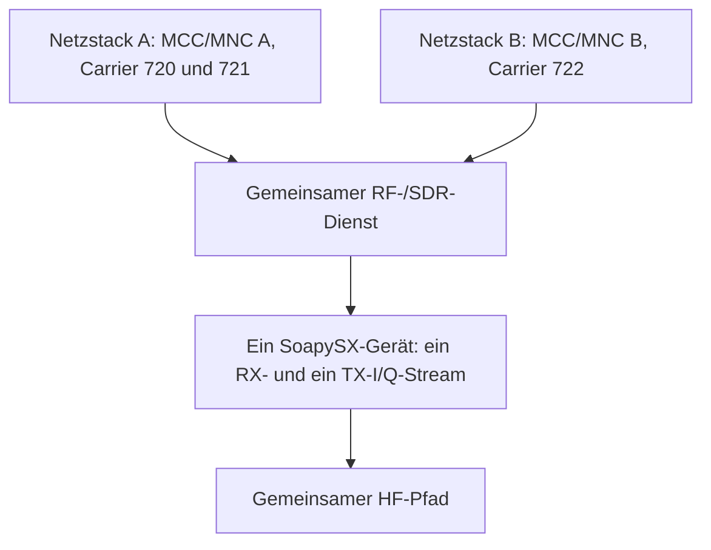

# Abschlussdokumentation: Ein Pi, ein SXceiver und ein dritter Carrier mit eigener MCC/MNC

## 1. Metadaten

- **Projekt:** NetCore-Tetra
- **Repository:** `JanHG98/netcore-tetra`
- **Ziel- und Archivbranch:** `Archiving`
- **Archivpfad:** `Docs/archive/2026-10-05_ein-pi-ein-sxceiver-dritter-carrier-mit-eigenem-mcc-mnc.md`
- **Erstellungsdatum dieser Zusammenfassung:** 2026-10-05, Zeitzone Europe/Berlin
- **Ursprünglicher Chattitel:** im zugänglichen Verlauf nicht verfügbar
- **Chatlink:** im zugänglichen Verlauf nicht verfügbar
- **Deskriptives Thema:** dritter TETRA-Carrier mit eigener MCC/MNC auf genau einem Raspberry Pi und einem SXceiver
- **Im Chat verwendeter Repository-Branch:** nicht genannt
- **Im Chat verwendeter Repository-Commit:** nicht genannt
- **Heute geprüfter Branch vor der Archivänderung:** `Archiving`
- **Heute geprüfter Commit vor der Archivänderung:** `e69d0af678a2c122bea330ecb1a8a76d0ec56de8`
- **Commit-Titel dieses Prüfstands:** `docs(archive): archive antenna mast mounting and 3D adapter chat`
- **Remote-Abgleich vor dem Schreiben:** lokaler Branch und `origin/Archiving` waren bei `e69d0af678a2c122bea330ecb1a8a76d0ec56de8` identisch; Ahead/Behind `0/0`
- **Zusätzlich beobachteter Remote-Stand von `main`:** `9116c15d645458f99e236712b67a1ad970432791`; `main` wurde für diesen Auftrag nicht ausgecheckt oder als Zielbranch verwendet

### 1.1 Auswertungsgrundlage

Ausgewertet wurden:

- der für diesen Archivierungslauf verfügbare Chatverlauf einschließlich der späteren ausdrücklichen Korrekturen des Nutzers;
- die im Chat genannten Scratch-Artefakte und Dateipfade, soweit sie noch erreichbar waren;
- der am 2026-10-05 frisch geklonte und mit dem Remote abgeglichene Branch `Archiving`;
- die für dieses Thema einschlägigen Source-, Konfigurations-, Test- und Dokumentationsdateien;
- 25 im Turn bereitgestellte ETSI-PDFs, insbesondere ETSI EN 300 392-1 V1.6.1 und ETSI EN 300 392-2 V3.8.1;
- der im Repository eingebundene SoapySX-/SXceiver-Treiber;
- die öffentlich dokumentierten SXceiver-Spezifikationen und das SX1255-Datenblatt für die Hardwaregrenzen.

### 1.2 Auswertungslücken

Folgende Inhalte waren nicht oder nicht mehr zugänglich:

- Der ursprüngliche Chattitel und der Chatlink wurden nicht überliefert.
- Das anfangs untersuchte Repository-ZIP ist im aktuellen Turn nicht als Eingabedatei vorhanden.
- Das im Chat mehrfach als fertig bereitgestellte Scratch-Artefakt
  `output/netcore-tetra-multi-network-carrier.zip` ist nach einer automatischen Workspace-Bereinigung nicht mehr vorhanden.
- Zu diesem ZIP fehlen Commit, Branch, Diff, PR und Buildprotokoll.
- Es liegen keine Compiler-, `cargo check`-, `cargo test`-, `cargo clippy`-, Raspberry-Pi-, SDR- oder HF-Messlogs für die behauptete Mehrnetzlösung vor.
- Die letzte vom Assistenten vorgeschlagene Kompromisslösung mit 418,050 MHz wurde vom Nutzer danach nicht ausdrücklich abgenommen.
- Im zugänglichen Verlauf befinden sich keine eigenständigen Chatbilder oder Screenshots. Die 25 Anhänge sind PDFs und keine Bildanhänge.

Die frühere lokale Arbeitskopie wurde durch Workspace-Wartung entfernt. Deshalb wurde das Repository für diesen Auftrag frisch vom Remote geklont. Zugangsdaten, Tokens, Passwörter, private Schlüssel und sonstige Secrets werden in dieser Dokumentation nicht übernommen.

---

## 2. Statuslegende

Dieses Dokument verwendet die folgenden Statuswerte streng:

- **Idee:** diskutierter Ansatz ohne verbindliche Festlegung.
- **Beschlossen/geplant:** als Anforderung oder Ziel festgelegt, aber nicht zwingend umgesetzt.
- **Implementiert:** im heute geprüften Repository-Stand durch Source oder Konfiguration nachgewiesen.
- **Getestet:** durch tatsächlich ausgeführte, nachvollziehbare Tests belegt.
- **Im Betrieb bestätigt:** auf realer Zielhardware beziehungsweise mit realen Funkgeräten erfolgreich betrieben und vom Nutzer bestätigt.
- **Im Chat als implementiert behauptet:** damalige Assistentenaussage ohne heutigen Repository-Nachweis.
- **Verworfen/ersetzt:** durch eine spätere ausdrückliche Korrektur oder Hardwaregrenze überholt.

Eine Aussage im Chat allein ist kein Implementierungs- oder Testnachweis.

---

## 3. Kurzfazit

Die endgültige Nutzeranforderung lautet:

> Genau ein Raspberry Pi, genau ein SXceiver, keine weitere HF-Hardware und eine softwareseitige Lösung für drei TETRA-Carrier, wobei der dritte Carrier eine eigene MCC/MNC und damit eine eigene logische Netzidentität besitzt.

Das technisch belastbare Ergebnis ist zweigeteilt:

1. **Logisch ist die Anforderung möglich:** Ein gemeinsamer SDR-I/Q-Stream kann mehrere benachbarte Träger enthalten. Ein Carrier mit eigener MCC/MNC muss aber als eigener logischer Zell-/Netzkontext mit eigenem Main Carrier, MCCH, SYNC, Scrambling-Code, Registrierung und Rufzustand geführt werden. Er ist kein gewöhnlicher `secondary_carrier` derselben Zelle.
2. **HF-seitig gelten unverrückbare Grenzen:** 418,000/418,025/418,050 MHz im Downlink und 408,000/408,025/408,050 MHz im Uplink passen bandbreitenseitig in den SXceiver-Datenstrom. 390 und 418 MHz gleichzeitig passen nicht in dessen bei 38,4 MHz Referenztakt maximal 600 kS/s schnellen Pfad und sind ausschließlich per Software nicht realisierbar. Zusätzlich liegen sowohl 390 MHz als auch der zugehörige 380-MHz-Uplink außerhalb des garantierten SX1255-/SXceiver-Bereichs von 400 bis 510 MHz.

Entscheidend für die Fortsetzung: Die im Chat behauptete Umsetzung eines Mehrnetz-Launchers, eines zentralen SDR-Brokers, eines Schalters `--single-sxceiver`, der Mehrnetz-Beispielkonfigurationen und eines netzbewussten Subscriber-Core-Filters ist im heute geprüften Branch **nicht vorhanden**. Der aktuelle Code unterstützt eine Zelle mit Haupt- und optionalem Sekundärträger unter derselben MCC/MNC.

---

## 4. Ziel, Ausgangslage und behandelte Themen

### 4.1 Ursprüngliches Ziel

Der Nutzer wollte zu der vorhandenen Dual-Carrier-Basisstation einen dritten Träger hinzufügen. Netz A sollte beispielhaft zwei Träger bei 418/408 MHz mit MCC/MNC `1/1` verwenden. Der dritte Träger sollte beispielhaft bei 390/380 MHz mit MCC/MNC `2/2` arbeiten.

Der Wunsch war damit nicht nur ein Kapazitätsausbau derselben Zelle, sondern der parallele Betrieb zweier logischer TETRA-Netze:

| Logischer Bereich | Ursprüngliches Beispiel | Netzkennung |
|---|---|---|
| Netz A | 418/408 MHz, zwei Carrier | MCC/MNC `1/1` |
| Netz B | 390/380 MHz, ein Carrier | MCC/MNC `2/2` |

Die Zahlen `1/1` und `2/2` waren Beispiele. Der Chat enthält keine endgültige Zuteilungs- oder Betriebsfreigabe für diese Werte.

### 4.2 Im Chat behandelte Teilthemen

- Unterschied zwischen zusätzlichem Carrier derselben Zelle und eigenem TETRA-Netz;
- MCC/MNC, MNI, Scrambling-Code, Main Carrier, MCCH, SYNC und BCCH;
- mehrere vollständige Protokollstacks gegenüber mehreren Schedulerinstanzen;
- mehrere Prozesse gegenüber einem Prozess;
- exklusiver Besitz eines SDR durch einen zentralen Broker;
- gemeinsame RX-/TX-I/Q-Streams und digitale Kanalisation;
- SXceiver-/SX1255-Sample-Rate und momentane Bandbreite;
- 390/418-MHz-Gleichzeitigkeit gegenüber drei benachbarten 25-kHz-Trägern;
- netzbewusste Teilnehmerverteilung im Subscriber Core;
- globale ISSI-Eindeutigkeit gegenüber zusammengesetzter ITSI-/Netzidentität;
- Ressourcenabgrenzung für Node-IDs, Ports, TUN-Interfaces, Edge-Policy und Spooldateien;
- Konfigurationsprüfung, systemd, Build- und Testgrenzen;
- fehlender Repository-Nachweis des damals erzeugten ZIPs.

---

## 5. Chronologie und spätere Korrekturen

| Phase | Aussage oder Entscheidung | Status im damaligen Chat | Heutige Einordnung |
|---:|---|---|---|
| 1 | Dritter Carrier mit eigener MCC/MNC und eigenen Frequenzen; Beispiel 390/380 MHz parallel zu 418/408 MHz. | Nutzeranforderung | Ausgangswunsch. |
| 2 | Ein Carrier mit anderer MCC/MNC soll nicht als bloßer Secondary Carrier derselben Zelle modelliert werden. | Beschlossen/geplant | Normativ und architektonisch bestätigt. |
| 3 | Erste Architektur: getrennte vollständige BS-Prozesse, jeweils eigenes SDR oder eigener Host. | Geplant und später als umgesetzt behauptet | Durch spätere Ein-SDR-Vorgabe ersetzt; separates SDR/Host ist keine ETSI-Forderung. |
| 4 | Multi-Cell-Launcher mit mehreren Konfigurationsdateien, Vorabvalidierung und Kollisionsprüfungen. | Als implementiert behauptet | Im heutigen Repository nicht vorhanden. |
| 5 | Subscriber Core filtere Profile nach Home-MCC/MNC; `0/0` sei Wildcard. | Als implementiert behauptet | Im heutigen Repository nicht implementiert. |
| 6 | Erste Übergabe verlangte für 390 und 418 MHz zwei SDRs oder zwei Hosts. | Vorgeschlagener Betriebsweg | Vom Nutzer ausdrücklich abgelehnt. |
| 7 | Der Nutzer machte **ein einzelnes SDR** zur Pflicht. | Verbindliche Korrektur | Hat Vorrang. |
| 8 | Neue Architektur: zentraler SDR-Broker öffnet das Gerät einmal; getrennte Netzstacks speisen einen gemeinsamen Mehrträger-DSP. | Geplant und später als implementiert behauptet | Technisch sinnvoller Zielentwurf; heutiger Repository-Nachweis fehlt. |
| 9 | Für den vorhandenen SXceiver wurde 418,000/418,025/418,050 MHz vorgeschlagen. | Als implementiert behauptet | Bandbreitenseitig plausibel; nicht kompiliert oder auf HF getestet. |
| 10 | Ein Breitband-SDR beziehungsweise externer Frequenzumsetzer wurde als Weg zu echten 390/418 MHz vorgeschlagen. | Zwischenidee | Durch die nächste Nutzerkorrektur ersetzt. |
| 11 | Der Nutzer legte endgültig fest: ein Pi, ein SXceiver, keine zusätzliche HF-Hardware; die Lösung müsse softwareseitig arbeiten. | Endgültige Anforderung | Maßgebliche Zielplattform. |
| 12 | Modus `--single-sxceiver` mit zwei Konfigurationen und erzwungenem gemeinsamem `driver=sx` wurde als fertig bezeichnet. | Als implementiert behauptet | Im heutigen CLI und Repository nicht vorhanden. |
| 13 | Letzte Assistentenantwort: Drei benachbarte Carrier und zwei MCC/MNC seien möglich; 390/418 MHz gleichzeitig seien unmöglich. | Endgültiger Vorschlag | Physikalische Grenze bestätigt; Softwarefunktion weiterhin unimplementiert. |

### 5.1 Vorrang der letzten Festlegung

Für eine spätere Fortsetzung gelten nicht mehr:

- mehrere SDRs;
- mehrere Hosts;
- ein anderes Breitband-SDR;
- ein externer RX-/TX-Frequenzumsetzer;
- echter gleichzeitiger Betrieb von 390 und 418 MHz auf dem vorhandenen SXceiver;
- jeder Netzprozess öffnet selbst ein SDR.

Diese Ansätze dürfen nur als verworfene Historie betrachtet werden.

---

## 6. Endgültige Anforderungen und technische Entscheidungen

### 6.1 Verbindliche Hardwareplattform

**Status: beschlossen/geplant**

- genau ein Raspberry Pi;
- genau ein SXceiver;
- ein gemeinsamer RX-I/Q-Stream und ein gemeinsamer TX-I/Q-Stream;
- keine zusätzlichen SDRs;
- kein externer Frequenzumsetzer;
- keine zweite HF-Kette;
- Lösung durch Softwarearchitektur und DSP innerhalb der Hardwaregrenzen.

### 6.2 Drei Carrier, aber zwei logische Netze

**Status: beschlossen/geplant; im heutigen Repository nicht implementiert**

Der letzte technisch konsistente Beispielplan lautet:

| Logischer Kontext | Carrier | Downlink | Uplink | Beispiel-MCC | Beispiel-MNC |
|---|---:|---:|---:|---:|---:|
| Netz A, Hauptträger | 720 | 418,000 MHz | 408,000 MHz | 1 | 1 |
| Netz A, Sekundärträger | 721 | 418,025 MHz | 408,025 MHz | 1 | 1 |
| Netz B, eigener Hauptträger | 722 | 418,050 MHz | 408,050 MHz | 2 | 2 |

Netz A darf Haupt- und Sekundärträger als eine logische Zelle behandeln. Netz B muss eine eigene logische Zelle beziehungsweise einen eigenen Netzkontext erhalten.

Die Nummer `722` wurde im Chat nicht ausdrücklich genannt. Sie ist die für diese Abschlussdokumentation aus der im Repository verwendeten Frequenzformel und der vorgeschlagenen Trägermitte 418,050 MHz abgeleitete Fortsetzung von 720/721. Sie ist daher ein nachvollzogener NetCore-Projektwert und keine eigenständige damalige Nutzerfestlegung.

### 6.3 Status der 390/380-MHz-Idee

**Status: verworfen/ersetzt für die festgelegte Zielhardware**

Die frühere Konfigurationsidee lautete:

```toml
freq_band = 3
main_carrier = 3600
duplex_spacing = 0
```

Unter der im NetCore-Code verwendeten Band- und Duplexabbildung ergibt dies rechnerisch 390 MHz Downlink und 380 MHz Uplink. Diese Variante ist aus drei Gründen kein zulässiger Zielpfad mehr:

1. Die Downlink-Träger 390 und 418 MHz liegen 28 MHz auseinander; die Uplink-Träger 380 und 408 MHz ebenfalls.
2. Der SoapySX-Pfad des vorhandenen SXceivers liefert bei erkanntem 38,4-MHz-Referenztakt maximal 600 kS/s und laut SXceiver-Dokumentation ungefähr 300 kHz nutzbare Bandbreite.
3. SX1255/SXceiver garantieren 400 bis 510 MHz; sowohl 390 MHz als auch 380 MHz liegen außerhalb des garantierten Bereichs und wären selbst einzeln nur messtechnisch, nicht spezifikationsbasiert, zu beurteilen. Das RF-Matching des SXceivers ist außerdem auf ungefähr 420 bis 450 MHz optimiert.

Software kann fehlende analoge beziehungsweise abgetastete Bandbreite nicht rekonstruieren. Schnelles Retuning wäre Time-Sharing und kein gleichzeitiger Betrieb zweier kontinuierlich verfügbarer TETRA-Zellen.

### 6.4 Regulatorische Grenze

Die Frequenz- und Netzkennungsbeispiele sind technische Rechenbeispiele, keine Frequenzzuteilung. ETSI EN 300 392-2 weist darauf hin, dass Bandlagen und Duplexabstände durch nationale Regulierungsbehörden zugeteilt werden. Vor realem Sendebetrieb müssen Frequenznutzung, Leistung, Filterung und Netzkennungen rechtlich zulässig beziehungsweise zugeteilt sein.

---

## 7. Normativ abgeleitete logische Architektur

### 7.1 Netzidentität

Die für diesen Archivierungslauf geprüften Normstellen ergeben:

- MCC und MNC bilden gemeinsam die Mobile Network Identity (MNI).
- Ein TETRA-Netz besteht aus verbundenen Zellen, die dieselbe MCC/MNC-Kombination aussenden.
- Eine andere MCC und/oder MNC bezeichnet ein anderes Netz.
- Viele Zellen dürfen dieselbe MNI besitzen; MCC/MNC allein ist daher keine eindeutige Zell-ID.

Fundstellen:

- ETSI EN 300 392-1 V1.6.1, 7.6.1, Seite 34;
- ETSI EN 300 392-2 V3.8.1, Begriffsdefinitionen in Abschnitt 3, Seite 56.

### 7.2 Scrambling und Zellkontext

Der Scrambling-Code besteht aus MCC und MNC sowie dem sechs Bit breiten Colour Code. Zusammen bilden diese Werte den Extended Colour Code. Die Zelle sendet ihre MCC/MNC in D-MLE-SYNC beziehungsweise D-MLE-SYNC-DA.

Fundstellen:

- ETSI EN 300 392-1, 7.7.3 und 7.7.4.3, Seiten 35 bis 36;
- ETSI EN 300 392-2, 18.4.2.1/18.4.2.1a, Seiten 530 bis 531;
- ETSI EN 300 392-2, 23.2.1, Seite 810.

### 7.3 Main Carrier und MCCH

Jede CA-Zelle besitzt einen Main Carrier mit MCCH. Daraus folgt für das NetCore-Modell: Ein Träger mit anderer MNI darf nicht nur als zusätzlicher Traffic Carrier in den bestehenden Zellkontext eingehängt werden.

Belastbare Architekturfolge für NetCore; die Carrierwerte sind Projektbeispiele und keine direkt aus den bereitgestellten Normen verifizierte Bandzuordnung:

```text
Netz A / Zelle A
  MCC/MNC A
  eigener Extended Colour Code
  Main Carrier 720 mit MCCH/SYNC/SYSINFO
  Secondary Carrier 721 derselben Zelle
  Zustände mindestens eindeutig an Netz A gebunden

Netz B / Zelle B
  MCC/MNC B
  eigener Extended Colour Code
  Main Carrier 722 mit eigenem MCCH/SYNC/SYSINFO
  Zustände mindestens eindeutig an Netz B gebunden
```

Fundstellen:

- ETSI EN 300 392-2, 23.3.1.1.1 und 23.3.1.1.2, Seiten 815 bis 816.

ETSI belegt die getrennte MNI-, SYNC-, Scrambling- und Zell-Control-Domäne. Die Forderung, Registrierungs-, Mobility-, Call- und Floor-Zustände getrennt zu halten oder mindestens vollständig mit dem Netzkontext zu schlüsseln, ist eine NetCore-Architekturentscheidung daraus. Inter-Network-Dienste bleiben prinzipiell möglich. Die Norm fordert **nicht**, dass jeder Zellkontext einen separaten Host, Prozess oder SDR besitzt.

### 7.4 Frequenzformel

ETSI EN 300 392-2, 21.4.4.1, Seiten 697 bis 698, verwendet für den Main Carrier sinngemäß:

\[
f_\mathrm{DL}=f_\mathrm{base}+N\cdot25\,\mathrm{kHz}+f_\mathrm{offset}
\]

Bei Normalbetrieb gilt:

\[
f_\mathrm{UL}=f_\mathrm{DL}-D
\]

Die weiteren 25-kHz-Träger werden in 21.5.2, Seiten 717 bis 720, behandelt.

Die Zuordnung der Frequency-Band-Codes und Duplex-Spacing-Codes verweist EN 300 392-2 auf ETSI TS 100 392-15. Diese TS war unter den 25 bereitgestellten PDFs **nicht enthalten**. Die konkreten NetCore-Werte lassen sich aus dem Repository-Code ableiten, wurden in diesem Lauf aber nicht vollständig gegen die fehlende TS normverifiziert.

---

## 8. Zielarchitektur für einen Pi und einen SXceiver

### 8.1 Benötigte Schichten

Die sinnvolle Zielarchitektur trennt physische HF-Ressourcen von logischen Netzstacks:



Der RF-/SDR-Dienst besitzt die gemeinsame TDMA-/Hardware-Zeitbasis, RX-Kanalisierung, TX-Mehrträger-Synthese und Queue-/Backpressure-Logik. Ob beide Stacks im selben Prozess oder in getrennten Prozessen laufen, ist für eine Neuimplementierung weiterhin eine Architekturentscheidung.

### 8.2 Verantwortlichkeiten des gemeinsamen RF-/SDR-Dienstes

**Status: beschlossen/geplant; nicht implementiert**

Der gemeinsame Dienst muss mindestens:

- den SXceiver exklusiv genau einmal öffnen;
- eine gemeinsame RX- und TX-Center-Frequency sowie Sample-Rate konfigurieren;
- alle Träger gegen nutzbare Bandbreite und Schutzreserve validieren;
- Downlink-Wellenformen carrierweise erzeugen und zu einem I/Q-Strom addieren;
- den gemeinsamen Uplink-I/Q-Strom in carrierbezogene Demodulatorpfade aufteilen;
- eine gemeinsame Hardware- und TDMA-Zeitbasis bereitstellen;
- Carrier, Air Timeslot, Frame, Multiframe und Netzwerkstack eindeutig zuordnen;
- Leerlauf-Slots und nicht endliche RSSI-Werte verlustfrei transportieren;
- Queue-Grenzen, Backpressure, Fristüberschreitungen und Underrun/Overrun behandeln;
- Start, Stopp, Crash und Wiederanlauf eines Netzstacks vom SDR-Lebenszyklus entkoppeln;
- Telemetrie pro physischem Stream, Carrier und Netz bereitstellen;
- Übersteuerung durch Summieren mehrerer Carrier verhindern.

### 8.3 Prozessmodell

Der Assistent stellte zuletzt einen zentralen SDR-Broker mit getrennten Netzprozessen beziehungsweise Netzstacks als bereits implementiert dar. Der Nutzer ratifizierte dieses konkrete Prozessmodell nicht, und der heute verfügbare Code belegt es nicht. Für eine Neuimplementierung bleibt die Entscheidung daher offen:

| Variante | Vorteil | Risiko/Aufwand |
|---|---|---|
| Ein Prozess, zwei getrennte Stackinstanzen und ein gemeinsamer RF-Dienst | keine externe Echtzeit-IPC; gemeinsame Zeitbasis einfacher | große Refaktorierung des aktuell singletonartig gestarteten Stacks; Fehlerisolation geringer |
| RF-Broker plus getrennte Netzprozesse | klare Isolation von Netz- und Zustandsräumen | Echtzeit-IPC, Zero-Copy-/Queue-Design, Zeitstempel, Backpressure und Crash-Recovery werden kritisch |

Vor einer Implementierung ist ein Architecture Decision Record erforderlich. Die damalige Assistentenantwort behauptete einen Prozessbroker, definierte aber weder Datenformat noch IPC, Queue-Größe, Latenzbudget oder Restart-Semantik.

### 8.4 Notwendige logische Isolation

Pro Netz-/Zellkontext müssen mindestens getrennt bleiben:

- MCC, MNC, Colour Code und daraus gebildeter Scrambling-Code;
- Main Carrier und MCCH;
- SYNC-, SYSINFO- und Netzbroadcast-PDUs;
- Location Area und Zell-/Node-Identität;
- Registrierung, Deregistrierung und Mobility-Zustand;
- Teilnehmer-, Gruppen- und Affiliation-Zustand;
- Einzelruf-, Gruppenruf-, Floor-, Hangtime- und Restore-Zustand;
- Rufressourcen und Carrier-/Timeslot-Zuordnung;
- Telemetrie- und Control-Room-Identität;
- persistente Policy-, Spool- und Recovery-Dateien;
- Dashboard-, SIP-, RTP-, TUN- oder sonstige lokale Ressourcen, falls je Stack getrennt betrieben.

---

## 9. Hardware- und Bandbreitenprüfung

### 9.1 SXceiver-Streammodell

**Status: im gebündelten SoapySX-Treiber implementiert und per Quellcode statisch bestätigt; in diesem Archivierungslauf nicht am Gerät getestet**

Der eingebundene SoapySX-Treiber zeigt:

- Hardwaretyp SX1255;
- genau einen RX-Kanal und einen TX-Kanal;
- genau einen Stream je Richtung;
- CF32 als Streamformat;
- getrennte ALSA-Capture- und Playbackpfade für RX und TX;
- einen RX- und einen TX-Synthesizer für Full-Duplex, aber nicht mehrere lokale Oszillatoren pro Richtung.

Relevante Datei:

- [`sxxcvr-main/SoapySX/SoapySX.cpp`](../../sxxcvr-main/SoapySX/SoapySX.cpp)

### 9.2 Sample-Raten

Die Treibertabelle enthält die Teiler `1536`, `768`, `512`, `256`, `128` und `64`. Bei 38,4 MHz Referenztakt ergeben sich:

| Teiler | Sample-Rate |
|---:|---:|
| 1536 | 25 kS/s |
| 768 | 50 kS/s |
| 512 | 75 kS/s |
| 256 | 150 kS/s |
| 128 | 300 kS/s |
| 64 | 600 kS/s |

Der aktuelle NetCore-SXceiver-Default und `config.toml` verwenden 600 kS/s.

Relevante Dateien:

- [`crates/tetra-entities/src/phy/components/soapy_settings.rs`](../../crates/tetra-entities/src/phy/components/soapy_settings.rs)
- [`config.toml`](../../config.toml)

Die SXceiver-Dokumentation beschreibt wegen der Filter-/Dezimationsflanken ungefähr die halbe gewählte Sample-Rate als praktisch nutzbare Bandbreite. Für die Planung ist daher ungefähr 300 kHz nutzbares Spektrum konservativer als die idealisierte komplexe Nyquist-Spanne von insgesamt 600 kHz.

Im Chat war zwischenzeitlich von ungefähr 1 MHz momentaner HF-Bandbreite die Rede. Das beschreibt allenfalls die maximale analoge RF-Doppelseitenbandbreite des SX1255-Siliziums, nicht die praktisch nutzbare Bandbreite des hier eingesetzten SoapySX-/I2S-Pfads. Für dieses Projekt ist die engere Streamgrenze maßgeblich.

### 9.3 Drei benachbarte Carrier

Bei Trägermittenfrequenzen 418,000, 418,025 und 418,050 MHz beträgt der Abstand zwischen den äußeren Mitten 50 kHz. Unter Einbeziehung der nominalen 25-kHz-Kanalbreiten ergibt sich ein ungefähr 75 kHz breiter Gesamtbereich. Das gleiche gilt für 408,000/408,025/408,050 MHz. Symmetrische gemeinsame SDR-Mitten wären 418,025 MHz für TX und 408,025 MHz für RX. Die heutigen Dual-Carrier-Mitten 418,0125/408,0125 MHz würden die drei Träger bei 600 kS/s zwar ebenfalls umfassen, sind aber nicht deren symmetrischer Mittelpunkt.

**Bewertung:** Bandbreitenseitig passen diese drei Träger deutlich in den 600-kS/s-Pfad beziehungsweise die konservativ angesetzten ungefähr 300 kHz Nutzbandbreite.

Das ist noch keine Betriebsbestätigung. Folgende Punkte bleiben offen:

- Guard-/Filterreserve am realen SXceiver;
- LO- und Referenztaktabweichung;
- RX-Desensibilisierung und Duplexer-/Filterpfad;
- TX-Crest-Factor und erforderlicher digitaler Backoff;
- PA-Linearität bei drei gleichzeitig aktiven Trägern;
- Clipping und Intermodulation;
- Occupied Bandwidth, Nachbarkanalabstand und Sendemaske.

### 9.4 Clipping- und Summenleistungsrisiko

**Status: offenes technisches Risiko**

Der aktuelle FCFB addiert die Carrierwellenformen. Eine carrierzahlabhängige Normierung oder automatische Headroom-Strategie ist im geprüften Pfad nicht nachgewiesen. SoapySX begrenzt I und Q vor der Ausgabe hart auf den zulässigen Wertebereich.

Damit kann ein dritter gleichzeitig aktiver Träger trotz ausreichender Bandbreite Peaks erzeugen, die digital clippen oder die PA in einen nichtlinearen Bereich treiben. Vor HF-Betrieb sind mindestens erforderlich:

- definierter digitaler Backoff für ein, zwei und drei aktive Carrier;
- Peak-, RMS- und Crest-Factor-Telemetrie vor dem SoapySX-Clamp;
- Testvektoren für gleichphasige und ungünstige Peakaddition;
- Spektrumanalyse mit einem, zwei und drei aktiven Trägern;
- PA-Ausgangsleistung, Intermodulationsprodukte und thermische Belastung messen;
- verbindliche Abbruchschwellen für Clipping und TX-Underruns.

### 9.5 Warum 390 und 418 MHz mit dem vorhandenen SXceiver im direkten RF-Pfad nicht gleichzeitig funktionieren

| Größe | Wert |
|---|---:|
| Abstand der Downlink-Mitten | 28,000 MHz |
| Mindestspanne einschließlich nominaler Kanalränder | ungefähr 28,025 MHz |
| Abstand der Uplink-Mitten 380/408 MHz | 28,000 MHz |
| maximale SoapySX-Sample-Rate bei 38,4 MHz | 0,600 MS/s |
| konservativ nutzbare Bandbreite | ungefähr 0,300 MHz |

Digitale Frequenzverschiebung kann nur Signalanteile bearbeiten, die im gemeinsamen I/Q-Stream vorhanden sind. 28 MHz voneinander entfernte Bereiche werden vom vorhandenen analogen und digitalen Pfad nicht gemeinsam erfasst oder ausgesendet. Ein Softwarebroker ändert diese physikalische Grenze nicht.

Diese Rechnung belegt die Unmöglichkeit des gleichzeitigen direkten Betriebs. Sie belegt keine Eignung für einen alleinigen 390/380-MHz-Betrieb; beide Frequenzen liegen zusätzlich unterhalb des garantierten Bereichs von 400 bis 510 MHz.

---

## 10. Heutiger Repository-Abgleich

### 10.1 Prüfumfang

Der Branch `Archiving` wurde frisch geklont, vor dem Schreiben mit `origin/Archiving` abgeglichen und statisch durchsucht. Unter anderem wurden geprüft:

- CLI und Startpfad von `bluestation-bs`;
- Konfigurationsschema und Validierung;
- UMAC-Scheduler und Scrambling-Code-Bildung;
- PHY-/DSP-Modulatoren und Demodulatoren;
- SoapySDR-/SoapySX-Geräteöffnung;
- Dual-Carrier-Tests;
- Subscriber-Core-Datenmodell und Policy-Verteilung;
- behauptete Dokumentations-, Beispiel- und systemd-Dateien;
- Branch- und Commit-Historie des geklonten Zielbranches.

### 10.2 Tatsächlich vorhandener Betriebsentwurf

**Status: implementiert; in diesem Archivierungslauf nur statisch geprüft**

Der heutige Code startet genau einen Stack aus genau einer TOML-Datei:

- [`bins/bluestation-bs/src/main.rs`](../../bins/bluestation-bs/src/main.rs) definiert ein einziges positionsabhängiges Argument `config: String`.
- Die Anwendung lädt genau eine `StackConfig` und erzeugt genau ein `SharedConfig`.
- Der Stack erzeugt genau ein `RxTxDevSoapySdr`.

Der heutige Konfigurationsentwurf kennt genau:

- `main_carrier`;
- optional `secondary_carrier`;
- eine gemeinsame `[net_info]`-Sektion mit einer MCC und einer MNC;
- einen gemeinsamen Colour Code und Zellkontext.

Relevante Dateien:

- [`crates/tetra-config/src/bluestation/sec_cell.rs`](../../crates/tetra-config/src/bluestation/sec_cell.rs)
- [`crates/tetra-config/src/bluestation/config.rs`](../../crates/tetra-config/src/bluestation/config.rs)
- [`crates/tetra-config/src/bluestation/sec_net.rs`](../../crates/tetra-config/src/bluestation/sec_net.rs)

`StackConfig::bs_phase_mod_carriers()` iteriert ausschließlich über Haupt- und optionalen Sekundärträger. Ein `third_carrier`-Feld existiert nicht. Der strikte Parser weist unbekannte Konfigurationsfelder zurück.

### 10.3 Aktuelle Dual-Carrier-Logik

**Status: implementiert; kein Mehrnetzmodus**

Die aktuelle PHY ist bereits für eine Liste von Modulatoren und Demodulatoren aufgebaut:

- mehrere DL-Modulatoren können zu einem gemeinsamen TX-I/Q-Strom addiert werden;
- mehrere UL-Demodulatoren können aus einem gemeinsamen RX-I/Q-Strom gespeist werden;
- Carrier werden über `carrier_num` den Slots zugeordnet.

Relevante Datei:

- [`crates/tetra-entities/src/phy/components/soapy_dev.rs`](../../crates/tetra-entities/src/phy/components/soapy_dev.rs)

Dies ist eine wertvolle Grundlage für drei benachbarte Carrier. Der darüberliegende Stack begrenzt die Produktionskonfiguration jedoch auf zwei Carrier derselben Zelle.

In UMAC wird der Scrambling-Code einmal aus der einen MCC, der einen MNC und dem Colour Code berechnet. Main- und Secondary-Scheduler erhalten denselben Code. Der Secondary-Scheduler läuft ausdrücklich als `SecondaryBcchNoMcch`.

Relevante Datei:

- [`crates/tetra-entities/src/umac/umac_bs.rs`](../../crates/tetra-entities/src/umac/umac_bs.rs)

Damit ist der heutige Secondary Carrier **kein** eigener Main Carrier mit anderer MCC/MNC und eigenem MCCH.

### 10.4 Aktuelle Beispielkonfiguration

Der heutige Branch enthält in `config.toml`:

```toml
[phy_io.soapysdr]
tx_freq = 418000000
rx_freq = 408000000
sample_rate = 600000
tx_center_freq = 418012500
rx_center_freq = 408012500

[net_info]
mcc = 901
mnc = 1510

[cell_info]
freq_band = 4
main_carrier = 720
secondary_carrier = 721
duplex_spacing = 0
freq_offset = 0
reverse_operation = false
location_area = 1
colour_code = 1
```

Dies ist eine einzige MCC/MNC mit zwei Carriern. Es entspricht nicht dem Chatbeispiel `1/1` plus `2/2`.

Zwei vorhandene Kommentare sind irreführend und dürfen für Frequenzrechnungen nicht als Wahrheit verwendet werden:

- Der Kommentar zu `main_carrier = 720` erwähnt fälschlich `1521`.
- Der Kommentar zu `duplex_spacing = 0` nennt bei Band 4 fünf MHz, während die aktuelle Codetabelle zehn MHz liefert und die eingetragenen RX-/TX-Werte zehn MHz auseinanderliegen.

### 10.5 Fehlende behauptete Dateien und Schalter

Im heutigen Branch fehlen:

```text
Docs/MULTI_NETWORK_CARRIER.md
examples/multi-network/network-a-418.toml
examples/multi-network/network-b-390.toml
examples/multi-network/network-b-418050.toml
examples/multi-network/network-a-wideband-418.toml
examples/multi-network/network-b-390-sx-converter.toml
```

Ebenfalls nicht vorhanden:

- CLI-Schalter `--single-sxceiver`;
- CLI-Schalter `--validate-only`;
- Annahme mehrerer Konfigurationsdateien durch `bluestation-bs`;
- Multi-Cell-Launcher;
- zentraler SDR-Broker;
- Mehrnetz-IPC;
- eigener Mehrnetz-systemd-Dienst;
- die im Chat beschriebenen Kollisionsprüfungen für Dashboard, SIP, RTP, TUN, Node-ID, Policy- und Spooldateien.

### 10.6 Subscriber Core

**Teilweise implementiert, behauptete Netzfilterung fehlt**

Heute vorhanden:

- `SubscriberProfile` enthält `home_mcc` und `home_mnc`;
- Nodes speichern MCC und MNC;
- Teilnehmer werden nach ISSI in einer `BTreeMap<u32, SubscriberProfile>` gespeichert;
- damit ist die ISSI im aktuellen Datenmodell global eindeutig.

Heute nicht vorhanden:

- `policy_values()` filtert Profile nicht nach MCC/MNC des Zielnodes;
- `schedule_sync_locked()` überträgt eine globale Liste autorisierter ISSIs;
- MCC/MNC des Nodes werden nicht in der Policyberechnung benutzt;
- ein spezielles `0/0`-Wildcard-Verhalten ist nicht implementiert;
- die TBS meldet die Subscriber-Policy-Fähigkeit im geprüften Control-Room-Protokoll derzeit als `false`.

Relevante Dateien:

- [`system-backend/subscriber-core/src/state.rs`](../../system-backend/subscriber-core/src/state.rs)
- [`system-backend/subscriber-core/README.md`](../../system-backend/subscriber-core/README.md)
- [`crates/tetra-entities/src/net_control_room/protocol.rs`](../../crates/tetra-entities/src/net_control_room/protocol.rs)

Die frühere Chatbehauptung, die netzbewusste Filterung und der Wildcard seien bereits eingebaut, ist für den heutigen Branch falsch.

---

## 11. Statusmatrix Chat gegenüber heutigem Repository

| Gegenstand | Idee | Beschlossen/geplant | Im Chat als implementiert behauptet | Heute im Branch implementiert | Getestet | Im Betrieb bestätigt |
|---|:---:|:---:|:---:|:---:|:---:|:---:|
| Ein Pi und ein SXceiver |  | ja | ja | bestehender Single-SDR-Startpfad, aber nicht Mehrnetz | nein | nein |
| Dritter Carrier mit eigener MCC/MNC |  | ja | ja | nein | nein | nein |
| Zweiter vollständiger Zell-/Netzkontext |  | ja | ja | nein | nein | nein |
| 418,000/418,025/418,050 MHz |  | letzter Vorschlag | ja | nur 418,000/418,025 konfiguriert | nein; nur Frequenzrechnung | nein |
| Gleichzeitige 390/418-MHz-Nutzung | ja | später verworfen | Zwischenwege behauptet | nein | nein | nein |
| Gemeinsamer Mehrträger-DSP |  | ja | ja | für zwei Carrier derselben Zelle vorhanden | nein; Zwei-Carrier-Testcode vorhanden, in diesem Lauf nicht ausgeführt | nein |
| Zentraler SDR-Broker | ja | ja | ja | nein | nein | nein |
| Mehrere Konfigurationsdateien | ja | ja | ja | nein | nein | nein |
| `--single-sxceiver` |  | ja | ja | nein | nein | nein |
| `--validate-only` |  | ja | ja | nein | nein | nein |
| Netzbewusste Subscriber-Policy |  | ja | ja | nein | nein | nein |
| `0/0` als Home-Netz-Wildcard |  | ja | ja | nein | nein | nein |
| Global eindeutige ISSI | bestehende Einschränkung | als Grenze erkannt | nicht behoben | ja | nein; Persistenztest im Source vorhanden, in diesem Lauf nicht ausgeführt | unbekannt |
| Mehrnetz-systemd-Unit | ja | ja | vorbereitet behauptet | nein | nein; historische Syntaxprüfungsbehauptung nicht reproduzierbar | nein |
| TX-Backoff für drei Carrier | im Chat nicht sauber behandelt | jetzt Roadmap-Kandidat | nein | nicht nachgewiesen | nein | nein |

---

## 12. Befehle und deren tatsächlicher Status

### 12.1 Im Chat vorgeschlagene Multi-SDR-/Mehrprozessbefehle

```bash
bluestation-bs --validate-only \
  examples/multi-network/network-a-418.toml \
  examples/multi-network/network-b-390.toml
```

```bash
bluestation-bs \
  examples/multi-network/network-a-418.toml \
  examples/multi-network/network-b-390.toml
```

**Status:** nur vorgeschlagen beziehungsweise im Chat als möglich bezeichnet. Im heutigen Branch sind Option, Mehrfachargumente und Dateien nicht vorhanden. Diese Befehle würden mit dem aktuellen CLI nicht wie beschrieben funktionieren.

### 12.2 Letzter Ein-SXceiver-Befehl

```bash
bluestation-bs --single-sxceiver \
  examples/multi-network/network-a-418.toml \
  examples/multi-network/network-b-418050.toml
```

**Status:** im Chat als fertig dargestellt, aber weder ausgeführt noch heute implementiert. Der Befehl ist keine gültige Betriebsanweisung für den geprüften Branch.

### 12.3 Tatsächlicher heutiger CLI-Vertrag

```bash
bluestation-bs <eine-config.toml>
```

**Status:** durch Source belegt. In diesem Archivierungslauf nicht kompiliert oder gestartet.

### 12.4 Empfohlene künftige Validierung

Nach einer echten Implementierung sollte ein rein lesender Prüfmodus mindestens folgende Kategorien prüfen:

```text
Hardware: genau ein driver=sx, identischer Gerätepfad, ein RX-/TX-Kanal
RF: gleiche Sample-Rate und gemeinsame RX-/TX-Mittenfrequenzen, alle Carrier im Nutzband
Netze: je Netz genau ein Main Carrier/MCCH, eindeutige Stack-ID
Funk: keine Carrierüberlappung, 25-kHz-Raster, Duplexzuordnung konsistent
Laufzeit: eindeutige Node-IDs, Ports, TUNs, Spools, Policy-/Recovery-Dateien
DSP: definierter Drei-Carrier-Backoff, Peak-/Clippinggrenzen
Core: Subscriber- und Group-Policy nach MNI gefiltert
```

Der konkrete spätere Schaltername ist offen; `--validate-only` darf erst dokumentiert werden, wenn er tatsächlich implementiert und getestet ist.

---

## 13. Im Chat behauptete Tests und ihre Grenzen

### 13.1 Damals als durchgeführt bezeichnet

Der Assistent behauptete folgende Prüfungen:

- TOML-Syntax;
- Frequenzableitung;
- eindeutige SDR-, Port- und Dateireferenzen;
- Abgleich verwendeter Config-Felder mit Rust-Strukturen;
- Rust-Klammer- und Stringstruktur;
- systemd-Syntax;
- Schutz gegen überlappende physische Carrier;
- identische SDR-Einstellungen;
- gemeinsame TDMA-Synchronisierung;
- verlustfreie Behandlung von `-∞`-RSSI;
- ZIP-Integrität mit `unzip -t`; das Archiv wurde mit ungefähr 31,5 MB angegeben.

Diese Aussagen konnten nicht reproduziert werden, weil das damalige ZIP und die zugehörigen Logs fehlen. Selbst bei zutreffendem `unzip -t` wäre nur die Strukturintegrität des ZIPs belegt, kein Rust-Build und keine Software- oder HF-Funktion. Sie gelten ausschließlich als **damalige Testbehauptungen eines nicht mehr verfügbaren Scratch-Artefakts**.

### 13.2 Damals ausdrücklich nicht durchgeführt

- `cargo check`;
- `cargo test`;
- `cargo clippy`;
- vollständiger Rust-Build.

Der damalige Assistent nannte eine fehlende Rust-Toolchain als Grund.

### 13.3 Prüfungen dieses Archivierungslaufs

**Erfolgreich durchgeführt:**

- Zielbranch frisch geklont;
- `origin/Archiving` abgerufen und Ahead/Behind `0/0` bestätigt;
- Remote-Commit des Zielbranches geprüft;
- vollständige Keyword- und Pfadsuche nach den behaupteten Features;
- CLI-, Konfigurations-, UMAC-, PHY-, SoapySX- und Subscriber-Core-Code statisch geprüft;
- Frequenz- und Bandbreitenrechnung unabhängig nachvollzogen;
- ETSI-Normstellen in den bereitgestellten PDFs geprüft;
- alle 25 PDF-Anhänge inventarisiert und gehasht;
- geprüft, dass keine eigenständigen Bildanhänge vorliegen.

**Nicht möglich beziehungsweise nicht durchgeführt:**

- Rust-Build und Rust-Tests, da `cargo` und `rustc` in der Arbeitsumgebung fehlen;
- Start von `bluestation-bs`;
- Raspberry-Pi-Test;
- Öffnen eines echten SXceivers;
- RF-Aussendung oder Empfang;
- Spektrum-, Sendemasken- oder PA-Messung;
- Registrierung von Funkgeräten in zwei MNI-Kontexten;
- Last-, Recovery-, Underrun-/Overrun- oder Langzeittest.

### 13.4 Vorhandene Repository-Tests

[`crates/tetra-entities/src/phy/components/soapy_dev_tests.rs`](../../crates/tetra-entities/src/phy/components/soapy_dev_tests.rs) enthält Wellenformtests für zwei Carrier. Unter anderem wird geprüft, dass die Dual-Carrier-Wellenform der Summe zweier einzelner Wellenformen entspricht und dass Carrierreihenfolge beziehungsweise fehlende Slots das Ergebnis nicht unerwartet verändern.

Diese Tests belegen keine Drei-Carrier-Skalierung, keinen zweiten MCC/MNC-Stack, keinen Hardwarebetrieb und keinen Clipping-/Spektrummaskentest.

---

## 14. Fehler, Diagnosen und verbleibende Probleme

### 14.1 Modellierungsfehler: eigene MNI als Secondary Carrier

**Diagnose:** Der vorhandene `secondary_carrier` gehört zur selben Zelle und verwendet denselben Netz-/Scrambling-Kontext.

**Lösungskonzept:** Netz B benötigt einen eigenen Main-Carrier-/MCCH-/Stackkontext. Die gemeinsame Nutzung des SDR erfolgt darunter auf RF-/DSP-Ebene.

**Status:** Konzept beschlossen; nicht implementiert.

### 14.2 Hardwarekonflikt 390/418 MHz

**Diagnose:** 28 MHz Abstand übersteigen den bei 38,4 MHz Referenztakt maximal 600-kS/s-schnellen Pfad bei weitem. Sowohl 390 MHz als auch 380 MHz liegen zudem außerhalb des garantierten Bereichs.

**Rechnerisch und bandbreitenseitig geeigneter Zielansatz für die feste Hardware:** Carrier des zweiten Netzes in dasselbe schmale RF-Fenster legen, beispielsweise 418,050/408,050 MHz, sofern regulatorisch zulässig.

**Status:** rechnerisch geeignet; nicht praktisch getestet und vom Nutzer nicht abschließend abgenommen.

### 14.3 Mehrere Prozesse öffnen dasselbe SDR

**Diagnose:** SoapySX meldet einen Kanal je Richtung und erlaubt pro Geräteinstanz höchstens einen eingerichteten Stream je Richtung. Mehrere direkte Prozessöffnungen sind im Projekt nicht koordiniert oder unterstützt und würden um ALSA-, SPI- und GPIO-Ressourcen konkurrieren. Ein expliziter globaler Prozess-Lock oder ein ausgeführter Multiprozess-Negativtest wurde nicht gefunden.

**Lösungskonzept:** exklusiver gemeinsamer RF-Dienst oder ein einzelner Prozess mit mehreren getrennten Stackinstanzen.

**Status:** offen.

### 14.4 `-∞`-RSSI in Leerlauf-Slots

Im Chat wurde behauptet, unbenutzte Timeslots lieferten `-∞` als RSSI und der neue Austauschpfad behandle dies verlustfrei.

**Status:** im heutigen Branch ist kein entsprechender Broker-/IPC-Pfad vorhanden. Die genaue Serialisierung und Prüfung können nicht rekonstruiert werden. Für einen künftigen IPC-Vertrag muss festgelegt werden, ob nicht endliche Floatwerte erlaubt, als `null`/Statusflag codiert oder in einen Sentineltyp überführt werden.

### 14.5 Teilnehmeridentität

**Diagnose:** Der Subscriber Core speichert Profile global nach ISSI. Home-MCC/MNC sind Felder, aber nicht Teil des Primärschlüssels oder der Policyfilterung.

**Folge:** Zwei Netze können nicht unabhängig dieselbe numerische ISSI als zwei verschiedene Teilnehmerprofile führen.

**Ziel:** Schlüssel und APIs mindestens auf `(MCC, MNC, ISSI)` beziehungsweise eine sauber modellierte ITSI umstellen oder eine bewusst dokumentierte globale ISSI-Policy beibehalten.

### 14.6 TX-Summenpegel

**Diagnose:** Der vorhandene DSP summiert Carrier; ein Drei-Carrier-Backoff ist nicht nachgewiesen.

**Folge:** mögliches digitales Clipping, PA-Kompression und unerwünschte Nebenprodukte.

**Ziel:** Headroom-Strategie implementieren und messtechnisch abnehmen.

---

## 15. Verworfene oder ersetzte Ansätze

### 15.1 Zwei SDRs oder zwei Hosts

**Verworfen:** widerspricht der ausdrücklichen Hardwarevorgabe.

### 15.2 Beliebiges Breitband-SDR

**Verworfen:** der Nutzer legte den vorhandenen SXceiver fest.

### 15.3 Externer Frequenzumsetzer

**Verworfen:** zusätzliche HF-Hardware wurde ausgeschlossen. Die damalige Zwischenidee wollte Netz B für das Funkgerät real bei 390/380 MHz abstrahlen, während der SXceiver intern 418,050/408,050 MHz verarbeitet. Diese logische/physische Frequenzabbildung war ungetestet und ist nicht Teil der endgültigen Zielplattform.

### 15.4 390/380 MHz parallel zu 418/408 MHz

**Verworfen:** nicht gleichzeitig durch den SXceiver-I/Q-Pfad abbildbar; 390 und 380 MHz liegen zusätzlich außerhalb des garantierten Bereichs.

### 15.5 Netz B als `third_carrier` derselben Zelle

**Verworfen:** andere MCC/MNC erfordern einen separaten logischen Zell-/Netzkontext.

### 15.6 Zwei Netzprozesse öffnen den SXceiver direkt

**Verworfen:** direkte Mehrfachöffnung ist im Projekt weder koordiniert noch getestet. Die Zielarchitektur muss exklusiven Besitz des physischen Geräts erzwingen und die Netze oberhalb dieses Eigentümers multiplexen.

### 15.7 Frühere ZIPs als Repository-Wahrheit

**Verworfen:** Das ZIP war ein nicht versioniertes Scratch-Artefakt und ist heute nicht verfügbar. Eine spätere Implementierung muss vom aktuellen Branch ausgehen oder der alte Stand muss als überprüfbarer Diff wiederbeschafft werden.

---

## 16. Komponenten, Schnittstellen und Abhängigkeiten

### 16.1 Bestehende relevante Komponenten

| Komponente | Rolle heute | Relevanz für Zielarchitektur |
|---|---|---|
| `bluestation-bs` | startet einen Stack aus einer TOML | muss mehrere logische Stackkontexte oder einen Brokerclient unterstützen |
| `tetra-config` | globale Netz-/Zell-/PHY-Konfiguration | braucht klar getrennte gemeinsame RF- und per-Netz-Konfiguration |
| UMAC/BS-Scheduler | Main plus Secondary derselben Zelle | braucht separaten Main-/MCCH-Kontext für Netz B |
| PHY/Soapy-DSP | mehrere Modulator-/Demodulatorvektoren | gute Grundlage für dritten benachbarten Carrier |
| SoapySX | ein RX- und ein TX-Stream pro Geräteinstanz | Zielarchitektur muss exklusiven physischen Eigentümer festlegen |
| Subscriber Core | Teilnehmerprofile und globale Policy | braucht MNI-Filter und Identitätsentscheidung |
| Node Gateway/Control Room | Node-Identität, Telemetrie, Commands | muss zwei logische Zellen auf einem physischen Node eindeutig darstellen |

### 16.2 Noch undefinierte Schnittstellen

Der Chat definierte keine belastbaren Werte für:

- Broker-Socket oder IPC-Protokoll;
- Unix-Socket-/TCP-Port;
- Queue-Tiefe und Speichergrenzen;
- Frame-/Slot-Zeitstempel;
- Zero-Copy- oder Shared-Memory-Format;
- Backpressure und Drop-Policy;
- Neustart- und Reconnect-Verhalten;
- Versionierung des Protokolls;
- Heartbeat und Healthchecks;
- Metriknamen;
- systemd-Unit-Namen und Abhängigkeiten.

Solche Werte dürfen nicht aus dem damaligen ZIP erfunden werden.

### 16.3 Aktuelle Ports und Protokolle

Der Mehrnetzchat legte keine konkreten neuen Ports fest. Die Behauptung, Dashboard-, SIP- und RTP-Portkollisionen würden validiert, nennt keine Portnummern und ist im heutigen Source nicht als Mehrnetzprüfung nachgewiesen.

Der Subscriber Core dokumentiert heute seine WebUI beispielhaft unter Port `8100`. Dies ist ein aktueller Repositorybefund und kein im Chat beschlossener Brokerport.

---

## 17. Konkrete nächste Schritte und Prioritäten

### Priorität 0: Zielparameter bestätigen

1. Festlegen, ob 418,000/418,025/418,050 MHz tatsächlich der gewünschte Testplan ist.
2. Produktive oder Labor-MCC/MNC für beide Netze festlegen; `1/1` und `2/2` nicht ungeprüft übernehmen.
3. Colour Code, Location Area, Node-ID und Teilnehmerbereiche je Netz festlegen.
4. Regulatorische und HF-seitige Zulässigkeit bestätigen.

### Priorität 1: Architecture Decision Record

1. Einprozess-Mehrstack gegen Broker-/Mehrprozessmodell entscheiden.
2. Eigentümer von Hardwarezeit, TDMA-Zeit und SoapySX-Lebenszyklus festlegen.
3. Per-Netz- und gemeinsame Konfiguration trennen.
4. Fehlerisolation, Wiederanlauf und Backpressure definieren.
5. Telemetrie- und Control-Room-Modell für zwei logische Zellen auf einem Pi definieren.

### Priorität 2: Datenmodell und Konfiguration

1. `StackConfig` nicht einfach um ein globales `third_carrier` ergänzen.
2. Eine gemeinsame RF-Konfiguration mit Liste physischer Carrier einführen.
3. Je Netz eine eigene Zellkonfiguration mit MCC/MNC, Colour Code, Main Carrier und optionalen Secondary Carriern einführen.
4. strikte Validierung für Bandbreite, Center-Frequency, Raster, Überschneidung und Ressourcen ergänzen.
5. Subscriber-Core-Schlüssel und MNI-Filterung festlegen.
6. `0/0`-Wildcard nur nach expliziter Sicherheitsentscheidung einführen; nicht stillschweigend als Default.

### Priorität 3: RF-/DSP-Refaktorierung

1. SoapySX genau einmal öffnen.
2. drei Carrier in RX und TX konfigurieren können.
3. eine gemeinsame Zeitbasis an beide Netzstacks liefern.
4. carrier- und netzbezogene Slot-Batches transportieren.
5. Drei-Carrier-Backoff und Clippingtelemetrie implementieren.
6. nicht endliche RSSI-Werte explizit modellieren.

### Priorität 4: Logische Stacktrennung

1. Netz B mit eigenem UMAC-Scheduler als Main Carrier/MCCH starten.
2. Scrambling-Code aus dessen eigener MCC/MNC und Colour Code bilden.
3. MM/MLE/CMCE-, Gruppen-, Floor- und Restore-Zustände trennen.
4. keine unbekannten Gruppen-/Netzbefehle zwischen den Stacks vermischen.
5. Node-/Zellidentität und zentrale Policies pro MNI routen.

### Priorität 5: Automatisierte Tests

Mindestens erforderlich:

- Config-Parser- und Validierungstests für zwei Netze und drei Carrier;
- Negativtests für 390/418 MHz bei `driver=sx` und 600 kS/s bei 38,4 MHz Referenztakt;
- Scrambling-Code- und SYNC-/SYSINFO-Test je Netz;
- Drei-Carrier-Wellenformtests;
- Peak-/Clipping-/Backofftests;
- RX-Demultiplex- und Carrierzuordnungstests;
- TDMA-Zeit- und Fristtests;
- Subscriber-Core-MNI-Filtertests;
- gleiche ISSI in zwei MNI-Kontexten, abhängig von der Datenmodellentscheidung;
- Crash-/Restart-/Backpressuretests;
- Regression des bestehenden Dual-Carrier-Betriebs.

### Priorität 6: Hardware- und Funkabnahme

1. Build auf dem Ziel-Pi.
2. `SoapySDRUtil --probe` und tatsächlich angebotene Raten protokollieren.
3. drei unmodulierte beziehungsweise kontrollierte Testträger im Labor prüfen.
4. Peak, RMS, Clipping, PA-Strom, Temperatur und Intermodulation messen.
5. TETRA-Sendemaske und Nachbarkanalleistung messen.
6. je Netz ein Funkgerät campen und registrieren lassen.
7. gleichzeitige Registrierung und Suche beider Netze testen.
8. SDS, Einzelruf, Gruppenruf, Floor, Hangtime und Restore je Netz testen.
9. gleichzeitige Last in beiden Netzen testen.
10. mindestens einen Dauerlauf mit CPU-, RAM-, Temperatur-, Underrun- und Overrun-Metriken durchführen.

---

## 18. Abnahmekriterien für „implementiert“, „getestet“ und „im Betrieb bestätigt“

### 18.1 Implementiert

Der Status **implementiert** ist erst gerechtfertigt, wenn der Zielbranch mindestens enthält:

- Source für zwei getrennte Netz-/Zellkontexte;
- gemeinsame Single-SXceiver-RF-Instanz;
- drei Carrier in Config und DSP;
- strikte Validierung;
- Subscriber-/Core-Routing je MNI;
- Dokumentation und reale Beispielkonfigurationen;
- systemd-/Deploymentpfad ohne erfundene Optionen.

### 18.2 Getestet

Der Status **getestet** erfordert nachvollziehbare Logs für:

- erfolgreichen `cargo check` und `cargo test`;
- relevante Unit-, Integrations- und Negativtests;
- Start auf dem Raspberry Pi;
- Öffnen genau eines SXceivers;
- drei aktive digitale Carrier ohne Clipping/Underrun;
- korrekte MCC/MNC-/Scrambling-/MCCH-Ausstrahlung.

### 18.3 Im Betrieb bestätigt

Der Status **im Betrieb bestätigt** erfordert zusätzlich:

- Spektrum- und Leistungsmessung;
- reale Funkgeräte in beiden Netzen;
- gleichzeitige Registrierung und Verkehr;
- stabilen Dauerlauf;
- bestätigte Recovery nach Stack- oder Dienstneustart;
- ausdrückliche Abnahme durch den Nutzer.

---

## 19. Relevante Repository-Dateien und verwandte Archive

### 19.1 Source und Konfiguration

- [`bins/bluestation-bs/src/main.rs`](../../bins/bluestation-bs/src/main.rs)
- [`config.toml`](../../config.toml)
- [`crates/tetra-config/src/bluestation/config.rs`](../../crates/tetra-config/src/bluestation/config.rs)
- [`crates/tetra-config/src/bluestation/sec_cell.rs`](../../crates/tetra-config/src/bluestation/sec_cell.rs)
- [`crates/tetra-config/src/bluestation/sec_net.rs`](../../crates/tetra-config/src/bluestation/sec_net.rs)
- [`crates/tetra-config/src/bluestation/sec_phy_soapy.rs`](../../crates/tetra-config/src/bluestation/sec_phy_soapy.rs)
- [`crates/tetra-config/src/bluestation/parsing.rs`](../../crates/tetra-config/src/bluestation/parsing.rs)
- [`crates/tetra-core/src/freqs.rs`](../../crates/tetra-core/src/freqs.rs)
- [`crates/tetra-entities/src/umac/umac_bs.rs`](../../crates/tetra-entities/src/umac/umac_bs.rs)
- [`crates/tetra-entities/src/phy/components/soapy_dev.rs`](../../crates/tetra-entities/src/phy/components/soapy_dev.rs)
- [`crates/tetra-entities/src/phy/components/soapy_dev_tests.rs`](../../crates/tetra-entities/src/phy/components/soapy_dev_tests.rs)
- [`crates/tetra-entities/src/phy/components/soapyio.rs`](../../crates/tetra-entities/src/phy/components/soapyio.rs)
- [`crates/tetra-entities/src/phy/components/soapy_settings.rs`](../../crates/tetra-entities/src/phy/components/soapy_settings.rs)
- [`crates/tetra-entities/src/net_control_room/protocol.rs`](../../crates/tetra-entities/src/net_control_room/protocol.rs)
- [`system-backend/subscriber-core/src/state.rs`](../../system-backend/subscriber-core/src/state.rs)
- [`system-backend/subscriber-core/README.md`](../../system-backend/subscriber-core/README.md)
- [`sxxcvr-main/SoapySX/SoapySX.cpp`](../../sxxcvr-main/SoapySX/SoapySX.cpp)

### 19.2 Verwandte Archivdokumente

- [DualCarrier-Portierung und SXceiver-Hotfixes](2026-10-03_flowstation-dualcarrier-portierung-sxceiver-hotfixes.md)
- [DualCarrier: Bearer, ACK, Release und Secondary-Control](2026-10-03_flowstation-dualcarrier-bearer-ack-release-und-secondary-control.md)
- [ETSI-Bitlängen und Netzkennungen](2026-10-04_etsi-mcc-mnc-ssi-gssi-bitlaengen-und-telekom-netzkennung.md)
- [TETRA-Basisstation: Konfiguration und PHY-Grundlagen](2026-10-04_tetra-basisstation-konfiguration-und-phy-grundlagen.md)
- [Basisstations-Funktionsroadmap](2026-10-04_basisstation-funktionsroadmap-einzelzelle-bis-multisite.md)

Diese Dokumente ergänzen den Kontext, ersetzen aber nicht den heutigen Source-Abgleich.

---

## 20. Quellen

### 20.1 Im Chat genannte externe Quellen

- SoapySX-Treiber: <https://github.com/tejeez/sxxcvr/blob/main/SoapySX/SoapySX.cpp>, im Chat und am 2026-10-05 referenziert; für den Source-Abgleich maßgeblich war die im geprüften Repository-Commit `e69d0af678a2c122bea330ecb1a8a76d0ec56de8` gebündelte Kopie
- damaliger Semtech-Blogverweis: <https://blog.semtech.com/lora-corecell-reference-design-for-full-duplex-gateway-applications>

### 20.2 Für diesen Archivierungslauf zusätzlich geprüft

- SXceiver-Spezifikationen: <https://sxceiver.com/doc/specs>, abgerufen am 2026-10-05
- Semtech SX1255 Data Sheet, Dokument DS.SX1255.W.APP, Revision 3.1, März 2018; verwendeter Mouser-Spiegel, kein offizieller Semtech-Host: <https://www.mouser.com/datasheet/2/761/SEMT_S_A0005068298_1-2575674.pdf>
- ETSI EN 300 392-1 V1.6.1, bereitgestellter Anhang `en_30039201v010601p.pdf`
- ETSI EN 300 392-2 V3.8.1, bereitgestellter Anhang `en_30039202v030801p.pdf`
- ETSI TS 100 392-15 V1.5.1 (2011-02), für die exakte Band-/Duplex-Code-Zuordnung benötigt, aber nicht bereitgestellt und deshalb in diesem Lauf nicht direkt geprüft

Die ETSI-Dokumente belegen die logische Air-Interface-Struktur. Die konkrete SXceiver-Bandbreite, der Softwarestand und reale HF-Funktion müssen aus Treiber, Hardwaredokumentation und Tests belegt werden.

---

## 21. Anhangsinventar

Alle 25 für diesen Turn bereitgestellten Anhänge waren PDFs. Die Titel und Seitenzahlen wurden aus den Dateien gelesen; die Hashes beziehen sich auf die tatsächlich geöffneten Scratch-Kopien.

| Datei | Dokument | Version/Datum | Seiten | SHA-256 |
|---|---|---|---:|---|
| `en_3003920308v010401p.pdf` | ETSI EN 300 392-3-8, ISI Generic Speech Format Implementation | V1.4.1, 2020-04 | 22 | `4d993a25e35da7b1f2291ae281cb3ea5b3a7b702ab7eb3233bdf430a2c70909d` |
| `en_30039209v010701p.pdf` | ETSI EN 300 392-9, supplementary services general requirements | V1.7.1, 2020-04 | 46 | `cad45938bcdf2fa4e8063d4aa9e7d7c06c45f729d3c55dc033e00c27af9f2e06` |
| `ts_10081201v020205p.pdf` | ETSI TS 100 812-1, UICC physical and logical characteristics | V2.2.5, 2003-10 | 8 | `96df75f5ddf1c3ae4ac75f796ee97babca68fa81aca22f39ba0e0658bd57eed1` |
| `en_3003921201v010202p.pdf` | ETSI EN 300 392-12-1, Call Identification | V1.2.2, 2007-08 | 56 | `4d5b56a188fb73c417d67b27da619cad2e49efb3b57306fd4ae51e140c018018` |
| `en_3003920304v010301p.pdf` | ETSI EN 300 392-3-4, ANF-ISISDS | V1.3.1, 2010-08 | 28 | `8a38cc6238c6da726e4f07d7d377b2c827447a1448a60ee5ef2a126cb3a0ef9d` |
| `en_3003921117v010102p.pdf` | ETSI EN 300 392-11-17, Include Call | V1.1.2, 2002-01 | 18 | `69ce800e352b1ecfc337416fd7b54c1bdf2d9270171af519ac2f5acc1ba85ca6` |
| `en_3003921114v010101p.pdf` | ETSI EN 300 392-11-14, Late Entry | V1.1.1, 2002-07 | 23 | `ba1882df71dbb84a0c4f0f7dcea1dc8df968044457da03df9290a50e8821df32` |
| `es_20081202v020401m.pdf` | ETSI ES 200 812-2, TSIM application | V2.4.1, 2005-08, Final Draft | 139 | `330f045a908eefd249fd7450e5b71bd08e8a7b20ce5b86dc9b87c9138a5c7268` |
| `es_20081201v020205p.pdf` | ETSI ES 200 812-1, UICC physical and logical characteristics | V2.2.5, 2003-12 | 8 | `346dc545049a7397ca86831731bbc05e96f61ff047d6e7f6b7de56da3aa408e9` |
| `en_300812v020101p.pdf` | ETSI EN 300 812, Security aspects, SIM-ME interface | V2.1.1, 2001-12 | 156 | `196effeaae473a98244c89538e1562daa58bb1d74cbfe7de78e58ceeafbad18b` |
| `en_3003921101v010201p.pdf` | ETSI EN 300 392-11-1, Call Identification | V1.2.1, 2004-01 | 44 | `852c17ea566757e80ecf0d2718ae7839d9e218aa4384b63d1277ed7e25d86c69` |
| `en_3003921006v010401p.pdf` | ETSI EN 300 392-10-6, Call Authorized by Dispatcher | V1.4.1, 2006-08 | 20 | `32b6ee43602ef88a0b5c209b1c69ad35ba8b2e660502257c2dfaa6205a346523` |
| `en_3003921018v010301p.pdf` | ETSI EN 300 392-10-18, Barring of Outgoing Calls | V1.3.1, 2003-10 | 17 | `4cc10bcd94d39201538639cefb529809729563f13f87cfe6ae52b44c253b0b8a` |
| `en_3003921216v010400a.pdf` | ETSI EN 300 392-12-16, Pre-emptive Priority Call | V1.4.0, 2026-03, Draft | 67 | `c0ee7859f448c4072befc25905c29b751b5151d3590a880a2d654309a3ba6c02` |
| `en_30039201v010601p.pdf` | ETSI EN 300 392-1, General network design | V1.6.1, 2020-04 | 182 | `788722e566098957bea1a9a5096e9dae1eace1da9f5d38c530c80230e5b9b9cb` |
| `ets_30039214e01v.pdf` | pr ETS 300 392-14, PICS proforma | 1997-09, Final Draft | 61 | `2b703f3ebb883c90dab40e1b3d1a634a6acf9c9a20d468fd108ea02226c2bf2c` |
| `en_30039207v030501p.pdf` | ETSI EN 300 392-7, Security | V3.5.1, 2019-07 | 216 | `df47af9a642b6eba7d7d5cf5fb7aa3f961e9e03bb912316bd2d189ce47344e08` |
| `en_30039401v030301p.pdf` | ETSI EN 300 394-1, Radio conformance testing | V3.3.1, 2015-04 | 169 | `2d9c327e5ccf1476335e1b7a4f58a0ca7afc93911c30e8aad5ed7dc9ccf3276a` |
| `en_3003920313v010201p.pdf` | ETSI EN 300 392-3-13, transport-independent ANF-ISIGC | V1.2.1, 2020-04 | 191 | `b47d63853f83a6a4adda08c0e325c8ca13d358e2f8840bfba4bce430e600b1bd` |
| `en_30039502v010303p.pdf` | ETSI EN 300 395-2, TETRA codec | V1.3.3, 2025-02 | 94 | `ac716ca18082cc0fd2ee768a14f03deb48fa78a77e83751b1a6b319c7fc2106a` |
| `en_3003920303v010301p.pdf` | ETSI EN 300 392-3-3, ANF-ISIGC | V1.3.1, 2011-11 | 251 | `94ca61038b3ff826e6adcfde56e00473dd996e1a47f9f84e7b9d2aa6c3133fd2` |
| `en_30039205v020701p.pdf` | ETSI EN 300 392-5, Peripheral Equipment Interface | V2.7.1, 2020-04 | 320 | `10aaf78988ae4080c3dfe90165ee7f4f3fe8eda402e09fc1e6fa0a0ad890758d` |
| `en_3003920315v010500a.pdf` | ETSI EN 300 392-3-15, transport-independent ANF-ISIMM | V1.5.0, 2026-04, Draft | 380 | `e959709667192e22d2dfeea51b48f9a579a4c107d952999056b7fad93a6d2100` |
| `en_30039202v030801p.pdf` | ETSI EN 300 392-2, Air Interface | V3.8.1, 2016-08 | 1.445 | `3f07b1e4ad73fabc16277a900006fc19844b3a882bbc2bc1d74d78f6156daf28` |
| `ETSI.pdf` | Sammel-PDF; erste Seite ETSI EN 300 812 | V2.1.1 auf erster Teilquelle, 2001-12 | 4.100 | `9434dad1e7bc80ca39b0edadd8e3b9995fda5ae5f5c3dd565af05708d5059e38` |

Nur EN 300 392-1 und EN 300 392-2 wurden für die Kernaussagen dieses Chats gezielt inhaltlich ausgewertet. Die übrigen Anhänge wurden inventarisiert, aber nicht als vollständig fachlich geprüfter Normensatz dargestellt.

---

## 22. Bilder und weitere Artefakte

Im zugänglichen Chatverlauf und im bereitgestellten Ordner `project_sources/` sind keine eigenständigen Raster- oder Vektorbilder enthalten. Deshalb wurden für diesen Archiveintrag keine Bilddateien nach `Docs/archive/` kopiert.

Die 25 PDF-Anhänge sind Dokumentquellen und keine Chatbilder. Sie wurden nicht in das Git-Repository dupliziert. Das frühere ZIP war ebenfalls kein Bild und ist heute nicht mehr verfügbar.

---

## 23. Endgültiger Übergabestand

Der Chat hat die fachlich richtige Zielrichtung herausgearbeitet: zwei logisch getrennte TETRA-Netze können einen gemeinsamen physischen SDR-Pfad nutzen, wenn alle Träger in dessen momentanes Spektrum passen und sämtliche Air-Interface- und Zustandsräume getrennt bleiben.

Nicht erreicht wurde eine im Repository nachweisbare Umsetzung. Der heutige Branch besitzt wertvolle Vorarbeit in Form des Dual-Carrier-DSP, aber weder die zweite Netzinstanz noch den Single-SXceiver-Mehrnetz-Orchestrator. Der nächste sinnvolle Schritt ist daher kein weiterer ZIP-Hotfix, sondern eine saubere Architekturentscheidung vom aktuellen Branch aus, gefolgt von Config-/Datenmodelltests, RF-/DSP-Erweiterung und schrittweiser Hardwareabnahme.
