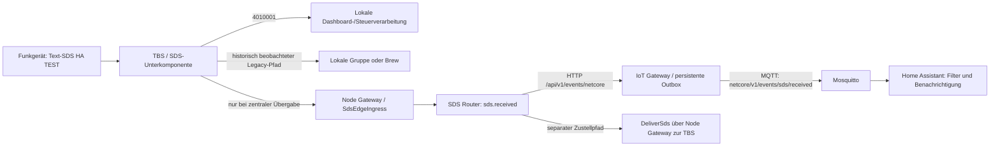
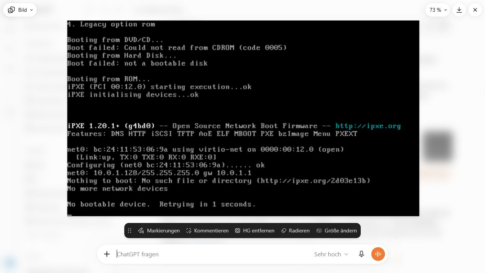
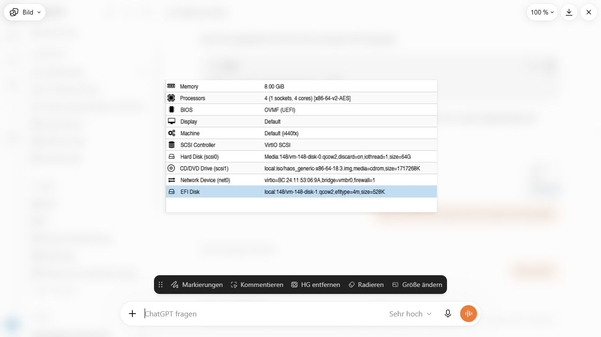
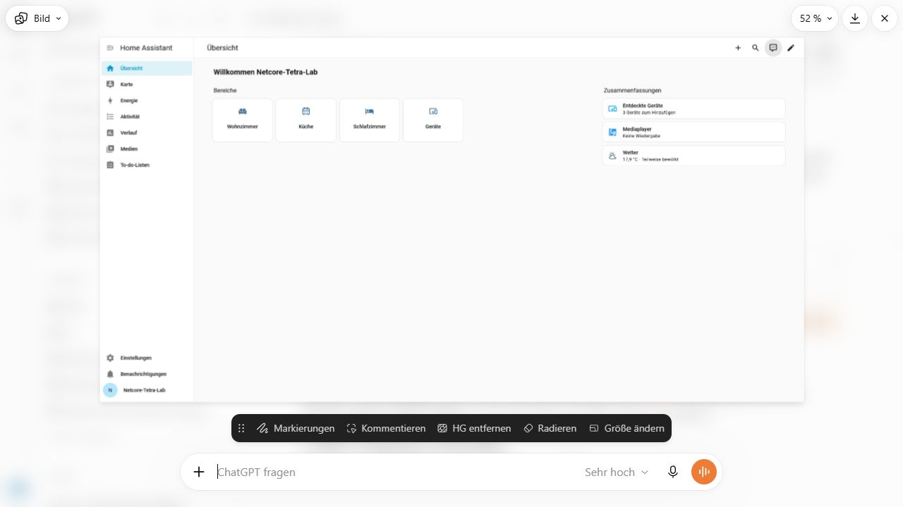
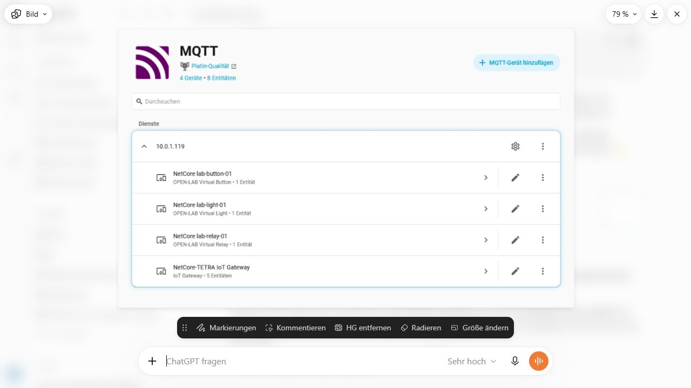
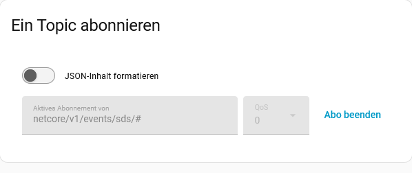
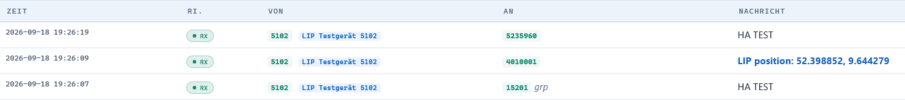
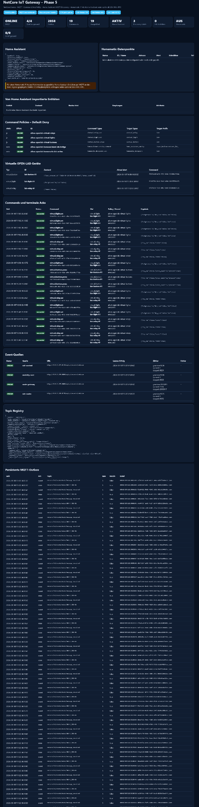

# Brainstorming: Home Assistant auf Proxmox, MQTT und SDS-Diagnose

**Archivhinweis, 09.10.2026:** Diese Datei dokumentiert das im Titel beziehungsweise Quellenrahmen genannte Gespräch und dessen damalige Entscheidungen. Historische Kommandos, Planungen, Versionsangaben und Fehlerbilder bleiben erhalten; der heutige technische Stand steht in der [Gesamtroadmap](../roadmaps/gesamtroadmap.md) und in den [aktuellen Dienstanleitungen](../services/README.md). Die Archivaufnahme bestätigt keine spätere Implementierung oder Live-Abnahme.

**Arbeitsstand:** 2026-10-05. Historische Betriebsbeobachtungen und der an diesem Datum geprüfte Repository-Stand sind getrennt ausgewiesen.

## 1. Arbeitsstand und Ergebnis

| Feld | Wert |
|---|---|
| Projekt | NetCore-Tetra |
| Historischer Arbeitszeitraum | 18.09.2026, 17:47–19:26 Uhr; VM-Einrichtung, MQTT-Anbindung und SDS-Diagnose, Zeiten gemäß den Betriebsaufzeichnungen |
| Archiv erstellt | 05.10.2026, Bezugszeitzone Europe/Berlin |
| Repository / ausschließlich bearbeiteter Branch | `JanHG98/netcore-tetra` / `Archiving` |
| Vor dem Schreiben lokal und remote geprüfter Basis-Commit | `8958a4120548dbe442b8b1ebd3847ab0dfadc92e` |
| Historischer, in der Planung genannter TBS-Build | `6a7cf58f`, beim Archivieren zu `6a7cf58fa40e15c676cc9349aa70f406282e605d` aufgelöst und als Git-Objekt erneut gelesen |
| Historischer Entwicklungsbranch | `mqtt`; am 05.10.2026 lieferte die gezielte Remote-Ref-Abfrage keinen Branch dieses Namens |
| Späterer relevanter Fix-Commit | `086a81fa8820ef579c475a65a38e3d23644c52f0` vom 27.09.2026; Änderung der CMCE-Befehlsweiterleitung im Diff nachgeprüft |
| Archivdatei | `Docs/archive/2026-10-05_home-assistant-proxmox-mqtt-sds-diagnose.md` |
| Bilder und Herkunftsnachweis | [Bildarchiv mit Prüfsummen](assets/2026-10-05_homeassistant-mqtt-sds/README.md) |

**Historischer Betriebsstand:** Home Assistant wurde in einer lokalen Proxmox-VM zum Laufen gebracht und mit dem bestehenden NetCore-MQTT-Broker verbunden. Die Geräteerkennung zeigte vier Geräte mit acht Entitäten. Eine Betriebsrückmeldung bestätigt den Empfang beim Abonnieren und fünf verbundene Zustandsanzeigen. Der anschließend begonnene Test „Funkgerät sendet `HA TEST` → automatische HA-Benachrichtigung“ blieb dagegen offen: SDS waren am TBS-Eingang sichtbar, der direkte HA-MQTT-Listener blieb leer.

**Repository-Befund vom Prüfdatum:** Die damalige Lücke bei `DeliverSds` ist im geprüften `Archiving`-Quellstand behoben. Der Sonderfall `4010001` und die Bedingungen für zentrale SDS-Übergabe bestehen weiterhin. Das belegt Quellcode, aber weder eine Aktualisierung der damaligen TBS noch einen am Prüfdatum funktionierenden Funk-zu-HA-Gesamtpfad.

Dieses Dokument ist ein technisches Archiv. Die darin wiedergegebenen Installations-, Test- und Diagnosebefehle wurden während der Quellenprüfung nicht auf Proxmox, HA, TBS oder LXC ausgeführt.

## 2. Quellenumfang, Nachweisgrenzen und Statusbegriffe

### 2.1 Quellenbasis

Erhalten sind VM-Planung und Bootfehler, MQTT-/Discovery-Einrichtung, Lab-Test, SDS-Diagnose, die korrigierte HA-Automation und die vorgeschlagenen Diagnoseprogramme. Sieben Originalbilder dokumentieren den Aufbau; drei sind als PNG-Originaldateien und vier als vollständige Ansichten der Bildvorschau gesichert. Der Repository-Abgleich bezieht sich auf den oben genannten Basiscommit und den späteren Fix `086a81f...`.

### 2.2 Offene Nachweise

Der Rohanhang **`Eingefügter Text.txt`** ließ sich am Prüfdatum nicht erneut laden. Seine vollständigen Daten und SHA-256 fehlen. Exakte Millisekunden-Logzeilen stammen deshalb aus einer erhaltenen damaligen Logauswertung; die Bildbelege bestätigen den Verlauf mit sekundengenauen Zeiten. Frühere interne Werkzeugausgaben und alternative Entwurfsstände sind nicht vollständig erhalten. Der aktive Host-/Gateway-Zustand wurde am Prüfdatum nicht erneut gemessen.

### 2.3 Verwendete Statusbegriffe

| Status | Bedeutung in diesem Archiv |
|---|---|
| **Idee** | Möglichkeit oder spätere Erweiterung, ohne verbindliche Umsetzung |
| **Beschlossen/geplant** | In der Planung festgelegter nächster Ablauf bzw. konkrete Empfehlung; Ausführung nicht automatisch belegt |
| **Implementiert** | Funktion im benannten Repository-Commit nachvollziehbar vorhanden |
| **Getestet** | Konkret benannter Versuch mit benanntem Ergebnis; Testumfang und Quelle bleiben angegeben |
| **Im Betrieb bestätigt** | Betriebsrückmeldung bzw. unmittelbar sichtbarer historischer Betriebsbeleg für genau die genannte Teilfunktion |
| **Offen / unbestätigt** | Ergebnis fehlt, Diagnose ist nur plausibel oder die aktuelle Installation wurde nicht überprüft |

Ein Quellcode-Test im Repository ist kein Nachweis, dass dieser Test während der Quellenprüfung ausgeführt wurde. Ein erfolgreicher MQTT-Verbindungsstatus beweist keinen SDS-Eingang und eine lokale Zustellannahme keine Empfangsbestätigung des Ziel-Funkgeräts.

## 3. Ziel, Ausgangslage und Abgrenzung

Ziel ist eine lokale VM für die MQTT-Anbindung des NetCore-Netzes. Die zunächst unklare Bezeichnung „Homematic Assistant“ wurde zu **Home Assistant** präzisiert. Homematic bzw. Homematic IP blieb eine mögliche spätere Integration; eine CCU-/RaspberryMatic-Installation oder die Inbetriebnahme physischer Homematic-Aktoren wurde für diesen Arbeitsstand nicht durchgeführt.

Der Zielaufbau verwendete:

- Home Assistant OS als eigene Proxmox-VM im vorhandenen LAN;
- den bereits vorgesehenen MQTT-Broker im IoT-Gateway-LXC `10.0.1.119:1883`;
- das NetCore-IoT-Gateway mit WebUI/API auf Port `8240`;
- Home-Assistant-MQTT-Discovery für Gateway, Quellenzustände und virtuelle Lab-Geräte;
- anschließend echte Text-SDS aus dem Funknetz als Auslöser einer HA-Benachrichtigung.

Es sollte kein zweiter Broker in Home Assistant installiert werden. Der erste SDS-Automationstest sollte ausschließlich eine Meldung anzeigen: keine physische Schaltaktion, keine automatische SDS-Antwort und zunächst keine eigene HA-Funkadresse.

## 4. Chronologischer Verlauf mit späteren Korrekturen

| Schritt | Historischer Inhalt | Ergebnis und Einordnung |
|---|---|---|
| 1. VM planen | Offizielles HAOS-KVM/QCOW2-Image, UEFI, LAN-Bridge, DHCP; vorhandenen NetCore-Broker verwenden | **Beschlossen/geplant**; Ressourcen zunächst Vorschlag |
| 2. VM bootet nicht | Konsole zeigt nicht bootfähige Platte und iPXE-Fallback | **Getestet: fehlgeschlagener Start**, Bild 1 |
| 3. Ursache konkretisieren | `.img` als Boot-ISO eingebunden; Hardwarebild zeigt CD-Laufwerk mit `haos_generic-x86-64-18.3.img` | **Durch Rückmeldung und Bild bestätigt**; reine Firmwarevermutung reicht nicht mehr |
| 4. Bestehende VM reparieren | VM `148`, Storage `Media`; HAOS-QCOW2 neu importieren und an `scsi2` anschließen; vorhandene `scsi0` erhalten | Konkreter Reparaturablauf; einzelne Befehlsausgaben fehlen |
| 5. HA läuft | Erreichbare HA-Übersicht nach Grundeinrichtung | **Im Betrieb bestätigt:** erreichbare HA-Oberfläche nach Grundeinrichtung |
| 6. MQTT und Discovery | Verbindung zu `10.0.1.119`; Bild zeigt vier NetCore-Geräte / acht Entitäten | **Im Betrieb bestätigt:** Discovery-Konfiguration in HA angekommen |
| 7. Lab-Test und Quellen | Zustandsempfang über MQTT-Abo und fünf verbundene Dienstanzeigen zurückgemeldet | **Im Betrieb bestätigt:** berichteter Zustandsempfang und fünf verbundene Anzeigen; kein physischer Aktortest |
| 8. Stand sichern / Dashboard | Backup `NetCore-HA-MQTT-Grundstand` und eigenes Dashboard vorgeschlagen | **Geplant**, Erstellung/Download nicht bestätigt |
| 9. Echte SDS als HA-Auslöser | Erste Testautomation mit fester Automation-ID | **Test begonnen**, kein Gesamterfolg belegt |
| 10. YAML-Editorfehler | „Nur Automationen in automations.yaml sind editierbar.“; Speichern war gar nicht möglich | Annahme einer bereits gespeicherten Automation **ausdrücklich korrigiert** |
| 11. Vollständige YAML-Korrektur | Neue UI-Automation ohne äußere `id:` und ohne `automation:`-Wrapper | **Bereitgestellt**, eigenständige positive Speicherbestätigung fehlt |
| 12. SDS an `4010001` | Keine Reaktion; Adresse ist lokale Dashboard-/Steueradresse | Historisch und aktuell im Code bestätigte Sonderbehandlung |
| 13. Test an andere Ziele | `HA TEST` von `5102` an Gruppe `15201` und Einzelziel `5235960`; HA weiterhin leer | TBS-Eingang sichtbar; zentraler Router-/MQTT-Pfad für diese Tests nicht nachgewiesen |
| 14. Abschließende Diagnose | Lokale Gruppenroute / Brew statt zentralem Ingress; `DeliverSds`-Dispatcher-Lücke; Outbox `2858` | Zwei getrennte Fehlerbereiche; keine abschließende Reparatur oder Messserie dokumentiert |

## 5. VM: Vorschlag, beobachtete Konfiguration und Reparatur

### 5.1 Ressourcen und Identitäten nicht miteinander vermischen

| Parameter | Frühe Empfehlung | Später tatsächlich sichtbarer Stand |
|---|---|---|
| VM-Name | `SRV-L-HA-01` | Name im Hardwareausschnitt nicht erkennbar |
| VM-ID | Nächste freie ID aus `pvesh get /cluster/nextid` | `148` über Disk-/EFI-Pfade und anschließende Anleitung zugeordnet |
| RAM | `4096 MiB`, fest, `balloon 0` | `8.00 GiB` im Hardwarebild |
| CPU | 2 virtuelle Kerne, `cpu host` | 4 Kerne, 1 Socket, `x86-64-v2-AES` |
| Machine | `q35` im Erstvorschlag | `Default (i440fx)` im Hardwarebild |
| Firmware | `OVMF`, UEFI; ohne Secure Boot geplant | `OVMF (UEFI)` sichtbar; Secure-Boot-Zustand nicht separat ausgelesen |
| SCSI | `virtio-scsi-single` im Erstvorschlag | `VirtIO SCSI` im Hardwarebild |
| Vorhandene Disk | 64 GB geplant | `scsi0`: `Media:148/vm-148-disk-0.qcow2`, `discard=on`, `iothread=1`, `size=64G` |
| Fehlerhaftes Medium | Kein ISO-Installationsweg vorgesehen | `scsi1` CD/DVD: `local:iso/haos_generic-x86-64-18.3.img`, `media=cdrom` |
| Netz | VirtIO an tatsächlicher LAN-Bridge | `bridge=vmbr0`, `firewall=1` im Hardwarebild |
| EFI | EFI-Disk, `efitype=4m`, `pre-enrolled-keys=0` vorgeschlagen | `local:148/vm-148-disk-1.qcow2`, `efitype=4m` sichtbar |
| HA-Adresse | `10.0.1.130` nur als freie Reserve-Adresse vorgeschlagen | `10.0.1.128` im iPXE-Bild; endgültige HA-Adresse nicht im laufenden HA-Bild sichtbar |
| HA-Name | `NetCore` vorgeschlagen | HA-Übersicht zeigt `Netcore-Tetra-Lab` |

Die iPXE-Adresse `10.0.1.128/24` mit Gateway `10.0.1.1` gehörte zum fehlgeschlagenen Netzwerkboot. Sie darf ohne weiteres Betriebszeugnis nicht als endgültige Home-Assistant-IP behandelt werden. Ebenso wurde eine DHCP-Reservierung empfohlen, aber nicht mit Ausgabe oder Screenshot bestätigt.

### 5.2 Diagnose und überholte Annahmen

Bild 1 zeigt unter anderem:

```text
Boot failed: Could not read from CDROM (code 0005)
Boot failed: not a bootable disk
iPXE ...
No bootable device. Retrying in 1 seconds.
```

Der erste Entwurf vermutete Legacy-/SeaBIOS und empfahl die Kontrolle von OVMF, EFI-Disk und Bootplatte. Das spätere Hardwarebild zeigt jedoch OVMF bereits aktiv und eine vorhandene EFI-Disk. Zusätzlich wurde der fehlerhafte `.img`-als-ISO-Weg bestätigt. Die konkrete Reparatur musste deshalb den **Festplattenimport** korrigieren; ein bloßes Aushängen des Mediums oder Umbenennen einer Dateiendung genügte nicht.

Es wurde festgelegt, die bisherige 64-GB-`scsi0` und die EFI-Disk zunächst zu erhalten. Ihr tatsächlicher Inhalt war unbekannt. Eine spätere Bereinigung wurde höchstens nach erfolgreichem Start in Aussicht gestellt; eine Löschung ist nicht belegt.

### 5.3 Historischer Ablauf auf dem Proxmox-Host

**Status: als Reparatur vorgeschlagen; anschließender HA-Betrieb sichtbar, konkrete Konsolenausgaben nicht erhalten. Nicht in dieser Quellenprüfung ausgeführt.**

1. VM `148` vollständig stoppen.
2. Bei `scsi1` „Kein Medium verwenden“ einstellen; bestehende Platten nicht entfernen.
3. Das offizielle HAOS-VM-Image `haos_ova-18.3.qcow2.xz` in ein neues temporäres Verzeichnis herunterladen, entpacken und prüfen.
4. Als **neue** Disk auf `Media` importieren.
5. Den neu entstandenen „Unused Disk“-Eintrag an `SCSI 2` anschließen.
6. Erst nach Sichtprüfung von `scsi2` die Größe und Bootreihenfolge setzen und starten.

Wichtiger historischer Importblock, inhaltlich auf die entscheidenden Befehle gekürzt:

```bash
(
  set -euo pipefail
  VMID=148
  STORAGE="Media"
  test "$(qm status "$VMID")" = "status: stopped"
  WORKDIR="$(mktemp -d /var/tmp/haos-vm148.XXXXXX)"
  cd "$WORKDIR"

  curl -fL --retry 3 \
    "https://github.com/home-assistant/operating-system/releases/download/18.3/haos_ova-18.3.qcow2.xz" \
    -o haos.qcow2.xz
  xz --decompress --keep haos.qcow2.xz
  qemu-img info haos.qcow2
  qm importdisk "$VMID" "$WORKDIR/haos.qcow2" "$STORAGE" --format qcow2
  qm config "$VMID"
)
```

**Separater Folgeschritt erst nach Anschluss der importierten Disk als `scsi2`:**

```bash
qm disk resize 148 scsi2 64G &&
qm set 148 --boot "order=scsi2" &&
qm start 148
```

`18.3` ist der im damaligen Ablauf verwendete Versionsstand, keine Aussage zur neuesten HAOS-Version am Archivdatum. Der allgemeine Erstentwurf hatte stattdessen die Version aus `https://version.home-assistant.io/stable.json`, Feld `hassos.ova`, gelesen und einen direkten `qm create ... --scsi0 "...import-from=..."`-Neuanlageweg vorgesehen. Für die schon vorhandene VM wurde dieser durch den erhaltenden `scsi2`-Import ersetzt.

Weitere vorgeschlagene Prüfungen waren `pvesm status --content images`, `ip -br link show type bridge`, `command -v curl python3 xz qemu-img`, `qm list` und `qm config`. Die tatsächlichen Ergebnisse dieser einzelnen Prüfungen sind nicht überliefert. Bridge, VLAN und bestehende Firewall sollten zum LAN passen; Internet-Portweiterleitung war nicht Teil des Plans.

## 6. MQTT-Grundanbindung und tatsächlich bestätigte Teilfunktionen

### 6.1 Verbindungsdaten des historischen Open-Lab-Aufbaus

| Zweck | Host / Parameter |
|---|---|
| MQTT-Broker für HA | `10.0.1.119`, TCP `1883` |
| Gateway-WebUI/API | `http://10.0.1.119:8240` |
| HA-WebUI | `http://<tatsächliche-HA-IP>:8123` |
| Broker-Feld in HA | Nur Host/IP; weder `http://` noch API-Port `8240` |
| MQTT-Discovery | Aktiv, Präfix `homeassistant` |
| Client-ID | Automatisch erzeugen lassen |
| Historische Broker-Sicherheit | Anonym / ohne TLS ausschließlich als vorhandener isolierter Open-Lab-Stand beschrieben; bestehende Absicherung sollte nicht abgeschaltet werden |
| Zusätzlicher HA-Mosquitto | Nicht vorgesehen |

Die Anleitung trennte vier Ausführungsorte: VM-Verwaltung auf dem Proxmox-Host, MQTT-Dienstprüfungen im IoT-LXC, TBS-Konfiguration auf `SRV-M-TBS-01` und MQTT-/Automationseinstellungen in der HA-Oberfläche.

Als Prüfungen im IoT-LXC wurden vorgeschlagen:

```bash
systemctl is-active mosquitto
systemctl is-active netcore-iot-gateway
ss -lntp | grep ':1883'
curl -fsS http://127.0.0.1:8240/api/v1/home-assistant
```

Optional vom Windows-Rechner:

```powershell
Test-NetConnection 10.0.1.119 -Port 1883
```

Ein Listener ausschließlich auf `127.0.0.1:1883` wäre für eine andere VM nicht erreichbar. Eine `404` am HA-spezifischen Gateway-Endpunkt sollte zunächst zur Prüfung der installierten Gateway-Version führen. Diese Kontrollen waren vorgeschlagen; die später funktionierende HA-Anbindung ersetzt keine gespeicherte Ausgabe jeder Einzelprüfung.

### 6.2 Testtopics, Discovery und virtuelles Relais

| Test | Vorgabe / erwarteter Inhalt | Beleggrenze |
|---|---|---|
| Einfacher Broker-Echo-Test | Lauschen `netcore/test/#`, veröffentlichen `netcore/test/homeassistant` mit `Hallo von Home Assistant`; QoS 0, Retain aus | Prüft HA ↔ Broker, nicht Funk oder Gateway-Ereigniserzeugung |
| Allgemeiner NetCore-Empfang | `netcore/v1/#` | Breite Beobachtung empfohlen |
| Discovery-Beobachtung | `homeassistant/#` | Vorhandene/retained Konfiguration kann sofort erscheinen |
| Relaiszustand | `netcore/v1/state/virtual_relays/lab-relay-01`; `{"state":{"state":true}}` bzw. `false` | Neue Rückmeldungen nach Ein/Aus von bereits retained Startwerten unterscheiden |
| Discovery erneut auslösen | `POST /api/v1/actions/home-assistant-discovery` auf Port 8240 | Nur bei fehlenden Geräten vorgeschlagen; tatsächlicher POST nicht einzeln belegt |

Historischer optionaler Discovery-Aufruf:

```bash
curl -fsS --max-time 15 -X POST \
  http://127.0.0.1:8240/api/v1/actions/home-assistant-discovery
```

Bild 4 zeigt vier Geräte:

- `NetCore lab-button-01`: eine Entität;
- `NetCore lab-light-01`: eine Entität;
- `NetCore lab-relay-01`: eine Entität;
- `NetCore-TETRA IoT Gateway`: fünf Entitäten.

Die fünf Verbindungsanzeigen wurden in der Planung als Gateway-Verfügbarkeit plus Node Gateway, Mobility Core, Call Control und SDS Router erklärt. Die Betriebsrückmeldung des Abos und aller fünf verbundenen Anzeigen ist ein positiver Betriebsbeleg für diesen Teil des Aufbaus. Vollständige MQTT-Payloads, eine lückenlose Ein-/Aus-Messreihe und ein physischer Relaisausgang wurden nicht dokumentiert.

### 6.3 Sicherung und Bedienoberfläche

Nach dem Grundtest wurden vorgeschlagen:

1. HA-Backup `NetCore-HA-MQTT-Grundstand` erstellen, herunterladen und außerhalb der VM auf Rechner/NAS sichern; gegebenenfalls das angebotene Backup-Notfallkit separat aufbewahren.
2. Ein eigenes Dashboard `NetCore-TETRA` mit Funkturm-Symbol und Seitenleisteneintrag anlegen.
3. Zwei Entitätenkarten: `NetCore-Verbindungen` mit fünf Sensoren und `Lab-Testgeräte` mit Relais, Licht und Taster.
4. Tatsächliche Entitäts-IDs aus der Auswahl verwenden, statt sie zu erraten oder unnötig umzubenennen.

**Status: vorgeschlagen.** Weder fertiges Dashboard noch vorhandene heruntergeladene Sicherung sind bestätigt.

## 7. SDS-Zielarchitektur und Schnittstellen



Das Ereignis `sds.received` bedeutet Eingang am zentralen Router. Es ist keine Bestätigung der Zustellung an das zweite Funkgerät. Auch `SdsDeliveryResponse` bestätigt im aktuellen CMCE-Pfad zunächst nur die Annahme zur lokalen Funkzustellung.

### 7.1 Vertrag der HA-Testautomation

| Feld / Verhalten | Endgültiger historischer Wert |
|---|---|
| Trigger-Topic | `netcore/v1/events/sds/received` |
| Trigger-QoS | `1` |
| `schema` | `netcore-event-v1` |
| `event_type` | `sds.received` |
| `source.service` | `netcore-sds-router` |
| `payload.sds_type` | Zahl `4`, kein vorcodierter Status |
| Textvergleich | `payload.text` als String, Whitespace entfernen, Großschreibung → `HA TEST` |
| Altersfenster | `-5 <= age <= 60` Sekunden; fünf Sekunden zukünftige Abweichung toleriert |
| Ziel-ISSI-Filter | Keiner |
| Aktion | `persistent_notification.create` |
| Benachrichtigungs-ID | `netcore_sds_test`; Folgetests aktualisieren dieselbe Meldung |
| Modus / Warteschlange | `mode: queued`, `max: 10` |
| Aufbewahrte Traces | `stored_traces: 10` |

Home Assistant beobachtet hier den zentralen Ereignisstrom. Eine eigene Funk-ISSI für HA ist für diesen Test nicht erforderlich. Eine separate Diensteadresse für eine später direkt adressierbare Anwendung blieb eine **Idee**, ohne vergebene Nummer oder implementierten Dienst.

## 8. YAML-Fehler und endgültiger historischer Automationsblock

Der erste YAML-Entwurf setzte `id: netcore_sds_ha_test_v1`. Bei „Nur Automationen in automations.yaml sind editierbar.“ wurde zunächst eine ID-/Editor-Zuordnungsabweichung vermutet und Neuladen beziehungsweise Öffnen einer bereits gespeicherten Automation erwogen.

Der entscheidende spätere Befund: **Speichern war überhaupt nicht möglich.** Deshalb ist die Annahme einer schon gespeicherten Automation überholt. Die genaue interne Fehlerursache wurde im verfügbaren Verlauf nicht durch HA-Logs oder eine Live-Prüfung bewiesen. „Feste ID war wahrscheinlich der Auslöser“ bleibt eine historische Diagnosehypothese, keine allgemein gültige Erklärung jeder gleichlautenden HA-Meldung.

Die abschließende Anleitung verlangte eine neue Automation über den Editor der **gesamten** Automation, mit folgendem vollständigen Inhalt, **ohne zusätzliches `id:` und ohne `automation:`-Wrapper**. Die feste `notification_id` innerhalb der Aktion bleibt erhalten.

**Status: in der Planung bereitgestellt; erfolgreiche Speicherung und automatische SDS-Auslösung nicht gesondert bestätigt. Der korrigierte YAML-Entwurf ist unverändert erhalten.**

```yaml
alias: "NetCore – SDS-Test empfangen"
description: >-
  Zeigt eine Benachrichtigung in Home Assistant, wenn eine aktuelle
  Text-SDS mit dem Inhalt HA TEST über das NetCore-IoT-Gateway ankommt.
  Keine Schaltaktion und keine automatische SDS-Antwort.

triggers:
  - trigger: mqtt
    topic: "netcore/v1/events/sds/received"
    qos: 1

conditions:
  - alias: "Passendes NetCore-Ereignis mit dem Text HA TEST"
    condition: template
    value_template: >-
      
        
      
        
      
      
        
        
        {{
          e.get('schema') == 'netcore-event-v1'
          and e.get('event_type') == 'sds.received'
          and s is mapping
          and s.get('service') == 'netcore-sds-router'
          and p is mapping
          and p.get('sds_type') == 4
          and (p.get('text', '') | string | trim | upper) == 'HA TEST'
        }}
      
        {{ false }}
      

  - alias: "Ereignis ist höchstens 60 Sekunden alt"
    condition: template
    value_template: >-
      
        
      
        
      
      
        
        
        {{ ts > 0 and -5 <= age <= 60 }}
      
        {{ false }}
      

actions:
  - alias: "SDS-Empfang in Home Assistant anzeigen"
    action: persistent_notification.create
    data:
      title: "NetCore: SDS-Test empfangen"
      notification_id: "netcore_sds_test"
      message: |-
        **SDS-Text:** {{ trigger.payload_json.payload.text }}

        **Absender-ISSI:** {{ trigger.payload_json.payload.get('source_issi', 'nicht angegeben') }}
        **Ziel-ISSI:** {{ trigger.payload_json.payload.get('dest_issi', 'nicht angegeben') }}
        **TBS:** {{ trigger.payload_json.source.get('node_id') | default('nicht angegeben', true) }}

        **Ereignis-ID:** {{ trigger.payload_json.get('event_id', 'nicht angegeben') }}
        **Ereigniszeit:** {{ trigger.payload_json.timestamp }}
        **In Home Assistant angekommen:** {{ now().strftime('%d.%m.%Y %H:%M:%S') }}

        Empfangstest – keine Schaltaktion und keine SDS-Antwort.

mode: queued
max: 10

trace:
  stored_traces: 10
```

Nicht mit „Aktionen ausführen“ als Funk-/MQTT-Test verwechseln: Der Nachrichtentext benötigt die echten MQTT-Triggerdaten. Bei vorhandenem MQTT-Ereignis, aber ausbleibender Meldung sollten die Traces zeigen, welche Bedingung oder Aktion stoppt.

Der 60-Sekunden-Filter ist zugleich für die Outbox-Diagnose relevant: Ein verspätet eintreffendes, ansonsten korrektes Ereignis kann im Listener sichtbar sein und dennoch bewusst keine Benachrichtigung mehr erzeugen. Auch Uhrzeitabweichungen von HA, Router und Gateway sind deshalb zu prüfen.

### 8.1 Historischer lokaler Vorabtest einer Zwischenfassung

Im Browser war zusätzlich eine historische Python-Toolausführung mit PyYAML und Jinja2 samt Ausgabe zugänglich. Sie prüfte **eine Zwischenfassung**, nicht den oben archivierten endgültigen YAML-Block: Der Entwurf verwendete noch ein Altersmaximum von **120 Sekunden**, eine andere Textprüfung und einen anderen Meldungstext. Die spätere ausdrückliche Anleitung mit 60 Sekunden und dem vollständig korrigierten Block hat Vorrang.

| Synthetischer Testfall | Sichtbare Auswertung der Bedingungen |
|---|---|
| Passendes aktuelles Ereignis | `True, True` |
| Leeres Objekt | `False` |
| `None` | `False` |
| Leere Liste | `False` |
| `payload: None` | `False` |
| Anderer Nachrichtentext | `False` |
| Falscher Service `netcore-node-gateway` | `False` |
| Alter Zeitstempel `2000-01-01T00:00:00Z` | `True, False` |

Die Ausgabe renderte außerdem den synthetischen Benachrichtigungstext mit `HA TEST`, Test-ISSIs `1001`/`1002`, `TEST-TBS` und `test-event`. **Getestet war damit eine lokale YAML-/Template-Zwischenfassung mit acht synthetischen Fällen.** Dies belegt weder das Speichern in der HA-Oberfläche noch einen echten MQTT-Trigger, die unverändert finale Vorlage oder einen Funk-zu-HA-Durchlauf. Der Test wurde beim Archivieren nicht erneut ausgeführt.

## 9. Fehlerdiagnose am historischen SDS-Pfad

### 9.1 Systemadresse 4010001

Im historischen und im aktuellen geprüften `sds_bs.rs` steht:

```rust
const DASHBOARD_ISSI: u32 = 4010001;
```

Der Empfangspfad protokolliert SDS und behandelt lokale Protokollfälle. Nachrichten an diese Dashboard-/Steueradresse werden vor der gewöhnlichen zentralen Weitergabe lokal absorbiert. Im Statuspfad existiert ebenfalls eine lokale Sonderbehandlung dieser Adresse.

Daraus folgt für den beschriebenen Test:

- Ein TBS-SDS-Logeintrag an `4010001` beweist keinen Routereingang.
- Das Aktivieren von zentralem Routing beseitigt den früheren lokalen Rücksprung nicht.
- Der Rücksprung sollte nicht für einen HA-Test entfernt werden.
- Als Testziel sollte eine reale, bereits funktionierende eigene Gegenstelle dienen; keine erfundene ISSI.

### 9.2 Spätere Tests an Gruppe und Einzelziel

Bild 6 belegt am TBS-Eingang:

| Zeit im Screenshot am 18.09.2026 | Quelle | Ziel | Inhalt / Einordnung |
|---|---|---|---|
| 19:26:07 | `5102` | `15201`, `grp` | `HA TEST`, Gruppen-SDS |
| 19:26:09 | `5102` | `4010001` | LIP-Positionsmeldung; keine passende `HA TEST`-Text-SDS |
| 19:26:19 | `5102` | `5235960` | `HA TEST`, Einzelziel |

Die in der Planung zitierten Rohlogstellen lauten:

```text
19:26:07.938  SDS: U-SDS-DATA from ISSI 5102 to ISSI 15201
19:26:07.938  SDS: group delivery: 5102 -> GSSI 15201

19:26:19.952  SDS: U-SDS-DATA from ISSI 5102 to ISSI 5235960
19:26:19.952  SDS: forwarding to Brew: 5102 -> 5235960
```

**Quellenstatus:** Diese genauen Millisekunden-Zeilen stammen aus der erhaltenen frühere Ausarbeitung über den damals gelesenen Textanhang; der Rohanhang selbst ließ sich beim Archivieren nicht laden. Der Bildbeleg bestätigt die Eingangsnachrichten mit sekundengenauen Zeiten.

Der historische Quellcode ordnet die lokale Gruppenroute dem Legacy-Pfad zu. Bei gesunder zentraler Übergabe wären die Meldung `SDS: central handoff ...` und `TelemetryEvent::SdsEdgeIngress` zu erwarten. Die erhaltenen Logzitate stützen daher die Diagnose, dass diese beiden Tests nicht den von der Automation vorausgesetzten zentralen Ingress nutzten.

Das zeigt eine Weiterleitungsentscheidung der TBS, **keinen belegten Empfang am Zielgerät**. Die historische Formulierung „funktionierender lokaler/Brew-Zustellweg“ ist entsprechend auf den beobachteten Verarbeitungsweg zu begrenzen.

### 9.3 Fallback und fehlende DeliverSds-Weiterleitung

Die überlieferte Logauswertung nennt `19:25:43` als Rückkehr der TBS nach `Online`, also vor den Tests. Auch diese Zeit stammt aus der damaligen Logauswertung. Eine anfängliche Fallback-Meldung erklärt damit die späteren Tests nicht ohne Weiteres.

Die erneut gelesenen historischen Dateien zeigen:

- `central_sds_routing_configured()` verlangt `control_room.enabled && control_room.central_sds_routing`.
- `central_sds_routing_enabled()` verlangt zusätzlich `central_service_available("sds-router")`.
- Die SDS-Unterkomponente kennt `ControlCommand::DeliverSds`.
- Der damalige Dispatcher `CmceBs::do_control_command` hat jedoch keinen entsprechenden Match-Arm. Er leitet `SendSds` und `SendRawSdsType4` weiter und protokolliert sonst nicht unterstützte Befehle.

Die damalige Empfehlung, **nicht blind `central_sds_routing` einzuschalten, nicht die TBS neu zu bauen und HA vorerst unverändert zu lassen**, war daher die zuletzt festgelegte Vorgehensweise. Zunächst sollten aktive Konfiguration und Outbox-Fortschritt gelesen werden.

Die exakte aktive Konfigurationsdatei wurde nicht als Ergebnis zurückgemeldet. Es ist daher nicht belegt, welches der beiden Konfigurationsfelder konkret aus war oder ob die im Befehl angenommene Datei tatsächlich die Laufzeitdatei war. Die Legacy-Logpfade sind ein starkes Indiz für die effektive Routingentscheidung, ersetzen aber keinen Konfigurationsauszug.

## 10. Outbox: zweiter, getrennt zu untersuchender Befund

Bild 7 zeigt das Gateway als MQTT-`ONLINE`, vier von vier Quellen online und **`2858` Outbox-Einträge**. Darüber hinaus sind unter anderem 19 Commands, 19 ausgeführt, drei virtuelle Geräte und keine aktivierte reale Homematic-Schreibfunktion sichtbar. Das bestätigt eine historische UI-Momentaufnahme.

`outbox_pending` ist die Anzahl ausstehender Veröffentlichungen. Es ist weder die Anzahl schon erfolgreich versendeter Ereignisse noch allein ein Beweis für einen festhängenden Versand. Der aktuelle Code führt dafür `events_enqueued`, `events_published` und `broker_publish_acks` getrennt.

| Beobachtung aus zwei Messungen | Bedeutung |
|---|---|
| Veröffentlichungen und Broker-Bestätigungen steigen | Versand macht Fortschritt |
| Outbox wächst trotz steigender Bestätigungen | Eingang kann schneller sein als Abarbeitung |
| Gefüllte Outbox, keine neuen Veröffentlichungen/Bestätigungen | Versandpfad, Fehler und Wiederverbindung gezielt untersuchen |
| `started_at` ändert sich | Zwischenzeitlicher Neustart; einfache Zählerdifferenzen nicht als Durchsatz verwenden |
| MQTT-Ereignis kommt verspätet an | HA-Altersfilter kann es trotz Empfang verwerfen |

Ein gesunder Quellen-Poll kann im geprüften `poller.rs` auch bei einem leeren Eventarray erfolgreich sein. Deshalb bedeutet „fünf verbunden“ nicht „die konkrete SDS ist im Router angekommen“. Ebenso zeigt das kleine HA-Listenerbild ein aktives Abo auf `netcore/v1/events/sds/#` mit UI-QoS 0, aber keine angezeigte Nachricht. Diese UI-QoS-Einstellung ist von der QoS-1-Vorgabe der Automation zu unterscheiden; sie erklärt für sich allein kein vollständig fehlendes Ereignis.

**Offen:** Es liegen keine Resultate der verlangten Vorher-/Nachher-Messung vor. Eine konkrete Outbox-Ursache oder erfolgreiche Behebung wurde nicht nachgewiesen.

## 11. Letzte vereinbarte Diagnosebefehle

Die folgenden zwei Blöcke sind aus der abschließenden historischen Ausarbeitung übernommen. **Sie waren vorgeschlagen; im verfügbaren Verlauf ist keine Ausführung mit Ergebnis dokumentiert.** Die Archivierung hat sie nicht gegen die realen Zielsysteme ausgeführt.

### 11.1 A: relevante Konfiguration auf SRV-M-TBS-01 lesen

Der historische Pfad war `/opt/netcore-tetra/config.toml`. Für eine Fortsetzung zuerst prüfen, ob der aktive Dienst wirklich diese Datei benutzt. Der Block benötigt `tomllib`, also eine geeignete Python-Version; eine damalige Ausgabe dazu liegt nicht vor.

```bash
cd /opt/netcore-tetra

python3 - <<'PY'
import json
import sys
import tomllib
from pathlib import Path

path = Path("/opt/netcore-tetra/config.toml")

try:
    with path.open("rb") as f:
        config = tomllib.load(f)
    control = config.get("control_room", {})
    if not isinstance(control, dict):
        raise ValueError("[control_room] ist keine gültige TOML-Tabelle.")
except (OSError, ValueError) as exc:
    sys.exit(f"Konfiguration konnte nicht gelesen werden: {exc}")

print(json.dumps({
    "config_datei": str(path),
    "control_room_enabled": control.get("enabled", False),
    "central_sds_routing": control.get("central_sds_routing", False),
    "node_id": control.get("node_id"),
}, indent=2, ensure_ascii=False))
PY
```

### 11.2 B: MQTT-Fortschritt im IoT-Gateway-LXC lesen

Der Loopback-Endpunkt gilt nur innerhalb des Gateway-LXC und bei passendem tatsächlichem Bind. Sollte die Installation nur an ihrer LAN-Adresse lauschen, ist der reale Bind zu verwenden. Das ist eine Ausführungsbedingung, kein bereits beobachteter Fehler dieser Planung.

```bash
python3 - <<'PY'
import json
import sys
import time
from urllib.request import urlopen

BASE = "http://127.0.0.1:8240"

def get_json(path):
    with urlopen(BASE + path, timeout=10) as response:
        return json.load(response)

keys = (
    "started_at",
    "mqtt_host",
    "mqtt_port",
    "mqtt_connected",
    "mqtt_last_error",
    "mqtt_reconnects",
    "outbox_pending",
    "events_enqueued",
    "events_published",
    "broker_publish_acks",
    "invalid_events",
    "last_poll_at",
)

try:
    samples = []

    for number in (1, 2):
        status = get_json("/api/v1/status")
        samples.append(status)

        print(f"\n=== MQTT/OUTBOX: MESSUNG {number} ===", flush=True)
        print(json.dumps(
            {key: status.get(key) for key in keys},
            indent=2,
            ensure_ascii=False,
        ), flush=True)

        if number == 1:
            print("\nWarte 10 Sekunden ...", flush=True)
            time.sleep(10)

    before, after = samples

    print("\n=== VERÄNDERUNG ===", flush=True)
    if before.get("started_at") != after.get("started_at"):
        print("Gateway wurde zwischen den Messungen neu gestartet.")
    else:
        for key in (
            "outbox_pending",
            "events_enqueued",
            "events_published",
            "broker_publish_acks",
        ):
            old, new = before.get(key), after.get(key)
            if isinstance(old, int) and isinstance(new, int):
                print(f"{key}: {new - old:+d}")

    print("\n=== LETZTE 10 GATEWAY-EREIGNISSE ===", flush=True)
    print(json.dumps(
        get_json("/api/v1/events?limit=10"),
        indent=2,
        ensure_ascii=False,
    ))

except Exception as exc:
    sys.exit(f"Diagnose abgebrochen: {type(exc).__name__}: {exc}")
PY
```

Die Blöcke enthalten keine Zugangsdaten und ändern weder Konfiguration noch Warteschlange. Ereignisantworten können betriebliche Nutzdaten enthalten; in ein späteres Archiv gehören nur für die Diagnose erforderliche und auf Zugangsdaten geprüfte Auszüge.

## 12. Abgleich mit dem aktuellen Repository

Alle folgenden Aussagen beziehen sich auf **`Archiving@8958a4120548dbe442b8b1ebd3847ab0dfadc92e`**, gelesen am 05.10.2026. Sie werden nicht rückwirkend dem Betriebsstand vom 18.09.2026 zugeschrieben.

| Prüfpunkt | Historischer Stand / historischer Befund | Geprüfter Quellbefund | Konsequenz |
|---|---|---|---|
| `DeliverSds` im CMCE-Dispatcher | In `6a7cf58f` fehlend | Match-Arm in `crates/tetra-entities/src/cmce/cmce_bs.rs` vorhanden; Weitergabe an `sds.rx_sds_from_control` und `SdsDeliveryResponse` | Die konkrete Quellcode-Lücke ist inzwischen behoben; installierte TBS-Version bleibt unbekannt |
| Herkunft dieser Änderung | Im historischen Arbeitsstand noch nicht vorhanden | Diff von `086a81f^` nach `086a81f` enthält diese Ergänzung einschließlich Tests | Zeitliche Zuordnung zum späteren 27.09.-Stand belegt |
| Bestätigungssemantik | Gefahr beschädigter Rückzustellung bei blindem Umschalten | Kommentar grenzt lokale Annahme ausdrücklich von MS-Empfangsbestätigung ab | Kein On-Air-Erfolg allein aus positiver Response ableiten |
| `4010001` | Lokale Steuer-/Dashboardadresse | Konstante und lokaler Rücksprung weiter vorhanden | Für diesen zentralen Beobachtertest weiterhin ungeeignet |
| Zentrales Routing | Konfigurationsflags und Verfügbarkeit relevant | `enabled && central_sds_routing` plus SDS-Serviceverfügbarkeit weiterhin erforderlich | Tatsächliche Laufzeitkonfiguration und Health separat erheben |
| Router-Ereignis | `sds.received` erwartet | `message_ingress` wird auf `SDS_RECEIVED` abgebildet; Vertrag definiert `sds.received` | Erwarteter Eventtyp ist im aktuellen Code vorhanden |
| Payload | Typ, Text, Quell-/Ziel-ISSI | In `sds-router/src/state.rs` werden `source_issi`, `dest_issi`, `group`, `sds_type`, `protocol_id`, `status_code`, `len_bits` und `text` übernommen | HA-Feldannahmen sind nachvollziehbar; konkrete Funkdekodierung weiterhin testen |
| Source | `netcore-sds-router`, Node-ID | Gemeinsames Event wird mit dieser Servicekennung und ggf. Node-ID gebaut | Servicefilter der Automation passt zum Code |
| MQTT-Topic | `netcore/v1/events/sds/received` | Gateway ersetzt Punkte im `event_type` durch Schrägstriche unter `<prefix>/events/` | Topicbildung bestätigt |
| Outbox | Einzelbild mit `2858` | Persistente Queue; Abschluss nach erfolgreichem Publish; getrennte Statuszähler | Belegt Messbarkeit, nicht Lösung des historischen Rückstaus |
| Quellenhealth | Fünf verbundene HA-Anzeigen | Poller markiert erfolgreiche HTTP-/JSON-Abfrage auch ohne neue Ereignisse als Erfolg | Health ist kein konkreter SDS-Durchlauf |
| HA-/Homematic-Funktionen | Discovery und Lab-Funktionen benutzt | Phase-5-Konfiguration, Discovery, State-Ingress, Policies und optional XML-RPC vorhanden | Reale Aktoren oder CCU im historischen Betrieb weiterhin unbestätigt |

Im Dispatcher liegen unter anderem Tests mit den Namen `central_sds_dispatch_preserves_payload_and_destination_on_radio_path` und `invalid_central_sds_payload_reports_failure_without_radio_delivery`. **Vorhandensein und Inhalt wurden gelesen; diese Rust-Tests wurden für die Quellenprüfung nicht ausgeführt.**

Der aktuelle Gateway-README beschreibt weiterhin den Open-Lab-Betrieb ohne WebUI-Login, API-Tokens, MQTT-Credentials oder TLS. Das ist die dokumentierte Beispielkonfiguration, keine Zusicherung über jede Installation und keine Bestätigung geprüfter Netzabsicherung.

## 13. Dateien, Dienste, Ports und Parameter für die Fortsetzung

### 13.1 Repository-Dateien

| Pfad relativ zur Repository-Wurzel | Rolle |
|---|---|
| `crates/tetra-entities/src/cmce/cmce_bs.rs` | Übergeordnete ControlCommand-Verteilung, aktuelle `DeliverSds`-Weiterleitung und Tests |
| `crates/tetra-entities/src/cmce/subentities/sds_bs.rs` | Dashboard-Adresse, SDS-Ingress, lokales/zentral-/Fallback-Routing und Funkzustellung |
| `system-backend/sds-router/src/state.rs` | `SdsEdgeIngress` verarbeiten, Nachrichtenzustand und gemeinsames Ereignis erzeugen |
| `system-backend/sds-router/src/http.rs` | Router-API und Eventausgabe |
| `system-backend/shared/contracts/src/event.rs` | `netcore-event-v1` und `SDS_RECEIVED` |
| `system-backend/iot-gateway/src/state.rs` | Eventvalidierung, Dedup, Topicbildung, Outbox und Statuszähler |
| `system-backend/iot-gateway/src/mqtt.rs` | Brokerverbindung und persistente Veröffentlichung |
| `system-backend/iot-gateway/src/poller.rs` | Quellen-HTTP-Polling und Health |
| `system-backend/iot-gateway/src/http.rs` | API-, Diagnose- und Discovery-Aktionen |
| `system-backend/iot-gateway/config/iot-gateway.example.toml` | Dokumentierte aktuelle Defaults und erlaubte Lab-Ziele |
| `system-backend/iot-gateway/systemd/netcore-iot-gateway.service` | Benutzer, Binary, Config und beschreibbarer State-Pfad |
| `system-backend/iot-gateway/docs/mqtt-contract.md` | Topicfamilien und Retain-Verhalten |
| `system-backend/iot-gateway/README.md` | Architektur, HA/Homematic, Persistenz und Updateweg |
| `Docs/MQTT_PHASE5_HOME_ASSISTANT_HOMEMATIC_OPENLAB.md` | Weiterführende Phase-5-Dokumentation; kein historischer Abnahmebeleg |

### 13.2 Dienste, Laufzeitpfade und Endpunkte

| Komponente | Pfad / Port / Schnittstelle | Quellenstatus |
|---|---|---|
| TBS | `SRV-M-TBS-01`; angenommene Config `/opt/netcore-tetra/config.toml` | Historischer Diagnosevorschlag; aktive Unit und Config prüfen |
| MQTT | `mosquitto`, TCP `1883` auf Gateway-LXC `10.0.1.119` | Historisch eingerichtete HA-Verbindung |
| IoT Gateway | `netcore-iot-gateway.service`; HTTP `8240` | Historischer UI-Beleg und aktueller Code |
| Gateway-Binary | `/usr/local/bin/netcore-iot-gateway` | Aktuelle systemd-Datei |
| Gateway-Konfiguration | `/etc/netcore/iot-gateway.toml` | Aktuelle systemd-Datei |
| Gateway-Servicebenutzer | `netcore-iot-gateway` | Aktuelle systemd-Datei; kein Passwort |
| Status / Ereignisse | `GET /api/v1/status`, `GET /api/v1/events?limit=10` | Im aktuellen HTTP-Router vorhanden |
| HA-Integration | `GET /api/v1/home-assistant`, `GET /api/v1/home-assistant/entities` | Im aktuellen HTTP-Router vorhanden |
| Discovery | `POST /api/v1/actions/home-assistant-discovery` | Aktion, nicht bloße Statusabfrage |
| Eventquellen | `/api/v1/events/netcore` auf Node Gateway `8080`, Mobility Core `8090`, Call Control `8120`, SDS Router `8150` | Aktuelle Gateway-Beispielkonfiguration; Hostnamen sind Beispiele |
| HA | HTTP `8123`; Automationen im UI / `automations.yaml` | Historische Anleitung und sichtbare HA-Oberfläche |
| Optionale CCU/HmIP-Schnittstelle | XML-RPC, Beispielport `2010` | Aktuelle Beispielkonfiguration, historisch nicht in Betrieb belegt |

Für die SDS-Router-IP fehlt eine gesicherte Erhebung in diesem historischen Aufbau. Die jeweilige Source-URL muss aus der tatsächlich aktiven Gateway-Konfiguration stammen.

### 13.3 Aktuelle Beispielparameter, ausdrücklich keine erhobene Live-Konfiguration

- MQTT: `topic_prefix="netcore/v1"`, `qos=1`, `event_retain=false`, `state_retain=true`, `clean_session=false`; Keepalive 30 s, Reconnect 3 s, Publish-Timeout 8 s.
- Polling: Intervall 2000 ms, Batch-Limit 500, Request-Timeout 2500 ms.
- Persistenz: `state_dir="/var/lib/netcore-iot-gateway"`, `outbox_limit=20000`, `dedup_limit=50000`.
- Discovery: aktiviert, Präfix `homeassistant`, QoS 1, retained; erneute Veröffentlichung nach `homeassistant/status`.
- HA-State-Ingress: `netcore/v1/integrations/homeassistant/state`; Command-Egress standardmäßig nicht freigegeben.
- Commands: `open_lab_sandbox`, Default Deny, retained Commands nicht erlaubt; Default-TTL 30 s, Maximum 300 s. Diese Command-TTL ist nicht der 60-Sekunden-Altersfilter der HA-SDS-Automation.
- Homematic: standardmäßig deaktiviert, Modus `home_assistant_mqtt`, `allow_writes=false`. Direkter XML-RPC-Schreibzugriff verlangt zusätzlich einen schreibbaren Datenpunkt und eine passende aktive Allow-Policy.

Wichtige State-Dateien unter `/var/lib/netcore-iot-gateway/`: `outbox/`, `dedup.json`, `command-inbox.ndjson`, `command-ledger.json`, `command-audit.ndjson`, `virtual-device-state.json`, `external-entity-state.json` und `homematic-datapoint-state.json`. Ein späterer Update-/Reparaturauftrag muss diese Betriebsdaten erhalten; Leeren der Outbox war hier nicht beschlossen.

## 14. Entwicklungs- und Betriebsstand zum dokumentierten Arbeitsabschluss

| Gegenstand | Status | Begründung / Grenze |
|---|---|---|
| HA-Oberfläche nach VM-Reparatur erreichbar | **Im Betrieb bestätigt** | Bildbeleg und „so, ist drin“ |
| Konkrete ausgeführte `qm`-Befehle / endgültige Diskliste | **Unbestätigt** | Keine abschließende Hostausgabe |
| MQTT-Discovery: vier Geräte / acht Entitäten | **Im Betrieb bestätigt** | Bild 4 |
| Zustandsempfang und fünf Verbindungsanzeigen | **Im Betrieb bestätigt, Betriebsbericht** | Explizite Rückmeldung nach Lab-Testanleitung |
| Physisches Relais, Licht oder Homematic-Aktor geschaltet | **Nicht bestätigt** | Lab-Geräte ausdrücklich virtuell |
| Backup und eigenes Dashboard angelegt | **Geplant** | Keine Rückmeldung über Umsetzung |
| Korrigierte SDS-YAML | **Bereitgestellt** | Vollständiger historischer Block erhalten |
| Erfolgreiche Speicherung dieser YAML | **Nicht ausdrücklich bestätigt** | Weitere Testversuche sind kein eigenständiger Speicherbeleg |
| Lokaler YAML-/Jinja2-Vorabtest | **Getestet: acht synthetische Fälle** | Historische Toolausgabe vorhanden; andere Zwischenfassung mit 120 Sekunden, kein HA-Livetest |
| Text-SDS von `5102` am TBS-Eingang | **Getestet / sichtbar** | Bild 6 |
| Empfang am zweiten Funkgerät | **Unbestätigt** | Eingang und Weiterleitungslog belegen keine Zielquittung |
| Funk → SDS Router → MQTT → automatische HA-Meldung | **Nicht erfolgreich bestätigt** | Letzte Nutzerantwort: HA empfängt nichts |
| `DeliverSds`-Lücke im damaligen Build | **Historisch im Code bestätigt** | Alter Dispatcher erneut gelesen |
| `DeliverSds`-Weiterleitung im geprüften Quellstand | **Implementiert** | Aktueller Code und späterer Diff gelesen |
| Fix auf damaliger realer TBS installiert | **Offen** | Kein Deploymentnachweis |
| Outbox-Ursache / Messreihe / Reparatur | **Offen** | Nur Momentaufnahme und vorgeschlagener Diagnoseblock |

## 15. Offene Aufgaben, Prioritäten und Roadmap-Kandidaten

### Priorität 1: Den Iststand sichern und die zwei Fehlerpfade messen

1. Installierten TBS-Commit bzw. Binary-Build, aktive Unit und wirklichen Config-Pfad erheben; prüfen, ob noch `6a7cf58f` oder bereits ein Stand mit `DeliverSds`-Fix läuft.
2. Nur die benötigten Felder `control_room.enabled`, `central_sds_routing` und `node_id` lesen. Keine komplette Konfiguration samt Zugangsdaten ins Archiv kopieren.
3. Outbox/Publish-/Ack-Zähler zweimal messen, Neustarts berücksichtigen und aktuelle Fehler sowie letzte relevante Ereignisse korrelieren.
4. Eventquelle des SDS-Routers, deren tatsächliche URL und den Roh-Ereigniseingang für eine neue Test-SDS prüfen. Quellenhealth allein genügt nicht.
5. Bestehenden HA-/Gateway-/TBS-Zustand vor einer Änderung sichern. Die historisch empfohlene HA-Sicherung ist noch nachzuweisen.

### Priorität 2: Routingentscheidung und Abnahme vorbereiten

1. Bei altem Binary zunächst einen gesonderten, überprüfbaren Update-/Rollback-Ablauf für die TBS planen. Die vorhandene spätere Quellkorrektur ist Ausgangspunkt; den Fehler nicht erneut als fehlende Implementierung im geprüften Branch melden.
2. Entscheiden, ob der Test künftig den zentralen SDS-Router verwenden soll oder ob ein zusätzlicher beobachtender Eventpfad für lokal/Brew-verarbeitete SDS benötigt wird. Letzteres ist ein **Architekturvorschlag**, keine in der Planung implementierte Spiegelung.
3. Falls zentrale Übergabe gewählt wird, Dispatcher, Node Gateway, Routerverfügbarkeit, lokale Zustellung, Gruppen-/Einzelziel und Ausfallverhalten gemeinsam prüfen. Nicht nur den Konfigurationsschalter setzen und eine zufällige HA-Meldung als Funkabnahme werten.
4. `4010001` als lokale Steueradresse erhalten. Eine eigene Service-ISSI für eine spätere direkt adressierte HA-Anwendung getrennt planen.

### Priorität 3: Echten Funk-zu-HA-Test abschließen

1. Direkten Listener auf `netcore/v1/events/sds/#` starten.
2. Eine neue reale Text-SDS `HA TEST` von einem eingebuchten Gerät an ein bekanntes funktionierendes Ziel senden.
3. Zeit, Absender, Ziel, TBS-Eingang, `SdsEdgeIngress`, Router-Event-ID, MQTT-Empfang und HA-Trace zusammen dokumentieren.
4. Bei MQTT-Empfang ohne Benachrichtigung Schema, Servicekennung, SDS-Typ, Text und Altersfilter prüfen. Veraltete Rückstauereignisse von neuen Tests unterscheiden.
5. Ziel-Funkgerät separat prüfen. Danach Gruppen-/Einzelrufadressierung, Wiederverbindung, Dupes und lokale Fallback-Zustellung regressionsprüfen.

### Nachgelagerte Wünsche und Ideen

- Eigenes NetCore-Dashboard mit zwei übersichtlichen Karten fertigstellen.
- Externe HA-Sicherung und Wiederherstellbarkeit bestätigen.
- DHCP-Reservierung und endgültige HA-IP sauber dokumentieren.
- Erst danach ausgewählte Homematic-IP-Entitäten über HA-State-Ingress oder konkrete CCU-/RaspberryMatic-Datenpunkte anbinden.
- Reale Aktorbefehle nur als eigenständigen geplanten Funktionsumfang mit passender Policy und Abnahme ergänzen.
- Die vier älteren Bildoriginale und den vollständigen Textlog nachsichern, falls ein exportierbarer Originalbestand wieder verfügbar ist.

## 16. Bildbelege und Anlagen

Die sieben Bilder dokumentieren den ursprünglichen Aufbau. Ihre Reihenfolge folgt dem technischen Ablauf. Dateiherkunft, Abmessungen und SHA-256 stehen im [Bildindex](assets/2026-10-05_homeassistant-mqtt-sds/README.md).

### Bild 1 – Fehlgeschlagener VM-Start und iPXE-Fallback



### Bild 2 – Bestehende VM 148 mit OVMF und falsch eingebundenem Image



### Bild 3 – Laufende Home-Assistant-Oberfläche



### Bild 4 – MQTT-Discovery mit vier Geräten und acht Entitäten



### Bild 5 – Aktives SDS-Abo ohne sichtbare empfangene Nachricht



### Bild 6 – SDS-Eingänge im TBS-Log



Die mittlere Zeile ist eine historische LIP-Meldung, keine für die HA-Automation passende Text-SDS. Die Positionswerte sind für die Routingdiagnose nicht erforderlich und werden im Dokument nicht erneut transkribiert; der angeforderte Bildbeleg bleibt unverändert.

### Bild 7 – IoT-Gateway mit Outbox 2858



Das erhaltene Originalbild hat selbst eine schmale Darstellung. Kleine Tabelleninhalte werden nicht als vollständig lesbare Rohdaten ausgegeben; die erkennbare Statusleiste und die in der Planung ausdrücklich ausgewerteten Kennzahlen tragen die Diagnose.

## 17. Quellenverzeichnis und Verifikation

### Primärquellen

- [Bildarchiv](assets/2026-10-05_homeassistant-mqtt-sds/README.md): sieben gesicherte Belege, drei bereitgestellte PNG-Dateien und vier gekennzeichnete Ansichtsreproduktionen.
- `Eingefügter Text.txt`: nicht erneut lesbar; ausschließlich erhaltene Logzitate ausgewertet.

### Fest gepinnte Repository-Nachweise

- [Geprüfter Archiving-Basisstand 8958a412](https://github.com/JanHG98/netcore-tetra/tree/8958a4120548dbe442b8b1ebd3847ab0dfadc92e).
- [Historischer TBS-Commit 6a7cf58f](https://github.com/JanHG98/netcore-tetra/commit/6a7cf58fa40e15c676cc9349aa70f406282e605d); Commitnachricht nennt PR #41. Dieser Commit wurde als Objekt gelesen, nicht als Arbeitsbranch verwendet.
- [Historischer CMCE-Dispatcher](https://github.com/JanHG98/netcore-tetra/blob/6a7cf58fa40e15c676cc9349aa70f406282e605d/crates/tetra-entities/src/cmce/cmce_bs.rs) und [historische SDS-Unterkomponente](https://github.com/JanHG98/netcore-tetra/blob/6a7cf58fa40e15c676cc9349aa70f406282e605d/crates/tetra-entities/src/cmce/subentities/sds_bs.rs).
- [Späterer Fix-Commit 086a81f](https://github.com/JanHG98/netcore-tetra/commit/086a81fa8820ef579c475a65a38e3d23644c52f0), Commitnachricht `v1.9.0: Integrate NINA/KATWARN and tested rollout fixes (#55)`. Relevant ist der direkt gelesene CMCE-Diff; eine CI- oder Releaseabnahme wurde für diese Quellenprüfung nicht neu durchgeführt.
- [Aktueller CMCE-Dispatcher](https://github.com/JanHG98/netcore-tetra/blob/8958a4120548dbe442b8b1ebd3847ab0dfadc92e/crates/tetra-entities/src/cmce/cmce_bs.rs).
- [Aktueller SDS-Empfang und Routing](https://github.com/JanHG98/netcore-tetra/blob/8958a4120548dbe442b8b1ebd3847ab0dfadc92e/crates/tetra-entities/src/cmce/subentities/sds_bs.rs).
- [SDS-Router-Ereigniserzeugung](https://github.com/JanHG98/netcore-tetra/blob/8958a4120548dbe442b8b1ebd3847ab0dfadc92e/system-backend/sds-router/src/state.rs).
- [Gemeinsamer Ereignisvertrag](https://github.com/JanHG98/netcore-tetra/blob/8958a4120548dbe442b8b1ebd3847ab0dfadc92e/system-backend/shared/contracts/src/event.rs).
- [Gateway-Zustand und Topicbildung](https://github.com/JanHG98/netcore-tetra/blob/8958a4120548dbe442b8b1ebd3847ab0dfadc92e/system-backend/iot-gateway/src/state.rs), [MQTT-Publisher](https://github.com/JanHG98/netcore-tetra/blob/8958a4120548dbe442b8b1ebd3847ab0dfadc92e/system-backend/iot-gateway/src/mqtt.rs) und [Quellen-Poller](https://github.com/JanHG98/netcore-tetra/blob/8958a4120548dbe442b8b1ebd3847ab0dfadc92e/system-backend/iot-gateway/src/poller.rs).
- [Gateway-Beispielkonfiguration](https://github.com/JanHG98/netcore-tetra/blob/8958a4120548dbe442b8b1ebd3847ab0dfadc92e/system-backend/iot-gateway/config/iot-gateway.example.toml), [systemd-Datei](https://github.com/JanHG98/netcore-tetra/blob/8958a4120548dbe442b8b1ebd3847ab0dfadc92e/system-backend/iot-gateway/systemd/netcore-iot-gateway.service) und [Gateway-README](https://github.com/JanHG98/netcore-tetra/blob/8958a4120548dbe442b8b1ebd3847ab0dfadc92e/system-backend/iot-gateway/README.md).

### Im historischen Arbeitsstand verwendete externe Dokumentation

Die folgenden externen Quellen gehören zum historischen Arbeitsstand. Die Kompatibilität neuerer HA-/Proxmox-Versionen wurde nicht erneut getestet:

- [Home Assistant: alternative Installation / virtuelle Maschinen](https://www.home-assistant.io/installation/alternative/).
- [Home Assistant: MQTT](https://www.home-assistant.io/integrations/mqtt/).
- [Home Assistant: MQTT Switch](https://www.home-assistant.io/integrations/switch.mqtt/).
- [Home Assistant: Automation Editor](https://www.home-assistant.io/docs/automation/editor/).
- [Home Assistant: Automations in YAML](https://www.home-assistant.io/docs/automation/yaml/).
- [Home Assistant: Automations testen und diagnostizieren](https://www.home-assistant.io/docs/automation/troubleshooting/).
- [Home Assistant: Persistent Notification](https://www.home-assistant.io/integrations/persistent_notification/).
- [Proxmox: qm-Handbuch](https://pve.proxmox.com/pve-docs/qm.1.html).

### Dokumentationsprüfung

Die Quellenprüfung umfasst keine erneuten Funk-, HA-, MQTT- oder Homematic-Livetests und keine neuen Rust-Builds.

Die lokalen Dokumentationsprüfungen bestätigten sieben lesbare Bilder, dokumentierte SHA-256, drei bytegetreu kopierte PNGs und auflösbare relative Links. Die korrigierte YAML und beide Diagnoseblöcke entsprechen dem erhaltenen Entwurfsstand. Die eingebetteten Python-Diagnoseprogramme wurden auf Syntax geprüft; ein Test auf den Zielsystemen steht aus.
