# NetCore Dispatch: IDECS-artiger Arbeitsplatz, Sprache, RBAC und adaptive Bedienoberfläche

## 1. Metadaten und Ergebnis

| Feld | Wert |
|---|---|
| Ursprünglicher Chattitel | **Eigenes IDECS entwickeln** |
| Chat | [ChatGPT-Gespräch](https://chatgpt.com/c/6aa5e838-753c-83eb-9dad-723340ede061) |
| Gesprächs-ID | `6aa5e838-753c-83eb-9dad-723340ede061` |
| Sichtbarer Zeitraum | 13.09.2026 bis 05.10.2026; Programmauftrag am 17.09.2026 |
| Erstellt | **05.10.2026**, Europe/Berlin |
| Repository / Zielbranch | `JanHG98/netcore-tetra` / **`Archiving`** |
| Geprüfter Ausgangscommit | [`5417f495d305728e113d13eed47ca976913cb635`](https://github.com/JanHG98/netcore-tetra/commit/5417f495d305728e113d13eed47ca976913cb635) |
| Prüfumfang | Sichtbarer Gesprächszweig, 30 hochgeladene Referenzbilder, zwei erzeugte Entwürfe, gezielter Code-/Dokumentationsabgleich im genannten Commit |
| Bildablage | [`assets/2026-10-05_eigenes-idecs-6aa5e838/`](assets/2026-10-05_eigenes-idecs-6aa5e838/) |
| Änderungsumfang dieses Archivs | Nur `Docs/archive/**`; keine Programm-, Konfigurations- oder Deploymentänderung |

**Ergebnis des historischen Chats:** ein umfangreiches fachliches und technisches Konzept für einen eigenen NetCore-Dispatcher-Arbeitsplatz, zwei visualisierte UI-Entwürfe sowie der ausdrückliche Auftrag, einen Prototyp gegen tatsächlich vorhandene Dienste zu bauen. Ein fertiges Programm, ein zuordenbarer Implementierungscommit oder ein erfolgreiches Deployment wurde im ausgewerteten Gespräch nicht geliefert.

**Ergebnis des heutigen Repository-Abgleichs:** Control Room, native Control-Room-UI, Fachkerne, Call-/Media-Schnittstellen, Recorder, Media Library und SIP Switch sind vorhanden. Eine eigenständige Implementierung des hier entworfenen `dispatch-core`, einer React-/TypeScript-Dispatch-UI und eines lokalen Workstation Agents wurde im geprüften Branch nicht gefunden. Die zentrale IAM-Roadmap ist ausdrücklich Planung. Vorhandene Quelltexte sind kein Nachweis, dass diese Komponenten auf den realen LXCs laufen oder dass der geplante Bedienplatz Ende zu Ende funktioniert.

Die Git-Historie dieser Datei enthält den tatsächlichen Archivcommit. Der oben genannte SHA bezeichnet bewusst den **vor dem Schreiben geprüften Code-Ausgangsstand**, nicht den späteren Commit, der diese Dokumentation hinzufügt.

## 2. Quellenlage und Auswertungslücken

### 2.1 Zugängliche Quellen

Der Gesprächsabruf über `read_thread` lieferte zunächst lediglich die letzten fünf Gesprächsschritte, keine Anhänge und keinen weiteren Cursor. Dieser begrenzte Abruf allein hätte keine vollständige Auswertung erlaubt. Anschließend wurde der verlinkte Chat im Browser bis zum Anfang geladen und der sichtbare Gesprächszweig ausgewertet. Dort waren 13 Nutzerbeiträge mit den zugehörigen Antworten zugänglich, einschließlich der zwei Bildserien und der beiden Bildgenerierungen.

Die Quellen wurden wie folgt getrennt:

| Quelle | Aussagekraft |
|---|---|
| Explizite Nutzerbeiträge | Ziele, Ergänzungen, Prioritäten und gewählte Richtung |
| Assistentenantworten | Vorschläge, Architekturentwürfe, Beispielwerte und behauptete Weitergaben an Work-Chats |
| Bilder 01–30 | Vom Nutzer bereitgestellte IDECS-Referenzoberflächen; sichtbare Funktionen und Bedienprinzipien |
| Bilder 31–32 | Erzeugte NetCore-Designentwürfe; keine Screenshots einer implementierten NetCore-Anwendung |
| Repository am oben genannten SHA | Heutiger überprüfter Quelltext-/Dokumentationsstand, getrennt vom Ergebnis des September-Chats |
| Projektquellen unter `sources/` | 25 synchronisierte ETSI-PDFs als schreibgeschützte Referenzsammlung; keine zusätzlich diesem Chat zugeschriebenen Uploads |

Im Chat wurden insbesondere `en_30039201v010601p.pdf` und `en_30039205v020701p.pdf` für TETRA-Identitäten angesprochen. Beide sind in der lokalen Referenzsammlung vorhanden. Dieses Archiv führt keine vollständige erneute Normprüfung dieser PDFs durch und erhebt die im Chat genannten Normbezüge nicht zu einer abgenommenen Schnittstellenspezifikation.

### 2.2 Grenzen

- Ausgewertet wurde der aktuell sichtbare Gesprächszweig. Verborgene Antwortalternativen, gelöschte Inhalte oder weitere nicht verlinkte Chats sind damit nicht erfasst.
- Der Assistent schrieb am 17.09., einen Work-Chat für die Implementierung gestartet zu haben. Im zugänglichen Verlauf fehlen ein belastbarer Zielchat-Verweis, dessen Ergebnisse, ein Patch, ein Buildprotokoll und ein zuordenbarer Commit. Diese Aussage belegt eine angekündigte Weitergabe, keine fertige Implementierung.
- Entsprechendes gilt für die spätere Aussage, einen Archiv-Work-Chat gestartet zu haben. Der vorliegende Archivauftrag wird anhand seiner eigenen Git-Ergebnisse beurteilt.
- Alle 32 sichtbaren Bilder wurden betrachtet und als **Ansichtsreproduktionen** gesichert. Die Originaldateien ließen sich über die verfügbaren Downloadwege nicht exportieren. Die gespeicherten PNGs sind Zuschnitte der Browser-Bildvorschau aus einer JPEG-Bildschirmaufnahme, jeweils **924 × 520 Pixel**. Sie sind keine bytegleichen Originaluploads. Der Browser meldete für die 30 Referenzen 1366 × 768 und für die zwei Entwürfe 1672 × 941 Quellpixel.
- Die Bildinhalte wurden nicht nachgezeichnet oder inhaltlich retuschiert. Browserleisten und andere Chatinhalte wurden ausgeschnitten. JPEG-Verluste und die geringere Detailauflösung bleiben bestehen. Originaldateinamen, Originaldateihashes und ursprüngliche Dateiformate sind nicht gesichert.
- Weitere eindeutig diesem Gespräch zugeordnete Datei-, CAD-, ZIP-, Audio- oder Programm-Anhänge waren im sichtbaren Verlauf nicht vorhanden. Es wird daraus keine Aussage über möglicherweise andernorts abgelegte Dateien abgeleitet.
- Keine realen TBS, Funkgeräte, PBX, AD, NFC-Leser oder LXC-Dienste wurden im Rahmen dieses Archivauftrags getestet.

Im Text und im Bildmanifest werden keine Zugangsdaten, Sitzungscookies oder temporären signierten Bild-URLs gespeichert. Sichtbare Teilnehmernummern, Gruppen, Namen, Datumsanzeigen und Ortsangaben in den Referenzbildern bleiben historische Bildinhalte; sie sind keine aktuelle NetCore-Konfiguration.

## 3. Statusbegriffe

| Status | Bedeutung in diesem Dokument |
|---|---|
| **Idee** | Im Chat vorgeschlagene Option ohne endgültige Festlegung |
| **Beschlossen/geplant** | Explizit gewünschtes Ziel oder für den Prototyp vorgesehener Umfang; noch kein Umsetzungsnachweis |
| **Implementiert** | Konkreter Quelltext bzw. Artefakt im überprüften Repository vorhanden; Funktionsumfang und Grenzen werden benannt |
| **Getestet** | Ein tatsächlich ausgeführter Test mit Ergebnis ist belegt; statische Archivprüfungen gelten nur für das Archiv |
| **Im Betrieb bestätigt** | Reale Zielanlage und beobachtetes Ergebnis sind belegt; für den neuen Dispatch-Arbeitsplatz hier **nicht erreicht** |

Die Bildgenerierung ist als Erstellung zweier Designartefakte belegt. Sie ist weder ein UI-Funktionstest noch ein Programmprototyp. Screenshots von IDECS belegen dessen dargestellte Referenzansichten, nicht die Umsetzung entsprechender Funktionen in NetCore.

## 4. Ausgangslage, Ziel und Gesprächsentwicklung

Der Nutzer wollte eine eigene Anwendung nach dem funktionalen Vorbild von Selectric IDECS entwickeln. Die erste Serie umfasste 20 Screenshots; zehn weitere ergänzten insbesondere die Hilfe-/Symbolseiten und zusätzliche Funkansichten. Der Zielumfang entwickelte sich vom Funkfrontend zum integrierten Operator-Arbeitsplatz für Funk, Telefonie, SDS, Status, Ortung, Aufzeichnung, Audio, Notruf, Gebäudetechnik und Arbeitsplatzverwaltung.

| Reihenfolge | Inhalt und bleibende Bedeutung |
|---|---|
| 1–2, 13.09. | 30 Referenzbilder; permanenter Bedienrahmen, Modulschnitt und Ressourcenmodell erarbeitet |
| 3 | Nutzer plant ungefähr 15-Zoll-Touchdisplay, selbst gedrucktes Gehäuse, Schwanenhalsmikrofon sowie Anschlüsse für Headset, LAN, Strom und USB |
| 4–5 | Dashboard-/Menüentwurf und anschließend Funkansicht als Bilder erzeugt |
| 6 | Nutzer erkennt verteilte Datenquellen; zentrale Aggregation statt direkter Abhängigkeit jedes Arbeitsplatzes von allen Diensten vorgeschlagen |
| 7 | Nutzer benennt **Dispatch-Core als Dienst**, Arbeitsplatzverbindung zu diesem Dienst, Sprachidentität und RBAC für unterschiedliche Plätze |
| 8 | Nutzer ergänzt ausdrücklich **Godmode** |
| 9 | NFC-/RFID-Anmeldung und AD-Schnittstelle als Erweiterungswunsch |
| 10 | Umfang als größeres Projekt erkannt; schrittweise Realisierung vorgeschlagen |
| 11 | Nutzer verlangt Skalierbarkeit von der **5-m-Leinwand bis zum sehr kleinen Display** |
| 12, 17.09. | Expliziter Programmauftrag gegen den damaligen tatsächlichen Dienstestand; Assistent beschreibt einen ausgelagerten Prototypauftrag |
| 13, 05.10. | Abschlussdokumentation, Bilder, Repository-Prüfung und Veröffentlichung auf `Archiving` beauftragt |

Der Arbeitsname **NetCore Dispatch** wurde vom Assistenten bevorzugt und im weiteren Konzept verwendet. `NetCore Console`, `NetCore Operator`, `NetCore Control` und `BlueStation Dispatch` waren Namensideen; eine separate endgültige Markenentscheidung ist nicht dokumentiert.

## 5. Endgültige Anforderungen und Vorrang späterer Ergänzungen

1. Ein gemeinsamer Bedienplatz soll vorhandene NetCore-Dienste nutzbar machen. Es soll kein zweiter TETRA-Stack neben den bestehenden Fachkernen entstehen.
2. Der Arbeitsplatz verbindet sich mit einem **`dispatch-core`** als zentraler Fassade. Dieser bündelt Zustände, Berechtigungen, Sessions, Arbeitsplatzprofile und gezieltes Command Routing.
3. Benutzeridentität, physischer Arbeitsplatz und TETRA-Sprachidentität müssen getrennt modelliert werden. Welche ID tatsächlich zugeteilt wird, blieb offen.
4. RBAC soll verschiedene Nutzer, Plätze und Ressourcenbereiche abbilden; Godmode ist ein ausdrücklicher Nutzerwunsch. Die Details des Rechtekatalogs und der zeitweisen Rechteerhöhung sind Vorschläge.
5. Sprache, lokale Audiohardware und PTT müssen als eigener kritischer Integrationspfad behandelt werden. Ein hübsches Audio-Panel allein genügt nicht.
6. Der Zielarbeitsplatz umfasst die genannte Touchkonsole; zugleich muss die Oberfläche stark unterschiedliche Größen, Auflösungen und Bedienarten unterstützen.
7. NFC/RFID und AD sollen später anschließbar sein. Der angekündigte erste Prototyp sollte dafür zunächst Schnittstellen vorbereiten.
8. Die Integration soll ausschließlich gegen tatsächlich vorhandene APIs bzw. Topics erfolgen. Im Chat erfundene Beispielendpunkte sind keine vorhandenen Verträge.
9. Installations-/Update-Schritte für betroffene LXC-Dienste waren Teil des angekündigten Prototypumfangs. Der Chat lieferte dafür keine ausgeführten Deploymentabläufe.

**Spätere Präzisierungen:** Die anfängliche Formulierung einer stets vollständig sichtbaren rechten Seitenleiste wird durch die spätere adaptive Anforderung eingeschränkt: Auf kleinen Displays dürfen Spalten in Tabs oder kompakte Ansichten übergehen. Die Informationshierarchie sowie schnell erreichbare PTT-, Ruf- und Alarmfunktionen bleiben erhalten. Der frühe Phasenplan schob Godmode in einen späteren Ausbau; der spätere Prototypauftrag nennt Godmode bereits im Grundgerüst. Die zuletzt beschriebene Prototypliste hat hier Vorrang.

## 6. Fachlicher Modul- und Bedienumfang

Die folgende Matrix beschreibt den Zielumfang aus Chat und Bildern, nicht eine Liste bereits fertiggestellter NetCore-Funktionen.

| Modul | Vorgesehene Funktionen | Bild-/Konzeptbezug |
|---|---|---|
| Globaler Arbeitsplatzrahmen | Arbeitsplatz, Nutzer/Rolle, aktive Ressource, Uhrzeit, Meldungen; Ressourcen links; Queue, aktive Rufe und Audio rechts; Navigation, Schnellaktionen, Telefonaktionen und große PTT unten | 01, 31, 32 |
| Übersicht | Offene Rufe, Notrufe, Statuslage, Geräte, kleine Karte, Störungen, persönliche Startansicht | 31 |
| Funk | Auswahl physischer/virtueller Geräte, Gruppen-/Einzelruf, Gerätebedienung, Rufhistorie, Annahme, Scan, Mithören, Priorität, Konferenzen, 5-Ton-Alarm, Leitstellen-/ELW-Sicht, Ortung; Gleichwelle/Infrastruktur als weitere Option | 19, 25–30, 32 |
| Telefon | Kurzwahl, Ziffernwahl, Telefonbuch, Rufliste, Konferenz, Teilnehmer suchen/hinzufügen, Halten, Weiterleiten, Auflegen | 01, 12–16, 20 |
| Nachrichten/SDS | Eingang, Ausgang, Bearbeitung, Zielwahl, Telefonbuch, Versand, Flash-SDS, CallOut, Speichern/Löschen, alle als gelesen markieren; Empfangsquittung und Lesebestätigung getrennt | 05–09, 21 |
| Status/Teilnehmer | Eingangsliste, Sprechwünsche, Notrufe, Teilnehmer-/Arbeitsplatzstatus, Filter, Quick Groups, frei konfigurierbare Statusbedeutungen | 10–11 |
| Nachbarplatz | Andere Arbeitsplätze sehen, mithören, unterstützen, übernehmen; Besprechung mit Nachbarplatz | 11, 20 |
| Haustechnik | ELA/Durchsagen, BMA, Licht, Tore, Schranken, Zustände und externe Kopplungen als eigener Fachbereich | 04, 22 |
| Dokumentation | Handbücher, PDFs, Objektinfos, Einsatzpläne, Dateien, Notizen, Vorlagen und Wissensbasis | 23, 31 |
| Recorder | Mitschnittliste, Quelle/Ziel, Datum/Dauer, Playback, Export/Löschen und Verknüpfung mit Rufhistorie | 03, 23 |
| Einstellungen | Audio, Rollenwechsel, Arbeitsplatzprofil, Tasten-/Hardwarezuordnung, Besprechungseinrichtungen, Kombinationsbuttons, Systemlog | 02, 24 |
| Hilfe | Kontextbezogene Erklärung, Symbolübersichten, Bedienlogik und gegebenenfalls Tutorials | 17–24 |

### Bedienprinzipien und kleinere Wünsche

- Ein Notruf soll während anderer Tätigkeiten sichtbar werden: Teilnehmer, Gruppe, Basisstation, Ort und Zeitpunkt sowie direkte Annahme. Ein laufender SDS-Entwurf soll dabei erhalten bleiben.
- PTT soll je Präsentationsmodus eine stabile, gut erreichbare Position besitzen, bei den Konsolenentwürfen unten rechts. Touch und Hardware-PTT sollen dieselbe fachliche Floor-Steuerung nutzen.
- Vorgeschlagene PTT-Farben: grau frei, gelb angefordert, grün Sprechrecht erhalten, rot belegt/unterbrochen, violett Emergency. Dies sind Designvorschläge, keine implementierte Zustandsmaschine.
- Vorgeschlagene Rufdarstellung: `ACTIVE → RELEASING → ENDED`; beendete Rufe nach beispielsweise zwei Sekunden aus der aktiven Liste entfernen, aber in der Historie erhalten. Die Zwei-Sekunden-Angabe ist ein Beispiel, kein abgenommener Timeout.
- Gruppen-/Rufdetails sollen Sprecher, Teilnehmer, beteiligte TBS, Priorität, Traffic-Ressource, Aufnahme und gegebenenfalls Sicherheitszustand zusammenführen. Beispielwerte wie „Class 2“ sind keine Aussage über einen realen Ruf.
- Die IDECS-Hilfe zeigt auch Multi-PTT- und DFS-Konferenzen. Deren Namen bleiben als Funktionsideen erhalten; eine NetCore-Protokollsemantik für „DFS“ wurde nicht spezifiziert.
- Die Karte zeigt Filter sowie KML- und Image-Layer. Die Wunschliste umfasst außerdem Favoriten, benutzerspezifische Kartenlayer und Ortsbezug von Teilnehmern und Einsätzen.
- `SELECTRIC Falcon` ist eine sichtbare Referenz aus der IDECS-Hilfe. Eine tatsächliche Falcon-Anbindung oder deren API wurde weder ausgewählt noch implementiert.
- Der generierte Dashboardentwurf ergänzt ein Einsatzfeld, angebundene Ressourcen und einen Kartenausschnitt. Die Funkansicht visualisiert Sprecheraktivität und Audiopegel. Alle angezeigten Namen, Gruppen, Daten, Uhrzeiten, Einsätze, Telefonarten und Verfügbarkeiten sind Illustrationsinhalt.

## 7. Vorgeschlagene Architektur und Datenhoheit

```text
NetCore Dispatch UI (Vorschlag: React / TypeScript / PWA)
    | REST-Bootstrap und WebSocket-Änderungen
    v
dispatch-core (Vorschlag: Rust / Tokio / Axum)
    | Session, RBAC, Arbeitsplatzprofile, Ressourcenbindungen
    | Aggregation, UI-View-Models, gezielte Kommandos, Audit
    v
Vorhandene NetCore-Fachdienste mit jeweils eigener Datenhoheit

Arbeitsplatz-UI <--- lokaler WebSocket ---> Workstation Agent
                                           | PipeWire / ALSA
                                           | Mikrofon / Headset / Lautsprecher
                                           | Handapparat / HID-PTT / Fußtaster
                                           | später NFC / GPIO-Bedienteile
```

`dispatch-gateway`, `operator-api`, `dispatch-config` und `dispatch-session` waren frühe Namens-/Aufteilungsvorschläge; zeitweise wurde auch ein kompakter `control-room-api` erwogen. Der Nutzer wählte anschließend den Dienstgedanken **Dispatch-Core**. Eine verpflichtende Aufteilung in drei neue LXCs wurde nicht beschlossen. Die vorgeschlagenen Pfade `services/dispatch-core` und `apps/dispatch-ui` sind Entwurfsnamen und keine im geprüften Branch vorhandenen Paketpfade.

| Fachquelle | Geplante Rolle in der zusammengeführten Darstellung |
|---|---|
| Group Core | GSSI, Gruppennamen, Mitgliedschaften, statische/dynamische Gruppen und Policies |
| Subscriber Core | ISSI, Alias, Gerät-/Teilnehmerzuordnung |
| Mobility Core | Registrierungs-/Standortkontext und zuständige Basisstation |
| Call Control | Ruf-ID, Art, Zustand, Priorität, Teilnehmer/Floor |
| Media Switch | Medien-Sessions und Audiozuordnung |
| SDS Router | Nachrichten, Status, Quittungen und entsprechende Abläufe |
| Recorder | Aufnahme-ID, Metadaten, Historie und Zugriff auf Mitschnitte |
| Observability | Dienst-/Stationszustand, Fehler und Diagnose |
| Alarm-/Task-Workflow | Alarmierungen, offene Vorgänge und Operatoraktionen |
| SIP-/PBX-Anbindung | Telefonieressourcen und Telefonverbindungen |

Fachdaten verbleiben im jeweiligen Kern. „Gruppe auf AP-01 links oben als Favorit anzeigen“ gehört dagegen zur Arbeitsplatz-/Dispatch-Konfiguration. Vorgesehen waren dort Layouts, Favoriten, Kurzwahlen, Funkressourcen, Tasten, Audio-Routing, Profile und UI-Einstellungen.

Ein generisches Ressourcenobjekt wurde mit `id`, `type`, `display_name`, `state`, `capabilities` und `bindings` vorgeschlagen. Genannte Typen: `radio`, `group`, `phone`, `console`, `gate`, `recorder`, `map-layer`. Physische Geräte, virtuelle Funkmittel, Audioquellen/-senken, Arbeitsplätze, Telefonleitungen, Gebäudeobjekte und Kartenlayer sollen so einheitlich referenzierbar werden.

Das Gruppen-View-Model aus dem Chat kombinierte beispielsweise `id: group:3100`, GSSI 3100, Namen, Verfügbarkeit, 18 Mitglieder/15 Registrierte, einen aktiven Ruf samt Sprecher und Startzeit, zwei TBS sowie `recording: true`. Diese Zahlen und Kennungen sind **Demodaten**. Es gab keine bestätigte Vergabe oder Messung dieser Werte.

### Geplanter UI-Vertrag, noch nicht vorhandene API

```text
GET /api/v1/workstation/bootstrap
wss://dispatch/api/v1/events
```

Der Bootstrap sollte Arbeitsplatz, Rolle, Ressourcen, Gruppen, Teilnehmer, Favoriten, Audiokonfiguration, aktive Rufe, Queue und ungelesene SDS liefern. Anschließend sollten Änderungen über einen einzigen UI-WebSocket kommen. Eine Pollschleife vom Browser zu jedem Backend alle 500 ms wurde ausdrücklich als ungeeignet diskutiert.

Vorgeschlagene UI-Ereignisse:

```text
group.updated                   subscriber.registered
subscriber.deregistered         call.started
call.speaker_changed            call.ended
sds.received                    status.received
emergency.started               location.updated
recording.started               resource.failed
```

Das sind Normalisierungsideen, keine nachgewiesenen MQTT-Topics oder vorhandenen NetCore-Eventnamen. Auch MQTT, gRPC/API und WebSocket im ersten Architekturdiagramm waren mögliche Adapterwege. Für jeden Adapter ist der reale Vertrag zu prüfen. Die im Chat genannte Reaktion „innerhalb weniger Millisekunden“ ist ein Zielbild ohne Messung oder festgelegtes Latenzbudget.

## 8. Sprachidentität, PTT und Medienpfad

### 8.1 Drei Identitäten

| Objekt | Vorgesehene Bedeutung |
|---|---|
| Benutzer | Angemeldete Person mit Rollen und Aktions-/Ressourcenrechten |
| Arbeitsplatz, z. B. `AP-01` | Physische oder logische Konsole mit Profil und Hardware |
| Virtuelle Line Station, z. B. `vLS-AP01` | Provisionierter TETRA-Endpunkt mit eigener Netzidentität für Sprache |

Für den Funkruf wurde eine eigene, provisionierte ITSI/ISSI aus einem Leitstellenbereich vorgeschlagen, getrennt von der Benutzeranmeldung. Das Rufziel wäre beispielsweise eine GSSI. Weder konkrete Nummern noch ein verbindliches vLS-Provisionierungsmodell wurden beschlossen. Die Begriffe MS/LS, TSI/ITSI und 24-Bit-SSI wurden im Chat mit den erwähnten ETSI-PDFs begründet; ihre komplette Abbildung auf die vorhandenen NetCore-Verträge ist noch zu spezifizieren.

Eine einzelne anonyme Leitstellen-ID für alle Nutzer sowie eine unkontrollierte Übernahme persönlicher Teilnehmer-IDs wurden als ungünstige Ansätze diskutiert. Auch bei privilegierten Nutzern soll nur eine tatsächlich provisionierte vLS-/ISSI-Zuordnung verwendet werden.

### 8.2 Geplanter PTT-Ablauf

```text
PTT_DOWN auf einer freigegebenen Gruppe
  -> dispatch-core prüft Benutzer, Arbeitsplatz, vLS und Ressourcenscope
  -> Floor-Anforderung an Call Control
  -> Floor-Zuteilung und bereite Medien-/Rufressourcen abwarten
  -> TX_GRANTED mit zugeordneter media_session
  -> Mikrofonübertragung freigeben
PTT_UP / Abbruch
  -> Floor freigeben, TX stoppen, Zustand aktualisieren
```

`PTT_DOWN`, `FLOOR_REQUEST`, `FLOOR_GRANTED`, `TX_GRANTED` und `FLOOR_RELEASE` waren Begriffe des Chatentwurfs. Sie dürfen nicht ungeprüft als existierende JSON-Nachrichten an Backend-Endpunkte gesendet werden. Die tatsächlichen Call-Control-Routen und das Route-Ready-Verfahren stehen in Abschnitt 13.

### 8.3 Geplanter Audiotransport und offene Codec-Grenze

Vorgeschlagen wurden zunächst RTP/SRTP und PCM mit **8 kHz, 16 Bit, mono**. Das entspricht 128 kbit/s reinen PCM-Nutzdaten, ohne Transport- und Verschlüsselungs-Overhead. Für entfernte Arbeitsplätze wurde Opus als spätere Option genannt. PipeWire/ALSA, Hardwarezuordnung, lokale Pegel, Audio-Routing und schnelles PTT sollten der native Agent übernehmen.

Der skizzierte Weg „Mikrofon → Workstation Agent → Media Switch → TETRA-Codec → Funk“ ist am geprüften Repository **nicht als fertiger Live-Mikrofoneingang nachgewiesen**. Der heutige Media Switch transportiert bereits codierte 35-Byte-TETRA-ACELP-Frames. Codec-Ort, PCM-/RTP-Annahme, Taktung, Quellenidentität, Floor-Synchronisation und Rückweg zum Lautsprecher bleiben zu entwerfen. Ein vorhandener Inject-Endpunkt ist kein Beleg für beliebige PCM-Einspeisung.

Es gibt bereits Datei-Audio: Der native TBS-Audio-Player bereitet WAV/MP3 vor und sendet über die TBS; die Media Library orchestriert diesen Pfad oder speist vorbereitete TACELP-Frames in bestehende Media-Sessions ein. Diese Wiederverwendungsoption ist relevant, ersetzt aber keinen kontinuierlichen Live-Sprechstellenpfad.

## 9. RBAC und Godmode

Für normale Nutzer war als Grundsatz vorgesehen:

```text
Effektive Rechte = Benutzerrechte ∩ Arbeitsplatzrechte ∩ Ressourcenrechte
```

Scopes sollten beispielsweise einzelne GSSIs, `fleet.fire`, `fleet.ems`, `organisation.fire` oder `site.station-01` betreffen. Die Prüfung gehört in das Backend; ausgeblendete UI-Schaltflächen allein sind keine Zugriffskontrolle.

Vorgeschlagener Aktionskatalog:

```text
radio.listen         radio.ptt             radio.individual_call
radio.group_call     radio.priority_call   radio.emergency
radio.scan
sds.read             sds.send              sds.flash             sds.callout
status.read          status.send           location.read
recording.listen     recording.export      recording.delete
conference.create    conference.modify
building.view        building.control
dispatch.takeover    dispatch.monitor      system.admin
```

Diese Bezeichner sind Entwurfswerte. Der existierende Control Room verwendet derzeit eine andere, gröbere Rollenhierarchie; siehe Abschnitt 13.

Der Nutzer verlangte zusätzlich „mein Godmode“. Der Assistent schlug `ROLE_GODMODE` bzw. `ROOT_DISPATCH` vor: berechtigter netzweiter Zugriff über Arbeitsplatz-/Organisations-/Ressourcengrenzen hinweg, einschließlich Provisionierung und Administration. Gleichzeitig sollen Protokollkonsistenz, gültige Identitäten, Floor-/Call-Zustand und technische Integritätsregeln bestehen bleiben. Godmode bedeutet damit keine beliebige Sender-ID und kein Senden ohne korrekt aufgebauten Rufpfad.

Zur Bedienung wurden eine sichtbare Krone, eine eindeutige Root-Override-Anzeige und Audit-Einträge sowohl für eine reguläre Ablehnung als auch die anschließend erlaubte Ausnahme vorgeschlagen. Als zusätzliche Option wurden Begründung und zeitliche Erhöhung, beispielhaft 15 Minuten, beschrieben. Eine frühe Lab-Option `godmode.require_elevation=false` war kein abschließend gewählter Produktionswert. In der späteren NFC-Diskussion wurde die bewusste Aktivierung nach der normalen Anmeldung bevorzugt, gegebenenfalls mit NFC plus PIN. Dauer, MFA-Verfahren, Notzugang und endgültige Policy blieben offen.

## 10. NFC/RFID, AD und persönliche Arbeitsplatzprofile

Der Nutzer wünschte eine Anmeldung über Karte und eine AD-Schnittstelle. Als Kette wurde vorgeschlagen:

```text
NFC-/RFID-Leser per USB
  -> lokaler Workstation Agent
  -> Authentisierung / Sitzung / Arbeitsplatzbindung im dispatch-core
  -> optional AD über LDAP(S) oder Kerberos
```

Die Kartentechnik blieb offen. Diskutiert wurden einfaches UID-zu-Nutzer-Mapping als schwache Laborvariante, kryptografische Karten als bevorzugte Weiterentwicklung und Smartcard-Zertifikate/PKI als umfangreichere Option. Es wurden weder Kartenmodell noch Schlüsselmanagement, Lesermodell oder ein getesteter Anmeldevertrag festgelegt. Die Karten-UID wurde ausdrücklich nicht als Passwort verstanden.

AD-Gruppen sollten grobe Rollen liefern, während NetCore die feinen Aktions-/Ressourcenrechte verwaltet. Beispielnamen waren `NetCore-Dispatch-Users`, `Operators`, `Supervisors`, `Admins`, `Godmode`, `Fire`, `EMS`, `Police`, `Recorder` und `Haustechnik` mit entsprechendem NetCore-Präfix. Diese Gruppen sind Vorschläge, keine nachgewiesen angelegten AD-Objekte.

Persönliche Ergonomie soll von Rechten getrennt werden: `preferred_audio_device`, `speaker_volume`, `favorite_groups`, `radio_layout`, `quick_actions`, `map_layers`, Kurzwahlen und Audio-Routing. Beim Nutzerwechsel kann dadurch das vertraute Profil erscheinen, ohne automatisch zusätzliche Rechte zu vergeben. Der NFC-Leser wurde vorne unter einer Glas-/Kunststofffläche mit beleuchtetem Symbol vorgeschlagen.

Der heutige IAM-Entwurf vom 03.10. sieht einen übergreifenden Identity Provider und eine gemeinsame NetCore-Integration vor. Bei der Fortsetzung ist die historische direkte AD-Anbindung im Dispatch-Core mit dieser neueren Planung abzugleichen; eine zweite unabhängige Benutzerverwaltung sollte nicht versehentlich entstehen. Keycloak ist dort ein Kandidat, keine durch diesen Chat getroffene Produktentscheidung.

## 11. Adaptive Oberfläche: Konsole, Desktop, Wand und Kleindisplay

| Modus | Ziel und Darstellung im Chatentwurf |
|---|---|
| Wall / 5-m-Leinwand | Große Schrift und Statusflächen; Lagekarte, Calls, Alarme; wenig Detailbedienung |
| Console / 15–24 Zoll | Voller Dispatcherplatz mit Ressourcen, Arbeitsfläche, Queue und PTT |
| Desktop / 24–34 Zoll | Mehr gleichzeitig sichtbare Informationen und zusätzliche Detailpanels |
| Compact / Tablet | Einklappbare Seitenbereiche und Tabs |
| Micro / „Mäusekino“ | Eine Hauptansicht, Kernfunktionen, feste PTT-Zugriffsmöglichkeit, Rest über Tabs |

Vorgeschlagen wurden CSS Grid, Container Queries und beispielsweise `font-size: clamp(14px, 1.2vw, 24px)`. Das ist ein Implementierungsansatz, keine getestete Stylesheet-Regel des aktuellen Programms. Auflösung allein reicht nicht: 1920 × 1080 Pixel auf einem 7-Zoll-Gerät und einem 55-Zoll-Display verlangen unterschiedliche physische Bediengrößen und Betrachtungsabstände.

Als Profilfelder wurden `class`, `diagonal`, `touch`, `density` und `ui_scale` genannt. Beispiele: Konsole mit 15,6 Zoll, Touch, hoher Dichte, Faktor 1,15; Wandprofil mit `diagonal: 196`, ohne Touch und Faktor 2,8. „5 m“ wurde nicht verbindlich als Breite oder Diagonale definiert. Die 196-Zoll-Angabe ist ein Chatbeispiel und kein fertiges Displaymaß.

Touchziele wurden in einer Größenordnung von 44–56 CSS-Pixeln vorgeschlagen, PTT deutlich größer. Die endgültige Abnahme muss Gerät, Skalierung und tatsächliche Nutzung berücksichtigen. Geplante Module: `ActiveCallsPanel`, `ResourceList`, `AudioPanel`, `MapPanel`, `QueuePanel`. Beispielaufteilung an der Wand: 60 % Karte, 20 % aktive Rufe, 20 % Alarme; auf kleinem Display aktive Rufe, PTT und Tabs. Eine Codebasis sollte Tischpult, Monitor, ELW-Tablet, Laptop, Ultrawide, Videowand und Service-Display bedienen.

## 12. Physische Konsole

**Expliziter Nutzerplan:** ungefähr 15 Zoll Touch, selbst gedrucktes Gehäuse, Schwanenhalsmikrofon und Außenanschlüsse für Headset, LAN, Strom und USB.

Alle weitergehenden Hardwaredetails waren Vorschläge:

| Bereich | Erhaltene Optionen und Parameter |
|---|---|
| Display/Rechner | 15–15,6 Zoll kapazitiv, vorzugsweise 1920 × 1080; kleiner lüfterloser x86 mit N100/N150, 8–16 GB RAM, NVMe als Alternative zum Pi; Debian/Ubuntu erwogen |
| Audio | Austauschbares Schwanenhalsmikrofon, interne Lautsprecher, Audiointerface; Zuordnung von Funk, Headset, Lautsprecher und Telefonhandapparat |
| Anschlüsse | Panel-Mount; etherCON/RJ45, USB-A/USB-C, optional AUX; 4-poliges XLR fürs Headset, 3-poliges XLR fürs Mikrofon, optionale TRRS-/USB-Headsets; keine endgültige Pinbelegung |
| Strom | 12–24 V DC, verriegelbarer Anschluss, interne DC/DC-Versorgung für Rechner, Display, Hub, Audio und I/O; PoE++ nur als Option nach Leistungsbilanz |
| USB | Interner Hub für Touch, Audio, PTT/HID, NFC, Service und externe Anschlüsse |
| PTT/Bedienung | Touch-PTT plus physischer Taster; kleiner Mikrocontroller als USB-HID; externe Fuß-, Hand-, Tisch- oder Headset-PTT; 1–2 Drehencoder und Status-LEDs erwogen |
| Mechanik | Leicht vertieftes Display, ungefähr 5–10 Grad Neigung; Sockel für Rechner/Lautsprecher/Audio/Versorgung/Hub/I/O |
| Service | Verdeckter Zugang zu HDMI, USB, Debug-USB-C, internem Ethernet, Reset/Boot und SD/SSD |
| Gehäuse | Frontframe, Mainbody, Rear Service Cover; Messing-Gewindeeinsätze; PETG/ASA/ABS statt PLA als Vorschlag |
| Direkttasten | `NOTRUF`, `MUTE`, `HEADSET`, `HOME`, `PTT` als wenige blind bedienbare Funktionen |

Ein verbindlicher Einkaufskorb, CAD-/STL-Modell, Verdrahtungsplan, Wärme-/EMV-Nachweis, Leistungsbudget und eine gebaute Konsole wurden nicht geliefert. Die genannten Bauteile werden hier historisch dokumentiert, nicht als aktuelle Kaufempfehlung oder bestätigte Kompatibilitätsliste ausgegeben.

## 13. Aktueller Repository-Abgleich am 05.10.2026

Alle folgenden Aussagen beziehen sich auf `Archiving` bei `5417f495d305728e113d13eed47ca976913cb635`. Es wurden Dateien und konkrete Implementierungsstellen gelesen. Es fand kein vollständiger Codeaudit statt.

### 13.1 Vorhandene Komponenten und Grenzen

| Komponente | Verifizierter Befund | Abgrenzung zum Chatentwurf |
|---|---|---|
| Control Room | [`Readme.md`](../../system-backend/control-room/Readme.md), [`http.rs`](../../bins/netcore-control-room/src/http.rs), [`config.rs`](../../bins/netcore-control-room/src/config.rs): Browser-WebUI, aggregiertes Lagebild, Dienststatus, Incidents, Schichtbuch, HTTP-API, `/node`-/`/ui`-WebSockets, typisierte Kommandos | Bereits vorhandene Integrations-/Bedienebene; kein Nachweis des neu entworfenen Dispatch-Core-Vertrags |
| Native Control-Room-UI | [`Cargo.toml`](../../system-backend/control-room/ui/Cargo.toml) und [`main.rs`](../../system-backend/control-room/ui/src/main.rs): Rust/eframe/egui, eigenes Standalone-Workspace, Module, getrennte OS-Fenster, Kartenansicht und `/api/locations` | Kein React-/TypeScript-/PWA-Prototyp aus den Entwurfsbildern; vorhandene Desktop-UI sinnvoll weiter berücksichtigen |
| Bestehende Authentifizierung | [`auth.rs`](../../bins/netcore-control-room/src/auth.rs): `Node`, `Viewer`, `Operator`, `Admin`; Rollenprüfung und Benutzermechanismen vorhanden | Nicht der hier vorgeschlagene feingranulare Aktionskatalog; kein `ROLE_GODMODE` oder NFC-/AD-Agent in den geprüften Implementierungsdateien |
| Open Lab | [`Unit`](../../system-backend/control-room/systemd/netcore-control-room.service) startet mit `--no-auth`; Auth-Code liefert bei deaktivierter Authentifizierung einen Admin-Kontext | Die README beschreibt erreichbare Clients vereinfacht als Operatoren. Für die konkrete Berechtigung ist der Codebefund zu beachten. Kein Beleg aktiven Produktions-RBAC |
| Call Control | [`http.rs`](../../system-backend/call-control/src/http.rs), [`media_ws.rs`](../../system-backend/call-control/src/media_ws.rs), [`state.rs`](../../system-backend/call-control/src/state.rs): Call-/Floor-Routen, Route-Ready-ACK, Medien-WebSocket | Bausteine für Dispatch vorhanden; Arbeitsplatz-/vLS-Sitzungsmodell noch nicht als Gesamtsystem nachgewiesen |
| Media Switch | [`README`](../../system-backend/media-switch/README.md), [`http.rs`](../../system-backend/media-switch/src/http.rs): Routing codierter 35-Byte-TACELP-Frames, Sessions, Puffer/Taps, `/ws/media`-Anbindung und Recorder-Replay-Tap | Kein Beleg eines fertigen PCM-/RTP-Live-Mikrofoneingangs für den geplanten Agenten |
| Recorder | [`README`](../../system-backend/recorder/README.md), [`http.rs`](../../system-backend/recorder/src/http.rs): Vollframe-Tap, Rohframeablage, Metadaten, Integrity, Recovery, Retention, Legal Hold, Export und WebUI | Vorhandene Aufzeichnung ist nicht automatisch hörbares Browser-Playback; Roh-TACELP benötigt einen geeigneten Dekodierpfad |
| Media Library / Audio Player | [`Media Library`](../../system-backend/media-library/README.md), [`HTTP`](../../system-backend/media-library/src/http.rs), [`Audio-Player-Entity`](../../crates/tetra-entities/src/net_audio_player/entity.rs), [`Phase-2-Dokument`](../PHASE2_LOCAL_AUDIO_DISPATCH.md): Dateivorbereitung, Vorschau, Recorder-Import und TBS-Playout vorhanden | Dateiaussendung von kontinuierlicher Mikrofonsprache unterscheiden; bereits vorhandene Codec-/Playout-Bausteine prüfen, statt „Audio“ pauschal neu zu bauen |
| SIP Switch | [`README`](../../system-backend/sip-switch/README.md), [`Implementierung`](../../system-backend/sip-switch/src/netcore_sip_switch.py): zentrale PBX-Vermittlung mit lokalem TBS-Asterisk/Fallback beschrieben und implementiert | SIP-Dienst ist ein Ansatzpunkt; vollständige Dispatch-Telefonie, Konferenzen und Nachbarplatzfunktionen sind dadurch noch nicht abgenommen |
| Zentrales IAM | [`CENTRAL_IDENTITY_RBAC_ROADMAP.md`](../CENTRAL_IDENTITY_RBAC_ROADMAP.md), ID `NETCORE-IAM-01`, datiert 03.10.2026: eigener Identity-Dienst/Keycloak als Empfehlung, OIDC/netcore-auth und AD als Planung | Roadmap erklärt selbst „Geplant; bisher nur dokumentiert“. Nicht als installierte Anmeldung oder fertige Godmode-Implementierung werten |
| Neuer Dispatch | Tracked-Dateiliste, Workspace sowie gezielte Suche in `bins`, `crates` und `system-backend` nach Dispatch-Core/UI, Workstation-Agent und den vorgeschlagenen API-/Godmode-Bezeichnern geprüft | Keine eigenständige Implementierung des neuen Pakets gefunden; `Docs/PHASE2_LOCAL_AUDIO_DISPATCH.md` betrifft lokale Dateiaussendung |

### 13.2 Relevante tatsächliche Schnittstellen

| Bereich | Im Repository vorhandene Beispiele | Bedeutung |
|---|---|---|
| Control Room | `GET /health/live`, `/health/ready`, `/api/v1/status`, `/api/v1/control-room/overview`, `/api/v1/services`, `/api/v1/incidents`, `/api/v1/shift-log` | Dienstzustand und aggregierte Operatoransicht |
| Bestehende Operator-API | `GET /api/overview`, `/api/directory`, `/api/subscribers`, `/api/groups`, `/api/calls`, `/api/sds`, `/api/emergencies`, `/api/locations`; `POST /api/commands` | Bestehende Abfragen und typisierter Befehlsweg, kein beliebiger Schreibproxy |
| Bestehende Anmeldung | `POST /api/login`, `GET /api/me` | Vorhandener Control-Room-Vertrag; Wirksamkeit hängt vom Auth-Modus ab |
| Call Control | `GET /api/v1/calls`; `POST /api/v1/calls/group`, `/api/v1/calls/individual`, `/api/v1/calls/{id}/floor`, `/api/v1/calls/{id}/floor/release`, `/api/v1/calls/{id}/release` | Reale Call-/Floor-Operationen; Request-Schemas vor Integration direkt im Code/OpenAPI prüfen |
| Medienbereitschaft | `POST /api/v1/media/route-ready` | Medienroute wird revisionsbezogen bestätigt; Floor-/Ruflogik muss die Bereitschaft berücksichtigen |
| Call-/Media-Ereignisse | WebSocket `/ws/media`; `call_created`, `leg_ready`, `floor_changed`, `call_updated`, `call_released` | Tatsächliche Ereignisnamen unterscheiden sich von den UI-Beispielen im Chat |
| Media Switch | `GET /api/v1/sessions`, `/api/v1/streams`, `/api/v1/buffers`, `/api/v1/taps`, `/api/v1/recorder/taps?after=<seq>&limit=<n>`; Session-Operationen einschließlich Inject | Bereits codierte Medien; Recorder-Tap besitzt begrenztes Replay und kann Lücken melden |
| SDS Router | `GET`/`POST /api/v1/messages`; Detail-/Retry-/Requeue-/Cancel-Routen | Vorhandener Nachrichtenvertrag, keine automatische Bestätigung jedes gewünschten Flash-/CallOut-/UI-Workflows |
| Recorder | `GET /api/v1/active`, `/api/v1/recordings`, `/api/v1/recordings/{id}`, `.../export`, `.../audio.tacelp`; `POST .../verify`, `.../retention`, `.../hold`, `.../finalize`, `.../delete` | Verwaltung und Rohframeexport; Berechtigungen für Export/Löschen gesondert planen |
| Native TBS-Dateiaussendung | `GET /api/audio/status`, `/api/audio/browse`; `POST /api/audio/play`, `/api/audio/stop` | Vorbereitete Datei über den vorhandenen Audio Player aussenden |

Diese Tabelle ist ein Integrationswegweiser, keine vollständige oder ausführbare API-Spezifikation. Insbesondere sind ein Fehler-/Reconnect-Vertrag, Zustandsversionen, veraltete Daten, doppelte Ereignisse und fachliche Ablehnungen für den neuen Dispatch-Core noch zu definieren.

### 13.3 Ports, Pfade und Persistenz

Ports stammen aus dem geprüften [`Dienstkatalog`](../../system-backend/services.toml). Sie sind Management-Standardwerte, keine beobachteten offenen Ports realer Container.

| Dienst | Port | Relevanz |
|---|---:|---|
| Node Gateway | 8080 | Stations-/Netzanbindung |
| Mobility Core | 8090 | Registrierung und Mobilität |
| Subscriber Core | 8100 | Teilnehmer |
| Group Core | 8110 | Gruppen |
| Call Control | 8120 | Rufe und Floor |
| Media Switch | 8130 | Medienrouting |
| Recorder | 8140 | Aufzeichnung |
| SDS Router | 8150 | Nachrichten/Status |
| Observability | 8210 | Diagnose |
| Application Gateway | 8220 | Anwendungsintegration |
| Media Library | 8230 | Medien/Dateiplayout |
| IoT Gateway / Hardware Gateway | 8240 / 8250 | Mögliche I/O-Integrationsbausteine |
| Alarm Workflow / Task Workflow | 8270 / 8280 | Alarm-/Operatorabläufe |
| SIP Switch | 8300 | SIP-Management; nicht mit SIP-Signalisierungsport verwechseln |
| Control Room | 9010 | Vorhandene Bedien-/Lageebene |

Für einen neuen Dispatch-Core oder lokalen Agenten wurde kein Port verbindlich vergeben. `wss://dispatch/...` ist ein Beispielhostname. Der im SIP-Switch-Dokument genannte lokale TBS-Bridge-Endpunkt `127.0.0.1:5060` gehört zu einem anderen Pfad als die Management-WebUI.

Wichtige vorhandene Pfade:

- Control-Room-Binary: `/usr/local/bin/netcore-control-room`; Konfiguration: `/etc/netcore-control-room/control-room.toml`; Zustand: `/var/lib/netcore-control-room`; Dienst: `netcore-control-room.service`.
- Beispielkonfigurationen: [`control-room.example.toml`](../../system-backend/control-room/config/control-room.example.toml), [`operator.example.toml`](../../system-backend/control-room/config/operator.example.toml), [`operator-ui.example.toml`](../../system-backend/control-room/config/operator-ui.example.toml).
- Native Operator-Konfiguration laut UI-Dokumentation unter Windows: `%APPDATA%\netcore\control-room\operator.toml`.
- Recorder: `/var/lib/netcore-recorder/recordings/YYYY/MM/DD/<recording-id>/`, darin `audio.tacelp`, `frames.jsonl`, `metadata.json`, `integrity.json`; während der Aufnahme `.part`-Dateien und Recovery-Metadaten.
- Der Recorder hängt passiv am begrenzten Replay-Tap. Sein Ausfall soll den Rufpfad nicht blockieren; eine Unterbrechung über die Ringkapazität hinaus kann Datenlücken erzeugen.

## 14. Befehle, Installation und Deployment: was tatsächlich geschah

### Historischer Chat

Es gibt im zugänglichen IDECS-Chat keine erfolgreich ausgeführte Installation, kein protokolliertes Cargo-/Frontend-Build, keinen LXC-Neustart und keinen Funk-Sprachtest des neuen Programms. Skizzen, JSON-Beispiele und CSS waren Vorschläge. Der Auftrag, ein Programm zu bauen, wurde mit der Behauptung eines gestarteten Work-Chats beantwortet; ein Ergebnis dieses Builds liegt hier nicht vor.

### Heutige Repository-Sichtung

Die vorhandenen Skripte [`install.sh`](../../system-backend/control-room/install/install.sh) und [`update.sh`](../../system-backend/control-room/install/update.sh) wurden gelesen, **nicht ausgeführt**. Der Updatepfad baut den Control Room, stoppt den Dienst, installiert Binary/Unit, konfiguriert den LXC-Endpunkt, setzt Konfigurationsrechte, startet neu und prüft Dienststatus sowie HTTP-Liveness. Ein vollständiger eigener Backup-/Rollback-Ablauf ist in diesem Skript nicht belegt. Vor einer realen Anwendung müssen Zielsystem, Konfiguration, Persistenz, Unit und Rückrollpfad separat gesichert werden.

Folgende Befehle sind für eine spätere Fortsetzung aus dem Repository ableitbar; **sie wurden für dieses Archiv nicht als Programmtest ausgeführt**:

```bash
# Vorhandenen Control Room bauen, im Repository-Wurzelverzeichnis:
cargo build --locked --release --package netcore-control-room

# Vorhandene native Desktop-UI separat bauen:
cargo build --release --manifest-path system-backend/control-room/ui/Cargo.toml
```

```bash
# Lesende Prüfung auf einem später ausdrücklich gewählten Zielhost:
systemctl status netcore-control-room.service --no-pager
journalctl -u netcore-control-room.service -n 80 --no-pager

# Platzhalter durch die tatsächliche Control-Room-Adresse ersetzen:
curl -fsS 'http://<CONTROL-ROOM-IP>:9010/health/live'
curl -fsS 'http://<CONTROL-ROOM-IP>:9010/health/ready'
curl -fsS 'http://<CONTROL-ROOM-IP>:9010/api/v1/control-room/overview'
```

Ein Liveness-Erfolg allein wäre weiterhin kein Beleg für Medienfluss, wirksames RBAC oder einen funktionierenden Dispatch-Arbeitsplatz. Die in vorhandenen Dokumenten enthaltenen Open-Lab-Startbeispiele sind auch keine Entscheidung, die künftige Dispatch-Konsole dauerhaft ohne Authentifizierung zu betreiben. Alte Buildbereinigungs- oder branchbezogene Pull-Anleitungen wurden nicht als universeller Updateweg übernommen.

### Tatsächlich ausgeführte Archivarbeiten

Ein separater Checkout des bestehenden Branches wurde verwendet. Ausgangszustand, Remote-HEAD, vorhandene Archive und Index wurden geprüft; es wurde keine eindeutig zu diesem Chat gehörende ältere Archivdatei gefunden. Chat, Bilder und relevante Implementierungen wurden ausgewertet. Die Bilddateien wurden lokal dekodiert, vollständig visuell geprüft und mit SHA-256 inventarisiert. Veröffentlichung und Remote-Rückprüfung betreffen ausschließlich diese Archivdateien und werden mit dem tatsächlichen Git-Ergebnis abgeschlossen.

## 15. Fehler, Korrekturen und verworfene Ansätze

| Thema | Diagnose / Korrektur / verbleibende Grenze |
|---|---|
| Jeder Browser fragt sämtliche Dienste ab | Zentrale Fassade plus normalisierte Zustände vorgesehen; Fachdaten bleiben in den Kernen |
| Alles nur im Browser, einschließlich Hardware-Audio | Nativer Agent für Audio/HID/Hardware vorgeschlagen; Implementierung offen |
| Beliebige PCM-Daten direkt in heutigen Media Switch | Unbelegt; tatsächlicher Switch arbeitet mit codierten TETRA-Frames. Codec-/Ingress-Vertrag fehlt |
| Neue Anwendung mit bereits vorhandenem Control Room gleichsetzen | Vorhandene Integration und native UI getrennt inventarisiert; kein Nachweis des neuen Designprototyps |
| Godmode umgeht jede technische Regel | Im Konzept auf administrative Berechtigungen begrenzt; gültige Identitäten und Ruf-/Floor-Zustände bleiben erforderlich |
| Karte allein als starke Anmeldung | UID ist kein Passwort; kryptografischer Nachweis, Sessionbindung und privilegierte Erhöhung noch festlegen |
| Allein anhand der Pixelbreite skalieren | Physische Größe, Touch und Betrachtungsart in Profile aufnehmen |
| Rechte Seitenleiste auf jedem Kleinstdisplay fest erzwingen | Spätere adaptive Modi erlauben Umordnung; kritische Funktionen behalten Priorität |
| Beendete Calls wachsen unbegrenzt weiter | Lifecycle und Historie vorgeschlagen; keine belegte Fehlerreproduktion oder Reparatur im IDECS-Chat |
| Positions-SDS im ersten Chatbeispiel | Bild 09 enthält einen als LIP bezeichneten Rohtext. Die anschließend beispielhaft genannten Kartenkoordinaten wurden nicht nachvollziehbar daraus dekodiert. Keine getestete LIP-Konvertierung behaupten |
| Erzeugte Bilder sehen funktionsfähig aus | Reine Mockups; die dargestellten Dienste, ISDN-Anzeigen, Sprecher, Aufnahmen und Einsätze sind kein Betriebsbeweis |
| Begrenzter Gesprächsabruf | Letzte fünf Schritte per Chatwerkzeug; zusätzliche ältere Inhalte und Bilder über den sichtbaren Browserchat gewonnen |
| Originalbildexport schlägt fehl | Reguläre Downloadversuche lieferten keine Datei. Als funktionierender Ersatz wurden 32 vollständige Bildansichten aufgenommen, auf den Bildinhalt zugeschnitten und als PNG gespeichert |

Es sind keine projektspezifischen Compilerfehler oder erfolgreich reparierten Deploymentfehler dieses neuen Programms dokumentiert. Solche Ergebnisse dürfen aus anderen Chats oder heutigen Dateien nicht rückwirkend diesem Gespräch zugeschrieben werden.

## 16. Erreichter Stand und Tests

| Gegenstand | Idee / Planung | Implementierungsbeleg | Test / Betrieb |
|---|---|---|---|
| Fachliche Spezifikation und Bedienkonzept | Ausführlich vorhanden | Dieses Archiv bewahrt den Entwurf | Inhaltlich gegen Gespräch/Bilder geprüft |
| Zwei NetCore-UI-Entwürfe | Erzeugt und sichtbar | Bildartefakte vorhanden | Keine Funktionsprüfung eines Programms |
| Dispatch-Core, neue WebUI, Workstation Agent | Geplant bzw. ausdrücklich beauftragt | Im geprüften Branch nicht gefunden | Kein Build-/Integrations-/Live-Beleg |
| Arbeitsplatzgebundene vLS und Live-Mikrofonpfad | Entworfen | Durchgängiger Pfad nicht nachgewiesen | Keine Ende-zu-Ende-Abnahme |
| Feingranulares RBAC/Godmode/NFC/AD | Gewünscht; Detailpolicy offen | Vorhandene Control-Room-Rollen und IAM-Planung nur Teilgrundlagen | Keine Abnahme dieses Zielmodells |
| Adaptive Modi und 15-Zoll-Konsole | Gewünscht | Keine Implementierung/CAD-Abnahme dieses Entwurfs | Keine Touch-, DPI-, Wand- oder Hardwaretests |
| Bestehende NetCore-Backend-Bausteine | Bereits vorhanden | Gezielt an Code und Doku überprüft | In diesem Auftrag weder gebaut noch auf realen Zielen geprüft |
| Archiv und Bilddateien | Angelegt | Markdown, Indexzeile, 32 PNGs und Manifest | Statische Datei-, Link-, Hash- und Git-Umfangsprüfungen; Remote-Prüfung nach Push |

Vorhandene Testsuiten oder Testanleitungen im Repository wurden nicht als hier erfolgreich ausgeführte Tests gezählt. Ebenso ersetzt die visuelle Prüfung der Bilder keine Messung von Audio-Latenz, Rufzustand, RF-Aussendung oder Benutzerrechten.

**Lokales Archiv-Prüfprotokoll vom 05.10.2026:** 32 von 32 PNGs erfolgreich dekodiert und visuell geprüft; alle Manifest-Prüfsummen und Dateigrößen stimmen. Alle 64 relativen Dokumentlinks sind auflösbar, einschließlich ihrer tatsächlichen Git-Pfadschreibweise. Der Index enthält genau einen neuen Eintrag; alle 56 bisherigen Einträge und der gesamte bisherige Indexinhalt wurden bewahrt. Die 35 zu veröffentlichenden Dateien liegen ausschließlich unter `Docs/archive/`. Die Textprüfung fand keine privaten Schlüssel, Tokenmuster oder signierten Bild-URLs. Die Veröffentlichung wird zusätzlich anhand des Remote-Commits und der dort gespeicherten Dateien verifiziert; diese Prüfung ersetzt weiterhin keinen Programm- oder Betriebstest.

## 17. Offene Aufgaben und nächste Schritte

### 17.1 Historischer Phasenplan

Der Assistent schlug sieben Stufen vor: (1) Core/Login/RBAC/Profile, (2) Funk/Gruppen/PTT/Calls, (3) Audio, (4) SDS/Status/Ortung/Recorder, (5) Telefon/Konferenzen/Nachbarplatz, (6) NFC/AD/Haustechnik/Workflows/Godmode, (7) physische Konsole. Dies war eine Reihenfolgeempfehlung ohne Terminplan. Der spätere Prototypumfang nimmt Godmode und Grundansichten bereits früher auf.

### 17.2 Konkrete Fortsetzung auf dem heutigen Stand

1. **Implementierungsauftrag auffinden oder neu konkretisieren:** Ergebnis des angekündigten Work-Chats sichern, falls vorhanden. Andernfalls von den hier belegten Anforderungen ausgehen; keine vermeintlich fertige Dispatch-Implementierung voraussetzen.
2. **Bestehende Komponenten entscheiden:** Vorhandenen Control Room, native UI und neue WebUI fachlich abgrenzen; Dienst-/Paketpfad für Dispatch-Core und seine Abhängigkeiten festlegen. Bestehende Funktionen wiederverwenden.
3. **Verträge inventarisieren:** Für jede Ansicht Datenquelle, aktuelle API, Eventtyp, Rechteprüfung, Zustandsversion, Fehler-/Reconnect-Verhalten und verfügbare Tests dokumentieren. Bootstrap und UI-Events erst danach verbindlich spezifizieren.
4. **Identität und IAM zusammenführen:** Benutzer/Arbeitsplatz/vLS trennen; Nummernplan, Provisionierung, Rollen/Scopes, Audit und Godmode-Elevation festlegen; mit `NETCORE-IAM-01` abstimmen. Kein zweites unabhängiges AD-/Passwortsystem ohne Entscheidung.
5. **Kleinen durchgängigen Funkpfad bauen:** Gruppe auswählen, Berechtigung prüfen, Call/Floor anfordern, Medienbereitschaft abwarten, Audio senden/empfangen und sicher freigeben. PCM-/Codec-Grenze und lokale Hardware sind die entscheidenden offenen technischen Punkte.
6. **Prototypoberfläche umsetzen:** Dashboard, Funk, Gruppen/Teilnehmer, Calls/Queue, SDS/Status, Recorder-Grundansicht, Audio, Profile und sichtbarer privilegierter Modus; Fehler-/Nichtverfügbarkeitszustände ebenso wie den Normalfall zeigen.
7. **Adaptive Darstellung prüfen:** Kleine Serviceansicht, Tablet, 15-Zoll-Touch, Desktop und Wandprofil; PTT/Notrufzugriff, Entwurfserhalt, Schrift, Überläufe, Skalierung und Bedienabstand praktisch abnehmen.
8. **Weitere Domänen anbinden:** Playback-/Dekodierpfad, Telefon-/Konferenzlogik, Nachbarplatz, Kartenlayer, 5-Ton-/CallOut-Umfang, Dokumentation, Haustechnik und Workflows jeweils mit tatsächlichem Backendvertrag definieren.
9. **Hardware spezifizieren:** Leser/Karte, Rechner, Display, Audiointerface, Mikrofon, Anschlüsse/Pinout, USB-HID, Leistung, Kühlung, Gehäusemaße und Servicezugang festlegen; anschließend CAD, Prototyp und elektrische/mechanische Prüfung.
10. **Deployment und Originalbilder nachholen:** Zustandserhalt, Backup/Restore und Rollback für betroffene Dienste planen; installierte Versionen und Live-Ergebnisse protokollieren. Die 32 Ansichtsreproduktionen bei verfügbarer Originalquelle durch eindeutig zugeordnete Originaldateien ergänzen, ohne die Herkunft zu verwischen.

### 17.3 Abnahmekandidaten, noch nicht durchgeführt

| Bereich | Erforderlicher Nachweis |
|---|---|
| Call/Floor | Ablehnung und Zuteilung, konkurrierende PTTs, Preemption/Notruf, Ressourcenmangel, Release/Timeout, Wiederverwendung ohne hängenden Ruf |
| Audio | Tatsächliche Sprachrichtung in beide Richtungen, Anfang/Ende nicht abgeschnitten, Codec-/Samplerate, Pegel, Rückkopplung, Latenz, Jitter und Gerätewechsel |
| Verbindungsverlust | Browser/Agent/Core/Backend-Ausfall, Reconnect, veraltete Ereignisse, sichere TX-Abschaltung, definierter Sessionablauf |
| RBAC | Nutzer-/Platz-/Ressourcen-Schnittmenge, serverseitige Ablehnung, Rollenentzug, Audit, Godmode sichtbar und begrenzt, kein ungeprüfter Identitätswechsel |
| SDS/Status | Versand, Zustellung und Lesen getrennt; Fehler/Retry; Statussemantik; SDS-Entwurf bleibt bei Rufannahme erhalten |
| Recorder | Zuordnung, Rohframeintegrität, Replay-Lücke, Recovery, hörbares Playback über definierten Decoder, kontrollierter Export/Löschung |
| NFC/AD | Anmeldung/Abmeldung/Nutzerwechsel, gesperrte Karte/Konto, AD-Ausfall, Privilegienerhöhung und sichere Profilzuordnung |
| Darstellung/Hardware | DPI-/Auflösungswechsel, kleinste Ansicht, Touchziele, echte Hardware-PTT, Multi-Audio, Gehäuse/Kabel/Service, Dauerbetrieb |
| Installation | Reproduzierbarer Build, Konfigurationserhalt, Update/Neustart, Backup-Restore, installierter Commit und reale Dienst-/Funkabnahme |

## 18. Bildarchiv und visuelle Quellen

Die Nummerierung folgt der Reihenfolge im sichtbaren Chat: **01–20 erster Upload, 21–30 Nachlieferung, 31 Dashboardentwurf, 32 Funkentwurf**. Alle Bilder wurden einzeln gesichert und visuell ausgewertet. Die folgenden Abbildungen sind die oben beschriebenen Ansichtsreproduktionen; Statusanzeigen, Uhrzeiten und Adressen dürfen nicht als aktuelle NetCore-Betriebsdaten übernommen werden.

Das [`manifest.json`](assets/2026-10-05_eigenes-idecs-6aa5e838/manifest.json) hält Herkunft, Zuordnung, gemeldete Quellgröße, gespeicherte Größe, Dateigröße und SHA-256 jeder **gespeicherten Reproduktion** fest. Die Hashes beziehen sich nicht auf die unzugänglichen Originaldateien.

<details>
<summary>Referenzbilder 01–10 anzeigen</summary>

### Bild 01: Globaler Rahmen und Telefonkurzwahl

Funkressourcen links, Telefonkurzwahlen und Rufannahme in der Mitte, Warteschlange und aktive Rufe rechts; feste Navigation, Telefonaktionen und PTT.

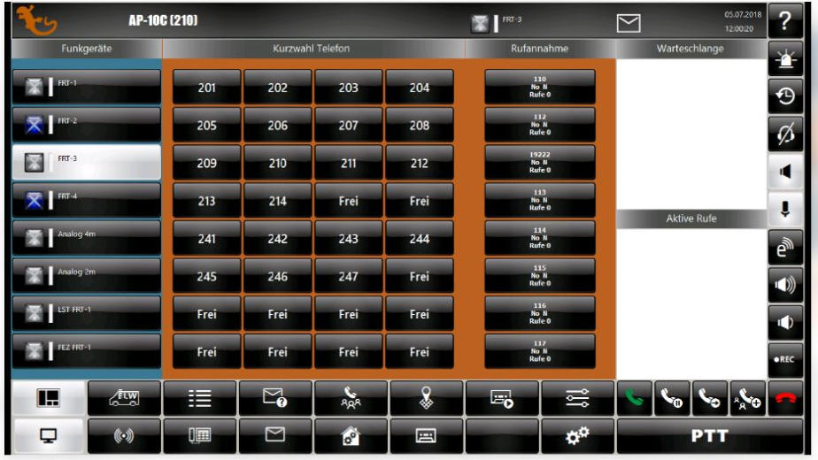

### Bild 02: Audio-Einstellungen

Getrennte Lautstärken für Betriebslautsprecher, Abhörlautsprecher, Handapparat, Headset und Klingellautsprecher; wählbare Audio-Setups und Basiswerte.

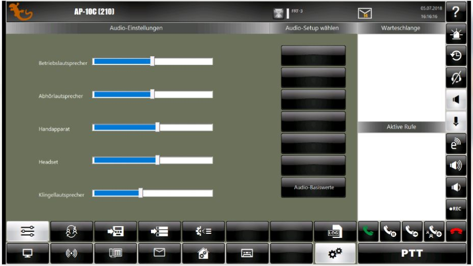

### Bild 03: Sprachaufzeichnung

Leere Mitschnittliste mit Funkgerät, Datum/Uhrzeit, Dauer, Quelle und Ziel; Transporttasten und Löschaktion. Kein NetCore-Aufzeichnungsnachweis.

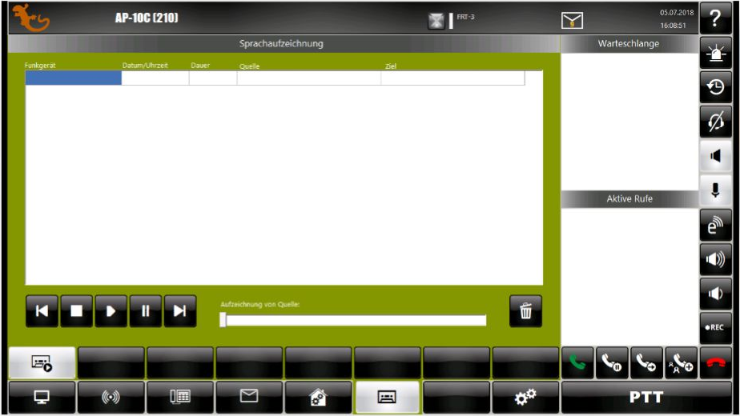

### Bild 04: Durchsagen, ELA und Gebäudesteuerung

ELA-Warteschlange, Lautstärke/PTT, vorbereitete Durchsagen, BMA/Störung, Licht, Schranke sowie Tor-Steuerungen.

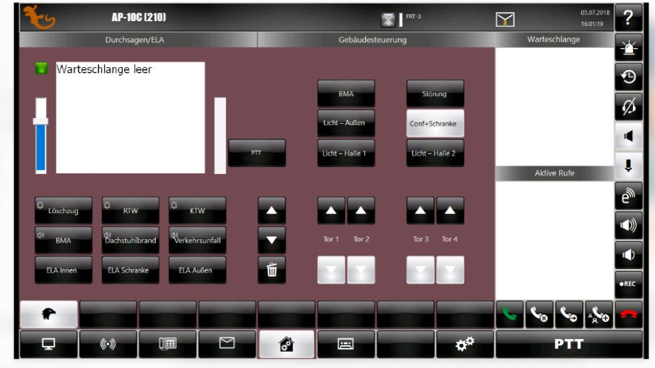

### Bild 05: Zieladresse für Nachrichten suchen

Namens-/Ortssuche, mehrere Adressbücher und Bildschirmtastatur im Nachrichtenbereich.

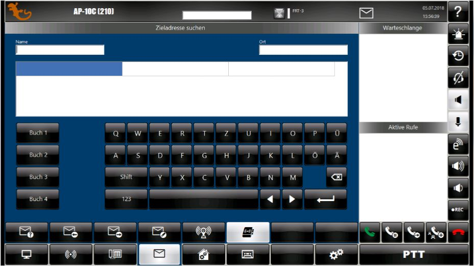

### Bild 06: Nachrichtenkurzwahlen

64 nummerierte Zielwahltasten als separate Nachrichtenansicht.

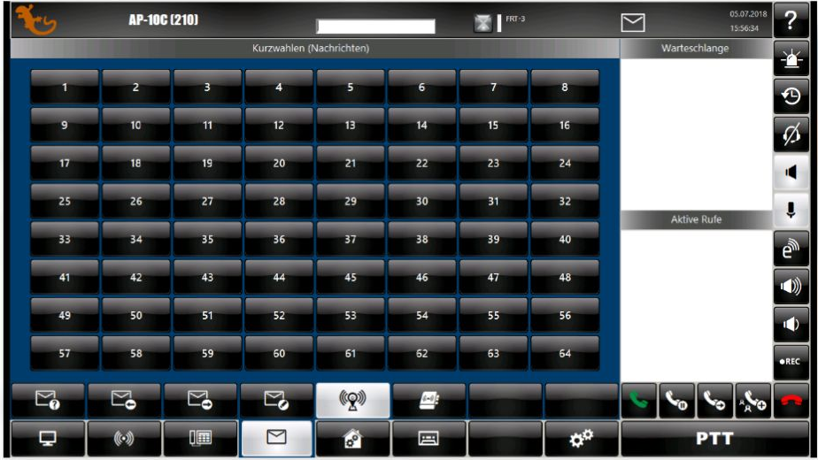

### Bild 07: Nachricht erstellen

Empfänger, Text, Bildschirmtastatur und Aktionen für Versand, Flash-SDS, Quittungen, CallOut, Speichern und Löschen.

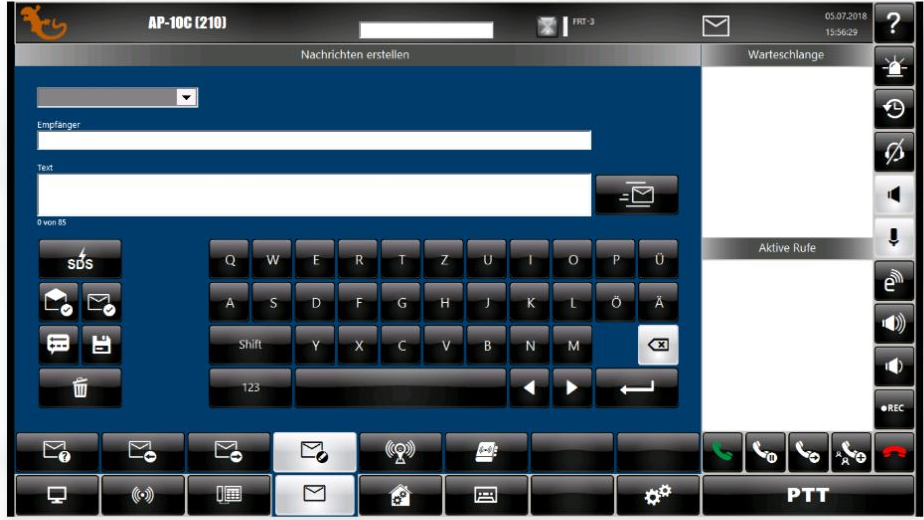

### Bild 08: Nachrichtenausgang

Versandhistorie mit Zeit, Funkgerät, Zieladresse, Inhalt und Status; sichtbare Positionseinträge gehören zur historischen Referenz.

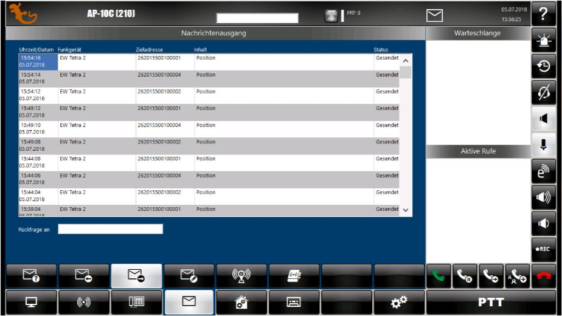

### Bild 09: Nachrichteneingang und Positionsrohtext

Eingangsverlauf mit Absender und als LIP bezeichnetem Rohtext; keine hier nachgewiesene Dekodierung in Kartenkoordinaten.

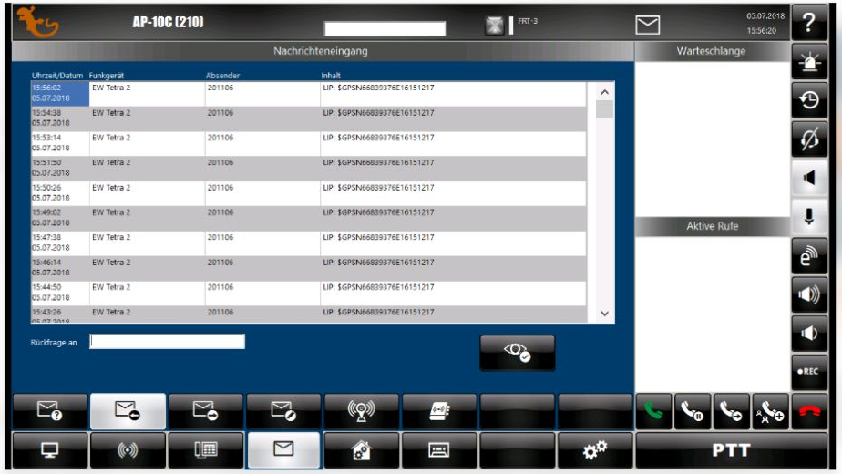

### Bild 10: Status, Sprechwünsche und Arbeitsplätze

Parallele Eingangs-/Sprechwunsch-/Arbeitsplatzlisten, farbige Statuswerte, Quick Groups und frei belegbare Aktionen.

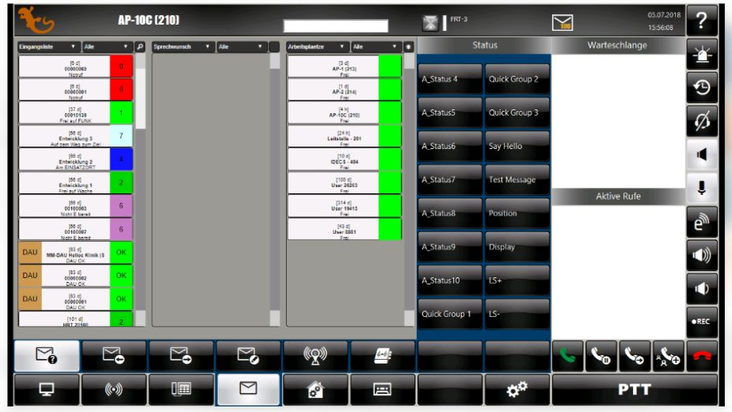

</details>

<details>
<summary>Referenzbilder 11–20 anzeigen</summary>

### Bild 11: Nachbararbeitsplätze und Notrufe

Arbeitsplatzliste mit Zuständen sowie Notrufbereich und direkten Besprechungs-/Telefonaktionen.

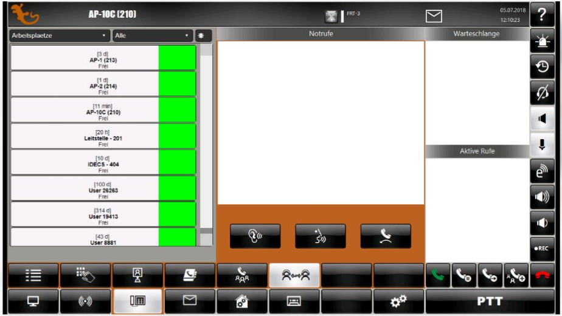

### Bild 12: Telefonkonferenzen

Kurzwahlen, Konferenzliste und Teilnehmerbereich in einer Ansicht.

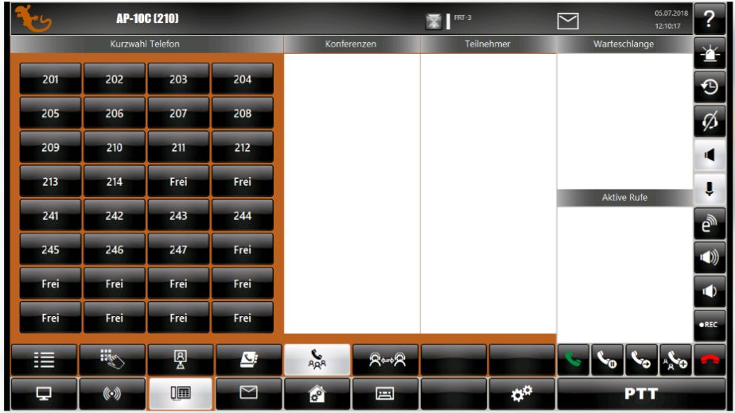

### Bild 13: Telefonteilnehmer suchen

Telefonbuchsuche nach Name/Ort, getrennte Bücher und Bildschirmtastatur.

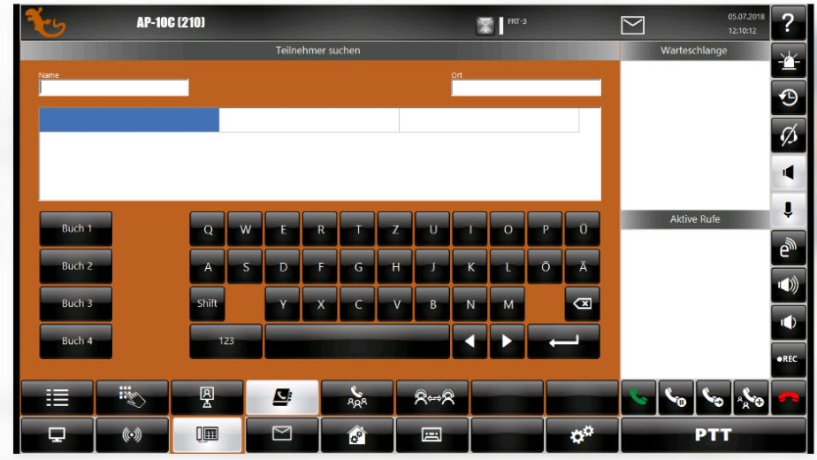

### Bild 14: Telefonkurzwahlen

64 nummerierte Kurzwahltasten im Telefonbereich.

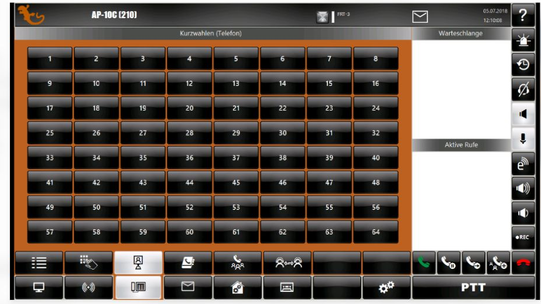

### Bild 15: Telefonnummer wählen

Eigenständige manuelle Rufnummernwahl mit Ziffernblock.

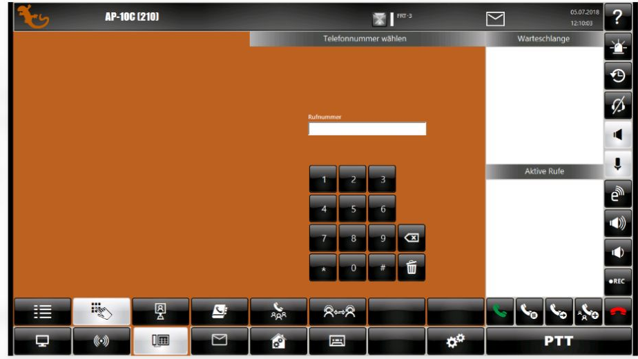

### Bild 16: Telefonrufliste und Rufannahme

Rufliste, Rufdetails und Annahmefelder mit dauerhaftem Queue-/Aktive-Rufe-Bereich.

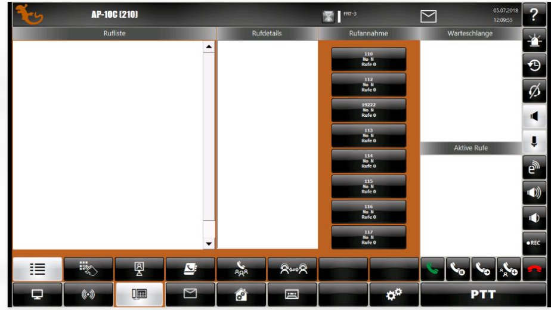

### Bild 17: IDECS-Hilfe als Modulübersicht

Kontextstruktur für Übersicht, Funk, Telefon, Nachrichten, Haustechnik, Dokumentation und Einstellungen.

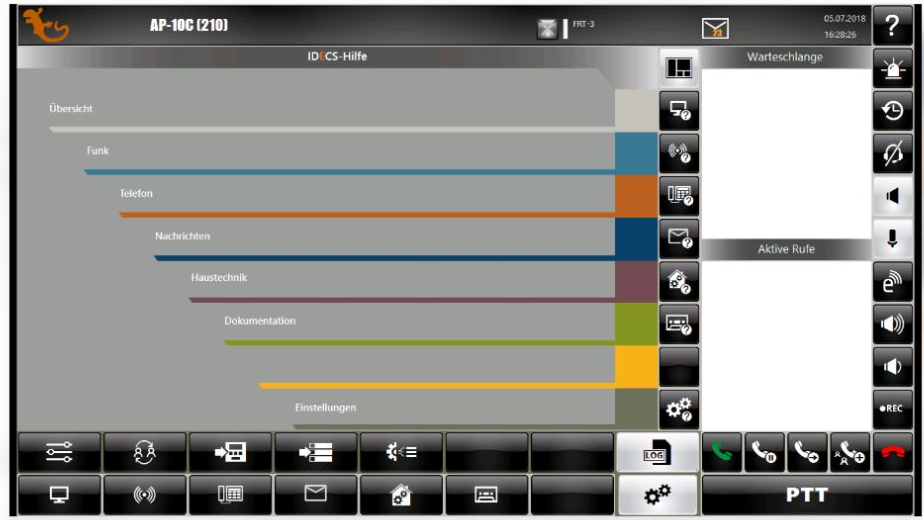

### Bild 18: Symbole der Übersicht

Erklärungen für Favoriten, Dashboard, Hilfe, Notruf, Funkrufhistorie, Aufnahme, Telefonaktionen und getrennte Audio-/Mute-Funktionen.

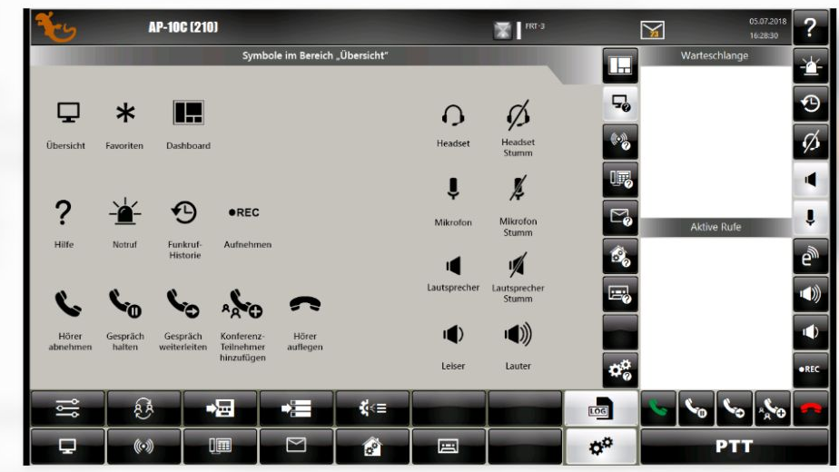

### Bild 19: Funksymbole und Konferenzarten

Leitstelle, ELW, Gleichwelle, Ortung, Funkkonferenz, 5-Ton-Alarm; Multi-PTT- und DFS-Konferenz sowie eingehende/ausgehende Funkrufe.

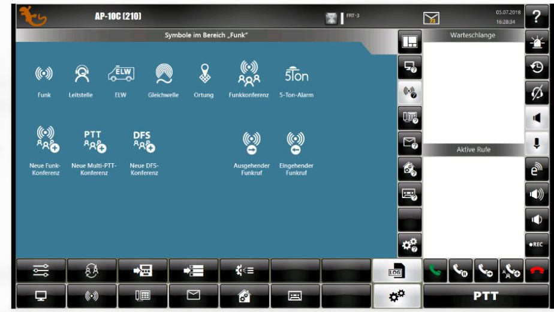

### Bild 20: Telefonsymbole und Nachbarplatz

Rufliste, Wählen, Zielwahl, Telefonbuch, Konferenz und Nachbarplatz-Besprechung; Rufaufbau, Halten, Ende, Abbruch und Konferenzzustände.

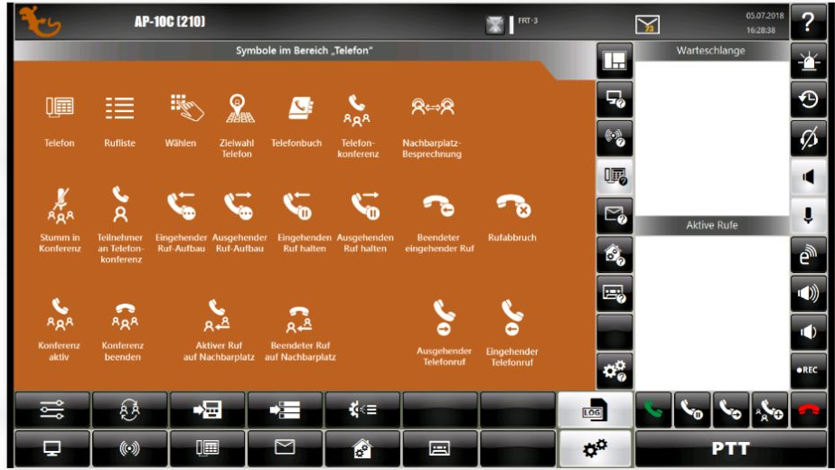

</details>

<details>
<summary>Referenzbilder 21–30 anzeigen</summary>

### Bild 21: Nachrichtensymbole und Quittungen

Eingang/Ausgang, Editieren, Zielwahl/Telefonbuch, Versand; Lesebestätigung und Empfangsquittung getrennt, Flash-SDS, CallOut und Gelesen-Markierung.

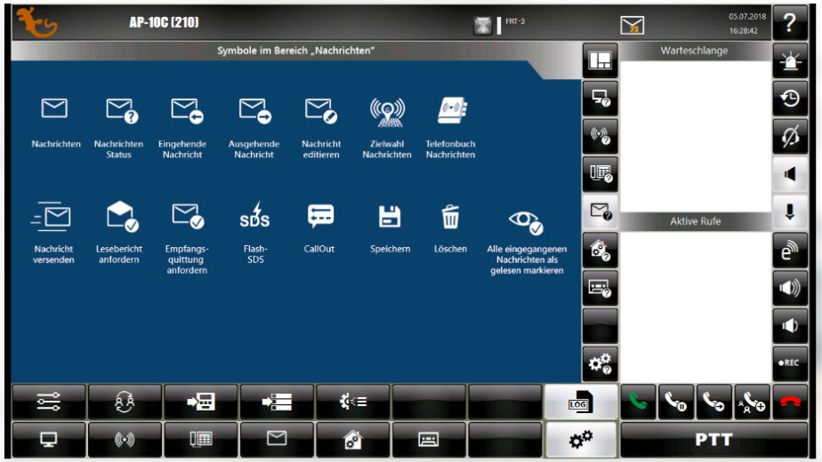

### Bild 22: Haustechnik-Symbole

Haustechnik und SELECTRIC Falcon als sichtbare Referenzkopplung. Keine bestätigte NetCore-Falcon-Integration.

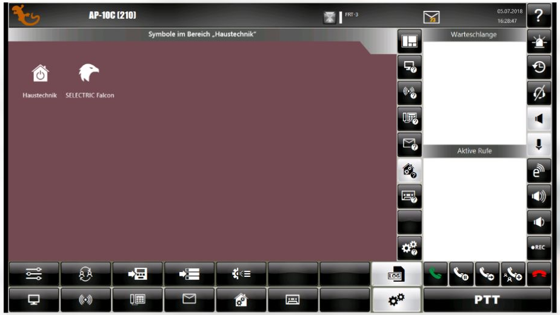

### Bild 23: Dokumentation und Audioaufzeichnung

Zwei getrennte Funktionsbereiche; fachliche Dokumente nicht mit Sprachmitschnitten gleichsetzen.

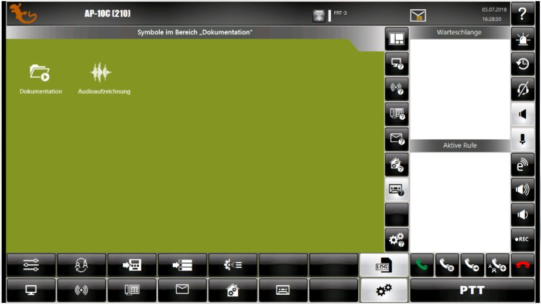

### Bild 24: Einstellungen und Zuordnungen

Audio, Rollenwechsel, Besprechungseinrichtungen, Kombinationsbuttons, weitere Einstellungen und Systemlog.

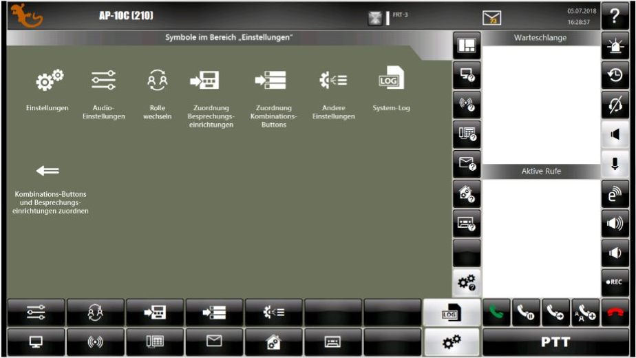

### Bild 25: Funkgeräteauswahl mit virtuellem Bedienteil

Mehrere Funkressourcen, teilweise ohne Verbindung, und eingeblendetes Gerätebedienteil mit Display, Navigation und Zifferntasten.

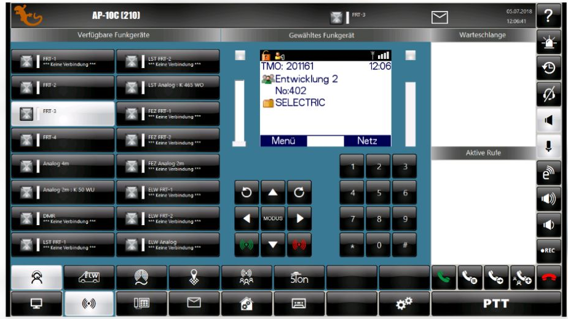

### Bild 26: 5-Ton-Alarm versenden

Zieladresse, Ziffern-/Funktionsblock, Aktiv-/FLG-Anzeige und vorbereitete Ziele; eigener Workflow neben TETRA-SDS.

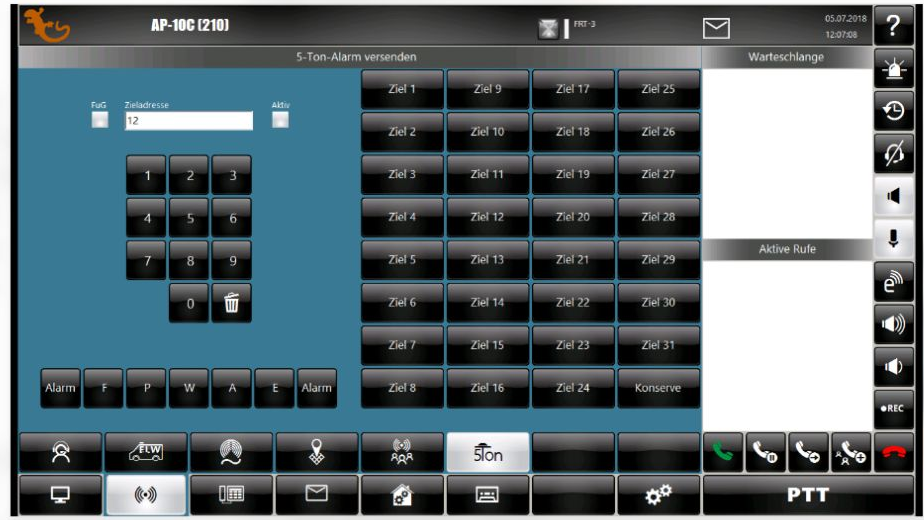

### Bild 27: Funkkonferenzen verwalten

Konferenz anlegen, laufende Konferenzen, Konferenzteilnehmer und freie Teilnehmer; Start/Stop/Löschen und Hinzufügen/Entfernen.

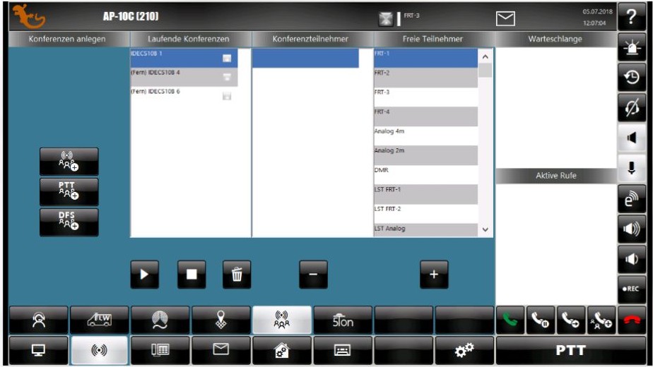

### Bild 28: Karte mit Filtern und Layern

Kartenansicht mit Filterrücksetzung, KML-Layer, Image-Layer, Zoom und Orts-/Koordinatenanzeige.

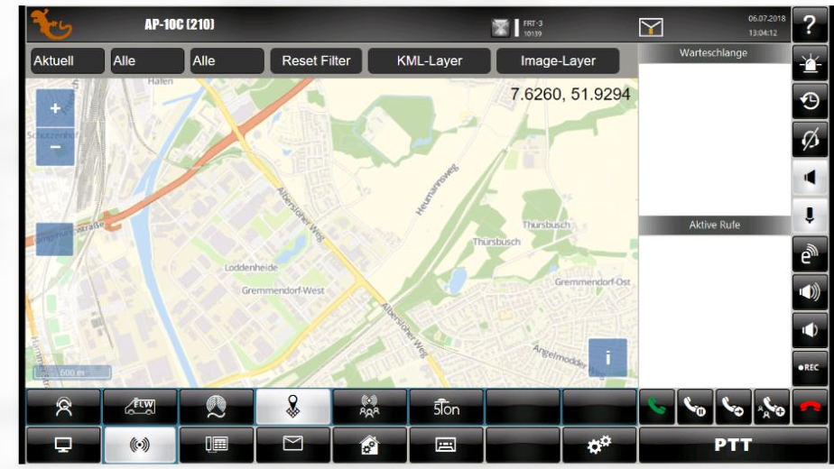

### Bild 29: Weitere Funkressourcen

Weitere nummerierte Funkmittel im gleichen Bedienrahmen und dasselbe virtuelle Gerätebedienteil.

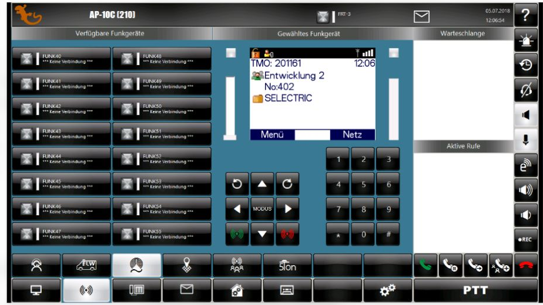

### Bild 30: ELW- und weitere Funkressourcen

ELW-/weitere Ressourcen, darunter unterschiedliche Funkanbindungen; aktive Auswahl und Gerätebedienteil.

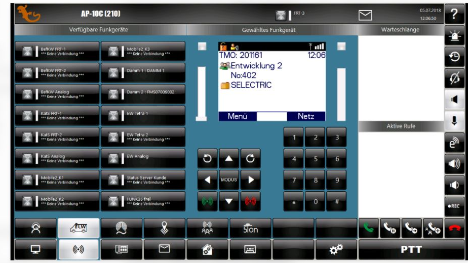

</details>

### Bild 31: Erzeugter NetCore-Dashboardentwurf

Dunkles Dashboard mit Ressourcen, Modul-Kacheln, Einsatz-/Kartenfeld, Queue, aktiven Rufen, Audio und PTT. Sämtliche Betriebsanzeigen sind Mockup-Inhalt.

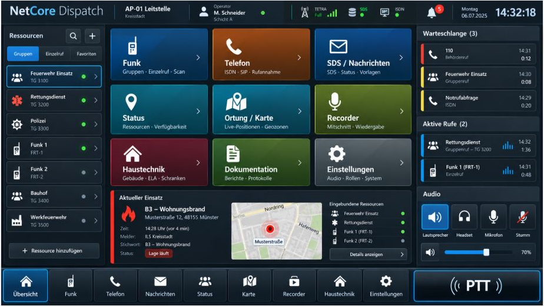

### Bild 32: Erzeugter NetCore-Funkentwurf

Gewählte Gruppe, Sprecheraktivität, Ruf-/Scan-/Mithör-/SDS-/Status-/Alarm-/Konferenzaktionen, aktive Funklage und persistente Queue/Audio/PTT. Kein implementiertes Programm.

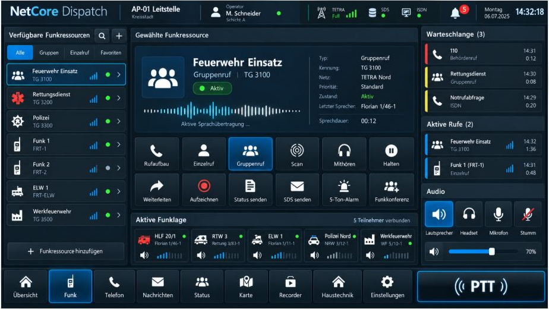


## 19. Belegstellen und Archivgrenze

Die verlinkten Repository-Dateien sind im geprüften Ausgangscommit vorhanden. Für einen unveränderlichen Vergleich kann im GitHub-Link der Branch durch `5417f495d305728e113d13eed47ca976913cb635` ersetzt werden. Die in der IAM-Roadmap selbst genannte ältere `main`-Prüfbasis ist die Herkunft jener Roadmap und wird nicht als Prüfcommit dieses Archivs ausgegeben.

Ergänzende vorhandene Archive sind die [Control-Room-Dokumentation](2026-10-03_control-room-windows-ui-rbac-status-tableau-directory-api.md), das [Archiv zum Gesprächssimulator und zur lokalen Mikrofon-/PTT-Sprechstelle](2026-10-03_gespraechssimulator-issi-und-lokale-mikrofon-ptt-sprechstelle.md) und der [ISSI-Nummernplan mit RBAC](2026-10-04_issi-nummernplan-rbac-und-vergaberichtlinie.md). Sie sind Fortsetzungsquellen; ihre Aussagen und Tests werden nicht rückwirkend dem IDECS-Chat zugeschrieben.

Zu diesem Chat wurde kein Implementierungs-PR und kein belastbarer historischer Programmcommit identifiziert. Dieses Archiv erzeugt keine solche Zuordnung. Verbindlich bleiben der konkrete geprüfte Repository-Stand, die einzeln gekennzeichneten Gesprächsentscheidungen und die ausdrücklich offenen Aufgaben.
