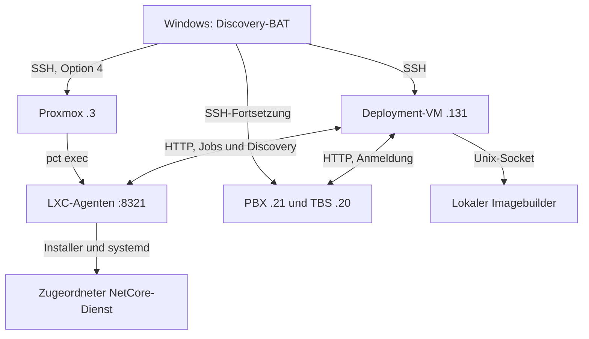

# Entwicklungsnotizen: Discovery-Rollout, Proxmox-Fortsetzung und FreePBX-Zugang

## 1. Rahmen und Nachweisregeln

| Feld | Wert |
|---|---|
| Repository | [JanHG98/netcore-tetra](https://github.com/JanHG98/netcore-tetra) |
| Thema | Discovery-/Deployment-Installation im vorhandenen Open Lab; Windows-BAT, Wiederaufnahme ab Application-Gateway, PBX-Zugang und abschließende Diagnose |
| Historischer Zeitraum | Erhaltene Betriebsbefunde vom 27./28.09.2026; frühere Teile nur auszugsweise rekonstruierbar |
| Letzte technische Festlegungen | `sangoma-freepbx-12-13-0-2603-3`; anschließend Ankündigung, `discovery.bat` erneut mit Option 4 zu starten |
| Erstellung / zusätzliche Repository-Prüfung | **2026-10-06**, UTC; keine erneute Live-Prüfung der realen Lab-Hosts |
| Dokumentationsbranch | **`Archiving`** |
| Geprüfter Archivbranch vor der ursprünglichen Dokumentation | [`1fae33416c0b7c9f48ca540b5c984d2796102f1e`](https://github.com/JanHG98/netcore-tetra/tree/1fae33416c0b7c9f48ca540b5c984d2796102f1e) |
| Zusätzlich geprüfter Hauptzweig | [`main@9116c15d645458f99e236712b67a1ad970432791`](https://github.com/JanHG98/netcore-tetra/tree/9116c15d645458f99e236712b67a1ad970432791) |
| Geprüfter historischer Implementierungsstand | [`bbf039729b9b05f8d623b11195ca24a124f68d16`](https://github.com/JanHG98/netcore-tetra/tree/bbf039729b9b05f8d623b11195ca24a124f68d16), Deployment-Komponente **0.2.3** |
| Letzte erhaltene Windows-Artefakte | `NetCore-Discovery.bat`, Rollout-Fix **0.2.6**; `NetCore-Diagnose.bat`, Diagnose-Fix **1.2**; beide datiert 28.09.2026 |
| Archivpfad | `Docs/archive/2026-10-06_discovery-bat-rollout-proxmox-fortsetzung-und-freepbx-zugang.md` |

Die Statusbegriffe werden getrennt verwendet:

- **Idee:** diskutierte Möglichkeit ohne verbindliche Umsetzung.
- **Beschlossen/geplant:** ausdrücklicher Wunsch oder vereinbarter Ablauf; noch kein Implementierungsnachweis.
- **Implementiert:** in einer benannten Quelldatei beziehungsweise einem benannten Commit vorhanden. Ein gespeichertes BAT-Artefakt ist dabei noch kein Git-Commit.
- **Getestet:** ein konkret ausgeführter Test ist belegt; Umgebung und Grenzen gehören zum Ergebnis.
- **Im Betrieb bestätigt:** ein konkreter Zustand wurde im historischen Lab-Lauf beobachtet. Das bestätigt weder alle Fachfunktionen noch den geprüften Anlagenstand.
- **Unbestätigt/offen:** fehlende, widersprüchliche oder nicht erneut zugängliche Evidenz wird ausdrücklich benannt.

## 2. Ergebnis und wesentliche Fortsetzungsgrenzen

Ziel ist ein fester Windows-Einstieg für das vorhandene Lab-Inventar: Discovery-Agenten installieren beziehungsweise aktualisieren, beim Controller anmelden und ausschließlich den dem Host zugeordneten NetCore-Dienst aktualisieren. Nach mehreren Teilabbrüchen entstand **Option 4 „Reparatur + Fortsetzen“**: Discovery-Bindings korrigieren, Group-Core nur bei Bedarf neu starten, die verbleibenden Container über eine einzige Proxmox-SSH-Sitzung bearbeiten, nicht als laufende LXCs gefundene Ziele einmal direkt per SSH versuchen und danach die TBS behandeln.

Der letzte rekonstruierbare reale Lauf war **kein vollständig grüner Gesamtlauf**:

- 13 der 14 verbleibenden Diensthosts wurden als laufende LXCs gefunden und bearbeitet.
- Unter diesen 13 waren acht verwaltete Dienste erfolgreich, vier installiert, aber als eingeschränkt gemeldet, und Brew nur als Agent angemeldet.
- Group-Core war bereits bereit; ein zusätzlicher Neustart war nicht nötig.
- Auf PBX `10.0.1.21` funktionierten Root-SSH und die lokale Agentinstallation. Die Anmeldung am Controller scheiterte anschließend an Timeouts zu `10.0.1.131:8320`.
- Die TBS `10.0.1.20` war auf SSH-Port 22 nicht erreichbar; in diesem Lauf wurde dort kein Update gestartet.
- Danach wurden Discovery-BAT 0.2.6 und Diagnose-BAT 1.2 bereitgestellt. Ein abschließender realer Lauf dieser neuen Versionen beziehungsweise eine neue Diagnoseausgabe ist nicht belegt.

**Zusätzlicher Befund vom Archivtag:** Der historische Deployment-/Discovery-Code ist am vollständigen SHA weiterhin abrufbar, fehlt aber in den geprüften aktiven Trees von `main` und `Archiving`. Die erhaltenen BATs referenzieren weiterhin den inzwischen nicht mehr angebotenen Remote-Branch `feature/openlab-discovery-deployment`. Sie sind deshalb eine wertvolle historische Quelle, aber **kein unverändert nutzbarer geprüfter Installationsweg**. Ein bloßer Wechsel auf `main` löst das Problem nicht: Dort fehlt der angesprochene Installer.

Die zentrale Roadmap auf `main` führt die Quellübernahmelücke als **Z01.1**. Der Integrationsplan und die eigentliche Codeübernahme sind noch offen.

## 3. Quellenumfang, Anhänge und Lücken

### 3.1 Ausgewertete Quellen

| Quelle | Zugriff und Aussagekraft |
|---|---|
| Letzter dokumentierter Ablauf | ISO-Stand mit Endung `-3`; Option 4 erneut starten. Ein unmittelbar folgender Ergebnisnachweis fehlt. |
| Historische Entwicklungsnotizen | Datierte Festlegungen und Diagnosebefunde zu VM, Inventar, Rollout, PBX und TBS erlauben eine teilweise Rekonstruktion. Vollständige originale Laufprotokolle fehlen. |
| `NetCore-Discovery.bat` 0.2.6 | Originaldatei erneut geladen und inhaltlich geprüft; einschließlich PowerShell, Shell- und Python-Payloads. |
| `NetCore-Diagnose.bat` 1.2 | Originaldatei erneut geladen und inhaltlich geprüft; einschließlich lesender Remote-Diagnose. |
| Historische Git-Commits | `17bd275…`, `e695301…` und `bbf0397…` direkt per SHA geladen; einschlägiger Quelltext gelesen. |
| GitHub PR #57 | Metadaten einschließlich tatsächlichem Zielbranch und Merge-SHA erneut geprüft. |
| Geprüfte Git-Trees | `Archiving@1fae334…` und `main@9116c15…` direkt geprüft; wichtige geprüfte Installations- und Readinesspfade gelesen. |
| Neue lokale Prüfungen | Bestehende Deployment-Unit-Tests am historischen Quellstand, Hardware-Shutdown-Test sowie Syntaxprüfung der erhaltenen BAT-Payloads; Abschnitt 12. |
| FreePBX-Primärquellen | Downloadseite und Sangoma-Installationsdokumentation zur Einordnung der korrigierten ISO-Bezeichnung erneut aufgerufen. |

### 3.2 Nicht vollständig zugängliche Evidenz

1. **Frühe Entwicklungsnotizen nur teilweise erhalten.** Festlegungen und Diagnosen lassen sich teilweise rekonstruieren. Sie ersetzen keine vollständigen Laufprotokolle oder Implementierungsnachweise.
2. **Originale Laufprotokolle sind nicht erneut als vollständige Dateien verfügbar.** Insbesondere die damalige Textanlage `Eingefügter Text.txt`, die vollständigen Windows-Transkripte, CSVs und Proxmox-Berichte konnten am Archivtag nicht frisch eingelesen werden. Die Laufchronik bewahrt die erhaltenen Auswertungsbefunde und kennzeichnet deren Grenze.
3. **Der frühere lokale BAT-Testharness ist nicht mehr verfügbar.** Die berichteten 24+4 Tests werden als historische Testbefunde erhalten, nicht als am Prüfstand 06.10.2026 erneut ausgeführt ausgewiesen.
4. **Keine Live-Verbindung zum Lab wurde benutzt.** Installierte Commits, tatsächliche Units, aktuelle Firewallregeln, Mounts, Hostzustände und geprüfte Healthwerte sind unbekannt.
6. **Originalbilder fehlen.** Es sind keine eindeutig zugeordneten Bilddateien des Rollout-Arbeitsstands verfügbar. Falls Originale auftauchen, mit Herkunft unter `Docs/archive/assets/` sichern.
7. Die 25 vorhandenen ETSI-PDFs sind Projektmaterial, kein Nachweis für diesen SSH-/Deployment-Lauf. Ihr Inventar steht in Abschnitt 16. Sie wurden nicht vollständig fachlich ausgewertet oder erneut ins Repository dupliziert.

### 3.3 Erhaltene BAT-Dateien eindeutig identifizieren

| Datei | Erhaltener Stand | Größe | SHA-256 |
|---|---|---:|---|
| `NetCore-Discovery.bat` | 28.09.2026, Rollout-Fix 0.2.6; gespeicherte Dateiversion 6 | 55.635 Byte | `c771e5479f8ff4b44120f17dc3a4bb5b64823b8fe6372d72d4133040bc0d4728` |
| `NetCore-Diagnose.bat` | 28.09.2026, Diagnose-Fix 1.2; gespeicherte Dateiversion 2 | 20.744 Byte | `83dd8269fed095892ff74bfe52527d6cebafeccfc5fb69b991b90fc7b866272c` |

Die Hashes beziehen sich auf die Originalbytes einschließlich Windows-Zeilenenden. Die BAT-Dateien lagen außerhalb des Git-Repositorys unter `/NetCore-Tetra/`. In den geprüften aktiven Trees fehlten gleichnamige Launcher; eine Codeübernahme ist noch offen.

**Zugangsdaten:** In einem historischen Transkript war eine versehentlich an einer Enter-Pause eingegebene Passwortzeichenfolge gelandet. Sie wird hier weder zitiert noch teilweise, codiert oder als Hash archiviert. Eine Änderung des betroffenen Passworts wurde empfohlen; ihre Durchführung ist nicht bestätigt. Ungeprüfte Rohtranskripte dürfen deshalb nicht nachträglich einfach als Belegdateien übernommen werden.

## 4. Ziel, Ausgangslage und endgültige Anforderungen

Ausgangspunkt waren viele vorhandene NetCore-Dienste auf getrennten Hosts, ein Raspberry-Pi-TBS-System, eine FreePBX/Asterisk-VM und Brew. Die Windows-BAT sollte die bereits bekannten Adressen verwenden und wiederholte manuelle Hosteingaben vermeiden. Eine zentrale Ubuntu-VM sollte Discovery, Deployment, Verwaltung und Pi-Imagebuilder zusammenführen.

| Endgültige Festlegung | Begründung / Konsequenz | Letzter historischer Stand |
|---|---|---|
| Bestehendes Inventar ohne manuelle IP-Abfrage | Die Lab-Adressen waren bereits bekannt; alte `.hosts.txt`-Eingaben sollten nicht mehr nötig sein. | In BAT implementiert |
| LXC-Zugang `root`, TBS `jan`, Deployment-VM `jhoffmeister` | Vorhandene Betriebskonten nutzen; VM/TBS benötigen bei Installation `sudo`. | Festlegung und BAT-Code |
| PBX `.21` ist eine **VM** | Spätere ausdrückliche Korrektur hat Vorrang vor der älteren LXC-Annahme. | Beschlossen; BAT-Typfeld noch inkonsistent |
| Controller `.131:8320`, Agenten `:8321` | Eindeutige Rollen; Controller nicht versehentlich durch Agentinstallation ersetzen. | Historisch implementiert; Rollenprüfungen in BAT |
| Open Lab per HTTP, ohne Weblogin/Tokens/TLS | Explizit gewünschter Entwicklungsbetrieb. SSH behält seine eigene Authentifizierung und Hostschlüsselprüfung. | Historisch implementiert; keine allgemeine Produktionsfreigabe |
| Eine Ubuntu-VM einschließlich Imagebuilder | Kein zusätzlicher Imagebuilder-LXC; volle VM für Loop-/Image-/QEMU-Arbeiten. | Geplant und historisch implementiert |
| Nur zugeordnete NetCore-Dienste verwalten | Eine zufällig vorhandene TOML darf keinen fremden Dienst zum Updateziel machen. | Backend 0.2.3 und explizites BAT-Mapping |
| Brew und PBX nur Discovery-Agent | Keine Aktualisierung der fremden Brew-/Asterisk-/FreePBX-Software durch diese BAT. | `Service=none`, implementiert |
| Keine doppelte Auftragsauslösung | Eine verlorene Antwort kann einen bereits laufenden Installationsjob verdecken. | Implementiert; unbekannter Zustand stoppt den Gesamtlauf |
| Fortschritt nach Teilabbruch wiederaufnehmen | Bereits abgeschlossene große Builds nicht unnötig erneut starten. | Option 4 implementiert und historisch teilweise im Betrieb bestätigt |
| Bestehende Konfigurationen, Units und Git-Arbeiten bewahren | Kein pauschales Überschreiben von TBS-ExecStart, lokalen Änderungen oder Git-Locks. | Mehrere konkrete Fixes; Restabnahme offen |
| Ergebnisdatei und ausführliches Laufprotokoll | Fehler, eingeschränkte Readiness, reine Anmeldung und unklaren Zustand auseinanderhalten. | CSV/Transcript/Proxmox-Bericht implementiert |

Die Anzeige „27 Dienst-Hosts“ bedeutet **keine bestätigte Anzahl von 27 LXCs**. Das BAT-Inventar enthält 29 Ziele: 25 NetCore-Dienst-LXCs, Brew als weiterer LXC, PBX als VM, TBS und Deployment-VM. Der Proxmox-Host ist ein zusätzlicher Orchestrierungszugang, kein 30. reguläres BAT-Ziel.

## 5. Architektur, Datenwege und Abhängigkeiten

### 5.1 Aufbau des historischen Rollouts



Das Diagramm beschreibt den historischen Soll-/Codepfad, keine am Prüfstand 06.10.2026 neu vermessene Topologie. Controller und Agenten verwenden Python 3.11+; `tomllib` ist eine relevante Mindestversionsabhängigkeit. Linux-Installer setzen Debian/Ubuntu/Raspberry Pi OS, `apt-get`, `git`, `curl`, CA-Zertifikate, systemd und `flock` voraus. Der Windows-Launcher startet Windows PowerShell 5.1+ aus einer BAT und verwendet den OpenSSH-Client.

Der Controller verwaltet Gitreferenzen, Manifeste, Nodes und persistente Aufträge. Der Agent installiert beziehungsweise startet lokale Dienste. Der Imageworker läuft getrennt mit Rootrechten und wird vom Controller über `/run/netcore-image-builder/api.sock` angesprochen; er braucht keinen zusätzlichen öffentlich erreichbaren TCP-Port.

Der Controller soll nicht im zeitkritischen Ruf-/RF-Pfad liegen. Jeder Host hält einen letzten brauchbaren Discovery-Endpoint-Stand vor. Ein Controllerausfall ist deshalb von einem tatsächlich ausgefallenen Fachservice zu unterscheiden.

### 5.2 Discovery und Anmeldung

- Historischer Standard: UDP-Multicast **`239.192.84.82:48320`**, Intervall **15 s**, Lease **90 s**; zusätzlich feste HTTP-Gegenstellen für geroutete/VPN-Netze.
- Gemeinsame Discovery-Umgebung: **`netcore-openlab`**; Rolle, `security_mode=open_lab`, Node-ID und erlaubte Netze werden geprüft.
- Die Agentanmeldung muss **beide Richtungen** herstellen: Agent kennt Controller; Controller kennt die erreichbare Agent-Rückadresse `http://<Host-IP>:8321`.
- UI-/API-Einstellungen können TOML-Seeds überlagern. Der Launcher liest und aktualisiert deshalb den effektiven Seedzustand und stößt die Suche erneut an.
- Ein auf einem anderen Endpoint bereits online gemeldeter identischer Node-Name wird als Konflikt behandelt.
- Rollen werden semantisch aufgelöst. Der gemeinsame Port 8080 allein unterscheidet Node-Gateway und TBS-Dashboard nicht.
- Verfügbare, aber noch nicht vollständig bereite Dienste dürfen entdeckt werden, damit wechselseitige Abhängigkeiten keinen Discovery-Deadlock erzeugen. „Entdeckt“ bedeutet weiterhin nicht „fachlich bereit“.

Die Recovery setzt insbesondere diese kanonischen Rollenbindungen:

| Rolle | Node-ID | Fachendpoint | Agent |
|---|---|---|---|
| `node-gateway` | `Node-Gateway` | `http://10.0.1.179:8080` | `http://10.0.1.179:8321` |
| `provisioning-core` | `Provisioning-Core` | `http://10.0.1.106:8125` | `http://10.0.1.106:8321` |

Früher war unter anderem Hardware-Gateway `.123` als falscher Node-Gateway-Anbieter aufgetaucht. Explizite Hostzuordnung und Bindings sollten solche Altbestände nicht mehr bevorzugen. Irrtümlich früher installierte Zusatzdienste wurden dabei **nicht automatisch deinstalliert**; deren gezielte Bestandsbereinigung bleibt ein eigener Schritt.

### 5.3 Management-Schnittstellen

| Schnittstelle | Zweck |
|---|---|
| `GET /api/v1/status` | Rolle, Umgebung, Einstellungen, Peers, Endpoints und Konflikte |
| `GET /api/v1/manifest` | Lokale Agent-/Dienstidentität |
| `/api/v1/settings` | Effektive Seeds und Bindings; Schreibantwort kann verloren gehen, daher vor Wiederholung erneut lesen |
| `POST /api/v1/discovery/scan` | Suche anstoßen; Wiederholung ist für diesen Weckaufruf vorgesehen |
| `GET /api/v1/jobs` | Vorhandene/laufende Aufträge prüfen |
| `GET /api/v1/jobs/<id>` | Genau den bereits erzeugten Auftrag weiterverfolgen |
| `POST /api/v1/deploy` | Einmalige Beauftragung von Installation/Update/Neustart; keine blinde Wiederholung |
| `/api/v1/images` | Imageworker-Verfügbarkeit und laufende Imagejobs; Sperre vor VM-Update |
| `/health/live`, `/health/ready` | Prozess-/Dienstlebendigkeit getrennt von Bereitschaft |

### 5.4 Timeouts und Zustandssicherheit

| Ebene | Erhaltener Parameter / Verhalten |
|---|---|
| BAT-SSH-Vorprüfung 0.2.6 | TCP-Verbindungsversuch Port 22, maximal 5 s; bei Fehlschlag noch kein Remote-Befehl |
| Eigentliche SSH-Verbindung | `ConnectTimeout=10`, `ServerAliveInterval=15`, `ServerAliveCountMax=3`, `StrictHostKeyChecking=ask`; Rollout mit PTY für sudo |
| Agent-Workflow, HTTP | Request-Timeout 15 s; lesende Wiederholungen bis 120 s, Intervall 2 s |
| Enrollment | Nach Seedpflege bis 90 s auf eindeutigen Peer warten |
| BAT-Auftragsverfolgung | Gesamtbudget 3 h für einen Dienstjob; Verlust des eindeutig feststellbaren Zustands stoppt statt neu zu installieren |
| Backend-Remotejobs 0.2.3 | Request 15 s, Retryfenster 300 s, Pollintervall 2 s, Jobbudget 7.200 s |
| Gitoperationen nach Lock-Fix | Clone/Fetch/Checkout bis 300 s; altes Checkout bei Lockproblem erhalten |
| Dienstneustart im Deployment-Code | Bis 240 s; davon getrennte Healthprüfung |
| Diagnose | Kurze TCP-Prüfung 4 s; Remote-HTTP typischerweise 10 s, begrenzte Kommandoausgaben und einzelne Timeouts |

Die früheren SSH-Authentifizierungsabbrüche um 120 s sind ein anderer Fehler als diese HTTP-/Jobbudgets. Ein größerer HTTP-Timeout löst keine verspätete SSH-Passworteingabe.

## 6. Hostinventar und technische Parameter

Die Tabelle bewahrt das feste Inventar der erhaltenen BAT. Alle Adressen liegen im damaligen `10.0.1.0/24`. Ports sind Fach-HTTP-Ports aus dem historischen Deployment-Katalog beziehungsweise explizite Managementports; sie sind **keine geprüften Listener-Messungen**.

| Host | IP | Tatsächliche/vereinbarte Rolle | Verwalteter Dienst | Fach-/Managementport |
|---|---|---|---|---:|
| Deployment-VM | `10.0.1.131` | Ubuntu-VM, `jhoffmeister` + sudo | Controller + Imagebuilder | 8320 |
| Node-Gateway | `10.0.1.179` | LXC, root | `node-gateway` | 8080 |
| Subscriber-Core | `10.0.1.153` | LXC, root | `subscriber-core` | 8100 |
| Mobility-Core | `10.0.1.150` | LXC, root | `mobility-core` | 8090 |
| Group-Core | `10.0.1.157` | LXC, root | `group-core` | 8110 |
| Security-Core | `10.0.1.149` | LXC, root | `security-core` | 8180 |
| KMF | `10.0.1.180` | LXC, root | `kmf` | 8190 |
| Call-Control | `10.0.1.155` | LXC, root | `call-control` | 8120 |
| Media-Switch | `10.0.1.159` | LXC, root | `media-switch` | 8130 |
| SDS-Router | `10.0.1.169` | LXC, root | `sds-router` | 8150 |
| Packet-Core | `10.0.1.166` | LXC, root | `packet-core` | 8160 |
| IP-Gateway | `10.0.1.142` | LXC, root | `ip-gateway` | 8170 |
| SIP-Switch | `10.0.1.125` | LXC, root | `sip-switch` | 8300 |
| Transit | `10.0.1.151` | LXC, root | `transit` | 8200 |
| Application-Gateway | `10.0.1.144` | LXC, root | `application-gateway` | 8220 |
| IoT-Gateway | `10.0.1.119` | LXC, root | `iot-gateway` | 8240 |
| Hardware-Gateway | `10.0.1.123` | LXC, root | `hardware-gateway` | 8250 |
| Media-Library | `10.0.1.154` | LXC, root | `media-library` | 8230 |
| Recorder | `10.0.1.170` | LXC, root | `recorder` | 8140 |
| RF-Monitor | `10.0.1.122` | LXC, root | `rf-monitor` | 8260 |
| Alarm-Workflow | `10.0.1.121` | LXC, root | `alarm-workflow` | 8270 |
| Task-Workflow | `10.0.1.120` | LXC, root | `task-workflow` | 8280 |
| Asset-Management | `10.0.1.124` | LXC, root | `asset-management` | 8290 |
| Observability | `10.0.1.143` | LXC, root | `observability` | 8210 |
| Provisioning-Core | `10.0.1.106` | LXC, root | `provisioning-core` | 8125 |
| Control-Room | `10.0.1.156` | LXC, root | `control-room` | 9010 |
| PBX-Asterisk | `10.0.1.21` | **VM**, im Lauf root | `none`: nur Discovery-Agent | 8321 |
| Brew | `10.0.1.22` | LXC, root | `none`: nur Discovery-Agent | 8321 |
| TBS | `10.0.1.20` | Raspberry Pi/TBS, `jan` + sudo | `tbs` | Katalog 8080; tatsächliche Unit/Konfiguration ermitteln |

Zusätzlich: Proxmox `root@10.0.1.3`, SSH **22/TCP**; Agentmanagement normalerweise **8321/TCP** auf jedem Agenthost; MQTT in den einschlägigen Konfigurationen **1883/TCP**; Observability-Syslog **514/TCP und UDP**, RELP **20514/TCP**.

**Inventarrestfehler:** Auch BAT 0.2.6 enthält für PBX-Asterisk intern noch `Kind=LXC`. Der spätere direkte SSH-Fallback fängt den fehlenden LXC praktisch ab; er korrigiert nicht das Stammdatenmodell. Bei einer Fortsetzung müssen Controller-VM, Agent-VM und LXC sauber getrennt werden. Einfach `Kind=VM` einzusetzen wäre in dieser BAT ebenfalls falsch, weil dieser Typ im vorhandenen Switch einen Controller mit Benutzer `jhoffmeister` bedeutet.

Der historische Deployment-Katalog enthält außerdem `alert-service` auf Port 8310; im festen 29-Ziel-Inventar dieser BAT ist ihm kein eigener Host zugeordnet. Katalogdienstzahl, Maschinenzahl und die Zahl tatsächlich bearbeiteter LXCs dürfen nicht gleichgesetzt werden.

### 6.1 Relevante Pfade und Units

| Pfad / Unit | Bedeutung |
|---|---|
| `C:\Users\janho\NetCore-Updates` | Historischer Windows-Arbeitsordner; kein am Prüfstand 06.10.2026 geprüfter Pfad |
| `NetCore-Lauf-YYYYMMDD-HHMMSS-fff.txt` | PowerShell-Transcript neben der Discovery-BAT |
| `NetCore-Ergebnis-YYYYMMDD-HHMMSS.csv` | UTF-8-Ergebnisliste, Semikolon als Trenner; fortlaufend geschrieben |
| `NetCore-Diagnose-*.txt` | Lesender Diagnosebericht neben der Diagnose-BAT |
| `/tmp/netcore-enroll-*.sh`, `/tmp/netcore-enroll.XXXXXX/` | Temporäres, restriktiv angelegtes Übertragungs-/Checkoutmaterial |
| `/run/lock/netcore-rollout.lock` | Sperre gegen parallele Rollouts auf demselben Host |
| `/run/lock/netcore-openlab-recovery.lock` | Proxmox-weite Sperre des Wiederaufnahmelaufs |
| `/root/netcore-recovery-<Zeit>-<ID>/` | Proxmox-Bericht mit `lauf.log`, `ergebnis.json` und Einstellungen-vorher-Dateien |
| `/var/lib/netcore-discovery/backups/bindings-<time_ns>.json` | Sicherung vor lokaler Bindingkorrektur |
| `/usr/local/lib/netcore-deployment/` | Installierte Python-Komponente einschließlich Katalog/Launcher |
| `/etc/netcore/deployment.toml` | Controllerkonfiguration |
| `/etc/netcore/discovery.toml` | Agentkonfiguration, unter anderem zugeordnete Dienste |
| `/var/lib/netcore-deployment/`, `/var/lib/netcore-discovery/` | Persistenter Controller-/Agentzustand, Jobs, Einstellungen, Discovery und Quellen |
| `/var/lib/netcore-discovery/source` | Historisches verwaltetes Agent-Checkout; beim Lock-Fix nicht blind löschen |
| `/var/lib/netcore-image-builder/` | Imageworker-Zustand/Buildmaterial |
| `/run/netcore-image-builder/api.sock` | Lokale Controller-Imageworker-Verbindung |
| `netcore-deployment.service` | Controller |
| `netcore-discovery.service` | Agent |
| `netcore-image-builder.service` | Root-Imageworker |
| `netcore-<dienst>.service`, `/etc/netcore/<dienst>.toml` | Übliches Backendmuster; tatsächlichen ExecStart prüfen |
| `tetra.service` / vorhandene TBS-Unit | Bestehende TBS-Installation ermitteln; Katalogdefault `netcore-tbs.service` nicht erzwingen |

## 7. Bedienmodi und verbindliche Wiederaufnahmelogik

| Option | Umfang | Wichtige Grenze |
|---|---|---|
| **1** | Agenten auf allen Agenthosts installieren/aktualisieren und anmelden | Controller-VM ausgeschlossen; kein allgemeiner Fachservice-Rollout |
| **2** | Zuerst VM, danach Agenten und zugeordnete bereits installierte NetCore-Dienste einschließlich TBS | Neustarts möglich; `none` bei Brew/PBX bleibt agent-only |
| **3** | Nur Deployment-VM: Controller und Imagebuilder | Laufende Deployment-/Imagejobs verhindern das Update |
| **4** | Discovery-Reparatur und Fortsetzen ab Application-Gateway über Proxmox, fehlende Hosts per SSH, danach TBS | Keine komplette Wiederholung aller vorherigen Builds; unbekannte Joblage stoppt |

Option 4 arbeitet in dieser Reihenfolge:

1. Proxmox-Login und exklusive Recovery-Sperre; Berichtverzeichnis anlegen.
2. Laufende Container mittels `pct list` und ihrer tatsächlichen IPs ermitteln. Keine feste CTID-Liste als alleinige Zielauswahl benutzen. Doppelte passende IP-Zuordnungen gelten als Fehler.
3. Controllerrolle, Umgebung, laufende Jobs sowie kanonische Node-Gateway-/Provisioning-Agenten prüfen.
4. Effektive Seeds/Bindings der erreichbaren Teilnehmer mit vorheriger Sicherung korrigieren; erforderliche kanonische Endpoints abwarten.
5. Group-Core prüfen. Bei `node_gateway_connected=true` kein Neustart. Andernfalls nur nach eindeutiger Agentzuordnung und ohne laufenden Job einen bestätigten Neustart beauftragen.
6. Die 14 restlichen Diensthosts ab Application-Gateway abarbeiten. Auf gefundenen LXCs `pct exec` verwenden.
7. Nicht als laufender LXC gefundene Ziele erhalten **`SSH-Ausstehend`**: Es wurde dort noch kein Update versucht. Nur diese Ziele dürfen anschließend einmal in die direkte SSH-Warteschlange.
8. Einen bereits fehlgeschlagenen oder unklaren Installationsjob nicht über einen zweiten Transport erneut starten.
9. Erst nach vollständiger und plausibler Proxmox-Ergebnisliste direkte SSH-Fortsetzungen, danach TBS.

Ein definitiver Einzelhostfehler kann als Fehlerzeile erhalten bleiben, während bekannte übrige Ziele weiterlaufen. Ein unklarer Auftrag, unvollständige Proxmox-Ergebnisliste oder Fehler des zentralen Schritts verhindert blindes Weiterarbeiten.

Ist bei einem zugeordneten Dienst in Option 4 bereits genau der Zielcommit installiert, fordert der Launcher einen **Neustart zur Übernahme der Discovery-Konfiguration** an. Andernfalls fordert er ein Update an. Die besondere Group-Core-Vorprüfung kann den Neustart ganz vermeiden. Ein erneuter Option-4-Lauf ist deshalb nicht pauschal ein folgenloser Leselauf.

Die Resultate `Erfolgreich`, `Angemeldet`, `Eingeschraenkt`, `Fehler`, `Ungeklaert` und `SSH-Ausstehend` sind absichtlich verschieden. Eine zusätzliche Sammelzeile `Proxmox-Fortsetzung` ist **kein weiterer Host**. CSV-Zeilenzahlen eignen sich deshalb nicht direkt zur Maschinenzählung.

## 8. Fehlerchronik, Korrekturen und überholte Ansätze

Die Chronik verbindet erhaltene Rolloutbefunde mit den am **06.10.2026** erneut geprüften Fixes. Fehlende Original-Logdetails bleiben eine Grenze der historischen Rekonstruktion.

| Phase / Fehler | Diagnose und Änderung | Nachweis / verbleibende Grenze |
|---|---|---|
| Anfangs wiederholte Abbrüche bei Node-, Subscriber- und Mobility-Updates | Zu kurzes Remote-Polling konnte einen laufenden Agentjob als Fehler erscheinen lassen. Längere Requests, zeitlich begrenzte lesende Wiederholungen, eindeutige Job-ID und kein erneutes Senden des Installationsauftrags. | Commit `17bd275…`; am Prüfstand 06.10.2026 erneut Quelltext und Tests geprüft |
| SSH-/Dateitransferproblem, unter anderem Group-Core | Zunächst wurde SFTP/SCP als mögliche Ursache betrachtet; zeitweise Legacy-SCP `scp -O` vorgesehen. Später Übergang zu einer SSH-Sitzung mit Base64-Übertragung und Ausführung. | Ersetzter Transportansatz; spätere Authentifizierungsfehler sind davon unabhängig |
| Subscriber `.153` / Mobility `.150`: `.git/index.lock` | Ein abgebrochener/zu knapp begrenzter Checkout hinterließ eine Sperrlage. Statt Lock zu löschen wird ein neues isoliertes Checkout gewählt, der alte Ordner bleibt erhalten. Checkoutbudget auf 300 s. | Commit `e695301…`; Tests für gesperrte und aktive Git-Arbeiten |
| KMF, Packet-Core und IP-Gateway: vorübergehende API-/Enrollmentfehler | Lesende HTTP-Abfragen wiederholen; Seedänderungen nach verlorener Antwort erst nach erneutem Lesen ergänzen. | Backend-/BAT-Fixes; kein Beleg einer pauschalen Netzwerkursache |
| IoT-Migration schlägt beim Aufruf fehl | Migrationsskript hatte kein ausführbares Dateibit; Installer ruft es explizit über `bash` auf. | Historischer Fix in `bbf0397…`; Regressionstest besteht am Prüfstand 06.10.2026 erneut; im geprüften main noch nicht übernommen |
| Hardware-Gateway hängt beim Stoppen/Neustarten | `HTTPServer.shutdown()` im Signal-/Hauptthread wartet auf denselben Serverloop; Aufruf in separatem Thread, danach geordnetes Schließen. | Historischer Fix plus echter lokaler SIGTERM-Test; im geprüften main fehlt dieser Fix |
| TBS-Update droht falsche Unit/Binärdatei zu verwenden | Bestehende Unit, ExecStart und Konfigurationspfad ermitteln; keine pauschale Übernahme von `netcore-tbs.service` oder Katalog-Binarypfad. | `bbf0397…`, Tests für `tetra.service`/bestehende Konfiguration; letzter realer TBS-Lauf kam nicht bis hierher |
| Fremde Dienste werden wegen vorhandener TOMLs erkannt | TOML allein reicht nicht als Installationsbeleg; Unit-/Konfigurationszuordnung prüfen und explizite `managed_services` verwenden. | Backend 0.2.3; keine automatische Löschung früherer Zusatzdienste |
| Diagnose 1.0 bricht bei fehlenden Antworten ab | Null-/`.Length`-Problem in PowerShell; fehlende Felder und einzelne gescheiterte Sektionen robust behandeln. | Diagnose 1.1, in 1.2 erhalten; spätere Liveausgabe fehlt |
| Weitere SSH-Abbrüche um 120 s | Erhaltene Diagnose ordnete diese dem Authentifizierungszeitfenster zu; Application war danach vorübergehend nicht zugänglich. | Keine gesicherte Aussage, welcher Sperrmechanismus aktiv war; „Fail2ban“ nicht als bewiesene Ursache ausgeben |
| Group-Core benutzt Node-Gateway `.123` | Falsches Discovery-Angebot; kanonisch `.179:8080` binden und Provisioning `.106:8125` festlegen. Group nur bei Bedarf neu starten. | Option 4; letzter Lauf meldete Group bereit ohne Neustart |
| Option 4 / 0.2.4 stoppt wegen PBX | Annahme, alle 14 Ziele müssten laufende LXCs sein, war falsch. PBX ist eine VM. | 0.2.5 führt bekannte LXCs aus und markiert fehlende Ziele für einmaligen SSH-Fallback |
| PBX-Rootzugang unklar | Plattform/ISO korrigiert; kein QEMU Guest Agent verfügbar. Debian-/Sangoma-Zugang und Konsolen-Recovery besprochen. | Später Root-SSH beobachtet; genaue erfolgreiche Resetmethode nicht belegt |
| PBX nach Installation nicht angemeldet | Lokaler Agent bereit, aber HTTP-Zugriff vom Host zur Zentrale `.131:8320` lief in Timeouts. | Kein Asterisk-Update angefordert; Ursache Routing/Firewall/Serverlast offen |
| TBS-Port 22 nicht erreichbar | Fehler trat vor Authentifizierung/Remoteausführung auf. Frühere pauschale Behandlung von SSH-Exit 255 als unklarer laufender Job war für diesen Fall missverständlich. | 0.2.6 prüft TCP vor SSH; Meldung stellt „kein Remote-Befehl/kein Update“ klar |
| Passwort versehentlich an Enter-Pause eingegeben | Offene `Read-Host`-Pause konnte Eingabe im Transcript sichtbar machen. | 0.2.6/Diagnose 1.2 verwenden `Read-Host -AsSecureString`, verwerfen/entsorgen den Wert; historische Passwortänderung offen |

Eine frühe lokale Probe auf `127.0.0.1:8321` bei Brew schlug während des Hochlaufs fehl; eine spätere Antwort war bereit. Das wurde als Start-/Timingeffekt eingeordnet, nicht als Nachweis eines dauerhaft defekten Brew-Dienstes.

Die erhaltenen Zwischenstände nannten zunächst **19 erfolgreiche/angemeldete und 10 fehlgeschlagene** Ziele, später **12 erfolgreiche und zwei eingeschränkte** vor einem Abbruch bei Application-Gateway. Sie sind Zwischenstände verschiedener Läufe und werden nicht zu einer kumulativen aktuellen Erfolgsquote addiert. Die vollständigen Rohlisten fehlen am Archivtag.

## 9. FreePBX: spätere Korrekturen und Zugangswiederherstellung

### 9.1 Verbindlicher Plattformstand

Der zuletzt festgelegte ISO-Stand lautet **`sangoma-freepbx-12-13-0-2603-3`**. Eine ältere Angabe mit Endung `-2` ist dadurch überholt. Die offizielle Downloadseite nennt dazu **`SNGDEB-PBX17-amd64-12-13-0-2603-3.iso`**. Dies gehört zur **FreePBX-17-/Debian-12-ISO-Linie**; `12-13` ist kein Beleg für FreePBX 12 oder 13. Die frühere pauschale Einordnung als CentOS-/Sangoma-Linux-System ist für dieses ISO nicht zu übernehmen.

Die Sangoma-Dokumentation beschreibt den initialen Zugang als Benutzer **`sangoma`** mit `sudo`; Root-Login an Konsole/SSH ist bei dieser ISO standardmäßig deaktiviert. Daraus folgt nicht, dass der konkrete Host nach individuellen Änderungen noch genau diese Zugangspolitik hat. Der letzte historische Lauf zeigte später funktionierendes `root@10.0.1.21`.

Quellen: [FreePBX-Downloads](https://www.freepbx.org/downloads/) und [Sangoma: Install v17 with ISO Distro](https://sangomakb.atlassian.net/wiki/spaces/FP/pages/713326867), am 06.10.2026 erneut geprüft.

### 9.2 Besprochene Wege, Ausführungsstatus getrennt

| Weg | Historischer Status |
|---|---|
| Über vorhandenen Benutzer `sangoma` anmelden und mit `sudo passwd root` ein Rootpasswort setzen | Vorgeschlagen; nicht als exakt so ausgeführter erfolgreicher Weg nachgewiesen |
| Proxmox `qm list`, QEMU-Gastagent prüfen und Passwort über Gastagent setzen | Besprochen; laut Praxisbericht kein nutzbarer Gastagent, daher kein bestätigter Lösungsweg |
| Proxmox-VM-Konsole, GRUB-Bootparameter `init=/bin/bash`, Rootdateisystem schreibbar remounten und `passwd` | Vorgeschlagener Rückweg für verlorenen OS-Zugang; konkrete Ausführung nicht belegt |
| Danach Option 4 erneut starten | Als nächster Schritt vorgesehen; der rekonstruierte Folgelauf belegt Root-SSH und lokale Agentinstallation |

Historisch vorgeschlagene Konsolenfolge, **nicht als ausgeführt bestätigt**:

```bash
# In der VM-Konsole nach einmaligem Boot mit init=/bin/bash:
mount -o remount,rw /
passwd root
# Falls der sangoma-Zugang ebenfalls wiederhergestellt werden muss:
passwd sangoma
sync
exec /sbin/init
```

Das Setzen eines Rootpassworts allein aktiviert keinen durch SSH-Konfiguration gesperrten Root-Login. Im erhaltenen Verlauf ist nicht belegt, welche SSH-Einstellung oder welcher Resetweg letztlich geändert wurde. Der später beobachtete Zugangserfolg ersetzt diese fehlende Änderungsdokumentation nicht. Es wurden weder ein FreePBX-Webpasswort noch eine SIP-Konfiguration als Teil dieses Rollouts zurückgesetzt oder nachgewiesen geändert.

## 10. Letzter rekonstruierbarer Betriebsstand

### 10.1 Option-4-Lauf vom 28.09.2026

Der erhaltene Auswertungsbefund bezieht sich auf den Lauf mit **BAT 0.2.5**, unter anderem erkennbar am Transkriptnamen `NetCore-Lauf-20260928-154337-091.txt`. Die Uhrzeit ist eine historische Dateinamensangabe; ohne Originaldatei wird keine Zeitzone daraus abgeleitet. Die später bereitgestellte 0.2.6 darf nicht rückwirkend als damals ausgeführte Version bezeichnet werden.

| Ziel | Historische CTID, soweit erhalten | Ergebnis dieses Laufs | Grenze |
|---|---:|---|---|
| Group-Core `.157` | Nicht festgehalten | Bereits bereit; kein Neustart erforderlich | Belegt nur beobachteten Bereitschaftszustand |
| Application-Gateway `.144` | 139 | Installiert, `Eingeschraenkt` | Readinessursache offen |
| IoT-Gateway `.119` | 141 | Erfolgreich | Keine vollständige HA-/MQTT-/Funkabnahme daraus ableiten |
| Hardware-Gateway `.123` | 142 | Erfolgreich | Keine Hardware-I/O-Abnahme |
| Media-Library `.154` | 138 | Erfolgreich | Keine neue Archiv-/Medien-Ende-zu-Ende-Abnahme |
| Recorder `.170` | 129 | Erfolgreich | Keine neue Aufnahme-/Wiedergabeabnahme |
| RF-Monitor `.122` | 143 | Erfolgreich | Keine RF-Messabnahme |
| Alarm-Workflow `.121` | 144 | Erfolgreich | Keine reale Alarmkette nachgewiesen |
| Task-Workflow `.120` | 145 | Installiert, `Eingeschraenkt` | Abhängigkeiten/Readiness offen |
| Asset-Management `.124` | 146 | Installiert, `Eingeschraenkt` | MQTT/Upstreams/Readiness offen |
| Observability `.143` | 136 | Installiert, `Eingeschraenkt` | Readiness noch nicht erfolgreich belegt |
| Provisioning-Core `.106` | 140 | Erfolgreich | Keine vollständige Neuprovisionierung einer TBS |
| Control-Room `.156` | 137 | Erfolgreich | Keine Ende-zu-Ende-Leitstellenabnahme |
| Brew `.22` | 102 | Agent angemeldet | Brew-Fremdsoftware nicht aktualisiert |
| PBX `.21` | Kein passender laufender LXC; VM | SSH erfolgreich, Agent lokal installiert, Enrollment zur Zentrale Timeout | Keine bestätigte zentrale Anmeldung; kein Asterisk-/FreePBX-Update |
| TBS `.20` | Kein LXC | SSH-Port 22 unerreichbar | Kein Remote-Befehl und kein Update dieses Laufs |

Die CTIDs dienen nur zum Wiedererkennen alter Befunde. Insbesondere IP-Endziffern und CTIDs sind verschieden: RF-Monitor hat hier CTID 143, während Observability die IP `.143` und CTID 136 hat. Der Launcher soll weiterhin nach IP ermitteln, nicht diese historische Tabelle als starre Ausführungszuordnung übernehmen.

Gezählt wurden damit innerhalb der 13 gefundenen LXCs **acht erfolgreiche verwaltete Dienste + vier eingeschränkte verwaltete Dienste + ein reiner Agenthost Brew**. Group-Core kam als gesonderte Bereitschaftsprüfung hinzu. PBX und TBS sind keine Erfolge dieses abgeschlossenen LXC-Teils.

Bei Observability gab es vorübergehende HTTP-500-Antworten während der Jobabfrage. Die lesende Wiederholung ließ denselben Auftrag weiterlaufen; daraus wurde kein zweiter Installationsauftrag erzeugt. Die erhaltene Auswertung meldete die Syslog-/RELP-Empfängerinstallation. Ein vollständiger Sender-zu-NAS-Nachweis ist damit nicht gegeben.

### 10.2 Vier eingeschränkte Dienste: Diagnose nicht durch Vermutung ersetzen

Die generische Meldung „Readiness/Abhängigkeiten eingeschränkt“ nennt noch keine Ursache. Der am Archivtag gelesene Dienstcode grenzt die Prüfung ein:

| Dienst | Gelesene Readinessbedingung / wichtige Unterscheidung | Noch benötigte Laufzeitdaten |
|---|---|---|
| Application-Gateway | Bereitschaft hängt unter anderem am vorhandenen Elternverzeichnis von `storage.state_path` und an `storage.spool_dir`. Nicht allein aus externer Connector-Erreichbarkeit ableiten. | Effektive TOML, Dateipfade/Rechte, Unitjournal, tatsächlicher HTTP-Status/Body |
| Task-Workflow | MQTT muss verbunden sein, sofern aktiviert; SDS-Router muss gesund sein, sofern aktiviert. | `dependencies` aus `/health/ready`, MQTT-/SDS-Konfiguration und Reachability |
| Asset-Management | Der geprüfte Readyhandler verlangt MQTT-Verbindung und keine ungesunden gemeldeten Upstreams. | MQTTstatus, aktiv konfigurierte Subscriber-/Mobility-/Task-Upstreams, jeweilige Antworten |
| Observability | Die gelesene Statusfunktion setzt die eigene `ready`-Angabe auf `true`; Ziel-/Stackbereitschaft wird separat gezählt. Ein fehlgeschlagener Rollout-Readycheck kann daher auch Erreichbarkeit/Startzeit/HTTP-Fehler betreffen. | Konkrete Antwort oder Timeout, Listener, Journal, installierter Commit und effektive Konfiguration |

Dies ist **Quelltextdiagnose**, keine Feststellung der realen Fehlerursache auf den vier Hosts. Außerdem kann deren installierter Stand vom am Prüfstand 06.10.2026 gelesenen Tree abweichen.

Der historische Deployment-Healthcheck liefert bereits bei erfolgreichem Livecheck und noch fehlender Readiness `ready=false` zurück; er wartet dann nicht zwingend sein gesamtes 60-Sekunden-Budget ab. Das kann eine vorübergehende Startphase als eingeschränkt festhalten. Ob das im konkreten Lauf die Erklärung war, lässt sich ohne nachfolgende Healthantwort nicht feststellen.

### 10.3 Letzter gelieferter Diagnoseumfang

Diagnose-BAT 1.2 prüft lesend:

- vom Windows-Rechner die Erreichbarkeit von Controller 8320, PBX 22/8321 und TBS 22/8321;
- Controllerjobs, Agentjobs, Discovery-Peers, Rollen, Bindings und Konflikte;
- Readiness der vier eingeschränkten Dienste sowie relevanter Vorgänger wie Group, IoT, SDS, Node-Gateway und Provisioning;
- über `root@10.0.1.3` laufende Container und gezielte Hostproben anhand der IP-Zuordnung;
- auf diesen Hosts unter anderem Unitstatus, begrenzte Journalausgaben, Adressen/Routen, HTTP-Antworten und ausgewählte Konfigurationsfelder;
- anschließend auf PBX direkt die Verbindung zum Controller, lokale Agentantwort und Netz-/Firewallbefunde, soweit lesbar.

Fehlende oder doppelte Containerzuordnungen sollen einzelne Diagnosen überspringen statt einen fremden Container zu prüfen. Fehlgeschlagene Sektionen sollen weitere lesende Prüfungen nicht verhindern. Die Remote-Diagnose wird ohne PTY ausgeführt; Installationen, Neustarts oder Firewalländerungen gehören nicht zu diesem Werkzeug.

Die Ausgabe ist begrenzt und filtert typische Zugangsdatenmuster. Das ist kein mathematischer Nachweis, dass beliebiger Journaltext vollständig frei von Geheimnissen ist. Eine reale Diagnoseausgabe 1.2 lag für den Archivabschluss nicht vor.

## 11. Geprüfter Repository-Stand, getrennt vom historischen Ergebnis

### 11.1 Direkter Tree- und Ref-Abgleich

Am 06.10.2026 bot `git ls-remote --heads` für das Repository **`main` und `Archiving`** an. Die früheren Feature-Refs `feature/openlab-discovery-deployment` und `feature/observability-syslog-discovery` wurden nicht mehr angeboten. Die historischen Commits konnten dennoch direkt geladen werden.

Die verglichenen aktiven Codebereiche von `main@9116c15…` und `Archiving@1fae334…` enthalten denselben Runtime-Code; Unterschiede außerhalb des Archivs betrafen die geprüften Dokumentations-/Roadmapdateien und `AGENTS.md`. Insbesondere wird aus neueren Archivtexten kein nachträglich vorhandener Deploymentdienst abgeleitet.

| Gegenstand | Historischer Entwicklungsstand | Am 06.10.2026 geprüft |
|---|---|---|
| Deployment/Discovery | `system-backend/deployment-core/` bei `bbf0397…`, Version 0.2.3 | Verzeichnis fehlt in beiden aktiven Trees |
| Deployment-CI | `.github/workflows/deployment-discovery-tests.yml` historisch vorhanden | Historischer Workflow kein Beleg einer geprüften aktiven Pipeline |
| Windows-Launcher | Extern gespeicherte BAT 0.2.6 / Diagnose 1.2 | Originaldateien erneut lesbar, gleichnamige Dateien nicht im aktiven Git-Tree gefunden |
| Branchparameter der BAT | `$branch = 'feature/openlab-discovery-deployment'`; Remote-Payload klont mit `--branch` | Ref fehlt; unveränderte Neuinstallation würde spätestens beim Clone an diesem Bezug scheitern. Keine reale Neuinstallation versucht. |
| PR #57 | Observability-/Syslog-Erweiterung gemergt | Ziel war **`feature/openlab-discovery-deployment`**, nicht `main`; Merge am 27.09.2026, `8573b50a22287e62a30ad34beb2abd70b262d112` |
| IoT-Installationsfix | Historisch expliziter `bash`-Aufruf der Phase-5-Migration | Geprüfter Installer ruft die Datei weiterhin direkt auf; Dateimodus im Tree `100644`. Übernahmelücke besteht. |
| Hardware-Shutdown-Fix | Historisch separater Thread für `srv.shutdown()` | Am Prüfstand 06.10.2026 weiterhin direkter Aufruf im SIGTERM-Handler; historischer Fix nicht übernommen. Keine geprüfte Hoststörung dadurch behauptet. |
| TBS-Unit-/Checkout-/Remotejob-Fixes | Im historischen Deployment-Core implementiert und lokal getestet | Wegen fehlendem Deployment-Core nicht als geprüfte main-Funktion vorhanden |
| Syslog-/Discovery-Erweiterung | Im historischen Featurestand vorhanden; im letzten Lauf teilweise installiert gemeldet | Die dortige neue Pipeline fehlt im aktiven Stand; keine Aussage, dass bereits installierte Hosts sie verloren hätten |
| Gesamtpriorität | Während des Arbeitsstands Betriebsprobleme und Rollout fortsetzen | Geprüfte `ROADMAP.md` auf main: **Z01.1 Quellvergleich/Integrationsplan**, danach Z01.2 Integration; Z02-Arbeiten separat |

**Wichtig:** „Im geprüften Repository nicht enthalten“ und „auf einem historischen Host nicht installiert“ sind unterschiedliche Aussagen. Ein Host kann weiterhin den alten Featurecode betreiben. Umgekehrt belegt ein am Prüfstand 06.10.2026 abrufbarer Fixcommit nicht dessen Installation auf jedem Host.

### 11.2 Historische Commits und PR präzise zuordnen

| Referenz | Verifizierter Betreff / Bedeutung |
|---|---|
| [`17bd2751ce81af48cd41f3d90ab02f556548efdd`](https://github.com/JanHG98/netcore-tetra/commit/17bd2751ce81af48cd41f3d90ab02f556548efdd) | `fix(deployment): tolerate delayed agent status without duplicate jobs` |
| [`e695301d97bb59fac5634e9ce7f63f692e40b912`](https://github.com/JanHG98/netcore-tetra/commit/e695301d97bb59fac5634e9ce7f63f692e40b912) | `fix(deployment): recover locked managed checkouts without removing Git locks` |
| [`bbf039729b9b05f8d623b11195ca24a124f68d16`](https://github.com/JanHG98/netcore-tetra/commit/bbf039729b9b05f8d623b11195ca24a124f68d16) | `fix(deployment): repair host enrollment and existing service rollouts`; Deployment 0.2.3 |
| [`41e69acba89dc3bd9ea0e0679efef3bcecc7f7e6`](https://github.com/JanHG98/netcore-tetra/commit/41e69acba89dc3bd9ea0e0679efef3bcecc7f7e6) | Verifizierter Head von PR #57, Observability-/Syslog-Feature |
| [PR #57](https://github.com/JanHG98/netcore-tetra/pull/57) | `Observability: Discovery-Adressen, begrenzter Syslog-Puffer und tägliches Share-Archiv`; in Deployment-Featurebranch gemergt |
| [`8573b50a22287e62a30ad34beb2abd70b262d112`](https://github.com/JanHG98/netcore-tetra/commit/8573b50a22287e62a30ad34beb2abd70b262d112) | Tatsächlicher Mergecommit von PR #57 |

Die Versionsnummer **0.2.6** bezeichnet hier den Windows-Rolloutfix. Sie ersetzt nicht die Backendversionsnummer **0.2.3** und ist kein nachgewiesener Repositoryrelease. Ein zusätzlicher PR für die letzten BAT-Korrekturen wurde nicht gefunden oder erfunden.

## 12. Tests und ihre Grenzen

### 12.1 Historisch erhaltene Testbefunde

| Testgruppe | Erhaltenes Ergebnis | Einordnung |
|---|---|---|
| Deployment-Fixes bis 0.2.3 | Berichtete 43 erfolgreiche Tests und ein übersprungener Fall | Historischer lokaler Befund; am Prüfstand 06.10.2026 am gleichen Commit erneut geprüft, siehe unten |
| BAT-Workflow/Recovery/Launcher | 24 erfolgreiche Tests berichtet | Enthielten unter anderem fehlende PBX/mehrere fehlende Hosts, doppelte IP, unklaren Job, unvollständige Ergebnisse, TBS ohne SSH, agent-only und verlorene Antworten |
| Diagnose/Pauseschutz | Vier erfolgreiche Tests berichtet | Fehlende HTTP-Sektionen, HTTP-503-Body, fehlende/doppelte Containerzuordnung und verdeckte Enter-Pause mit Dummy-Eingabe |
| Historische BAT-Testumgebung | PowerShell 7 unter Linux; Zielsyntax Windows PowerShell 5.1+ | Kein vollständiger realer Windows-5.1-/OpenSSH-/sudo-Abnahmelauf |
| Früherer Hardware-SIGTERM-Test | Erfolgreiches geordnetes Beenden berichtet | Am Prüfstand 06.10.2026 separat erneut durchgeführt |

Die **24+4** sind erhaltene frühere Testangaben, kein am Prüfstand 06.10.2026 neu rekonstruierter Testlauf. Der damalige Testharness und dessen vollständige Originalausgabe waren am Archivtag nicht zugänglich.

### 12.2 Am Archivtag tatsächlich neu ausgeführt

Der historische Quellstand `bbf0397…` wurde in einen isolierten lokalen Prüfbereich extrahiert. Es wurden vorhandene Tests verwendet und keine produktiven Installer oder Lab-Updates gestartet.

```bash
python3 -m unittest discover -s system-backend/deployment-core/tests -v
```

Ergebnis am **06.10.2026**:

```text
Ran 44 tests in 18.242s
OK (skipped=1)
```

Das sind **43 bestandene und ein übersprungener Test**. Übersprungen wurde `test_real_unix_worker_api_and_controller_download`, weil die erforderliche Unix-Socket-Unterstützung in der Ausführungsumgebung nicht verfügbar war. Der Skiptext verweist auf Ubuntu-CI; diese CI wurde bei der Bestandsaufnahme nicht neu ausgeführt und daraus kein zusätzliches PASS übernommen.

```bash
python3 -m unittest discover \
  -s system-backend/hardware-gateway/tests -p test_shutdown.py -v
```

Ergebnis: **ein Test bestanden**, `test_sigterm_exits_and_reaps_mqtt_child`, Laufzeit 0,664 s. Er betrifft den historischen reparierten Code, nicht den noch unreparierten aktuellen main-Pfad.

Zusätzlich wurden die erhaltenen BAT-Dateien statisch geprüft:

- Shell-Payload `linuxTemplate`: **`bash -n` erfolgreich**.
- Sechs eingebettete Python-Payloads: **erfolgreich kompiliert**, ohne sie gegen Lab-Hosts auszuführen.
- Originaldateigrößen und SHA-256 berechnet.

Bei der Bestandsaufnahme gab es **keinen** vollständigen Rust-Neubuild, neuen Ubuntu-VM-Installationslauf, echten Imagebuild, Pi-Boot, SXceiver-/Funkversuch, neuen Windows-Rollout oder NAS-/VPN-Ende-zu-Ende-Test. Die Dokumentationsprüfung und lokale Regressionen schließen diese Lücken nicht.

## 13. Wichtige Befehle und Abläufe für die Fortsetzung

### 13.1 Historisch tatsächlich verwendete Abläufe

- `NetCore-Discovery.bat`, zuletzt real **Option 4 mit 0.2.5**, führte den beschriebenen Proxmox-/SSH-Ablauf aus; Ergebnis in Abschnitt 10.
- Die BAT benutzte temporäres Git-Checkout, `install-vm.sh` für den Controller beziehungsweise `install.sh agent --seed ... --managed-service ...` für Agenten; ein Deploymentauftrag ging danach über die HTTP-API.
- `pct list` und IP-Proben dienten der Containerzuordnung; `pct exec` führte die Payload auf gefundenen LXCs aus.
- Git-Fixcommits sind oben verifiziert. Ihre frühere Erstellung und der historische Teilrollout bedeuten keinen geprüften main-Rollout.

### 13.2 Historischer Installationsaufruf, am Prüfstand 06.10.2026 mit ungültigem Branchbezug

Die damalige Agentinstallation entsprach sinngemäß:

```bash
bash system-backend/deployment-core/install/install.sh \
  agent --seed http://10.0.1.131:8320 \
  --managed-service <zugeordneter-dienst-oder-none>
```

Die VM benutzte:

```bash
sudo bash system-backend/deployment-core/install/install-vm.sh \
  --advertise-url http://10.0.1.131:8320
```

**Dies sind historische Verfahren, keine Freigabe für einen geprüften blinden Neuaufruf.** Vorher müssen Quelle/Ref, installierter Stand, laufende Jobs und Integrationsumfang geklärt sein. Die BAT führt vor dem Clone bereits `apt-get update` und eine Paketinstallation aus; der geprüfte fehlende Branch ist daher nicht gleichbedeutend mit einem vollständig nebenwirkungsfreien Fehlversuch.

### 13.3 Vereinbarter nächster lesender Schritt

`NetCore-Diagnose.bat` **1.2** ausführen und den Bericht auswerten. Dies war nach dem letzten Fehlerlauf der vorbereitete nächste Schritt; die Ausgabe fehlt weiterhin. Bei Weitergabe müssen Zugangsdaten entfernt bleiben.

Gezielte zusätzliche Lesebefehle für die Fortsetzung, **bei der Bestandsaufnahme nicht auf den realen Hosts ausgeführt**:

```bash
# Auf PBX: lokale Agentantwort und Verbindung zur Zentrale getrennt prüfen.
curl -i --max-time 10 http://127.0.0.1:8321/api/v1/status
curl -i --max-time 10 http://10.0.1.131:8320/api/v1/status
ip route get 10.0.1.131
systemctl status netcore-discovery.service --no-pager
journalctl -u netcore-discovery.service -b -n 80 --no-pager

# Von einem erreichbaren Lab-Host: vorhandene Jobs vor erneutem Rollout lesen.
curl -fsS --max-time 15 http://10.0.1.131:8320/api/v1/jobs
curl -fsS --max-time 15 http://10.0.1.131:8320/api/v1/status
```

Für einen Dienst mit eingeschränkter Readiness: tatsächliche Unit/ExecStart und Konfiguration feststellen, `/health/live` und `/health/ready` samt HTTP-Code/Body getrennt erfassen und dessen konkrete Abhängigkeiten prüfen. Ein Timeout, ein HTTP 503 und `ready=false` sind nicht dasselbe Fehlerbild.

Nach einem verlorenen Auftrag: Controller- und Agentjobs anhand der vorhandenen ID abgleichen. Erst ein bestätigter Abschluss oder eine gezielte Wiederherstellung erlaubt einen neuen Auftrag. Kein `rm .git/index.lock`, kein pauschaler Dienstreset und kein zweiter `/deploy`-POST als Standarddiagnose.

## 14. Offene Aufgaben, Roadmap-Kandidaten und Prioritäten

### 14.1 Unmittelbar aus diesem Arbeitsstand verbleibend

| Reihenfolge | Aufgabe | Abhängigkeit / Abnahmekriterium | Status |
|---|---|---|---|
| 1 | Diagnosebericht 1.2 nachreichen und vorhandene Jobs/Versionen erfassen | Lesender Zugang zu Windows, Proxmox, PBX und Controller; keine Doppelbeauftragung | Geplant, Ergebnis fehlt |
| 2 | PBX → Controller `10.0.1.131:8320` untersuchen | Routing, Listener, Firewall und Antwortzeit anhand tatsächlicher Proben trennen; eindeutiger PBX-Peer auf Controller | Offen; lokale Agentinstallation allein reicht nicht |
| 3 | TBS `.20` wieder erreichbar machen | Strom/Adresse/Netz und SSH prüfen; keine bestimmte Ursache vorwegnehmen; danach Zugang `jan` + sudo und aktive Unit feststellen | Offen; letzter Lauf startete kein Update |
| 4 | Application, Task, Asset und Observability readinessbezogen abnehmen | Konkrete Healthantworten, Konfigurationen/Rechte und aktivierte Upstreams; nicht nur systemd `active` | Offen |
| 5 | Flottenstand konsolidieren | Für jedes Ziel Hostrolle, Node-ID, zugeordnete Dienste, Quell-SHA, Binary/Unit und Health gemeinsam erfassen | Offen; kein am Prüfstand 06.10.2026 bestätigter Gesamtbestand |
| 6 | Früher versehentlich zusätzlich installierte Dienste prüfen | Dienstzuordnung/Discovery-Angebote eindeutig, keine ungewollten Doppelanbieter; gezielte Bereinigung separat planen | Offen; bisher keine pauschale Entfernung |
| 7 | Protokollierte Passwortoffenlegung bereinigen | Betroffenes Passwort ändern und sichere, bereinigte Belege verwenden; keine Wiederveröffentlichung des Rohlogs | Änderung nicht bestätigt |

Diese Reihenfolge bewahrt den unmittelbaren Diagnosebedarf des Arbeitsstands. Für **geprüfte Codeänderungen** kommt davor die bereits bestehende Gesamtprojektabhängigkeit Z01.1: geeigneten Quellstand und Integrationsplan herstellen. Die lesende Diagnose ist davon unabhängig möglich.

### 14.2 Aus Quellprüfung abgeleitete Kandidaten, keine bei der Bestandsaufnahme beschlossene Implementierung

| Kandidat | Grund | Konkrete Abnahme |
|---|---|---|
| Historischen Deployment-/Syslog-Stand kontrolliert integrieren | Code fehlt im aktiven Tree; aktuelle Roadmap Z01.1/Z01.2 | Vollständiger Tree-/Dateivergleich, Konfliktplan, neue UI bewahren, gezielte Tests und danach Hostabnahme |
| Launcher/Diagnose dauerhaft versionieren | Die letzten Korrekturen liegen nur als externe BAT-Dateien vor | Klarer Quellort, reproduzierbarer Testharness, dokumentierte Backend-/Launcher-Kompatibilität |
| Gelöschten Branchbezug ersetzen | Aktuelle BAT kann ihre Quelle nicht mehr unter dem gespeicherten Branch klonen | Freigegebener erreichbarer Ref/SHA mit tatsächlich vorhandenem Installer; keine bloße Umstellung auf ungeeignetes main |
| PBX als Agent-VM korrekt modellieren | Internes `LXC`-Feld bleibt falsch; `VM` bedeutet im Code derzeit Controller | Hosttyp, Zugangskonto, Rolle und Verwaltungsumfang getrennt darstellen; VM/PBX-Fallback positiv/negativ testen |
| Katalog und 29er-Hostinventar abgleichen | Dienste, Maschinen und Rolloutmenge sind verschiedene Größen; Alert-Service nicht zugeordnet | Vollständiges Rollenmapping ohne zusätzliche erfundene Hosts |
| Reale Windows-Abnahme der BAT | Linux-PowerShelltests belegen nicht alle OpenSSH-/PTY-/sudo-Eigenschaften unter Windows | 5.1/OpenSSH, Passwort-/Keypfade, Unterbrechung, sichere Pause, CSV/Transcript und Wiederanlauf prüfen |
| Readiness als gesondertes Rolloutgate stärken | Installationsabschluss kann bei eingeschränktem Dienst noch kein Betriebsabschluss sein | Klare UI-/CSV-Zustände, reproduzierbare Dependencydiagnose, gezielte fachliche Probe |

### 14.3 Erhaltene weiterführende Wünsche und Nebenideen

- **Gemeinsame VM:** Discovery, Deployment, Management und Pi-Imagebuilder auf Ubuntu; vorhandene Desktopoberfläche erhalten, sofern vorhanden. Historischer Installer unterstützt Ubuntu 24.04 und 26.04 einschließlich Punktversionen. Vollständige reale VM-Abnahme dieser Planung bleibt von lokalem Code getrennt.
- **Personalisierte Pi-Images:** NetCore/SoapySX/Codec vorinstalliert, Stations-TOML, SSH-/WLAN-/VPN-Profil, Prüfsumme/Manifest, kein großer Build erst beim ersten Pi-Start. Historischer Code vorhanden; echte Image-/SD-/Pi-/SXceiver-Abnahme fehlt hier.
- **VPN-Automatik:** Optionales OpenVPN außerhalb definierter vertrauenswürdiger WLANs beziehungsweise des Heim-LANs. Konkrete WLAN- und Zugangsdaten gehören nicht ins Archiv. Reale Netzwechsel-/Reconnectprüfung bleibt offen; keine pauschale Bestätigung aufgrund des Imagecodes.
- **Aktive Discovery:** Automatisch im gemeinsamen Netz, zusätzliche feste Gegenstellen für geroutete/VPN-Teilnehmer und ein manueller Suchknopf in Managementoberflächen. Rollen-/Konfliktbehandlung und Cacheweiterbetrieb bei Controllerausfall müssen an der echten Flotte abgenommen werden.
- **Zentrale Logs:** Observability bleibt ein eigener LXC. Der Discovery-Agent-Rollout installiert nicht automatisch den separaten Journald-/RELP-Sender auf allen Hosts. Senderpilot, Flottenrollout, lokale Loggrenzen und NAS-Archivierung sind getrennte Aufgaben.
- **Keine zusätzliche Komplettinstallation von Brew/FreePBX:** Fremdsoftware bleibt außerhalb des BAT-Dienstkatalogs; lediglich ihr Host bekommt Discovery. Eine spätere Fachintegration wäre ein eigener Auftrag.
- **Nachvollziehbare Wiederaufnahme:** Fortschritts-/Backupdateien erhalten, definitive Fehler von unklaren laufenden Jobs trennen und bereits abgeschlossene Builds nicht unnötig wiederholen.

Für Imagebuilder, VPN und Syslog existieren eigene Archivdokumente. Deren zusätzliche spätere Tests oder Betriebsnachweise werden nicht rückwirkend zu Ergebnissen dieses Rollout-Arbeitsstands erklärt.

## 15. Verworfene beziehungsweise ersetzte Annahmen

| Früherer Ansatz | Späterer maßgeblicher Stand |
|---|---|
| Nur ein Deployment-LXC für alle Aufgaben | Ubuntu-VM für Controller und Imagebuilder; LXC ohne Imagebuilder ist nicht das hier gewählte gemeinsame Ziel |
| Alle 27 Diensthosts seien LXCs | 26 LXCs einschließlich Brew, zusätzlich PBX-VM; TBS und Deployment-VM separat |
| PBX sei LXC und könne nur über `pct` bearbeitet werden | Korrektur VM; fehlende LXC-Zuordnung darf zu einmaligem direktem SSH führen |
| ISO `…2603-2` beziehungsweise pauschal CentOS/Sangoma-Linux | Letzte Angabe `…2603-3`, FreePBX-17-/Debian-12-ISO |
| QEMU-Gastagent als verfügbarer Passwortresetweg | Laut Betriebsrückmeldung nicht vorhanden; kein erfolgreicher Gastagentreset belegt |
| Wiederholt SCP/SFTP als Hauptlösung aller SSH-Probleme | Eine SSH-Übertragung/Ausführung; Authentifizierungszeitfenster bleibt eigener Befund |
| Git-Lock zur Reparatur löschen | Altes Checkout/Lock bewahren, isolierte neue Quelle verwenden |
| Vorhandene TOML bedeutet installierter verwalteter Dienst | Unit-/Konfigurationsbezug und explizite Hostzuordnung erforderlich |
| Jede TBS nutzt `netcore-tbs.service` | Vorhandene Unit und tatsächlichen Binary-/Konfigurationspfad auflösen |
| Jeden Fehler durch kompletten neuen Rollout behandeln | Bekannten Job weiterverfolgen; bei unklarer Lage anhalten; gezielte Fortsetzung |
| Jeder SSH-Exit 255 bedeutet möglicherweise bereits laufendes Update | 0.2.6 trennt gescheiterte TCP-Vorprüfung vor Remoteausführung von späterem Verbindungsverlust |
| „Gemergt“ bedeutet automatisch „in main“ | PR #57 wurde in den Deployment-Featurebranch gemergt; geprüfte main-Übernahmelücke belegt |
| Eine grüne Installation beweist ein vollständig betriebsbereites System | Readiness, fachlicher Ende-zu-Ende-Test und geprüfter Betrieb bleiben eigene Nachweise |

## 16. Quellen, Dateinavigation und Anhangsinventar

### 16.1 Historische Implementierung, am SHA fixiert

- [Deployment-Core-Verzeichnis und README](https://github.com/JanHG98/netcore-tetra/tree/bbf039729b9b05f8d623b11195ca24a124f68d16/system-backend/deployment-core): Architektur, Installer, Image- und Discoverybeschreibung.
- [common.py](https://github.com/JanHG98/netcore-tetra/blob/bbf039729b9b05f8d623b11195ca24a124f68d16/system-backend/deployment-core/common.py): Version 0.2.3, Konfiguration, HTTP-/TOML-Helfer.
- [main.py](https://github.com/JanHG98/netcore-tetra/blob/bbf039729b9b05f8d623b11195ca24a124f68d16/system-backend/deployment-core/main.py): API, lokale Diensterkennung, Remotejobs und Zeitlimits.
- [deploy.py](https://github.com/JanHG98/netcore-tetra/blob/bbf039729b9b05f8d623b11195ca24a124f68d16/system-backend/deployment-core/deploy.py): verwaltete Checkouts, Unitauflösung, Rollout und Readiness.
- [discovery.py](https://github.com/JanHG98/netcore-tetra/blob/bbf039729b9b05f8d623b11195ca24a124f68d16/system-backend/deployment-core/discovery.py), [bindings.py](https://github.com/JanHG98/netcore-tetra/blob/bbf039729b9b05f8d623b11195ca24a124f68d16/system-backend/deployment-core/bindings.py), [catalog.json](https://github.com/JanHG98/netcore-tetra/blob/bbf039729b9b05f8d623b11195ca24a124f68d16/system-backend/deployment-core/catalog.json): Rollen, Cache, Bindings und Dienstmapping.
- [Historische Tests](https://github.com/JanHG98/netcore-tetra/tree/bbf039729b9b05f8d623b11195ca24a124f68d16/system-backend/deployment-core/tests): insbesondere `test_remote_jobs.py`, `test_repository_recovery.py`, `test_rollout_regressions.py`, `test_images.py`.
- [Hardware-Gateway-SIGTERM-Regression](https://github.com/JanHG98/netcore-tetra/blob/bbf039729b9b05f8d623b11195ca24a124f68d16/system-backend/hardware-gateway/tests/test_shutdown.py).

### 16.2 Am Prüfstand 06.10.2026 geprüfte Dateien

- [Zentrale ROADMAP.md auf geprüftem main](https://github.com/JanHG98/netcore-tetra/blob/9116c15d645458f99e236712b67a1ad970432791/ROADMAP.md), Aufgaben Z01.1 und Z01.2.
- [Application-Gateway state.rs](https://github.com/JanHG98/netcore-tetra/blob/9116c15d645458f99e236712b67a1ad970432791/system-backend/application-gateway/src/state.rs).
- [Task-Workflow](https://github.com/JanHG98/netcore-tetra/blob/9116c15d645458f99e236712b67a1ad970432791/system-backend/task-workflow/src/netcore_task_workflow.py).
- [Asset-Management](https://github.com/JanHG98/netcore-tetra/blob/9116c15d645458f99e236712b67a1ad970432791/system-backend/asset-management/src/netcore_asset_management.py).
- [Observability state.rs](https://github.com/JanHG98/netcore-tetra/blob/9116c15d645458f99e236712b67a1ad970432791/system-backend/observability/src/state.rs) und [http.rs](https://github.com/JanHG98/netcore-tetra/blob/9116c15d645458f99e236712b67a1ad970432791/system-backend/observability/src/http.rs).
- [Geprüfter IoT-Installer](https://github.com/JanHG98/netcore-tetra/blob/9116c15d645458f99e236712b67a1ad970432791/system-backend/iot-gateway/install/install.sh) und [Hardware-Gateway](https://github.com/JanHG98/netcore-tetra/blob/9116c15d645458f99e236712b67a1ad970432791/system-backend/hardware-gateway/src/netcore_hardware_gateway.py): noch fehlende Übernahme der beschriebenen Fixes.

### 16.3 Verwandte Entwicklungsnotizen

- [Deployment-VM, TBS-Imagebuilder und Auto-Discovery](2026-10-05_deployment-vm-tbs-imagebuilder-und-auto-discovery.md): eigenes Architektur-/Provisionierungsgespräch.
- [Observability, Syslog und NFS-Logarchivierung](2026-10-06_observability-syslog-discovery-nfs-logarchivierung.md): eigene Mount-/Archivtests; kein Beweis eines vollständigen Senderrollouts dieser Planung.
- [Raspberry-Pi-OpenVPN-Autoverbindung](2026-10-06_raspberry-pi-openvpn-autoverbindung-vertrauenswuerdige-netze.md): eigene Policyplanung.
- [TBS-/Containerupdates, Reparaturen und Release](2026-10-06_tbs-container-updates-katwarn-reparaturen-release-und-brancharchiv.md): frühere beziehungsweise andere Betriebs-/Releasearbeiten.
- [Roadmap, RBAC und Restore](2026-10-06_roadmap-ui-dark-mode-zentrale-rbac-und-cmce-restore.md): spätere Gesamtplanung.

Ähnliche Themen und identische IPs reichen nicht aus, um Betriebsnachweise unterschiedlicher Rolloutarbeiten gleichzusetzen.

### 16.4 Vorhandene PDF-Projektanhänge

Alle folgenden Dateien lagen im Arbeitsbereich vor. Sie wurden für diesen Deployment-/SSH-Abschluss nur inventarisiert, nicht als normative Grundlage ausgewertet. Aus Dateinamen allein werden keine Norminhalte abgeleitet; eigenständige Referenzbilder sind dadurch nicht nachgewiesen.

| Nr. | Dateiname |
|---:|---|
| 1 | `en_3003920308v010401p.pdf` |
| 2 | `en_30039209v010701p.pdf` |
| 3 | `ts_10081201v020205p.pdf` |
| 4 | `en_3003921201v010202p.pdf` |
| 5 | `en_3003920304v010301p.pdf` |
| 6 | `en_3003921117v010102p.pdf` |
| 7 | `en_3003921114v010101p.pdf` |
| 8 | `es_20081202v020401m.pdf` |
| 9 | `es_20081201v020205p.pdf` |
| 10 | `en_300812v020101p.pdf` |
| 11 | `en_3003921101v010201p.pdf` |
| 12 | `en_3003921006v010401p.pdf` |
| 13 | `en_3003921018v010301p.pdf` |
| 14 | `en_3003921216v010400a.pdf` |
| 15 | `en_30039201v010601p.pdf` |
| 16 | `ets_30039214e01v.pdf` |
| 17 | `en_30039207v030501p.pdf` |
| 18 | `en_30039401v030301p.pdf` |
| 19 | `en_3003920313v010201p.pdf` |
| 20 | `en_30039502v010303p.pdf` |
| 21 | `en_3003920303v010301p.pdf` |
| 22 | `en_30039205v020701p.pdf` |
| 23 | `en_3003920315v010500a.pdf` |
| 24 | `en_30039202v030801p.pdf` |
| 25 | `ETSI.pdf` |

## 17. Fortsetzungsrahmen

Die erhaltenen Rolloutbefunde und BAT-Artefakte bilden den historischen Entwicklungsstand. Der Repository-Abgleich vom **06.10.2026** ergänzt ihn und macht die Quellübernahmelücke sichtbar. Vollständige frühere Protokolle und eine aktuelle Live-Abnahme des Labs fehlen; sie sind vor belastbaren Betriebszusagen nachzutragen.
