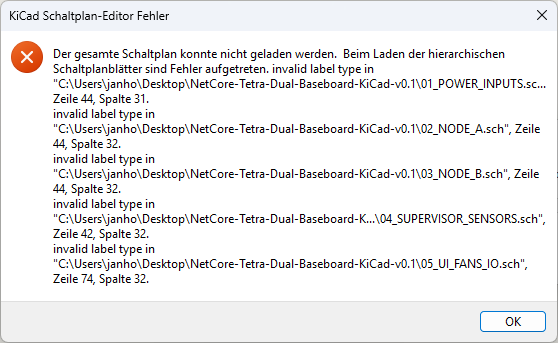
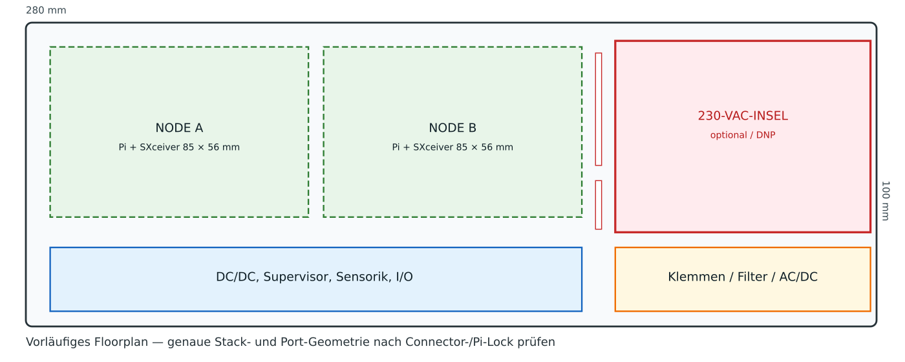
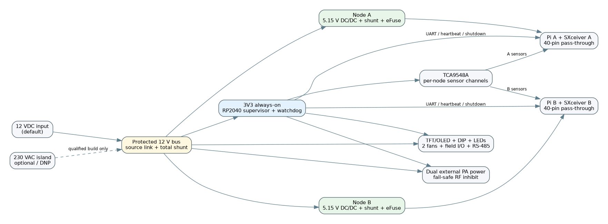
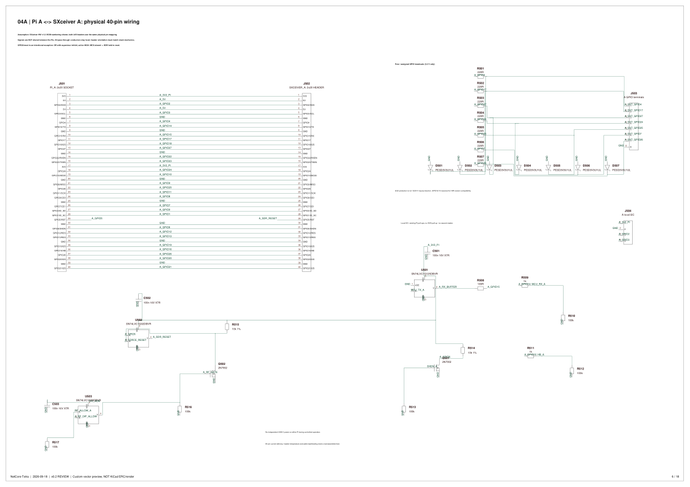

# Entwicklungsnotizen: Dual-Baseboard, 230-V-Gesamtschaltplan und PCB-Footprints

**Archivhinweis, 09.10.2026:** Diese Datei dokumentiert das im Titel beziehungsweise Quellenrahmen genannte Gespräch und dessen damalige Entscheidungen. Historische Kommandos, Planungen, Versionsangaben und Fehlerbilder bleiben erhalten; der heutige technische Stand steht in der [Gesamtroadmap](../roadmaps/gesamtroadmap.md) und in den [aktuellen Dienstanleitungen](../services/README.md). Die Archivaufnahme bestätigt keine spätere Implementierung oder Live-Abnahme.

## 1. Rahmen und belastbarer Endstand

| Feld | Stand |
|---|---|
| Projekt | NetCore-Tetra; Trägerplatine für zwei Raspberry-Pi-/SXceiver-Knoten mit Versorgung, Supervisor, Sensorik und Bedienung |
| Archiv erstellt | **2026-10-06**, Projektzeitzone Europe/Berlin |
| Historischer Zeitraum | Entwurfsnotizen ab 2026-09-17; technische Fortsetzung 2026-09-18 bis 2026-09-22; zusätzliche Prüfung am 2026-10-06 |
| Geprüftes Repository | [JanHG98/netcore-tetra](https://github.com/JanHG98/netcore-tetra) |
| Dokumentationsbranch | **`Archiving`** |
| Geprüfter Repository-Basiscommit | [`d048a85f801ef2d51107a928a5326788bc35ce48`](https://github.com/JanHG98/netcore-tetra/commit/d048a85f801ef2d51107a928a5326788bc35ce48), vor Aufnahme dieses Archivs |
| Letzter zugänglicher CAD-Stand | **v0.3.3**, je eine `.kicad_sch` und `.kicad_pcb` |
| Ablage der Dokumentation | `Docs/archive/`; Originaldateien, Bilder und neue Prüfberichte im [zugehörigen Assetordner](assets/2026-10-06_kicad-dual-baseboard-230v/) |

**Historischer Arbeitsstand:** Ein einzelner Gesamtschaltplan mit 496 Bauteilpositionen und ein dazugehöriger, ungerouteter PCB-Arbeitsstand mit 487 Footprints wurden bereitgestellt. Von ursprünglich 76 fehlenden Footprints wurden 67 ergänzt; **neun bleiben offen**. Die vorläufige Platinenkontur beträgt **280 × 180 mm**. Eine fertigbare oder für Netzspannungsbetrieb freigegebene Baugruppe entstand im belegbaren Verlauf nicht.

**Ergänzung vom 2026-10-06:** Die finalen Originaldateien wurden wiederbeschafft, strukturell ausgewertet und mit KiCad CLI **10.0.6** geladen. Ein nativer Netzlistenexport gelang. Der ERC meldete **11 Fehler und 1.404 Warnungen**. Der DRC meldete **499 unverbundene Elemente sowie 610 Warnungen**. Diese neuen Befunde sind getrennt vom historischen Prüfstand in Abschnitt 8 dokumentiert. Es wurden keine Schaltungs-, Footprint- oder Layoutreparaturen am Original vorgenommen.

## 2. Quellenumfang, Herkunft und Statusbegriffe

Drei Arbeitsgrundlagen werden getrennt:

1. **Historische Entwurfsnotizen:** technische Fortsetzung vom 18.09.–22.09.2026; die frühe Entwicklung ist nur teilweise rekonstruierbar.
2. **Originalartefakte:** sieben Fehlerscreenshots, drei Entwurfsgrafiken, Pakete v0.1.1/v0.2 und finales v0.3.3-Dateipaar. README-, Änderungs-, Pinmapping- und Review-Dateien liefern ergänzende Anforderungen und Befunde.
3. **Prüfung vom 06.10.2026:** Repository-Sichtung sowie strukturelle und native KiCad-Prüfungen. Diese neuen Befunde gelten nicht rückwirkend als historische Testergebnisse.

| Status | Bedeutung in diesem Dokument |
|---|---|
| **Idee** | Erwogenes Konzept ohne endgültige Festlegung oder Umsetzung |
| **Beschlossen** | In den erhaltenen Entwurfsnotizen ausdrücklich verlangt/korrigiert oder als Entwurfsentscheidung im Paket dokumentiert; die Herkunft wird genannt |
| **Implementiert** | In einer zugänglichen Datei oder im geprüften Quellcode vorhanden; kein Funktionsnachweis allein durch Existenz |
| **Getestet – statisch** | Parser-, Struktur-, Dateiintegritäts- oder Quellenprüfung mit benanntem Umfang |
| **Getestet – KiCad nativ** | Tatsächlich ausgeführter Import/Export/ERC/DRC; Befunde und Prüfumgebung werden angegeben |
| **Im Betrieb bestätigt** | Reale Baugruppe, Versorgung, Last, RF-Pfad oder Softwareintegration mit konkretem Mess-/Betriebsbeleg; für dieses Baseboard **nicht belegt** |

Fortschrittsanzeigen, Simulationserwähnungen ohne Ergebnisartefakt, generierte Vorschaugrafiken und frühere unbelegte Zusicherungen werden nicht als Hardware- oder Simulationserfolg gewertet. Spätere ausdrückliche Korrekturen haben Vorrang. Die Quellenlücken stehen in Abschnitt 12.

## 3. Ziel, Ausgangslage und Entwicklung der Dateiformate

Ziel war eine konkret weiterbearbeitbare KiCad-Unterlage für eine gemeinsame Trägerplatine mit zwei Pi-/SXceiver-Stacks. Versorgung, Überwachung, Sensorik, Display, Lüfter und Feld-I/O sollten nachvollziehbar verbunden sein. Die frühen Funktionsblöcke und Platzhalter wurden durch die Anforderungen an echte Einzelbauteile, vollständige GPIO-Verbindungen und eine diskrete 230-V-Versorgung abgelöst. Maßgeblich sind **eine Gesamtschaltplandatei ohne Unterblätter** und eine dazugehörige PCB-Datei.

### 3.1 Versionsfolge und Ablösung früherer Aussagen

| Stand | Inhalt und Änderung | Beleg und Grenze |
|---|---|---|
| Frühes v0.1-Konzept | Legacy-`.sch`, Root plus fünf Funktionsblätter; zwei Pi-Stacks; RP2040-Supervisor; 12-V-Eingang; optionales/DNP-Netzteilmodul; vorläufig 280 × 100 mm; zwei als 10-A-Klasse bezeichnete 5-V-Zweige | Aus den in v0.1.1 erhaltenen ursprünglichen Dokumenten rekonstruiert. Kein vollständiger früher Dialog; keine belastbare Strom- oder Platzfreigabe. |
| **v0.1.1** | Reparatur der Legacy-Labelsyntax, Symbolcache und Titelblöcke; 92 Bauteile/Funktionsblöcke, 49 Bibliothekssymbole, 514 globale Labels und 609 Drahtsegmente laut Paketbericht | Fehlerbilder und Originalpaket vorhanden. Statische Strukturprüfung; damals kein nativer KiCad-Ladetest. Die alte PCB war nicht mit diesem Schaltplan synchronisiert. |
| **v0.2** | Modernes `.kicad_sch`; 17 Detailblätter plus Übersicht, 18-seitige PDF; 496 Bauteile, 1.594 Symbolpins, 2.856 Drahtsegmente; diskretes AC/DC und konkreter Supervisor; detaillierte Pi/SXceiver-Netze | Original-ZIP samt Generator, Validator, BOM und Review-Dokumenten vorhanden. PDF und Vorschauen stammen aus dem Generator und beweisen keinen KiCad-Import. |
| **v0.3** | Zusammenführung zu einem einzelnen Gesamtschaltplan ohne Hierarchie; im damaligen Bericht 496 Bauteile, 1.594 Pins, 2.856 Drahtsegmente, 51 eingebettete Symboldefinitionen | In den Entwurfsnotizen dokumentiert; elektrische Topologie gegenüber v0.2 laut Entwicklungsnotiz nicht neu ausgelegt. |
| **v0.3.1 / 230 V** | Ausdrückliche Korrektur: 230 V AC mit üblicher Toleranz statt der zuvor missverstandenen 130-V-Anforderung; Anforderung auf 230 V ±10 %, 50 Hz berichtigt | Anforderungs-/Beschriftungskorrektur; kein daraus ableitbarer Neuauslegungs- oder Netzspannungsnachweis. |
| **v0.3.2 / erste PCB** | 420 von 496 Positionen, 1.267 Pads, 349 Quellnetze; vier 40-polige Pi/SXceiver-Stecker; 280 × 180 mm vorläufige Kontur; null Leiterbahnen/Vias/Kupferflächen; 76 fehlende Footprints | Entwicklungsnotiz zum Projekt-ZIP `NetCore-Tetra-KiCad-mit-PCB-v0.3.2.zip` und zur PCB `NetCore-Tetra-Gesamtschaltplan-v0.3.1-230V.kicad_pcb`. Diese Zwischenstände wurden hier nicht zusätzlich heruntergeladen und nativ geprüft. |
| **v0.3.3 / letzter Stand** | 67 Footprints ergänzt, 487 vorhanden, neun offen; J703-Schirm ergänzt; C1306 korrigiert; weiterhin ein Gesamtschaltplan und ungeroutete PCB | Beide Originaldateien archiviert und am 2026-10-06 erneut geprüft. Abschnitt 8 enthält die tatsächlichen aktuellen Zählwerte. |

### 3.2 Verbindliche Korrekturen für eine Fortsetzung

| Frühere Aussage/Variante | Maßgeblicher späterer Stand | Begründung bzw. Konsequenz |
|---|---|---|
| Fertige Module/Funktionskästen genügen | **Diskrete, konkret angeschlossene Bauteile**; einschließlich AC/DC, Supervisor und Pi-GPIO-Pfaden | Ausdrückliche Anforderung ab v0.2. Ein Modulkonzept darf nicht stillschweigend als Erfüllung ausgegeben werden. |
| Hierarchischer Mehrblattschaltplan | **Eine Gesamtdatei ohne Unterblätter** | Ausdrücklicher Wunsch für v0.3 und spätere Fassungen. |
| 130 V oder universeller Netzeingang als Ziel | **230 V AC ±10 %, entsprechend 207–253 V RMS bei 50 Hz** | Explizite Korrektur. 110/130 V und Universalbetrieb sind keine finalen Anforderungen. Der externe 12-V-DC-Pfad bleibt bestehen. |
| RP2040 als Supervisor/Modul | **STM32F103CBT6** als diskreter Controller mit Nebenbeschaltung | Umsetzung im späteren Schaltplan; frühes Architektur-PNG ist überholt. |
| Zwei belastbar freigegebene 10-A-Pi-Ausgänge | **TPS56637, 6-A-Klasse; rechnerisch 4,5 A je Gesamtstack vorgesehen** | Die frühere Zusicherung wurde zurückgenommen. IC-Nennklasse ist keine Dauerstromfreigabe der Platine. |
| 280 × 100 mm als ausreichendes Board | **Maximalbreite 300 mm als Anforderung; 280 × 180 mm nur Arbeitskontur** | Kein abgeschlossener Platz-, Kühlungs-, Montage- oder Isolationsnachweis. |
| PA-Leistung wird über diese Platine geschaltet/versorgt | **PA-Anschlüsse als Enable-/Steuersignale** | Kein belegter PA-Leistungsversorgungspfad in der finalen Abgrenzung. |
| RF-ADC allein genügt für HF-Leistungsmessung | ADC erwartet **aufbereitete Messsignale** | Richtkoppler, Detektor und Kalibrierung sind externe offene Bestandteile. |
| Alle 76 Footprints seien behoben | **67 ergänzt, neun weiter offen** | Letzte Entwurfsnotiz und tatsächliche Dateizählung stimmen in diesem Punkt überein. |

Die früheren Bilder und Dateien bleiben als historische Belege erhalten, werden aber nicht als aktuelle Fertigungsunterlagen dargestellt.

## 4. Architektur, Komponenten und elektrische Schnittstellen

### 4.1 Funktionsaufteilung des späteren Entwurfs

| Bereich | Historisch dokumentierter bzw. in CAD vorhandener Inhalt | Abhängigkeiten/offene Punkte |
|---|---|---|
| Versorgung | Diskretes isoliertes AC/DC nach DER-993 als Entwurfsreferenz; alternativer 12-V-DC-Eingang; Always-on-/Hilfsspannungen; zwei separat schaltbare Pi-Zweige | Netzteilrekonstruktion, Quellenumschaltung/ORing, Einschaltstrom, Schutz und reale Last müssen überprüft werden. Frühe manuelle, gegenseitig ausschließende Quellenlinks sind nicht mit geprüftem automatischem ORing gleichzusetzen. |
| Pi-Zweige A/B | Je TPS56637RPAR, TPS259474L-eFuse, Strommessung mit INA226 und 2-mΩ-Kelvin-Shunt laut v0.2-Unterlagen | Ca. 5,15 V Ausgang als Entwurfsziel; beide vollständigen Stacks gemeinsam thermisch und dynamisch prüfen. |
| Supervisor | STM32F103CBT6, Quarz, Abblockung, Boot/Reset, USB, SWD, TPS3828-33-Watchdog | Kein belegtes ausführbares Firmwareprojekt; Startzustände, Watchdogzeiten, Power-Cycle-Logik und Protokoll fehlen als abgenommene Implementierung. |
| I²C-Verteilung | TCA9548A, Pull-ups/Adressplanung; drei MCP23017 für zusätzliche I/O | Managementbus und lokale Pi-Busse nicht unbeabsichtigt verbinden; reale Adressen und Spannungsdomänen verifizieren. |
| Sensorik | Je Knoten TMP117, SHT45, ADS1115 und NTC-Pfade; Strom-/Spannungsmessung | Bestückte Sensoren, Messbereiche, Pull-ups, Kalibrierung und Fehlererkennung stehen aus. |
| Bedienung | TFT NHD-2.4-240320CF-BSXV-FT; 20-poliger FPC, 1-mm-Raster; TSC2046-Touch; vier Vorwiderstände für Hintergrundbeleuchtung | J1301-Lötbild offen. Pin 20 ist LED-Anodenversorgung und kein normaler Logikpin. Optionales OLED ist nur ein 3,3-V-I²C-Anschluss. |
| Lüfter | Zwei vieradrige Lüfteranschlüsse, Open-Drain-PWM und Tachosignale | Lüftertypen, Pegel, Anlaufstrom und Ausfallreaktion prüfen. Das frühe Konzept nannte EMC2302; dessen Nennung allein ist keine Firmware-/Regelungsfreigabe. |
| Feld-I/O | Vier Optokopplereingänge für **12–24 V**, vier 12-V-MOSFET-Ausgänge, dokumentiert je 0,5 A und gemeinsam 2-A-Sicherung | Nicht als universelle 5-V-Eingänge behandeln; Stromangaben sind Entwurfswerte ohne Lastprüfung. |
| RS485 | THVD1450, Abschluss und TVS | **Nicht galvanisch isoliert**; Busbezug, Transienten und Installation gesondert prüfen. |
| Alarm | G5V-1-Relais für dokumentierte SELV-Last bis 24 V / 0,5 A; aktiver magnetischer Summer | Kein Netzspannungs-Schaltkontakt freigegeben; BZ1701-Footprint fehlt. |
| RF/PA | Reset/Inhibit, PA-Enable und Anschlüsse für konditionierte Messwerte | Kein fertiger HF-Detektor, keine PA-Leistungsversorgung und kein bestätigter Sender-Sicherheitskreis. |

**Gemeinsame Ausfallursache:** Ein gemeinsamer Supervisor und gemeinsame vorgeschaltete Versorgung ergeben noch keine vollständige Redundanz. Supervisor-Reset oder Versorgungsfehler können beide Knoten beeinflussen. Default-Off für Versorgung/RF ist als Entwurfsabsicht dokumentiert, aber ohne Firmware und Hardwaremessung nicht als nachgewiesenes Verhalten eingestuft.

### 4.2 Pi-/SXceiver-Verbindungen und Pinbelegung

Pro Knoten sind zwei 40-polige Anschlüsse vorgesehen: zum Raspberry Pi und zum SXceiver. Über beide Knoten gibt es damit vier 40-polige Steckverbinder. **39 Kontakte je Verbindung sind direkt geführt; BCM GPIO5, physischer Pin 29, wird über die aktive High-Reset-/Inhibit-Logik geführt.** Die Vorschau ist im [Pi/SXceiver-Bild](assets/2026-10-06_kicad-dual-baseboard-230v/Pi_SXceiver_Wiring.png) erhalten.

| BCM-/Headerbereich | Historische Funktion bzw. Reservation | Einordnung |
|---|---|---|
| BCM 8–11 | SPI0 zum SXceiver | SPI-Signalführung und reale HAT-Version beachten. |
| BCM 18–21 | I²S/PCM | Audio-/IQ-Interface; keine frei verfügbaren Zusatz-I/O. |
| BCM 5 / physisch 29 | SXceiver-Reset über OR-/Inhibit-Logik | Aktive-High-Verhalten wurde aus SoapySX abgeleitet; geprüfter Quellcodeabgleich in Abschnitt 9. |
| BCM 22/23 | TX/RX bei neuerer Hardware | Alte Hardware benutzt 12/13; keine versionsunabhängige Freigabe dieser Pins. |
| BCM 0/1 | HAT-ID/EEPROM | Reserviert. |
| BCM 14/15 | UART | Mögliche Managementverbindung im Entwurf; kein abgenommenes Softwareprotokoll. |
| BCM 6 / physisch 31 | Heartbeat | Historische Planungszuordnung, kein Firmwarebeleg. |
| BCM 16 / physisch 36 | Shutdown-Signal | Historische Planungszuordnung; Ablauf und Timing offen. |
| BCM 2/3 | Lokales Pi-I²C | A, B und Management nicht unkontrolliert zusammenschalten. |
| BCM 4 | Mögliche 1-Wire-Nutzung | Kein fertig integrierter DS18B20-/Pull-up-/Treiberpfad nachgewiesen. |
| BCM 17/27/24/25/7/26 | In frühen Unterlagen als weitere geschützte GPIO-Pfade behandelt | Vor Nutzung mit finaler Netzliste, realer HAT-Revision und Linux-Belegung abgleichen; keine pauschale Freigabe. |
| Headerpins 2/4 | Pi-5-V-Einspeisung | Quelle eindeutig festlegen; keine parallele USB-C-Speisung oder USB-PD-Funktion aus dem Entwurf ableiten. |

Die v0.2-Datei `docs/PI_HEADER_NETS.csv` enthält die ausführliche Netzzuordnung. Das ZIP ist verlinkt und unverändert erhalten. Die Entwurfsannahme war SXceiver-Hardware v1.2; das genaue Pi-Modell, die reale HAT-Revision, Steckhöhe, Steckrichtung und Kollisionsfreiheit waren nicht abschließend bestätigt. Die 5-V-/3,3-V-Domänen der Knoten bleiben voneinander und von Managementsignalen zu unterscheiden; daraus folgt keine pauschale galvanische Isolation des gesamten Boards.

### 4.3 Betriebsarten und noch fehlende Firmware

Die frühen Paketunterlagen beschreiben einen DIP-Plan: Bits 1–2 `00 LOCAL`, `01 HYBRID`, `10 RECOVERY`, `11 SERVICE`; Bit 3 RF-Inhibit; Bit 4 Konfigurationssperre; Bits 5–8 vier Bit Knoten-ID. Dies ist eine **historische Planungszuordnung**, keine im zugänglichen STM32-Firmwarestand bestätigte Bedienfunktion.

Für Heartbeat, Shutdown, Power-Cycle, Lüftersteuerung, Sensorfehler, RF-Freigabe und lokale Bedienung fehlen belastbare Firmware-/Protokollnachweise. RTC, USV oder Energiepuffer wurden nicht als fertige Ergänzungen belegt. Ein geordnetes Herunterfahren bei abruptem Versorgungsausfall ist damit nicht bestätigt.

## 5. Versorgungsauslegung und Bauteilkorrekturen

### 5.1 AC/DC-Referenz und Grenzen der Rekonstruktion

Als historische Entwurfsquelle wurde **Power Integrations DER-993**, isolierter Flyback mit **INN4275C-H186**, nominal **12 V / 6 A / 72 W** verwendet. Die Referenz behandelt 90–265 V AC; das endgültige Projektziel wurde später ausdrücklich auf 230 V AC mit üblicher Toleranz begrenzt. Die Kenndaten der Referenz sind weder eine Prüfung des rekonstruierten Schaltplans noch eine Freigabe des kombinierten NetCore-Boards.

Im damaligen Verlauf waren insbesondere Original-Schaltbild und Wicklungsdarstellung nicht vollständig visuell verifiziert. Offen blieben Primärklemme, Bias-/OVP-Pfad, Synchrongleichrichtung und SR-Snubber, Brückengleichrichter-Pinbelegung und magnetische Phasenlage. Der historische Vergleich von 44 Netzteilpositionen nach Wert/Typ mit einer BOM ersetzt keinen vollständigen Topologieabgleich.

Die Primärseite `HV_NEG`/Hochvoltbus, sekundäre Controller-Masse `SEC_GND`, Last-Rückleitung über Strommesspfade und `PE_CHASSIS` sind funktional zu unterscheiden. Ein Umbenennen oder Zusammenlegen allein zur Beseitigung von ERC-Meldungen wäre keine belastbare Reparatur. Der geprüfte ERC enthält ausdrücklich auch einen Befund zu `PE_CHASSIS`.

### 5.2 Historische T101-Spezifikation – offen, nicht als Bauanweisung freigegeben

Das v0.2-Paket enthält `docs/TRANSFORMER_SPEC.md`. Für eine spätere fachliche Prüfung bleiben dessen Angaben erhalten:

| Merkmal | In den historischen Unterlagen angegebener Wert |
|---|---|
| Bezeichnung | `CUSTOM-DER993-T1`; kundenspezifische Referenz, keine verifizierte beschaffbare Katalognummer |
| Induktivität | 519 µH ±5 %, Messangabe 100 kHz / 1 Vpp; Streuinduktivität höchstens 11 µH |
| Kern/Spulenkörper | PQ2620, PC95; PQ2628-Spulenkörper mit sechs Pins laut Referenzunterlage |
| Primärwicklung | 21 Windungen AWG27, Pin 6 → 4; weitere 21 Windungen AWG27, Pin 4 → 5; insgesamt 42 |
| Bias | Acht Windungen, vierfach AWG36, Pin 2 → 3 |
| Sekundär | Zwei parallele Wicklungen FL1 → FL2 mit je fünf Windungen, je zwei parallele AWG23-Leiter mit dreifacher Isolation |
| Schirmangaben | Acht Windungen vierfach AWG36 sowie elf Windungen vierfach AWG34, jeweils Bezug Pin 3, anderes Ende isoliert |
| Zusammenfassung im Bauteilwert | 42:5:8 Windungen; mechanische Anschlusszeichnung fehlt weiterhin |

Diese Angaben wurden **als historische Spezifikation archiviert**, nicht neu beim Hersteller bestätigt oder auf Wickelsinn, Isolation, Abstände, Fertigbarkeit und Zulassung freigegeben. Die Verifikation am Original-Referenzdesign und an einer verbindlichen Wickel-/Mechanikzeichnung bleibt zwingender Entwicklungsschritt.

### 5.3 Leistungsbudget und Schutzschwellen

Das v0.2-Dokument `docs/POWER_BUDGET.md` rechnet mit **5,15 V × 4,5 A = 23,18 W pro vollständigem Pi/SXceiver-Stack**. Für beide Zweige ergeben sich bei angenommenen 90 % Wandlerwirkungsgrad etwa **51,5 W** aus 12 V. Mit angenommenen 3 W Management und 6 W Lüftern sind es etwa **60,5 W**, noch ohne alle Verluste, Reserven und zusätzlichen Aktorlasten. Das ist eine Planungsrechnung; thermische Dauerlast und reale Spitzenströme wurden nicht gemessen.

Weitere in den Unterlagen erhaltene Entwurfswerte:

- Externer DC-Eingang 12 V ±5 %; kein Automotive-/Load-Dump- oder Ladegerätedesign belegt.
- eFuse-Strombegrenzung mit `RILM = 604 Ω`, aus der dokumentierten Formel nominal ungefähr `3334 / 604 ≈ 5,52 A`; keine Zusicherung eines zulässigen Dauerlaststroms.
- OVLO-Teiler `34,8 kΩ / 10 kΩ`, dokumentiert ungefähr **5,376 V**; kein präziser 5,25-V-Clamp. Toleranzen, Einschaltstrom, Leitungsverluste und Verhalten an realer Last fehlen als Prüfergebnis.
- Frühe 5-mΩ-Shunts und Zwei-mal-10-A-Aussagen wurden durch die spätere Auslegung mit 2-mΩ-Kelvin-Shunts und konservativerem Budget überholt.

### 5.4 Relevante Fehlerkorrekturen an Symbolen und Teilen

| Gegenstand | Dokumentierte Korrektur | Verbleibende Grenze |
|---|---|---|
| L102/L103 | Unzutreffende SMD-Zuordnung für bedrahtete Drosseln zurückgenommen | Herstellermechanik und finale Lötbilder prüfen. |
| C113 | Ungeeigneter 0603-Footprint für radialen Sicherheitskondensator entfernt; AY1-/Y1-/X1-Typangaben in Unterlagen | Sicherheitsklassifikation und konkrete Bestellvariante nicht allein aus Text oder einem generischen Footprint übernehmen. |
| Dioden/Gleichrichter | Unbelegte Gehäusezuordnungen entfernt bzw. offengelassen | BR101/BR102 bleiben ohne Footprint. |
| C102 | MPN von versehentlich hineingeratenen Maßangaben bereinigt | Exakte Variante `ERK2GM680K30OT`, 68 µF / 400 V, mechanisch noch nicht bestätigt. |
| G5V-1-Relais | Spule Pins 2/9, COM 5/6, NC 1, NO 10 nach dokumentierter Unteransicht | Vor Layout mit Datenblattansicht und konkretem Relais abgleichen. |
| NTC | TDK NTCG163JF103FT1, B25/50 = 3380 anstelle pauschal 3950 | Kennlinie und Auswertung nicht als kalibriert nachgewiesen. |
| SHT45 | Bare-Sensor-Pins 1 SDA, 2 SCL, 3 VDD, 4 VSS statt Übernahme einer Evaluationskabel-Belegung | Footprint-/Pin-1-Orientierung und Beschaltung prüfen. |
| Summer | Passives Piezo-Konzept durch aktiven magnetischen PUI AI-1223-TWT-3V-2-R ersetzt; dokumentiert 2–4 V / 30 mA | BZ1701 bleibt ohne bestätigtes Anschlussmaß. |
| **J703, v0.3.3** | USB-Schirm als zusätzlicher Symbolpin 6 mit GND verbunden; bestehende fünf Pins laut Änderungsbericht erhalten | Kein EMV-/Schirmkonzept durch die bloße Netzzuteilung nachgewiesen. |
| **C1306, v0.3.3** | 47 µF / 10 V, EEU-FR1A470, durch **47 µF / 25 V, Panasonic EEU-FR1E470**, ersetzt | Endgültige Geometrie, Einbau und elektrische Eignung weiter im Gesamtentwurf prüfen. |

## 6. Finale Footprint-Lage und PCB-Arbeitsstand

### 6.1 Was v0.3.3 tatsächlich enthält

Ergänzt wurden insbesondere Lötbilder für Pi-Spannungswandler und eFuses, Temperatur-/Feuchtesensoren, Klemmen, Sicherungen, Kondensatoren, Induktivitäten, USB-, Lüfter- und Bedienanschlüsse. Die 487 vorhandenen PCB-Referenzen haben im Schaltplan jeweils denselben Footprint-Bezeichner. Die neun Referenzen ohne PCB-Footprint haben auch im Schaltplan ein leeres Footprint-Feld.

U101 ist nun als `NetCore_033:PI_InSOP24D_SourceAliases` zugeordnet. Der im historischen Stand beschriebene InSOP-24D-Ansatz modelliert 17 physische Anschlüsse; logische Source-Pins 16–19 bilden zusammenhängende Teilflächen eines gemeinsamen Source-Anschlusses. Dokumentiert sind 1,58 × 0,41 mm für normale Landflächen, 0,75 mm Raster, 1,58 × 2,81 mm für den breiten Source-Bereich sowie 10,8 × 9,4 mm Körpermaß. Dies ist eine aus Gehäusedaten abgeleitete Konstruktion, keine geprüfte Paste-, Wärme-, Kriechstrecken- oder Hersteller-Landpattern-Freigabe.

Die Übernahme der bereits vorhandenen 420 Footprints bestätigt nicht automatisch deren Herstellerzuordnung. Das Ergänzen der 67 fehlenden Lötbilder beseitigt die übrigen elektrischen, mechanischen und sicherheitsbezogenen Review-Aufgaben nicht.

### 6.2 Die neun offenen Positionen

| Referenz | Schaltplanwert/gewählter Typ | Was für eine belastbare Ergänzung fehlt |
|---|---|---|
| **T101** | CUSTOM-DER993-T1, 519 µH, 42:5:8 | Verbindliche Wickel-, Anschluss-, Polaritäts- und Mechanikzeichnung inklusive FL1/FL2 |
| **L101** | Sumida 04291-T231 / 18 mH | Herstellerzeichnung, Anschlussabstände und Wicklungs-/Pinpolarität |
| **BR101, BR102** | Z4DGP408L-HF | Genaues Gehäuse und Landpattern; im Entwurf verwendete Zuordnung 1 = Plus, 2/3 = AC, 4 = Minus gegen Original prüfen |
| **Q101, Q102** | SRT15N110L | Exakte Gehäuse-/Padgeometrie einschließlich gemeinsamem Source-/Drain-Anschluss und Pinansicht |
| **C102** | 68 µF / 400 V, ERK2GM680K30OT | Maß-/Rasterbestätigung der konkreten Bestellvariante |
| **J1301** | Molex 52271-2069, 20-poliger FFC/FPC-Stecker | Hersteller-Landpattern, Kontaktseite, Verriegelung und Orientierung zum TFT |
| **BZ1701** | PUI AI-1223-TWT-3V-2-R | Belastbare Anschlussmaße, Polarität und Körperkontur |

Diese neun Teile sind im Schaltplan vorhanden, aber **nicht als physische Bauteile im PCB**. Beim geprüften Netzlistenvergleich betreffen sie 60 Symbolpins, darunter zwei ausdrücklich unbeschaltete T101-Pins.

### 6.3 Routing, Mechanik und Fertigungsdaten

Die PCB hat **keine Leiterbahnsegmente, keine Vias und keine Kupferzonen**. Die Netzzuweisung erzeugt Luftlinien, keine leitenden Verbindungen. Vier `Edge.Cuts`-Linien umschließen `(20,20)` bis `(300,200)` mm, entsprechend **280 × 180 mm**. Die Koordinate 300 mm ist nicht mit einer 300-mm-Platinenbreite zu verwechseln.

Platzierung und Funktionsbereichsgrenzen sind Arbeitsstände. Ein Vierlagen-/2-oz-Konzept aus der frühen Planung ist keine bestätigte Stackup-, Stromtragfähigkeits- oder Kühlungsfreigabe. Nicht belegt sind vollständige Montage, Durchführungen, Steckhöhen, Gehäuse, Netzteil-Abstände, Wärmeableitung, geprüfte 3D-Modelle sowie Gerber-/Bohrdaten aus einem freigegebenen Gesamtboard.

## 7. Fehlerbilder, Diagnose und historisch verwendete Abläufe

### 7.1 Legacy-Fehler „invalid label type“

Sieben originale Screenshots dokumentieren echte KiCad-Ladefehler des frühen Projekts. Ursache laut v0.1.1-Änderungsbericht: Der Generator verwendete elektrische Pin-Typen an Stellen, an denen Legacy-Schaltplan-Labeltypen erwartet wurden.

| Korrektur | Zahl der Ersetzungen |
|---|---:|
| `PowerInput` → `Input` | 109 |
| `PowerOutput` → `Output` | 35 |
| `Passive` → `UnSpc` | 10 |
| **Gesamt** | **154** |

Die Verteilung über `01_POWER_INPUTS.sch`, `02_NODE_A.sch`, `03_NODE_B.sch`, `04_SUPERVISOR_SENSORS.sch` und `05_UI_FANS_IO.sch` beträgt laut Bericht 32/21/21/31/49. Zusätzlich wurden ein Cache mit 49 Symboldefinitionen und korrigierte Titelblöcke beigelegt. Netz-, Draht-, Pin-, Wert- und Positionsänderungen waren für diese Syntaxreparatur nicht vorgesehen. Die damalige PCB blieb unverändert und unsynchronisiert.

Das Paket enthält `CHANGELOG.md`, `LABEL_FIXES.json`, `format_fix.patch`, ursprüngliche Dokumente und die Strukturprüfung. **Die Reparatur ist als Dateiinhaltsänderung und statischer Bericht belegt; ein historischer erfolgreicher KiCad-Ladetest von v0.1.1 ist nicht belegt.** Die geprüften nativen Prüfungen betreffen v0.3.3, nicht nachträglich das Legacy-Paket.

### 7.2 Öffnungs-, Generierungs- und Prüfanweisungen

| Ablauf/Befehl | Historischer oder geprüfter Status |
|---|---|
| v0.1.1 vollständig in einen neuen Ordner entpacken, Root-`.sch` im Schaltplaneditor öffnen; Bibliothek, Cache und Symboltabelle beibehalten; erst danach in neues Format speichern | Historisch empfohlener Reparaturablauf; kein belegter erfolgreicher Retest |
| `python validate_structure.py` im v0.1.1-Paket | Historischer statischer Prüfbericht vorhanden; bei der Bestandsaufnahme nicht erneut ausgeführt |
| `python tools/validate_schematic.py` im v0.2-Paket | Historischer Struktur-/Konnektivitätsbericht; keine SPICE-/ERC-/DRC- oder Hardwarefreigabe |
| `python tools/generate_schematic.py <neuer-ausgabeordner>` | Mitgelieferter Generator, Python 3.10+ und ReportLab laut Paket; bei der Bestandsaufnahme nicht ausgeführt und nicht über die Originale laufen gelassen |
| Finale `.kicad_sch` und `.kicad_pcb` gemeinsam in einen neuen Arbeitsordner legen | Historische Anweisung; eingebettete Symbole und Footprint-Geometrien erhalten die vorhandenen Objekte. Bibliothekstabellen für Bearbeitung/Verknüpfungsprüfungen sind gesondert einzurichten. |
| Native ERC-, DRC- und Netzlistenbefehle aus Abschnitt 8 | Am 2026-10-06 tatsächlich ausgeführt; Export erfolgreich, ERC/DRC mit Befunden |

Historische Prüfgrenze: KiCad war nicht nutzbar; ein Installationsversuch scheiterte laut Entwicklungsnotiz an Netzwerk-/DNS-Zugriff. Es wurde weder ein erfolgreiches SPICE-Modell noch ein Hardwaretestprotokoll nachgewiesen.

## 8. Neu ausgeführte Archivprüfungen vom 2026-10-06

### 8.1 Integrität und strukturelle Zählung

Beide ZIPs bestanden die CRC-Integritätsprüfung. Die finalen CAD-Dateien wurden mit einem separaten S-Expression-Parser ausgewertet. Ihre SHA-256-Werte blieben vor und nach der nativen Prüfung identisch. Bilder wurden anhand ihrer tatsächlichen PNG-Daten und visuell geprüft; es handelt sich um Originaldateien, nicht um nachgezeichnete Ersatzbilder.

| Gegenstand | Tatsächlicher Befund v0.3.3 |
|---|---:|
| Schaltplan-Bauteilinstanzen | 496 |
| Eingebettete Symboldefinitionen | 52 |
| Drahtsegmente im Schaltplan | 2.857 |
| Hierarchische Unterblätter | 0 |
| PCB-Footprints | 487 |
| Physische PCB-Padobjekte | 1.568 |
| Benannte PCB-Netze | 349; zusätzlich leeres Netz 0, insgesamt 350 Deklarationen |
| Leiterbahnen / Vias / Zonen | 0 / 0 / 0 |
| Fehlende PCB-Referenzen | Genau die neun aus Abschnitt 6.2 |
| Zusätzliche unbekannte PCB-Referenzen | 0 |
| Abweichende Footprint-Bezeichner zwischen Schaltplan und vorhandenen PCB-Objekten | 0 |

Die geprüften 52 Symboldefinitionen, 2.857 Drahtsegmente und 1.595 exportierten Symbolpins beziehen sich auf **v0.3.3**. Die älteren Angaben 51/2.856/1.594 gehören zum vorherigen Stand; die zusätzliche USB-Schirmverbindung ist als spätere Änderung dokumentiert.

### 8.2 Nativer KiCad-Aufruf und Prüfumfang

Ausgeführt wurde KiCad CLI **10.0.6** an einer separaten Kopie der beiden Originaldateien. Es wurde kein Schaltplan und keine PCB gespeichert oder automatisch repariert. Die originale Dateipaar-Lieferung enthält keine vollständig eingerichtete Projekt-/Bibliotheksumgebung für diese lokale Installation. Die Prüfungen nutzten deren vorhandene Regeln/Defaults; nicht alle optionalen Prüfarten sind aktiv. Die JSON-Berichte nennen unter `ignored_checks` die deaktivierten Prüfarten. Insbesondere wurde keine vollständige projektbezogene Schematic-Parity- oder Netzspannungs-Regelprüfung durchgeführt.

Die folgenden Befehle sind tatsächlich ausgeführt worden; die Ausgabeziele bezeichnen neue Berichte:

```powershell
& 'C:\Program Files\KiCad\10.0\bin\kicad-cli.exe' sch erc --format json --severity-all --exit-code-violations -o native-erc-20261006.json NetCore-Tetra-v0.3.3-230V.kicad_sch
& 'C:\Program Files\KiCad\10.0\bin\kicad-cli.exe' pcb drc --format json --severity-all --exit-code-violations -o native-drc-20261006.json NetCore-Tetra-v0.3.3-230V.kicad_pcb
& 'C:\Program Files\KiCad\10.0\bin\kicad-cli.exe' sch export netlist --format kicadxml --output native-netlist.xml NetCore-Tetra-v0.3.3-230V.kicad_sch
```

Beide CAD-Dateien konnten vom nativen Werkzeug geladen werden. Der Netzlistenexport endete mit Exitcode 0. ERC und DRC endeten jeweils mit **Exitcode 1 wegen der gemeldeten Befunde**. Das ist kein fehlerfreier ERC-/DRC-Abschluss. Eine grafische Gesamtansicht oder 3D-Montage wurde dadurch nicht abgenommen.

### 8.3 ERC: 11 Fehler, 1.404 Warnungen

| Kategorie | Anzahl | Bedeutung |
|---|---:|---|
| `power_pin_not_driven` | 11 Fehler | Versorgungseingänge ohne von KiCad erkannten Power-Output-Treiber |
| `lib_symbol_issues` | 496 Warnungen | Bibliotheksverknüpfungen in der lokalen Umgebung nicht vollständig auflösbar |
| `footprint_link_issues` | 487 Warnungen | Zugeordnete Footprint-Bibliotheken lokal nicht vollständig eingerichtet |
| `endpoint_off_grid` | 406 Warnungen | Anschlusspunkte außerhalb des geprüften Rasters |
| `unconnected_wire_endpoint` | 14 Warnungen | Unverbundene Drahtenden |
| `isolated_pin_label` | 1 Warnung | Betroffenes Label `PE_CHASSIS` |

Die elf Versorgungspin-Befunde betreffen U202 Pin 3 VIN; U201 Pins 6 VS und 7 GND; U101 Pins 15 HSD, 6 VOUT und 2 SEC_GND; U501 Pin 5 VCC; U302 und U402 jeweils Pin 5 IN; U701 Pin 9 VDDA sowie U601 Pin 5 VCC.

Fehlende Power-Treiber können mit Symboltypen oder der modellierten Versorgung zusammenhängen. Sie beweisen nicht ohne Einzelprüfung eine physisch fehlende Versorgung. Umgekehrt dürfen die Meldungen nicht pauschal mit `PWR_FLAG` unterdrückt werden. Bibliotheksmeldungen, Rasterprobleme, Drahtenden und `PE_CHASSIS` sind getrennt zu bearbeiten.

Vollständiger neuer Bericht: [native-erc-20261006.json](assets/2026-10-06_kicad-dual-baseboard-230v/native-erc-20261006.json).

### 8.4 DRC: offene Verbindungen und Darstellungs-/Bibliotheksbefunde

| Kategorie | Anzahl |
|---|---:|
| `unconnected_items` | **499**, jeweils als Fehler gemeldet |
| `lib_footprint_issues` | 199 Warnungen |
| `text_height` | 199 Warnungen |
| `silk_over_copper` | 199 Warnungen |
| `silk_overlap` | 13 Warnungen |
| Warnungen zusammen | **610** |

Die 499 unverbundenen Elemente sind mit einem ungerouteten Layout vereinbar, aber nicht mit einer fertigbaren Platine. Sie sind keine Zahl unterschiedlicher Netze. Auch das Fehlen anderer Fehlerkategorien in diesem Prüflauf belegt keine korrekten Hochvolt-Abstände, thermische Auslegung oder vollständige mechanische Geometrie.

Vollständiger neuer Bericht: [native-drc-20261006.json](assets/2026-10-06_kicad-dual-baseboard-230v/native-drc-20261006.json).

### 8.5 Nativer Netzlistenvergleich

Die exportierte KiCad-Netzliste enthält **1.595 Symbolpins** und **386 Netze**, davon **37 automatisch benannte `unconnected-(...)`-Netze**. Nach deren Trennung verbleiben dieselben 349 funktionalen Netze wie in der PCB.

Beim Vergleich nach Referenz und Pinnummer wurden **1.535 verschiedene nummerierte PCB-Pinzuordnungen** geprüft. Mehrere physische Pads dürfen dieselbe Pinnummer führen, etwa beim USB-Schirm oder bei Exposed-Pad-Teilflächen. Vier unnummerierte mechanische Padobjekte wurden nicht als elektrische Pins gezählt; mehrfach nummerierte Pads zeigten keine widersprüchlichen Netze.

- **35 rohe Namensunterschiede:** Im PCB leeres Netz, im nativen Export ein ausdrücklich unbeschaltetes `unconnected-(...)`-Netz.
- **0 unerklärte funktionale Netzzuordnungsunterschiede** an den vorhandenen nummerierten Pads nach dieser Normalisierung.
- **60 Symbolpins ohne PCB-Pad**, ausschließlich an den neun Bauteilen ohne Footprint; zwei davon sind unbeschaltete T101-Pins.

Dies belegt die Zuordnung zwischen vorhandenen Symbolpins und PCB-Pads in diesen Dateien. Es beweist weder die sachliche Richtigkeit des Schaltplans noch Kupferverbindungen, passende Gehäuse oder Hardwarefunktion. Der neue [Vergleichsbericht](assets/2026-10-06_kicad-dual-baseboard-230v/native-netlist-comparison-20261006.json) enthält die einzelnen Fälle einschließlich der rohen Unterschiede.

## 9. Geprüfter Repository-Stand – getrennt vom historischen Arbeitsstand

Die folgenden Aussagen beziehen sich ausschließlich auf `Archiving` am Basiscommit `d048a85f801ef2d51107a928a5326788bc35ce48`, geprüft am 2026-10-06. Es wurden keine Dienste gestartet, keine Zielgeräte kontaktiert und keine Software deployt. Die Projektsoftware bezeichnet sich in der Root-README als v1.9.0; diese Version ist unabhängig von CAD v0.3.3.

### 9.1 CAD und Freigabestatus

Am geprüften Basiscommit fehlt eine identifizierte Dual-Baseboard-v0.3.3-Integration samt STM32-Firmwareprojekt. Native Dateien unter `PA/Little PA V2.*` gehören zu einem separaten PA-Projekt und belegen keine Fertigstellung des Dual-Baseboards.

Das [Systemhandbuch am geprüften Commit](https://github.com/JanHG98/netcore-tetra/blob/d048a85f801ef2d51107a928a5326788bc35ce48/Docs/NetCore-Tetra-Systemhandbuch-2026-09-28.md) bezeichnet die 230-V-/GPIO-/LCD-/Watchdog-Platine ausdrücklich als nicht freigegebene Serienbaugruppe und den KiCad-Arbeitsstand als außerhalb des bisherigen Repositories liegend. Die Aufnahme der Originale **unter `Docs/archive/`** ist nun eine Quellensicherung, keine Integration in einen freigegebenen Fertigungs- oder Firmwarepfad.

### 9.2 SoapySX: konkrete am Prüfstand 06.10.2026 vorhandene Hardwarezugriffe

Der aktuelle [SoapySX-Quellcode](https://github.com/JanHG98/netcore-tetra/blob/d048a85f801ef2d51107a928a5326788bc35ce48/sxxcvr-main/SoapySX/SoapySX.cpp) verwendet:

| Schnittstelle | Quellcodebefund |
|---|---|
| SPI | `/dev/spidev0.0` |
| GPIO-Chip | `/dev/gpiochip0` |
| Reset | GPIO5, `GPIO_V2_LINE_FLAG_OUTPUT` und `GPIO_V2_LINE_FLAG_OPEN_SOURCE`, initial 0; Reset-Sequenz setzt 1 und danach 0 |
| RX | Hardwareversion `0x0100`: GPIO13; sonst GPIO23 |
| TX | Hardwareversion `0x0100`: GPIO12; sonst GPIO22 |
| ALSA Capture | `hw:CARD=SX1255,DEV=1` |
| ALSA Playback | `hw:CARD=SX1255,DEV=0` |

Das [Raspberry-Pi-Overlay](https://github.com/JanHG98/netcore-tetra/blob/d048a85f801ef2d51107a928a5326788bc35ce48/sxxcvr-main/dts/sx1255_raspberrypi.dts) enthält den dazugehörigen SPI-/I²S-Kontext. Der Code stützt die Notwendigkeit einer versionsabhängigen GPIO-Zuordnung. Er belegt weder die richtige HAT-Version im realen Rack noch die Verträglichkeit der neuen OR-/Inhibit-Schaltung. Die historische Quelle war separat auf SoapySX-Commit `9705147dd8c189625071f3f163ea56119bda4a05` im damaligen Quellenverzeichnis bezogen; dieser wird hier nicht mit dem geprüften Repository-Commit gleichgesetzt.

### 9.3 Hardware-Gateway als bestehender Integrationspunkt

Vorhanden sind [README und Dienstverzeichnis](https://github.com/JanHG98/netcore-tetra/tree/d048a85f801ef2d51107a928a5326788bc35ce48/system-backend/hardware-gateway), `src/netcore_hardware_gateway.py`, `config/hardware-gateway.example.toml` und `systemd/netcore-hardware-gateway.service`.

| Vertrag/Pfad | Am Prüfstand 06.10.2026 im Repository vorhanden |
|---|---|
| HTTP/API | Port **8250**; `/api/v1/status`, `/api/v1/devices`, `/api/v1/events`, `POST /api/v1/telemetry`, `/health/live`, `/health/ready` |
| MQTT-Eingang | `netcore/v1/hardware/<device-id>/telemetry` |
| MQTT-Zustand | `netcore/v1/state/hardware/<device-id>`; retained state |
| Ereignisse | `netcore-event-v1` |
| Konfiguration | `/etc/netcore/hardware-gateway.toml` |
| Zustand/Log | `/var/lib/netcore-hardware-gateway/state.json`, `events.ndjson` im selben Verzeichnis |
| Unit | `netcore-hardware-gateway.service` |
| Voreinstellung | `outputs_enabled = false`; OPEN-LAB-Kontext |

Im Konfigurationsbeispiel stehen Heartbeat-Timeout 30 s und Stale-Zeit 20 s sowie Temperatur-/Feuchte-/Spannungsschwellen. Diese sind **Softwarebeispiele**, keine für das Baseboard endgültig festgelegten Schutzwerte. Das Gateway ist ein vorhandener Empfänger für einen späteren Board-/Edge-Agenten; seine Existenz liefert keine STM32-Firmware und keinen physischen I/O-Treiber für dieses Board.

### 9.4 RF-Monitor und externe Probe

Vorhanden sind [RF-Monitor und Agentenbeispiele](https://github.com/JanHG98/netcore-tetra/tree/d048a85f801ef2d51107a928a5326788bc35ce48/system-backend/rf-monitor), einschließlich `src/netcore_rf_monitor.py`, `config/rf-monitor.example.toml`, `examples/tbs-agent/netcore-rf-agent.py` und `rf-agent.example.toml`.

| Vertrag/Pfad | Am Prüfstand 06.10.2026 im Repository vorhanden |
|---|---|
| HTTP/API | Port **8260**; Status, Stationsliste/-detail, Alarme, Ereignisse, `POST /api/v1/telemetry`, `/metrics`, Health-Routen |
| MQTT-Eingang | `netcore/v1/rf/<station-id>/telemetry` |
| MQTT-Zustand | `netcore/v1/state/rf/<station-id>` |
| Ereignisse | `netcore/v1/events/rf/...` |
| Units | `netcore-rf-monitor.service`, `netcore-rf-agent.service` |
| Externe Probe | Beispielkommando `/usr/local/bin/netcore-rf-probe`; JSON mit Messwerten/Eingängen/Metadaten/Spektrum; standardmäßig deaktiviert |
| Agentenbeispiel | 5-s-Abfrageintervall, 2-s-Timeout für externe Probe |

Softwaretelemetrie vor dem Leistungsverstärker und kalibrierte externe Messung sind getrennte Datenquellen. Vorlauf/Rücklauf, PA-Strom/-Spannung/-Temperatur und Lüfterdrehzahl benötigen passende reale Sensorik. Der RF-Monitor ist laut aktuellem Vertrag reine Überwachung; er schaltet keine Sender, PA oder Antennen und verändert keine Frequenz/Gain-Werte. MQTT-Port 1883 und OPEN-LAB-Beispiele sind keine geprüfte sichere Produktivkonfiguration.

Zugangsdaten aus Beispielkonfigurationen wurden nicht in dieses Archiv übernommen. Hardware-Gateway und RF-Monitor wurden nur quellenbezogen geprüft; keine laufende Instanz oder Ende-zu-Ende-Anbindung dieses Baseboards wurde bestätigt.

### 9.5 Verwandte Archive ohne Vermischung der Anforderungen

Die Archive [GPIO-Breakout/Jumpersteuerung](2026-10-05_basisstation-gpio-breakout-jumper-steuerung-sxceiver.md) und [SXceiver, Sensorik und TFT](2026-10-05_sxceiver-gpio-sensorik-tft-und-modularer-hardwareausbau.md) sind ergänzende Projektkontexte. Dortige modulare Ausbauideen ersetzen nicht rückwirkend die ausdrückliche diskrete Gesamtplatinenanforderung dieser Planung. Vor einer Weiterentwicklung ist bewusst festzulegen, welcher Hardwareansatz tatsächlich fortgeführt wird.

## 10. Erreichter Stand und priorisierte offene Aufgaben

| Gegenstand | Idee/beschlossen | Implementiert | Getestet | Im Betrieb bestätigt |
|---|---|---|---|---|
| Diskretes Dual-Baseboard mit 230-V-Teil | In den erhaltenen Entwurfsnotizen verlangt | Als CAD-Arbeitsstand | Struktur-/Netzlistenprüfung, ERC/DRC mit Befunden | Nein |
| Ein Gesamtschaltplan ohne Unterblätter | Ausdrücklich beschlossen | Ja, v0.3.3 | Null Unterblätter und nativer Export bestätigt | Nicht anwendbar als eigener Hardwarebeleg |
| Alle 496 Footprints | Ziel | **487/496** | Fehlende neun eindeutig festgestellt | Nein |
| Fertiges Layout | Ziel | Platzierungs-/Konturstand; kein Routing | DRC bestätigt offene Verbindungen | Nein |
| 230-V-Betrieb, 2 × Stack-Dauerlast | Anforderung/Planung | Ungeprüfter Entwurf | Keine reale Last-, Isolations-, Wärme- oder EMV-Prüfung belegt | Nein |
| Supervisor/Watchdog/Power-Cycle | Entwurf | Schaltplan vorhanden; zugehörige Firmware nicht belegt | Kein realer Failover-/Start-/Fehlertest | Nein |
| Hardware-/RF-Telemetrie im Gesamtsystem | Integrationsziel | Geprüfte Backenddienste im Repository vorhanden | Quellcode-/Konfigurationssichtung vom 06.10.2026 | Keine Anbindung dieses Boards bestätigt |

**Priorität 1 – belastbare Schaltungsgrundlage:** Original DER-993 samt relevanten Datenblättern und Wickelzeichnungen vollständig prüfen; konkrete bestellbare Bauteilvarianten festlegen; Primär-/Sekundärtopologie, Schutz, Erd-/Schirmbezüge und Quellenumschaltung abgleichen. Reales Pi-Modell und SXceiver-Revision bestätigen. Versorgung und HF-Freigabe sind getrennte Abnahmethemen.

**Priorität 2 – CAD-Konsistenz:** Die neun fehlenden Footprints anhand verbindlicher Hersteller-/Mechanikunterlagen ergänzen. Auch bestehende Footprints auf Pin-/Padnummern, Orientierung, Bohrungen, thermische Pads und Gehäuse prüfen. Lokale Bibliothekstabellen vollständig einrichten. Danach die elf Versorgungspinbefunde, `PE_CHASSIS`, 14 Drahtenden und Rasterprobleme einzeln fachlich klären und den nativen ERC erneut protokollieren.

**Priorität 3 – Layout und Mechanik:** Stack-/Gehäusemaße, Kühlung, Netzteilabstände, Schutzleiterführung, Stackup und Leistungsstrompfade festlegen. Erst dann final platzieren, routen, Kupferflächen und erforderliche Regeln anlegen. Vollständigen DRC einschließlich Schaltplanabgleich, Fertigungsdaten- und Montageprüfung durchführen. Die jetzige 280 × 180-mm-Kontur ist keine verbindliche mechanische Freigabe.

**Priorität 4 – Firmware und Systemvertrag:** STM32-Projekt, reproduzierbaren Build, Boot-/Resetzustände, Watchdog, Heartbeat, Shutdown, Power-Cycle, lokale Bedienung und Sensorfehlerbehandlung implementieren. USB/UART-Protokoll bzw. Edge-Agent festlegen. Telemetrie mit den vorhandenen Hardware-Gateway-/RF-Monitor-Verträgen verbinden; Sicherheitsabschaltungen nicht allein von zentraler Telemetrie abhängig machen.

**Priorität 5 – reale Abnahme:** Versorgung zunächst mit geeigneter abgesicherter Testumgebung und dokumentierten Lasten fachlich prüfen; Temperatur, Einschaltspitzen, Spannungsabfall und Ausfälle messen. Anschließend reale Pi-/SXceiver-Stacks, Reset-/TX-/RX-Pegel, Audio/RF, Lüfter, Sensorik und Rückwirkungen testen. Netzspannungs-, Isolations-, EMV- und Fertigungsfreigabe benötigen eigene qualifizierte Prüfbelege. Bei der Bestandsaufnahme wurde nichts davon ausgeführt.

## 11. Archivierte Dateien, Bilder und Wiederaufnahme

### 11.1 Originaldateien und neue Berichte

Alle Dateien liegen unter [`assets/2026-10-06_kicad-dual-baseboard-230v/`](assets/2026-10-06_kicad-dual-baseboard-230v/). Das [Manifest](assets/2026-10-06_kicad-dual-baseboard-230v/manifest.json) verzeichnet Herkunft, Bytezahl, SHA-256 und Bildmaße. [SHA256SUMS](assets/2026-10-06_kicad-dual-baseboard-230v/SHA256SUMS) enthält die Prüfsummen sämtlicher Nutzdateien und des Manifests.

| Datei | Herkunft und Zweck |
|---|---|
| [NetCore-Tetra-v0.3.3-230V.kicad_sch](assets/2026-10-06_kicad-dual-baseboard-230v/NetCore-Tetra-v0.3.3-230V.kicad_sch) | Unveränderte finale Original-Schaltplandatei, 1.522.830 Byte |
| [NetCore-Tetra-v0.3.3-230V.kicad_pcb](assets/2026-10-06_kicad-dual-baseboard-230v/NetCore-Tetra-v0.3.3-230V.kicad_pcb) | Unveränderte finale Original-PCB, 1.777.740 Byte |
| [NetCore-Tetra-Dual-Baseboard-KiCad-v0.1.1.zip](assets/2026-10-06_kicad-dual-baseboard-230v/NetCore-Tetra-Dual-Baseboard-KiCad-v0.1.1.zip) | Historische Legacy-Reparatur, ursprüngliche Dokumente, Pinmapping, Bibliotheken, Patch und Strukturbericht |
| [NetCore-Tetra-Dual-Baseboard-KiCad-v0.2.zip](assets/2026-10-06_kicad-dual-baseboard-230v/NetCore-Tetra-Dual-Baseboard-KiCad-v0.2.zip) | Historischer Mehrblattentwurf mit BOM, PDF, Symbolbibliothek, `docs/POWER_BUDGET.md`, `REVIEW_OPEN_ITEMS.md`, `TRANSFORMER_SPEC.md`, `SOURCES.md`, `FOOTPRINT_STATUS.md`, `PI_HEADER_NETS.csv`, Netzlisten-/Geometrie-/Routingberichten und Generator/Validator |
| [native-erc-20261006.json](assets/2026-10-06_kicad-dual-baseboard-230v/native-erc-20261006.json) | **Neuer** KiCad-ERC-Bericht vom Archivtag |
| [native-drc-20261006.json](assets/2026-10-06_kicad-dual-baseboard-230v/native-drc-20261006.json) | **Neuer** KiCad-DRC-Bericht vom Archivtag |
| [native-netlist-comparison-20261006.json](assets/2026-10-06_kicad-dual-baseboard-230v/native-netlist-comparison-20261006.json) | **Neue** Auswertung des nativen Netzlistenexports gegen vorhandene PCB-Pads |

SHA-256 der beiden letzten Originaldateien:

```text
91e37508917e1ebd77e237179e609461a6038cdada8cd06170d3b804a314c167  NetCore-Tetra-v0.3.3-230V.kicad_sch
b64ecadc68501e0632c4f9d7487ad1b2f835c736bde5d6b2d3edcc3c42e2aee0  NetCore-Tetra-v0.3.3-230V.kicad_pcb
```

Für die Wiederaufnahme die v0.3.3-Dateien in einen neuen Arbeitsordner kopieren, Prüfsummen kontrollieren, die benötigten Bibliotheken einrichten und die offenen Befunde bearbeiten. Die alten ZIPs dienen als Quellen- und Änderungsnachweis; ihr älterer Stand darf die finalen Dateien nicht unbemerkt ersetzen. Originalarchive unverändert bewahren und fachliche Änderungen in einer neuen Arbeitsversion dokumentieren.

### 11.2 Sieben originale Fehlerscreenshots

Die ursprünglich jeweils `image.png` genannten Dateien wurden nur zur eindeutigen Archivierung nach ihrer Reihenfolge in der Dateiliste umbenannt. Diese Reihenfolge ist keine zusätzliche Behauptung über den exakten Nachrichtenzeitpunkt.

| Bild | Inhalt |
|---|---|
| [chat-image-01.png](assets/2026-10-06_kicad-dual-baseboard-230v/chat-image-01.png) | Gesamt-Ladedialog mit Fehlern in allen fünf Legacy-Unterblättern; 558 × 343 Pixel |
| [chat-image-02.png](assets/2026-10-06_kicad-dual-baseboard-230v/chat-image-02.png) | `01_POWER_INPUTS.sch`, „invalid label type“, Zeile 44, Spalte 31; 707 × 205 |
| [chat-image-03.png](assets/2026-10-06_kicad-dual-baseboard-230v/chat-image-03.png) | `02_NODE_A.sch`, Zeile 44, Spalte 32; 656 × 205 |
| [chat-image-04.png](assets/2026-10-06_kicad-dual-baseboard-230v/chat-image-04.png) | `03_NODE_B.sch`, Zeile 44, Spalte 32; 655 × 205 |
| [chat-image-05.png](assets/2026-10-06_kicad-dual-baseboard-230v/chat-image-05.png) | `04_SUPERVISOR_SENSORS.sch`, Zeile 42, Spalte 32; 753 × 205 |
| [chat-image-06.png](assets/2026-10-06_kicad-dual-baseboard-230v/chat-image-06.png) | `05_UI_FANS_IO.sch`, Zeile 74, Spalte 32; 678 × 205 |
| [chat-image-07.png](assets/2026-10-06_kicad-dual-baseboard-230v/chat-image-07.png) | Zweiter Gesamt-Ladedialog zu den fünf Blättern; 648 × 397 |



### 11.3 Drei originale Entwurfs-/Verbindungsgrafiken

**Früher Floorplan – überholt:** 280 × 100 mm, zwei 85 × 56-mm-Knotenfelder und optionale/DNP-Netzteilinsel. Das Bild dokumentiert eine frühere Annahme; die letzte PCB ist 280 × 180 mm und weiterhin vorläufig.



**Frühe Architektur – teilweise überholt:** RP2040, 3V3-AON, zwei 5,15-V-Zweige, damalige PA-Leistungszweige und optionaler 230-V-Teil. Spätere Fassungen wechseln zum STM32 und grenzen PA-Anschlüsse auf Enable-Signale ein.



**Pi-/SXceiver-Verbindung aus v0.2:** Generierte technische Vorschau zur Verbindung der beiden Header und zur Reset-/Inhibit-Ausnahme an Pin 29. Kein KiCad-Screenshot, keine Messung und kein Nachweis bereits funktionierender Firmware.



## 12. Offene Nachweise und bewusste Grenzen

- **Frühe Anforderungen nur teilweise erhalten:** Die verfügbare technische Fortsetzung und die Originalpakete erlauben keine lückenlose Rekonstruktion aller Ausgangsanforderungen. Frühe Festlegungen sind deshalb als Paket-/Artefaktbefunde gekennzeichnet.
- **Nicht jede Zwischenversion separat nachgeprüft:** v0.1.1 und v0.2 sind vollständig als ZIP gesichert; v0.3.3 als Original-Dateipaar. Das eigenständige v0.1-Originalpaket und die späteren Zwischenlieferungen v0.3/v0.3.1/v0.3.2 wurden nicht zusätzlich in allen Varianten archiviert und nativ gegengeprüft. In v0.1.1 enthaltene ursprüngliche README-/Berichtskopien helfen bei der Rekonstruktion, ersetzen aber keine vollständige Entwicklungshistorie.
- **PDF-Prüfumfang:** Die v0.2-PDF ist im unveränderten ZIP enthalten; sie wurde hier nicht seitenweise gerendert oder als eigenständiger elektrischer Nachweis geprüft. Verwendet wurden die zugänglichen CAD-, Text-, Tabellen- und Bildquellen.
- **Keine vollständige Hersteller-Neuverifikation:** Historische Datenblatt-/DER-Verweise sind in den Originalpaketen erhalten. Die Prüfung vom 06.10.2026 umfasste keinen vollständigen Beschaffbarkeits-, Datenblatt-, Isolations- oder Normenreview durchgeführt. Magnetik und mehrere Gehäuse bleiben ausdrücklich offen.
- **Historische Testnachweise begrenzt:** Erhaltene Textberichte und Entwurfsnotizen dokumentieren damalige Parser-/Geometrieprüfungen. Die zugrunde liegenden vollständigen historischen Werkzeugprotokolle, ein SPICE-Ergebnis, ein damaliger nativer ERC/DRC und erfolgreiche reale Hardwaretests fehlen. Geprüfte neue Reports werden separat archiviert.
- **Ein lokaler anderer PCB-Stand ist kein Ersatz:** Eine unabhängig vorgefundene `Schaltplan.kicad_pcb` trug einen älteren v0.3.2-/420-Footprint-Titel, enthielt aber bereits Leiterbahnen/Vias/Zonen. Ihre Bearbeitungsgeschichte und Zugehörigkeit zum finalen Arbeitsstand waren nicht belegt. Sie blieb unangetastet und wurde nicht mit dem finalen Original verwechselt oder hochgeladen.
- **Keine Betriebsbehauptung:** Kein Prototyp, Netzanschluss, Lastlauf, RF-Test, STM32-Flash, LXC-Deployment oder realer Backend-Empfang dieses Boards wurde am 06.10.2026 ausgeführt oder bestätigt.

## 13. Umgang mit den Arbeitsunterlagen

Die Original-CAD-Dateien, ZIP-Pakete und Bilder bleiben historische Arbeitsunterlagen. Neue Schaltungs-, Footprint-, Layout- und Firmwareänderungen gehören in eine eigene versionierte Arbeitsfassung. Der gepinnte Basiscommit und die Prüfsummen trennen den Softwarestand, die Originaldateien und die neuen KiCad-Befunde.

Die gesicherten Unterlagen wurden auf typische Schlüssel-/Token-/Passwortmuster geprüft. Sichtbare lokale Dateipfade in den Bildern sind Teil der Fehlernachweise; produktive Zugangsdaten und private Schlüssel wurden nicht übernommen.
