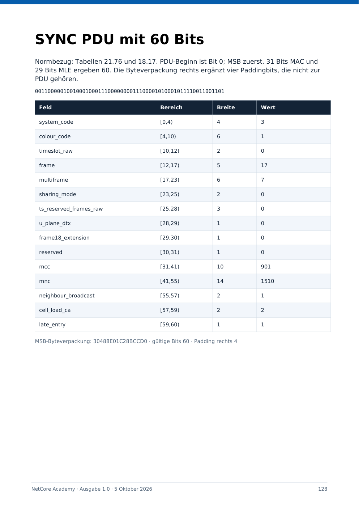

# Brainstorming: NetCore Academy – Moodle-Kurssystem vom Einstieg bis zum Bitdecoder

**Archivhinweis, 09.10.2026:** Diese Datei dokumentiert das im Titel beziehungsweise Quellenrahmen genannte Gespräch und dessen damalige Entscheidungen. Historische Kommandos, Planungen, Versionsangaben und Fehlerbilder bleiben erhalten; der heutige technische Stand steht in der [Gesamtroadmap](../roadmaps/gesamtroadmap.md) und in den [aktuellen Dienstanleitungen](../services/README.md). Die Archivaufnahme bestätigt keine spätere Implementierung oder Live-Abnahme.

Stand der Repository- und Quellenprüfung: **06.10.2026**. Historische Ergebnisse beziehen sich auf die jeweils genannten Daten und Commits.

## 1. Projektstand und Quellenbasis

| Feld | Wert |
| --- | --- |
| Archiv-ID | `NETCORE-ACADEMY-CHAT-01` |
| Thema | Kurse und Lerninhalte für NetCore-Tetra: Bedienung, Betrieb, Integrationen, HF, Protokolle, Software und Bitdecodierung |
| Historischer Inhaltsstand | Academy-Ausgabe 1.0, datiert 2026-10-05, deutsch |
| Erstellung der Entwicklungsnotizen | 2026-10-06, Europe/Berlin |
| Repository | `JanHG98/netcore-tetra` |
| Ablagebranch | `Archiving` |
| Geprüfter Archivstand vor dieser Archivierung | `5d98ac893b10e3dd9b5e0a1a4de5751c52ead60d` |
| Zusätzlich geprüfter Produktstand | `main@9116c15d645458f99e236712b67a1ad970432791` |

Quellenbasis sind die erhaltenen Entwicklungsnotizen, die drei Academy-Dateien und die 25 bereitgestellten PDF-Anhänge. Die ursprünglichen Autorenprogramme und Rohprotokolle sind nach der Bereinigung des Arbeitsbereichs nicht mehr vollständig vorhanden. Historisch gemeldete Ergebnisse und die erneuten Prüfungen vom 06.10.2026 werden deshalb getrennt geführt. Bearbeitbare Inhaltsdaten und ausführbare Lehrprogramme sind im ZIP erhalten.

Die 24 Einzelnormen wurden erneut als Text erschlossen; maßgebliche Tabellen für SYNC, MAC-RESOURCE, D-SDS-DATA, π/4-DQPSK und den Codec wurden gezielt nachgelesen. Das ist keine vollständige fachliche Abnahme aller 3.961 Seiten. `ETSI.pdf` besitzt 4.100 Seiten; für diese Archivierung wurden seine ersten sieben Seiten und Dateimetadaten geprüft. Die Sammeldatei wird nicht als zusätzliche eigenständige Norm gezählt. Ein vollständiger zeilenweiser Vergleich der Sammlung mit allen Einzeldokumenten wurde nicht durchgeführt.

**Ergebnis der Academy-Ausarbeitung:** ein ausgearbeitetes Kurssystem als Inhalte- und Importpaket. Eine Moodle-Instanz, ein installierter NetCore-Patch oder ein erfolgreicher On-Air-Betrieb wurden dadurch nicht hergestellt.

## 2. Ziel, Ausgangslage und Arbeitsumfang

Ausgangspunkt war eine Moodle-Lernplattform für NetCore-Tetra. Festgelegt wurde zunächst ein vollständiges Kurssystem mit Kursen und Inhalten vom Anfänger bis zur Analyse einzelner Bits. Der erste Umfang beschränkt sich auf Lehrmaterial; Installation, Plattformbetrieb und Login-/SSO-Rollout sind spätere Aufgaben.

Als fachliche Grundlage lagen die bereitgestellten ETSI-Dokumente und die im Erstellungsdurchlauf gelesenen `main`-Dateien `README.md` und `ROADMAP.md` vor. NetCore-spezifische Themen wie Restore, zentrale Gruppensteuerung, Deployment, SIP-Fallback, MQTT/HA, Drive und RBAC sollten anhand ihres tatsächlichen Entwicklungsstands behandelt werden. Normative Fähigkeit, vorhandene Implementierung und nachgewiesene Endgerätewirkung bleiben getrennt.

## 3. Statusbegriffe, Anforderungen und Entscheidungen

### 3.1 Nachweisstufen

| Begriff | Bedeutung in diesem Archiv |
| --- | --- |
| Idee | Erwogener Umfang ohne belegte Umsetzung oder verbindliche technische Festlegung. |
| Beschlossen/geplant | Inhalt oder Richtung sind festgelegt; technische Ausführung und Abnahme können noch fehlen. |
| Implementiert | Inhalt oder Softwaredatei existiert im untersuchten Artefakt bzw. im ausdrücklich genannten Repository-Stand. |
| Getestet | Eine konkret benannte Prüfung wurde ausgeführt und ihr Ergebnis ist zugänglich. Die jeweilige Prüfgrenze bleibt bestehen. |
| Im Betrieb bestätigt | Eine tatsächliche Installation oder Endgerätewirkung ist durch zugängliche Betriebsbelege bestätigt. Für die Academy liegt dafür kein Nachweis vor. |

### 3.2 Endgültiger Umfang

| Anforderung / Entscheidung | Stand | Begründung / Grenze |
| --- | --- | --- |
| Durchgehender Lernweg vom Anfänger bis zu Bitfeldern | Beauftragt und als Inhalte implementiert | Zwölf Stufen mit jeweils fünf Kursen; Einstieg ohne TETRA-Vorkenntnisse, später Norm-/Software-/DSP-Arbeit. |
| Nur Kurse und Inhalte | Verbindliche Auftragsgrenze | Keine Lernplattform provisioniert und keine Produkt-Runtime verändert. |
| Jeder Kurs mit Lernzielen, Voraussetzungen, vier Lerntexten, Praxisfall und Lösungen | Implementiert, strukturell geprüft | Kompakte Lerntexte; kein Ersatz für vollständige Normen, Herstellerunterlagen oder eine reale Geräteabnahme. |
| Prüfungsfragen und Bewertungsraster | Implementiert, Zuordnung geprüft | Zwei Single-Choice-Fragen und eine offene Aufgabe pro Kurs; praktische Bewertung bleibt zusätzlich erforderlich. |
| HTML, PDF und Moodle-Inhalte als zusammengehöriges Paket | Implementiert und erhalten | Browserlektüre, druckbares Kursbuch und editierbare/importierbare Daten erfüllen verschiedene Nutzungswege. |
| Reale Normstruktur in den Bitkursen | Implementiert, ausgewählte Tabellen erneut geprüft | Ausgabe, Richtung, Modulation und Offsetbezug explizit angeben; begrenzte Lehrparser nicht als vollständigen RF-Decoder ausgeben. |
| NetCore-Fehler als Lernfälle | Implementiert | Offene Restore- und MM-Gruppenprobleme dienen der Fehleranalyse, werden durch ein Lehrmodell nicht als behoben behauptet. |
| Lernstunden / Abschlüsse | Planungs- und Lehrmodell | 278 Stunden für die Kurse, zusätzlich Stufenprojekte; keine garantierte Dauer und keine externe Zertifizierung. |
| Moodle-Import und automatische Freischaltungen | Noch nicht getestet bzw. nicht konfiguriert | XML, CSV und Book-ZIPs sind vorhanden; Liveimport, Kursregeln und Test mit Lernenden fehlen. |

## 4. Historisch erzeugtes Ergebnis und erhaltene Dateien

### 4.1 Nachgezählter Umfang

| Bestandteil | Umfang |
| --- | --- |
| Lernstufen | 12, IDs `00` bis `11` |
| Kurse | 60, IDs `NC001` bis `NC060` |
| Erklärende Lektionen | 240, vier pro Kurs |
| Praxisfälle mit Aufgabe und Musterlösung | 60 |
| Single-Choice-Fragen | 120, vier Antwortoptionen und genau eine richtige Antwort |
| Offene Prüfungsaufgaben | 60, mit kursbezogenem Bewertungsraster |
| Prüfungsaufgaben insgesamt | 180, ohne XML-Kategorieeinträge mitzuzählen |
| Stufenprojekte | 12, IDs `P00` bis `P11` |
| Ausführbare Lehrlabore | 8 |
| Native Moodle-Book-Pakete | 60, jeweils sechs HTML-Kapitel |
| PDF | 135 Seiten, Ausgabe 1.0 |
| Kursstunden | 278 Planungsstunden à 60 Minuten, inklusive Kurspraxis; Stufenprojekte zusätzlich |
| Einträge im äußeren Kurs-ZIP | 187 |

### 4.2 Unverändert archivierte Originalartefakte

Die drei Dateien wurden aus ihrer erhaltenen Fassung wiederhergestellt, vollständig gelesen bzw. programmgesteuert geprüft und unverändert unter dem Archivpfad abgelegt. Sie werden nicht durch einen neuen Kursentwurf ersetzt.

| Datei / Link | Bytes | SHA-256 |
| --- | --- | --- |
| [NetCore_Academy_Kurssystem.html](assets/2026-10-06_netcore-academy/NetCore_Academy_Kurssystem.html) | 276565 | `acd4d7dd46aa5794ab89bc6ebce86fa2299b9e1b1b913522bd946ac59607f500` |
| [NetCore_Academy_Kurssystem.pdf](assets/2026-10-06_netcore-academy/NetCore_Academy_Kurssystem.pdf) | 391181 | `73244a8716d4abb80afb2dfe557e7c156c0f823ed11c6ff1bcd2cfa12622b992` |
| [NetCore_Academy_Kursinhalte.zip](assets/2026-10-06_netcore-academy/NetCore_Academy_Kursinhalte.zip) | 622925 | `39229106357d431f6e45967aa45e4db5330e81b09aab93e466740321651915fa` |

HTML ist das durchsuchbare vollständige Kursbuch mit Stufenfilter und aufklappbaren Kursen/Lösungen; es braucht keine externen Skriptbibliotheken. PDF enthält Titel, Lernwege/Bewertung, verlinktes Kursverzeichnis, je Kurs eine Inhalts- und eine Übungsseite, Projekte, Labore, Feldtabellen, Glossar und Quellen. ZIP enthält die einzelnen Kurse, Book-Kapitel, Fragen, CSV, JSON und das Python-Lehrprogramm.

Die damaligen temporären Autorendateien `content.py`, `stage01.py` bis `stage11.py`, `extras.py`, `build.py` und `lehrlabore.py` lagen im ursprünglichen Scratch-Arbeitsbereich `tmp/academy_build/`. Die Autoren-/Buildskripte sind nicht mehr zugänglich; das finale `lehrlabore.py` wurde im ZIP erhalten. Der frühere Ausgabepfad `output/academy/` war ein lokaler Erstellungspfad, kein NetCore-Installationspfad.

### 4.3 Inhalt und Schnittstellen des ZIP

| Pfad im ZIP | Funktion / Format | Grenze |
| --- | --- | --- |
| `index.html` | Vollständiges Offline-Kursbuch | Kein Moodle-Server, keine Benutzerverwaltung oder gespeicherte Lernhistorie. |
| `kurse/NC001.html` bis `NC060.html` | Je ein vollständiger HTML-Kurs | Leseversion; Lösungen sind zugänglich und müssen bei Prüfungsbetrieb passend getrennt werden. |
| `moodle_buecher/NC001.zip` bis `NC060.zip` | Je sechs HTML-Kapitel für eine Moodle-Buchaktivität | Nicht ein vollständiges Moodle-Backup im `.mbz`-Format. |
| `moodle_fragen/NC001.xml` bis `NC060.xml` | Pro Kurs Kategorie, zwei Single-Choice-Fragen und eine offene Aufgabe | Native Moodle-XML-Fragen; keine automatisch erzeugte vollständige Testaktivität. |
| `moodle_fragen_gesamt.xml` | Alle 180 Aufgaben mit 60 Kurskategorien | Fragenbankimport, kein gesamter Kursimport. |
| `moodle_kurse.csv` | Kursrahmen, IDs, Kategoriepfad, Lernziel-/Voraussetzungsbeschreibung | Keine Lektionen, Bücher, Tests oder automatische Verfügbarkeitsregeln im CSV. |
| `kategorien.csv` | Manifest: eine Oberkategorie und zwölf Unterkategorien | Kein behaupteter nativer Kategorie-Import; Kategorien zuerst tatsächlich anlegen. |
| `kurssystem.json` | Vollständige strukturierte Inhalte, Lernstufen, Lernziele, Fälle, Fragen, Antworten, Projekte, Pfade und Quellen | Änderbare Datenbasis; Original-Exporter/Renderer fehlt. |
| `labore/lehrlabore.py` | Acht lokale Python-Labore mit eingebauten Prüfungen | Python ab 3.10 wegen Typnotation; Standardbibliothek, kein Netz- oder Hardwarezugriff. |
| `labore/laborergebnisse.json` | Ursprünglich erzeugte Laborergebnisse | Zum Prüfstand vom 06.10.2026 erneut erzeugte Ergebnisse stimmen als JSON-Werte überein. |

Die JSON-Daten enthalten `title`, `version`, `date`, `language`, `levels`, `courses`, `capstones`, `assessment`, `paths`, `sources`, `project_sources` und `web_sources`. Ein Kurs enthält `id`, `level`, `title`, `hours`, `prerequisites`, `sources`, `lessons`, `lab`, `questions`, `essay` und `outcomes`. Lektionen besitzen eigene IDs wie `NC057-L1`. Antwortindizes sind im JSON nullbasiert; die XML-Zuordnung wurde gegen den tatsächlichen Antworttext geprüft.

## 5. Vollständiger Kurskatalog und Lernabhängigkeiten

Die Voraussetzungen sind fachliche Beziehungen in den Daten. Sie sind noch keine in Moodle aktivierten Zugangssperren. Alle Referenzen zeigen auf vorhandene frühere Kurse; der geprüfte Graph enthält keine Zyklen. Jeder Kurs besitzt die vier unten genannten Lerntexte sowie einen eigenen Praxisfall, zwei Wissensfragen und eine offene Aufgabe. Die vollständigen Texte und Lösungen bleiben in HTML, PDF und JSON erhalten.

### Stufe 00: Orientierung und Grundlagen

Kompetenzziel: Ich weiß jetzt was das Funknetz tut. Planungsumfang: 8 Kursstunden.

| ID | Kurs | Stunden | Voraussetzungen |
| --- | --- | --- | --- |
| NC001 | Was NetCore TETRA eigentlich ist | 1 | keine |
| NC002 | Funkbegriffe und Adressen verstehen | 1 | NC001 |
| NC003 | Wie Sprache und Daten durch das Netz laufen | 2 | NC001, NC002 |
| NC004 | Laborübungen vorbereiten und Ergebnisse dokumentieren | 2 | NC003 |
| NC005 | Systematisch Fehler finden | 2 | NC004 |

- **NC001 – Lerntexte:** 1. Das Grundmodell; 2. Steuerung und Nutzdaten; 3. Die wichtigsten Betriebsarten; 4. Norm und Projekt. **Lernziele:** Funkgerät TBS SwMI und Leitstelle zuordnen; Steuerung von Nutzdaten unterscheiden.
- **NC002 – Lerntexte:** 1. Teilnehmer und Gruppen; 2. Netz und Zelle; 3. Simplex Duplex und Sprechrecht; 4. Zahlen ohne Stolperfallen. **Lernziele:** Netz und Teilnehmeradressen lesen; Gruppe Ruf und Sprechabschnitt auseinanderhalten.
- **NC003 – Lerntexte:** 1. Ein Gespräch in Schritten; 2. Vom Mikrofon zum Lautsprecher; 3. Ein Datenauftrag in Schritten; 4. Ein gemeinsamer Zeitstrahl. **Lernziele:** Sprache und SDS Ende zu Ende verfolgen; Rückmeldungen einer Ebene zuordnen.
- **NC004 – Lerntexte:** 1. Die Ausgangslage festhalten; 2. Eine Änderung pro Hypothese; 3. Tests von der Funkanlage trennen; 4. Ergebnisse nach Belegstärke ordnen. **Lernziele:** Einen reproduzierbaren Versuchsaufbau dokumentieren; Belegstärken unterscheiden.
- **NC005 – Lerntexte:** 1. Symptom und Ursache; 2. Schichtweise eingrenzen; 3. Vergleichsversuche; 4. Die Reparatur nachprüfen. **Lernziele:** Hypothesen mit gezielten Versuchen prüfen; eine Reparatur nachvollziehbar belegen.

### Stufe 01: Funkgeräte sicher bedienen

Kompetenzziel: Ich kann das Funkgerät selbstständig nutzen. Planungsumfang: 14 Kursstunden.

| ID | Kurs | Stunden | Voraussetzungen |
| --- | --- | --- | --- |
| NC006 | Funkgerät vorbereiten und anmelden | 2 | NC005 |
| NC007 | Gruppenrufe und PTT beherrschen | 3 | NC006 |
| NC008 | Einzelrufe und Telefonie nutzen | 3 | NC007 |
| NC009 | SDS Statusmeldungen und Positionen nutzen | 3 | NC006, NC003 |
| NC010 | DMO Notruf und Verhalten bei Netzausfall | 3 | NC007, NC009 |

- **NC006 – Lerntexte:** 1. Ein lesbares Geräteprofil; 2. Anmeldung beobachten; 3. Gruppen bewusst auswählen; 4. Eine Funktionsprobe durchführen. **Lernziele:** Geräteprofil und Registrierung prüfen; eine beidseitige Funktionsprobe durchführen.
- **NC007 – Lerntexte:** 1. Ruf und Sprechabschnitt; 2. Die Freigabe abwarten; 3. Sprecherwechsel durchführen; 4. Mit mehreren Teilnehmern umgehen. **Lernziele:** Gruppenruf und PTT bedienen; Sprecherwechsel und Floorkonflikte erkennen.
- **NC008 – Lerntexte:** 1. Das richtige Ziel erreichen; 2. Simplex und Duplex bedienen; 3. TETRA mit SIP verbinden; 4. Rufe kontrolliert beenden. **Lernziele:** Einzelrufarten unterscheiden; Telefonruf und zwei Audiorichtungen prüfen.
- **NC009 – Lerntexte:** 1. Nachrichtentyp und Ziel; 2. Den Inhalt verstehen; 3. Rückmeldungen richtig lesen; 4. Ein Ende zu Ende Versuch. **Lernziele:** SDS Status und Position unterscheiden; Consumerwirkung nachweisen.
- **NC010 – Lerntexte:** 1. DMO bewusst einsetzen; 2. Notrufabläufe vorab kennen; 3. Priorität und Verdrängung unterscheiden; 4. Den Ausfallumfang bestimmen. **Lernziele:** DMO und Rückfalloptionen einordnen; Notruf und Wiederkehr im Kursaufbau prüfen.

### Stufe 02: Leitstelle und Teilnehmerverwaltung

Kompetenzziel: Ich beherrsche die Abläufe hinter dem Funkruf. Planungsumfang: 19 Kursstunden.

| ID | Kurs | Stunden | Voraussetzungen |
| --- | --- | --- | --- |
| NC011 | Leitstellenarbeit und Rufdisposition | 3 | NC008, NC009 |
| NC012 | Teilnehmer Gruppenprofile und zentrale Zuweisungen | 4 | NC011 |
| NC013 | Geräteflotten und Codeplugs verwalten | 4 | NC006, NC012 |
| NC014 | Positionen Warnungen Aufzeichnung und TTS | 4 | NC009, NC011 |
| NC015 | Zusatzdienste und Bedienerprüfung | 4 | NC010, NC012, NC014 |

- **NC011 – Lerntexte:** 1. Einen Auftrag in einen Ruf übersetzen; 2. Mehrere Ereignisse ordnen; 3. Zusatzdienste im Ablauf verstehen; 4. Den Vorgang abschließen. **Lernziele:** Leitstellenaufträge priorisieren; Vorgänge und Zusatzdienste korrekt abschließen.
- **NC012 – Lerntexte:** 1. Drei verschiedene Gruppenstände; 2. Zuweisung und Entziehung; 3. Den NetCore Befund lesen; 4. Ein brauchbares Ergebnis definieren. **Lernziele:** Core TBS und Terminalgruppen unterscheiden; revisionierte Änderungen verfolgen.
- **NC013 – Lerntexte:** 1. Ein Flotteninventar führen; 2. Profile nach Rollen aufbauen; 3. Kompatibilität messen; 4. Änderungen nachvollziehbar verteilen. **Lernziele:** Ein Flotteninventar führen; Codeplugänderungen und Herstellervergleich planen.
- **NC014 – Lerntexte:** 1. Positionsdaten bewerten; 2. Warnungen mit einem Lebenszyklus; 3. TTS als Medienauftrag; 4. Aufzeichnung richtig zuordnen. **Lernziele:** Positionen zeitlich bewerten; Warnung TTS und Aufzeichnung nachvollziehen.
- **NC015 – Lerntexte:** 1. Dienststufen lesen; 2. Late Entry und Include Call; 3. Sperren und Autorisierung; 4. Bedienkompetenz nachweisen. **Lernziele:** Zusatzdienste in Stage 1 bis 3 einordnen; eine Bedienerprüfung durchführen.

### Stufe 03: IT Grundlagen für NetCore

Kompetenzziel: Ich kann die technische Umgebung erklären und prüfen. Planungsumfang: 20 Kursstunden.

| ID | Kurs | Stunden | Voraussetzungen |
| --- | --- | --- | --- |
| NC016 | Linux Dienste Dateien und Logs | 4 | NC005 |
| NC017 | IP Netze DNS Zeit und VPN | 5 | NC016 |
| NC018 | Proxmox LXC und virtuelle Maschinen | 4 | NC016, NC017 |
| NC019 | Speicher Datenbanken NFS und Backup | 4 | NC018 |
| NC020 | Git Konfiguration und nachvollziehbare Versionen | 3 | NC016, NC019 |

- **NC016 – Lerntexte:** 1. Ein Host als Betriebssystem; 2. Dienste gezielt prüfen; 3. Dateien und Rechte verstehen; 4. Logs sinnvoll auswählen. **Lernziele:** Linux Host und Dienstkontext prüfen; Prozess Konfiguration und Fachbereitschaft unterscheiden.
- **NC017 – Lerntexte:** 1. Adresse Netz und Route; 2. Erreichbarkeit richtig prüfen; 3. Zeit als gemeinsame Grundlage; 4. VPN nach Netzwerkzustand steuern. **Lernziele:** IP Routen und DNS erklären; Zeitbasis und VPN Policy prüfen.
- **NC018 – Lerntexte:** 1. Die Ebenen auseinanderhalten; 2. Ressourcen und Abhängigkeiten; 3. Den Gastzugang bewerten; 4. Snapshot und Wiederherstellung. **Lernziele:** VM und LXC unterscheiden; abhängige Ressourcen und Restorekontexte bestimmen.
- **NC019 – Lerntexte:** 1. Daten nach Aufgabe unterscheiden; 2. NFS als entfernte Abhängigkeit; 3. Datenbankkonsistenz erhalten; 4. Backup und Restore messen. **Lernziele:** NFS und Datenbanksicherung prüfen; RPO und RTO anhand eines Versuchs bewerten.
- **NC020 – Lerntexte:** 1. Commit Branch und Arbeitsstand; 2. Konfiguration versionieren; 3. Bäume und Änderungen vergleichen; 4. Ein reproduzierbares Buildprotokoll. **Lernziele:** Branch Commit Build und Laufzeit zuordnen; Konfigurationsdrift erkennen.

### Stufe 04: NetCore installieren und betreiben

Kompetenzziel: Ich verfolge einen Auftrag durch das Gesamtsystem. Planungsumfang: 22 Kursstunden.

| ID | Kurs | Stunden | Voraussetzungen |
| --- | --- | --- | --- |
| NC021 | NetCore Architektur und Zuständigkeiten | 4 | NC020, NC012 |
| NC022 | Installation Discovery und Provisionierung | 6 | NC021 |
| NC023 | Basisstation Raspberry Pi und SXceiver | 4 | NC022, NC006 |
| NC024 | Observability Syslog und korrelierte Fehleranalyse | 4 | NC019, NC021 |
| NC025 | Wartung Upgrade Ausfall und Wiederkehr | 4 | NC022, NC024 |

- **NC021 – Lerntexte:** 1. Die TBS als Funkkante; 2. Autoritative Zustände festlegen; 3. Aufträge über Schnittstellen verfolgen; 4. Abhängigkeiten für den Ausfall planen. **Lernziele:** NetCore Zuständigkeiten zeichnen; einen zentralen Auftrag durch den aktiven Pfad verfolgen.
- **NC022 – Lerntexte:** 1. Installation mit einem bekannten Stand; 2. Discovery als Erkennung; 3. Provisionierung als gewünschter Zustand; 4. Readiness als Schranke. **Lernziele:** Installation Discovery und Provisionierung unterscheiden; negative Readiness wirksam behandeln.
- **NC023 – Lerntexte:** 1. Software und HF Hardware verbinden; 2. Versorgung und Signale prüfen; 3. RX und TX unterscheiden; 4. Einzelzelle zuerst abnehmen. **Lernziele:** Host Treiber und RF Aufbau zusammen prüfen; eine Einzelzellenabnahme definieren.
- **NC024 – Lerntexte:** 1. Beobachtung als Werkzeug; 2. Zentrale Logs transportieren; 3. Metriken fachlich auslegen; 4. Ausfälle im Beobachtungspfad. **Lernziele:** Logs Metriken und Traces zuordnen; Verlust und Duplikate im Beobachtungspfad erkennen.
- **NC025 – Lerntexte:** 1. Die Wartung eingrenzen; 2. Vorwärts und rückwärts denken; 3. Ausfallfälle gezielt erzeugen; 4. Wiederkehr als eigene Phase. **Lernziele:** Upgrade und Rückweg planen; Ausfall und Wiederkehr mit getrennten Rufen prüfen.

### Stufe 05: Integrationen und Erweiterungen

Kompetenzziel: Ich verbinde Dienste mit überprüfbaren Ergebnissen. Planungsumfang: 23 Kursstunden.

| ID | Kurs | Stunden | Voraussetzungen |
| --- | --- | --- | --- |
| NC026 | MQTT Home Assistant und verlässliche Aufträge | 5 | NC009, NC021, NC024 |
| NC027 | SIP RTP PBX und lokale Rückfallebene | 5 | NC008, NC017, NC025 |
| NC028 | Leitstellenaudio NFC TTS und Arbeitsabläufe | 4 | NC014, NC027 |
| NC029 | NetCore Drive Dateien und Browserplugins | 4 | NC019, NC021 |
| NC030 | Sensorik Watchdog Pager und technische Erweiterungen | 5 | NC023, NC026 |

- **NC026 – Lerntexte:** 1. Topics und Nutzlast trennen; 2. Transportqualität einordnen; 3. Zustand und Befehl unterscheiden; 4. Die Automation beobachten. **Lernziele:** MQTT Topic und Payload prüfen; Ablauf Deduplizierung und Aktorwirkung entwerfen.
- **NC027 – Lerntexte:** 1. SIP als Signalisierung; 2. RTP als Medienweg; 3. Die NetCore Wege abbilden; 4. Audiofehler eingrenzen. **Lernziele:** SIP und RTP auswerten; lokalen Fallback und Audiopfade abnehmen.
- **NC028 – Lerntexte:** 1. Bedienung mit Gerätefeedback; 2. Identität aus einer Karte ableiten; 3. TTS in den Arbeitsplatz einordnen; 4. Einen geschlossenen Arbeitsablauf bauen. **Lernziele:** Audio NFC und Sitzung unterscheiden; TTS und Wartung als geschlossene Abläufe entwerfen.
- **NC029 – Lerntexte:** 1. Dateien als verwaltete Ressourcen; 2. Lokaler Start und spätere Anmeldung; 3. Ein Pluginvertrag; 4. Versionen und Änderungen prüfen. **Lernziele:** Dateiversion und Freigabe erhalten; Browserplugins mit gemeinsamem Rechtevertrag entwerfen.
- **NC030 – Lerntexte:** 1. Messwert und Messkette; 2. I2C und GPIO unterscheiden; 3. Watchdogs mit Zuständen entwerfen; 4. Ein Pager als Anwendungspfad. **Lernziele:** Messwerte skalieren; Bus GPIO Watchdog und geplante Pagerpfade einordnen.

### Stufe 06: HF Technik und SDR

Kompetenzziel: Ich messe die Funkstrecke statt sie zu erraten. Planungsumfang: 22 Kursstunden.

| ID | Kurs | Stunden | Voraussetzungen |
| --- | --- | --- | --- |
| NC031 | dB dBm und ein vollständiges Linkbudget | 4 | NC017, NC023 |
| NC032 | Koax Stecker Duplexer und Reflexionen | 4 | NC031 |
| NC033 | Antennen Ausbreitung und Zellversorgung | 5 | NC031, NC032 |
| NC034 | SDR IQ Daten Abtastung und Spektrum | 4 | NC031 |
| NC035 | RF Messung BER und Conformance verstehen | 5 | NC033, NC034 |

- **NC031 – Lerntexte:** 1. Leistung in logarithmischer Form; 2. Gewinne und Verluste addieren; 3. Reserve richtig auslegen; 4. Beide Richtungen berechnen. **Lernziele:** dBm umrechnen; beide Funkrichtungen mit einem Linkbudget berechnen.
- **NC032 – Lerntexte:** 1. Eine HF Strecke als Kette; 2. Impedanz und Reflexion; 3. Rückflussdämpfung verstehen; 4. Duplexer als selektives Bauteil. **Lernziele:** Einfügedämpfung Isolation und Reflexion unterscheiden; VSWR und Return Loss berechnen.
- **NC033 – Lerntexte:** 1. Wellenlänge berechnen; 2. Gewinn und Richtung; 3. Freiraum und reale Umgebung; 4. Eine Versorgungskarte auswerten. **Lernziele:** Wellenlänge und Antennenwirkung erklären; eine Versorgungskarte fachlich auswerten.
- **NC034 – Lerntexte:** 1. Komplexes Basisband; 2. Samples pro Symbol; 3. FFT und Frequenzraster; 4. Gain Offset und Clipping. **Lernziele:** IQ Metadaten lesen; Samples pro Symbol FFT Raster und Clipping bestimmen.
- **NC035 – Lerntexte:** 1. Eine Messgröße definieren; 2. BER und Blockfehler; 3. Unsicherheit und Kalibrierung; 4. Funkqualität mit Fachwirkung verbinden. **Lernziele:** BER berechnen; Messunsicherheit und RF Konformität mit Fachtests verbinden.

### Stufe 07: TETRA Luftschnittstelle und Protokollschichten

Kompetenzziel: Ich lese die Norm und verstehe den Ablauf. Planungsumfang: 24 Kursstunden.

| ID | Kurs | Stunden | Voraussetzungen |
| --- | --- | --- | --- |
| NC036 | ETSI lesen Dienststufen und PICS | 4 | NC015, NC020, NC035 |
| NC037 | TDMA Zeiten Carrier und Ressourcenkapazität | 5 | NC034, NC036 |
| NC038 | MAC LLC MLE MM und CMCE | 5 | NC021, NC037 |
| NC039 | Registrierung Gruppenanmeldung und DGNA | 5 | NC012, NC038 |
| NC040 | SYNC SYSINFO Zellwahl und Nachbarzellen | 5 | NC037, NC038 |

- **NC036 – Lerntexte:** 1. Die richtige Ausgabe wählen; 2. Anforderung und Definition finden; 3. PICS als Fähigkeitsbeschreibung; 4. Von der Klausel zum Test. **Lernziele:** Normausgabe und Status lesen; bedingte Anforderungen in PICS und Tests übertragen.
- **NC037 – Lerntexte:** 1. Die TETRA Zeitstruktur; 2. Kontrolle und Verkehr; 3. Mehrere Carrier; 4. Kapazität mit Bedingungen angeben. **Lernziele:** TDMA Zeiten berechnen; Carrierbelegung mit ausdrücklich benannten Annahmen planen.
- **NC038 – Lerntexte:** 1. Der Schichtenweg; 2. SAP als Servicegrenze; 3. Logische Kanäle zuordnen; 4. Kontrolle Sprache und Paketdaten. **Lernziele:** MAC LLC und höhere Entitäten verfolgen; SAP und logische Kanäle korrekt zuordnen.
- **NC039 – Lerntexte:** 1. Die Registrierung als Zustand; 2. Mitgliedschaft Attach und Auswahl; 3. Dynamische Änderungen durchführen; 4. Sollzustand nach Wiederkehr. **Lernziele:** Registrierung Attach Auswahl und Mitgliedschaft trennen; DGNA Sollzustand nach Wiederkehr erhalten.
- **NC040 – Lerntexte:** 1. Synchronisation zuerst; 2. Zellinformationen interpretieren; 3. Nachbarinformationen nutzen; 4. Zellwechsel vom Ruf unterscheiden. **Lernziele:** SYNC und SYSINFO einordnen; Zellankündigung Empfang und Rufwechsel getrennt prüfen.

### Stufe 08: Rufsteuerung SDS und Mobilität

Kompetenzziel: Ich begründe Zustandswechsel und Fehlerbehandlung. Planungsumfang: 27 Kursstunden.

| ID | Kurs | Stunden | Voraussetzungen |
| --- | --- | --- | --- |
| NC041 | Rufaufbau Rufkontext und Rufabbau | 5 | NC038, NC039 |
| NC042 | Floor Kontrolle Timer und Uplink Überwachung | 5 | NC041, NC037 |
| NC043 | Restore Fehler analysieren und beheben | 6 | NC042, NC020 |
| NC044 | SDS Protokollschichten PEI und Nutzlasten | 5 | NC009, NC038 |
| NC045 | Mehrzellenbetrieb Handover und ETSI ISI | 6 | NC040, NC041, NC027 |

- **NC041 – Lerntexte:** 1. Ein expliziter Zustandsautomat; 2. Identitäten im Rufkontext; 3. Abbau als geordnete Freigabe; 4. Negative Übergänge prüfen. **Lernziele:** Rufkontexte und Ressourcenbesitz erhalten; gültige und ungültige Übergänge prüfen.
- **NC042 – Lerntexte:** 1. Floor als exklusiver Zustand; 2. Timer mit einem Zweck; 3. Unterer Funkpfad und Überwachung; 4. Stumme Teilnehmer beherrschen. **Lernziele:** Exklusiven Floor und Kontexttimer modellieren; Uplink Überwachung durchgehend prüfen.
- **NC043 – Lerntexte:** 1. Restore von Late Entry abgrenzen; 2. Einzelruf mit belegtem Floor; 3. Gruppenruf mit fehlendem Uplink; 4. Eine Regression sinnvoll formulieren. **Lernziele:** Die zwei Restore Fehler reproduzieren; Floorprüfung und untere Benachrichtigung begründen.
- **NC044 – Lerntexte:** 1. Kurzdaten auf mehreren Ebenen; 2. SDS TL als weiterer Vertrag; 3. PEI als Geräteanschluss; 4. Transport über Netzgrenzen. **Lernziele:** SDS Luft PEI und ISI Schichten lesen; Antworten und asynchrone Ereignisse trennen.
- **NC045 – Lerntexte:** 1. Drei Mobilitätsziele; 2. Kontext übertragen; 3. ISI nach Dienst unterscheiden; 4. Seamless messbar machen. **Lernziele:** Mobilitätsziele getrennt abnehmen; Kontexttransfer und Audiokontinuität messen.

### Stufe 09: Security Robustheit und Interoperabilität

Kompetenzziel: Ich prüfe die Grenzen eines Gesamtsystems. Planungsumfang: 27 Kursstunden.

| ID | Kurs | Stunden | Voraussetzungen |
| --- | --- | --- | --- |
| NC046 | TETRA Authentisierung Verschlüsselung und Schlüsselrollen | 5 | NC036, NC039 |
| NC047 | TSIM UICC APDU und Geräteschnittstellen | 5 | NC046, NC044 |
| NC048 | Zentrale Identität RBAC und lokale Ausnahmezugänge | 6 | NC028, NC029, NC046 |
| NC049 | Hochverfügbarkeit Zustandsreplikation und Belastung | 5 | NC025, NC041, NC048 |
| NC050 | Teststrategie Herstellervergleich und Nachweisgrenzen | 6 | NC036, NC043, NC045, NC049 |

- **NC046 – Lerntexte:** 1. Authentisierung als Protokoll; 2. Luft und Ende zu Ende; 3. Schlüssel mit Rollen; 4. Den Implementierungsstand prüfen. **Lernziele:** Authentisierung und Schutzbereiche erklären; Schlüsselrollen und Implementierungsstand prüfen.
- **NC047 – Lerntexte:** 1. Karte Gerät und Anwendung; 2. APDU als strukturierten Befehl lesen; 3. Antworten im Kontext auswerten; 4. Kartenwissen im Gesamtsystem. **Lernziele:** TSIM UICC und Anwendung unterscheiden; APDU Formen und Antworten kontrolliert lesen.
- **NC048 – Lerntexte:** 1. Anmeldung und Autorisierung; 2. Rollen mit Ressourcen verbinden; 3. Ausnahmezugänge bewusst modellieren; 4. Migration und Qualifikation. **Lernziele:** Identität Aktion und Ressource zuordnen; RBAC Migration und Ausnahmezugänge entwerfen.
- **NC049 – Lerntexte:** 1. Verfügbarkeit pro Funktion; 2. Replikation und konkurrierende Entscheider; 3. Last und Rückstau; 4. Dauerlauf und Fehlerbudget. **Lernziele:** HA Konflikte und Rückstau modellieren; Last Dauerlauf und Wiederkehr messen.
- **NC050 – Lerntexte:** 1. Tests nach Aussage auswählen; 2. Fehler gezielt injizieren; 3. Hersteller mit derselben Aufgabe vergleichen; 4. Ein Ergebnis veröffentlichungsfähig formulieren. **Lernziele:** Testarten passend wählen; Herstellerumfang und Nachweisgrenzen belastbar berichten.

### Stufe 10: Signalverarbeitung und Softwareentwicklung

Kompetenzziel: Ich baue reproduzierbare Protokollwerkzeuge. Planungsumfang: 32 Kursstunden.

| ID | Kurs | Stunden | Voraussetzungen |
| --- | --- | --- | --- |
| NC051 | Programmieren für Protokolle mit Rust | 6 | NC020, NC038 |
| NC052 | Komplexe Signale und pi4 DQPSK demodulieren | 6 | NC034, NC051 |
| NC053 | Kanalcodierung Interleaving Scrambling und CRC | 8 | NC036, NC052 |
| NC054 | TETRA Sprachcodec Frames und Medienpipeline | 6 | NC037, NC052, NC053 |
| NC055 | Aktive Runtimepfade Nebenläufigkeit und Patches | 6 | NC043, NC048, NC051 |

- **NC051 – Lerntexte:** 1. Daten mit Typen ausdrücken; 2. Ownership und geliehene Daten; 3. Fehler als Resultat; 4. Ein kleines Werkzeug bauen. **Lernziele:** Rust Datenmodelle und Result einsetzen; einen begrenzten Bitreader entwerfen.
- **NC052 – Lerntexte:** 1. Phase aus komplexen Werten; 2. Die normierte Dibitzuordnung; 3. Vom Sample zum Symbol; 4. Entscheidungen und Unsicherheit. **Lernziele:** Komplexe Differentialphase auswerten; die normierte pi4 DQPSK Zuordnung anwenden.
- **NC053 – Lerntexte:** 1. Kanäle besitzen verschiedene Ketten; 2. Interleaving umkehren; 3. Scrambling im Kanalbezug; 4. CRC Parameter vollständig benennen. **Lernziele:** Kanalabhängige Codierungsketten bestimmen; Interleaving Scrambling und CRC korrekt prüfen.
- **NC054 – Lerntexte:** 1. Ein Sprachframe mit fester Größe; 2. Die Bitaufteilung verstehen; 3. Zustand und verlorene Frames; 4. Medienübergaben prüfen. **Lernziele:** Codecframes und Parameterbits berechnen; eine vollständige Medienpipeline untersuchen.
- **NC055 – Lerntexte:** 1. Den wirklichen Einstieg finden; 2. Konkurrenz durch Regeln begrenzen; 3. Abbruch und Timeout koordinieren; 4. Einen prüfbaren Patch vorbereiten. **Lernziele:** Aktive Handler und Konkurrenzfehler finden; einen prüfbaren Patch beschreiben.

### Stufe 11: Bit Decodierung und Masterprojekte

Kompetenzziel: Ich kann ein einzelnes Bit fachlich erklären. Planungsumfang: 40 Kursstunden.

| ID | Kurs | Stunden | Voraussetzungen |
| --- | --- | --- | --- |
| NC056 | Bits Bytes Endianness und belastbare Feldreader | 6 | NC051, NC053 |
| NC057 | Eine vollständige 60 Bit SYNC PDU decodieren | 6 | NC040, NC056 |
| NC058 | MAC RESOURCE mit bedingten Feldern zerlegen | 8 | NC036, NC056, NC057 |
| NC059 | SDS vom Bitfeld bis zur Anwendung verfolgen | 8 | NC044, NC056, NC058 |
| NC060 | Vom IQ Datensatz zum eigenen NetCore Patch | 12 | NC045, NC050, NC052, NC053, NC054, NC055, NC057, NC058, NC059 |

- **NC056 – Lerntexte:** 1. Die Bezugsgrenze festlegen; 2. Felder über Bytegrenzen lesen; 3. Unvollständige Eingaben behandeln; 4. Roundtrip und unabhängige Werte. **Lernziele:** Bitbezug und Endianness definieren; Grenzfälle mit unabhängigen Referenzen prüfen.
- **NC057 – Lerntexte:** 1. Die normierte Struktur; 2. Offsets selbst herleiten; 3. Rohwerte richtig interpretieren; 4. Den Lehrdatensatz prüfen. **Lernziele:** Alle 60 SYNC Bits zerlegen; Offsets Rohwerte und gültige Werte begründen.
- **NC058 – Lerntexte:** 1. Der feste Präfix; 2. Adresszweige verändern Offsets; 3. Präsenz hängt von Modulation ab; 4. Eine Teilimplementierung klar begrenzen. **Lernziele:** MAC RESOURCE Adress und Präsenzzweige lesen; variable Headerlängen korrekt berechnen.
- **NC059 – Lerntexte:** 1. Einen CMCE Präfix festlegen; 2. Die Datenart bestimmt den Zweig; 3. Nutzlast und Anwendung verbinden; 4. Eine fehlerhafte Längenangabe erkennen. **Lernziele:** D SDS DATA Kernfelder decodieren; Sender Ziel und Anwendungspayload verbinden.
- **NC060 – Lerntexte:** 1. Die gesamte Verarbeitungskette; 2. Ein Bit mit seiner Wirkung erklären; 3. Einen echten Projektfall bearbeiten; 4. Die Arbeit verteidigen. **Lernziele:** Vom Datensatz zum aktiven NetCore Fehler gelangen; einen Patch mit unabhängigen Nachweisen verteidigen.

## 6. Rollenpfade, Prüfungsmodell und zwölf Stufenprojekte

### 6.1 Rollenbezogene Lernwege

| Lernweg | Kurse | Ziel / Grenze |
| --- | --- | --- |
| Funknutzer | NC001 bis NC010 | Grundlagen und eigenständige Bedienung |
| Dispatcher | NC001 bis NC015 sowie NC027 und NC028 | Leitstellenabläufe und Audiointegration |
| Administrator | NC001 bis NC005 sowie NC016 bis NC030 und NC046 bis NC050 | IT Betrieb Integrationen und Rechte; fehlende Einzelvoraussetzungen werden vor dem jeweiligen Kurs ergänzt |
| RF Techniker | NC001 bis NC010 sowie NC023 und NC031 bis NC040 | Funkaufbau Messung und Luftschnittstelle; Voraussetzungen gelten zusätzlich |
| Entwickler | NC001 bis NC005 NC016 bis NC030 und NC036 bis NC060 | Aktive Pfade Normen und Software; benötigte RF-Kurse werden ergänzt |
| Kompletter Lernweg | NC001 bis NC060 | Alle zwölf Stufen einschließlich Abschlussprojekten |

Ein Rollenpfad entbindet nicht von den im Kurs genannten Einzelvoraussetzungen. Diese müssen bei Bedarf ergänzt werden; die Tabelle ist kein technisch eingerichteter Moodle-Einschreibungsplan.

### 6.2 Bewertung

| Bereich | Wert | Regel |
| --- | --- | --- |
| Wissen | 2 Punkte | Zwei Single-Choice-Fragen je Kurs mit einer richtigen Antwort. Beide Antworten sollen nach dem Feedback begründet werden können. |
| Praxis | 4 Punkte | Je ein Punkt für korrekten Ausgangszustand, nachvollziehbare Durchführung, fachlich richtiges Resultat und passende Folgeprüfung beziehungsweise Ergebnisgrenze. |
| Erklärung | 4 Punkte | Offene Aufgabe mit kursbezogenem Bewertungsraster. Beurteilung nach vier gleich gewichteten fachlichen Kriterien aus dem Raster. |
| Kursabschluss | mindestens 8 von 10 | Zusätzlich müssen die zentrale Fachregel und das erwartete praktische Ergebnis richtig sein. Eine falsche Floor-Exklusivität oder ein falsch verstandener Bitbezug wird vor Abschluss korrigiert. |
| Stufenabschluss | Projekt bestanden | Die fünf Kurse der Stufe und ihr Abschlussprojekt sind bearbeitet. Das Projekt wird gegen die beschriebenen Kriterien beurteilt. |

Die XML-Fragen verwenden für Single Choice `defaultgrade=1`, `single=true`, Antwortmischung und je eine Antwort mit `fraction=100`. Die offenen Aufgaben besitzen `defaultgrade=4` und ein `graderinfo`-Raster. Die weiteren vier Praxispunkte werden nicht automatisch durch den Fragenbankimport erzeugt. Das Modell „mindestens 8 von 10“ und die zusätzlichen Fachbedingungen müssen als Gesamtbewertung umgesetzt bzw. manuell beurteilt werden. `enablecompletion=1` im Kurs-CSV aktiviert allein noch keine vollständige Abschlussregel. Eine Academy-Stufe ist eine interne Lernstufe, kein BOS-Lehrgang, Herstellerzertifikat oder akkreditierter Abschluss.

### 6.3 Stufenprojekte

| ID / Projekt | Aufgabe | Abnahmekriterien |
| --- | --- | --- |
| P00 Netz erklären | Erstelle eine Seite mit Funkgerät, TBS, SwMI und Zielanwendung. Verfolge einen Sprachruf und eine SDS. | Die Rollen sind korrekt. Steuerung und Nutzdaten sind getrennt. Vier Wirkungsstufen sind einem konkreten Beispiel zugeordnet. |
| P01 Bedienerparcours | Führe Anmeldung, Gruppenruf mit drei Sprecherwechseln, Einzelruf und SDS im Kursaufbau oder als dokumentierten Papierfall durch. | Jede Aufgabe besitzt Soll und Ist. Beide Audiorichtungen und Zielmeldung sind geprüft. Ein Ausfallfall besitzt einen sinnvollen nächsten Schritt. |
| P02 Eine Flotte disponieren | Verwalte einen Lehrbestand mit drei Geräten und drei Gruppen. Plane eine Gruppenzuweisung, einen Warnvorgang und die Übergabe eines offenen Auftrags. | Identitäten sind eindeutig. Gruppenstände werden pro Ebene geführt. Warnversion, Zustellstatus und Übergabe sind nachvollziehbar. |
| P03 IT Fehlerkette auflösen | Untersuche einen Lehrfall mit falscher DNS-Adresse, veraltetem Build und fehlender Archivdatei. Liefere eine Ursache je Symptom. | Die Fälle sind getrennt eingegrenzt. Laufzeitstand und Datenkonsistenz werden geprüft. Der Restorepfad enthält einen Fachauftrag. |
| P04 Eine Einzelzelle abnehmen | Erstelle eine Abnahmematrix vom Pi-Boot über Registrierung bis zu Ruf, SDS, Ausfall und Wiederkehr. | Host, Treiber, Build und Konfiguration sind erfasst. Die Readinessschranke funktioniert. Jede Funktion besitzt einen tatsächlichen Messpunkt. |
| P05 Eine Integration schließen | Entwirf einen TETRA-SDS-Auftrag mit MQTT-Consumer und bestätigtem Zielaktor. Prüfe Retry, abgelaufenen Auftrag und fehlende Antwort. | Eine stabile Identität verbindet den Ablauf. Deduplizierung und Ablauf sind wirksam. Annahme und Aktorwirkung haben getrennte Resultate. |
| P06 RF Messbericht | Berechne beide Linkbudgets und werte eine Lehr-Messroute mit Pegel, Qualität, VSWR und BER aus. | Einheiten und Bezugspunkte stimmen. Unsicherheiten werden berücksichtigt. Hypothesen beruhen auf den passenden Messungen. |
| P07 Norm zu Testmatrix | Wähle SYNC oder MAC-RESOURCE und übersetze mindestens fünf Feldregeln in positive und negative Fälle. | Ausgabe, Klausel, Richtung und Modulation sind genannt. Präsenz und Wertebereiche erzeugen passende unabhängige Erwartungen. |
| P08 Restore und Zellwechsel | Entwirf und prüfe einen stummen Restoreteilnehmer sowie einen laufenden Simplexruf beim Zellwechsel. | Exklusiver Floor, Uplink-Überwachung und Release sind nachvollziehbar. Kontexttransfer und Audiounterbrechung werden getrennt gemessen. |
| P09 Robustheitsreview | Bearbeite Netzwerkpartition, gesperrten Operator, alte Gruppenrevision und zwei unterschiedliche Gerätefirmwares. | Jeder Fall besitzt eine klare Zuständigkeit und Ausfallregel. Rechte, Revision und Herstellerumfang bleiben korrekt begrenzt. |
| P10 Decoderwerkzeug | Baue einen begrenzten Bitreader und prüfe pi4-DQPSK-Lehrsymbole, CRC-Lehrvektor und einen Codec-Zeitstrahl. | Bekannte Werte und Offsets werden unabhängig geprüft. Unvollständige Daten liefern kontrollierte Fehler. Vereinfachte Labore werden korrekt eingeordnet. |
| P11 Protokollmaster | Verteidige den gewählten Masterfall aus NC060 mit Feldreport, Zustandsmodell und kleinem Änderungsvorschlag. | Ein konkreter Fehler ist reproduziert. Norm-/Vertragsbezug, aktive Wirkung, positive und negative Prüfungen und verbleibender Nachweisumfang passen zusammen. |

## 7. Facharchitektur, Komponenten und Zuständigkeiten

### 7.1 Architektur des Lehrpakets

Eine gemeinsame Inhaltsstruktur wird in drei Nutzungsformen angeboten: Offline-HTML, PDF und Moodle-Datenaustausch. HTML/PDF sind unmittelbare Leseunterlagen; Book-ZIP, XML und CSV nutzen unterschiedliche native Moodle-Importwege. Es existiert kein einzelner Import, der das komplette Lehrsystem mit allen Beziehungen automatisch einrichtet.

Der Lehrstand folgt einer durchgehenden Beweisregel: **Auslösung, Annahme, Aussendung und tatsächlicher Abschluss** werden getrennt beobachtet. HTTP-Erfolg, Core-Warteschlange, TBS-Annahme, Funkübertragung und Endgerätewirkung sind verschiedene Nachweise. Diese Regel zieht sich durch Audio, SDS, MQTT-Aktoren, DGNA, Deployments, Dateisynchronisation und Tests.

### 7.2 NetCore-Architektur als Kursgegenstand

| Bereich | Behandelter Zusammenhang | Beweisgrenze |
| --- | --- | --- |
| TBS / Funkstack | Gerät, RF, MAC, LLC, MLE, MM und CMCE; getrennte Steuerungs- und Medienwege | Ein Parser oder ein lokaler Zustandswechsel ist keine gesamte Funkabnahme. |
| SwMI / zentrale Dienste | Teilnehmer-, Gruppen-, Mobility- und Rufzustand; Node Gateway als zentraler Auftrags-/Ereignisweg | Ein Core-Sollzustand beweist keinen veränderten TBS-/Endgerätezustand. |
| SIP / RTP | Native TBS-Bridge → lokaler Asterisk Edge-B2BUA → zentraler SIP-Switch → PBX | Codec bleibt `edge_media`; laufende SIP-Dialoge werden nicht automatisch zwischen Wegen migriert. |
| SDS / PEI / ISI | Richtung, Protokollschicht, SDS-TL, Anwendungskennung und Nutzlast getrennt | SDS-Typ allein ist keine universelle Anwendungsbedeutung. NetCore Transit ist nicht ETSI ISI. |
| MQTT / Home Assistant | QoS, Deduplizierung, Ablaufzeit, Korrelation und Ergebnisrückmeldung | Verbundene Clients oder Transport-QoS allein beweisen keine Aktorwirkung. |
| Leitstelle / Audio | Mikrofon, Headset, PTT, Recording, TTS, NFC und Ressourcenrechte | Kartenlesung ist keine vollständige Autorisierung; Rufanzeige ist kein Audionachweis. |
| Deployment / Betrieb | Discovery, Provisionierung, Ready-Schranke, Upgrade, Logs, NFS, Backup/Restore | Historische Feature-Arbeit und geprüftes main sind getrennt; negativer Healthwert darf nicht als Erfolg verschwinden. |
| IAM / RBAC | Identität, Dienstrolle und konkrete Ressource; Maschinenidentitäten und Funkidentitäten getrennt | Menschliches Web-IAM ist keine TETRA-Authentisierung; zentraler Login ist noch geplant. |
| Drive / Plugins | Dateiversionen, Freigaben, lokaler Start, spätere zentrale Anmeldung, Browser-Formate | Inhaltsdaten in einer Datenbank sind nicht dasselbe wie Dateibytes; Planungsartefakte sind keine installierte Cloud. |
| RF / DSP | Beide Linkbudgets, Impedanz, VSWR, IQ, FFT, π/4-DQPSK, Kanalkette und Codec | Ideale Symbole und Rechenbeispiele ersetzen keine gemessene RF-/Timing-/Konformitätsprüfung. |
| Hardwareerweiterungen | Pi/SXceiver, I²C, Sensorwerte, Watchdog und Pager | Konkrete Pinfreigabe/Boardrevision und reale Aktor- bzw. Pagerwirkung sind separat zu prüfen. |

### 7.3 Dienste, Pfade, Ports und Konfigurationen

Für **Moodle selbst** wurden keine Version, Serveradresse, Container-/VM-ID, DNS-Domäne, Datenbank, Speicherpfade, Mailzustellung, Cronkonfiguration oder produktive Loginanbindung festgelegt. Es gibt keine behauptete Academy-systemd-Unit und keinen Academy-Netzwerkport. Das Offline-Lehrprogramm benötigt weder einen Dienst noch einen offenen Port.

Behandelte NetCore-Dateien sind unter anderem `config.toml`, `README.md`, `ROADMAP.md`, `crates/tetra-entities/src/mm/mm_bs.rs`, `crates/tetra-entities/src/cmce/subentities/cc_bs/procedures/restoration.rs`, `crates/tetra-entities/src/net_control_room/worker.rs` und `system-backend/group-core/src/state.rs`. Bei Reparaturen muss der aktive Hauptstack vom gleichnamigen `ms-mode/`-Baum unterschieden werden. Keine dieser Produktdateien wird durch die Quellenprüfung vom 06.10.2026 geändert.

Die zum Prüfstand vom 06.10.2026 gelesene SIP-Dokumentation nennt die feste lokale TBS-Bridge zu `127.0.0.1:5060`, drei fehlgeschlagene Prüfungen als Standard vor Failover und 30 Sekunden stabile zentrale Erreichbarkeit vor Rückkehr. Das sind dokumentierte Standards des geprüften Codes, keine für diesen Entwicklungsstand gemessenen Betriebswerte. KMF ist in seiner README mit WebUI-Port `8190` und Transit mit `8200` beschrieben; diese Angaben sind Kurs-/Repository-Kontext und keine Academy-Endpunkte. Weitere Dienstports werden nicht aus anderen Arbeitsphasen oder Annahmen übernommen.

Die CSV-Kurse besitzen `shortname=NCxxx`, `idnumber=NETCORE-NCxxx`, `format=topics`, `visible=0`, `lang=de`, `enablecompletion=1` und `category_path=NetCore Academy / NN Stufenname`. Sie werden damit zunächst verborgen angelegt. Kategorie-IDs lauten im Manifest `NETCORE-ACADEMY` bzw. `NETCORE-LEVEL-NN`.

## 8. Technischer Deep Dive: Bits, Funkparameter und Lehrgrenzen

### 8.1 Vollständige 60-Bit-SYNC-PDU im definierten Bezug

Bezug: **ETSI EN 300 392-2 V3.8.1 (2016-08)**, Tabelle 21.76, S. 707–708, und Tabelle 18.17, S. 530. Die PDU besitzt 31 Bits MAC-Synchronisationsinformation und 29 Bits D-MLE-SYNC. Bit 0 ist hier der PDU-Anfang, MSB zuerst; Bereiche sind halboffen `[Anfang, Ende)`. Die Addition ergibt 60, nicht 31 oder 29 für die gesamte PDU.

| Feld im Lehrprogramm | Bereich | Bits | Lehrwert |
| --- | --- | --- | --- |
| system_code | [0,4) | 4 | 3 |
| colour_code | [4,10) | 6 | 1 |
| timeslot_raw | [10,12) | 2 | 0 |
| frame | [12,17) | 5 | 17 |
| multiframe | [17,23) | 6 | 7 |
| sharing_mode | [23,25) | 2 | 0 |
| ts_reserved_frames_raw | [25,28) | 3 | 0 |
| u_plane_dtx | [28,29) | 1 | 0 |
| frame18_extension | [29,30) | 1 | 0 |
| reserved | [30,31) | 1 | 0 |
| mcc | [31,41) | 10 | 901 |
| mnc | [41,55) | 14 | 1510 |
| neighbour_broadcast | [55,57) | 2 | 1 |
| cell_load_ca | [57,59) | 2 | 2 |
| late_entry | [59,60) | 1 | 1 |

Der feste unabhängige Bitvektor lautet:

```text
001100000100100010001110000000011100001010001011110011001101
```

Byteverpackung: `30488E01C28BCCD0`, 60 gültige Bits, vier rechts ergänzte Paddingbits. Die Paddingbits gehören nicht zur PDU. `timeslot_raw=0` bedeutet Timeslot 1. Frame und Multiframe werden nicht pauschal um eins erhöht: gültig sind hier 1–18 bzw. 1–60; 0 ist reserviert. Im Lehrvektor stehen Frame 17 und Multiframe 7. Bei Sharing Mode 0 ist das Feld der reservierten Frames in seiner Wirkung nicht anzuwenden; der Reader erhält den Rohwert.

Geprüft werden Gesamtlänge, feste Bitfolge, MCC-/MNC-Offsets, Werte und ausgewählte ungültige Fälle. Der Reader prüft nicht automatisch sämtliche normativen Bedeutungen jedes möglichen Systemcodes oder alle späteren Ausgabevarianten. Er beginnt nach bereits erfolgter Bitdecodierung und verarbeitet keinen vollständigen RF-Burst.

### 8.2 MAC-RESOURCE: bedingte Headerpräfixe

Bezug: Tabelle 21.55, S. 686–687 derselben Ausgabe. Der feste Präfix besitzt 16 Bits: PDU-Typ 2, Fill 1, Position of Grant 1, Encryption Mode 2, Random Access Flag 1, Length Indication 6 und Address Type 3.

| Lehrzweig | Adressbreite | Nächstes Bit nach Adresse | Vollständiger Lehrpräfix mit drei Nullflags |
| --- | --- | --- | --- |
| Address Type `001`, SSI `4010001` | 24 | 40 | 43 Bits |
| Address Type `010`, Event Label `17` | 10 | 26 | 29 Bits |

Die drei Nullflags betreffen Power Control, Slot Grant und Channel Allocation. **Immediate Napping Permission ist bei π/4-DQPSK nicht vorhanden**, bei π/8-D8PSK oder QAM jedoch bedingt vorhanden; ein pauschal zusätzlich gelesenes Bit verschiebt den Parser. Die Gesamtlänge und Adressbreiten hängen vom tatsächlichen Zweig ab.

Das Lehrprogramm akzeptiert nur π/4-DQPSK, unverschlüsselte SSI-/Event-Label-Zweige und ausgeschaltete optionale Elemente. Andere Modulationen, unbekannte Adresstypen, Verschlüsselung und gesetzte optionale Zweige führen zu kontrollierten Fehlern. `length_raw=7` wird für die Präfixanalyse nicht in eine geprüfte vollständige PDU-Länge umgewandelt. TM-SDU, komplette Länge, Fragmentierung und sämtliche optionalen Elemente werden nicht decodiert. **Die 43-/29-Bit-Beispiele sind Präfixe, keine vollständigen MAC-PDUs.**

### 8.3 D-SDS-DATA: Richtung und Nutzlastbeginn

Bezug: Tabelle 14.13, S. 290, PDU-Typcodierung im Downlinkkontext derselben Ausgabe. Der Beispielpräfix beginnt am CMCE-PDU-Typ, ohne äußeren Protokolldiskriminator und ohne optionale Schlussfelder.

| Feld | Bereich | Breite | Lehrwert |
| --- | --- | --- | --- |
| PDU Type | `[0,5)` | 5 | 15 = `01111`, D-SDS-DATA |
| Calling Party Type Identifier | `[5,7)` | 2 | 1, Calling Party SSI |
| Calling Party SSI | `[7,31)` | 24 | 4010001 |
| Short Data Type Identifier | `[31,33)` | 2 | 0, User Defined Data-1 |
| Nutzdaten | `[33,49)` | 16 | `0x1234` = 4660 |

Bitvektor:

```text
0111101001111010011000000010001000001001000110100
```

Byteverpackung: `7A7A6022091A00`, 49 gültige Bits und sieben rechte Paddingbits. Der Calling-Party-Wert ist die Senderkennung und nicht die Zielkennung. Gleiche Bitwerte können in einem anderen Protokoll-/Richtungskontext etwas anderes bezeichnen. Der Parser weist den Uplinkkontext zurück und unterstützt nur diesen CPTI-/SDTI-Zweig. SDS-TL und Applikationsdecodierung sind nachgelagerte, getrennte Schritte.

### 8.4 DSP, Zeitstruktur und Codec

| Parameter | Im Lehrsystem verwendeter Wert | Bezug / Grenze |
| --- | --- | --- |
| π/4-DQPSK-Zuordnung | `00`: +45°, `01`: +135°, `10`: −45°, `11`: −135° | EN 300 392-2 V3.8.1, Tabelle 5.1, S. 73; differentielle Phasendrehung. |
| Symbolrate im klassischen Lehrfall | 18.000 Symbole/s | Keine universelle Rate aller TETRA-/TEDS-Modulationen. |
| Slot / Frame / Multiframe | 255 Symbolperioden pro Slot ≈ 14,167 ms; vier Slots ≈ 56,667 ms; 18 Frames = 1,02 s | Zeitstruktur des betrachteten π/4-DQPSK-Falls. |
| Abtastbeispiel | 144 kSamples/s / 18 kSymbole/s = 8 Samples/Symbol | Lehrwert, keine festgelegte SXceiver-Konfiguration. |
| FFT-Beispiel | 144.000 / 2.048 = 70,3125 Hz pro Bin | Binabstand ist keine vollständige Aussage zur Auflösung jeder Messung. |
| Sprachcodec | 137 Bits je 30 ms ≈ 4.567 bit/s | EN 300 395-2 V1.3.3 (2025-02), Tabelle 1, S. 13. |
| Codec-Aufteilung | LP 26 + Pitch 23 + Algebraic Code 64 + Gain 24 = 137 | Unkodiertes Codecframe; nicht automatisch Kanaldatenrate. |

Das DQPSK-Labor verwendet ideale, bereits symbolgetaktete komplexe Werte. Eine gemeinsame feste Phasenrotation ändert die differentielle Entscheidung nicht. Timing Recovery, Frequenzkorrektur, Filter, Rauschen, Fading und die gesamte IQ→Burst→Kanalkette fehlen im Lehrprogramm. Der Masterkurs beschreibt den umfassenderen Arbeitsweg, behauptet aber keinen fertig gelieferten universellen IQ-Decoder.

### 8.5 RF- und Codierungslehrwerte

| Rechnung | Ergebnis | Einordnung |
| --- | --- | --- |
| Downlink `30 − 2 + 6 − 105 + 3 − 1` | −69 dBm; 26 dB Reserve gegenüber −95 dBm | Hypothetisches Linkbudget, keine Messung des NetCore-Netzes. |
| Uplink `20 − 1 + 0 − 105 + 6 − 2` | −82 dBm; 13 dB Reserve gegenüber −95 dBm | Beide Richtungen getrennt betrachten. |
| VSWR 2 | Reflexionsfaktor 1/3; reflektierte Leistung ≈ 11,11 %; Return Loss ≈ 9,54 dB | Leistungsanteil ist das Quadrat des Reflexionsfaktors. |
| Viertelwelle bei 418 MHz | ≈ 0,1793 m | Ideales Freiraumbeispiel, kein fertiger Antennenbauplan. |
| BER `250 / 100000` | 0,25 % | Definierter Zähler/Nenner, keine aktuell gemessene Anlagen-BER. |
| Lehrpermutation | `[2,0,3,1]`, `[1,0,1,1]` → `[1,1,1,0]` → Original | Eigenes Interleavingbeispiel, keine behauptete TETRA-Permutation. |
| CRC-Lehrvektor | ASCII `123456789` → `0x29B1` | Width 16, Poly `0x1021`, Init `0xFFFF`, refin/refout false, xorout 0; eigenständiges Lehrverfahren. |

Für jede reale TETRA-Kanalkette müssen Kanaltyp, Code, Rate, Punktierung, Reihenfolge, Scrambling- und CRC-Parameter aus der zutreffenden Normausgabe bestimmt werden. Ein im Labor korrekt berechneter allgemeiner CRC ersetzt das nicht.

### 8.6 Sicherheits- und Normgrenzen

Authentisierung, Air Interface Encryption und Ende-zu-Ende-Verschlüsselung sind getrennte Funktionen. Schlüsselrollen, TSIM/UICC/APDU und KMF werden als eigene Bereiche behandelt; Web-RBAC ersetzt keine Funk-Security. Die Lehrsammlung enthält Entwürfe und unterschiedliche Editionsstände. DMO-Detailimplementierung benötigt zusätzlich die passende EN/ETS-300-396-Familie; die vollständige DGNA-Stage-3-Implementierung benötigt die dafür maßgebliche zusätzliche Norm. Diese Themen werden nicht aus dem bloßen Vorhandensein von Kursüberschriften als abgedeckte Decoderzweige behauptet.

## 9. Zum Prüfstand vom 06.10.2026 zusätzlich überprüfter Repository-Stand

### 9.1 Stände und Abweichungen zum historischen Lehrmaterial

Der Produktstand wurde am 2026-10-06 read-only gegen `main@9116c15d645458f99e236712b67a1ad970432791` geprüft. Der Archivstand vor diesem Auftrag war `Archiving@5d98ac893b10e3dd9b5e0a1a4de5751c52ead60d`. `Archiving` besitzt einen älteren Dokumentationsbaum: eine Root-`ROADMAP.md` fehlt dort; seine README-Blob-SHA lautet `80dbc3d5f5ff94083ed1b90c4d0256d40fb126fe`. Er wird deswegen nicht anstelle des geprüften main als Produktreferenz verwendet und nicht mit main zusammengeführt.

Die im Kurs-JSON gespeicherten historischen Quellen sind **Blob-SHAs von Dateien**, keine nachträglich behaupteten damaligen Commit-SHAs:

| Quelle | Historisch im Paket gespeicherter Blob | Zum Prüfstand vom 06.10.2026 in main geprüft | Folgerung |
| --- | --- | --- | --- |
| GH01 `README.md` | `8e2b552ed4ad6bca0656569296aa1c148b9c54da` | Derselbe Blob | Die damalige gelesene README entspricht bytegleich der geprüften main-Datei. |
| GH02 `ROADMAP.md` | `457ff1796cf94584e3f373495b11aed8aa54c897` | Derselbe Blob | Die damalige Roadmap entspricht bytegleich der geprüften main-Datei. |

Der ursprüngliche komplette Commit des ersten Academy-Erstellungsdurchlaufs wurde im erhaltenen Kurs-JSON nicht gespeichert. Er wird nicht rückwirkend erfunden. Im geprüften main wurden keine Moodle-/Academy-Dateipfade oder -Texttreffer gefunden. Im vor dem Schreiben gelesenen Archivindex und Archivverzeichnis gab es keine eindeutig dieser Academy zugehörige Dokumentation. Durch diesen Prüfdurchlauf vom 06.10.2026 werden die Lehrunterlagen erstmals unter dem hier benannten Archivpfad versioniert.

### 9.2 Direkte Codebefunde mit Kursbezug

| Bereich / Kursbezug | Geprüfter Befund | Status / Konsequenz | Gepinnte Quelle |
| --- | --- | --- | --- |
| Restore Einzelruf; NC041–NC043, NC055 | Der individuelle Zweig von `fsm_on_u_call_restore` vergibt bei gesetztem Sendewunsch `TransmissionGrant::Granted`, ohne dort das Sprechrecht des anderen Teilnehmers zu prüfen und den passenden Simplex-Floor-Owner zu setzen. Zugehörigkeit/aktiver Ruf und Restore-Zustandsübergänge werden dagegen geprüft. | Z02.1 weiterhin offen; Lehrmodell ist kein Produktionsfix. | [crates/tetra-entities/src/cmce/subentities/cc_bs/procedures/restoration.rs](https://github.com/JanHG98/netcore-tetra/blob/9116c15d645458f99e236712b67a1ad970432791/crates/tetra-entities/src/cmce/subentities/cc_bs/procedures/restoration.rs) |
| Restore Gruppenruf; NC042–NC043 | Der Gruppenzweig prüft `tx_active`/`source_issi` und kann `grant_floor` aufrufen. Nach dem Grant ist im aktiven Restorehandler kein entsprechender Auftrag an die untere RF-Steuerung zum Start der Uplink-Überwachung vorhanden. | Z02.2 weiterhin offen; stummer Restoreteilnehmer/Timer/Release müssen am aktiven Pfad geprüft werden. | [crates/tetra-entities/src/cmce/subentities/cc_bs/procedures/restoration.rs](https://github.com/JanHG98/netcore-tetra/blob/9116c15d645458f99e236712b67a1ad970432791/crates/tetra-entities/src/cmce/subentities/cc_bs/procedures/restoration.rs) |
| Zentrale Gruppenbefehle; NC012, NC039, NC048 | Group Core erzeugt `GroupAccessPolicyApply` und `GroupDgnaApply`. Der Worker routet beide an MM. Der MM-Control-Dispatcher behandelt nur `ControlCommand::Dgna`; zentrale Typen landen im Zweig „ignoring unsupported control command“. | Z02.5 weiterhin offen; zentrale Annahme ist keine Endgerätewirkung. | [crates/tetra-entities/src/mm/mm_bs.rs](https://github.com/JanHG98/netcore-tetra/blob/9116c15d645458f99e236712b67a1ad970432791/crates/tetra-entities/src/mm/mm_bs.rs) |
| Capabilities; NC036, NC039, NC050 | Angekündigt werden `dgna=true`, `group_policy=false`, `subscriber_policy=false` und `call_restore_context=false`. | Lokales DGNA nicht mit vollständig unterstützter zentraler Gruppenpolicy gleichsetzen. | [crates/tetra-entities/src/net_control_room/protocol.rs](https://github.com/JanHG98/netcore-tetra/blob/9116c15d645458f99e236712b67a1ad970432791/crates/tetra-entities/src/net_control_room/protocol.rs) |
| Mehrzellen-Restore; NC045, NC049, NC060 | MAIN-COMPAT dokumentiert weiterhin keinen integrierten MM-/CMCE-Kontextimport/-export für laufende Rufe. Die deaktivierte Capability ist dazu konsistent. | Kein hier bestätigtes Seamless Handover; MM-/CMCE-/Medien-/Floor-Integration und Zwei-TBS-Abnahme offen. | [Docs/CENTRAL_NETWORK_ROLLOUT.md](https://github.com/JanHG98/netcore-tetra/blob/9116c15d645458f99e236712b67a1ad970432791/Docs/CENTRAL_NETWORK_ROLLOUT.md) |
| Deployment und neuere Syslog-Arbeit; NC022, NC024–NC025 | Die aktuelle Roadmap beschreibt die Übernahmelücke des historischen Feature-Stands `bbf039729b9b05f8d623b11195ca24a124f68d16`. Pfadsuche in main bestätigt kein `deployment-core` und keine entsprechenden neuen Discovery/Pi-VPN-/rsyslog-Dateien; ein älterer `provisioning-core` und Observability-Bestand existieren. | Z01.1 bleibt erster globaler Schritt. Vollständiger Tip-Vergleich/Integration wurden bei der Quellenprüfung vom 06.10.2026 nicht ausgeführt. | [ROADMAP.md](https://github.com/JanHG98/netcore-tetra/blob/9116c15d645458f99e236712b67a1ad970432791/ROADMAP.md) |
| Readiness-Rückgabe; NC022, NC025 | Der Deploy-Apply-Pfad ruft `check_health(..., ready=True)` auf, ohne dessen `(bool, detail)`-Rückgabe an dieser Stelle auszuwerten. Der separate Statuspfad zählt Fehler und liefert einen Fehlerstatus. | Z01.3 weiterhin relevant; kein aktuell gemessener Deploymentfehler behauptet. | [deploy/open-lab/netcore-deploy.py](https://github.com/JanHG98/netcore-tetra/blob/9116c15d645458f99e236712b67a1ad970432791/deploy/open-lab/netcore-deploy.py) |
| Bestandsdrift; NC018, NC021, NC024 | Beispiel-Inventory enthält 25 `[[services]]`-Einträge, der generierte Servicekatalog 24 Dienste. | Keine aktuelle Zahl laufender LXCs daraus ableiten; kein Live-Inventar geprüft. | [deploy/open-lab/inventory.example.toml](https://github.com/JanHG98/netcore-tetra/blob/9116c15d645458f99e236712b67a1ad970432791/deploy/open-lab/inventory.example.toml) |
| SIP und lokaler Fallback; NC008, NC027, NC045 | Dokumentierter Pfad über festen lokalen Asterisk, zentralen Switch und direktes PBX-Fallback; `edge_media`. Laufende Dialoge werden beim Wegwechsel nicht migriert. | Quell-/Dokumentationsstand, keine neue SIP-/RTP-Abnahme. | [system-backend/sip-switch/README.md](https://github.com/JanHG98/netcore-tetra/blob/9116c15d645458f99e236712b67a1ad970432791/system-backend/sip-switch/README.md) |
| IAM und Drive; NC029, NC048 | Beide Fachroadmaps markieren IAM bzw. Drive als geplant. Keycloak/eigener Identity-LXC sind Empfehlungen; Drive-Backend/D0 offen. Lokaler Drive-Start D0–D5 und Plugins D7–D9 warten nicht auf D6/IAM. | Keine produktive zentrale Anmeldung und keine installierte Drive-Cloud durch die Academy-Ausarbeitung bestätigt. | [Docs/NETCORE_DRIVE_ROADMAP.md](https://github.com/JanHG98/netcore-tetra/blob/9116c15d645458f99e236712b67a1ad970432791/Docs/NETCORE_DRIVE_ROADMAP.md) |
| KMF und Transit; NC045–NC047, NC050 | KMF hat Lab-Provider und keine D-OTAR-Air-PDU-Codierung/TA-Implementierung. Transit beschreibt `netcore-transit-v1`, ausdrücklich noch kein ETSI ISI. | Normative Security-/OTAR-/ISI-Abnahme bleibt ein eigener Ausbau. | [system-backend/kmf/README.md](https://github.com/JanHG98/netcore-tetra/blob/9116c15d645458f99e236712b67a1ad970432791/system-backend/kmf/README.md) |

Ergänzende direkte Quellen: [Group Core](https://github.com/JanHG98/netcore-tetra/blob/9116c15d645458f99e236712b67a1ad970432791/system-backend/group-core/src/state.rs), [Befehlsvertrag](https://github.com/JanHG98/netcore-tetra/blob/9116c15d645458f99e236712b67a1ad970432791/crates/tetra-entities/src/net_control/commands.rs), [Worker](https://github.com/JanHG98/netcore-tetra/blob/9116c15d645458f99e236712b67a1ad970432791/crates/tetra-entities/src/net_control_room/worker.rs), [IAM-Roadmap](https://github.com/JanHG98/netcore-tetra/blob/9116c15d645458f99e236712b67a1ad970432791/Docs/CENTRAL_IDENTITY_RBAC_ROADMAP.md), [Transit](https://github.com/JanHG98/netcore-tetra/blob/9116c15d645458f99e236712b67a1ad970432791/system-backend/transit/README.md), [Servicekatalog](https://github.com/JanHG98/netcore-tetra/blob/9116c15d645458f99e236712b67a1ad970432791/deploy/open-lab/generated/service-catalog.json) und [Edge-Fallback](https://github.com/JanHG98/netcore-tetra/blob/9116c15d645458f99e236712b67a1ad970432791/Docs/EDGE_FALLBACK.md).

Die genannten aktiven MM-/Restore-/Worker-/Capability-Dateien und `CENTRAL_NETWORK_ROLLOUT.md` unterscheiden sich im geprüften direkten Vergleich zwischen Archiving und main nicht. Die Unterschiede betreffen unter anderem neuere Roadmap-/README-/Drive-Dokumentation. Dieser begrenzte Vergleich ist keine Behauptung, beide gesamten Branches seien identisch.

### 9.3 Was zum Prüfstand vom 06.10.2026 nicht geprüft oder geändert wurde

Kein Cargo-Build, keine produktiven Rust-Tests, keine CI-Ausführung, kein Dienststart, kein Container-/Pi-Zugriff und keine On-Air-Messung wurden durch die Quellenprüfung vom 06.10.2026 ausgeführt. Vorhandene Tests im Worker oder in anderen Repository-Dateien wurden gelesen, aber nicht als zum Prüfstand vom 06.10.2026 bestanden ausgegeben. Es wurden keine Restore-/MM-Fixes entwickelt und keine Roadmapdateien außerhalb des Archivs geändert. Die Zustandsbeobachtung belegt weiterhin offene Anschlussstellen, keine automatische Umsetzung durch Dokumentation.

## 10. Befehle, erfolgreich ausgeführte Prüfungen und spätere Importabläufe

### 10.1 Im Archivierungsdurchlauf tatsächlich ausgeführt

Die folgende Tabelle dokumentiert die Art der ausgeführten Schritte. Lokale temporäre Pfade wurden zur Lesbarkeit auf die jeweiligen Artefakt-/Repositorynamen reduziert.

| Befehl / Schritt | Ergebnis | Grenze |
| --- | --- | --- |
| `git ls-remote … refs/heads/Archiving refs/heads/main` | Beide Branch-SHAs erfolgreich ermittelt. | Keine Schreibänderung. |
| `git clone --depth 1 --single-branch --branch Archiving … archive_checkout` | Archivbranch erfolgreich geladen. | Nur flache Historie; keine vollständige historische Codearchäologie. |
| `git fetch --depth 1 origin main:refs/remotes/origin/main` | Produktstand separat read-only verfügbar. | Kein Checkout/Push von main, kein Merge in Archiving. |
| `git show origin/main:<Datei>`, `git grep`, `git ls-tree` und gezielter `git diff` | Relevante Dateien, Befehlswege, Capabilities und Dokumentationsunterschiede geprüft. | Statische Prüfung. |
| `pdftotext -layout` und `pdfinfo` | 24 individuelle PDFs erschlossen; Sammeldatei-Metadaten und erste sieben Seiten geprüft. | Texterschließung bedeutet keine vollständige fachliche Normabnahme. |
| ZIP-Entpackung und CRC-Prüfung | Äußeres ZIP sowie 60 innere Book-ZIPs gültig. | Kein Moodle-Liveimport. |
| `python3 labore/lehrlabore.py all` | Acht Labore beendet, Exit 0; Ergebnisse entsprechen dem ursprünglichen Ergebnis-JSON. | Isolierte Lehrmodelle ohne RF/Netz. Ausgeführt mit Python 3.12.14. |
| Inhalts-/XML-/CSV-/PDF-Prüfung | PASS, Details in den archivierten Prüfberichten. | Kein Browser-/Moodle-Test mit Lernenden. |
| PDF-Vorschauen rendern | Zwölf Kontaktbögen und drei Detailseiten erzeugt; Titel-/Anhangs-/Feldtabellen stichprobenartig visuell geprüft. | Rekonstruktionen aus dem finalen PDF, keine ursprünglichen PNG-Bytes. |

### 10.2 Reproduzierbare lokale Nutzung

Nach Entpackung des archivierten Kurs-ZIP in einen eigenen Arbeitsordner:

```bash
python3 labore/lehrlabore.py all
python3 labore/lehrlabore.py sync
python3 labore/lehrlabore.py mac
python3 labore/lehrlabore.py sds
python3 labore/lehrlabore.py dqpsk
python3 labore/lehrlabore.py floor
```

Weitere Einzelaufrufe sind `bits`, `rf` und `coding`. Ein Fehlerfall im Lehrparser ist ein erwarteter kontrollierter Testfall; alle negativen Fälle werden innerhalb des Programms behandelt. Ein unerwartet akzeptierter Fehlerfall erzeugt einen fehlgeschlagenen Assert. Für diese eingebauten Prüfungen Python ohne Optimierungsschalter `-O` verwenden. Das Programm liest/sendet keine echten Netz- oder Funkdaten. `index.html` bzw. die separate HTML-Datei kann unmittelbar als lokale Browserlektüre geöffnet werden.

### 10.3 Moodle-Übernahme: vorgeschlagener, noch nicht ausgeführter Ablauf

1. Isolierte Moodle-Testinstanz und deren konkrete Version/Betriebsparameter festlegen. In dieser Arbeitsphase wurde keine solche Instanz eingerichtet.
2. Oberkategorie `NetCore Academy` und die zwölf Unterkategorien anhand `kategorien.csv` tatsächlich anlegen. Die `category_path`-Werte im Kurs-CSV benötigen die vorhandenen Kategorien.
3. `moodle_kurse.csv` über den Kursupload einlesen; Vorschau prüfen. Kurs-IDs, Kategoriezuordnung, Sprache, verborgene Sichtbarkeit und Abschlussverfolgung kontrollieren. Das erstellt zunächst Kursrahmen.
4. In jedem Kurs eine **Buch**-Aktivität anlegen und das zugehörige `moodle_buecher/NCxxx.zip` über den nativen HTML-Kapitelimport einlesen. Die sechs Dateien sind `01_Lektion.html` bis `04_Lektion.html`, `05_Praxis.html` und `06_Loesungen.html`. Die Kapitelreihenfolge prüfen.
5. Unter Fragenbank/Import das Format **Moodle XML** und die betreffende `moodle_fragen/NCxxx.xml` wählen. Die Gesamtdatei ist eine Alternative für einen bewusst gewählten gemeinsamen Fragenbankkontext, kein zusätzlich erforderlicher Import; doppelte Importe vermeiden.
6. Gewünschte Testaktivitäten aus den Fragen erzeugen; Essay-Bewertung, Praxisabgabe, Gesamtpunktzahl und Kursabschluss konfigurieren. Rollenpfade, Voraussetzungen und Freischaltungen zusätzlich einrichten.
7. Lernendenansicht mit Testkonto prüfen: Kategorie/Kurszugang, Reihenfolge, Fragen, Feedback, manuelle Bewertung, Abschluss und Lösungen. Dozentenmaterial/Lösungen so platzieren, dass die beabsichtigte Prüfung nicht vorab beantwortet wird.
8. Erst nach Importabnahme und fachlichem Pilot die Kurse sichtbar schalten. Moodle-Backup/Restore für Kurse, Dateien und Bewertungen gesondert testen.

Dieser Ablauf ist eine Fortsetzungsanleitung und kein ausgeführtes Deployment. Kein CLI-Massenimport, `.mbz`-Backup oder automatischer Import aller 60 Bücher wurde geliefert. Die verwendeten Importformate wurden historisch gegen die offiziellen Moodle-Seiten geprüft; ein Test gegen eine zum Prüfstand vom 06.10.2026 installierte Moodle-Version fehlt weiterhin.

## 11. Tests und belastbare Ergebnisse

### 11.1 Historische Prüfung im Erstellungsdurchlauf

Die erhaltene Arbeitszusammenfassung beschreibt: Kurs-/Lektionen-IDs und Voraussetzungsgraph geprüft; alle 180 Fragen eindeutig; richtige Antworttexte gegen JSON abgeglichen; 60 Book-ZIPs mit sechs skriptfreien HTML-Kapiteln; Kurs-CSV und vollständiges HTML gezählt; PDF auf nichtleere Seiten und enthaltene Kursüberschriften geprüft; alle acht Labore erfolgreich ausgeführt. Der finale SYNC-Test erhielt einen festen unabhängigen Golden-Vektor und explizite Offseterwartungen. Der positive Roundtrip allein war nicht der einzige Feldtest.

Bei der PDF-Sichtung entstanden zunächst 138 Seiten. Drei ungünstige Umbrüche betrafen einen isolierten Absatz, den letzten Teil einer MAC-Tabelle und das Ende des Glossars. Die finale Korrektur entfernte einen redundanten Vorspannabsatz, fasste beide MAC-Präfixfälle in einer gemeinsamen Tabelle zusammen und setzte das Glossar kompakter in zwei Spalten. Das endgültig erhaltene PDF hat 135 Seiten. Die damaligen Zwischenversionen sind nicht erhalten und werden nicht neu erfunden.

Historische Kontaktbögen deckten das finale Kursbuch ab; Detailansichten wurden für die SYNC-Lektion und die SYNC-/MAC-Feldtabellen angezeigt. Historische Roh-Testlogs und ursprüngliche Renderprogramme sind zum Prüfstand vom 06.10.2026 nicht mehr vollständig verfügbar.

### 11.2 Zum Prüfstand vom 06.10.2026 erneut ausgeführte Artefaktprüfungen

Ergebnis: **PASS**. [Maschinenlesbarer Prüfbericht](assets/2026-10-06_netcore-academy/pruefbericht-2026-10-06.json) und [geprüfte Laborergebnisse](assets/2026-10-06_netcore-academy/laborergebnisse-2026-10-06.json).

| Prüfung | Zum Prüfstand vom 06.10.2026 bestätigtes Ergebnis |
| --- | --- |
| Kurs-IDs / Stufen | `NC001`–`NC060`, zwölf Stufen mit jeweils fünf Kursen. |
| Lektionen und Abhängigkeiten | 240 eindeutige Lektionen; Inhalte/Lernziele/Fälle/Lösungen/Raster vorhanden; gültige frühere Voraussetzungen, kein Zyklus. |
| Gesamtfragenbank | 120 Multichoice-Single-Choice-Fragen, 60 Essays, 60 Kategorieeinträge; 180 eindeutige Aufgabennamen. |
| Antworttreue | Je vier Optionen, genau eine 100-%-Antwort; richtige Texte und Optionsmengen entsprechen dem JSON. |
| Einzel-Fragenbanken | Alle 60 XML-Dateien enthalten eine Kategorie, zwei Single-Choice-Fragen und einen Essay. |
| Book-Pakete | Alle 60 inneren ZIPs CRC-fehlerfrei, je sechs HTML-Dateien, Titel vorhanden, keine Skripte. |
| Haupt-ZIP / CSV | 187 CRC-fehlerfreie ZIP-Einträge; 60 Kurszeilen mit korrekten IDs, Kategoriepfad, verborgener Sichtbarkeit und aktivierter Abschlussverfolgung. |
| Offline-HTML | 60 Kursblöcke, 240 Lektionsblöcke und keine externen Script-`src`-Abhängigkeiten. |
| PDF | 135 nichtleere Seiten, alle 60 vollständigen Kursüberschriften nachgewiesen. |
| Lehrprogramm | Alle acht Labore erfolgreich; erzeugtes Ergebnisobjekt entspricht dem ursprünglichen `laborergebnisse.json`. |

### 11.3 Laborfälle und Grenzen

| Labor | Überprüfter Fall | Ausdrückliche Grenze |
| --- | --- | --- |
| `bits` | Lesen `[0,3)`/`[3,6)`, Overflow, ungültige Zeichen und zu großer 6-Bit-Wert | Einfacher MSB-Feldreader, kein Paket-/Burstparser. |
| `sync` | Fester 60-Bit-Vektor, MCC/MNC/Slot, unabhängige Offsets; verkürzte Daten, Frame 0 und gesetztes reserviertes Feld | Nicht alle semantischen Feldkombinationen und Ausgaben vollständig validiert. |
| `mac` | 43-Bit-SSI- und 29-Bit-Event-Label-Präfix; Verkürzung, falsche Modulation und gesetztes Optionalflag abgewiesen | Nur unverschlüsselte π/4-DQPSK-Präfixe; kein gesamter MAC-Längen-/TM-SDU-Decoder. |
| `sds` | 49-Bit-D-SDS-DATA-Lehrzweig, Calling SSI, `0x1234`, Nutzlastoffset; Verkürzung/Uplink zurückgewiesen | Keine anderen CPTI-/SDTI-Zweige, optionalen Schlussfelder oder vollständige SDS-TL-Anwendung. |
| `dqpsk` | Vier feste Phasendrehungen; Entscheidung trotz gemeinsamer konstanter Phasenrotation | Ideale bereits getaktete Symbole; keine reale RF-Synchronisierung. |
| `floor` | Anderer Floor-Owner wird nicht überstimmt; Gruppenwatch aktiviert; alter Timer ignoriert; aktueller Timeout gibt frei | Serialisiertes Lehrmodell, keine konkurrierende Produktions-Runtime und keine Behebung von Z02.1/Z02.2. |
| `rf` | Beide Linkbudgets, Viertelwelle, VSWR/Reflexion, Samples/Symbol, FFT und BER berechnet | Rechenwerte, keine Kalibrierung oder Messung der tatsächlichen Anlage. |
| `coding` | Eigene Permutation mit Rückgewinnung; definierter CRC-Vektor `29B1` | Kein vollständiges normatives TETRA-Coding/Interleaving/Scrambling. |

Nicht belegt sind: Liveimport in Moodle, tatsächliche Testaktivitäten/Abschlussregeln, Anmeldung oder SSO, Lernenden-Browserprüfung, pädagogischer Pilot, vollständige Normabnahme, produktive NetCore-Regressionen, SDR-/RF-Messung, Motorola-/Sepura-Endgeräteabnahme und störungsfreies Handover. Ein PASS des Lehrprogramms darf für keines dieser Ziele stellvertretend verwendet werden.

## 12. Fehler, Diagnose, Korrekturen und ersetzte Ansätze

| Beobachtung / Ansatz | Diagnose / Einordnung | Funktionierende Korrektur bzw. verbleibender Punkt |
| --- | --- | --- |
| Drei ungünstige PDF-Seitenumbrüche | Layoutproblem im Erstellungsdurchlauf, keine fehlenden fachlichen Kapitel. | Finale 135-Seiten-Fassung mit kompakter MAC-Tabelle und Glossar erhalten. |
| Potenziell verschobener MAC-Reader | Ein bei π/4-DQPSK unzulässig eingelesenes Immediate-Napping-Bit verschiebt folgende Felder. | Bedingte Präsenz explizit erklärt; Lehrparser nur für den unterstützten Zweig. |
| Pauschales „SDS ist eine Anwendung“ | Typ/Schicht/Richtung allein reichen nicht für die Nutzdatenbedeutung. | CMCE-Präfix, SDS-TL und Anwendung getrennt; Calling SSI nicht als Empfänger ausgegeben. |
| Allgemeine CRC/Permutation als TETRA-Verfahren | Eigenes Lehrbeispiel könnte fälschlich als Normimplementierung verstanden werden. | Parameter und Spielmodell ausdrücklich benannt; keine allgemeine TETRA-CRC-Zusage. |
| Normfunktion als fertiges NetCore-Feature | Dokumentierte Standards decken Fähigkeiten ab, die nicht im aktiven Code umgesetzt sind. | Historische Quellen und geprüfter Code getrennt; Restore-/Gruppen-/Handover-Lücken bleiben offen. |
| Komplette Lernplattform statt Inhaltsauftrag | Würde den ausdrücklich eingegrenzten Umfang erweitern. | Kein Server/SSO/Deployment erzeugt; Inhalte und native Teilimporte geliefert. |
| Ein Importpaket als fertiges Moodle-Kursbackup | CSV, Book-ZIP und XML richten unterschiedliche Teile ein. | Kein `.mbz` behauptet; Reihenfolge und manueller Konfigurationsbedarf dokumentiert. |
| Frühere lokale Autoren- und Bilddateien fehlen | Automatische Workspace-Bereinigung, kein durch den Betreiber veranlasstes Löschen. | Finale HTML/PDF/ZIP wiederhergestellt; Bildvorschauen rekonstruiert; Buildskript-Lücke offen benannt. |
| Archivbranch enthält ältere Projektplanung | Root-Roadmap fehlt dort; Dateien unterscheiden sich vom geprüften main. | Produktbefunde auf gepinntes main beziehen; nur Archivdateien im Zielbranch ergänzen. |

Es gibt keinen im Fachentwurf bestätigten Fehler bei einem tatsächlich ausgeführten Moodle-Import, weil dieser nicht stattfand. Restore-/DGNA-Probleme sind hier Lern- und Quellbefunde; keine neu gemessene Störung einer laufenden Anlage. Frühe allgemeine Moodle-Integrationsideen wie LDAP/OAuth können später relevant sein, wurden aber nicht als installierte Academy-Anmeldung beschlossen oder getestet.

## 13. Noch relevante Ideen, Wünsche und offene Aufgaben

### 13.1 Academy-Fortsetzung

| Kandidat | Status | Konkreter nächster Nachweis |
| --- | --- | --- |
| A01: Moodle-Testimport | Geplant als mögliche Nutzung, noch nicht ausgeführt | Konkrete Moodle-Version wählen; zunächst Pilotkurse `NC001`, `NC027`, `NC043`, `NC057`/`NC058` inklusive Book und XML importieren; Umlaute, Kategoriepfade, Reihenfolge und Bewertungen prüfen. |
| A02: Abschluss- und Zugangssystem | Lehrmodell vorhanden; Moodle-Konfiguration offen | 2+4+4 Punkte, 8/10-Schwelle, fachliche Zusatzbedingungen, Essay-/Praxisbewertung und Stufenprojekt umsetzen; korrekte Freischaltung mit Testkonto prüfen. |
| A03: Dozenten-/Lernendenmaterial | Musterlösungen vorhanden | Lösungen und Bewertungsraster passend vom Prüfungszugang trennen; Feedbackzeitpunkt festlegen. |
| A04: Fachlicher und pädagogischer Pilot | Noch nicht getestet | Ein echter Anfänger und je ein Bediener/Admin/Entwickler durch einen begrenzten Rollenpfad; Zeitbedarf und unklare Lerntexte erfassen. |
| A05: Automatisierte Wiedererzeugung | Inhalts-JSON vorhanden; ursprünglicher Exporter fehlt | Renderer/Exporter aus `kurssystem.json` wieder aufbauen, Exportversionen/Quellen-SHAs speichern, Antwortzuordnung und Ausgaben gegen feste Fixtures prüfen. |
| A06: Vollständigerer Decoderkurs | Idee / Ausbau, noch nicht implementiert | Weitere normative MAC-Zweige, Länge/Fragmentierung, Optionalfelder und SDS-TL unter explizitem Modulations-/Richtungskontext ergänzen. |
| A07: Echte IQ-/RF-Lehrdaten | Masterkurs beschrieben, vollständiger Decoder nicht geliefert | Kleine reproduzierbare Captures mit bekannter Konfiguration und erwarteten Bursts/PDUs; Norm- und Receiverstufen einzeln prüfen. |
| A08: Zusätzliche Normen / Editionspflege | Bedarf benannt | Maßgebliche DMO-/DGNA-Stage-3-Dokumente beschaffen; Entwürfe und finale Ausgaben unterscheiden; kursbezogene Klausel-/Seitenreferenzen systematisch nachführen. |
| A09: Kursversionierung und Betrieb | Inhalt 1.0 vorhanden | Inhalte/Fragen/Fixtures versionieren; nach Änderungen an Restore, IAM, Drive oder Deployment betroffene Kurse aktualisieren, fachliche Nachweise erhalten. |
| A10: Moodle-Plattformbetrieb | Idee außerhalb des ursprünglichen Inhaltsauftrags | Hosting, Datenbank, Mail/Cron, Dateispeicher, Backup/Restore und Login bei gesondertem Plattformauftrag festlegen. |

Die A-IDs sind Vorschläge für die weitere Academy-Planung. Sie wurden noch nicht in die Root-Roadmap übernommen. Auch die Pilotkursfolge ist eine Empfehlung, keine bereits festgelegte Reihenfolge.

### 13.2 In den Kursen bewahrte kleine und größere Nebenideen

Der vorhandene Stoff bewahrt unter anderem: Geräteprofile/Codeplugs und Herstellervergleich; DMO-/Notruf-/Netzausfallverhalten; Status und Position; zentrale Gruppenprofile/Attach/Detach/DGNA; NINA/KATWARN und eigene Warnungen; TTS und Recording; NFC-Operatorzuordnung; MQTT/HA-Aktoren mit echter Ergebnisrückmeldung; NFS-/Datenbank-Backup/Restore; Raspberry-Pi-/SXceiver-Abnahme; Discovery/Imagebuilder und Pi-VPN-Policy nach vertrauenswürdigen Netzen; Syslog/Observability; I²C-Sensoren, Temperatur-/Spannungsskalierung, Watchdog/Power-Control und Pager; RF-Messpfad, Duplexer/VSWR, Antennenroute und IQ/Clipping; TSIM/UICC/APDU; lokale Ausnahmezugänge/Break Glass; Last/HA und gesperrte/veraltete Zustände; Drive-Synchronisation/Freigaben/Plugins; Rust-Feldreader, aktive Hauptstackpfade und Timeout-/Timer-/Floor-Races.

Die Kursgegenstände sind Lernstoff; daraus folgt kein eigener Implementierungsauftrag. Konkrete Netzfrequenzen, Hardwarepins, produktive Adresseinträge, Gerätefirmware und Passwörter wurden für die Academy nicht neu festgelegt. Beispielwerte `MCC=901`, `MNC=1510`, `CC=1`, `SSI=4010001` und 418 MHz sind nachvollziehbare Lehrkontexte; sie sind keine Abnahme der tatsächlichen Anlage oder vollständiger Frequenzplan.

## 14. Nächste Schritte und bereits gültige Projektprioritäten

**Für das Lehrpaket** bietet sich ein begrenzter Moodle-Testimport mit Prüfprotokoll an. Dafür müssen zuerst eine Testinstanz und der Plattformumfang feststehen. Der Import ist noch nicht ausgeführt.

**Für das NetCore-Gesamtprojekt** gilt die am 06.10.2026 geprüfte [Root-Roadmap](https://github.com/JanHG98/netcore-tetra/blob/9116c15d645458f99e236712b67a1ad970432791/ROADMAP.md): **Z01.1 zuerst**, vollständiger Quellvergleich des fehlenden Deployment-/Syslog-Feature-Stands und prüfbarer Integrationsplan; anschließend Z01.2 Integration, Z01.3 Inventory/Ready/CI, Z01.4 Installation/Upgrade/Recovery. Die gezielten P0-Blöcke **Z02.1 Einzelruf-Restore**, **Z02.2 Gruppenruf-Uplink-Watch** und **Z02.5 zentrale Gruppenzuweisungen** bleiben relevante direkte Lern-/Entwicklungsfälle. Sie werden durch die Academy nicht als erledigt markiert.

Weitere Abhängigkeiten: stabile Einzelzelle/Core-E2E vor umfassender Mehrzellenabnahme; reale SDS-/MQTT-/SIP-/Audio-/Recording-Pfade mit Zielnachweis; IAM M0/M1 als Architektur-/Pilotstrang; Drive D0 und lokaler Betrieb unabhängig von fertigem IAM, spätere D6-Migration und Plugin-Ausbau. Normative Funk-Security/OTAR und echtes ETSI ISI benötigen jeweils eigene Implementierungs- und Interoperabilitätsnachweise.

Die dort referenzierten PRs/Commits (unter anderem PR #57 und historischer Feature-Stand `bbf039729b9b05f8d623b11195ca24a124f68d16`, PR #59) stammen aus der gelesenen aktuellen Roadmap. Sie sind keine Academy-PRs. Ihr kompletter Patchumfang und ihre CI-/Deploymenthistorie wurden hier nicht erneut abgearbeitet.

## 15. Quellen, Anhänge und Versionsstände

### 15.1 Kursinterne Primärquellen S01–S24

Die Titel-/Versionszuordnung stammt aus dem erhaltenen Quellenregister und wurde gegen die bereitgestellten PDF-Dateien abgeglichen. Draft/Final-Draft sind keine stillschweigend angenommenen finalen Normausgaben. Die Original-Normen werden nicht vervielfältigt ins Repository gelegt; Dateiinventar mit Größen, Seitenzahlen und SHA-256 ist als [quelleninventar.json](assets/2026-10-06_netcore-academy/quelleninventar.json) erhalten.

| ID | PDF-Anhang | Norm / Versionsstand | Seiten |
| --- | --- | --- | --- |
| S01 | en_3003920308v010401p.pdf | ETSI EN 300 392-3-8 V1.4.1 (2020-04) Terrestrial Trunked Radio (TETRA); Voice plus Data (V+D); Part 3: Interworking at the Inter-System Interface (ISI); Sub-part 8: Generic Speech Format Implementation | 22 |
| S02 | en_30039209v010701p.pdf | ETSI EN 300 392-9 V1.7.1 (2020-04) Terrestrial Trunked Radio (TETRA); Voice plus Data (V+D); Part 9: General requirements for supplementary services | 46 |
| S03 | ts_10081201v020205p.pdf | ETSI TS 100 812-1 V2.2.5 (2003-10) Technical Specification Terrestrial Trunked Radio (TETRA); Subscriber Identity Module to Mobile Equipment (SIM-ME) interface; Part 1: Universal Integrated Circuit Card (UICC); Physical and logical characteristics | 8 |
| S04 | en_3003921201v010202p.pdf | ETSI EN 300 392-12-1 V1.2.2 (2007-08) European Standard (Telecommunications series) Terrestrial Trunked Radio (TETRA); Voice plus Data (V+D); Part 12: Supplementary services stage 3; Sub-part 1: Call Identification (CI) | 56 |
| S05 | en_3003920304v010301p.pdf | ETSI EN 300 392-3-4 V1.3.1 (2010-08) European Standard (Telecommunications series) Terrestrial Trunked Radio (TETRA); Voice plus Data (V+D); Part 3: Interworking at the Inter-System Interface (ISI); Sub-part 4: Additional Network Feature Short Data Service (ANF-ISISDS) | 28 |
| S06 | en_3003921117v010102p.pdf | ETSI EN 300 392-11-17 V1.1.2 (2002-01) European Standard (Telecommunications series) Terrestrial Trunked Radio (TETRA); Voice plus Data (V+D); Part 11: Supplementary services stage 2; Sub-part 17: Include Call (IC) | 18 |
| S07 | en_3003921114v010101p.pdf | ETSI EN 300 392-11-14 V1.1.1 (2002-07) European Standard (Telecommunications series) Terrestrial Trunked Radio (TETRA); Voice plus Data (V+D); Part 11: Supplementary services stage 2; Sub-part 14: Late Entry (LE) | 23 |
| S08 | es_20081202v020401m.pdf | Final draft ETSI ES 200 812-2 V2.4.1 (2005-08) ETSI Standard Terrestrial Trunked Radio (TETRA); Subscriber Identity Module to Mobile Equipment (TSIM-ME) interface; Part 2: Universal Integrated Circuit Card (UICC); Characteristics of the TSIM application | 139 |
| S09 | es_20081201v020205p.pdf | ETSI ES 200 812-1 V2.2.5 (2003-12) ETSI Standard Terrestrial Trunked Radio (TETRA); Subscriber Identity Module to Mobile Equipment (TSIM-ME) interface; Part 1: Universal Integrated Circuit Card (UICC); Physical and logical characteristics | 8 |
| S10 | en_300812v020101p.pdf | ETSI EN 300 812 V2.1.1 (2001-12) European Standard (Telecommunications series) Terrestrial Trunked Radio (TETRA); Security aspects; Subscriber Identity Module to Mobile Equipment (SIM-ME) interface | 156 |
| S11 | en_3003921101v010201p.pdf | ETSI EN 300 392-11-1 V1.2.1 (2004-01) European Standard (Telecommunications series) Terrestrial Trunked Radio (TETRA); Voice plus Data (V+D); Part 11: Supplementary services stage 2; Sub-part 1: Call Identification (CI) | 44 |
| S12 | en_3003921006v010401p.pdf | ETSI EN 300 392-10-6 V1.4.1 (2006-08) European Standard (Telecommunications series) Terrestrial Trunked Radio (TETRA); Voice plus Data (V+D); Part 10: Supplementary services stage 1; Sub-part 6: Call Authorized by Dispatcher (CAD) | 20 |
| S13 | en_3003921018v010301p.pdf | ETSI EN 300 392-10-18 V1.3.1 (2003-10) European Standard (Telecommunications series) Terrestrial Trunked Radio (TETRA); Voice plus Data (V+D); Part 10: Supplementary services stage 1; Sub-part 18: Barring of Outgoing Calls (BOC) | 17 |
| S14 | en_3003921216v010400a.pdf | DRAFT ETSI EN 300 392-12-16 V1.4.0 (2026-03) Terrestrial Trunked Radio (TETRA); Voice plus Data (V+D); Part 12: Supplementary services stage 3; Sub-part 16: Pre-emptive Priority Call (PPC) | 67 |
| S15 | en_30039201v010601p.pdf | ETSI EN 300 392-1 V1.6.1 (2020-04) Terrestrial Trunked Radio (TETRA); Voice plus Data (V+D); Part 1: General network design | 182 |
| S16 | ets_30039214e01v.pdf | Final Draft pr ETS 300 392-14 September 1997. Terrestrial Trunked Radio TETRA Voice plus Data. Part 14 Protocol Implementation Conformance Statement PICS proforma specification. | 61 |
| S17 | en_30039207v030501p.pdf | ETSI EN 300 392-7 V3.5.1 (2019-07) Terrestrial Trunked Radio (TETRA); Voice plus Data (V+D); Part 7: Security | 216 |
| S18 | en_30039401v030301p.pdf | ETSI EN 300 394-1 V3.3.1 (2015-04) Terrestrial Trunked Radio (TETRA); Conformance testing specification; Part 1: Radio | 169 |
| S19 | en_3003920313v010201p.pdf | ETSI EN 300 392-3-13 V1.2.1 (2020-04) Terrestrial Trunked Radio (TETRA); Voice plus Data (V+D); Part 3: Interworking at the Inter-System Interface (ISI); Sub-part 13: Transport layer independent Additional Network Feature Group Call (ANF-ISIGC) | 191 |
| S20 | en_30039502v010303p.pdf | ETSI EN 300 395-2 V1.3.3 (2025-02) TETRA and Critical Communications Evolution (TCCE); Speech codec for full-rate traffic channel; Part 2: TETRA codec | 94 |
| S21 | en_3003920303v010301p.pdf | ETSI EN 300 392-3-3 V1.3.1 (2011-11) Terrestrial Trunked Radio (TETRA); Voice plus Data (V+D); Part 3: Interworking at the Inter-System Interface (ISI); Sub-part 3: Additional Network Feature Group Call (ANF-ISIGC) European Standard | 251 |
| S22 | en_30039205v020701p.pdf | ETSI EN 300 392-5 V2.7.1 (2020-04) Terrestrial Trunked Radio (TETRA); Voice plus Data (V+D) and Direct Mode Operation (DMO); Part 5: Peripheral Equipment Interface (PEI) | 320 |
| S23 | en_3003920315v010500a.pdf | Draft ETSI EN 300 392-3-15 V1.5.0 (2026-04) Terrestrial Trunked Radio (TETRA); Voice plus Data (V+D); Part 3: Interworking at the Inter-System Interface (ISI); Sub-part 15: Transport layer independent Additional Network Feature, Mobility Management (ANF-ISIMM) | 380 |
| S24 | en_30039202v030801p.pdf | ETSI EN 300 392-2 V3.8.1 (2016-08) Terrestrial Trunked Radio (TETRA); Voice plus Data (V+D); Part 2: Air Interface (AI) | 1445 |

Besonders zu kennzeichnen sind **S08 Final Draft** (TSIM-Anwendung, 2005), **S14 Draft** (PPC, 2026), **S16 Final Draft pr ETS** (PICS, 1997) und **S23 Draft** (ISI-MM, 2026). Alte PICS-Stände begründen keine automatische Konformität mit späteren Protokollversionen. Die Sammeldatei `ETSI.pdf` ist der 25. Anhang, SHA-256 `9434dad1e7bc80ca39b0edadd8e3b9995fda5ae5f5c3dd565af05708d5059e38`, 4.100 Seiten; sie wird nicht als S25-Neunorm behandelt.

### 15.2 Repository- und Webquellen

- [main-Prüfcommit](https://github.com/JanHG98/netcore-tetra/commit/9116c15d645458f99e236712b67a1ad970432791) und [Archiving-Prüfcommit](https://github.com/JanHG98/netcore-tetra/commit/5d98ac893b10e3dd9b5e0a1a4de5751c52ead60d).
- Historische kursinterne GH01/GH02-Dateiblobs sind in Abschnitt 9.1 präzisiert; geprüfte Direktbefunde und gepinnte Dateilinks stehen in Abschnitt 9.2.
- Die offiziellen, historisch verwendeten Quellen für MQTT, SIP, RTP, Rust und Moodle sind unten aufgeführt. Ihre komplette Webfassung wurde im Archivierungsdurchlauf nicht neu abgenommen; sie bleiben Literatur-/Importreferenzen des Lehrpakets.

- W01: [MQTT Version 5.0 OASIS Standard 2019](https://docs.oasis-open.org/mqtt/mqtt/v5.0/os/mqtt-v5.0-os.html).
- W02: [RFC 3261 SIP](https://www.rfc-editor.org/rfc/rfc3261).
- W03: [RFC 3550 RTP](https://www.rfc-editor.org/rfc/rfc3550).
- W04: [Rust Book Ownership](https://doc.rust-lang.org/book/ch04-01-what-is-ownership.html).
- W05: [Rust Book Result](https://doc.rust-lang.org/book/ch09-02-recoverable-errors-with-result.html).
- M01: [Moodle XML Fragenformat](https://docs.moodle.org/en/Moodle_XML_format).
- M02: [Moodle Kursupload](https://docs.moodle.org/en/Upload_courses).
- M03: [Moodle Buchkapitelimport](https://docs.moodle.org/en/Book_settings).

## 16. Bilder und Archivassets

Erhalten sind gerenderte PDF-Vorschauen in Form von Kontaktbögen und den Detailseiten 117, 128 und 129. Separate Fotos oder Designentwürfe sind nicht vorhanden. Die ursprünglichen PNGs und frühen Layout-Zwischenstände fehlen.

Für den Prüfdurchlauf vom 06.10.2026 wurden aus dem **unveränderten finalen 135-Seiten-PDF** zwölf Kontaktbögen und drei Detailseiten neu gerendert. Sie sind ausdrücklich **Ansichtsrekonstruktionen**, keine bytegleichen Originalbilder. Die finalen Seiteninhalte sind vollständig über das erhaltene PDF wieder lesbar; die Kontaktbögen decken Seiten 1–135 ab. Frühere Vorschauen der verworfenen 138-Seiten-Zwischenfassung können damit nicht exakt rekonstruiert werden.

- [Assetverzeichnis und Bildindex](assets/2026-10-06_netcore-academy/README.md).
- [Bildmanifest mit Seitenbezug und SHA-256](assets/2026-10-06_netcore-academy/bildmanifest.json).
- [Kontaktbogen 01: Seiten 1–12](assets/2026-10-06_netcore-academy/bilder/kontakt-01.png).
- [Kontaktbogen 11: Seiten 121–132](assets/2026-10-06_netcore-academy/bilder/kontakt-11.png).
- [Kontaktbogen 12: Seiten 133–135](assets/2026-10-06_netcore-academy/bilder/kontakt-12.png).
- [SYNC-Lektion, Seite 117](assets/2026-10-06_netcore-academy/bilder/detail-117.png).
- [SYNC-Feldtabelle, Seite 128](assets/2026-10-06_netcore-academy/bilder/detail-128.png).
- [MAC-Präfixtabelle, Seite 129](assets/2026-10-06_netcore-academy/bilder/detail-129.png).



## 17. Offene Belege und Fortsetzungsgrenzen

1. Ursprüngliche Autoren-/Render-/Exportskripte, temporäre Zwischenversionen und alle Rohprüflogs fehlen nach der Workspace-Bereinigung. Erhalten sind vollständige Inhalte, Importdateien, ausführbare Labore und deren damalige Ergebnisse; zum Prüfstand vom 06.10.2026 geprüfte Befunde sind zusätzlich archiviert.
2. Die PDF-Kontaktbögen/Detailbilder sind neu gerenderte Ansichten. Für bytegleiche historische Bildbelege müssten die damaligen PNGs nachgereicht werden; eine Norm-/Kursfortsetzung ist trotzdem aus PDF/HTML/JSON möglich.
3. Die vollständige Sammel-PDF und sämtliche Normklauseln wurden für die Archivierung nicht fachlich Satz für Satz gelesen. Ausgewählte Bit-/Codec-Tabellen sind gezielt belegt; zusätzliche DMO-/DGNA-Normen und Editionspflege bleiben offen.
4. Kein Moodle-Host, Lernendenzugang, installierter Pi/TBS-Build, LXC-Livezustand, echter Capture, Endgerät oder vollständiger CI-Lauf war Prüfgegenstand. Aussagen „im Betrieb bestätigt“ werden daher für die Academy und ihre Produktfälle nicht gesetzt.
5. Root-Roadmap- und Fachroadmap-Kandidaten stehen nur in dieser Zusammenfassung. Außerhalb `Docs/archive/` wurde nichts geändert; Archiving wurde nicht mit main oder anderen Branches zusammengeführt.

Die erhaltenen Inhalte, Importdateien und Prüfnachweise bilden die Grundlage für die nächste Academy-Arbeitsphase.
