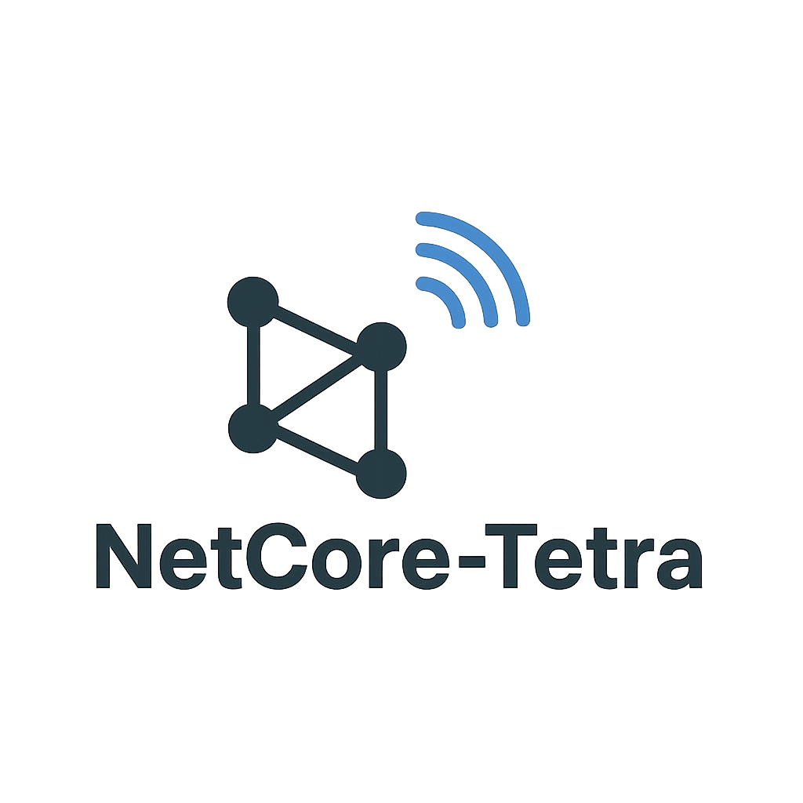
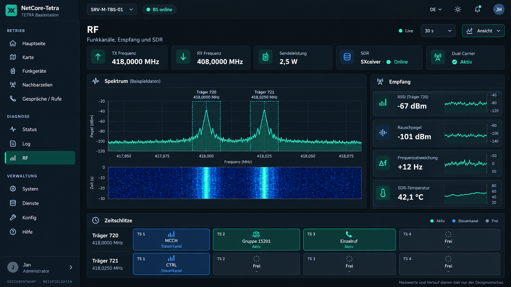

# Brainstorming: UI-Redesign für Basisstation und Dienste, RF-Arbeitsbereich, Dark Mode und Builddiagnose

**Archivhinweis, 09.10.2026:** Diese Datei dokumentiert das im Titel beziehungsweise Quellenrahmen genannte Gespräch und dessen damalige Entscheidungen. Historische Kommandos, Planungen, Versionsangaben und Fehlerbilder bleiben erhalten; der heutige technische Stand steht in der [Gesamtroadmap](../roadmaps/gesamtroadmap.md) und in den [aktuellen Dienstanleitungen](../services/README.md). Die Archivaufnahme bestätigt keine spätere Implementierung oder Live-Abnahme.

Stand der Repository- und Quellenprüfung: **06.10.2026**. Historische Ergebnisse beziehen sich auf die jeweils genannten Daten und Commits.

## Projektstand und Geltungsbereich

| Feld | Wert |
|---|---|
| Thema | Gemeinsames NetCore-Design für alle Basisstationsansichten und Dienst-WebUIs; Übernahme der RF-Referenz; vollständiger Dark Mode; Git-/Cargo-Fehler bei der Vorbereitung des TBS-Rollouts |
| Historischer Arbeitszeitraum | Designarbeit und Builddiagnose 02./03.10.2026, soweit aus sichtbaren Nachrichten, wiedergefundenen Bildern und datierten Arbeitsnotizen rekonstruierbar; Quellenprüfung 06.10.2026 |
| Erstellungsdatum | **2026-10-06**, Europe/Berlin |
| Repository | [JanHG98/netcore-tetra](https://github.com/JanHG98/netcore-tetra) |
| Archivbranch | **`Archiving`**, Groß-/Kleinschreibung beibehalten |
| Geprüfter Archiv-Ausgangscommit | `c90a7312172c2a1bd9725a2a4e5117b5f3c4ebd2` |
| Zusätzlich geprüfter Runtime-Stand | **`main@9116c15d645458f99e236712b67a1ad970432791`** |
| Historischer Designbranch | `feat/netcore-dashboard-design`; zum Prüfstand vom 06.10.2026 nicht mehr als Remote-Branch angeboten |
| Verifizierter letzter Designhead | `2fe2a1939a8795db3816d45973282781dae856f0` |
| Verifizierter UI-PR / Merge | [PR #59](https://github.com/JanHG98/netcore-tetra/pull/59), am 03.10.2026 um **05:37:28 UTC / 07:37:28 CEST** gemergt; Mergecommit `7137e0dd69877e1b604bf89148fd8b6b590c1a97` |
| Reale TBS im Fehlerbericht | `SRV-M-TBS-01`, Checkout `/opt/netcore-tetra`, Benutzer `jan`, anschließend Root-Shell |
| Ablage dieser Zusammenfassung | `Docs/archive/2026-10-06_netcore-ui-redesign-basisstation-dienste-rf-dark-mode-und-builddiagnose.md` |
| Bildarchiv | [118 Original-PNGs mit Index und Prüfsummen](assets/2026-10-06_netcore-ui-redesign/README.md) |

## Ergebnis und Nachweisstufen

**Gestaltungsentscheidung:** Nach mehreren Bildvorschauen wurde ein gemeinsames helles NetCore-Grunddesign mit Original-Logo, horizontaler Navigation und blau-weißen Akzenten ausgewählt. Die RF-Arbeitsfläche sollte das gewünschte Spektrum-/Wasserfalllayout übernehmen. Basisstation, sämtliche vorhandenen Dienstoberflächen und anschließend Dark Mode wurden gemeinsam auf `feat/netcore-dashboard-design` beauftragt und freigegeben. Der spätere Versuch, die neue Basisstation auf dem realen Host vorzubereiten, scheiterte zunächst am Git-Fetch und danach an nicht auffindbarem Cargo. Der letzte Reparaturblock wurde vorgeschlagen, sein Erfolg ist nicht bestätigt.

**Zusätzlich überprüfter Stand vom 06.10.2026:** Die Implementierung ist durch PR #59 in `main` enthalten. Historische CI-Läufe des Designheads konnten nachträglich erfolgreich geprüft werden; seit diesem Head wurden bis zum geprüften `main` keine UI-, Runtime- oder Testdateien geändert. Die beiden Design-Update-Anleitungen verweisen weiterhin auf den nicht mehr angebotenen Featurebranch und benötigen eine spätere Korrektur. Ein realer Host-Rollout wird durch Merge oder CI nicht belegt.

| Nachweisstufe | Bedeutung in diesem Archiv | Einordnung des UI-Vorhabens |
|---|---|---|
| **Idee** | Vorschau oder denkbarer Ausbau ohne belegten Implementierungsauftrag | Frühe Bildvarianten; vollständige Hilfe und weitere spätere Fachausbauten |
| **Beschlossen / geplant** | Ausdrückliche Projektentscheidung bzw. freigegebener Umfang | Einheitliches Grunddesign, RF-Anordnung, alle Dienst-UIs, Dark Mode und gemeinsamer Branch |
| **Implementiert** | Durch konkrete Repositorydateien und Commits nachgewiesen | Gemeinsame Oberflächen, Theme-Code, RF-Darstellung, Zugriffsschutz und Einbettung auf dem geprüften Quellstand vorhanden |
| **Getestet** | Ausgeführte Prüfung mit zuordenbarem Ergebnis | Verifizierte historische GitHub-CI auf `2fe2a193…`; frühere lokale Release-Builds nur als damaliger Arbeitsbericht überliefert |
| **Im Betrieb bestätigt** | Beobachtung am realen Dienst-/Funkhost oder Endgerät | Bestätigt sind die Git-/Cargo-Probleme auf der TBS; neuer UI-Build, Binary-Austausch, Neustart und Bedienabnahme sind für diesen Entwicklungsstand nicht bestätigt |

„26 Basisstationsansichten plus 29 Dienst-WebUIs“ beschreibt Komponenten-/Ansichtsabdeckung, keine Zahl von 55 einzelnen HTTP-Routen. Die Dienstvorschauen umfassten historisch 33 Ansichten; die ältere Rust-Brew-Oberfläche allein hat zehn Routen. Diese Zählungen sind keine widersprüchlichen Flotten- oder LXC-Inventare.

## Quellenbasis und offene Belege

Quellenbasis sind die Gestaltungsanforderungen, Terminalauszüge, die beiden letzten Buildanleitungen, erhaltene Entwicklungsnotizen und datierte Entwurfsbelege. Repository, PR-/CI-Metadaten und historische CI-Logs wurden gesondert geprüft. Die frühe Entwicklung ist nicht lückenlos dokumentiert.

- Die frühe Designphase ist teilweise nur anhand von Entwicklungsnotizen und wiedergefundenen Bildern nachvollziehbar.
- 118 thematisch und zeitlich zugehörige PNG-Dateien wurden wiedergefunden und unverändert archiviert. Eine exakte Zuordnung jedes Bildes zu seiner einzelnen ursprünglichen Entwurfsphase bzw. eine individuelle finale Freigabe jedes Bildes ist nicht verfügbar. Frühere und ersetzte Entwürfe bleiben als historische Varianten erhalten.
- Der damals fehlgeschlagene Zugriff auf `…/upload/Unbenannt.png` ist eine historische lokale Zugriffslücke. Zum Prüfstand vom 06.10.2026 konnte dieselbe benannte RF-Referenz wiedergefunden und visuell geprüft werden; ihr Inhalt ist daher keine fortbestehende Bildlücke.
- Frühere lokale Arbeitskopien, Builddateien und vollständige lokale Testlogs sind durch Workspace-Wartung nicht mehr vorhanden. Daraus folgt keine Löschung durch den Betreiber. Für historische CI stehen andere, nachträglich geprüfte Belege zur Verfügung.
- Es gibt keinen SSH-Zugriff bzw. keine neue Liveprüfung auf `SRV-M-TBS-01`. Inhalte der dortigen Konfiguration, Unit, Binarypfade, Rustinstallation, Git-Refspecs und tatsächlich laufende Listener sind unbekannt, soweit sie nicht ausdrücklich im geposteten Auszug enthalten sind.
- 25 ETSI-PDFs wurden diesem Projektkontext als Anhänge bereitgestellt. Für diese UI-/Git-/Cargo-Arbeit sind keine konkreten Normstellen als Entscheidungsgrundlage überliefert. Sie wurden hier nicht erneut fachlich ausgewertet oder als neu geprüfte TETRA-Konformitätsquelle ausgegeben. Die Standardsammlung gehört nicht zu den historischen Designbildern.
- Projektideen anderer Arbeitsphasen, etwa zentraler IAM-/RBAC-Ausbau, Syslog, Pi-VPN-Automatik, Handover oder Drive-Plugins, werden nicht rückwirkend zu Beschlüssen dieser Designarbeit. Wo geprüfte Quelltexte eine Abhängigkeit erwähnen, ist sie ausdrücklich als geprüfter Repositorykontext gekennzeichnet.

Es werden keine Passwörter, Tokens, privaten Schlüssel oder Konfigurationsgeheimnisse übernommen. Die Originalbilder wurden visuell auf sichtbare Zugangsdaten geprüft; der Prüfungsumfang und seine Grenzen stehen beim Bildarchiv.

## Entwicklung des Entwurfs und erreichte Ergebnisse

### Historisches Ziel und Ausgangslage

Ziel war ein gemeinsames Erscheinungsbild für Basisstation, Zentraldienste und weitere Dienst-WebUIs, anschließend die Vorbereitung eines lokalen Basisstations-Builds. Einstiegspunkt war `crates/tetra-entities/src/net_dashboard/html.rs` auf `main`; die Umsetzung erfolgte im Designbranch `feat/netcore-dashboard-design`.

Der Entwurf war bereits gebilligt. Die ursprünglichen Bilder und Entwicklungsnotizen sind teilweise erhalten; verbindliche Folgeanforderungen und Buildfehler werden von späteren Repository-Befunden getrennt dargestellt.

#### Umfang und endgültige Gestaltung

Festgelegt war ein gemeinsames Designprinzip für sämtliche Weboberflächen. Der Umfang wurde von der Basisstation auf Dienst-WebUIs erweitert. Nach Bildvorschau und Designabnahme erfolgte die Umsetzung gemeinsam in `feat/netcore-dashboard-design`; Dark Mode kam für jedes UI im selben Branch hinzu.

Aus dem wiederzugänglichen historischen Entwurfszusammenhang ergibt sich folgende Gestaltung:

- Heller Grundaufbau mit dem vorgesehenen NetCore-Logo.
- Horizontale Gestaltung und blauweiße Akzente als gemeinsames Erscheinungsbild.
- Wiedererkennbare Bedien- und Darstellungselemente über Basisstation und Dienst-WebUIs.
- Ein optisch gewünschter RF-Aufbau: großes Spektrum und Wasserfall links, Messwerte rechts und beide Träger unten.
- Dark Mode als zusätzliche Darstellung auf allen betroffenen Oberflächen.

Die RF-Anforderung war eine Gestaltungsvorgabe aus einer Bildreferenz. Aus ihr ergibt sich kein Beleg für eine Änderung der Funkfrequenzen, Trägerkonfiguration oder HF-Hardware. Die Archivierung darf solche technischen Änderungen nicht aus der Darstellung zweier Träger ableiten.

#### Seiten und Vorschauen

Historisch wurden 26 Basisstationsansichten und 29 Dienst-WebUIs als Umsetzungsschwerpunkt berichtet. Für die Dienstentwürfe wurden 33 Mockup-Ansichten berichtet; Dienstanzahl und Mockup-Anzahl sind unterschiedliche Zählgrößen. Die insgesamt berichteten 55 Oberflächen ergeben sich aus 26 Basisstationsansichten und 29 Dienst-WebUIs. Diese Zahlen ersetzen keine aktuelle Prüfung der tatsächlichen Routen und ausgelieferten Seiten.

Nachbarzellen und Hilfe wurden im ursprünglichen Entwurfsverlauf zunächst als Erweiterungen behandelt. Für eine Fortsetzung ist deshalb zu prüfen, ob entsprechende Ansichten bereits implementiert sind oder lediglich vorgeschlagen wurden. Eine Nennung als Entwurf oder Erweiterung ist kein Nachweis einer bestehenden Backend-Funktion.

### Endgültige Entscheidungen und Freigaben

#### Festgelegte Anforderungen

| Gegenstand | Endgültige Festlegung | Historischer Status |
| --- | --- | --- |
| Gemeinsames Design | Durch Basisstation, Zentraldienste und sämtliche Dienst-WebUIs ziehen | Beschlossen |
| Basisstationsvorschau | Alle vorhandenen Seiten zunächst als Bildvorschauen zeigen | Beschlossen; ursprüngliche Bildmenge teilweise nicht verfügbar |
| RF-Gestaltung | Gefallenden RF-Entwurf passend übernehmen | Beschlossen; ursprüngliche lokale Referenz zunächst nicht lesbar |
| Umsetzung | Nach Freigabe in neuem Branch einbauen und Anleitung liefern | Zur Umsetzung festgelegt |
| Gemeinsamer Branch | Alle neuen UIs in `feat/netcore-dashboard-design` bündeln | Beschlossen |
| Dark Mode | In demselben Branch auf jedem UI ergänzen | Beschlossen |
| Reale TBS | Design-Branch herunterladen und Basisstation kompilieren | Verlangt; erfolgreicher Abschluss nicht bestätigt |

#### Bedeutung der Freigaben

Nach Abnahme des Entwurfs wurde die Umsetzung auf Dienst-WebUIs und Dark Mode erweitert. Buildvorbereitung, Austausch der aktiven Binary und Betriebsabnahme bleiben eigenständige Schritte.

### Historische Abfolge

1. Das gebilligte Design wurde als Gestaltungsgrundlage für das gesamte Projekt festgelegt.
2. Für sämtliche Basisstationsseiten waren Bildvorschauen vorgesehen; Einstiegspunkt war `html.rs`.
3. Die RF-Bildreferenz wurde als gewünschte Layoutgrundlage ausgewählt.
4. Der erste lokale Zugriff auf `Unbenannt.png` scheiterte.
5. Die Umsetzung wurde für einen neuen Branch mit passender Updateanleitung festgelegt.
6. Der Umfang wurde auf alle Dienst-WebUIs erweitert.
7. Alle neuen UIs sollten gemeinsam in `feat/netcore-dashboard-design` entstehen.
8. Dark Mode wurde für jedes UI im selben Branch ergänzt.
9. Arbeitsberichte dokumentierten Implementierungen, Tests, Commits und PR.
10. Auf `SRV-M-TBS-01` scheiterte die Fetch-/Branchwechsel-Anleitung.
11. Als Ersatzweg entstand ein frischer Checkout mit Release-Build als `jan`.
12. Der Release-Build scheiterte mit „cargo not found“.
13. Der überarbeitete Buildblock sucht Cargo unter `root` und `jan`.
14. Das Ergebnis dieses letzten Blocks ist nicht dokumentiert.

Die Implementierung ist teilweise nur in verdichteten Arbeitsberichten dokumentiert. Diese Angaben gelten als historische Berichte, nicht als erneut ausgeführte Tests. Die konkreten nachfolgenden Buildfehler belegen, dass die Anleitung auf dem Zielhost noch nicht erfolgreich abgeschlossen war.

### Historisch berichtete Architektur und Implementierung

#### Basisstation und Build

Das Dashboard wird im NetCore-Tetra-Repository durch Rust-Code erzeugt. Der ausdrücklich genannte Einstiegspunkt ist `crates/tetra-entities/src/net_dashboard/html.rs`. Historisch gelesene Cargo-Dateien bestätigten Paketname und Binaryname `bluestation-bs`. Das Paket befindet sich unter `bins/bluestation-bs/`; der Binary-Einstieg wurde als `src/main.rs` angegeben. Der Workspace verwendet nach dem damaligen Lesebericht Rust Edition 2024.

Das Basisstationsdashboard ist nach der damaligen Update-Anleitung in die Binary eingebettet. Für dessen UI-Aktualisierung ist damit kein eigenständiger Node-/npm-Build als notwendiger Schritt dokumentiert. Die native Basisstationssoftware benötigt weiterhin ihre bestehenden Bibliotheken und Treiber. Genannt wurden SoapySDR, SDR-Treiber und native Codec-Abhängigkeiten.

Die historischen Standardfeatures des Pakets waren:

```toml
default = ["asterisk", "recording", "audio-player"]
```

Der UI-Rollout sollte diese Standardfeatures erhalten. Ein Weglassen über `--no-default-features` war nicht als freigegebene Problemlösung dokumentiert. Aus dieser Arbeitsphase ergibt sich keine neue Auswahl oder Entfernung von Funktionsfeatures.

#### Gemeinsamer Theme-Ansatz

Die historische Zusammenfassung berichtet einen gemeinsamen Theme-Schlüssel `netcore-theme`. Zusätzlich seien die früheren Schlüssel `fs_theme` und `netcore-service-theme` berücksichtigt worden. Ein vorheriges Basisstationsverhalten mit „blue“ sei erhalten geblieben; dessen genaue Semantik ist nicht hinreichend überliefert. Es darf deshalb nicht ungeprüft als weiterer feststehender Storage-Schlüssel oder eigenständiger Modus dokumentiert werden.

Die Theme-Persistenz wurde je Origin beschrieben. Verschiedene Dienste auf unterschiedlichen Ports können daher getrennte gespeicherte Einstellungen besitzen. Aus der Gestaltung aller UIs folgt keine belegte zentrale Synchronisation des ausgewählten Themes über alle Dienste hinweg. Login-, öffentliche Seiten, TTS/Piper und zehn RustBrew-Seiten seien in die Dark-Mode-Arbeit einbezogen worden.

#### Historische Veröffentlichungsangaben

Die frühere Zusammenfassung nennt folgende Ergebnisse:

| Gegenstand | Historisch berichteter Wert | Beleggrenze |
| --- | --- | --- |
| Letzter UI-/Dark-Mode-Commit | `2fe2a1939a8795db3816d45973282781dae856f0` | Vor erneuter Prüfung historischer Bericht |
| Berichteter Tree | `e68558c4df13d3d8b56df8c3611ac682b02889c1` | Tree-ID, kein zusätzlicher Branch-HEAD |
| Vorheriger Dienste-Commit | `dc70ad89b0e5de8be363211042a247811bd9d734` | Vor erneuter Prüfung historischer Bericht |
| Früher Basisstations-Commit | `783fd556...` | Nur verkürzt überliefert; keine vollständige SHA erfinden |
| Pull Request | [PR 59](https://github.com/JanHG98/netcore-tetra/pull/59) | Geprüften Zustand getrennt prüfen |
| Historischer PR-Titel | NetCore-Design mit Dark Mode für Basisstation und alle Dienst-WebUIs | Überliefert, nicht neu erstellt |

Der PR wurde damals als offen und mergebar beschrieben. Die CI sei zum Ende des früheren Arbeitsberichts noch gelaufen. Daraus folgt weder ein späterer Merge noch ein geprüfter CI-Erfolg. Diese Historie ist ebenfalls kein Nachweis, dass die reale TBS bereits den neuen Commit verwendet.

### Historisch gemeldete Prüfungen und ihre Grenzen

Die verdichtete Zusammenfassung berichtet mehrere bestandene Prüfgruppen. Die ursprünglichen vollständigen Logs und sämtliche exakten Befehle sind in diesem Archivierungsverlauf nicht verfügbar. Die überlieferten Zahlen werden deshalb unverändert als Arbeitsbericht erhalten.

| Prüfgruppe laut historischem Bericht | Berichtetes Ergebnis |
| --- | --- |
| shared | 78, bestanden |
| core | 405, bestanden |
| media | 388, bestanden |
| aux | 431, bestanden |
| workflow | 15, bestanden |
| base | 136, bestanden |
| edge | Bestanden, keine Zahl überliefert |
| Rust | 155, bestanden |
| Brew | 14, bestanden |
| Basisstationsbackend | 16, bestanden |
| Alert | 76, bestanden |
| Release-Build | 20 Rust-Dienstpakete plus Basisstation, 21 Binaries, bestanden |

Die Prüfgruppennamen und ihre Zählsemantik sind nicht vollständig erklärt. Die Zahlen dürfen daher nicht ungeprüft addiert oder als neue Gesamtzahl voneinander unabhängiger Tests dargestellt werden.
Überlappungen zwischen Gruppen können anhand der verfügbaren Zusammenfassung nicht ausgeschlossen werden.
Auch Plattform, native Abhängigkeiten und genaue Umgebung jedes historischen Laufs sind nicht vollständig überliefert.

Historische erfolgreiche Entwicklungsbuilds bestätigen nicht automatisch einen erfolgreichen Build auf `SRV-M-TBS-01`.
Für diesen Host fehlt ein erfolgreicher Release-Abschluss im Betriebsprotokoll.
Es gibt außerdem keine bestätigte Sichtprüfung der neuen Oberfläche oder des Dark Mode im realen Betrieb.

### Tatsächlich beobachteter Zustand auf der Basisstation

#### Host und Checkout

Als Betriebsbeleg liegt ein Terminalauszug von `SRV-M-TBS-01`.
Er meldete sich als `jan` an und wechselte mit `sudo -i` in eine Root-Shell.
Anschließend arbeitete er unter `/opt/netcore-tetra`.
Zugangsdaten oder Passworteingaben werden nicht übernommen.

Nach dem fehlgeschlagenen Update zeigte Git:

```text
## katwarn/nina...origin/katwarn/nina
 M Cargo.lock
 M config.toml
 M sds_log.json
?? config.toml.bak.~1~
?? config.toml.bak.~2~
?? config.toml.before-cli-20260918-211136
?? config.toml.pre-phase11c-20260918-181849
?? gitlog.txt
82813ba43965d20c5b3f569f662a3aa21c0f8755
```

Damit sind der alte Checkout, dessen angezeigter HEAD und die lokalen Änderungen tatsächlich belegt.
Die Inhalte von `config.toml`, `sds_log.json` und den Sicherungsdateien wurden nicht gezeigt.
Konkrete Betriebsports, Funkparameter oder Dienstpfade dürfen deshalb nicht daraus erfunden werden.
Die lokale Konfiguration und die übrigen Änderungen sollten für die Fortsetzung erhalten bleiben.

#### Nicht bestätigte Betriebsschritte

Nicht bestätigt sind ein erfolgreicher Branchwechsel, ein erfolgreich beendeter Cargo-Check oder ein neuer Release-Build.
Es gibt keine bestätigte Installation der neuen Binary.
Es gibt keinen bestätigten systemd-Neustart oder erfolgreichen Healthcheck.
Der tatsächliche Unitname, `ExecStart`, Konfigurationspfad und installierte Binarypfad fehlen im Betriebsprotokoll.

### Fehler: Fetch auf alten Remote-Branch

#### Tatsächlich versuchter Befehlsblock

Das Betriebsprotokoll zeigt folgenden ausgeführten Ablauf; er enthielt keine durchgängige Fehlerabbruchlogik:

```bash
git fetch origin --prune
if git show-ref --verify --quiet refs/heads/feat/netcore-dashboard-design; then
    git switch feat/netcore-dashboard-design
    git merge --ff-only origin/feat/netcore-dashboard-design
else
    git switch --track -c feat/netcore-dashboard-design origin/feat/netcore-dashboard-design
fi
git status --short --branch
git rev-parse HEAD
cargo check --locked -p bluestation-bs
```

Beobachtete Fehlermeldungen:

```text
fatal: couldn't find remote ref refs/heads/katwarn/nina
fatal: invalid reference: origin/feat/netcore-dashboard-design
```

Der Fetch schlug fehl, und der gewünschte lokale Remote-Verweis war danach nicht verfügbar.
Status und HEAD zeigen, dass die Arbeitskopie auf dem alten Branch blieb.
Der weitere Block lief zumindest bis zur Status- und HEAD-Ausgabe weiter.
Eine Ausgabe des abschließenden Cargo-Checks ist nicht vorhanden.

#### Diagnose und ihre Beleggrenze

Die vermutete Ursache war ein eingeschränkter `remote.origin.fetch`, der noch auf `katwarn/nina` zeigte.
Ein solcher Refspace kann beim Fetch eines inzwischen fehlenden Branches die gezeigte Fehlermeldung erklären.
Die Git-Konfiguration des realen Hosts wurde im dokumentierten Arbeitsstand jedoch nicht gelesen.
Die Hypothese ist deshalb plausibel, aber nicht als abschließend nachgewiesene Ursache zu kennzeichnen.

Als gezielter technischer Weg wurde ein expliziter Ref-Spec-Abruf erwogen:

```bash
git fetch origin refs/heads/feat/netcore-dashboard-design:refs/remotes/origin/feat/netcore-dashboard-design
```

Dieser Befehl ist im verfügbaren Betriebsprotokoll nicht als erfolgreich ausgeführt belegt.
Er ersetzt außerdem nicht die Prüfung lokaler Änderungen vor einem späteren Checkoutwechsel.
Ein pauschales `git reset --hard` oder ungeprüftes Verwerfen der Konfiguration wurde nicht durchgeführt.

`cargo check` war zur gewünschten Release-Erzeugung ohnehin nicht ausreichend.
Es prüft das Paket, erzeugt aber nicht die für den Austausch erwartete Release-Binary.
Der spätere Buildvorschlag verwendete deshalb `cargo build --release --locked`.

### Erster Ersatzvorschlag: frischer Clone und Build als Jan

#### Zweck und Status

Vorgeschlagen war ein separater Clone des Designbranches im Home-Verzeichnis von `jan`.
Dadurch sollte der problematische Fetch des alten Checkouts umgangen werden.
Die produktive Arbeitskopie unter `/opt/netcore-tetra` mit ihren Änderungen sollte unverändert bleiben.
Die Wahl des Buildbenutzers `jan` beruhte jedoch auf einer nicht bestätigten Annahme über dessen Rustinstallation.

Der folgende Block wurde tatsächlich im dokumentierten Arbeitsstand vorgeschlagen.
Sein erfolgreicher Abschluss ist nicht bestätigt; der spätere Fehlerbericht meldet fehlendes Cargo.
Ein vollständig erfolgreicher Clone kann aus dieser knappen Rückmeldung nicht separat nachgewiesen werden.

#### Wortgetreuer vorgeschlagener Befehlsblock

```bash
sudo -u jan -H bash <<'BASH'
set -e

cd "$HOME"

if [ -f "$HOME/.cargo/env" ]; then
    . "$HOME/.cargo/env"
fi

TBS_BUILD_DIR="$HOME/netcore-dashboard-build-$(date +%Y%m%d-%H%M%S)"

git clone --single-branch \
    --branch feat/netcore-dashboard-design \
    https://github.com/JanHG98/netcore-tetra.git \
    "$TBS_BUILD_DIR"

cd "$TBS_BUILD_DIR"

git branch --show-current
git rev-parse HEAD

cargo build --release --locked \
    -p bluestation-bs \
    --jobs 2 \
    --target-dir "$TBS_BUILD_DIR/target"

printf '\nBuild erfolgreich. Neue Binary:\n%s\n' \
    "$TBS_BUILD_DIR/target/release/bluestation-bs"
BASH
```

Der vorgesehene Ausgabeort war `$TBS_BUILD_DIR/target/release/bluestation-bs`.
Zwei parallele Jobs wurden vorgeschlagen, ohne eine im dokumentierten Arbeitsstand dokumentierte Leistungs- oder Speicherbemessung.
Der Block enthält keinen Austausch der laufenden Binary und keinen Dienstneustart.
`set -e` sollte den Shellablauf bei einem fehlschlagenden Build beenden.

### Fehler: Cargo in der gewählten Benutzerumgebung nicht gefunden

Der Buildversuch endete mit „cargo not found“.
Damit ist ein erfolgreicher Abschluss des zuvor vorgeschlagenen Builds ausgeschlossen.
Der genaue Fehlertext, Exitcode und Installationspfad wurden nicht geliefert.

Die feste Wahl von `jan` als Buildbenutzer war ungesichert: Eine unter `root` eingerichtete Rustinstallation kann in der Umgebung von `jan` fehlen.

Diese Erklärung ist eine mögliche Ursache, keine bestätigte Inventarisierung des Hosts.

Nicht nachgewiesen sind:

- Dass Cargo tatsächlich unter `root` installiert ist.
- Dass Cargo überhaupt nicht installiert ist.
- Dass ausschließlich die Umgebungsvariable `PATH` falsch gesetzt ist.
- Dass die vorhandene Toolchain Rust Edition 2024 unterstützt.
- Dass der frische Clone vollständig und fehlerfrei vorliegt.

Die Fortsetzung sollte deshalb zunächst vorhandene Rust-/Cargo-Installationen feststellen.
Eine automatische Neuinstallation oder ein destruktiver Checkoutreset war durch diese Fehlermeldung nicht begründet.

### Letzter Ersatzvorschlag: Cargo unter Root und Jan erkennen

#### Wortgetreuer vorgeschlagener Befehlsblock

Der zuletzt im dokumentierten Arbeitsstand gegebene Block lautet:

```bash
bash <<'BASH'
set -e

TBS_BUILD_DIR=''
for TBS_DIR in /home/jan/netcore-dashboard-build-*; do
    if [ -f "$TBS_DIR/Cargo.toml" ]; then
        TBS_BUILD_DIR="$TBS_DIR"
    fi
done

if [ -z "$TBS_BUILD_DIR" ]; then
    echo "Der heruntergeladene Build-Ordner wurde nicht gefunden."
    exit 1
fi

TBS_BUILD_USER=''
for TBS_USER in root jan; do
    if sudo -u "$TBS_USER" -H bash -lc \
        'export PATH="$HOME/.cargo/bin:$PATH"; cargo --version' \
        >/dev/null 2>&1; then
        TBS_BUILD_USER="$TBS_USER"
        break
    fi
done

if [ -z "$TBS_BUILD_USER" ]; then
    echo "Cargo lässt sich weder unter root noch unter jan starten."
    exit 1
fi

printf 'Build-Benutzer: %s\nQuellcode: %s\n' \
    "$TBS_BUILD_USER" "$TBS_BUILD_DIR"

sudo -u "$TBS_BUILD_USER" -H bash -lc '
    set -e
    export PATH="$HOME/.cargo/bin:$PATH"
    cd "$1"
    cargo --version
    cargo build --release --locked -p bluestation-bs \
        --jobs 2 --target-dir "$HOME/netcore-dashboard-target"
    printf "\nBuild erfolgreich. Neue Binary:\n%s\n" \
        "$HOME/netcore-dashboard-target/release/bluestation-bs"
' bash "$TBS_BUILD_DIR"
BASH
```

#### Verhalten, Grenzen und Ergebnis

Der Block sucht bestehende Checkoutordner unter `/home/jan/netcore-dashboard-build-*`.
Bei mehreren passenden Verzeichnissen behält er den letzten Treffer der Shell-Glob-Reihenfolge.
Bei den gleichförmigen Zeitstempeln entspricht das üblicherweise dem neuesten Namen, nicht einer geprüften Änderungszeit.
Das Homeverzeichnis `/home/jan` ist dabei fest angenommen.

Cargo wird zuerst unter `root`, danach unter `jan` über `cargo --version` geprüft.
Die jeweilige Umgebung erhält explizit `$HOME/.cargo/bin` im `PATH`.
Verwendet wird der erste Benutzer, unter dem dieser Aufruf erfolgreich ist.
Eine passende `rustc`-Version oder sämtliche nativen Buildabhängigkeiten werden damit noch nicht geprüft.

Der Ausgabeort änderte sich gegenüber dem ersten Block auf `$HOME/netcore-dashboard-target/release/bluestation-bs`.
Welches Home gemeint ist, hängt vom gewählten Buildbenutzer ab.
Auch dieser Block installiert keine Binary und startet keinen Dienst neu.

Ein Ergebnis des vorgeschlagenen Buildblocks ist nicht dokumentiert.
Der Block darf daher ausschließlich als vorgeschlagene Reparatur und nicht als funktionierende, am Host bestätigte Lösung bezeichnet werden.
Besitzrechte, mögliche Git-Zugriffe aus Buildskripten und die native Linkerumgebung bleiben zusätzlich zu prüfen.

### Erhaltene Dateien, Abhängigkeiten und Installationsgrenzen

Wichtige historische Pfade sind `/opt/netcore-tetra`, Jans neue Buildordner und der separate Cargo-Targetordner.
Die Änderungen an `Cargo.lock`, `config.toml` und `sds_log.json` waren bewusst zu erhalten.
Keine dieser Dateien wurde im sichtbaren Reparaturverlauf absichtlich zurückgesetzt oder ersetzt.

Die damalige Update-Anleitung empfahl, unter dem bisherigen Buildbenutzer zu kompilieren.
Vor einer Installation sollten Unitname, `ExecStart`, Konfigurationspfad und tatsächlicher Binarypfad ermittelt werden.
Mögliche Unitnamen der Anleitung waren `tetra`, `bluestation`, `tetra-bluestation` und `bluestation-bs`.
Keiner dieser Namen ist für den im dokumentierten Arbeitsstand gezeigten Host bestätigt.

Für einen allgemeinen Updater wurden historisch `MIGRATE_LOCAL_TTS_CONFIG=0` und `DISABLE_LOCAL_PIPER=0` genannt.
Das sind Hinweise für einen späteren Installationsweg und keine auf diesem Host beobachteten Änderungen.
Der konkrete Auftrag der Fehlersuche endete beim Herunterladen und Kompilieren.

### Ersetzte oder nicht weiterverfolgte Ansätze

- Der einfache Fetch-/Branchwechsel-Block scheiterte an einem alten Remote-Verweis und wurde durch einen frischen Checkout ersetzt.
- Der bloße Cargo-Check wurde durch einen Release-Build ersetzt, weil eine ausführbare Binary benötigt wird.
- Die feste Benutzerwahl `jan` wurde nach dem Cargo-Fehler durch eine Erkennung unter `root` und `jan` ersetzt.
- Ein separater neuer Branch je Dienst entspricht nicht der endgültigen Vorgabe, alles in einem gemeinsamen Design-Branch zu bündeln.
- Die anfängliche Vorschauanforderung wurde für den gebilligten Entwurf durch ausdrückliche Einbaufreigabe abgelöst.
- Ein Hard-Reset der produktiven Arbeitskopie oder ungeprüftes Verwerfen lokaler Dateien war kein durchgeführter Lösungsweg.

### Offene Aufgaben und konkrete nächste Schritte

1. Den geprüften Inhalt des Design-Branches, den PR-Status und die tatsächlichen UI-Routen getrennt verifizieren.
2. Die historischen Bildreferenzen und Vorschauen wiederherstellen, zuordnen und unter dem Archivpfad ablegen.
3. Fehlende Originalnachrichten oder Bilder ausdrücklich als Quellenlücken dokumentieren.
4. Auf der TBS den tatsächlichen Cargo-/Rustpfad und den geeigneten Buildbenutzer feststellen.
5. Rust Edition 2024 sowie SoapySDR-, Treiber- und Codec-Abhängigkeiten prüfen.
6. Den Design-Branch erfolgreich als Release bauen und tatsächlich verwendeten Commit sowie Binarypfad festhalten.
7. Vor dem Austausch reale systemd-Unit, `ExecStart` und Konfigurationspfad ermitteln.
8. Einen nachprüfbaren Installations- und Rückfallweg vorbereiten; lokale Konfiguration und vorhandene Binary erhalten.
9. Basisstationsseiten einschließlich RF und Dark Mode auf der echten TBS im Betrieb prüfen.
10. Die Dienst-WebUIs auf den tatsächlichen Diensthosts ausrollen und deren Betrieb gesondert bestätigen.
11. Login, öffentliche Ansichten, Theme-Persistenz und Verhalten zwischen verschiedenen Origins prüfen.

Die Reihenfolge der Punkte 4 bis 7 folgt den tatsächlichen Buildproblemen.
Eine verbindliche zeitliche Priorisierung sämtlicher Projektfeatures wurde für diesen Entwicklungsstand nicht vereinbart.
Andere Projektideen aus angrenzenden Arbeitsphasen sind keine zusätzlichen Entscheidungen dieser Design- und Buildunterhaltung.

#### Roadmap-Kandidaten

- Gemeinsames UI-Design dauerhaft über neue Dienste und neue Basisstationsseiten hinweg beibehalten.
- Nachbarzellen und Hilfe anhand tatsächlicher Backend-Funktionen weiterführen; Entwurf und Implementierung unterscheiden.
- Einen robusten Updateweg für Checkouts mit eingeschränkten oder veralteten Fetch-Refspecs vorsehen.
- Buildbenutzer, Rusttoolchain und native Abhängigkeiten vor dem Start eines Updates eindeutig feststellen.
- Release-Build, Installation und Betriebsprüfung als getrennte, nachprüfbare Phasen dokumentieren.
- Dark Mode über alle tatsächlich ausgelieferten Seiten vollständig erhalten, einschließlich Login und öffentlicher Oberflächen.

### Historische Quellenlücken und Abschlussbewertung

Nicht alle ursprünglichen Bildvorschauen und vollständigen früheren Implementierungsnachrichten sind unmittelbar verfügbar.
Der damalige fehlgeschlagene lokale Zugriff betraf `/workspace/scratch/a884199e0958/upload/Unbenannt.png`.
Ein fehlender Scratch-Pfad ist kein Beweis, dass eine Library-Datei ebenfalls fehlt.

Historische Testlogs, sämtliche exakten Testbefehle und Plattformdetails sind nur teilweise oder gar nicht überliefert.
Der geprüfte Repository-Zustand muss deshalb separat geprüft werden.
Die verfügbaren ETSI-Anhänge wurden für die hier behandelten UI- und Buildentscheidungen nicht als normative Quelle verwendet.
Protokollfunktionen oder Funkparameter dürfen nicht nachträglich aus diesen Anhängen in die Gestaltungsentscheidungen hineininterpretiert werden.

Gesichert sind die Designanforderungen, die ausdrücklichen Umsetzungsfreigaben und die zwei durch den Betreiber gemeldeten Buildprobleme.
Implementierungen und umfangreiche Entwicklungsprüfungen sind historisch berichtet und durch Repository-Evidenz ergänzbar.
Ein erfolgreicher neuer Build und die Nutzung der neuen UIs auf `SRV-M-TBS-01` bleiben in den erhaltenen Betriebsnotizen unbestätigt.

## Geprüfter Repository-Stand: getrennte Verifikation vom 06.10.2026

### Branches, Commits und Ablösung des Featurebranches

Die Remoteabfrage nach `Archiving`, `main` und `feat/netcore-dashboard-design` lieferte bei der Archivierung `Archiving@c90a731…` und `main@9116c15…`, aber keinen Treffer für den Designbranch. Das beweist seine geprüfte Nichtverfügbarkeit unter diesem Ref, nicht den genauen Zeitpunkt oder die Ursache seiner Entfernung.

PR #59 heißt **„NetCore-Design mit Dark Mode für Basisstation und alle Dienst-WebUIs“**. Die PR-Metadaten bestätigen `merged = true`, den Mergezeitpunkt und folgenden Commitstapel:

| Schritt | Tatsächlicher Commit | Aussage des Commits |
|---|---|---|
| Basisstationsdesign | [`783fd556344eb397bb9835da2c791893ca2dc745`](https://github.com/JanHG98/netcore-tetra/commit/783fd556344eb397bb9835da2c791893ca2dc745) | Gemeinsame horizontale Shell, originales Branding, Übersicht/Aufzeichnungen/Dienste und RF-Arbeitsbereich; Nachbarkonfiguration, opt-in öffentliche Aggregate, sitzungsgeprüfter Start, Browserprüfungen und Rolloutdokumentation |
| Dienst-WebUIs | [`dc70ad89b0e5de8be363211042a247811bd9d734`](https://github.com/JanHG98/netcore-tetra/commit/dc70ad89b0e5de8be363211042a247811bd9d734) | Gemeinsames Design für alle Dienst-WebUIs |
| Persistenter Dark Mode | [`2fe2a1939a8795db3816d45973282781dae856f0`](https://github.com/JanHG98/netcore-tetra/commit/2fe2a1939a8795db3816d45973282781dae856f0) | Vollständiger gespeicherter Dark Mode für die NetCore-WebUIs |
| Integration nach main | [`7137e0dd69877e1b604bf89148fd8b6b590c1a97`](https://github.com/JanHG98/netcore-tetra/commit/7137e0dd69877e1b604bf89148fd8b6b590c1a97) | Tatsächlicher Merge der PR am 03.10.2026 |
| Geprüfter main | [`9116c15d645458f99e236712b67a1ad970432791`](https://github.com/JanHG98/netcore-tetra/commit/9116c15d645458f99e236712b67a1ad970432791) | Zusätzlich späterer Dokumentations-/Roadmapstand; kein neuer UI-Runtimecode gegenüber dem Designhead |

Der [Vergleich des Designheads mit dem geprüften main](https://github.com/JanHG98/netcore-tetra/compare/2fe2a1939a8795db3816d45973282781dae856f0...9116c15d645458f99e236712b67a1ad970432791) zeigt fünf zusätzliche Commits, keinen Rückstand und Änderungen ausschließlich an `AGENTS.md`, `Docs/CENTRAL_IDENTITY_RBAC_ROADMAP.md`, `Docs/NETCORE_DRIVE_ROADMAP.md`, `README.md`, `ROADMAP.md`, `system-backend/roadmap.md` und `wiki/Roadmap.md`. UI-, Runtime- und Testdateien des geprüften Designheads sind bis zu diesem Snapshot unverändert enthalten.

Auch die relevanten Code-/Designdateien im zu Beginn geladenen `Archiving` entsprechen dem geprüften main. Die Archivierung integriert keinen Featurebranch erneut und verändert keinen Runtimecode.

### Basisstationsarchitektur und Build-Assets

Der ursprünglich verlinkte Pfad `crates/tetra-entities/src/net_dashboard/html.rs` bleibt der Rust-Einstieg für eingebettete Oberflächen. Zum Prüfstand vom 06.10.2026 enthält er nicht mehr die gesamte Oberfläche als einen monolithischen HTML-String, sondern diese Build-Asset-Zuordnung:

```rust
pub const DASHBOARD_HTML: &str = include_str!("ui/dashboard.html");
pub const LOGIN_HTML: &str = include_str!("ui/login.html");
pub const NETCORE_CSS: &str = include_str!("ui/netcore.css");
pub const NETCORE_JS: &str = include_str!("ui/netcore.js");
pub const NETCORE_RF_CSS: &str = include_str!("ui/netcore-rf.css");
pub const NETCORE_RF_JS: &str = include_str!("ui/netcore-rf.js");
pub const NETCORE_LOGIN_JS: &str = include_str!("ui/netcore-login.js");
pub const NETCORE_LOGO: &[u8] = include_bytes!("ui/netcore-logo.png");
```

Das bedeutet für eine Fortsetzung: **nur `html.rs` zu ersetzen genügt nicht**. Der vollständige zusammengehörige Quellstand einschließlich `ui/` und Serverhandler wird benötigt. Der Rust-Build bettet HTML/CSS/JavaScript/PNG in `bluestation-bs` ein. Zur Laufzeit entsteht daraus kein zusätzlicher Node-Prozess, Frontendcontainer oder separater Webserver.

| Pfad | Rolle |
|---|---|
| `crates/tetra-entities/src/net_dashboard/html.rs` | Konstanten und Build-Einbettung |
| `crates/tetra-entities/src/net_dashboard/server.rs` | HTTP-/WebSocket-Bedienung, Sitzungen, Assets, öffentliche Projektion und RF-Snapshot |
| `…/ui/dashboard.html` | Bestehende Fachansichten, früher Theme-Initializer und Dashboard-Bootstrap |
| `…/ui/login.html` | Anmeldung mit früher Theme-Auswahl und optional freigegebenen Aggregaten |
| `…/ui/netcore.css` / `netcore.js` | Gemeinsame Basisstationsgestaltung, horizontale Navigation, neue Gliederung und Bestands-DOM-Anbindung |
| `…/ui/netcore-rf.css` / `netcore-rf.js` | Spektrum/Wasserfall, Qualitäts-/SDR-Bereich, Konstellation und Theme-Neuzeichnung |
| `…/ui/netcore-login.js` | Verhalten der Anmeldeseite und ihrer öffentlichen Vorschau |
| `…/ui/netcore-logo.png` | Unverändertes geliefertes Original-PNG, als Build-Asset eingebettet |
| `crates/tetra-config/src/bluestation/sec_dashboard.rs` | Dashboard-Konfigurationsmodell und Defaults |
| `bins/bluestation-bs/Cargo.toml` | Paket-/Binaryname, Einstieg und Standardfeatures |
| `Docs/BASISSTATION-DESIGN.md` | Technische Design- und Ansichtsübersicht |

Die Gestaltung arbeitet mit gemeinsamen semantischen CSS-Farben und Komponenten. Das Originalzeichen und die Wortmarke werden über CSS aus dem gelieferten PNG angeordnet; daraus folgt keine Neuzeichnung eines abweichenden Logos. Vorhandene IDs, DOM-Knoten und Handler werden so erhalten, dass neue Navigation die bestehende Fachbedienung weiterverwendet.

### Vollständige Ansichtsabdeckung der Basisstation

Quelle ist die am überprüften Stand vorhandene `Docs/BASISSTATION-DESIGN.md`, ergänzt durch die HTML-/JavaScript-Dateien. Die 26 Ansichten sind wie folgt gegliedert:

| Bereich | Ansichten | Fachlicher Status / Grenze |
|---|---|---|
| Anmeldung | Login | Vorhandene Cookie-Sitzung; optional freigegebene Aggregate neben dem Formular |
| Öffentlich | Öffentlicher Status | Nur bei ausdrücklich aktivierter öffentlicher Übersicht; kein administrativer Zugang |
| Hauptseite | Funklage | Teilnehmer-/Rufzahlen, Trägerbelegung, Systemdaten, Stationsprofil und letzte Aktivität |
| Funkbetrieb | Funkgeräte; Rufe; Zuletzt gehört; SDS-Protokoll; Paketdaten; RF-Monitor | Bestehende Aktionen und Telemetrie; lokaler Suchfilter und Detailauswahl bei Funkgeräten |
| Netzkarte | Karte; Nachbarzellen | Bestehende Positionen und konfigurierte Nachbarzellen; keine gemessene Verfügbarkeit oder bewiesenes Handover |
| Diagnose | Systemzustand; Live-Protokoll; Dienste | Bestehende Zustände, Logs und die vorhandene TBS-Matrix zentraler Dienste / lokaler Ersatzwege |
| Verwaltung | System; Konfiguration; WLAN; Asterisk SIP; Audio-Zentrale; Aufzeichnungen; Telegram; Hilfe | Aufzeichnungen getrennt von Medien/Aussendung; WLAN weiterhin abhängig von NetworkManager; Hilfe mit Platzhalterinhalt |
| Interne Integrationen | DAPNET; EchoLink; MeshCom; GeoAlarm | Vorhandene sitzungsabhängige Sichtbarkeitsregeln und Aktionen bleiben maßgeblich |

Die in dieser Designbeschreibung genannte **17-Dienste-Matrix** der TBS ist ein anderer Ausschnitt als die **29 gestalteten Dienst-WebUIs**. Sie darf nicht als geprüfte Gesamtzahl real betriebener LXCs oder Backendprozesse ausgegeben werden. Die aktuelle Gesamtroadmap benennt darüber hinaus Inventardrift verschiedener Kataloge; dieser Prüfdurchlauf vom 06.10.2026 führt keine Flotteninventur aus.

Nachbarn sind inzwischen als konfigurationsbasierte UI implementiert. `neighbor_cell_snapshot` projiziert die vorhandene Konfiguration; die Oberfläche sagt ausdrücklich: **„Verfügbarkeit und Handover werden hier nicht gemessen.“** Das frühere „geplante Erweiterung“ ist daher für die UI-Navigation/Anzeige teilweise überholt, für eine reale Live-Handover-/Verfügbarkeitsfunktion aber weiterhin keine Umsetzungsaussage.

Hilfe besitzt ebenfalls einen implementierten Navigationsplatzhalter mit **„In Vorbereitung“**. Eine vollständige integrierte Bedien-/Fachdokumentation wurde für diesen Entwicklungsstand nicht fertiggestellt.

### RF: übernommenes Layout und korrigierte Messbedeutung

Endgültiges Grundprinzip: großer Spektrum-/Wasserfallbereich links, Qualitäts-/SDR-Messwerte rechts und beide tatsächlich bekannten Träger bzw. ihre Zeitschlitze darunter. Die Konstellation ist als aufklappbares Detail vorhanden. Die visuelle Referenz wurde damit in das gemeinsame horizontale NetCore-Design übertragen; ihre alte Seitenleiste ist keine Vorgabe für die spätere finale Navigation.

Technisch trennt die Implementierung:

- **TX-DSP vor dem Leistungsverstärker:** erzeugtes Basisband, Spektrum, Wasserfall, RMS/Peak in dBFS, EVM/PAPR und π/4-DQPSK-Konstellation. Das ist keine kalibrierte Antennen- oder Ausgangsleistungsmessung.
- **SDR-Istwerte:** vorhandene Readbacks, Gain und weitere tatsächlich bereitgestellte SDR-Telemetrie.
- **Externe HF-Probe im RF-Monitor:** separate Vorlauf-/Rücklaufleistung in W, VSWR und PA-Temperatur, soweit eine reale Probe diese Werte liefert. Ohne Probe bleiben entsprechende Werte fehlend; eine „Keine Messwerte …“-Anzeige ersetzt keinen künstlichen Zahlenwert.
- **Träger-/Slotbelegung:** beim Sekundärträger ist physischer Funk-TS1 **Steuerung/Guard**. Funk-TS2–4 entsprechen den logischen TS5–TS7. Ein altes Entwurfsbild mit anders beschriftetem zweiten Steuerkanal ist keine Protokoll- oder Betriebskonfiguration.

Die Basis-RF kennzeichnet ihre Herkunft als **„Live-TX-DSP vor dem Leistungsverstärker · keine kalibrierte Antennenmessung“**. Null-Werte, Spektrumslücken und fehlende Proben werden nicht durch Vorschauwerte ersetzt. Theme-Wechsel zeichnen die Canvas-Grafiken sofort mit passenden Hintergründen und Beschriftungsfarben neu.

Die RF-Referenz enthält unter anderem `418,0000 MHz`, `408,0000 MHz`, `2,5 W` und dBm-Beschriftungen. Das Bild trägt ausdrücklich Entwurfs-/Beispieldatenhinweise. Diese Werte wurden **nicht als Ist-Parameter von Jans TBS bestätigt** und sind kein Nachweis einer 2,5-W-Aussendung, Empfängerkalibrierung oder zweier echter Kontrollkanäle.

### Gemeinsame Dienstarchitektur und Pflege der Bundles

Die Dienstshell liegt unter `system-backend/shared/web-ui/`:

| Baustein | Zweck |
|---|---|
| `assets/service-design.css` | Gemeinsame Farben, Kopf, horizontale Navigation, Tabellen, Formulare, Dialoge, Statusfarben und responsive Regeln |
| `assets/service-theme-init.js` | Blockierende frühe Theme-Anwendung am Beginn des Head |
| `assets/service-design.js` | Umschalter, Einordnung vorhandener Navigation, Theme-Ereignis und Synchronisation gleicher Origin |
| `assets/netcore-logo.data-uri` | Eingebettete Original-PNG-Quelle |
| `service-design.rs` | Rust-Renderer für vorhandene Diensttemplates; Standardbibliothek genügt |
| `assets/netcore.css`, `assets/netcore.js`, `i18n/de.json`, `i18n/en.json` | Vorhandene Shared-Bausteine für Layout, API-Client, Status, Bestätigung/Toasts und Basistexte |
| `tests/service-design.mjs` | Browserprüfung der gemeinsamen Shell |

Rust-Dienste verwenden `service_design::render(INDEX_HTML, name, access)`. Der Renderer bettet die Assets zur Buildzeit ein, ist idempotent und schützt Konfigurations-JSON gegen Script-Abschluss durch Escaping von `<`. Die Shell führt selbst keine neue Dienst-API-Abfrage aus und ist keine neue Autorisierungsinstanz.

Für Python-/statische Seiten werden markierte Shared-Blöcke vor der Veröffentlichung eingebettet. Die vorhandenen Generatoren sind:

```text
tools/embed_service_design.py
tools/embed_auxiliary_service_design.py
tools/embed_edge_service_design.py
tools/embed_workflow_service_design.py
```

Änderungen an gemeinsamen Assets müssen in die eingebetteten Python-/HTML-Kopien synchronisiert werden. Beispielhafte Entwicklungsbefehle aus der Shared-Dokumentation, **bei der Quellenprüfung vom 06.10.2026 nicht ausgeführt**:

```bash
python3 tools/embed_service_design.py path/to/index.html --name "Hardware Gateway" --access open-lab
python3 tools/embed_service_design.py path/to/index.html --refresh
python3 tools/embed_auxiliary_service_design.py --check
python3 tools/embed_edge_service_design.py --check
python3 tools/embed_workflow_service_design.py --check
```

`path/to/index.html` ist ein Platzhalter. `--sync-logo` erzeugt die Data-URI aus dem Original-PNG. Die Produktionsoberflächen benötigen nach korrekter Einbettung weder die Generatoren noch einen Node-/npm-Build.

Die ältere Rust-Brew-Komponente besitzt für Standalone-/Docker-Builds ein eigenes vollständiges Bundle unter `misc/brew-server/web-ui/`. Ihre zehn bestehenden Routen sind `/`, `/calls`, `/sds`, `/telemetry-sds`, `/registrations`, `/connections`, `/map`, `/sip`, `/sip-config` und `/settings`. Bestehende Verwaltungsfreigaben, unter anderem über `/api/whoami`, bleiben maßgeblich.

Die Warnzentrale lädt `/service-theme-init.js` als blockierende lokale Datei und `/service-design.js` nach den Dienstskripten verzögert. Ihre bestehende Content Security Policy wird dadurch nicht um ausführbares Inline-JavaScript erweitert.

### Dark Mode: genaue Persistenz- und Kompatibilitätsregeln

| Aspekt | Basisstation | Dienst-WebUIs |
|---|---|---|
| Standard | Hell ohne gespeicherte Auswahl | Hell ohne gespeicherte Auswahl |
| Modi | Dashboard `light`, `dark`, `blue`; Login Hell/Dunkel | Hell/Dunkel; übernommenes `blue` wird hell interpretiert |
| Kanonischer Speicher | `netcore-theme` | `netcore-theme` |
| Älterer Schlüssel | `fs_theme` als Fallback | `netcore-service-theme` als Fallback; beim Umschalten ebenfalls aktualisiert |
| Frühe Anwendung | Vor dem Aufbau / Anzeigen der Seite | Blockierender Initializer zu Beginn des Head |
| Diagramme | RF zeichnet unmittelbar neu | Fachgrafiken können Farben aus CSS lesen und neu zeichnen |
| Ereignis | `netcore-theme-change` | `netcore-theme-change`, `event.detail.theme` Hell/Dunkel |
| Geltungsbereich | Je Browser und Web-Origin | Je Browser und Web-Origin; andere Tabs derselben Origin über `storage` |
| Gesperrter Browser-Speicher | Zugriffe abgefangen; Oberfläche/Umschalter bleiben funktionsfähig | Umschalter funktioniert; beim Neuladen ohne Speicherung wieder hell |

Eine Origin ist Kombination aus Schema, Host und Port. Derselbe Browser auf unterschiedlichen LXC-Adressen oder Dienstports bekommt dadurch **keine automatische globale Theme-Synchronisation**. Zentraler Login/IAM oder dienstübergreifende Präferenzspeicherung wurden durch dieses Designupdate nicht eingeführt.

Dark Mode umfasst nicht nur den Hintergrund: Kopf und Navigation, Karten, Tabellen, Auswahlzeilen, Formfelder, Dialoge, Badges, Logs und Diagramme sind mit eingeschlossen. Das Original-Logo behält seine vorgesehene helle Markenfläche; es wird nicht durch eine abweichende neue Marke ersetzt.

### Zugriffsgrenzen, HTTP, WebSocket und öffentliche Übersicht

| Schnittstelle / Parameter | Tatsächliche Bedeutung |
|---|---|
| `/assets/netcore.css`, `/assets/netcore.js`, `/assets/netcore-rf.css`, `/assets/netcore-rf.js`, `/assets/netcore-login.js`, `/assets/netcore-logo.png` | Feste GET-Allowlist für sechs eingebettete Assets; kein freies URL-zu-Dateisystem-Mapping |
| `/api/session` | Nur `authenticated`, `auth_required`, `public_overview`; Sitzung im vorhandenen serverseitigen SessionStore geprüft |
| `/api/public` | Opt-in öffentliche Aggregate; ohne Freigabe 404; keine Konfiguration oder privilegierte Verwaltungsroute |
| `/api/rf-monitor` | Begrenzter maschinenlesbarer RF-Snapshot; vorhandener Dashboard-Sitzungsschutz bleibt aktiv, wenn Anmeldung konfiguriert ist |
| `/ws` | Bestehender WebSocket-/Datenpfad; privater Bootstrap erfolgt erst nach erfolgreichem Sitzungscheck |
| `fs_session` / `fs_auth` | Sitzung wird serverseitig geprüft; ein JavaScript-lesbarer Marker allein ist kein Autorisierungsnachweis |
| `dashboard.public_overview` | Default `false`; aktivierte anonyme Projektion ersetzt keine Anmeldung für Administrationsfunktionen |
| `dashboard.port`, `dashboard.bind` | Repositorydefaults **8080 / 0.0.0.0**; reale Listener auf der TBS wurden nicht neu geprüft |
| `dashboard.source_dir` | Optionaler Quellpfad für Updateerkennung; beim späteren separaten Buildordner bewusst mit tatsächlicher Installation abgleichen |

Die öffentliche Projektion veröffentlicht keine ISSI/GSSI, SDS-Inhalte, Logs, Konfiguration oder Gerätepositionen. CPU-Auslastung ist in dieser Projektion ausdrücklich `null`; hierfür wird kein privilegierter Hostprobe-Pfad aufgerufen. `captured_at_unix_ms` bezeichnet den Projektionszeitpunkt, nicht das Alter jeder enthaltenen Telemetrieprobe.

Die Dienstshell kennzeichnet vorhandene Zugangsmodi wie `open-lab`, `session`, `access-key`, `optional-basic` oder `http-basic`. Das Badge ist keine Zugriffskontrolle. Ein offener Dienst wird nicht durch seine neue optische Gestaltung geschützt; ein vorhandener Login wird nicht durch eine Theme-Umschaltung ersetzt.

### Inventar aller 29 Dienst-WebUIs und Repository-Standardports

Quelle: `Docs/DIENST-WEBUI-DESIGN-UPDATE.md` auf dem überprüften Stand. Die Werte sind **Repositoryvorgaben**, keine Abfrage der tatsächlich laufenden Dienstflotte. Je Host/LXC/VM hat die bestehende Konfiguration Vorrang.

| Dienst / Oberfläche | Standardport | Paket bzw. Quellkomponente |
|---|---:|---|
| Node Gateway | 8080 | `netcore-node-gateway` |
| Subscriber Core | 8100 | `netcore-subscriber-core` |
| Group Core | 8110 | `netcore-group-core` |
| Mobility Core | 8090 | `netcore-mobility-core` |
| Call Control | 8120 | `netcore-call-control` |
| Media Switch | 8130 | `netcore-media-switch` |
| SDS Router | 8150 | `netcore-sds-router` |
| Packet Core | 8160 | `netcore-packet-core` |
| IP Gateway | 8170 | `netcore-ip-gateway` |
| Security Core | 8180 | `netcore-security-core` |
| KMF | 8190 | `netcore-kmf` |
| Transit | 8200 | `netcore-transit` |
| Application Gateway | 8220 | `netcore-application-gateway` |
| Media Library inkl. TTS/Piper | 8230 | `netcore-media-library` |
| Recorder | 8140 | `netcore-recorder` |
| Observability | 8210 | `netcore-observability` |
| Provisioning Core | 8125 | `netcore-provisioning-core` |
| IoT Gateway | 8240 | `netcore-iot-gateway` |
| Control Room, Browseroberfläche | 9010 | `netcore-control-room`, insbesondere `bins/netcore-control-room/src/webui.rs` |
| Warnzentrale | 8310 | `system-backend/alert-service/` |
| Alarm Workflow | 8270 | `system-backend/alarm-workflow/`, Python plus HTML |
| Task Workflow | 8280 | `system-backend/task-workflow/`, Python plus HTML |
| Asset Management | 8290 | `system-backend/asset-management/src/netcore_asset_management.py` |
| SIP Switch | 8300 | `system-backend/sip-switch/src/netcore_sip_switch.py` |
| Directory | 8095 | `system-backend/directory/netcore-directory.py`, entsprechende ältere Kopie `misc/ID-Server/netcore_directory_server.py` |
| TBS Connect / Python Brew | 8081 | `system-backend/tbs-connect/server.py` bzw. `misc/brew-server.py` |
| Rust Brew, ältere Komponente | 9003 | Eigenständiges Rust-Paket `misc/brew-server/` |
| Hardware Gateway | 8250 | `system-backend/hardware-gateway/src/netcore_hardware_gateway.py` |
| RF Monitor | 8260 | `system-backend/rf-monitor/src/netcore_rf_monitor.py` |

TTS/Piper ist Teil der Media Library und wird nicht als zusätzliche 30. Oberfläche gezählt. Die Observability-Dienstoberfläche gestaltet keine fremden Grafana-/Prometheus-UIs um. Eine WebUI-Abnahme ersetzt keine SIP-, TETRA-, SDS-, Medien- oder Hardware-Ende-zu-Ende-Abnahme.

## Tests: früher berichtet, nachträglich verifiziert und zum Prüfstand vom 06.10.2026 neu geprüft

### Verifizierte historische GitHub-Actions-Läufe

Alle folgenden Runs beziehen sich auf **`2fe2a1939a8795db3816d45973282781dae856f0`**, nicht auf den realen TBS-Checkout `82813ba…`:

| Workflow | Run | Nachträglich geprüfter Status |
|---|---|---|
| Base station dashboard | [37086884986](https://github.com/JanHG98/netcore-tetra/actions/runs/37086884986) | `success` |
| NetCore service WebUIs | [37086884910](https://github.com/JanHG98/netcore-tetra/actions/runs/37086884910) | `success` |
| Warning service | [37086885034](https://github.com/JanHG98/netcore-tetra/actions/runs/37086885034) | `success` |
| Radio traffic regression tests | [37086884890](https://github.com/JanHG98/netcore-tetra/actions/runs/37086884890) | `success` |

Zusätzlich wurden Jobmetadaten und relevante historische Logtexte überprüft:

| Prüfung | Ergebnis / Zählweise | Aussagegrenze |
|---|---|---|
| Basisstationsbrowser | 136 Checks, 0 fehlgeschlagen | Fixture-/Browserprüfung; keine reale SDR-/TBS-Abnahme |
| Basisstations-Dashboardbackend | 16 Rust-Tests bestanden | Sitzungs-/Asset-/Projektionsprüfungen, kein Hostrollout |
| Gemeinsame Dienstshell | 78 Checks bestanden | Shared-Shell-Verhalten und Browserdarstellung |
| Core-Dienstbrowser | 405 Checks im erfolgreichen Job | Bestandstabs, Theme und repräsentative API-Aktionen |
| Medien-/Sicherheitsdienstbrowser | 388 Checks über neun Dienste bestanden | Isolierte Browser-/API-Fixtures |
| Workflow-Browser | 15 Tests bestanden, 0 fehlgeschlagen | Workflowoberflächen und Zustände; keine echte SDS-Endgerätezustellung |
| Zusätzliche Dienste | 431 Checks über fünf Dienste / 15 Ansichten bestanden | Einschließlich älterer Komponenten; nicht 431 unabhängige Produktionsfälle |
| Hardware-/RF-Browser | PASS | Livefeld-Fixtures, Escaping, Nullwerte, Probe-/Bin-Fallbacks, Auswahl, Alarme, Leerzustände, veraltete Daten, persistenter Dark Mode, unmittelbare Canvas-Neuzeichnung, Desktop/Mobil |
| Rust-Dienste | 155 Tests bestanden, aus den historischen Testsummary-Zeilen verifiziert | Kein neu ausgeführter geprüfter Gesamtlauf |
| Rust-Brew-Dashboard | 14 Tests bestanden | Zehn Seiten und Renderer-/Dashboardverhalten |
| Warnzentrale Python | 76 Tests im erfolgreichen Job | Vorhandene Zugriffs-/Warnlogik, keine Produktivzustellung |

Die Prüfungen umfassen gespeicherte Auswahl vor Body-Erzeugung, tatsächliches Umschalten, Rückkehr zu Hell, mobile Darstellung, Textkontraste, repräsentative API-Aktionen, Fehlerzustände und gesperrten Browserspeicher. Die Browserprüfungen verwenden isolierte HTTP-/WebSocket-Fixtures; Demo-Werte werden nicht in die Produktions-Telemetrie installiert.

Historische CI-Screenshotartefakte waren in den erfolgreichen Runs vorhanden: Dashboard-Artifact `11261310956` (6,51 MB) und Dienst-Artifact `11261301182` (24,53 MB; 193 Dateien). Diese CI-Ansichten sind von den hier archivierten ursprünglichen Designentwürfen und hochgeladenen Referenzen zu unterscheiden. Eine erneute Prüfung jedes Artefaktbildes wurde im Prüfdurchlauf vom 06.10.2026 nicht ausgeführt.

### Frühere lokale Buildberichte und bekannte Nebenbefunde

Der frühere Arbeitsbericht meldete Release-Builds der **19 Rust-Dienstpakete aus dem Workspace plus des eigenständigen Rust Brew**, zusammen 20 Dienstpakete, und zusätzlich der **Basisstation** als erfolgreich: insgesamt 21 ausführbare Programme. Die vollständigen lokalen Release-Logs sind zum Prüfstand vom 06.10.2026 nicht mehr vorhanden. Dieses Ergebnis wird deshalb als **historischer lokaler Bericht**, nicht als frisch wiederholter Build auf dem Ziel-Pi, geführt.

PR #59 dokumentiert außerdem zwei bereits bekannte separate statische Checkerbefunde: eine fehlende ältere Recorder-Workflow-Datei und das Ausführungsbit des IoT-Installers. Die erfolgreichen UI-/Rust-Prüfungen heben diese Nebenbefunde nicht automatisch auf. Ihr geprüfter Fehlerstatus wurde für diesen Prüfdurchlauf vom 06.10.2026 nicht erneut reproduziert.

### Reproduktionsbefehle aus den vorhandenen Workflows

Die folgenden Befehle beschreiben die verifizierten Testpfade, wurden bei dieser Archivierung **nicht nochmals als vollständige Softwaresuiten ausgeführt**:

```bash
cargo check --locked -p bluestation-bs
cargo test --locked -p tetra-entities --features recording,asterisk --lib net_dashboard::server::tests::

node system-backend/shared/web-ui/tests/service-design.mjs
node tools/test_dashboard_ui.mjs
node tools/test_core_service_ui.mjs
node tools/test_media_service_ui.mjs
node tools/test_workflow_service_ui.mjs
node tools/test_auxiliary_service_ui.mjs
node tools/test_edge_service_ui.mjs

cargo test --locked --manifest-path misc/brew-server/Cargo.toml dashboard::
python3 -m unittest discover -s system-backend/alert-service/tests
```

Browserabhängigkeiten in den historischen Workflows: Node 22, Playwright `1.62.1` und Chromium, mit isoliertem `NODE_PATH`. Native CI-Abhängigkeiten unter Ubuntu 24.04: SoapySDR-Entwicklungsbibliothek, GSM-Bibliothek, pkg-config, CMake, Sprachcodec aus `tetra-codec-master` und je Dienst ffmpeg. Diese installierten CI-Abhängigkeiten sind keine Prüfung der Bibliotheken auf `SRV-M-TBS-01`.

Die vollständige Actions-Abfrage zum exakt geprüften `main@9116c15…` lieferte `total_count: 0`: kein diesem Commit unmittelbar zugeordneter Run. Die historischen Ergebnisse bleiben wegen unveränderter Code-/Testdateien relevante Belege, sind aber keine neuen Testausführungen vom 06.10.2026.

### Prüfung der Dokumentationsablage

Für dieses Archiv werden die Markdownstruktur, relative Verweise, Existenz aller 118 Bilder, Originalbyte-/Hashübereinstimmung, gültige JSON-Bildmetadaten, Erhalt des bisherigen Archivindexes und die Begrenzung aller veröffentlichten Pfade auf `Docs/archive/` geprüft. Vor dem Branchupdate wird `Archiving` erneut geladen; die Veröffentlichung erfolgt als Fast-forward mit erwarteter Ausgangs-SHA, ohne Force-Push und ohne Merge. Nach dem Speichern werden Branchcommit und Dateibaum erneut überprüft.

Diese Archivprüfungen sind keine neue Software-, Funk-, Hardware- oder Produktionsabnahme.

## Installation und Betriebsfortsetzung: gültige Grenzen der alten Anleitungen

### Geprüfter Fehler in den beiden Update-Dokumenten

`Docs/BASISSTATION-DESIGN-UPDATE.md` und `Docs/DIENST-WEBUI-DESIGN-UPDATE.md` hardcoden weiterhin den inzwischen nicht mehr angebotenen Branch `feat/netcore-dashboard-design` und den Ablauf `git fetch origin --prune` plus Branchwechsel. Diese Dateien sind damit **historische Featurebranch-Rolloutanleitungen**, keine unverändert ausführbare geprüfte Downloadanleitung.

Der UI-Code ist zum Prüfstand vom 06.10.2026 in `main`. Für einen späteren Build ist ein tatsächlich verfügbarer, bewusst ausgewählter main-/Release-Stand oder ein abrufbarer unveränderlicher Commit zu verwenden. Die Korrektur der beiden Update-Dokumente bleibt eine konkrete Folgeaufgabe.

Der ursprüngliche Fetchfehler am alten `katwarn/nina` und die geprüfte Nichtverfügbarkeit des Designbranches sind unterschiedliche Befunde. Der damalige Fehler belegt nicht, dass der Designbranch zu diesem früheren Zeitpunkt schon gelöscht gewesen wäre.

### Cargo/Rust und native Abhängigkeiten

Verifiziert sind Workspace-Edition **2024**, Paket und Binary **`bluestation-bs`**, Einstieg `src/main.rs` sowie die Standardfeatures **`asterisk`, `recording`, `audio-player`**. Ein reiner UI-Wechsel soll diese Ausstattung nicht durch `--no-default-features` verändern.

`cargo check` prüft den Quellstand, erzeugt aber keine für den gewünschten Release-Austausch gebaute Binary. Maßgeblicher historischer Buildbefehl:

```bash
cargo build --release --locked -p bluestation-bs --jobs 2
```

Eine gesonderte `--target-dir`-Angabe legt das Ausgabeverzeichnis fest. Zwei Jobs waren eine vorgeschlagene Begrenzung für den Basisstationsbuild, keine gemessene Optimierung für die tatsächlich vorhandene Hardware.

`cargo --version` allein genügt nicht zur Abnahme: der ausgewählte Benutzer braucht ein startbares `rustc`, eine Edition-2024-taugliche Toolchain, funktionierende native Linker-/SoapySDR-/Codec-Abhängigkeiten und passende Dateirechte. Bei rustup hängt die Toolchainauflösung an `HOME`, `CARGO_HOME` und `RUSTUP_HOME`; nur auf einen Cargo-Proxy im anderen Benutzerhome zu zeigen ist keine vollständige Lösung.

Reine Diagnose für die Fortsetzung, **auf dem realen Host in den erhaltenen Betriebsnotizen nicht ausgeführt bestätigt**:

```bash
git -C /opt/netcore-tetra config --get-all remote.origin.fetch

sudo -u root -H bash -lc 'export PATH="$HOME/.cargo/bin:$PATH"; command -v cargo; cargo --version; rustc --version'
sudo -u jan -H bash -lc 'export PATH="$HOME/.cargo/bin:$PATH"; command -v cargo; cargo --version; rustc --version'
```

Die Git-Ausgabe klärt die bisher nur vermutete Branchbindung. Die Benutzerprüfungen klären die bisher nur vermutete Rustinstallation. Weitere Shellausgaben mit Konfigurationsgeheimnissen gehören nicht in ein öffentliches Archiv.

### Tatsächliche Installation ist ein weiterer Schritt

Der letzte Buildblock kompiliert nur. Er ersetzt keine aktive Binary und startet keinen Dienst neu. Vor einem wirklichen Austausch müssen mindestens die tatsächliche Unit, `ExecStart`, der Konfigurationspfad und der aktive Binärpfad bestimmt werden. Die Anleitung nennt mögliche Unitnamen `tetra.service`, `bluestation.service`, `tetra-bluestation.service` und `bluestation-bs.service`; keiner ist auf dem realen Host bestätigt.

Die vorhandene Updateanleitung ermittelt bei laufendem Dienst den Binärpfad über `MainPID` und `/proc/<PID>/exe`. Ein angehängtes ` (deleted)` ist kein Bestandteil des Pfades. Die tatsächliche alte Binary und Konfiguration werden vor dem Austausch gesichert; der protokollierte Backup-Pfad ist maßgeblich. Eine Musterkonfiguration darf die vorhandene reale `config.toml` nicht ersetzen.

`install/update-basisstation.sh` besitzt bereits Buildbenutzer-/Cargo-Erkennung über `BUILD_USER`, `CARGO_BIN`, `BUILD_CARGO_HOME` und `BUILD_RUSTUP_HOME`. Sein allgemeiner Ablauf kann jedoch zusätzlich lokale TTS-Konfiguration migrieren und Piper deaktivieren. Für einen reinen Designrollout beschreibt die Anleitung daher ausdrücklich:

```text
MIGRATE_LOCAL_TTS_CONFIG=0
DISABLE_LOCAL_PIPER=0
```

Die Defaults des allgemeinen Updaters sind hierfür nicht gleichbedeutend mit einem reinen UI-Austausch. Der Updater verändert außerdem Besitzrechte seines Buildziels und enthält eigene Test-/Build-/Backup-/Neustartschritte. Er wurde für diesen Entwicklungsstand nicht auf der realen TBS erfolgreich ausgeführt und darf nicht allein wegen des Cargo-Fehlers ungeprüft gestartet werden.

### Dienstrollout nach Laufzeittyp

Die vorhandene Dienstanleitung differenziert sinnvoll nach Installationsart, auch wenn ihr Branchwechsel zum Prüfstand vom 06.10.2026 überholt ist:

| Art | Benötigter Rolloutumfang | Zu erhaltender Bestand |
|---|---|---|
| Rust-Dienst | Ganzes Paket mit eingebetteten Assets bauen; tatsächliche aktive Binary sichern und ersetzen | Konfiguration, Datenbanken, Benutzer, Unit und Netzwerkparameter |
| Eingebetteter Python-Dienst | Tatsächlich gestartete Pythondatei prüfen, sichern und ersetzen; Syntaxprüfung | Vorhandene Konfiguration und persistente Zustandsdateien |
| Alarm-/Task-Workflow | Pythonmodul **und** installierte HTMLdatei gemeinsam aktualisieren; direkter Modul-Fallback berücksichtigen | Launcher/Unit und Zustands-/Auditdateien |
| Warnzentrale | Vorhandener Staging-/Backup-/Rollback-Updater; lokale CSP-Assets mitnehmen | Zugang, Zustell-Datenbank und Konfiguration |
| Directory | Tatsächlich verwendete Skriptkopie anhand `ExecStart` bestimmen | Datenbank und Seed-Datei |
| TBS Connect / Python Brew | Tatsächlich gestartete Kopie gegen lokale Änderungen vergleichen | Einstellungen und Anmeldung, teils direkt im Pythoncode enthalten |
| Rust Brew | Eigenständiges Manifest bauen oder bestehendes Dockerimage neu bauen; eigenes Bundle beachten | Optionale Basic-/TLS-Anmeldung, lokale Konfiguration und persistente Volumes |

Beispielpfade wie `/usr/local/bin/netcore-rf-monitor`, `/usr/local/lib/netcore-task-workflow/netcore_task_workflow.py` und `/usr/local/share/netcore-task-workflow/index.html` sind Anleitungsvorgaben; **real installierte Pfade wurden hier nicht nachgewiesen**. Mehrere Rust-Dienste verwenden abweichende `/opt/netcore-…/bin/`-Ziele. Eine globale Neuinstallation ist für einen Designwechsel kein belegter Bedarf.

## Offene Aufgaben, Roadmap-Kandidaten und nächste Schritte

Die Reihenfolge in diesem Abschnitt gilt innerhalb einer Fortsetzung des UI-/Buildauftrags. Die geprüfte zentrale `ROADMAP.md` bleibt für die **Gesamtprojektpriorität** maßgeblich; dort steht aktuell Z01.1, der kontrollierte Deployment-/Syslog-Quellabgleich, an erster Stelle. Dieses ist ein späterer Repositoryplan und kein rückwirkender Beschluss dieser Designarbeit. UI ist bereits integriert; eine erneute komplette Designrunde ist dort nicht die Startaufgabe.

| Kandidat | Status | Konkreter nächster Schritt / Abhängigkeit | Abnahme |
|---|---|---|---|
| UI-UPDATE-DOCS | Offen; geprüfter Quellbefund | Beide Anleitungen außerhalb dieses Prüfdurchlaufs vom 06.10.2026 später auf verfügbaren main-/Release-/Commitstand umstellen; alten Single-Branch-Fetch und Abbruchverhalten erklären | Anleitung von sauberem und branchgebundenem Checkout überprüft; keine Kopie alter nicht angebotener Refnamen |
| TBS-CARGO-DIAG | Offen; reale Fehlermeldung bestätigt | Ausgabe der Cargo-/rustc-Prüfungen unter richtigem Benutzer und die tatsächliche Rustinstallation feststellen; nicht sofort eine zweite Toolchain installieren | Cargo und rustc unter bewusst ausgewähltem Buildkonto ausführbar; Edition 2024 unterstützt |
| TBS-CLEAN-RELEASE | Geplant, nicht betrieblich bestätigt | Verfügbaren geprüften Quellstand in separatem sauberen Ordner bauen; native Bibliotheken und Rechte prüfen; bestehenden Dirty-Checkout erhalten | Erfolgreicher `cargo build --release --locked -p bluestation-bs`; Commit, Binarypfad und Prüfsumme dokumentiert |
| TBS-BINARY-ROLLOUT | Offen, abhängig vom erfolgreichen Build | Tatsächliche Unit/ExecStart/Config/Binary feststellen; Sicherung und Rückweg vorbereiten; gezielt austauschen/neustarten | Dienst läuft mit neuer identifizierter Binary und weiterhin richtiger Konfiguration; Rückweg belegt |
| TBS-UI-ABNAHME | Offen, abhängig vom Rollout | Login, öffentliche Projektion, alle vorhandenen Fachansichten, Dialoge, Suche, Karte, Integrationen, Audio/Aufzeichnung und mobile Ansicht prüfen | Tatsächliche Bedienung und Daten am realen Host bestätigt; keine Vorschauwerte |
| DARK-MODE-ABNAHME | Implementiert/historisch CI-getestet; Hosttest offen | Themewechsel, Neuladen, Login, öffentliche Ansicht, Tabellen/Formulare/Logs sowie Same-Origin-Persistenz prüfen | Hell/Dunkel am realen Dienst nutzbar; Basis-Blue erhalten; Canvasfarben sofort korrekt |
| RF-MESSABNAHME | UI implementiert/historisch getestet; Hardwaremessung offen | TX-DSP-/SDR-Daten und externe Probe getrennt überprüfen; fehlende Werte, zweite Trägerbelegung und Guardrolle ansehen | Keine kalibrierte Watt-/VSWR-Aussage ohne reale Probe; tatsächliche Daten und korrekte Slotzuordnung |
| SERVICE-UI-ROLLOUT | Code integriert; Betriebsstand unbekannt | Zunächst einen geeigneten Pilotdienst und danach tatsächlich vorhandene Hosts gemäß Runtimeart aktualisieren | Oberfläche plus vorhandene Login-/API-/Fachaktion am realen Host erfolgreich |
| BUNDLE-PFLEGE | Dauerhafte technische Abhängigkeit | Bei weiteren Shared-Änderungen statische/Python-/Rust-Brew-Bundles synchronisieren und Generatorchecks verwenden | Keine veralteten eingebetteten Kopien, gleicher Theme-/Logo-Stand |
| HILFE-INHALTE | Geplante Erweiterung, Navigationsplatzhalter implementiert | Tatsächliche Hilfetexte und gültige Dokumentationslinks später ergänzen | Fachlich korrekte Hilfe statt „In Vorbereitung“ |
| NACHBARN-LIVE | Nur Idee / nicht im Design implementiert | Falls gewünscht, Live-Erreichbarkeit/Handover separat definieren; vorhandene konfigurierte Nachbarliste nicht als Messung verwenden | Eigener Schnittstellen-/Funknachweis, außerhalb dieses UI-Rollouts |
| VORHANDENE-CHECKER | Separat dokumentierte historische Nebenbefunde | Recorder-Workflow-/IoT-Installerbefunde gezielt erneut prüfen, bevor daraus eine geprüfte Störung gemacht wird | Eigenständiger aktueller Befund bzw. Fix-/Testbeleg |

Für die unmittelbare Wiederaufnahme dieser Arbeitsphase fehlt zuerst die Rückmeldung zum zuletzt vorgeschlagenen Cargo-Erkennungsblock. Anschließend sind der zum Prüfstand vom 06.10.2026 verfügbare Quellstand und der echte Release-Build zu sichern. Build, Installation und On-Air-/Dienstabnahme werden dabei als getrennte Nachweise geführt.

Verbindliche Rollouttermine und eine neue zentrale Auth-/RBAC-Funktion wurden für diese Designarbeit nicht festgelegt. Die UI-Implementierung war freigegeben; ein erfolgreicher Hostrollout bleibt unbelegt.

## Quellen, Anhänge und Bildarchiv

### Wichtigste Repositoryquellen auf dem geprüften Snapshot

| Quelle | Bedeutung |
|---|---|
| [PR #59](https://github.com/JanHG98/netcore-tetra/pull/59) | Drei Designcommits, Beschreibung, tatsächlicher Merge, historische Validierungsangaben |
| [Designhead → geprüftes main](https://github.com/JanHG98/netcore-tetra/compare/2fe2a1939a8795db3816d45973282781dae856f0...9116c15d645458f99e236712b67a1ad970432791) | Unveränderter UI-/Runtime-/Teststand seit dem getesteten Head |
| [Basisstations-Design](https://github.com/JanHG98/netcore-tetra/blob/9116c15d645458f99e236712b67a1ad970432791/Docs/BASISSTATION-DESIGN.md) | 26 Ansichten, RF, Einbettung, Zugriff und Tests |
| [Basisstations-Update](https://github.com/JanHG98/netcore-tetra/blob/9116c15d645458f99e236712b67a1ad970432791/Docs/BASISSTATION-DESIGN-UPDATE.md) | Historische Featurebranch-Anleitung; Buildbenutzer, echte Unit/Binary, Sicherung, TTS-Schalter und Rückweg |
| [Dienst-Update](https://github.com/JanHG98/netcore-tetra/blob/9116c15d645458f99e236712b67a1ad970432791/Docs/DIENST-WEBUI-DESIGN-UPDATE.md) | 29 Oberflächen, Ports und differenzierte Runtime-Rolloutwege; Branchangabe zum Prüfstand vom 06.10.2026 überholt |
| [html.rs](https://github.com/JanHG98/netcore-tetra/blob/9116c15d645458f99e236712b67a1ad970432791/crates/tetra-entities/src/net_dashboard/html.rs) | Der durch den Betreiber ursprünglich genannte Generator-/Einbettungseinstieg |
| [Basisstations-Assets](https://github.com/JanHG98/netcore-tetra/tree/9116c15d645458f99e236712b67a1ad970432791/crates/tetra-entities/src/net_dashboard/ui) | HTML, CSS, JavaScript und originales PNG |
| [Dashboard-Server](https://github.com/JanHG98/netcore-tetra/blob/9116c15d645458f99e236712b67a1ad970432791/crates/tetra-entities/src/net_dashboard/server.rs) | Sitzung, Allowlist, öffentliche Projektion, RF und Nachbarn |
| [Dashboard-Konfiguration](https://github.com/JanHG98/netcore-tetra/blob/9116c15d645458f99e236712b67a1ad970432791/crates/tetra-config/src/bluestation/sec_dashboard.rs) | Repositorydefaults und optionale Zugriffseinstellungen |
| [Shared WebUI](https://github.com/JanHG98/netcore-tetra/tree/9116c15d645458f99e236712b67a1ad970432791/system-backend/shared/web-ui) | Shell, Theme-Initializer, Renderer, API-/Statusbausteine und Einbettungsregeln |
| [RF Monitor](https://github.com/JanHG98/netcore-tetra/blob/9116c15d645458f99e236712b67a1ad970432791/system-backend/rf-monitor/src/netcore_rf_monitor.py) | Getrennte DSP-/SDR- und externe HF-Probenanzeige |
| [Basisstations-Updater](https://github.com/JanHG98/netcore-tetra/blob/9116c15d645458f99e236712b67a1ad970432791/install/update-basisstation.sh) | Buildkonto/Cargo, Build-/Backup-/TTS-/Neustartablauf |
| [Dashboard-CI](https://github.com/JanHG98/netcore-tetra/blob/9116c15d645458f99e236712b67a1ad970432791/.github/workflows/dashboard-ui-tests.yml) | Browser- und Dashboardbackendprüfungen |
| [Dienst-CI](https://github.com/JanHG98/netcore-tetra/blob/9116c15d645458f99e236712b67a1ad970432791/.github/workflows/service-ui-tests.yml) | Bundles, sechs Dienstbrowsersuiten, Rust, Brew und Warnzentrale |
| [Geprüfte Gesamtroadmap](https://github.com/JanHG98/netcore-tetra/blob/9116c15d645458f99e236712b67a1ad970432791/ROADMAP.md) | Spätere Gesamtprioritäten; UI integriert, Hostrollout und Funktionsprüfung offen |

Ergänzende Projektunterlagen: [frühere Dashboard-/Integrationsarbeit](2026-10-03_basisstation-dashboard-deutsch-integrationen-wiki-dgna-gruppennamen.md) und [spätere Roadmap-/UI-/RBAC-/Restorepflege](2026-10-06_roadmap-ui-dark-mode-zentrale-rbac-und-cmce-restore.md).

### Wiedergefundene Originalbilder

[Vollständiger Bildindex](assets/2026-10-06_netcore-ui-redesign/README.md) und [Prüfsummenmanifest](assets/2026-10-06_netcore-ui-redesign/image-manifest.json) enthalten **118 unveränderte Original-PNGs** mit Originalnamen, UTC-Zeit, Abmessungen, Bytezahl, SHA-256 und Git-Blob-SHA-1. Gesamtumfang: **156.331.258 Bytes**; 116 generierte Designvorschauen und zwei hochgeladene Referenzen. Dateinamen wurden für sichere relative Links normalisiert, Bildbytes nicht verändert.

Die Bilder wurden anhand des Projektordners, Erstellungszeitfensters und ihrer eindeutig zugehörigen NetCore-Designinhalte zugeordnet. Der ursprüngliche vollständige Nachrichtenexport fehlt; die individuelle Zuordnung jedes Bildes zu einem Entwurfsstand bleibt deshalb offen. Die früheren Varianten sind bewusst enthalten, aber keine zusätzliche Freigabe oder aktuelle Implementierung.

Die wichtigsten Referenzen:

| Originalname | Archivdatei | Rolle |
|---|---|---|
| `Logo + Text + Helles Design.png` | [015-logo-text-helles-design.png](assets/2026-10-06_netcore-ui-redesign/015-logo-text-helles-design.png) | Geliefertes Original-Logo / helle Markenreferenz |
| `Unbenannt.png` | [019-unbenannt.png](assets/2026-10-06_netcore-ui-redesign/019-unbenannt.png) | Gewünschte RF-Layoutreferenz; früher lokal nicht lesbar, zum Prüfstand vom 06.10.2026 wiedergefunden |





Frühe dunkle Bilder mit Seitenleiste und anderem quadratischem Zeichen sind ersetzte Entwürfe. Sie dürfen nicht als der später implementierte Dark Mode der gemeinsamen horizontalen Shell bezeichnet werden. Spätere helle Basis- und Dienstvorschauen enthalten wiederum sichtbare Korrekturen. Beispiele: Warnzentrale ohne früheren Open-Lab-Hinweis, KMF-Beschriftung „32 Bytes“ statt „256 Bit“, korrigierte Navigation oder Mitgliedschaftstexte. Die Dateinamen und Zeitfolge dokumentieren Revisionen, beweisen aber nicht allein deren technische Implementierung oder individuelle Freigabe.

Fünf Kontaktbögen aller 118 Bilder und 14 besonders sensible Originalansichten wurden visuell geprüft. Keine unmaskierten Passwörter, Tokens oder Rohschlüssel wurden erkannt. Login-/Warnzugang-/AMI-/EchoLink-Felder sowie der Telegram-Bot-Token erscheinen gepunktet; Security/KMF zeigen verkürzte Fingerprints. Sichtbare Stations- und Funkdaten in generierten Entwürfen sind als Beispieldaten eingeordnet. Die Prüfung ist kein hochauflösender Scan jedes Pixels aller 118 Dateien.

Fremde Suchtreffer und Bilder anderer Arbeitsphasen wurden nicht übernommen. Die bereitgestellten ETSI-PDFs wurden nicht als Designbilder hochgeladen oder ohne Bezug in diesen Auftrag kopiert.

## Stand und nächste Schritte

**Entwicklung:** Das freigegebene Design, RF-Arbeitslayout und Dark Mode sind im überprüften Runtime-Quellstand implementiert und historisch CI-getestet. PR #59 ist tatsächlich integriert. Eine neue vollständige UI-Implementierung ist für die Wiederaufnahme nicht nötig.

**Betrieb:** Auf `SRV-M-TBS-01` sind der alte Dirty-Checkout, der fehlgeschlagene Fetch und die Meldung „cargo not found“ belegt. Der erfolgreiche neue Build, der Austausch der laufenden Binary, der Neustart und die Realabnahme aller UIs fehlen als Nachweise. Die letzte Cargo-Reparaturanweisung ist eine vorgeschlagene Lösung, keine bestätigte Fehlerbehebung.

**Fortsetzung:** Zuerst die echte Rust-/Cargo-Umgebung und den vorhandenen Buildordner feststellen; danach einen zum Prüfstand vom 06.10.2026 verfügbaren geprüften Quellstand als Release bauen und dokumentieren. Unit/Config/Binary, Sicherung und Rückweg vor dem Austausch verifizieren. Die Update-Dokumente anschließend in einem gesonderten Auftrag korrigieren und Basisstation/Diensthosts einschließlich Dark Mode und RF-Fachgrenzen abnehmen. Für andere Gesamtprojektarbeit zuerst die aktuelle zentrale Roadmap lesen.

Die hier erhaltenen Design- und Buildnotizen belegen keinen zusätzlichen Runtime- oder Hostrollout.
