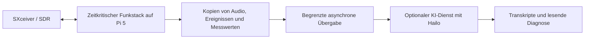

# Brainstorming: Pi-5-Basisstation mit AI HAT+ 2, SXceiver und optionale lokale KI

Stand der Repository- und Quellenprüfung: **06.10.2026**. Historische Ergebnisse beziehen sich auf die jeweils genannten Daten und Commits.

Hardwareidee: Raspberry Pi 5 mit AI HAT+ 2 und darüber einem SDR für die NetCore-Tetra-Basisstation. Lokale Transkription und Diagnose erscheinen unter den unten genannten Bedingungen sinnvoll. Stückliste, Dreierstapel und KI-Integration sind noch nicht festgelegt oder praktisch abgenommen. Die Funkverarbeitung soll von optionaler KI-Auswertung unabhängig bleiben.

## 1. Projektstand und Quellenbasis

| Feld | Wert |
|---|---|
| Technische Planungsphase | Laut Abruf 22.09.2026, 23:58 Uhr bis 23.09.2026, 00:05 Uhr; Europe/Berlin, MESZ |
| Erstellungs- und Prüfdatum dieses Archivs | 2026-10-06; Europe/Berlin |
| Repository | [JanHG98/netcore-tetra](https://github.com/JanHG98/netcore-tetra) |
| Geprüfter Branch | `Archiving` |
| Geprüfter Repository-Basiscommit | [`1e15cece5993fcad3fbca5a14792b99a02093c63`](https://github.com/JanHG98/netcore-tetra/commit/1e15cece5993fcad3fbca5a14792b99a02093c63) |
| Betreff dieses Basiscommits | `docs(archive): preserve dual-baseboard KiCad design and evidence` |
| Archivdatei | `Docs/archive/2026-10-06_pi5-ai-hat-plus-2-sxceiver-optionale-ki-basisstation.md` |
| Archivindex | [README.md](README.md) |

Der Basiscommit ist die geprüfte Quelle. Die Codebefunde beziehen sich ausschließlich auf diesen Stand von `Archiving`; installierte Binärdateien, laufende Geräte und andere Branches einschließlich `main` wurden damit nicht geprüft.

Die technische Einschätzung stammt vom 22./23.09.2026. Sie ist als Hardware- und Architekturvorschlag erhalten; ein Aufbau- oder Messprotokoll liegt nicht vor.

Für diesen Entwurf sind keine Bilder, Audiodateien, Messprotokolle oder ZIPs erhalten. Die historischen Quellenmarker 0 bis 8 enthielten keine Ziel-URLs. Herstellerquellen wurden am 06.10.2026 zusätzlich geprüft und werden getrennt als neue Referenzen geführt.

## 2. Statusbegriffe und erreichte Ergebnisse

Die Begriffe werden hier evidenzbezogen verwendet:

| Status | Bedeutung |
|---|---|
| **Idee** | Diskutierte Möglichkeit oder Empfehlung ohne ausdrücklichen Umsetzungsbeschluss. |
| **beschlossen-geplant** | Ausdrücklich festgelegter nächster Schritt; noch keine Umsetzung oder Abnahme. |
| **implementiert** | Konkreter Quellcode oder ein Artefakt ist am angegebenen Repository-Stand vorhanden. |
| **getestet** | Ein abgegrenzter Test wurde mit nachvollziehbarem Ergebnis durchgeführt; Testart und Grenzen müssen genannt sein. |
| **im Betrieb bestätigt** | Tatsächlicher Einsatz auf dem Zielsystem mit beobachtetem Ergebnis ist belegt. |

| Gegenstand | Historischer Entwurfstand | Zum Prüfstand vom 06.10.2026 überprüfter Stand / Grenze |
|---|---|---|
| Pi 5 + AI HAT+ 2 + SDR übereinander | **Idee** des Betreibers. | Keine Stückliste, Pinfreigabe, Aufbauaufnahme oder Hardwareabnahme dieses Stapels belegt. |
| SDR konkret als SXceiver | Im frühen Entwurf angenommene Projektkomponente. | SXceiver-/SoapySX-Code ist **implementiert** vorhanden; die ursprüngliche Hardwareidee nennt lediglich „SDR“, keine Platinenrevision. |
| Pi 5 + SXceiver als reine TBS | Architekturvorschlag. | Vorhandene Funksoftware ist keine für diesen Entwicklungsstand bestätigte Installation oder Betriebsabnahme. |
| Separater optionaler KI-Dienst | **Idee**, Architekturvorschlag. | Keine identifizierte Hailo-/Whisper-Anbindung im geprüften NetCore-Stand. |
| Lokale Funktranskription | **Idee**, als erster sinnvoller KI-Anwendungsfall empfohlen. | Audio-/Recorder-Bausteine sind **implementiert**; deren Verknüpfung mit Spracherkennung ist nicht nachgewiesen. |
| Lesender Diagnoseassistent | **Idee**. | Kein hierfür identifizierter NetCore-KI-Dienst, keine fachliche Abnahme. |
| Gleichzeitiger Funk-/KI-Lasttest | Empfohlener Prüfplan, kein ausdrücklich bestätigter Umsetzungsbeschluss. | **getestet** und **im Betrieb bestätigt** sind für den Dreierstapel nicht belegt. |

Für das Hardwareprojekt liegt noch kein Umsetzungsbeschluss vor. Die empfohlene Auslegung bleibt eine zu prüfende Option; eine spätere Hardwareabnahme ist nicht dokumentiert.

## 3. Ziel, Ausgangslage und nicht festgelegte Anforderungen

Die Ausgangsfrage lautete sinngemäß: Pi 5, AI HAT+ 2 und darüber SDR für die eigene Basisstation – ist diese Kombination sinnvoll? Sie war eine offene Einschätzung, kein Bau- oder Installationsauftrag.

Der Entwurf ordnete den Zusatznutzen in zwei Bereiche ein: Gespräche vor Ort auswerten und Betriebsdaten lokal erklären. Eine Verbesserung der zeitkritischen TETRA-Verarbeitung allein durch Aufstecken des HAT wurde nicht zugesagt. Auch zusätzliche TETRA-Träger, weniger TX-Late-Skips und bessere Funkstabilität wurden ausdrücklich nicht aus der TOPS-Zahl abgeleitet.

Nicht festgelegt wurden insbesondere Pi-RAM-Ausbau, genaue SDR-/HAT-Revision, Gehäuse, Abstände oberhalb des AI HAT, Gesamtstrombedarf, Frequenz- und Carrierplan, Modellversion, Durchsatz, Transkriptlatenz, Erkennungsquote, KI-Dienstname, Port, Datenformat, Ressourcenlimits und Installationsdatum. Der frühe Entwurf bezog sich auf einen bisher Bookworm-orientierten Aufbau und einen zentral gedachten Diensteaufbau; diese Annahmen sind nicht durch einen Gerätebestand oder eine aktuelle Konfigurationsdatei nachgewiesen.

## 4. Historische technische Einschätzung

### 4.1 Rolle des AI HAT+ 2

Die technische Einschätzung beschreibt den AI HAT+ 2 mit Hailo-10H, 40 TOPS bei INT4 und 8 GB eigenem Arbeitsspeicher. Der Speicher wurde als Speicher der KI-Baugruppe eingeordnet, nicht als allgemeine RAM-Erweiterung für Pi oder NetCore. Diese Bauteilangaben sind in Abschnitt 8 zusätzlich mit geprüften Herstellerquellen abgeglichen.

| Aufgabe | Historische Einordnung |
|---|---|
| TETRA-Modulation, Demodulation, Kanalcodierung, zeitkritische Verarbeitung | Kein automatischer Beschleunigungseffekt durch den HAT. |
| Call Control, SIP, MQTT, Weboberfläche | Herkömmliche Softwareaufgaben; keine automatische Verlagerung auf die NPU. |
| Unterstützte Spracherkennungs- und Sprachmodelle | Mögliche Beschleunigung über passende Hailo-Software und kompatible Modelle. |
| Beliebiger Rust-, C++- oder DSP-Code | Kein universell auf den HAT verschiebbarer Zusatzprozessor. |

### 4.2 Datenwege und elektrische Verträglichkeit

Die vorgeschlagene Kombination nutzte unterschiedliche hauptsächliche Datenwege: AI HAT+ 2 über das PCIe-Flachbandkabel des Pi 5, SXceiver über I²S und SPI am 40-Pin-Anschluss. Als Herstellerangabe lag vor: den Pi 5 als vom SXceiver-Hersteller getestete Plattform. Der geprüfte Quellenabgleich bestätigt diese grundsätzlichen Angaben, nicht den gemeinsamen Dreierstapel.

Vor dem Zusammenstecken sollten dennoch die tatsächliche GPIO-Belegung, weitere Steuerleitungen, HAT-Erkennung, ID-EEPROMs und beim Booten geladene Device-Tree-Overlays abgeglichen werden. Technische Grundlage ist die in der HAT+-Spezifikation vorgesehene Kombination aus normalem HAT und „Stackable HAT+“ mit unterschiedlichen EEPROM-Adressen. Eine Einstufung der konkreten AI-HAT+‑2-/SXceiver-Kombination in dieses Modell wurde nicht nachgewiesen. Numerische EEPROM-Adressen oder eine freigegebene Pinmatrix wurden nicht genannt.

Die archivierte Folgerung lautet daher: unterschiedliche Datenbusse sind ein guter Ausgangspunkt, reichen aber als Nachweis für eine vollständige elektrische Stapelkompatibilität nicht aus. Zwei HATs wurden weder pauschal ausgeschlossen noch pauschal freigegeben.

### 4.3 Mechanik, Kühlung und Versorgung

Der mitgelieferte 16-mm-Stacking-Header wurde als Freiraum für den Active Cooler unter dem AI HAT beschrieben. Daraus wurde keine Freigabe für den Bauraum eines darüber montierten SDR abgeleitet. Der Entwurf empfahl zusätzlich den Kühlkörper auf dem AI HAT+ 2 sowie ausreichenden Abstand und freien seitlichen Luftstrom.

Für den Pi 5 wurde das von Raspberry Pi empfohlene 27-W-Netzteil genannt. Für den Gesamtaufbau blieb ausdrücklich eine separate Lastbilanz aller Baugruppen offen. Ein Netzteilmodell für die konkrete Station, ein gemessener Spitzenstrom, eine thermische Berechnung oder eine Versorgung unter kombinierter Dauerlast sind nicht dokumentiert. Die 27-W-Angabe ist deshalb keine Dimensionierungsfreigabe des gesamten Stapels.

### 4.4 HF-Verträglichkeit und Betriebssystem

Als HF-Abnahme sind vergleichbare Empfangsmessungen mit ausgeschalteter oder ruhender KI und anschließend unter voller KI-Last vorgeschlagen. Störlinien, Rauschboden und Empfangsfehler sollten verglichen werden. Es wurde nicht vorausgesetzt, dass zusätzliche digitale Elektronik unmittelbar unter dem SDR HF-seitig ohne Auswirkungen bleibt.

Für den damals dokumentierten Hailo-Installationsweg wurden Raspberry Pi OS Trixie in 64 Bit und das Paket `hailo-h10-all` genannt. Der Übergang vom angenommenen Bookworm-Aufbau sollte ein eigener Kompatibilitätstest mit SoapySX, ALSA und den Overlays sein. Ein direktes Upgrade der laufenden TBS war keine empfohlene Vorgehensweise. Es gab keinen ausgeführten Upgrade-, Installations- oder Rollbackablauf im dokumentierten Arbeitsstand.

## 5. Historische Anwendungsfälle und Architekturvorschlag

### 5.1 Lokale Funktranskription

Die zuerst empfohlene Anwendung war die nachgelagerte Verarbeitung bereits decodierter Gesprächsaufzeichnungen zu Text. Die Leitstellenoberfläche sollte den Text zusammen mit Zeit, Gruppe und Teilnehmerkennung anzeigen können. Als technische Grundlage wurde ein Hailo-Whisper-Beispiel für H10 genannt, das Audiodateien verarbeitet und Transkriptsegmente liefert.

Vor einer Integration sollten eigene Testaufnahmen beantworten, ob ein unterstütztes Modell Deutsch, Rufnamen und Zahlen hinreichend erkennt und wie viele Gespräche neben dem Funkbetrieb verarbeitet werden können. Weder eine belastbare Echtzeitzusage noch eine TETRA-spezifische Qualitäts- oder Kapazitätsmessung lag vor. Ein konkretes Modell und eine Speicher-/Suchoberfläche wurden nicht ausgewählt.

### 5.2 Lesender Diagnoseassistent

Ein weiterer Vorschlag war ein lokales Sprachmodell für ausgewählte Logs und Messwerte. Als Herstellerangabe lag vor: als Beispiele die Suche nach Änderungen vor den letzten drei Verbindungsabbrüchen sowie eine Zusammenfassung von Auffälligkeiten seit dem letzten Neustart.

Die empfohlene erste Auslegung war ausschließlich lesend: Beobachtungen mit zugehörigen Logstellen erklären. Frequenzen ändern, Dienste neu starten oder selbstständig Reparaturen ausführen gehörten nicht zu diesem Vorschlag. NetCore-Anbindung und fachliche Qualität müssten erst entwickelt und geprüft werden.

Für Temperaturgrenzen, Lüftersteuerung, Watchdog und einfache Alarmregeln wurde kein KI-HAT vorgesehen; diese Funktionen sollten nach nachvollziehbaren Regeln arbeiten. Das ist eine Aufgabenabgrenzung innerhalb der Empfehlung, kein Verzicht auf solche Überwachungsfunktionen.

### 5.3 Trennung vom zeitkritischen Funkpfad

Der historische Vorschlag lässt sich so darstellen; die Pfeile stehen für ein Konzept und nicht für implementierte KI-Schnittstellen:



Der KI-Dienst sollte eigene Ressourcenlimits erhalten und bei Überlast Arbeit verschieben oder Daten auslassen dürfen. Der Funkstack dürfte nicht auf die KI warten. Die konkrete Warteschlange, ihre Größe, ein Prozess-/Containerformat und eine API wurden nicht spezifiziert. Auch bei getrennten Diensten blieben Kernel, Hardware und Stromversorgung gemeinsam; die Trennung wäre keine vollständige Fehler- oder Ressourcenisolation.

Die bedingte Empfehlung war: Für eine reine TBS zunächst Pi 5 mit SXceiver; für eine bewusst offlinefähige TBS mit lokaler Transkription oder Diagnose einen KI-Prototyp erwägen. Vor dessen Übernahme müssten Empfangsqualität, RX-Overruns, TX-Late-Skips und Temperaturen unter kombinierter Funk-/KI-Last unauffällig bleiben. Die Reihenfolge ist eine Architektur-Empfehlung, keine bestätigte Projektplanung.

## 6. Zum Prüfstand vom 06.10.2026 geprüfter Repository-Stand

Alle folgenden Befunde wurden am 06.10.2026 am oben genannten Basiscommit zusätzlich ermittelt. Sie sind keine rückwirkenden Implementierungsergebnisse der technischen Einschätzung vom September.

### 6.1 Keine identifizierte KI-Integration

Die Suche über die getrackten Inhalte außerhalb `Docs/archive/` nach `hailo`, `whisper`, `hailort` und `AI HAT` ergab keine Treffer. Eine ergänzende Suche nach `transcri` und `speech.to.text` fand nur fachfremde Formulierungen zur Codeübernahme in einer WAP-Spezifikation. Auch in den geprüften Workspace-/Dienstdefinitionen wurde kein passender KI-Dienst identifiziert.

Das ist ein begrenzter Repository-Befund: Eine Hailo-/Whisper-Integration ist anhand dieser Prüfung nicht nachgewiesen. Er ist keine Aussage über private Arbeitsstände, anders benannte externe Programme, andere Branches oder bereits installierte Fremdsoftware. Ein KI-Port, ein KI-Konfigurationspfad und eine fertige Transkript-API lassen sich daraus nicht ableiten.

### 6.2 SXceiver, Overlays und Funkdiagnose

| Geprüfte Datei | Konkreter Befund und Bedeutung |
|---|---|
| [sxxcvr-main/README.md](../../sxxcvr-main/README.md) | Enthält Abhängigkeiten, CMake-Build, Installation und `SoapySDRUtil --probe=driver=sx`. Das ist ein vorhandener Treiberweg, keine bestätigte AI-HAT-Kombination. |
| [SoapySX.cpp](../../sxxcvr-main/SoapySX/SoapySX.cpp) | Verwendet SPI/ALSA und Linux-GPIO-UAPI-v2, unter anderem `GPIO_V2_GET_LINE_IOCTL`. Im betrachteten Konstruktor stehen `/dev/spidev0.0` und `/dev/gpiochip0`. Gerätezuordnung und Rechte auf der realen Pi-/Kernel-Kombination bleiben zu prüfen. |
| [SoapySX/CMakeLists.txt](../../sxxcvr-main/SoapySX/CMakeLists.txt) | Modul `SXSupport`, ALSA-Bibliothek `asound`, SoapySDR-Erkennung; optional installierte PipeWire-/WirePlumber-Konfiguration gegen Nutzung des SX1255 als normale Soundkarte. Kein Hailo-Buildpfad. |
| [dts/sx1255_raspberrypi.dts](../../sxxcvr-main/dts/sx1255_raspberrypi.dts) | Overlay aktiviert I²S über `i2s_clk_consumer`, eine `simple-audio-card` namens `SX1255` und SPI0. Das ist kein Nachweis konfliktfreier gemeinsamer Overlays. |
| [dts/README.md](../../sxxcvr-main/dts/README.md) | Beschreibt versionsabhängige EEPROM-Erzeugung für HAT 1.0/1.1/1.2 und nachgelagerte HAT-/ALSA-Erkennung. Ein EEPROM-Schreibvorgang wurde in diesem Auftrag nicht durchgeführt. |
| [phy/components/soapy_dev.rs](../../crates/tetra-entities/src/phy/components/soapy_dev.rs) | Enthält Late-Skip-Zähler und die Meldung `TX continuity` mit `late_skip_events`, `late_skipped_blocks`, `hw_underflows`, `hw_time_errors` sowie `hw_status_supported`. Diese Felder können eine spätere Lastabnahme unterstützen. |
| [phy/components/soapyio.rs](../../crates/tetra-entities/src/phy/components/soapyio.rs) | Unterscheidet Software-Late-Skips von Treiberstatus wie Underflow und TimeError; die Statusabfrage kann als nicht unterstützt gemeldet werden. Fehlende Treiberunterstützung ist kein Beleg für Fehlerfreiheit. |

Die vorhandene SoapySX-Quelle nutzt direkt die Linux-GPIO-Schnittstelle; ihre CMake-Datei linkt keine `libgpiod`. Historische libgpiod-Reparaturen aus anderen Arbeitsphasen sollten deshalb nicht ungeprüft als Voraussetzung dieses aktuellen Treiberstands übernommen werden. Ein Build des hier eingebetteten Treibers wurde nicht ausgeführt.

### 6.3 Zwei unterschiedliche Aufzeichnungspfade

| Pfad | Im Code nachgewiesen | Konsequenz für die KI-Idee |
|---|---|---|
| Zentraler Recorder-LXC | [README](../../system-backend/recorder/README.md), [state.rs](../../system-backend/recorder/src/state.rs), [http.rs](../../system-backend/recorder/src/http.rs): passiver Recorder-Tap, Schreiben unveränderter Payloads nach `audio.tacelp`, Index und Metadaten; dokumentiert sind 35-Byte-TETRA-ACELP-Frames. | Codierte Frames sind noch keine decodierte Audiodatei für das Whisper-Beispiel. Ein passender Decoder-/Exportpfad muss gewählt und geprüft werden. |
| Lokaler TBS-Recorder | [entity.rs](../../crates/tetra-entities/src/net_recorder/entity.rs): eigener Worker `tetra-recorder`, begrenzter Kanal mit Kapazität 2048 und `try_send`; `TetraSpeechDecoder` plus `PcmWavWriter`. [codec.rs](../../crates/tetra-entities/src/net_audio/codec.rs) setzt `TETRA_PCM_SAMPLE_RATE = 8_000`; [wav.rs](../../crates/tetra-entities/src/net_recorder/wav.rs) schreibt Mono-PCM mit 16 Bit. | Eine vorhandene PCM/WAV-Ausgabe ist ein möglicher Startpunkt für einen separaten Dateiprototyp. Aktivierung, fertige Aufnahmen, Metadatenzuordnung und Modell-Eingabeformat müssen am Ziel geprüft werden. |

Die begrenzte lokale Recorder-Übergabe enthält bereits Verhalten für Überlast: Bei voller Queue wird eine Epochennummer erhöht, damit alte Ereignisse nicht fälschlich einem Ruf zugeordnet werden. Das ist ein vorhandenes Muster für vom Funkpfad entkoppelte Verarbeitung, aber keine implementierte KI-Queue und keine Abnahme der kombinierten Last.

**Wichtige Abgrenzung:** Der frühe Entwurf setzte auf bereits decodierten Aufzeichnungen. Der geprüfte zentrale Recorder speichert hingegen codierte Frames. Das ist eine konkret zu lösende Integrationsfrage und kein Widerspruch, der durch bloßes Umbenennen von `.tacelp` in `.wav` verschwindet. Der lokale WAV-Pfad und der zentrale Recorder dürfen bei einer Fortsetzung nicht gleichgesetzt werden. Auch eine eventuell erforderliche Sample-Rate-Anpassung ist anhand des tatsächlich gewählten Modells zu prüfen; sie ersetzt keine fehlende Sprachbandbreite.

### 6.4 Relevante Dienste, Parameter und Pfade

Die Werte stammen aus dem aktuellen Recorder-Beispiel und der gelesenen Implementierung; sie sind keine ausgelesene Live-Konfiguration:

| Gegenstand | Repository-Wert / Quelle |
|---|---|
| Recorder-Dienstdefinition | [netcore-recorder.service](../../system-backend/recorder/systemd/netcore-recorder.service) ist vorhanden. |
| Recorder-Konfigurationsvorlage | [recorder.example.toml](../../system-backend/recorder/config/recorder.example.toml); dokumentierter Installationspfad `/etc/netcore/recorder.toml`. |
| Recorder-HTTP/WebUI | Beispielbindung `0.0.0.0:8140`; `/health/live`, `/health/ready`, `/api/v1/status`. |
| Media-Switch-Eingang | HTTP-Tap `/api/v1/recorder/taps`, ergänzend `/api/v1/sessions`; Beispielport des Media Switch `8130`. |
| Polling / Batch | `poll_interval_ms = 100`, `session_reconcile_ms = 1000`, `request_timeout_secs = 3`, `batch_limit = 500`. |
| Speicher | `/var/lib/netcore-recorder/recordings/YYYY/MM/DD/<recording-id>/` mit `audio.tacelp`, `frames.jsonl`, `metadata.json`, `integrity.json`; während der Aufnahme unter anderem `.part`-Dateien. |
| Framezeit | `frame_duration_ms = 60` in der Recorder-Vorlage. |
| Sicherheitsmodus | `open_lab`; der Recorder dokumentiert fehlende Authentisierung/TLS/RBAC. Eine spätere KI-Anbindung benötigt einen passenden Zugriffsvertrag; diese Vorlage ist kein Produktionsfreigabenachweis. |
| NetCore-Update-Einstieg | [install/update-basisstation.sh](../../install/update-basisstation.sh) ist vorhanden; in diesem Auftrag nicht ausgeführt. |
| Künftiger KI-Dienst | Kein festgelegter Dienstname, Port, Installationspfad oder API-Vertrag aus dieser Arbeitsphase. |

Die Dokumentation [NetCore-Tetra-Komplettguide-2026-09-28.md](../NetCore-Tetra-Komplettguide-2026-09-28.md) beschreibt weiterhin ein Image-Rezept auf Raspberry Pi OS Lite Bookworm ARM64. Andere Repository-Stellen enthalten bereits Trixie-Bezüge, etwa beim Asterisk-Installer. Daraus folgt keine einheitliche Trixie-Freigabe des gesamten TBS-/Hailo-/SXceiver-Stacks. Das tatsächlich installierte OS, der Kernel, die Firmware und der Treiberstand der Station sind unbekannt.

## 7. Befehle und Ausführungsstatus

### 7.1 Historischer Entwurf

Es wurden keine Shellbefehle, Installationen, Builds, Deployments, Reparaturen oder Hardwaretests erfolgreich ausgeführt und protokolliert. `hailo-h10-all` war als benötigtes Paket erwähnt, nicht als ausgeführter Installationsschritt. Es gab weder Konsolenausgaben noch eine bereitgestellte Testaufnahme.

### 7.2 Zum Prüfstand vom 06.10.2026 tatsächlich ausgeführte Dokumentationsprüfung

Die Dokumentationsprüfung vom 06.10.2026 umfasste die Remote-Referenz `refs/heads/Archiving`, einen separaten Checkout, `git fetch origin Archiving`, den Vergleich von lokalem HEAD und `origin/Archiving` sowie Archivindex, Dateibaum und relevanten Quellcode. Die Prüfbasis enthielt 62 datierte Indexeinträge; eine entsprechende Hardwareausarbeitung lag dort noch nicht vor.

Die Codeprüfung erfolgte lesend mit `git show`, `git ls-tree` und `git grep`, bezogen auf den genannten Basiscommit. Zusätzlich wurden die in Abschnitt 8 verlinkten Herstellerseiten abgerufen. Es wurden keine Quellcodeänderungen, Pi-/SSH-Kommandos, Cargo-/CMake-Builds, KI-Inferenzen oder Funkmessungen durchgeführt. Die Veröffentlichung dieser Notizen ist kein Hardware- oder Softwaretest.

### 7.3 Zum Prüfstand vom 06.10.2026 belegte Einstiegspunkte für einen späteren Prototyp — nicht ausgeführt

Die folgenden Befehle sind Referenzen für eine separate Testinstallation nach Klärung von Hardware und OS. Sie waren nicht Teil einer ausgeführten historischen Installationsfolge und sind kein bestätigtes Upgrade-Rezept für die laufende Station.

Der am 06.10.2026 geprüfte Raspberry-Pi-Weg für einen vorbereiteten Trixie-64-Bit-Testaufbau nennt diese Paketinstallation und Erkennung. `hailo-all` und `hailo-h10-all` sind laut Hersteller nicht parallel installierbar. Quelle: [AI software](https://www.raspberrypi.com/documentation/computers/ai.html).

```bash
sudo apt install dkms
sudo apt install hailo-h10-all
sudo reboot
# Nach dem Neustart:
hailortcli fw-control identify
```

Nach vollständiger Einrichtung von HailoRT, Python-Umgebung und kompatiblem Modell beschreibt Hailo diesen Dateiaufruf. Der Pfad ist ein Platzhalter für eine echte, bereits decodierte Testaufnahme. Quelle: [Simple Whisper Chat](https://github.com/hailo-ai/hailo-apps/blob/main/hailo_apps/python/gen_ai_apps/simple_whisper_chat/README.md).

```bash
python -m hailo_apps.python.gen_ai_apps.simple_whisper_chat.simple_whisper_chat --audio /pfad/zur/testaufnahme.wav
```

Für einen gesonderten Treiber-/Overlaytest nennt die vorhandene Repository-Dokumentation diese Prüfungen. Gerätezugriffe sind mit einem laufenden Funkdienst abzustimmen. Ein erfolgreicher Einzeltest würde die gemeinsame Funk-/KI-Abnahme noch nicht ersetzen.

```bash
SoapySDRUtil --probe=driver=sx
ls -l /proc/device-tree/hat
aplay -L
arecord -L
```

Kein EEPROM wurde geschrieben. Die versionsabhängigen EEPROM-Schreibbefehle aus der Treiberdokumentation sind erst nach Identifikation der realen Platine und des benötigten Overlays zu beurteilen.

## 8. Zusätzlicher Herstellerabgleich am 06.10.2026

Diese Quellen wurden zum Prüfstand vom 06.10.2026 unabhängig gelesen. Sie ergänzen den historischen Inhalt, ersetzen aber weder die nicht aufgelösten Quellenmarker noch einen Hardwaretest.

| Quelle | Zum Prüfstand vom 06.10.2026 belegter Umfang |
|---|---|
| [Raspberry Pi AI HAT+ 2: Produktseite](https://www.raspberrypi.com/products/ai-hat-plus-2/) | Hailo-10H, 40 TOPS INT4, eigene 8 GB RAM, 16-mm-Stacking-Header und Kühlkörper; vorgesehen ist die Montage mit Active Cooler. Daraus ergibt sich keine zusätzliche SDR-Stapelfreigabe. |
| [Raspberry Pi: AI HATs](https://www.raspberrypi.com/documentation/accessories/ai-hat-plus.html) | PCIe-Flachbandverbindung und mechanischer Montageweg der AI-HAT-Baugruppe. |
| [Raspberry Pi: AI software](https://www.raspberrypi.com/documentation/computers/ai.html) | Trixie in 64 Bit, H10-Paketweg, Neustart und Geräteerkennung; Software-/Modellunterstützung ist erforderlich. |
| [SXceiver specifications](https://sxceiver.com/doc/specs) | I²S/SPI und Pi 5 in der Liste getesteter Modelle. Für vor dem 15.08.2024 bestellte SXceiver wird auf eine für Pi 5 erforderliche Overlay-Aktualisierung hingewiesen. Das betrifft einen Herstellerhinweis, keinen festgestellten Defekt der hier nicht identifizierten Platine. |
| [Hailo Simple Whisper Chat](https://github.com/hailo-ai/hailo-apps/blob/main/hailo_apps/python/gen_ai_apps/simple_whisper_chat/README.md) | Dateibasierte Transkription mit Segmentausgabe, H10-Voraussetzung, HailoRT und Python-Bindings. Die Anleitung nennt 16-Bit-PCM-WAV und automatischen Modelldownload beim ersten Start; vor einem Offlinebetrieb müssen benötigte Modelle deshalb vorhanden und geprüft sein. |

Eine gemeinsame Freigabe exakt des Pi-5-/AI-HAT+‑2-/SXceiver-Dreierstapels wurde in diesen geprüften Unterlagen nicht gefunden. Die historische Aussage zur HAT+-Stacking-Spezifikation und die konkrete EEPROM-/Pinbelegung beider Boards wurden in diesem Auftrag nicht anhand vollständiger Schaltpläne beziehungsweise der HAT+-Norm neu verifiziert. Auch die 27-W-Versorgung wurde nicht am Gesamtaufbau bemessen. Diese Punkte bleiben ausdrücklich offen.

## 9. Fehler, Grenzen und verworfene Schlussfolgerungen

Im frühen Entwurf wurde kein tatsächlich aufgetretener Build-, Boot-, GPIO-, Audio- oder Funkfehler samt Diagnose protokolliert. Die genannten Risiken sind mögliche Konflikte und Abnahmekriterien, keine beobachteten Fehler und keine bereits funktionierenden Reparaturen.

| Nicht übernommene Annahme / Grenze | Begründung aus Entwurf oder geprüftem Abgleich |
|---|---|
| Mehr TOPS bedeuten automatisch mehr TETRA-Leistung. | Die NPU benötigt kompatible Modelle; ein RF-/DSP-Offload ist nicht implementiert oder getestet. |
| Die zusätzlichen 8 GB erweitern den allgemeinen Pi-RAM. | Die Angaben betreffen eigenen Speicher der KI-Baugruppe. |
| Getrennte Datenbusse beweisen vollständige Stapelbarkeit. | GPIO, Steuerleitungen, EEPROMs, Overlays und Mechanik sind zusätzlich zu prüfen. |
| Der 16-mm-Header garantiert Platz für ein weiteres SDR. | Der beschriebene Abstand betrifft den Active Cooler unter dem AI HAT. |
| Ein separat laufender KI-Prozess isoliert alle Fehler. | Kernel, Stromversorgung und Ressourcen werden weiterhin geteilt. |
| Ein KI-HAT ist für einfache Grenzwerte und Watchdog nötig. | Vorgesehen sind dafür nachvollziehbare Regeln. |
| Lokale KI soll selbstständig die Funkstation reparieren. | Der historische Diagnosevorschlag war lesend und quellengestützt. |
| Das Vorhandensein von Recorder-Code belegt eine Transkriptionsfunktion. | Die Spracherkennungsanbindung fehlt als Nachweis; zudem unterscheiden sich codierter Zentralrecorder und lokales WAV. |
| Trixie-Erwähnungen oder eine Herstellerkompatibilitätsliste beweisen den Gesamtbetrieb. | Ein konkreter NetCore-/Treiber-/OS-/HAT-Versionsverbund und ein gemeinsamer Lasttest fehlen. |

Diese Punkte sind Präzisierungen und abgegrenzte Empfehlungen, keine nachträglich erfundenen Projektentscheidungen. Es wurde keine bereits umgesetzte KI-Lösung im dokumentierten Arbeitsstand verworfen oder ersetzt.

## 10. Teststand und vorgeschlagene Abnahme

**Historisch:** Keine Messreihe, kein Firmware-/Treibererkennungsergebnis, keine Transkription und kein erfolgreicher Realbetrieb dokumentiert.

**Zum Prüfstand vom 06.10.2026:** Die Repository- und Herstellerprüfung ist eine Lese-/Quellenprüfung. Vorhandene Implementierungen wurden nicht gebaut oder auf ARM64 ausgeführt. Es gab keinen Zugriff auf Pi, SDR oder AI HAT und keine Live-Betriebsbestätigung. Vorhandene Testdateien im Repository zählen nicht als in diesem Auftrag ausgeführte Tests.

Der folgende Plan konkretisiert die historischen Prüfempfehlungen für eine Fortsetzung. Die Reihenfolge und Nachweisform sind aus dem Archivabgleich abgeleitet; Grenzwerte, Dauer, Gerätedaten und Prioritäten wurden im frühen Entwurf nicht verbindlich vereinbart.

| Schritt | Zu prüfen | Benötigter Nachweis |
|---|---|---|
| Hardwarebasis | Pi-Modell/RAM, beide HAT-Revisionen, Pin- und EEPROM-Nutzung, Montagehöhen, Kühlkörper und Versorgung. | Konkrete Stückliste, Schaltplan-/Pinabgleich, Fotos des tatsächlichen Aufbaus und Lastbilanz. |
| Funk-Baseline | Pi + SDR ohne zusätzliche KI-Last, mit dokumentiertem OS/Kernel/Overlay/SoapySX/NetCore-Stand. | Reproduzierbare RX-/TX-Messungen, Temperaturen, Funkfehler und `TX continuity`-Daten. |
| KI allein | Geräteerkennung, Modellbereitstellung und Dateiinferenz mit echten Aufnahmen. | Modell-/Runtime-Version, Eingabeformat, Transkript und Laufzeit; erneuter Start ohne Netzwerk. |
| Sprachqualität | Deutsch, Rufnamen, Zahlen und repräsentative Gesprächsqualität. | Vergleich mit manuell geprüftem Referenztext; vereinbarte Qualitätskriterien und dokumentierte Fehlertypen. |
| Funk/HF unter KI-Last | Identische RF-Einstellungen und Empfangssituation bei KI aus/ruhend/ausgelastet. | Vergleich von Störlinien, Rauschboden, Empfangsfehlern, RX-Overruns, TX-Late-Skips und Temperaturen. |
| Durchsatz und Überlast | Gleichzeitige Gespräche, CPU-/RAM-/I/O-Last, begrenzte Queue, aussetzende oder beendete KI. | Nachweis, dass Funkdienste nicht auf KI warten; sichtbare Verzögerungen/Auslassungen und funktionierende Rückkehr. |
| Metadaten/UI | Zeit, Gruppe, Teilnehmerkennung und Sprecherwechsel. | Korrekte Zuordnung zum Originalruf; keine Vermischung zwischen Sessions oder Segmenten. |
| Diagnosequalität | Nur ausgewählte Logs/Messwerte, nachvollziehbare Quellenbezüge. | Antworten mit überprüfbaren Logstellen; keine selbstständigen Konfigurationsänderungen. |
| Dauerbetrieb / Neustart | Versorgung, Thermik, Modell-/Recorder-Start und Abschaltbarkeit der KI. | Protokollierter kombinierter Dauertest und Wiederanlauf; erst danach eine konkrete Betriebsfreigabe. |

Die auf der TBS vorhandenen TX-Zähler sollten dabei getrennt interpretiert werden: Software-Late-Skips sind nicht dasselbe wie vom SDR-Treiber gemeldete Underflows oder Zeitfehler. Ob der verwendete Treiber den Status unterstützt, muss im Messprotokoll stehen. RX-Overruns und HF-Empfindlichkeit benötigen eigene Messwerte.

## 11. Offene Aufgaben und Roadmap-Kandidaten

1. **Ziel und Hardware konkretisieren — Idee, Voraussetzung für weitere Planung.** Reine TBS oder bewusst lokale Offline-Auswertung wählen; den in der Hardwareidee nicht benannten SDR-Typ und die Revisionen bestätigen. Strom-/Kühlungs-/Pinmatrix und reale EEPROM-/Overlaybelegung prüfen.
2. **Getrennte Testbasis herstellen — abgeleitete nächste Empfehlung.** Installierten und funktionierenden Funkstand dokumentieren und sichern; eine separate Trixie-Testinstallation für den H10-Weg aufsetzen. Den vorhandenen Bookworm-/Funkbetrieb erst nach erfolgreichem Vergleich verändern.
3. **Audioquelle und Vertrag festlegen — Idee, technische Abhängigkeit.** Lokales fertiges WAV oder zentralen Recorder mit Decodierung wählen; Session-ID, Zeit, GSSI/ISSI, Sprecher, Dateilebenszyklus und benötigtes Modellformat festlegen. Kein KI-Eingriff in den TDMA-/RF-Pfad.
4. **Dateibasierte Transkription zuerst erproben — historische Empfehlung.** Kompatibles deutschsprachiges Modell, HailoRT-Version und Testkorpus festhalten; Rufnamen/Zahlen, Qualität, Laufzeit und Offline-Neustart messen. Erst daraus Durchsatz- oder Echtzeitanforderungen ableiten.
5. **Optionalen KI-Dienst entwerfen und implementieren — weiterhin Idee.** Ressourcenlimits, nicht blockierende Übergabe, Abbruch-/Überlastverhalten, Ergebnisablage und UI-Anzeige definieren. Im geprüften Stand gibt es dafür keinen identifizierten Dienstvertrag.
6. **Gleichzeitige Funk-/KI-Abnahme durchführen — historische Empfehlung.** Den Prüfplan aus Abschnitt 10 mit realen Grenzwerten und einer unveränderten Baseline durchführen. Ergebnisse und genaue Versionen sichern, bevor „getestet“ oder „im Betrieb bestätigt“ vergeben werden.
7. **Lesende Diagnose nachgelagert prototypisieren — Idee.** Relevante Logs und Messwerte auswählen, Fragen zu Abbrüchen und Neustarts beantworten lassen und fachlich gegenprüfen; Quellenbezug und lesende Befugnisse erhalten.
8. **Einfache Überwachung konventionell halten — historische Empfehlung.** Temperaturregeln, Lüfter und Watchdog ohne KI-Abhängigkeit vorsehen. Die konkrete Implementierung solcher Funktionen war nicht Gegenstand dieser Arbeitsphase.

Keine dieser Hardware-/KI-Aufgaben wird durch die Archivierung selbst als beschlossen, umgesetzt oder getestet markiert. Roadmap-Kandidaten werden ausschließlich in dieser Datei festgehalten; andere Repository-Dokumente oder Quelltexte werden dadurch nicht verändert.

## 12. Verwandte Repository-Referenzen und offene Belege

Für die Fortsetzung sind folgende bereits vorhandene Archive als separate Quellen hilfreich; ihre Ergebnisse werden diesem Entwurf nicht zugerechnet:

- [SXceiver/SoapySX: Trixie- und libgpiod-Buildreparatur](2026-10-04_sxceiver-soapysx-trixie-libgpiod-build-reparatur.md).
- [Basisstation: GPIO-Breakout, Jumpersteuerung und SXceiver](2026-10-05_basisstation-gpio-breakout-jumper-steuerung-sxceiver.md).
- [SXceiver-GPIO, Sensorik und modularer Hardwareausbau](2026-10-05_sxceiver-gpio-sensorik-tft-und-modularer-hardwareausbau.md).
- [Recorder-LXC, Fallback und Echtzeit-Medienpfad](2026-10-04_recorder-lxc-edge-fallback-echtzeit-und-buildfehler.md).
- [Basisstation Clean Install und SXceiver/SoapySX](2026-10-05_basisstation-clean-install-sxceiver-soapysx-sndcp-healthchecks.md).

Offene Belege sind klar begrenzt:

- Weitere technische Festlegungen sind nicht erhalten.
- Die historischen Quellenmarker 0 bis 8 haben im Abruf keine auflösbaren Ziel-URLs. Die zum Prüfstand vom 06.10.2026 verlinkten Herstellerquellen sind separat datiert und dürfen nicht als originalgetreue Wiederherstellung der damaligen Zitate gelten.
- Bilder, Audio-Beispiele, Pinpläne und Prüfprotokolle für den vorgesehenen Aufbau fehlen.
- SXceiver, Bookworm-Ausgangslage und zentrale Dienste sind Annahmen des frühen Entwurfs. Eigentum, Geräteversion, installierter Stand und reale Topologie wurden nicht inventarisiert.
- Vollständige Schaltpläne und eine gemeinsame HAT-/EEPROM-Freigabe wurden nicht geprüft. Die Quellenprüfung vom 06.10.2026 bestätigt Einzelmerkmale, keine Gesamtkompatibilität.
- Keine Aussagen über aktuelle Hardware, andere Branches, private Änderungen, CI-Ergebnisse, PRs oder einen erfolgreichen Live-Betrieb werden aus dem Repository-Lesezugriff abgeleitet. Für diese Hardwareidee ist kein zugehöriger Implementierungscommit oder PR belegt.

Die technische Fortsetzung beginnt damit bei einem überprüfbaren Prototyp und einer klaren Audio-/Dienstschnittstelle. Das Archiv bewahrt die Idee und ihre Grenzen; es dokumentiert keinen fertig aufgebauten KI-Funkstandort.
