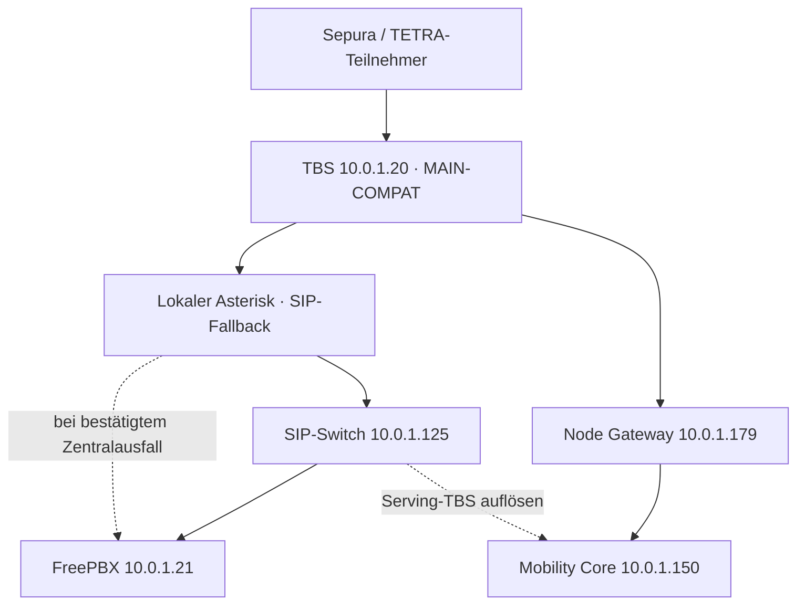
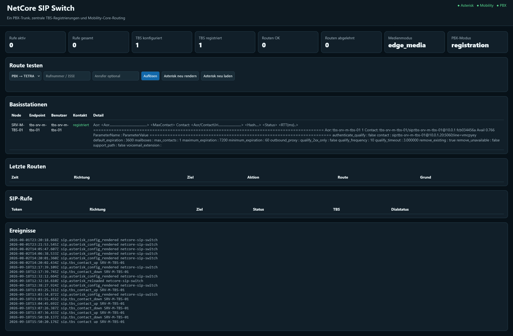
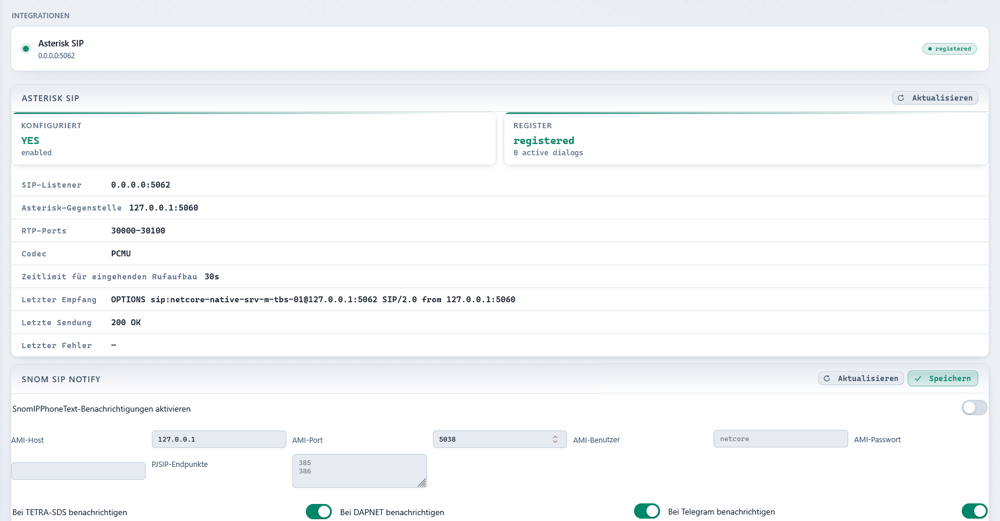
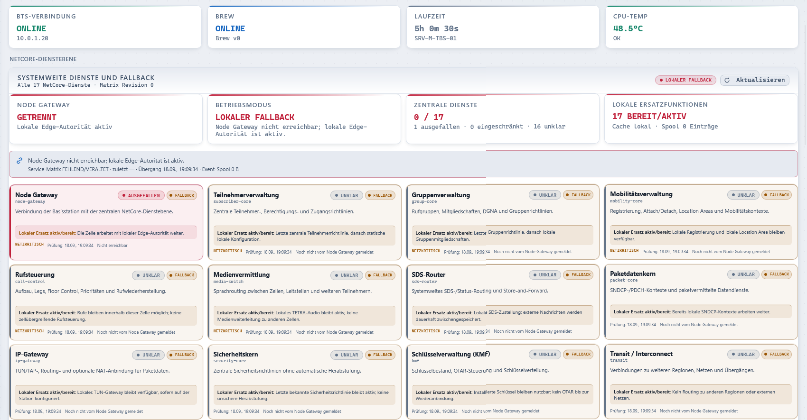
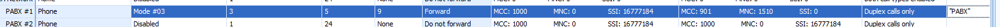
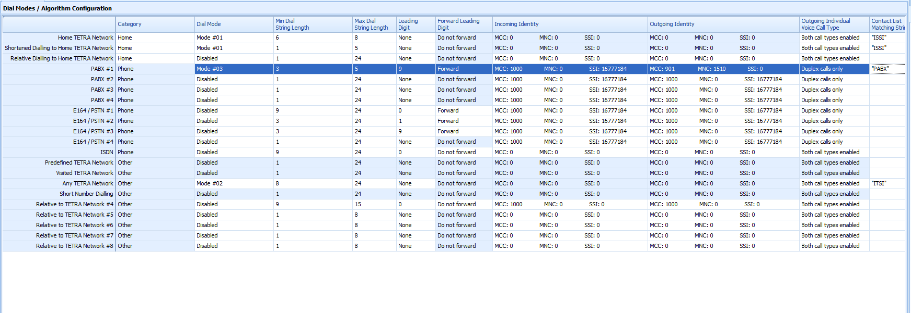

# NetCore-Tetra: REREG unter Last, zentraler SIP-Switch, TBS-Fallback, FreePBX/CLI und Releaseabschluss

## 1. Metadaten, Geltungsbereich und Belegstufen

| Feld | Stand |
|---|---|
| Dokument erstellt | 2026-10-06 |
| Thema | Stabilisierung des MAIN-COMPAT-Funkbetriebs; Ausbau zentraler Netzfunktionen; SIP-Switch und lokaler Fallback; FreePBX-Routing und Sepura-Anruferanzeige; Release aus `mqtt` |
| Ursprünglicher Chattitel | Nicht zuverlässig verfügbar. Der Titel dieses Dokuments ist eine technische Themenbeschreibung, keine Rekonstruktion des UI-Chattitels. |
| Ursprünglicher Chatlink | Nicht verfügbar; kein Link erfunden. |
| Historischer Zeitraum | Insbesondere die im Verlauf dokumentierten Arbeiten und Tests vom September 2026; zahlreiche Logs ausdrücklich vom 18.09.2026. Nicht jeder Turn und nicht jeder reine Uhrzeit-Log ist unabhängig datierbar. |
| Repository | [JanHG98/netcore-tetra](https://github.com/JanHG98/netcore-tetra) |
| Historischer Arbeitsbranch | `mqtt`; am historischen Schlussstand Commit `c128a83cd3eef463de1e7e0c909af1fff4b84b36` |
| Heutiger geprüfter Code | `main` bei `9116c15d645458f99e236712b67a1ad970432791`, Git-Baum `15efb6aecdbe270cd6e3e92e7b434813a3a9b5e6` |
| Archivziel | Ausschließlich vorhandener Branch `Archiving`, ausschließlich `Docs/archive/` |
| Bei Beginn gelesener Archivstand | `e9c143c745f8b66593398f78971e8f267785d3af`, Baum `5be72872e3daa725acd1aa2afd77f2c55a595c04`; vorhandener Index wird erhalten. |
| Auftrag dieses Archivlaufs | Dokumentation und Bilder sichern, Index ergänzen, committen und ohne Force-Push speichern; keine Produktcode-, Konfigurations- oder Live-Dienständerung. |

Dieses Archiv unterscheidet durchgehend folgende Belegstufen:

| Bezeichnung | Bedeutung |
|---|---|
| **Idee** | Diskutierte Möglichkeit ohne abschließenden Umsetzungsbeschluss. |
| **Beschlossen/geplant** | Gewünschte Arbeit oder festgelegte Richtung; allein noch kein Codebeweis. |
| **Implementiert** | Nachweis am Repository bzw. verifizierten gemergten PR. Ein Installer im Repository beweist keine Installation auf einem Host. |
| **Getestet** | Konkreter Testlauf oder protokolliertes Ergebnis; Umfang und Grenzen werden genannt. |
| **Im Betrieb bestätigt** | Nutzerbestätigung bzw. Betriebslog des realen Aufbaus. Das ist keine allgemeine Dauerlast- oder Produktionsfreigabe. |

### 1.1 Quellenlage und Grenzen

Ausgewertet wurden der zugängliche Gesprächsverlauf, die sichtbaren Logauszüge, die wiederhergestellten Originalbilder, relevante PDF-Fundstellen sowie GitHub-Dateien, PR-Metadaten, Tags, Releases und historische CI-Ergebnisse. Frühere Assistenzantworten und einige damalige Werkzeugnachweise liegen nur als erhaltene Kontextzusammenfassung vor. Der erste große Log ist ausdrücklich gekürzt; insbesondere fehlt darin ein Teil der Vorgeschichte um Ruf 5. Das Archiv ist deshalb **keine Behauptung einer lückenlosen Rohtranskription**.

Sechs eindeutig sichtbare Chatbilder konnten als Original-PNG wiederhergestellt werden. Ein zusätzlich wiedergefundenes Bild ist byteidentisch mit einem dieser Bilder und wird im Anlagenmanifest als Dublette erfasst. Das nur über einen fehlgeschlagenen Ladepfad referenzierte `01-image.png` konnte nicht eindeutig wiederhergestellt werden. Es wird weder durch ein fremdes Bild ersetzt noch inhaltlich erfunden.

Die 25 zugänglichen ETSI-PDFs wurden inventarisiert; für diesen Chat wurden gezielt die CLI-relevanten Normabschnitte geprüft, nicht sämtliche Seiten aller Normen. Zwei wiederhergestellte Sepura-/SELECTRIC-PDFs wurden ebenfalls gezielt abgeglichen. Vollständige Codeplugs, Paketmitschnitte des abschließend erfolgreichen CLI-Tests und eine spätere Live-Konfigurationssicherung fehlen.

Passwörter, Authentifizierungs-Digests, Tokens und Schlüssel aus den ursprünglichen Befehlen/Logs werden nicht übernommen. Angegebene IPs, Node-IDs, ISSIs und Pfade beschreiben den historischen Testaufbau. Sie sind keine allgemeingültigen Installationsvorgaben.

## 2. Ergebnis des Chats und endgültige Festlegungen

**Am Ende des Chats funktionierte Telefonie zwischen Funkgerät und Telefon in beiden Richtungen.** Der Nutzer bestätigte die Funkgeräte-ISSI am Telefon und zuletzt ausdrücklich auch die eingehende CLI-Anzeige am **Sepura SC20 mit Software V10.24**, nachdem die richtige **FreePBX-Einstellung „Outbound CID“ unter „General“** gefunden und gesetzt worden war. Frühere Aussagen „CLI weiterhin offen“ sind damit überholt.

Der erfolgreiche Aufbau benötigte außerdem eine erreichbare Verbindung der TBS zum richtigen Node Gateway und dieselbe Node-ID in TBS, Mobility und SIP-Switch. Die endgültige Kennung lautet **`SRV-M-TBS-01`**. Die vorherige Schreibweise **`SRV-M_TBS-01`** mit Unterstrich war ein Konfigurationsfehler und wurde vom Nutzer korrigiert.

| Anforderung/Entscheidung | Begründung | Abschlussstatus dieses Chats |
|---|---|---|
| REREG, festhängendes PTT und nicht lokal beendbare Gruppenrufe untersuchen | Fehler trat insbesondere bei zusätzlichem Verkehr auf. | Mehrere konkrete Fixes implementiert; keine vollständige Lastabnahme und keine einzelne abschließend bewiesene REREG-Ursache. |
| Recorder-I/O aus dem Echtzeitpfad entfernen | Sendeblock-Aussetzer korrelierten mit Aufzeichnungsabschluss; synchrone Dateiarbeit im Funkpfad war im Code vorhanden. | Implementiert; Softwaretests vorhanden; konkrete Verbesserung unter definierter Dauerlast noch zu messen. |
| Ursprünglichen Rufbesitzer vom momentanen Sprecher unterscheiden | ISSI 2020001 startete Ruf 5, nach Sprecherwechsel zu 5102 wurde sein Auflegen als `non-call-owner` abgewiesen. | Implementiert; gezielter Hardware-Nachtest nach Sprecherwechsel nicht vollständig belegt. |
| Q.850-/SIP-Beendigungsursachen übersetzen | `cause=16` war als `UnknownTetraIdentity` ausgegeben worden. | Implementiert und mit Softwaretests versehen; spätere Logs zeigen normale TETRA-Freigabe, aber nicht jeden Mappingfall. |
| Zentrale Netzfunktionen und zentralen SIP-Switch bauen | Nutzer wollte nach den Funkfixes ausdrücklich wieder zentrale Netzfunktionen ausbauen. | Implementiert und im Testaufbau teilweise in Betrieb bestätigt. |
| Lokalen SIP-Fallback erhalten | Bei bestätigtem Zentralausfall soll die TBS direkt zur PBX registrieren. | Implementiert; Zentralbetrieb belegt, vollständiger Ausfall-/Rückkehrtest nicht belegt. |
| LXC-/Hoständerungen mit Installations- und Updateschritten erklären | Nutzer benötigt ausführbare, dem richtigen Host zugeordnete Abläufe. | Feste Anforderung; Hostrollentrennung besonders wichtig nach Fehlinstallation. |
| Sprecherwechsel als bestehende Funktion behandeln | Nutzer hielt ihn aufgrund des vorherigen Betriebs für gegeben; Asterisk diente zunächst nur zur Verkehrserzeugung. | Kein Nachweis, dass alle Last-/Besitzer-/Hangtime-Sonderfälle damit bereits abgenommen waren. |
| Anruferidentität erhalten | Telefon zeigte zunächst den TBS-Trunknamen statt der anrufenden ISSI. | Im Betrieb bestätigt behoben. |
| Sepura-CLI anzeigen | Telefon→Funk klingelte, aber SC20 meldete „cannot display cli“. | Im Betrieb bestätigt nach FreePBX-Outbound-CID-Konfiguration. |
| Eigenständigen Release aus `mqtt` ermöglichen | Sicherer Stand, unabhängig von weiterer Arbeit auf `main`. | Releasevorschlag; heutige GitHub-Prüfung bestätigt nachträglich dessen Veröffentlichung. |

Die exakte am Schluss erfolgreich übertragene CID-Zeichenfolge sowie der endgültige CPS- und Full-TSI-Schalterstand wurden nach der Erfolgsmeldung nicht erneut protokolliert. Der vorgeschlagene Testwert `9103` ist deshalb **kein universelles Sepura-Erfordernis** und kein gesicherter abschließender Konfigurationswert.

## 3. Ausgangslage: Funkbetrieb und Referenzvergleich

### 3.1 Beobachtetes Fehlerbild

Der Nutzer meldete bei mehr Verkehr einen ReReg/REREG, anschließend PTT „besetzt“, obwohl niemand sprach und die Gruppe noch einen Timeslot belegte. Ein Gerät hing im Ruf und konnte ihn lokal nicht beenden. Ein Vergleich mit `v1.7.0` sollte klären, was den Fehler ausgelöst hatte.

Aus dem verfügbaren frühen Log:

- Der MAIN-COMPAT-Stack startete mit lokalen MM-/MLE-/CMCE-Zustandsmaschinen und zwei Trägern.
- Beim Start gab es RX-Overrun und mehrere „Too late to produce TX block“-Meldungen.
- Die erste gezeigte Kontinuitätsbilanz lag bei **4 Ereignissen / 75 übersprungenen TX-Blöcken**.
- Später lagen die Zähler bei **8 Ereignissen / 87 Blöcken**. Der zusätzliche Verlust betrug damit 4 Ereignisse und 12 Blöcke.
- Der Nutzer hob den zeitlichen Zusammenhang mit `Recorder: finalized` hervor. In der erhaltenen Diagnosezusammenfassung fällt ein Aufzeichnungsabschluss um 18:22:53.704 mit einem weiteren TX-Skip zusammen. Das ist ein konkreter Prüfpunkt, aber allein kein Beweis einer ausschließlichen Recorder-Ursache.
- Der Rufabbau wartete mehrfach auf FACCH/STCH-Drain auf logischem TS2 und schloss anschließend DL und UL.
- `hw_status_supported=false` stand gleichzeitig mit `hw_underflows=0`, `hw_time_errors=0` und weiteren Nullzählern im Log. Diese Nullwerte belegen **keine** fehlerfreie Hardwareübertragung, wenn der Treiber die Statusabfrage nicht unterstützt.

### 3.2 Was der Vergleich mit v1.7.0 tatsächlich aussagt

Die heute erneut geprüften PR-Beschreibungen korrigieren eine zu einfache Regressionsannahme:

- [PR #39](https://github.com/JanHG98/netcore-tetra/pull/39) berichtet REREGs auch in einem Einträger-Referenzlauf auf `v1.7.0` ohne optionale Backendintegration.
- [PR #40](https://github.com/JanHG98/netcore-tetra/pull/40) beschreibt sekundäre Slot-Guards, die Überschreibung des Rufbesitzers und synchrone Recorder-Arbeit bereits als im `v1.7.0`-Ausgangspunkt vorhanden.

Somit ist nicht nachgewiesen, dass genau eine nach `v1.7.0` eingeführte Änderung alle Symptome verursachte. Plausibel und teilweise direkt im Code nachgewiesen waren mehrere unabhängige Fehler- und Lastpfade: Träger-/Slotkontinuität, Hangtime-Signalisierung, Besitzerverwaltung, synchrone Dateiarbeit und unbeschränkte Verarbeitung von Netzeingängen. Die Implementierungen adressieren diese Befunde; ein kontrollierter Vergleichslauf zur verbleibenden REREG-Frage bleibt erforderlich.

### 3.3 Historische RF-/Systemparameter

| Parameter | Beobachteter Wert |
|---|---|
| TBS / Hardware | `SRV-M-TBS-01`, Raspberry-Pi-System, SXceiver Hardware 1.2 |
| Soapy-Treiber | `driver=sx, label=sx`; SoapySX `9705147dd8c189625071f3f163ea56119bda4a05` |
| SDR-Clock | 38,4 MHz erkannt |
| Laufzeitmodus | `MAIN-COMPAT (local MM/MLE/CMCE state machines)` |
| Träger 720 | Downlink 418,000000 MHz; Uplink 408,000000 MHz |
| Träger 721 | Downlink 418,025000 MHz; Uplink 408,025000 MHz |
| SDR-Mitten | TX 418,012500 MHz / RX 408,012500 MHz, expliziter Center-Override; diese Mitten sind keine zusätzlichen Träger. |
| Sampling / Perioden | 600.000 Samples/s; RX/TX `period=900`, rechnerisch 1,5 ms je 900 Samples |
| RX | Kanal 0, Antenne RX; LNA 42, PGA 16 |
| TX | Kanal 0, Antenne TX; DAC 9, MIXER 30 |
| Netz | MCC 901, MNC 1510, Location Area 1, Colour Code 1, System Code 1 |
| Dual-Carrier-Mapper | Meldung v2.8; C2 Air-TS1 als Control/Guard, Traffic auf logischen TS5–TS7 |
| RF-Guard | 720 ms Vorlauf, 6 s Group-Release-Guard |
| Health | Intervall 300 s, automatischer Watchdog-Neustart aus |
| Beteiligte Teilnehmer | ISSI 5102 (Sepura SC20 V10.24), außerdem ISSI 2020001; Gruppen 15201 und 15501 |
| Lokaler Recorder | `/var/lib/netcore/recordings` |
| Audio | `/var/lib/netcore/audio`, Cache `/var/cache/netcore/audio`, NFS-Quelle `/mnt/nfs-share` |
| Paketdaten | `ntetra0`, `10.0.0.0/24`, NAT `Masquerade` |
| TTS | Lokale Basisstations-TTS als deprecated deaktiviert; zentrale Media Library / Piper vorgesehen. |

Die Startbanner `v1.3.0-0db1c88b` und später `v1.3.0-c128a83c` sind tatsächlich beobachtete Ausgaben. Sie dürfen nicht mit dem zuletzt veröffentlichten GitHub-Release `v1.8.0` gleichgesetzt werden. Bannerbasis, Git-Suffix, Checkout und Release-Tag sind getrennte Versionsinformationen.

ALSA-/RtAudio-Probeprobleme, erkannte UHD-Version, SDS-Wetter-Requests ohne gültigen Befehl sowie SNDCP-Multicast-/Broadcastpakete ohne aktiven PDP-Kontext wurden ebenfalls geloggt. Der verfügbare Verlauf belegt nicht, dass diese Meldungen die PTT- oder CLI-Ursache waren.

## 4. Architektur und historische Betriebsadressen

### 4.1 Komponenten und Rollen

| Rolle | Historischer Host/Port | Aufgabe / Beleg |
|---|---|---|
| TBS / nativer Funkstack | `10.0.1.20`; Repository `/opt/netcore-tetra` | MM/MLE/CMCE/PHY, Funkressourcen, lokaler Codec-/Medienpfad |
| TBS-Dashboard | `10.0.1.20:8080` | Lokale Betriebs- und Integrationsanzeige; Basic Auth im Log aktiv |
| Nativer SIP-Endpunkt | `0.0.0.0:5062` | Asterisk-Integration des Funkstacks |
| Lokaler Asterisk | `127.0.0.1:5060` aus Sicht der nativen TBS; Netzwerkseite `10.0.1.20:5060/udp` | Vermittlung zwischen nativer TBS und zentralem Switch bzw. PBX-Fallback |
| Zentraler SIP-Switch | `10.0.1.125:8300` HTTP; `:5060/udp` SIP | Python-Routenauflösung/WebUI und Asterisk-Vermittlung; eigener LXC |
| FreePBX | `10.0.1.21:5060` | Telefonanlage; Telefonnebenstelle 103, im Trace „Grandstream“ |
| Mobility Core | `10.0.1.150:8090` | Zuordnung ISSI → registrierte, erreichbare Serving-TBS |
| Node Gateway | `10.0.1.179:8080/ws/node` | WebSocket-Anbindung der TBS und zentrale Ereignis-/Dienstebene |
| Brew/TetraPack | `10.0.1.22:8081` WebSocket | Separate Brew-Anbindung; im Test parallel aktiv |

Historische Asterisk-Stände: TBS **22.11.0**, auf AArch64 aus Quellen gebaut; SIP-Switch **22.2.0~dfsg+~cs6.15.60671435-2**; FreePBX-Trace **FPBX 17.0.28 / Asterisk 20.18.2**. Diese Versionen sind Betriebsbelege vom September, keine Aussage über heutige installierte Versionen.



Das Diagramm beschreibt die funktionale Abhängigkeit und den Signalisierungsweg. Es ist kein vollständiger RTP-Paketflussplan. SIP blieb im dokumentierten Modus **`edge_media`**; ein zentrales SIP-Transcoding wurde dadurch nicht eingeführt.

### 4.2 Schnittstellen und Identitäten

- TBS→Node Gateway: WebSocket mit Subprotokoll `netcore-control-room-node-v1`.
- TBS-Config: Abschnitt `[control_room]` in `config.toml`, insbesondere `enabled`, `host`, `port`, `use_tls`, `endpoint_path`, `node_id`.
- SIP-Routen-API: `/api/v1/resolve?direction=inbound&number=5102&check_contact=true`.
- Mobility-Diagnose: `/api/v1/status`, `/api/v1/nodes`, `/api/v1/config`.
- Zentraler SIP-Endpunkt und AoR für die TBS: `tbs-srv-m-tbs-01`.
- Historische PBX-Registrierungskennungen 101 (zentral) und 104 (Fallback) sind von der Telefonnebenstelle 103 sowie von der ISSI 5102 zu unterscheiden. Kennung, Auth-Benutzer und Passwort sind keine austauschbaren Parameter.
- Ziel `T5102` wird im zentralen Dialplan auf das numerische Funkziel `5102` normalisiert.
- Die Funkgeräte-ISSI ist bei ausgehendem Funkruf die anzuzeigende Teilnehmeridentität; der SIP-Trunkname ist die Transport-/Registrierungsidentität.
- Eingehend wird eine externe Telefonnummer getrennt von einer TETRA-Gateway-Identität transportiert. `source_issi=0` im internen Asterisk-Rufmodell bedeutet nicht, dass das Gerät zwingend eine CLI „0“ erhält.
- Im historischen nativen SIP-Profil: RTP-Ports **30000–30100**, Codec **PCMU**, eingehendes Rufaufbau-Zeitlimit **30 s**. Die zentrale Route lieferte `dial_timeout_secs=60`; das sind verschiedene Timer/Schichten.

### 4.3 Fallback-Modell und Grenzen

Der normale Weg lautet TBS → lokaler Asterisk → zentraler SIP-Switch → PBX. Im bestätigten Zentralausfall entfernt der lokale Fallback die Zentralregistrierung und aktiviert die direkte PBX-Registrierung. Ein aktiver Include steuert die Auswahl, und der Modus wird in der Asterisk-Datenbank geführt.

Implementierte Standardwerte, heute im Code geprüft: drei fehlgeschlagene Prüfungen bis zur Ausfallumschaltung, 30 s stabile Zentrale vor der Rückkehr und 15 s Registrierungs-Gnadenfrist nach dem Zentralwechsel. Zusätzlich zur Registrierung/AoR wird die Routing-Bereitschaft berücksichtigt. Fehlgeschlagene Umschaltungen können zurückgerollt werden; der Start gleicht Zustand und aktive Konfiguration ab.

Im gezeigten Status war `CENTRAL_ACTIVE`, `last_probe_ok=true`, `aor_available=true`, `central_registration=registered`, `routing_ready=true`, `pbx_direct_registration=absent`. Das belegt den Zentralzustand zu diesem Zeitpunkt. Es belegt nicht den vollständigen Ablauf eines realen Ausfalls und der Rückkehr. Bereits laufende SIP-Dialoge werden bei der Umschaltung **nicht** auf den anderen Pfad migriert; entfernte Registrierungs-/Kontaktzustände können bis zu ihrem Ablauf sichtbar bleiben.

## 5. Fehler- und Reparaturchronologie

### 5.1 Wrapper scheitert an Ausführungsrechten

Auf der TBS wurde aufgerufen:

```bash
bash system-backend/sip-switch/install/update-tbs-local-fallback.sh
```

Der Wrapper versuchte das untergeordnete Skript direkt auszuführen und erhielt `Permission denied`. Dass der äußere Aufruf mit `bash` erfolgte, machte das Kindskript nicht automatisch ausführbar. Der Fix lässt Wrapper die Zielskripte explizit über Bash aufrufen. Der daneben erfolgreich beendete `cargo build --release -p bluestation-bs` bestätigte nur den Rust-Build, nicht die erfolgreiche Fallback-Aktualisierung.

### 5.2 Update ohne Erstinstallation

Der direkte Aufruf des verschachtelten Updates scheiterte anschließend mit `FileNotFoundError` für `/etc/netcore/tbs-sip-fallback.toml`. Ursache: Die benötigte Erstkonfiguration existierte nicht. Ein Update war hier kein Ersatz für die initiale Installation.

Zudem gab es anfangs noch keine zentralen TBS-Zugangsdaten. Der zentrale TBS-Eintrag und dazu passende Zugangsdaten mussten vorgesehen werden; vorhandene PBX-Zugangsdaten allein erfüllten diese andere Rolle nicht. Die tatsächlichen Geheimnisse aus späteren Installationsaufrufen sind absichtlich nicht archiviert.

### 5.3 Asterisk-Paket unter Trixie fehlt

`apt` meldete auf Raspberry Pi OS/Debian Trixie: `Package 'asterisk' has no installation candidate`. Die Installer wurden um eine gemeinsame Asterisk-Vorbereitung ergänzt: vorhandenes Binary verwenden; andernfalls Paketkandidat prüfen; andernfalls einen verifizierten Quellbau verwenden.

Im späteren Nutzerlog wurde **`/usr/sbin/asterisk` als bereits vorhanden verwendet**. Die lokale Installation erzeugte die Fallback-Konfigurationen, aktivierte `asterisk.service` und `netcore-tbs-sip-failover.service` und meldete „Phase 11c ist installiert“. Der konkrete vollständige Compilerlauf des Asterisk-Quellbaus ist in den hier sichtbaren Nutzerlogs nicht enthalten; Version und Build-Plattform wurden später durch Asterisk selbst ausgegeben.

Heutiger Installerdefault: Asterisk 22.11.0, SHA256-Prüfung, zwei Buildjobs, kein `make samples` über bestehende Konfiguration. Ein so installierter Asterisk braucht einen eigenen Updateprozess; ein späteres `apt upgrade` aktualisiert nicht automatisch diesen Quellbau.

### 5.4 Zentrale SIP-Rolle versehentlich auf TBS installiert

Nach erfolgreichem lokalem Fallback startete der Nutzer auf **`SRV-M-TBS-01` / `10.0.1.20`** zusätzlich:

```bash
bash system-backend/sip-switch/install/install.sh
```

Das ist der **zentrale** Installer. Er meldete daraufhin WebUI `http://10.0.1.20:8300/`, Listener `10.0.1.20:5060/udp` und startete `netcore-sip-switch.service` auf der Basisstation. Damit waren zwei eigentlich getrennte Rollen auf demselben Asterisk-Konfigurationsbestand installiert.

[PR #44](https://github.com/JanHG98/netcore-tetra/pull/44) ergänzte Rollenprüfungen und ein gezieltes Reparaturwerkzeug. Zentralinstallation und TBS-Fallback prüfen nun jeweils widersprechende Konfigurationen, Includes und aktive/aktivierte Dienste sowie unersetzte Platzhalter. Der verfügbare Verlauf zeigt nicht jeden tatsächlichen Reparaturschritt. Die späteren Betriebslogs belegen jedoch den zentralen Switch auf `10.0.1.125` und die lokale TBS auf `10.0.1.20`.

### 5.5 Telefon→Funk: T-Präfix nicht im Dialplan

Fehler im zentralen Asterisk:

```text
Call ... to extension 'T5102' rejected because extension not found
in context 'netcore-from-pbx'
```

Der ursprüngliche Kontext nahm nur `_X!` an. Der Fix ergänzt `_[Tt]X!` mit `Goto(${EXTEN:1},1)`. Damit werden `T5102` und `t5102` auf die bestehende numerische Route geführt.

### 5.6 Funk→Telefon: AGI am falschen Pfad gesucht

Beim ausgehenden Ruf zu 103 war das Routing-AGI nicht ausführbar, weil der Dialplan einen bloßen Skriptnamen verwendete und Asterisk im distributionsabhängigen `/usr/share/asterisk/agi-bin/` suchte. Installiert wurde es dagegen unter `/var/lib/asterisk/agi-bin/`.

Der Fix verwendet den absoluten AGI-Pfad **`/var/lib/asterisk/agi-bin/netcore-sip-route.py`** und installiert ihn bei Updates erneut. Nach `git pull` von `033c42d` auf `c8e45ce` und `update.sh` zeigte der Nutzer den geladenen Dialplan mit absolutem Pfad und T-Präfix-Regel. Funk→Telefon funktionierte daraufhin; Telefon→Funk war noch durch die Mobility-Zuordnung blockiert.

### 5.7 Mobility kennt die TBS/ISSI noch nicht

Die zentrale Resolve-API lieferte zuerst:

```json
{"action":"reject","reason":"mobility_http_404","issi":5102,
 "mobility":{"state":"unknown","registered":false,"serving_node":null}}
```

Der Mobility Core war mit seinem Node Gateway verbunden, kannte aber **0 Knoten und 0 Teilnehmer**. Das grüne Gateway-/Mobility-Symbol war kein Nachweis dafür, dass auch die TBS verbunden und die ISSI registriert war.

Die TBS-Konfiguration zeigte zunächst `enabled=false`, Ziel `10.0.20.10:8080`. Nach Aktivierung blieb die falsche Adresse bestehen: TCP dorthin lief in einen Timeout. Die aus dem Mobility Core ausgelesene Gateway-Adresse **`10.0.1.179:8080`** war dagegen erreichbar. Der später gezeigte TBS-Startlog bestätigt Verbindung zu `ws://10.0.1.179:8080/ws/node`, angenommenes Hello und den Übergang `Recovering -> Online`.

### 5.8 Mobility kennt den Teilnehmer, aber die Node-ID passt nicht

Die nächste Resolve-Antwort meldete `registered=true`, `state=confirmed`, `node_connected=true`, aber `reason=serving_tbs_not_configured`. Als Serving Node stand `SRV-M_TBS-01` mit Unterstrich im Ergebnis.

Der Nutzer erkannte den Tippfehler auf der TBS und änderte ihn nach **`SRV-M-TBS-01`**. Danach lieferte die API `action=tbs`, `reason=implicit_issi`, Ziel 5102, Endpoint/AoR `tbs-srv-m-tbs-01`, dieselbe Node-ID und einen verfügbaren SIP-Kontakt auf `10.0.1.20:5060`. Der Nutzer bestätigte anschließend auch Telefon→Funk als funktionierend.

Ein zusätzlich diskutierter Alias war für diesen konkreten Aufbau damit nicht mehr notwendig. Heutiger Code unterstützt explizite Aliase, setzt `_` und `-` aber nicht automatisch gleich.

### 5.9 Ausgehende CLI zeigt TBS statt Funkgerät

Beim Funkruf zeigte das Telefon zunächst `tbs-srv-m-tbs-01`, also die SIP-Transportkennung. Die Korrektur erhält die Teilnehmeridentität über P-Asserted-Identity/Remote-Party-ID und vertraute Weitergabe der Identität im lokalen und zentralen PJSIP-Pfad. Der Nutzer bestätigte später ausdrücklich, dass vom Funkgerät aus der Ruf funktionierte und die ISSI angezeigt wurde.

### 5.10 Neustartfenster, OPTIONS und CANCEL richtig einordnen

- Unmittelbar nach `systemctl restart netcore-sip-switch.service` schlug `curl` auf Port 8300 mehrfach mit Connection refused fehl. Ein nachfolgend erfolgreicher Request und ein dauerhaft ausgefallener Dienst sind unterschiedliche Befunde. Die fehlgeschlagenen frühen Requests allein beweisen keinen beständigen Dienstdefekt.
- `OPTIONS -> 401 -> OPTIONS mit Digest -> 200 OK` war in den SIP-Traces eine erfolgreiche Authentifizierungsfolge.
- OPTIONS an den alphanumerischen Kontaktbenutzer der TBS erhielten teilweise `404 Not Found`. Gleichzeitig klingelten numerische Anrufe nach 5102. Das war kein Beweis für die CLI-Ursache und ist nicht mit dem früheren Mobility-HTTP-404 gleichzusetzen.
- Der größere SIP-Log begann erst bei `is ringing`/`180 Ringing`; der ursprüngliche INVITE war nicht vollständig enthalten. Er war daher ungeeignet, alle eingehenden Identity-Header abschließend zu prüfen.
- `P-Asserted-Identity: sip:5102@...` in Antworten vom angerufenen Zweig ist nicht automatisch ein Beleg, dass die Anrufernummer 103 falsch überschrieben wurde.
- Der CANCEL kam von der PBX mit Q.850 cause 127, danach folgten 200 für CANCEL und 487 für den beendeten INVITE. Daraus allein folgt kein ursächlicher Zusammenhang mit „cannot display cli“.

## 6. Sepura SC20: CLI-Diagnose und endgültige Lösung

### 6.1 Tatsächliche Geräteeinstellungen und Gegenproben

Das Gerät war ein **Sepura SC20, Software V10.24**. HRT→HRT-Anrufe funktionierten ohne CLI-Problem. Zunächst vorgeschlagene Aktivierungen waren laut Nutzer von Anfang an gesetzt. Diese Hinweise dürfen bei einer Fortsetzung nicht erneut als neu entdeckte Lösung präsentiert werden.

Der lesbare Codeplug-Screenshot zeigt für **PABX #1**:

| Feld | Historischer Screenshot |
|---|---|
| Category | Phone |
| Dial Mode | Mode #03 |
| Min / Max Dial String Length | 3 / 5 |
| Leading Digit / Forward Leading Digit | 9 / Forward |
| Incoming Identity | MCC 1000, MNC 0, SSI 16777184 |
| Outgoing Identity | MCC 901, MNC 1510, SSI 0 |
| Outgoing Individual Voice Call Type | Duplex calls only |
| Contact List Matching String | `PABX` |

Der Wert MCC 1000 ist als besonderer CPS-Konfigurationswert zu behandeln; er ist keine gültige allgemeine TETRA-Luftschnittstellen-MCC. Die Gateway-SSI 16777184 war die hier verwendete Konfiguration. Sie darf nicht ohne Prüfung als weltweit zwingender PABX-Wert beschrieben werden.

Im Verlauf wurden unter anderem Incoming-SSI 0, alternative Identitätszuordnungen sowie SSI-only gegen Full-TSI untersucht. Der Nutzer meldete zunächst in beiden Varianten weiterhin „cannot display cli“. Ein genereller Defekt von SC20 V10.24 wurde dabei nicht bewiesen.

### 6.2 Welche Identität der Funkstack tatsächlich sendete

Der vollständiger sichtbare TBS-Test auf `c128a83c` enthält um **21:34:12.079**:

```text
Asterisk inbound INVITE: caller='103' -> ISSI 5102
NetworkCircuitCall: source_issi=0, destination=5102, number="103"
CMCE: call_id=4, ts=2, duplex=true, setup_timeout=T30s
display_ssi=Some(16777184), display_extension=None
DSetup:
  calling_party_address_ssi=Some(16777184)
  calling_party_extension=None
  external_subscriber_number=Some(Type3FieldGeneric {
    field_id: 2, len: 12, data: 259
  })
```

`data=259` ist die dezimale Darstellung von **`0x103`**. Zusammen mit 12 Bit Länge sind das die drei 4-Bit-Ziffern **1, 0, 3**. Es ist **nicht** die übertragene Rufnummer „259“. Die externe Telefonnummer und die Gateway-SSI wurden bereits getrennt signalisiert.

Um 21:34:12.193 folgte `U-ALERT`, also ein reagierendes/klingelndes Funkgerät. Um 21:34:15.748 kam die Freigabe von Asterisk mit TETRA `UserRequestedDisconnection`. In diesem konkreten Ausschnitt ist kein U-CONNECT bzw. angenommenes Gespräch enthalten. Die Warnung, dass kein DL-/UL-Circuit zu schließen sei, ist im Kontext des abgebrochenen Rufaufbaus zu bewerten, nicht als Beweis einer fehlenden Registrierung.

### 6.3 Codeänderungen zur eingehenden Rufidentität

[PR #47](https://github.com/JanHG98/netcore-tetra/pull/47) trennt die darzustellende TETRA-Gateway-Identität von der externen Telefonnummer und erhält die interne Herkunftskennzeichnung des Asterisk-Rufs. [PR #48](https://github.com/JanHG98/netcore-tetra/pull/48) ergänzt einen **optionalen** Full-TSI-Kompatibilitätstest.

Heute bestätigte Konfigurationswerte in `sec_asterisk.rs`:

```toml
# Auszug; keine vollständige SIP-Konfiguration
inbound_gateway_issi = 16777184
inbound_gateway_full_tsi = false
```

Bei aktiviertem Full-TSI wird die Calling-Party-Extension aus dem lokalen MCC/MNC gebildet: `(MCC << 14) | MNC`; für 901/1510 ist das 14763494. Standard bleibt `false`. Die beiden implementierten Darstellungen sind kein Nachweis, dass eine davon allein die spätere Erfolgsursache war.

### 6.4 Normenabgleich und Grenzen der Hypothesen

Die zugängliche **ETSI EN 300 392-2 V3.8.1** beschreibt:

- D-SETUP in Tabelle 14.15, Seite 291.
- Calling Party Type Identifier in 14.8.9 / Tabelle 14.43, Seite 303: `01` = SSI, `10` = TSI; `00` und `11` reserviert.
- Calling Party Extension in 14.8.10: MCC 10 Bit und MNC 14 Bit.
- External Subscriber Number in 14.8.20 / Tabelle 14.59, Seite 309: bis zu 24 Ziffern, Länge des Type-3-Felds geteilt durch vier ergibt die Ziffernzahl; Ziffern in Wählreihenfolge, je 4 Bit.
- Die Type-3-Kennung für dieses Feld und der Type-3-Envelope wurden im historischen Codierungsvergleich betrachtet. Der spätere PDF-Abgleich bestätigt insbesondere die 4-Bit-Zifferncodierung der Nummer 103.

Damit ist die Interpretation `len=12`, `data=0x103` fachlich gestützt. Daraus ergibt sich **keine allgemeine Pflicht**, einer PABX-Anrufernummer die 9 voranzustellen. Das CPS-Wählmuster und sein Verhalten bei eingehender Anzeige sind getrennt von der TETRA-Zifferncodierung zu untersuchen.

Weder `facility=None` noch die abweichende Hook-Method-Darstellung gegenüber HRT→HRT war in diesem Verlauf als CLI-Fehler bewiesen. Die spätere Erfolgsmeldung erlaubt keine rückwirkende Festlegung einer nicht gemessenen Einzelursache auf Funkprotokollebene.

### 6.5 FreePBX-Outbound-CID: die maßgebliche Korrektur

Als Test war vorgeschlagen worden, die **übermittelte** Anrufernummer der Nebenstelle 103 zeitweise auf `9103` zu setzen, ohne die Nebenstellennummer 103 zu ändern. Ein zuvor genannter interner CID-/Alias-Pfad war für diesen konkreten FreePBX-Aufbau nicht der richtige Einstellort.

Die ausdrückliche Nutzerkorrektur lautet: **„Outbound CID ist es bei General“**. Der maßgebliche Konfigurationsweg war damit FreePBX → Applications/Extensions → Nebenstelle 103 → General → Outbound CID; Änderungen übernehmen/Apply Config. Der beispielhafte Testwert war `"Grandstream" <9103>`.

Die letzte Rückmeldung lautet sinngemäß: **CLI wird inzwischen angezeigt, nachdem die Outbound-CID-Einstellung gefunden wurde.** Das ist der endgültige Betriebsstand dieses Chats. Eine offene CLI-Störung ist deshalb nicht in die Restaufgaben zu übernehmen. Offen bleibt lediglich, den erfolgreichen endgültigen Wert, Codeplug und Optionsstand reproduzierbar zu dokumentieren.

## 7. Implementierungen und heute verifizierte PR-/Commit-Zuordnung

Die folgenden PRs wurden bei der Archivierung über GitHub erneut als **gemergt/geschlossen** geprüft. Historische Zielbasis war jeweils `mqtt`. Die Tabelle ist ein Implementierungsnachweis, keine pauschale Hardware-Abnahme.

| PR | Gegenstand | Tatsächlicher Merge-Commit |
|---|---|---|
| [#39](https://github.com/JanHG98/netcore-tetra/pull/39) | TX-Trägerzuordnung und Slotkontinuität; RF-Referenzdiagnose | `0db1c88b60d6a0eda59645e7a4c7ec42cf1f9bd0` |
| [#40](https://github.com/JanHG98/netcore-tetra/pull/40) | Carrier-2-Hangtime, Rufbesitzer, lokales Austreten und Recorder-Worker | `d80ebc971861036cebb7c4955078792125bf27f4` |
| [#41](https://github.com/JanHG98/netcore-tetra/pull/41) | SIP-/Q.850-Causes, begrenzte Netzarbeit, ausgelagerte Medienverarbeitung und Zugangsvorrang | `6a7cf58fa40e15c676cc9349aa70f406282e605d` |
| [#42](https://github.com/JanHG98/netcore-tetra/pull/42) | Zentraler SIP-Ausbau, Fallback und MAIN-COMPAT-Adapter | `82f163639978d5d113dff31cdd8c97fe7aa41464` |
| [#43](https://github.com/JanHG98/netcore-tetra/pull/43) | Wrapper, Erstinstallationshilfen und Asterisk unter Trixie | `1675a3dd70c30bcc8100dbea4e7b6972a64e220d` |
| [#44](https://github.com/JanHG98/netcore-tetra/pull/44) | Rollenprüfung und gezielte Reparatur der TBS-Fallback-Rolle | `033c42d76005cdf0dadc2524a17ae46d91027fee` |
| [#45](https://github.com/JanHG98/netcore-tetra/pull/45) | T/t-Präfix und absoluter AGI-Pfad | `c8e45ce7f71ea01254b206551f14a4edc6587e82` |
| [#46](https://github.com/JanHG98/netcore-tetra/pull/46) | Teilnehmer-ISSI / PAI auf dem Telefoniepfad erhalten | `c49ba20e50afa9b4b0ff1d2e0f301e4ef663bab2` |
| [#47](https://github.com/JanHG98/netcore-tetra/pull/47) | PABX-Gateway-Identität und externe Telefonnummer getrennt signalisieren | `2a34cbc06bd9b9c23ea2c4e98a22ab696f38aa7e` |
| [#48](https://github.com/JanHG98/netcore-tetra/pull/48) | Optionaler Full-TSI-Kompatibilitätstest | `c128a83cd3eef463de1e7e0c909af1fff4b84b36` |

### 7.1 Bestätigte Last- und Funkpfadänderungen

Am heutigen Code wurden unter anderem diese Mechanismen geprüft:

- **Recorder:** eigener Thread `tetra-recorder`, begrenzte Queue mit Kapazität 2048, nicht blockierendes `try_send`. Bei Überlauf erfolgt ein Epoch-Wechsel; alte Ereignisse werden verworfen und unvollständige Aufnahmen geschlossen. Dateiarbeit und Abschluss werden aus dem zeitkritischen Funkpfad herausgehalten. Das verhindert nicht jede mögliche Ressourcenüberlastung des Gesamtsystems und verlangt weiterhin einen realen Lasttest.
- **Brew:** maximal 64 Ereignisse je Poll; nach dem ersten Ereignis zusätzlich ein Zeitbudget von 1 ms. Ein großer Eingangsrückstau soll nicht unbegrenzt den Funkzyklus beanspruchen.
- **SIP-Medien:** eigener Medienworker; die Verarbeitung wurde vom zeitkritischen Funkpfad getrennt. Die tatsächliche End-to-End-Latenz wurde in diesem Chat nicht in einer Messreihe bestimmt.
- **Zugangspriorität:** bereits begonnene Fragmente bleiben zuerst; danach haben Ressourcen mit `random_access_flag` Vorrang vor gewöhnlichen Hintergrundressourcen. Der Scheduler nennt ausdrücklich Location-Update-Accepts gegenüber Callpages.
- **Rufbesitzer:** Berechtigung zur globalen Freigabe wird gegen den ursprünglichen lokalen Rufinitiator geprüft, nicht gegen den letzten Sprecher. Nichtbesitzer können lokal austreten; ein austretender aktueller Sprecher gibt den Floor frei.
- **Hangtime:** Signalisierung und FACCH/Stealing werden vor endgültiger Slotfreigabe berücksichtigt. Auf zugewiesenen sekundären Slots bleibt erforderliche Signalisierung einschließlich Frame-18-Broadcasts erhalten; wirklich unzugewiesene Slots können stumm sein.
- **Q.850:** insbesondere 16 und 26 werden zu TETRA `UserRequestedDisconnection` übersetzt, statt die Q.850-Zahl ungeprüft als TETRA-Enum zu interpretieren.

### 7.2 Zentrale Ruf-/Medienintegration: vorhandener Umfang

Der bestehende MAIN-COMPAT-Stack erhielt einen Adapter für zentrale Rufkommandos und eine begrenzte Sprachframe-Brücke. Dokumentiert sind maximal 16 Downlinkframes sowie je 8 Kommandos pro Kontrollendpunkt/Tick. Operations-/Rufzweigbezug soll verhindern, dass verspätete Medien auf einen inzwischen neu belegten Timeslot angewendet werden.

Die zentrale SIP-Route begrenzt die gleichzeitige Routenauflösung standardmäßig auf 8, konfigurierbar im Bereich 1–32. Der HTTP-Workerbereich ist zusätzlich begrenzt. Audit-/Ereignisnebenwirkungen laufen in einer begrenzten FIFO mit standardmäßig 512 Einträgen und Fehler-/Überlaufzählern; Zustandspersistenz wird separat über ein Dirty-Event koalesziert. Diese Arbeit soll die Rufsteuerung nicht durch Rückstau blockieren. Die Codeeigenschaften sind kein quantifizierter Nachweis verkürzter Funkregistrierungsdauer.

Eine zentrale Route verlangt passende Mobility-Daten und einen tatsächlich verfügbaren SIP-Kontakt. Die AoR-Existenz allein genügt nicht. Ebenso reicht „Mobility Core online“ nicht, wenn der Teilnehmer unbekannt ist oder die Serving Node nicht zu einem konfigurierten TBS-Eintrag passt.

## 8. Relevante Dateien, Dienste und Konfigurationsartefakte

### 8.1 Repository-Dateien

Die nachstehenden Pfade beziehen sich auf den geprüften Repository-Stand. Für eine reproduzierbare Fortsetzung ist der [geprüfte Commit](https://github.com/JanHG98/netcore-tetra/tree/9116c15d645458f99e236712b67a1ad970432791) zu verwenden, nicht eine stillschweigend weiterwandernde Branchansicht.

| Bereich | Pfade |
|---|---|
| Recorder | `crates/tetra-entities/src/net_recorder/entity.rs` |
| Native SIP-Anbindung | `crates/tetra-entities/src/net_asterisk/entity.rs`, `causes.rs`, `media_worker.rs` |
| SIP-Konfiguration | `crates/tetra-config/src/bluestation/sec_asterisk.rs`, `parsing.rs` |
| CMCE / Netzruf | `crates/tetra-entities/src/cmce/subentities/cc_bs/procedures/isi.rs`, `uplink.rs`, `restoration.rs`, außerdem `central_control.rs`, `pdu.rs`, `state/mod.rs` |
| UMAC | `crates/tetra-entities/src/umac/umac_bs.rs`, `subcomp/bs_sched.rs` |
| PHY | `crates/tetra-entities/src/phy/components/soapy_dev.rs`, `soapyio.rs`, `slotter.rs` |
| Brew / WebSocket | `crates/tetra-entities/src/net_brew/entity.rs`, `worker.rs`; `crates/tetra-entities/src/network/transports/websocket.rs` |
| Control Room / Node | `crates/tetra-entities/src/net_control_room/worker.rs`, `protocol.rs` |
| TETRA-PDU | `crates/tetra-pdus/src/cmce/pdus/d_setup.rs`; `crates/tetra-core/src/typed_pdu_fields.rs` |
| Zentraler SIP-Switch | `system-backend/sip-switch/src/netcore_sip_switch.py`, `netcore_sip_runtime.py` |
| AGI | `system-backend/sip-switch/agi/netcore-sip-route.py` |
| Lokaler Fallback | `system-backend/sip-switch/tbs-fallback/src/netcore_tbs_sip_fallback.py` |
| Installer / Schutz | `system-backend/sip-switch/install/install.sh`, `update.sh`, `check-host-role.sh`, `ensure-asterisk.sh`, `repair-tbs-local-fallback.py` |
| Fallback-Installer | `system-backend/sip-switch/tbs-fallback/install/install-tbs-local-fallback.sh`, `update-tbs-local-fallback.sh`, `status.sh`, `migrate-phase11c-config.py`; Wrapper unter `system-backend/sip-switch/install/` |
| Regression / Smoke | `tools/test_sip_number_routing.py`, `test_sip_install_guards.py`, `test_sip_role_repair.py`, `test_sip_network_runtime.py`, später `test_sip_config_permissions.py`; `system-backend/sip-switch/tests/open_lab_smoke.md` |
| Rollout / Planung | `Docs/CENTRAL_NETWORK_ROLLOUT.md`, `system-backend/sip-switch/README.md`, `ROADMAP.md` |

Zusätzlich wurde im historischen Arbeitskontext der Guide `Docs/NetCore-TETRA_Git-Deployment_Runbook_Phase1-11c_mit_LXC-Neuaufbau.md` referenziert. Ein historischer Dokumentname ersetzt nicht den Abgleich seiner Hostadressen und Branchbefehle mit dem heute vorhandenen Stand.

### 8.2 Installierte Pfade und Services

| Ort | Zweck / historische Evidenz |
|---|---|
| `/opt/netcore-tetra/config.toml` | TBS-Konfiguration; der Nutzer las darin `[control_room]` aus. |
| `/opt/netcore-tetra/target/release/bluestation-bs` | Manuell gestartete TBS-Binärdatei. |
| `/etc/netcore/tbs-sip-fallback.toml` | Voraussetzung des lokalen Fallbacks; anfangs fehlend, nach Installation vorhanden. |
| `/etc/netcore/tbs-asterisk-local-snippet.toml` | Vom Fallback-Installer erzeugte native SIP-Konfiguration zur Übernahme/Prüfung. |
| `/usr/local/bin/netcore-tbs-sip-fallback` | Lokaler Controller und Statuswerkzeug. |
| `/usr/local/lib/netcore-tbs-sip-migrate-phase11c.py` | Historischer Konfigurationsmigrator. |
| `/var/lib/netcore-tbs-sip-fallback/` | Lokaler Fallback-Zustandsbereich. |
| `/etc/netcore/sip-switch.toml` | Zentraler Switch einschließlich TBS-Einträgen und Mobility-Core-URL. |
| `/etc/netcore/sip-switch-agi.env` | `NETCORE_SIP_SWITCH_URL`, im gezeigten Aufbau HTTP auf `10.0.1.125:8300`. |
| `/usr/local/bin/netcore-sip-switch` | Zentraler Python-Dienst. |
| `/usr/local/bin/netcore_sip_runtime.py` | Gemeinsame Laufzeit-/Nebenwirkungslogik. |
| `/var/lib/asterisk/agi-bin/netcore-sip-route.py` | Absoluter AGI-Pfad im korrigierten Dialplan. |
| `/etc/asterisk/netcore-pjsip.conf`, `netcore-extensions.conf`, `netcore-rtp.conf` | Zentral generierte Asterisk-Includes. |
| `/etc/asterisk/netcore-tbs-fallback-pjsip.conf`, `netcore-tbs-fallback-extensions.conf`, `netcore-tbs-fallback-rtp.conf` | Lokal generierte TBS-Includes. |
| `/etc/asterisk/netcore-registration-central.conf`, `netcore-registration-pbx-direct.conf`, `netcore-active-registration.conf` | Gegenseitig ausgewählte externe Registrierung. |
| `asterisk.service` | Auf beiden dafür vorgesehenen Hosts jeweils eigener Asterisk. |
| `netcore-sip-switch.service` | Zentraler LXC; versehentliche TBS-Installation war ein Fehler. |
| `netcore-tbs-sip-failover.service` | Nur lokale TBS-Fallback-Rolle. |

Der TBS-Startlog nennt `service_name=tetra`. Das allein beweist nicht, dass auf der TBS eine korrekt installierte, aktive `tetra.service` vorhanden war. Die spätere Untersuchung erfolgte sichtbar auch per Vordergrundstart. Ein pauschaler `systemctl restart tetra` wird deshalb hier nicht als erfolgreich erprobter Reparaturschritt ausgegeben.

## 9. Wichtige Befehle und Abläufe mit Ausführungsstatus

Die folgenden Befehle sind **archivierte bzw. daraus abgeleitete Abläufe**. Während dieser Archivierung wurden weder Dienste auf TBS/LXC neu gestartet noch Installationen ausgeführt.

### 9.1 Historisch erfolgreich gezeigtes Update des zentralen SIP-Switches

**Host:** `SIP-Switch`, `10.0.1.125`. **Status:** Nutzerlog zeigt Fast-forward auf `c8e45ce`, Rendern, laufenden Dienst und korrigierten Dialplan.

```bash
cd /opt/netcore-tetra
git pull --ff-only origin mqtt
bash system-backend/sip-switch/install/update.sh
asterisk -rx 'dialplan show T5102@netcore-from-pbx'
asterisk -rx 'dialplan show netcore-from-tbs'
asterisk -rx 'module show like res_agi'
```

**Historische Branchangabe:** `mqtt` existiert heute nicht mehr als eigener Branch. Dieser Block ist ein belegter Septemberablauf, keine unverändert gültige heutige Updateanweisung. Für einen neuen Rollout zuerst installierten Commit, aktuelle Branch-/Tagstrategie und Konfigurationssicherung festlegen. Aktueller Code liegt im geprüften `main`; der historische Release ist über seinen Tag reproduzierbar.

### 9.2 Erstinstallation des lokalen TBS-Fallbacks

**Host:** TBS `SRV-M-TBS-01`, `10.0.1.20`. **Status:** Mit tatsächlich eingesetzten Parametern erfolgreich im Nutzerlog. Der folgende Block ist absichtlich ein **Schema mit Platzhaltern**, kein direkt ausführbarer Befehl mit archivierten Zugangsdaten.

```bash
cd /opt/netcore-tetra
bash system-backend/sip-switch/tbs-fallback/install/install-tbs-local-fallback.sh \
  'SRV-M-TBS-01' '10.0.1.20' '10.0.1.125' \
  '<CENTRAL-USER>' '<CENTRAL-PASSWORD>' \
  '10.0.1.21' '<PBX-FALLBACK-ID>' '<PBX-AUTH-USER>' '<PBX-PASSWORD>'
```

Voraussetzungen: passender zentraler TBS-Eintrag, passende PBX-Fallback-Registrierung, reale Werte statt Platzhaltern, lokaler Asterisk verfügbar oder durch die Prerequisite installierbar. Der heutige Guard weist unersetzte Platzhalter zurück. Die zuerst im Chat verwendete Zeichenfolge `<PBX-FALLBACK-ID>` darf nicht als beabsichtigte echte Registrierung übernommen werden.

Der Installer erzeugt `/etc/netcore/tbs-asterisk-local-snippet.toml`; dessen Werte müssen mit der tatsächlich verwendeten nativen TBS-Konfiguration übereinstimmen. Die bloße Existenz des Snippets beweist keine automatische Übernahme durch den Funkprozess.

### 9.3 Lokales Update und Status

**Host:** TBS. **Status:** Statusabfrage erfolgreich gezeigt; frühe Updates scheiterten vor Wrapperfix bzw. vor Erstkonfiguration.

```bash
cd /opt/netcore-tetra
bash system-backend/sip-switch/install/update-tbs-local-fallback.sh
bash system-backend/sip-switch/install/tbs-fallback-status.sh
```

Direkte alternative Pfade aus dem Verlauf:

```bash
bash system-backend/sip-switch/tbs-fallback/install/update-tbs-local-fallback.sh
bash system-backend/sip-switch/tbs-fallback/install/status.sh
```

Im verifizierten Zentralstatus war der aktive Include:

```text
#include netcore-registration-central.conf
```

`central_registration=registered` und `pbx_direct_registration=absent` waren erwartete Ergebnisse. Zwei erreichbare AoR-Kontakte allein bedeuten nicht zwei gleichzeitig aktive externe Registrierungen.

### 9.4 Reparatur bei versehentlicher Zentralinstallation auf der TBS

**Status:** Werkzeug implementiert und im Reparaturkontext vorgesehen; kein vollständiger Nutzer-Ausführungsnachweis für genau diese Kommandofolge erhalten. **Nur für den bestätigten Rollenkonflikt**, nicht als routinemäßiges Update.

```bash
cd /opt/netcore-tetra
python3 system-backend/sip-switch/install/repair-tbs-local-fallback.py \
  --node-id SRV-M-TBS-01 --pbx-user 104
```

Das ist der Prüflauf. Das Werkzeug besitzt zusätzlich `--apply`, das sichert, zentrale Rollenreste entfernt und den lokalen Asterisk neu startet. Diese ausführende Variante war Gegenstand der Reparaturplanung; sie wurde im Archivlauf nicht ausgeführt. Die PBX-Kennung 104 ist nur die historische Zuordnung dieses Aufbaus.

### 9.5 Gateway-Konfiguration prüfen und berichtigen

**Status:** Die Auslese und TCP-Gegenprobe wurden vom Nutzer ausgeführt. Der falsche Host lief in einen Timeout, der aus Mobility ermittelte Host war erreichbar. Späterer TBS-Log bestätigt den richtigen WebSocket.

```python
import json, socket, tomllib
from urllib.request import urlopen
from urllib.parse import urlsplit

with open("config.toml", "rb") as f:
    c = tomllib.load(f)["control_room"]
keys = ("enabled", "host", "port", "use_tls", "endpoint_path", "node_id")
print(json.dumps({k: c.get(k) for k in keys}, indent=2))
with urlopen("http://10.0.1.150:8090/api/v1/config", timeout=5) as r:
    u = urlsplit(json.load(r)["node_gateway"]["url"])
port = u.port or (443 if u.scheme == "wss" else 80)
with socket.create_connection((u.hostname, port), timeout=3):
    print("Gateway TCP erreichbar")
```

Der nach den Korrekturen erwartete **relevante Auszug** ist:

```toml
[control_room]
enabled = true
host = "10.0.1.179"
port = 8080
use_tls = false
endpoint_path = "/ws/node"
node_id = "SRV-M-TBS-01"
```

Dieser Auszug ist keine vollständige Ersatzdatei; weitere bestehende Einstellungen bleiben erforderlich. Fehlende Credentials waren im damaligen **OPEN-LAB-Modus** ausdrücklich erwartbar. Das ist keine Freigabe, ungeschützte Dienstschnittstellen produktiv ins Internet zu stellen.

### 9.6 Routingkette getrennt prüfen

**Status:** Sämtliche folgenden Endpoint-Typen wurden im Chat für die Diagnose verwendet; die Resolve-Antwort änderte sich nach den Reparaturen von `mobility_http_404` über `serving_tbs_not_configured` zu `action=tbs`.

```bash
curl -sS --max-time 5 'http://10.0.1.150:8090/api/v1/status' | python3 -m json.tool
curl -sS --max-time 5 'http://10.0.1.150:8090/api/v1/nodes' | python3 -m json.tool
curl -sS --max-time 10 \
  'http://10.0.1.125:8300/api/v1/resolve?direction=inbound&number=5102&check_contact=true' \
  | python3 -m json.tool
```

Die Resolve-API erzeugt einen Routeneintrag/Call-Token; sie ist eine Diagnose der Auflösung, kein tatsächlicher Telefonanruf. Ein positives Ergebnis belegt die ausgewählte Route und Kontaktprüfung, noch nicht Klingeln, Audio oder Rufabbau. Direkt nach Dienstneustart zusätzlich Dienstzustand und tatsächliche HTTP-Bereitschaft abwarten/prüfen, statt leere curl-Ausgabe als JSON-Fehlerursache im Routing zu behandeln.

### 9.7 Asterisk- und TBS-Diagnose

**Status:** Asterisk-Konsole, AGI-Debug und SIP-Trace wurden im Chat eingesetzt; der TBS-Vordergrundstart und der gezeigte Build wurden tatsächlich ausgeführt.

```bash
asterisk -rvvvvv
```

In der Asterisk-Konsole:

```text
agi set debug on
pjsip set logger on
```

Nach dem gezielten Test Logging wieder abschalten:

```text
agi set debug off
pjsip set logger off
```

Die Abschaltbefehle sind ein dokumentierter Abschluss des Diagnoseablaufs; ihre tatsächliche Ausführung durch den Nutzer ist nicht belegt. Rohtraces können Authentifizierungsinformationen enthalten und wurden deshalb nicht unverändert in dieses Archiv kopiert.

TBS-Build/Start aus dem Verlauf:

```bash
cd /opt/netcore-tetra
cargo build --release -p bluestation-bs
./target/release/bluestation-bs ./config.toml
```

Der Vordergrundlauf wurde am Ende per Ctrl-C beendet. Der Log zeigt reguläre Brew-Deaffiliation/Deregistrierung und SDR-Shutdown. Eine Warnung über die getrennte Media-Uplink-Queue während des Herunterfahrens ist nicht mit einem zuvor bewiesenen laufenden Medienausfall gleichzusetzen.

## 10. Tests, Ergebnisse und belastbare Grenzen

### 10.1 Tatsächliche Betriebsbelege aus dem Chat

| Test/Beobachtung | Ergebnis | Grenze |
|---|---|---|
| Asterisk/AGI-Modul und korrigierter Dialplan | `res_agi.so` läuft; T-Präfix und absoluter Pfad sichtbar | Kein Beweis sämtlicher Dialplanpfade |
| Lokaler SIP-Fallback-Status | Zentralmodus aktiv, zentrale Registrierung registriert, direkte PBX-Registrierung abwesend | Kein echter Ausfall-/Rückkehrtest |
| Falsches/richtiges Gateway | Altes `10.0.20.10:8080` Timeout; `10.0.1.179:8080` TCP erreichbar | TCP allein noch kein Protokoll-Hello |
| TBS→Node Gateway | Verbunden, Hello akzeptiert, `Recovering -> Online` im späteren Startlog | Kein vollständiger Dienst-für-Dienst-Funktionstest |
| Mobility nach Korrektur | ISSI 5102 bestätigt registriert, Node verbunden, passende Route und AoR verfügbar | API-Auflösung allein kein Audio-Nachweis |
| Funk→Telefon | Nutzer bestätigt Ruf und spätere Anzeige der ISSI | Keine dokumentierte Audioqualitäts-/Langzeittestreihe |
| Telefon→Funk | Nutzer bestätigt funktionierenden Ruf nach Node-ID-Korrektur | Noch zeitweilig CLI-Anzeigeproblem |
| HRT→HRT | Nutzer bestätigt ohne Probleme | Keine dokumentierte Mehrzellen-/Dauerlastabnahme |
| Sepura CLI | Letzte Nutzerkorrektur bestätigt Anzeige nach Outbound-CID-Konfiguration | Erfolgreicher finaler Wiretrace und letzter CPS-/Optionsstand fehlen |
| Späterer kurzer TBS-Lauf | Nach Start 6 TX-Skip-Ereignisse / 77 Blöcke; Zähler bis 21:34:19 unverändert | Weniger als eine Minute, kein Stressbenchmark; sinkender Vorlauf und fehlende HW-Statusunterstützung weiter beachten |

### 10.2 Historische CI-Ergebnisse, heute nachgeprüft

Die folgenden **historischen** GitHub-Actions-Runs wurden bei der Archivierung erneut auf ihren Ergebnisstatus geprüft: jeweils `completed` und `success`. Sie wurden nicht für diesen Archivlauf neu gestartet.

| Run | Zusammenhang |
|---|---|
| [35244681643](https://github.com/JanHG98/netcore-tetra/actions/runs/35244681643) | PR #39 / TX-Kontinuität |
| [35253106866](https://github.com/JanHG98/netcore-tetra/actions/runs/35253106866) | PR #40 / Hangtime, Besitzer, Recorder |
| [35256244454](https://github.com/JanHG98/netcore-tetra/actions/runs/35256244454) | PR #41 / Netzlast und SIP-Causes |
| [35262454133](https://github.com/JanHG98/netcore-tetra/actions/runs/35262454133) | PR #42 / zentrale Integration |
| [35346716189](https://github.com/JanHG98/netcore-tetra/actions/runs/35346716189) | Asterisk-Installer |
| [35378344608](https://github.com/JanHG98/netcore-tetra/actions/runs/35378344608) | PR #47 / Gateway-CLI |
| [35383858948](https://github.com/JanHG98/netcore-tetra/actions/runs/35383858948) | PR #48 / Full-TSI |

Ein früherer PR-Text, der einen noch laufenden Release-Build meldete, ist durch den späteren Erfolgsstatus überholt. Dieses Archiv behauptet keine vollständige erneute Auswertung aller Einzeljoblogs, keine neuen Rust-Testzahlen und keinen Hardwaretest durch die CI.

### 10.3 Während der Archivierung neu durchgeführte Prüfungen

- Read-only GitHub-Prüfung von Branches, Commits, PR-Mergezuständen, Tags, Releases und obigen CI-Statuswerten.
- Gepinnte Quellprüfung zentraler Recorder-/SIP-/Fallback-/CMCE-/UMAC-Pfade und direkter Git-Blob-Vergleich zwischen historischem Schlusscommit und heutigem `main`.
- Original-PNGs wiederhergestellt, visuell mit den Chatansichten abgeglichen und SHA-256 ermittelt; Dublette per identischem Hash erkannt.
- 27 PDFs inventarisiert; gezielte Norm-/Herstellerfundstellen gelesen.
- Der im Chat enthaltene **99-Bit-D-SETUP-Vektor** wurde unabhängig anhand der Feldlängen dekodiert: Call-ID 4, SSI 16777184, CPTI `01`, Type-3-ID 2, Länge 12, Ziffern 103, abschließendes M=0; exakt 99 Bit verbraucht. Das ist ein Test des verfügbaren Logvektors, kein unabhängiger RF-Mitschnitt und kein Test des Sepura-Parsers.
- Archivdateien, Bildreferenzen, Quellenpfade, JSON-Manifeste und geplanter Änderungsumfang werden vor dem Commit geprüft. Die Speicherung wird anschließend am tatsächlichen Zielbranch kontrolliert.

Nicht neu ausgeführt: kompletter Cargo-Build, Rust-/Python-Produkttests, Installation auf Pi/LXC, SIP-Anruf, RF-Aussendung, Fallback-Umschaltung oder ein Zeit-/Lastbenchmark. Für einen Dokumentationsauftrag wurde kein produktives Funknetz verändert.

## 11. Separater heutiger Repository-Abgleich (2026-10-06)

Dieser Abschnitt ergänzt die Historie. Er darf nicht als damaliger September-Betriebsstand gelesen werden.

### 11.1 Branches und Releases

Die heutige Branchliste enthält `main` und `Archiving`; `mqtt` ist kein eigener aktueller Branch. Die API für `branches/mqtt` verwies auf `main`. Das historische `target_commitish=mqtt` in einer Release-Metadatei ist kein Beweis für einen heute noch bestehenden Branch.

| Version | Tag-Commit | Heute belegter Status |
|---|---|---|
| `v1.7.0` | `5ba192960343c70f9c38a2fc641798d27e10675e` | Referenztag vorhanden |
| `v1.8.0` | `f0a4ae39ba8d7d54597732de09bf2025ba45b403` | Regulärer Release, veröffentlicht 2026-07-30 17:24:06 UTC |
| `v1.9.0-beta.1` | `c128a83cd3eef463de1e7e0c909af1fff4b84b36` | Veröffentlichtes Prerelease, kein Draft; 2026-09-18 20:11:35 UTC |
| `v1.9.0` | `086a81fa8820ef579c475a65a38e3d23644c52f0` | Späterer regulärer Release, 2026-09-26 23:02:27 UTC; erweitert unter anderem Warn-/Task-Themen |

`v1.8.0...v1.9.0-beta.1` umfasst nach GitHub-Vergleich **141 zusätzliche Commits, 0 zurück**. Die beiden v1.9-Releases haben bei der Prüfung **keine angehängten Release-Assets**. Ein veröffentlichter Quellstand ist also nicht automatisch ein fertiger ARM64-Binärdownload.

### 11.2 Historische Fixes im aktuellen main erhalten

Beim direkten Baumvergleich waren unter anderem folgende geprüfte Dateien zwischen `c128a83c…` und `9116c15d…` **byteidentisch anhand ihrer Blob-SHAs**:

- Asterisk `entity.rs`, `causes.rs`, Konfiguration `sec_asterisk.rs`;
- Recorder `entity.rs`;
- CMCE `isi.rs`, `uplink.rs`, `central_control.rs`, `restoration.rs`;
- Brew `entity.rs`, Control-Room `protocol.rs`;
- PHY `soapy_dev.rs`, `soapyio.rs`, UMAC `umac_bs.rs`;
- SIP-Runtime, TBS-Fallback-Hauptprogramm, Rollen-Guard, Asterisk-Prerequisite;
- `Docs/CENTRAL_NETWORK_ROLLOUT.md`.

`bs_sched.rs` und der zentrale `netcore_sip_switch.py` sind inzwischen verändert. Die hier relevanten Hangtime-/Zugangsvorrangs- bzw. Routingfunktionen wurden zusätzlich im heutigen Inhalt überprüft und bestehen weiterhin.

### 11.3 Spätere relevante Ergänzung: sichere Konfigurationsdateiablage

Der heutige zentrale SIP-Renderer besitzt zusätzlich `write_asterisk_config`: temporäre Datei im Zielverzeichnis, Asterisk-/Verzeichnisgruppe, Modus 0640, Flush und fsync sowie atomarer `os.replace`. Die Funktion schreibt die drei Asterisk-Includes. Dazu existiert `tools/test_sip_config_permissions.py`; außerdem wurde die WebUI später erheblich erweitert.

Das ist eine **spätere Implementierung**, nicht die aus dem Septemberlog bewiesene Ursache/Lösung des ursprünglichen AGI- oder CLI-Problems. Der neue Test wurde bei der Archivierung nicht ausgeführt.

### 11.4 Weiterhin bestehende Integrationsgrenzen

Der heutige Control-Room-Capability-Vertrag meldet weiterhin:

```text
subscriber_policy = false
group_policy = false
call_control = true
call_restore_context = false
media_bridge = abhängig von control_room.enabled
```

Damit ist die Existenz zentraler Backend-Dienste nicht gleichbedeutend mit einer vollständigen Durchsetzung aller Subscriber-/Group-Policies im lokalen MM. Vollständiger MM-/CMCE-Kontextimport/-export für laufendes Handover ist nicht nachgewiesen. Die Medienbrücke gilt für zentral zugeordnete Rufzweige und übernimmt nicht automatisch jeden lediglich beobachteten lokalen Ruf.

Am heutigen `restoration.rs` wurden zudem die in der aktuellen Roadmap genannten Risiken statisch bestätigt: Einzelruf-Restore kann bei Sendewunsch ein Granted ohne entsprechende Floor-Besitzerprüfung setzen; Gruppen-Restore vergibt den Floor ohne die ergänzende Benachrichtigung des betreffenden Uplink-Watchdog-Pfads. **Diese heutigen Quellbefunde sind kein Beweis dafür, dass genau sie den ursprünglichen REREG im September ausgelöst haben.**

## 12. Releaseentscheidung und nachvollziehbarer Abschlussstand

Der Nutzer fragte, ob ein eigener Release aus `mqtt` möglich sei, während unabhängig an `main` weitergearbeitet wird. Die maßgebliche technische Trennung ist: Ein Release verweist auf einen Tag/Commit; dafür ist kein Merge nach `main` erforderlich. Weitere Branchentwicklung verändert einen bereits festgehaltenen Commit nicht. Eine Betriebsrückkehr braucht zusätzlich passende Konfigurationen, Daten und Backend-Versionen; der Git-Tag allein sichert diese nicht.

Ausgehend vom zuletzt genannten Release `v1.8.0` war die vorgeschlagene Version **`v1.9.0-beta.1`**, passend zum erheblich erweiterten Funktionsumfang und den offenen Integrations-/Lastabnahmen. Titel:

> v1.9.0-beta.1 – MQTT, zentraler SIP-Switch und erweiterte Netzfunktionen

Der heute vorhandene [Beta-Release](https://github.com/JanHG98/netcore-tetra/releases/tag/v1.9.0-beta.1) trägt genau diesen Titel und bindet den damaligen Schlusscommit `c128a83c…`. Die Veröffentlichung ist damit heute unabhängig bestätigt; sie darf nicht allein aus der damaligen Bitte um einen Entwurf abgeleitet werden.

Der veröffentlichte Umfang umfasst MQTT-/IoT-Ereignisse, Kommandos und Quittierungen; Home-Assistant-Discovery und optionale Homematic-/CCU-/RaspberryMatic-Anbindung; Mobility-/Call-/Medienadapter; zentralen SIP-Switch und lokalen Fallback; Identitäts- und Cause-Korrekturen; RF-/Hangtime-/Lastfixes; zusätzliche Hardware-/RF-, Alarm-/Task- und Asset-Dienste sowie Installations-/Testhilfen.

Diese Releasebeschreibung ist ein Umfangsnachweis des veröffentlichten Pakets. Sie bedeutet nicht, dass in **diesem** Chat jede IoT-, Home-Assistant-, CCU-, WAP- oder Asset-Funktion am realen Gerät abgenommen wurde. Zentrale Foundation-Komponenten existierten zum Teil bereits vor dem hier behandelten Ausbau und werden nicht pauschal als erst mit diesem Chat erfunden dargestellt.

Der Release nennt die final bestätigte Telefonie in beiden Richtungen, ISSI-Anzeige am Telefon und SC20-CLI mit passend konfigurierter FreePBX-Outbound-CID. Er kennzeichnet den Stand als Beta, OPEN LAB, ohne vollständiges laufendes Handover und ohne Migration bestehender SIP-Dialoge bei Fallback. Der später erschienene reguläre [v1.9.0-Release](https://github.com/JanHG98/netcore-tetra/releases/tag/v1.9.0) ist ein separater, zeitlich nachgelagerter Stand.

## 13. Ersetzte Ansätze und Diagnosekorrekturen

| Frühere Annahme / Ansatz | Endgültige Einordnung |
|---|---|
| Eine neue Änderung nach v1.7.0 muss alle REREGs verursachen | Nicht bewiesen; Referenzlauf und Quellbefunde zeigen mehrere bereits ältere Probleme. |
| Null Hardwarefehler bedeutet TX fehlerfrei | Falsch bei `hw_status_supported=false`; tatsächliche Statusunterstützung beachten. |
| Recorderabschluss ist sicher die alleinige Ursache | Zeitliche Korrelation und ungünstiger Codepfad sind belegt; alleinige Kausalität nicht. |
| Aktueller Sprecher ist automatisch der Rufbesitzer | Durch Trennung von ursprünglichem Initiator und Floor-Inhaber ersetzt. |
| `bash` vor dem äußeren Wrapper löst alle Ausführungsrechte | Kindaufruf musste ebenfalls über Bash erfolgen. |
| Update kann fehlende Erstinstallation ersetzen | Für diesen Fallback nicht zutreffend; Konfiguration zuerst erstellen. |
| Zentrales SIP-Installationsskript gehört auf jede TBS | Durch klare zentrale/lokale Hostrollen und Guards ersetzt. |
| Grüner SIP-/Mobility-Status beweist erreichbaren Funkteilnehmer | Registrierung, Serving Node, ID-Abgleich, AoR und tatsächlicher Ruf müssen getrennt geprüft werden. |
| `SRV-M_TBS-01` und `SRV-M-TBS-01` sind automatisch gleich | Nicht zutreffend; Nutzer korrigierte die TBS auf Bindestrich. |
| AGI nur per Basisname referenzieren | Absoluter installierter AGI-Pfad vermeidet distributionsabhängige Suchverzeichnisse. |
| Nummer 259 wird falsch an das Gerät gesendet | Missverständnis: 259 = 0x103 als gepackte Ziffernfolge, korrekt für 103. |
| Incoming-SSI 0 oder Full-TSI löst garantiert SC20-CLI | Beide Varianten zunächst erfolglos; keine allgemeine Garantie. |
| Präfix 9 ist normativ für eingehende CLI vorgeschrieben | Nicht belegt; 9103 war ein Testwert passend zum betrachteten Profil. |
| FreePBX-internen CID-Alias als abschließende Lösung behandeln | Nutzerkorrektur: **Outbound CID unter General** war maßgeblich. |
| CLI ist weiterhin ein offener Fehler | Durch letzte ausdrückliche Erfolgsmeldung ersetzt. |
| Release nur geplant | Historisch Entwurf angefordert; heutige GitHub-Prüfung bestätigt tatsächliche Beta-Veröffentlichung. |
| Historische `mqtt`-Updatebefehle heute unverändert verwenden | Branch existiert nicht mehr separat; Checkout-/Tagstrategie neu prüfen. |

## 14. Offene Aufgaben, Roadmap-Kandidaten und Prioritäten

### 14.1 Direkt aus diesem Chat verbleibend

| Priorität | Aufgabe | Status / Abnahmekriterium |
|---|---|---|
| P1 | Funktionierenden Betriebsstand reproduzierbar sichern | Geplant/offen: TBS-Binary-Hash/Commit, zentraler/lokaler Asterisk, Backend-Versionen, bereinigte Config-Diffs, FreePBX-Outbound-CID und letzter SC20-Codeplug einschließlich Full-TSI-Schalter. Geheimnisse getrennt verwalten. |
| P1 | REREG unter definierter Last reproduzieren und eingrenzen | Offen: derselbe Aufbau ohne Traffic, mit Gruppenruf, Duplex-SIP und Recorderabschluss; Zeitpunkt/RSSI/TX-Vorlauf/Skips/Registrierung/Floor/Ruf-ID gemeinsam erfassen. Keine bereits bewiesene universelle Behebung behaupten. |
| P1 | PTT-/Besitzer-/Release-Regressionslauf | Offen: 2020001 startet, 5102 übernimmt Floor, ursprünglicher Besitzer beendet; Nichtbesitzer verlässt lokal; Sprecher verschwindet; erneute PTT nach Hangtime; keine hängenbleibenden Timeslots. |
| P1 | Carrier-2-Signalisierung und Parallelbetrieb | Offen: Gruppe auf Carrier 721, parallele Rufe/primärer Duplexruf, FACCH-Drain, Slotwiederverwendung und Frame-18-Signalisierung am realen Endgerät. |
| P1 | Registrierungsverzögerung messbar bewerten | Offen: Zeit bis Registrierung ohne/mit Traffic, wiederholte Läufe, Verteilungen statt Einzelgefühl; CPU-/Queue-/TX-Kontinuitätsdaten mitschreiben. |
| P2 | Fallback real abnehmen | Implementiert, Hardwareabnahme offen: zentralen Pfad ausfallen lassen, nur eine aktive externe Registrierung, neue Rufe direkt zur PBX, stabile Rückkehr, Neustart während Umschaltung, Fehler beim Reload/Registrieren; Verhalten bestehender Rufe dokumentieren. |
| P2 | Zentrale Call-/Media-Adapter abnehmen | Implementiert, Teilbetrieb bestätigt: zusammenpassende Versionen, Rufzweigzuordnung, spätes Medienpaket nach Slotrecycling, begrenzte Queues und Fehlerzähler prüfen. |
| P2 | Installations-/Updateablauf konsolidieren | Hostrollen und Erstinstallation/Update sauber unterscheiden; Source-Asterisk separat pflegen; Readiness nach Neustart prüfen; keine alten Platzhalter und keine gelöschten Branchreferenzen. |
| P2 | Erfolgreiche CLI-Konfiguration nachtragen | Funktion schon bestätigt; fehlende Reproduktionsdaten ergänzen, keine erneute pauschale Funk-Firmwarefehlersuche ohne neue Evidenz. |
| P3 | Release-/Rollback-Prozess vervollständigen | Tags, Konfigurations-/Datenbackups und Versionsmatrix zusammenführen; optional überprüfte ARM64-Assets und Prüfsummen bereitstellen. Historischer Beta-Release enthält keine Assets. |

Die Nummernprioritäten in dieser Tabelle sind eine **für die Fortsetzung abgeleitete Ordnung**, keine nachträglich erfundene wörtliche Nutzer-Roadmap. Ausdrücklich vereinbart waren Fehlerbehebung, bessere Registrierung unter Last, Ausbau zentraler Netzfunktionen und hostbezogene Installationsschritte. Die spätere Nutzersteuerung verlagerte den unmittelbaren Fokus auf den zentralen SIP-Pfad.

### 14.2 Heutige Roadmap zusätzlich beachten

Die separat geprüfte `ROADMAP.md` mit Stand 5. Oktober priorisiert **Z01: Quell-/Installationskonsolidierung**. Die Korrekturen unter **Z02.1 Einzelruf-Restore-Floor**, **Z02.2 Gruppen-Restore-/Uplink-Watchdog** und **Z02.5 zentrale Gruppen-/DGNA-Aufträge im MM** können gezielt parallel bearbeitet werden. **Z03** ist das gemeinsame Folgegate für Einzelzellen-/Core-Abnahme mit Motorola/Sepura, **Z05** umfasst vollständige SIP-/RTP-/Recorder-Ausfallprüfungen. Mehrzellenbetrieb, Kontexttransfer und gemessene Seamless-Abnahme folgen erst später unter **Z07**.

Diese heutige Reihenfolge ergänzt den alten Chat. Es wird in diesem Archivauftrag keine Roadmap außerhalb von `Docs/archive/` geändert und keine dieser Aufgaben als automatisch erledigt markiert.

### 14.3 Weitere noch relevante Ideen und Wünsche

- Zentrale Netzfunktionen weiter ausbauen, ohne den bewährten lokalen MAIN-COMPAT-Funkpfad durch ungesicherte Zentralabhängigkeiten zu ersetzen.
- MQTT-/IoT-, Home-Assistant-/Homematic-, Monitoring-, Alarm-/Task-, WAP- und Asset-Erweiterungen als zusammenpassendes Releasepaket führen; reale Integrationsabnahme jeweils gesondert planen.
- Nicht jede Netzwerkoptimierung als pauschales „alles performanter“ abschließen: messbare Ziele für Registrierungszeit, Queuefüllung, Rufaufbau und Audio-/TX-Kontinuität festlegen.
- LXC-Veränderungen weiterhin stets mit konkreter Hostzuordnung und Installations-/Updateanleitung liefern.
- Unabhängige Weiterentwicklung und Rückkehr zu einem bekannten Release ermöglichen; Daten-/Konfigurationskompatibilität ausdrücklich mitdenken.
- Nebenbefund OPTIONS-404 sauber von Teilnehmer-Routing und CLI unterscheiden; bei weiterer Qualify-Diagnose gezielt prüfen, statt zusätzliche ungezielte CPS-Änderungen vorzunehmen.

## 15. Quellen, Anhänge und Bildarchiv

### 15.1 Repository- und Verfahrensquellen

- [Historischer Schlusscommit / Beta-Quellstand](https://github.com/JanHG98/netcore-tetra/tree/c128a83cd3eef463de1e7e0c909af1fff4b84b36)
- [Heute geprüfter main-Commit](https://github.com/JanHG98/netcore-tetra/tree/9116c15d645458f99e236712b67a1ad970432791)
- [Vergleich v1.8.0 → v1.9.0-beta.1](https://github.com/JanHG98/netcore-tetra/compare/v1.8.0...v1.9.0-beta.1)
- [Zentraler Netzwerk-Rollout am historischen Schlussstand](https://github.com/JanHG98/netcore-tetra/blob/c128a83cd3eef463de1e7e0c909af1fff4b84b36/Docs/CENTRAL_NETWORK_ROLLOUT.md)
- [SIP-Switch-README am heutigen Prüfstand](https://github.com/JanHG98/netcore-tetra/blob/9116c15d645458f99e236712b67a1ad970432791/system-backend/sip-switch/README.md)
- [Heutige Roadmap am Prüfstand](https://github.com/JanHG98/netcore-tetra/blob/9116c15d645458f99e236712b67a1ad970432791/ROADMAP.md)
- PRs und konkrete CI-Runs sind in Abschnitten 7 und 10 direkt verlinkt.

Benachbarte Archive mit ergänzendem, eigenständigem Gesprächskontext:

- [Recorder-LXC, Fallback und Echtzeitpfad](2026-10-04_recorder-lxc-edge-fallback-echtzeit-und-buildfehler.md)
- [Foundation, Mobility und Core-LXC](2026-10-04_swmi-foundation-mobility-core-lxc-open-lab.md)
- [Main-kompatibler RF-Pfad und Pi-Setup](2026-10-05_main-kompatibler-rf-pfad-pi-neuinstallation-sxceiver-und-swmi-fallback.md)
- [Spätere TBS-/Containerupdates und v1.9.0](2026-10-06_tbs-container-updates-katwarn-reparaturen-release-und-brancharchiv.md)
- [Heutige Restore-/Handover-Portierungsanalyse](2026-10-06_bost-flowstation-seamless-handover-mehrzellen-restore-und-portierungsanalyse.md)

Diese Nachbararchive ersetzen keinen fehlenden Originalturn dieses Chats und werden nicht nachträglich als hier ausgeführte Arbeiten ausgegeben.

### 15.2 PDF-Quellen

Das [PDF-Inventar](assets/2026-10-06_rereg-sip-freepbx-cli/pdf-inventory.json) enthält Originaldateinamen, Größen, Seitenzahlen und SHA-256 für 25 ETSI-PDFs sowie die zwei wiederhergestellten Unterlagen:

- `17_04_2024_SELECTRIC-Netzwerk-VO-6.pdf`;
- `Sepura Software V 10.24-SC 2.0-SALT 2.pdf`.

Für die technische Diagnose wesentlich sind EN 300 392-2 V3.8.1 und EN 300 392-1 V1.6.1 sowie die genannten SELECTRIC-Seiten zum Wahlalgorithmus. Ein Inventareintrag bedeutet Verfügbarkeit/Identifikation, nicht vollständige inhaltliche Prüfung. Die PDF-Binärdateien werden hier nicht dupliziert; der Auftrag verlangte zusätzlich ausdrücklich die Chatbilder. Die gezielte [Protokollprüfnotiz](assets/2026-10-06_rereg-sip-freepbx-cli/protocol-audit.md) dokumentiert Fundstellen und den unabhängigen Logvektor-Abgleich.

### 15.3 Gesicherte Originalbilder

Die sechs folgenden PNGs sind wiederhergestellte Originaldateien, keine nachgezeichneten Ansichten. Sie wurden ohne inhaltliche Änderung übernommen. Das [Anlagenmanifest](assets/2026-10-06_rereg-sip-freepbx-cli/image-manifest.json) hält Originalnamen, Dateigrößen, Bildmaße, SHA-256, Zuordnung, Dublette und fehlenden Anhang fest.

| Datei | Inhalt / zeitliche Einordnung |
|---|---|
| [01-sip-switch-dashboard.png](assets/2026-10-06_rereg-sip-freepbx-cli/01-sip-switch-dashboard.png) | Zentraler Switch mit einer registrierten TBS, aber noch ohne erfolgreiche Routen/Rufe; grüne Komponentenindikatoren sind kein End-to-End-Nachweis. |
| [02-tbs-sip-integration.png](assets/2026-10-06_rereg-sip-freepbx-cli/02-tbs-sip-integration.png) | Native TBS-SIP-Anbindung registriert, Listener 5062, Gegenstelle localhost:5060, RTP/PCMU und letzter OPTIONS/200-Austausch. |
| [03-tbs-node-gateway-fallback.png](assets/2026-10-06_rereg-sip-freepbx-cli/03-tbs-node-gateway-fallback.png) | TBS/Brew online, Node Gateway getrennt, 0/17 zentrale Dienste; Zustand vor erfolgreicher Gateway-Korrektur. |
| [04-sepura-pabx-crop.png](assets/2026-10-06_rereg-sip-freepbx-cli/04-sepura-pabx-crop.png) | Erster schmaler/teilweise abgeschnittener Codeplug-Ausschnitt. |
| [05-sepura-pabx-readable.png](assets/2026-10-06_rereg-sip-freepbx-cli/05-sepura-pabx-readable.png) | Lesbarer PABX-#1/#2-Ausschnitt. |
| [06-sepura-dial-modes.png](assets/2026-10-06_rereg-sip-freepbx-cli/06-sepura-dial-modes.png) | Vollständige sichtbare Tabelle „Dial Modes / Algorithm Configuration“. |












`0e6dcdf9-a377-440b-b3bc-f22be6208727.png` ist byteidentisch mit `2ee4a7be-c78c-499f-accb-d6c0bee834a1.png`. Der zusätzliche Dateiname wird als Dublettenbezug bewahrt, aber kein zweites identisches Bild als vermeintlich weiterer Teststand erzeugt. Die genaue Position dieses zusätzlichen Bildnamens im ursprünglichen Chat ist nicht zuverlässig rekonstruierbar.

`01-image.png` bleibt eine ausdrückliche Lücke: ursprünglicher Ladefehler, kein eindeutig zuordenbarer Originalinhalt wiedergefunden. Ein vollständiger finaler Codeplug und ein Screenshot der erfolgreich gesetzten FreePBX-Outbound-CID liegen ebenfalls nicht vor.

## 16. Fortsetzung ohne erneute Fehlannahmen

Für die nächste Sitzung zuerst den tatsächlich installierten Stand sichern und gegen die heutige Konsolidierungsroadmap abgleichen. Die bestätigte Telefonie und CLI als funktionierende Baseline erhalten. Danach die noch offenen REREG-/Last-/PTT-/Fallbackfälle mit definierten Tests messen. Die hier archivierten historischen Fehlzustände sind Diagnosebelege, keine Anweisung, den inzwischen erfolgreichen Aufbau auf alte Adressen, Schreibweisen oder Codeplugversuche zurückzustellen.

Dieses Dokument archiviert technische Entscheidungen, Implementierungsbelege, Betriebsrückmeldungen und verbleibende Nachweise. Es behauptet weder eine heutige Live-Abnahme noch eine vollständig fehlerfreie oder produktionsfertige Gesamtinstallation. Den Chat selbst archiviert der Nutzer nach Prüfung.
