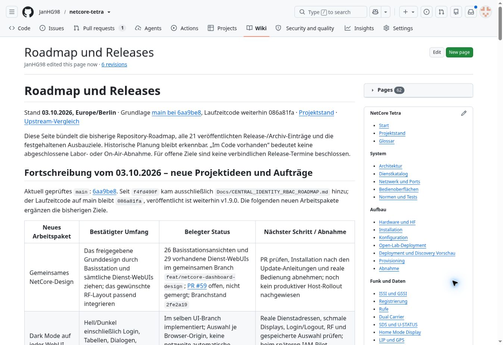
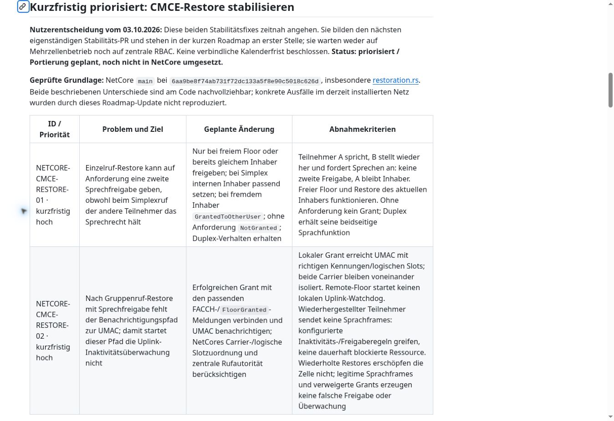

# Brainstorming: Roadmap mit UI, Dark Mode, zentraler RBAC und CMCE-Restore

**Archivhinweis, 09.10.2026:** Diese Datei dokumentiert das im Titel beziehungsweise Quellenrahmen genannte Gespräch und dessen damalige Entscheidungen. Historische Kommandos, Planungen, Versionsangaben und Fehlerbilder bleiben erhalten; der heutige technische Stand steht in der [Gesamtroadmap](../roadmaps/gesamtroadmap.md) und in den [aktuellen Dienstanleitungen](../services/README.md). Die Archivaufnahme bestätigt keine spätere Implementierung oder Live-Abnahme.

Stand der Repository- und Quellenprüfung: **06.10.2026**. Historische Ergebnisse beziehen sich auf die jeweils genannten Daten und Commits.

## 1. Projektstand und Geltungsbereich

| Feld | Wert |
| --- | --- |
| Thema | Fortschreibung der NetCore-Roadmap aus verfügbaren Projektplanungen; gemeinsames WebUI-Design und Dark Mode; zentrale Anmeldung/RBAC; kurzfristige Einzelruf- und Gruppenruf-Restore-Fixes |
| Historischer Arbeitszeitraum | Roadmap-Veröffentlichungen vom 03.10.2026, Europe/Berlin; darin übernommene Projektideen und Quellenstände aus Juli bis Oktober 2026 |
| Erstellung dieses Archivs | 2026-10-06; Repository-Abgleich am selben Tag |
| Repository | [JanHG98/netcore-tetra](https://github.com/JanHG98/netcore-tetra) |
| Ablagebranch | Archiving |
| Geprüfter Archivbranch vor dem Schreiben | [099f58c62a29955ad387fc9ef273d3c19a34e0cb](https://github.com/JanHG98/netcore-tetra/tree/099f58c62a29955ad387fc9ef273d3c19a34e0cb), Tree b104712988dc0429c361df27b0475589c29f8d71 |
| Zusätzlich geprüfter Hauptzweig | [main@9116c15d645458f99e236712b67a1ad970432791](https://github.com/JanHG98/netcore-tetra/tree/9116c15d645458f99e236712b67a1ad970432791) |
| Historischer Hauptzweig dieser Roadmap-Arbeitsphase | [main@6aa9be8f74ab731f72dc133a5f8e90c5018c626d](https://github.com/JanHG98/netcore-tetra/tree/6aa9be8f74ab731f72dc133a5f8e90c5018c626d) |
| Zum Prüfstand vom 06.10.2026 geladener eigenständiger Wiki-Stand | 22a1622c3f3e9a21e7265a098ace9af2e3a81881; letzter Commit am 03.10.2026 um 04:00:09 MESZ |

**Ergebnis der Roadmaparbeit:** Die aktualisierten Ideen und die beiden hoch priorisierten Restore-Aufgaben wurden im GitHub-Wiki dokumentiert und deren Veröffentlichung anschließend geprüft. Es wurde keine der beiden Restore-Korrekturen implementiert, kein zentraler Identity-Dienst installiert und kein produktiver UI-Rollout für diesen Entwicklungsstand nachgewiesen.

**Zusätzlicher Befund vom 06.10.2026:** UI-PR #59 ist inzwischen gemergt. Beide Restore-Lücken bestehen im geprüften aktiven Code weiterhin. Die neuere zentrale Gesamtroadmap auf main führt den Deployment-/Syslog-Abgleich als ersten Gesamtschritt und beide Restore-Fixes als parallel bearbeitbare P0-Aufgaben. Dieser spätere Projektstand wird in Abschnitt 10 getrennt dokumentiert.

## 2. Verfügbare Quellen und offene Belege

Grundlagen sind erhaltene Planungsnotizen, Quellprüfungen und Veröffentlichungsnachweise sowie die am 06.10.2026 erneut gelesenen Repository-, PR-, CI- und Wiki-Quellen. Ziel war die Ergänzung der Roadmap um neue Projektideen. Die beiden Restore-Fixes wurden anschließend mit Priorität, Upstream-Commit und Herkunft aufgenommen.

Ältere Projektideen sind in einschlägigen Auszügen, Zusammenfassungen und der veröffentlichten Ideensammlung erhalten. Die Sammlung ist keine lückenlose Historie sämtlicher früherer Entwürfe; unbelegte zusätzliche Anforderungen werden daraus nicht abgeleitet.

| Quelle / Anhang | Verfügbarkeit und Behandlung |
| --- | --- |
| Roadmap- und Restore-Entscheidungen dieser Arbeitsphase | Im zugänglichen Verlauf/Fortsetzungsstand enthalten; mit den veröffentlichten Wiki-Texten abgeglichen |
| Frühere Projektideen Juli–Oktober 2026 | Relevante übernommene Auszüge vorhanden; vollständige Originalnotizen und sämtliche damaligen Anhänge nicht durchgehend zugänglich |
| netcore-roadmap-published-1790992401156.jpg | Originaldatei wiedergefunden, visuell geprüft und unverändert mit archiviert |
| netcore-restore-roadmap-1790992809677.jpg | Originaldatei wiedergefunden, visuell geprüft und unverändert mit archiviert |
| netcore-wiki-proof-1790976230625.jpg | In einem weitergegebenen früheren Wiki-Bericht erwähnt; hier nicht wiedergefunden. Kein anderes ähnlich benanntes Bild wurde als Ersatz ausgegeben. |
| Frühere lokale Wiki-Worktrees und Portierungsanalysen | Ursprüngliche Arbeitsverzeichnisse wurden inzwischen bereinigt; relevante Ergebnisse sind erhalten, aber nicht jeder damalige lokale Zwischenstand ist erneut lesbar |
| Allgemeine ETSI-PDF-Projektquellen | 25 PDF-Dateien im aktuellen Projektquellenverzeichnis verfügbar; in diesem Roadmap-/Prüfdurchlauf vom 06.10.2026 nicht vollständig normativ ausgewertet. Sie belegen keine Konformität oder vollständige Funkabnahme. |
| Live-Anlagen, Pi-/SDR-Konfigurationen und Betreiberzugänge | Für dieses Archiv nicht zugänglich bzw. nicht benutzt; keine neue Live-, Funk-, NAS-, VPN- oder Deployment-Abnahme |
| Vollständige Testlogs und CI-Artefakte | Workflow-Metadaten erneut gelesen; nicht alle Logs/Artefakte unabhängig reproduziert |

Ein im Verlauf übernommener Bericht über den Wiki-Lauf vom 02.10.2026 und den Dokumentationsmerge PR #58 ist **weitergegebener Kontext**, keine erneut ausgeführte Veröffentlichung dieser Roadmaparbeit. Dass andere Arbeitsphasen inzwischen zusätzliche Betriebsnachweise enthalten können, macht sie nicht zu eigenen Tests dieser Roadmap-Arbeitsphase.

Passwörter, Tokens, private Schlüssel, reale WLAN-Schlüssel und private Standort-/Adresslisten wurden nicht übernommen. Öffentlich sichtbare Beispielports und technische Protokollparameter sind als Repository-Vorgaben gekennzeichnet.

## 3. Ziel, Ausgangslage und behandelte Themen

Die vorhandene Roadmap sollte fortgeschrieben werden, ohne frühere Ziele, Releasehistorie oder bereits erreichte Komponenten zu verlieren. Besonders wichtig war eine ehrliche Trennung zwischen bereits vorhandenem Code, Arbeiten in einem Entwicklungsbranch, einer dokumentierten Architekturidee und tatsächlich abgenommenem Betrieb.

Am historischen main-Stand 6aa9be8 war gegenüber f4fd490f ausschließlich die Datei Docs/CENTRAL_IDENTITY_RBAC_ROADMAP.md hinzugekommen. Der damalige Runtime-Stand blieb 086a81fa8820ef579c475a65a38e3d23644c52f0; der veröffentlichte Release war v1.9.0. Die neue UI-Arbeit lag parallel in feat/netcore-dashboard-design, der Deployment-/Discovery-/Syslog-Ausbau im historischen Entwicklungsstand bbf039729b9b05f8d623b11195ca24a124f68d16.

Behandelt wurden:

- gemeinsames Design für Basisstations-Dashboard und sämtliche vorhandenen Dienst-WebUIs, RF-Ansichten und Dark Mode;
- NETCORE-IAM-01 als zentrale Login-/RBAC-Planung mit eigener Inventur, Pilotmigration und Ausfallregeln;
- zwei zeitnah gewünschte CMCE-Restore-Stabilitätskorrekturen aus Bost/FlowStation;
- bestehende Infrastrukturziele: Deployment-VM, Discovery, Pi-Image, VPN-Autotoggle, Observability und Syslog-/NAS-Archiv;
- Funkzustände, Medienbereitschaft, SIP/Brew, Upstream-Reparaturen und tatsächlicher laufender Mehrzellenruf;
- Leitstellen-Arbeitsplatz, Geräte-/RF-Simulation, HA/Homematic, Sensoren, Anzeigen und Rack-Hardware;
- kleinere erhaltene Ideen zu mobilen Routern, zusätzlichen Voice-Gateways, LIP/Karten, mobilen Bedienoberflächen und Betriebsübersichten;
- zuverlässige Veröffentlichung der Dokumentation im Wiki trotz fehlender Git-Push-Anmeldung.

Die historische Roadmap blieb eine Folge von Arbeitsblöcken ohne zugesagte Kalendertermine und ohne erfundene Fertigstellungsprozente. „Recht zeitnah“ wurde als kurzfristig hohe Priorität verstanden, nicht als vereinbartes Lieferdatum.

## 4. Statusbegriffe und endgültige Festlegungen dieser Arbeitsphase

| Status | Bedeutung in dieser Dokumentation |
| --- | --- |
| Idee | Erhaltener Wunsch oder Vergleichskandidat; Umfang, Architektur oder Abnahme noch nicht verbindlich festgelegt |
| Beschlossen/geplant | Ziel, Reihenfolge oder Arbeitspaket ausdrücklich aufgenommen; Umsetzung bleibt gesondert offen |
| Implementiert | Relevanter Code an einem genannten Branch/SHA vorhanden; Branchintegration wird ausdrücklich benannt |
| Getestet | Benannter Test an benanntem Stand durchgeführt bzw. ein CI-Ergebnis abgerufen; Umfang und Grenzen genannt |
| Im Betrieb bestätigt | Durch einen konkreten zugänglichen Anlagen-/Endgerätenachweis bestätigt; daraus folgt keine pauschale Gesamtfreigabe |

Eine Roadmap-Markierung, ein Mock-PASS oder eine erfolgreiche Anmeldung allein belegt keine Implementierung oder Betriebsabnahme.

| Festlegung | Endgültiger Entwicklungsstand | Begründung / Grenze |
| --- | --- | --- |
| Neue Ideen in bestehende Roadmap aufnehmen | Beschlossen und als Wiki-Dokumentation veröffentlicht | Frühere Ziele und Historie erhalten; Dokumentation ersetzt keine Entwicklung |
| Beide Restore-Fixes zeitnah aufnehmen | Beschlossen/geplant, kurzfristig hoch; historische IDs NETCORE-CMCE-RESTORE-01/02 | Eigenständige Stabilitätsarbeit auch ohne Mehrzellenbetrieb; kein Warten auf IAM oder vollständiges Handover |
| Sprechfreigabe beim Einzelruf-Restore absichern | Geplant | Beim Simplexruf keinen zweiten Sprecher erlauben; internen Floor-Halter konsistent führen |
| Gruppenruf-Restore an UMAC melden | Geplant | Uplink-Inaktivitätsüberwachung muss auch nach Restore eines anschließend stummen Sprechers starten |
| Herkunft von c71c9ad5 erhalten | Beschlossen für eine spätere Portierung | Originalautor Răzvan Zeceș, FlowStation-Historie und Original-SHA nennen; Bost ist Vergleichs-/Übernahmequelle |
| Weitere Änderungen desselben Upstream-Commits | Ideen / getrennte Prüf- und Portierkandidaten | Late Entry, Preemption und Brew-Cleanup nicht automatisch mitbeauftragt |
| Einheitlicher Look und Dark Mode | Ziel bestätigt; im UI-Branch implementiert und CI-Ergebnisse geprüft | 26 TBS-Ansichten, 29 bestehende Dienst-WebUIs; kein Host-Rollout für diesen Entwicklungsstand bestätigt |
| Zentrale Anmeldung / RBAC | Beschlossenes Planungsziel, NETCORE-IAM-01 dokumentiert | Reguläre menschliche TOML-Logins ablösen; Rechte serverseitig und pro Ressource erzwingen |
| Identity-Produkt / Hosting | Empfehlung, keine endgültige technische Auswahl | Eigener Identity-LXC mit Keycloak bevorzugter Vorschlag, Authentik Alternative; Deployment-VM als Pilotoption |
| Deployment/Imagebuilder | Historische Entwicklungsentscheidung Ubuntu-VM | Controller-LXC ohne Imagebuilder weiterhin möglich; Observability bleibt getrennt im LXC |
| Radio-/Core-Betrieb bei Managementausfall | Architektur-/Abnahmeanforderung | Funkvermittlung darf nicht von offenem Browser oder erreichbarem Identity-Dienst abhängen |

Spätere ausdrückliche Korrekturen haben Vorrang. Die ursprüngliche Prioritätsliste mit neun Schwerpunkten wurde nach der Restore-Anweisung auf **zehn** erweitert. Auch der Quellenzeitraum wurde von „Juli–September“ auf „Juli–Oktober 2026“ korrigiert. Diese früheren Formulierungen sind überholt.

## 5. Architektur, Komponenten und Schnittstellen

### 5.1 Vorhandene Funktionsschichten

| Schicht | Relevante Komponenten | Bedeutung für die Fortsetzung |
| --- | --- | --- |
| TBS / Funkstack | CMCE CC, Gruppen-/Einzelrufzustände, MM, MLE, UMAC, LMAC, Scheduler, Dual Carrier | Restore wirkt auf Rufzustand, Floor, Luftschnittstellensignalisierung und tatsächliche Traffic-Ressourcen |
| Zentrale Fachkerne | Node Gateway, Subscriber Core, Group Core, Mobility Core, Call Control, Media Switch, SDS Router, Packet Core | Vorhandene Zuständigkeiten erhalten; ein Restore-Patch ersetzt keinen verteilten Kontext- oder Medienübergang |
| Medien / externe Telefonie | net_asterisk, SIP Switch, RTP, Brew, Recorder, Media Library/TTS | Signalisierung, Floor und Medienbereitschaft müssen zusammenpassen; Sender-/Empfängerzustände und Rückkopplungen prüfen |
| Verwaltung | TBS-Dashboard, Dienst-WebUIs, Control Room, native UI | Design-/Theme-Änderung aktiviert weder IAM noch zusätzliche Backend-Rechte |
| Betrieb / Infrastruktur | Deployment, Discovery, Provisioning, VPN-Policy, Observability, RELP/Syslog, gzip/NFS | Historischen Feature-Code kontrolliert übernehmen und reale Ausfälle/Reconnects abnehmen |
| Integrationen / Hardware | IoT Gateway, MQTT, HA/Homematic, Hardware Gateway, RF Monitor, Asset-/Task-Funktionen | Vorhandene Adapter sind Ausgangspunkte, kein Nachweis eines vollständigen Aktor-, Wartungs- oder PCB-Ablaufs |

Die gemeinsame Bibliotheksschicht „shared“ ist kein eigener Runtime-Dienst und begründet keinen zusätzlichen Shared-LXC.

### 5.2 Zentrale Identität und lokale Autorisierung

Das geplante Modell trennt **Identität**, **Rolle/Einzelrecht** und **Ressourcenbereich**. Ein Techniker kann eine TBS konfigurieren und eine andere ausschließlich ansehen. Ein Operator erhält beispielsweise ein gezieltes Recht für SDS oder Durchsagen auf bestimmte Gruppen. Jede Zielressource wird im jeweiligen Backend geprüft; eine sichtbare UI-Schaltfläche ist keine Autorisierung.

Menschliche Konten, Dienste-/Stationsidentitäten und TETRA-Teilnehmeridentitäten bleiben unterschiedliche Identitätsklassen. Web-IAM-Rollen ändern weder automatisch die TETRA-Authentisierung noch Schlüsselmaterial. Die vorhandenen Control-Room-Rollen Node, Viewer, Operator und Admin müssen in die Migration einbezogen werden; vorgeschlagene gemeinsame Rollen viewer, operator, technician, administrator, auditor und owner sind noch ein zu vereinheitlichendes Modell.

Empfohlene, noch nicht installierte Zielarchitektur:

- eigener Identity-LXC mit etabliertem Identity Provider, bevorzugt Keycloak, zunächst mit eigener PostgreSQL-Datenbank;
- gemeinsame Rust-Integration „netcore-auth“ für OIDC, Sessions, Tokenprüfung, Ressourcenrechte und Audit-Kontext; Paketpfad erst in M0/M1 festlegen;
- autorisierende Fachbackends einschließlich APIs, Downloads/Exporte, WebSockets/SSE und schreibender Managementaktionen;
- Discovery/Deployment zur vertrauenswürdigen Client-Provisionierung und getrennten Maschinenanmeldung;
- Observability für Authentifizierungsfehler, Ablehnungen und Audit;
- spätere NetCore-IAM-Oberfläche im gemeinsamen Design, optional AD, MFA, NFC/RFID und höhere Verfügbarkeit.

Ein Pilot in der Deployment-VM bleibt möglich, koppelt jedoch Wartung und Loginerreichbarkeit. Control Room oder Security Core sollen nicht zum notwendigen zentralen Loginhost für alle Dienste werden. Ein einzelner Identity-LXC ist keine Hochverfügbarkeit.

### 5.3 IAM-Meilensteine und Ausfallvertrag

| Meilenstein | Geplanter Umfang | Abnahme / Abhängigkeit |
| --- | --- | --- |
| M0 | Alle Logins, Endpunkte, geschützten Aktionen, WebSockets/SSE, Downloads, Maschinenzugänge und Open-Lab-Ausnahmen inventarisieren | Vollständige Zugangs-/Rechtematrix; erste vorhandene Teilbefunde reichen noch nicht |
| M1 | ADR für Produkt, Hosting, DNS/HTTPS/Issuer, Rollen, Ressourcen, Token-/Sessiondauer, Sperrfristen, Notzugang und Migration | M0; delegierte Administration ohne ungewollte Selbsterhöhung |
| M2 | Identity-Pilot mit nachvollziehbarem Backup-/Restore- und Betriebsmodell | M1; keine behauptete Installation aus dieser Roadmap |
| M3 | Gemeinsame Rust-Integration | Authorization Code mit PKCE, state/nonce, sichere Sessions/CSRF; API-Token mit Signatur, Algorithmus, Issuer, Audience, Ablauf und Tokenart; JWKS-Cache/Rotation |
| M4 | Eine TBS als Pilot migrieren | Zwei Rollen und zwei Ressourcenbereiche, direkte API-Negativtests, Identity-Ausfall, isolierter Neustart, Notzugang, Funkregression und Rückweg |
| M5 | Control Room und Zentraldienste einzeln migrieren | Stabile zentrale Identitäten; keine ungeprüften Passwortimporte; Maschinenkonten separat; sichtbare Restliste nicht migrierter Dienste |
| M6 | Discovery/Deployment integrieren und reguläre TOML-Logins ablösen | Nach Pilot und je betroffener Dienstmigration; kein unbeabsichtigter zweiter Dauerlogin |
| M7 | Betrieb, Ausfälle und Wiederherstellung abnehmen | Sperrfristen, Schlüssel-/Datenbank-Backup, Auditpuffer, Rollenmatrix, belastbare Betriebsanweisung |
| M8 | Optionale NetCore-IAM-UI, AD, NFC/RFID und HA | Stabiler Grundbetrieb; eigene Anforderungen und Tests |

Wesentliche Grenzen: Ein JWKS-Cache ermöglicht Prüfung gültiger Tokens, aber keinen neuen Offline-Login und keine Tokenverlängerung. Benutzer-/Rechteentzug kann bei lokaler Tokenprüfung bis zum Ablauf verzögert wirken; die maximal zulässige Sperrfrist ist zu entscheiden. WebSockets dürfen nicht unbegrenzt berechtigt bleiben, wenn das Token abläuft. Unbekannte Signing Keys ohne prüfbare Vertrauenskette werden abgelehnt. Neustart einer isolierten TBS, Zeitsynchronisation, Schlüsselrotation und Identity-/AD-/VPN-Ausfall brauchen eigene Tests.

Ein Notzugang ist gezielt provisioniert, gehasht, eingeschränkt und auditierbar. Ein ausfallender Identity-Dienst darf keinen offenen Zugriff oder stillen Standardpasswort-Fallback erzeugen. Eine Karten-UID allein ist noch kein sicherer Authentifizierungsnachweis.

## 6. CMCE-Restore: technische Befunde und Portierungsauftrag

### 6.1 Quelle und Herkunft

Konkreter Kandidat: [c71c9ad51462bbc64fb7669f9b192d5f6f325d8b bei Aitorrio/bost-flowstation](https://github.com/Aitorrio/bost-flowstation/commit/c71c9ad51462bbc64fb7669f9b192d5f6f325d8b), Titel **fix(cmce): fix floor and timeslot leaks, add group-call late entry**.

Autor und Committer: **Răzvan Zeceș**, 19.07.2026 um 19:34:40 UTC. Derselbe Commit ist in der [FlowStation-Historie](https://github.com/razvanzeces/flowstation/commit/c71c9ad51462bbc64fb7669f9b192d5f6f325d8b) vorhanden. Beide Commit-Metadaten wurden für dieses Archiv erneut gelesen. Die Korrekturen sind daher kein erst im Oktober erschienener Bost-Fix. Bei einer angepassten Übernahme Original-SHA, Autor, Herkunft und vorhandene Lizenz-/Copyright-Hinweise erhalten.

Betroffene Upstream-Dateien: cc_bs/pdu.rs, procedures/isi.rs, procedures/restoration.rs, procedures/setup.rs und tests/test_cmce_bs.rs. Der Commit umfasst mehr als die beiden durch den Betreiber priorisierten Restore-Korrekturen.

### 6.2 NETCORE-CMCE-RESTORE-01: Einzelruf-Floor konsistent wiederherstellen

Historische Prüfung: NetCore main@6aa9be8. Geprüfte Wiederprüfung: main@9116c15 sowie der gleiche Restore-Blob auf Archiving@099f58c.

Aktiver Eingang ist routes/rd.rs: UCallRestore wird an rx_u_call_restore geroutet; dieses liest UCallRestore und ruft fsm_on_u_call_restore in procedures/restoration.rs auf. Es handelt sich um einen aktiven Eingang, nicht nur um unbenutzten Hilfscode.

Der vorhandene individuelle Zweig prüft den aktiven Ruf und die Zugehörigkeit des Senders zu calling_addr/called_addr. Nach begin_restore und Neustart des active_timer_started gilt jedoch:

~~~text
request_to_transmit_send_data = true  -> TransmissionGrant::Granted
request_to_transmit_send_data = false -> TransmissionGrant::NotGranted
~~~

Es fehlen hier die Prüfung des aktuellen floor_holder und die entsprechende konsistente Vergabe beim Simplexruf. So kann eine Wiederherstellung eine Sprechfreigabe signalisieren, während der andere Teilnehmer das Sprechrecht hält. Das ist ein statischer Fehlerbefund; für diesen Entwicklungsstand wurde kein gleichzeitiger realer Senderfall auf einer installierten TBS reproduziert.

Geplante Anpassung:

1. Ohne Sendeanforderung NotGranted.
2. Ist der Floor frei oder gehört er bereits dem anfragenden Teilnehmer, passende Freigabe erteilen.
3. Beim Simplexruf den internen Sprechrechtsinhaber mit dem bestehenden grant_floor-Pfad konsistent setzen.
4. Hält der andere Teilnehmer den Floor, GrantedToOtherUser statt zweiter Freigabe.
5. Duplexverhalten erhalten; den Simplex-Owner-Vertrag nicht ungeprüft auf beidseitige Duplexsprache übertragen.

### 6.3 NETCORE-CMCE-RESTORE-02: Gruppenruf-Grant bis UMAC durchziehen

Der Gruppenrufzweig vergibt intern bereits nur dann den Floor, wenn kein aktiver Sprecher vorhanden ist oder der Sender der aktuelle Sprecher ist. Er ruft grant_floor auf, beendet den Restore und sendet D-CALL RESTORE. Der ergänzende FACCH-/FloorGranted-Benachrichtigungspfad zur unteren Funksteuerung fehlt weiterhin.

UMAC hat die dazugehörige Überwachung bereits implementiert:

- CallControl::FloorGranted beendet Hangtime für den Slot und setzt last_ul_voice auf die aktuelle TDMA-Zeit sowie ul_signal_owner auf die lokale source_issi.
- Empfangene lokale UL-Sprachframes erneuern last_ul_voice.
- Das Öffnen eines UL-fähigen Circuits allein startet den Watchdog ausdrücklich nicht, da ein Circuit auch ohne lokal erwarteten Sprecher bestehen kann.
- check_ul_inactivity betrachtet aktive UL-Circuits außerhalb von Hangtime und ausstehenden Closes.
- Die Schwelle wird aus cell.ul_inactivity_secs × 18 Frames/s × 4 Slots/Frame berechnet. Der Vergleich erfolgt auf Überschreitung; None erzeugt keinen Timeout.
- Der Codekommentar fordert Abstand über T.213 (1 s), um DTX und kurze Fading-Unterbrechungen zu tolerieren. Eine konkrete aktuelle Betreiberkonfiguration oder ein verbindlicher neuer Timeoutwert wurde hier nicht festgelegt.
- Bei Überschreitung sendet UMAC CallControl::UlInactivityTimeout mit dem logischen Slot an CMCE.
- FloorReleased, CallEnded und geschlossene UL-Circuits räumen die passenden Überwachungs-/Ownerzustände auf.
- RemoteFloorGranted hält last_ul_voice und ul_signal_owner leer: Ein remote/netzseitiger Floor soll keinen lokalen UL-Watchdog starten.

Der Zusammenhang erklärt das vom Upstream-Commit beschriebene Fehlerbild: Ein nach Restore zum Sprechen berechtigter, danach stummer Teilnehmer kann einen Traffic-Slot blockieren, wenn kein FloorGranted den Timer initialisiert. Wie lange der Slot in NetCore konkret gehalten wird, hängt zusätzlich von Ruf-, Hangtime- und Freigaberegeln ab. Eine dauerhaft blockierte aktuelle Anlage wurde hier nicht nachgewiesen.

Geplant ist, nach erfolgreichem lokalen Restore-Grant den nötigen D-TX-GRANTED-/FACCH-Pfad und notify_floor_granted mit UMAC-Benachrichtigung zu verwenden. Snapshot von Ruf-/Floor-/Slotdaten und Rust-Borrow-Grenzen beachten. Ablehnung oder fehlende Sendeanforderung darf keinen fiktiven neuen lokalen Floor oder Watchdog erzeugen.

### 6.4 NetCore-spezifische Verträge erhalten

| Unterschied / Abhängigkeit | Portierungsregel |
| --- | --- |
| NetCore GroupFloorGrant | Felder call_id, source_issi, dest_gssi, dest_is_group und logischer ts; Upstream-Typen und Feldnamen nicht blind kopieren |
| Carrier-/Slotmodell | Primärer Carrier: logische Traffic-TS 2–4. Zweiter Carrier: physische TS 2–4 werden als logische TS 5–7 geführt. TS8 ist unbenutzt/reserviert. |
| Lokaler versus Remote-Floor | Lokaler Grant aktiviert lokale UL-Überwachung; RemoteFloorGranted soll sie nicht starten |
| Brew-Benachrichtigung | brew_notification_for_group_call erhält CallOrigin::Local/Network, tatsächliche network_entity, lokale ISSI-Erlaubnis und GSSI-Routbarkeit |
| Upstream IfGroupRoutable | Kein gleichwertiger pauschaler Ersatz für NetCores ziel-/quellenbezogene BrewNotification-Varianten |
| Weitere Empfänger | notify_floor_granted kann bei aktivierter Recording-Funktion auch Recorder und den zulässigen Brew-Empfänger benachrichtigen; Seiteneffekte mitprüfen |
| Zentral verwaltete Rufzweige | Vorhandene Call-Control-/Medienfreigabe und RouteReady-/Revisionsverträge erhalten; lokale Restore-Freigabe darf zentrale Zuständigkeit nicht umgehen |
| Mehrzellenbetrieb | Der Patch setzt vorhandenen Rufkontext voraus und implementiert keinen vollständigen MM-/CMCE-Kontexttransfer oder laufenden Medienhandover |

Die zentralen Route-/Medienbedingungen sind Portierungs- und Abnahmeanforderungen aus der vorangegangenen Analyse. Im geprüften Archivabgleich wurde vor allem der aktive Restore-, Lifecycle-, Routen- und UMAC-Pfad erneut gelesen; keine vollständige erneute Prüfung sämtlicher zentraler Worker wurde behauptet.

### 6.5 Geplante Regressionen und Abnahme

| Fall | Erwartung | Nachweisstatus |
| --- | --- | --- |
| A spricht im Simplex-Einzelruf, B restauriert mit Sendeanforderung | Keine zweite Freigabe; A bleibt Owner | Geplant, nicht für diesen Entwicklungsstand ausgeführt |
| Freier Einzelruf-Floor | Restore mit Sendeanforderung darf vergeben; interner Owner stimmt | Geplant |
| Restore des aktuellen Einzelruf-Owners | Gültiger Restore ohne konkurrierenden zweiten Owner | Geplant |
| Keine Sendeanforderung / ungültiger Teilnehmer / inaktiver Ruf | Kein unerlaubter Grant; bisherige Ablehnung erhalten | Geplant |
| Duplex-Einzelruf | Beidseitige Sprachfunktion bleibt möglich | Geplant |
| Lokaler Gruppenruf-Restore, danach keine Sprachframes | FloorGranted initialisiert korrekten Slot; Timeout/Hangtime/Release greifen; Ressource wieder nutzbar | Geplant |
| Gruppenruf mit echten Sprachframes nach Restore | Timer wird erneuert; kein verfrühter Abbau | Geplant |
| Restore ohne oder mit verweigertem Gruppen-Floor | Kein neuer lokaler Watchdog, keine fiktive Floor-/Brew-Meldung | Geplant |
| Beide Carrier und mehrere logische Slots | Keine Timer-/Owner-/Release-Verwechslung zwischen TS2–4 und TS5–7 | Geplant |
| Remote-Floor / Netzruf / Recorder-/Brew-Empfänger | Keine lokale UL-Erwartung für remote Sprache; zulässige Empfänger und Herkunft bleiben korrekt | Geplant |
| Wiederholte Restores, konkurrierende Sprecher, Freigabe und sofortiger neuer Ruf | Keine Floor- oder Sloterschöpfung; keine verlorene Release-Signalisierung | Geplant |
| Zentral verwalteter Ruf / fehlende Medienbereitschaft / veraltete Route | Zentrale Autorität und Revision bleiben wirksam | Geplant |
| Reales Funkgerät und stummer wiederhergestellter Teilnehmer | Derselbe Ablauf On Air mit Build, Konfiguration, Logs und Gerätefirmware belegbar | Offen, kein Betriebsnachweis |

Die grünen UI-/Radio-CI-Läufe des damaligen Branches beweisen diese fehlenden Restore-Regressionen nicht. Die Korrekturen benötigen einen eigenen Stabilitäts-PR mit gezielten positiven und negativen Fällen sowie anschließender realer Abnahme.

### 6.6 Zusätzlicher Umfang von c71c9ad5

Drei getrennte Kandidaten bleiben erhalten: Gruppenruf-Late-Entry in einen bereits aktiven GSSI-Ruf statt paralleler Circuit-Allokation, Auswahl eines nicht sendenden Preemption-Opfers und Cleanup eines halb geöffneten Brew-Rufzweigs bei fehlgeschlagener netzseitiger Gruppenruf-Allokation. Sie sind **Ideen/Prüfkandidaten**, keine für diesen Entwicklungsstand bestätigte Gesamtübernahme.

## 7. Gemeinsame WebUIs und Dark Mode

Historischer Entwicklungsbranch: feat/netcore-dashboard-design, Stand 2fe2a1939a8795db3816d45973282781dae856f0. Die Arbeit wurde gemeinsam in [PR #59](https://github.com/JanHG98/netcore-tetra/pull/59) geführt. Die damalige Folge umfasste den TBS-Designstand 783fd55, den Dienst-UI-Stand dc70ad8 und den Dark-Mode-Stand 2fe2a19. Für die beiden ersten Kennungen sind hier nur die erhaltenen Kurz-SHAs genannt.

Umfang laut geprüftem PR und Update-Dokumenten:

- 26 Basisstationsansichten und 29 bereits vorhandene Dienst-WebUIs;
- freigegebenes originales NetCore-Logo, helle Flächen, blaue Akzente und horizontale Navigation;
- passende Einbindung des RF-Layouts;
- Hell/Dunkel auch auf vorhandenen Loginseiten sowie für Tabellen, Formulare, Dialoge, Status-, Log- und Diagrammansichten;
- TBS behält zusätzlich ihr blaues Theme;
- persistente Theme-Auswahl **pro Browser-Origin**. Hosts oder Ports mit unterschiedlicher Origin haben getrennte Auswahl; keine netzweite automatische Themesynchronisierung;
- eingebettete Oberflächen/Bundles in den vorhandenen Programmen, kein zusätzlicher produktiver Node-/npm-Webserver;
- vorhandene Backend-APIs und Anmeldungen bleiben der Funktionspfad; Designänderung aktiviert keine zentrale IAM-Migration.

Historischer Status im Roadmap-Arbeitsphase: PR offen, UI-Branch implementiert, benannte CI-Läufe erfolgreich abgerufen, Merge und realer Host-Rollout offen. **Zum Prüfstand vom 06.10.2026 überholt ist nur „PR offen/nicht gemergt“:** der Merge wird in Abschnitt 10 nachgewiesen. Reale Bedien- und Hostabnahme bleiben für diese Arbeitsphase unbelegt.

Nach Installation sind tatsächliche Dienstadressen, schmale Displays, Login/Logout, Tabellen/Dialoge, öffentliche Übersicht, RF-Anzeigen und gespeicherte Auswahl nach Neuladen zu prüfen. Vorschau-/Designwerte sind keine installierten Betriebsdaten.

## 8. Erhaltene Ideen, historische Prioritäten und offene Aufgaben

### 8.1 Endgültige kurze Prioritätsfolge vom 03.10.2026

Diese Tabelle bewahrt **das Ergebnis der Planung**. Sie ist keine Behauptung, dass die inzwischen entstandene zentrale ROADMAP.md dieselbe Gesamtfolge verwendet.

| Historische Priorität | Arbeitspaket | Damaliger belegter Stand / offener nächster Schritt |
| --- | --- | --- |
| 1 | Beide CMCE-Restore-Fixes | NETCORE-CMCE-RESTORE-01/02 geplant; eigener Stabilitäts-PR, gezielte Regressionen und reale Abnahme; unabhängig von Mehrzellen/IAM |
| 2 | Deployment-VM, Discovery, gezielte Updates | Entwicklung 0.2.3 vorhanden, historische CI geprüft; reale LXC-/VM-Rollen, PBX als VM, verlorener Auftrag und Wiederanlauf prüfen; Übernahme nach main offen |
| 3 | Einheitliche WebUIs / Dark Mode | 26 TBS-Ansichten, 29 Dienst-WebUIs in PR #59; historisch Review/Merge und Host-Rollout offen |
| 4 | Zentrale Anmeldung / RBAC | NETCORE-IAM-01 dokumentiert; M0-Inventur und M1-ADR offen |
| 5 | Pi-Image / VPN-Autotoggle | Historisches Rezept/Policy im Feature-Stand; SXceiver-Pi, Boot, physische LAN/WLAN/VPN-Wechsel und isolierter Weiterbetrieb abnehmen |
| 6 | Syslog / NAS-Archiv | Implementierung im Feature-Stand; Sender → RELP → Collector → gzip am realen Share, Mountausfall, Retention und Verlustzähler prüfen |
| 7 | main-Stabilität / Upstream-Reparaturen | Audit-/API-/Konfigurationsdrift, Circuit-Reopen, SDS, RTP/CANCEL, MAC und zusätzliche c71c9ad5-Kandidaten einzeln prüfen |
| 8 | Laufender Mehrzellenruf / Leitstellen-Arbeitsplatz | Fachkerne und UI-Grundlagen vorhanden; zwei echte TBS, Floor-/Kontext-/SIP-/Medienübergang sowie Desktop-Audio/PTT und Dispatch-Autorität abnehmen |
| 9 | HA/Homematic, Hardware und Simulation | Korrelierte Funk-/MQTT-/Aktion-/SDS-Kette, Simulatorvertrag, Sensor-/Anzeige-Module, Pinmatrix und Rack-Prototyp |
| 10 | Betriebsreife / weitere Ausbaustufen | IAM M5–M7, TLS, Recovery, Versionskonflikte; AD/NFC/HA sowie Nexus-2-/Router-/Gateway-Konzepte später nach eigener Prüfung |

UI-Abnahme, IAM-Inventur und Infrastrukturarbeiten durften neben dem Restore-Stabilitätsblock weiterlaufen. Es wurde weder ein Datum für den Restore-PR vereinbart noch dessen Erstellung/Codeportierung in diesem Roadmap-Auftrag durchgeführt.

### 8.2 Infrastruktur und Deployment

| Idee / Anforderung | Einordnung und wichtige Details | Verbleibende Arbeit |
| --- | --- | --- |
| Deployment-Controller | Im historischen Feature-Stand implementiert: Ubuntu-VM mit WebUI, Git-Abgleich, SHA-Pinning, persistenten Aufträgen und gezielten Updates | Quellenstand kontrolliert nach main übernehmen; keine pauschale Wiederinstallation oder Überschreibung neuerer Änderungen |
| LXC versus VM | Ältere Deployment-LXC-Idee durch VM für Imagebuilder konkretisiert; LXC ohne Imagebuilder bleibt möglich | Tatsächliche Hostrolle und installierte systemd-Units prüfen; nur passende Dienste ausrollen |
| Neue-TBS-Wizard | Name, MCC/MNC, ISSI, LA, CC und Standort-TOML liefern Profil/Bootstrap | Teilnehmer-/Gruppen-Provisioning getrennt behandeln; Eingaben/Validierung und physische TBS prüfen |
| ARM64-Pi-Image | Historisches Image-Rezept und Personalisierung vorhanden; Image vor Download bauen | Vollständigen Build, tatsächlichen Pi-/SXceiver-Boot, SDR, lokale Dienste und SIP-Fallback abnehmen; kein zugesicherter bitidentischer Neubau |
| Dienstsuche | Rollen, 90-Sekunden-Lease, Konfliktanzeige, lokaler Cache, Seeds und manuelle Suche im Feature-Stand | Gleiches VLAN und Discovery-Reichweite prüfen; Suche darf RF-Dienste nicht neu starten |
| Weiterbetrieb ohne Zentrale | Lokale Caches/Fallbacks als Betriebsziel | Grenzen pro Fachfunktion, Neustart, Wiederanlauf und veraltete Daten prüfen; nicht mit Backend-HA gleichsetzen |
| VPN-Autotoggle | Physische NetworkManager-WLAN/LAN-Verbindungen prüfen; vertrauenswürdige Netze lokal konfigurieren | VPN-Tunneladresse nie als Beleg für Heim-LAN verwenden; reale Wechsel, Mehr-Uplink und Wiederverbindung testen |
| Observability getrennt | Beschlossene Trennung: eigener Observability-LXC, Deployment/Imagebuilder auf VM | Erreichbarkeit, Discovery und Ausfälle unabhängig abnehmen |
| Syslog / Archiv | Historischer PR #57 im Feature-Stand; separater RELP-Empfang, begrenzte Vorschau, Verlustzähler, täglich verifizierte gzip-Dateien auf NFS | Senderpilot, Share-/Mountausfall, Neustart, Retention und begrenzte lokale Puffer prüfen |
| Versions-/Installationsnachweis | Komponentenstand 0.2.3 ist der historische Feature-Code; Windows-Launcher-Fix 0.2.6 vom 28.09. ist ein eigener Bericht | Quellen-SHA, Binaryversion, Hostrolle und Live-Konfiguration getrennt erheben; Versionsnummern nicht gleichsetzen |
| Rücknahme / Recovery | Konfigurationssicherung und TBS-Binary-Rückweg teilweise vorhanden | Dienstbezogene Rücknahme und optimistische Versionsprüfung ausarbeiten; kein allgemeiner atomarer Rollback behauptet |
| Inventory-/Auditdrift | Historisch 24/25 Dienste und ältere 17/18-Angaben; API-/Metrics-/OpenAPI-/Konfigurations-/Gateway-Widersprüche als Prüfaufgaben | Generatoren, Inventory, Katalog, Endpunkt-/Fallbackmatrix und Installationsnachweise konsistent machen |

### 8.3 Funk, Medien, Bedienung, Integrationen und kleinere Nebenideen

| Wunsch / Kandidat | Planungsstatus und vorhandene Grundlage | Nächster sinnvoller Schritt / Grenze |
| --- | --- | --- |
| Virtuelle Funkgeräte | Idee: PTT, Display, Tasten/D-Pad, GPS und steuerbarer Zellwechsel in Weboberfläche | Geräte-/Session-/Luftschnittstellenvertrag festlegen |
| Virtuelle TBS und echte Simulation | mock_tbs.py ist vorhandener deterministischer Core-Testpartner; vollständiger RF-/ETSI-Simulator offen | Mock-Core-Integration, Gerätebedienung und RF-Simulation als getrennte Stufen abnehmen |
| Virtuelle Luftschnittstelle | Ältere Idee: WebSocket neben HF und Android-VMs | Aktuellen Bestand erst prüfen; kein vollständiger implementierter Pfad belegt |
| Laufender Mehrzellenruf | Mobility Core, Call Control und Media Switch vorhanden; gesamter Mid-Call-Kontext-/Floor-/Medienpfad offen | Zwei reale TBS, laufende Gruppen-/Einzelrufe und SIP-Szenarien mit gemessener Unterbrechung prüfen |
| PTT-/Audio-Latenz | Vorhandene Medienbereitschaft ist Ausgangspunkt | PTT bis hörbares Audio in beiden Richtungen messen; frühere Schätzwerte nicht als Messung ausgeben |
| Getrennt nutzbarer Brew-Server | Rust-Paket unter misc/brew-server vorhanden, älterer Python-Brew ebenfalls erhalten | Rufautorität, Floor, Medien und externe Bridges abgrenzen; kein automatischer Austausch beschlossen |
| Dispatch-Kern | Idee/Entwurf zur Koordination der vorhandenen Fachkerne | Bestehende Call-Control-/Media-/Mobility-Autorität erhalten; kein zweites konkurrierendes System erfinden |
| Native Leitstellenbedienung | Native eframe/egui-UI mit abtrennbaren Fenstern und Karten vorhanden | Headset/Mikrofon, Aufnahme/Wiedergabe, PTT, Audiozustände und Rechte end-to-end abnehmen |
| Kleine Touchscreens bis Anzeigewand | Erhaltener Bedienwunsch | Skalierung, mehrere Monitore, Fensterzustände, Eingaben und Offlineanzeige prüfen |
| AD, NFC/RFID und privilegierte Rollen | Optionale IAM-Ausbaustufen, keine bestätigte Integration | Zuerst Rechte-/Sitzungsmodell; danach Verzeichnisdienst/Leser/MFA und Ausfallregeln |
| HA/Homematic | MQTT, HA-Discovery, Command-/Ack-Ledger und Default-Deny-Grundlagen vorhanden | Funkstatus → IoT Gateway → Automation → tatsächliches Ergebnis → korrelierte SDS-Antwort testen |
| Historisch ausbleibende SDS-Antwort | Ältere Fehlerbeobachtung, kein Nachweis eines zum Prüfstand vom 06.10.2026 fortbestehenden Fehlers | Aktuellen Build und vollständigen Rückweg reproduzieren; Empfang, Durchführung und Quittung unterscheiden |
| GPIO / Sensoren / Aktoren | Hardware-Gateway-Grundlage; konkrete Hardware offen | Pinmatrix, Busse, Spannungen, Treiber und reale Rückmeldung mit Modulen prüfen |
| Temperatur / Spannung / Lüfter / LEDs | Erhaltene Rack-Betriebswünsche | Sensor-/Aktor-Auswahl, Messung, Grenzwerte und Ausfallverhalten prototypisieren |
| LCD/TFT / I2C-Anzeige / Watchdog | Ideen; kein geprüfter Treiber für jede Variante belegt | Konkrete Anzeige/Bus-/Reset-/Watchdog-Verträge festlegen |
| Eigene Rack-Platine | Idee, kein fertigungstauglich geprüfter PCB-Entwurf | Erst Modulprototyp; anschließend Schaltplan, Pinbelegung und reale Hardwareabnahme |
| RF-Monitor / Smart-Tune | RF Monitor und externe Probe-Grundlagen vorhanden; gleichwertiger Nexus-Mess-/Kalibrierablauf nicht belegt | Vor-/Nach-Endstufenmessung, Sendesperre, Hardware und Betriebsunterbrechung klären; DSP-EVM ist keine Leistung/VSWR-Messung |
| Mobiler Router / 5G / WLAN | BPI-R4-/R4-Pro, SIM/M.2, Access Point und kompakter Switch als Ideen | Modell, Module, Strombudget, Treiber, Antennen, AP und VPN-Übergänge wählen/testen |
| Kleiner mobiler Rack-Aufbau | Hardwareplanung | Gewicht, Stromversorgung, Wärme und Transport klären; kein abgeschlossener Softwaremeilenstein |
| Pi 5 / AI HAT | Machbarkeitsidee ohne beschlossenen NetCore-Anwendungsfall | Erst konkreten Bedarf und Schnittstelle definieren |
| Zello / FRN / weitere Voice-Gateways | Erhaltene spätere Ausbauideen | Autoritativen Ruf-/Floor-/Medienadapter und Interoperabilitätsabnahme definieren |
| Aktive LIP-Anfragen / Karten | Teilfunktionen GPS/LIP/Karten vorhanden; weitere aktive Abfragen nachrangiger Wunsch | Konkrete fehlende Abfrage-/UI-/Endgerätefälle bestimmen; keine pauschale Neuentwicklung der bereits vorhandenen Grundlagen |
| Mobile Bedienung / Asset-QR | Idee auf vorhandenen Asset-/Task-Funktionen | Geräte-/Benutzerrechte, QR-Ablauf und geschlossenen Wartungsrückweg prüfen |
| SystemPulse-ähnlicher Betriebsüberblick | Idee auf vorhandener Observability | Echte Datenquellen, Aktualität und Diagnosestufen festlegen |
| Stationspakete .bptbs / .ptbs | Bost-Vergleichskandidat für Recovery, keine beschlossene NetCore-Funktion | Manifest, Schema, Importvalidierung, Geheimnisschutz und konsistente Rücknahme spezifizieren |
| Nexus-BS2-Mehrmodus-/Touch-/RF-Konzepte | Dokumentationsbasierte Ideen, kein direkt verfügbarer Runtime-Port | Eigene Anforderungen und Hardware-/Codequellen prüfen; veröffentlichte Herstellerangaben nicht als NetCore-Test ausgeben |

Weitere Vergleiche aus dem vorhandenen Upstream-Dokument bleiben relevant: Circuit-Reopen mit ausstehenden Close-Aufträgen; RTP-Socket-Rückstau vor media_ready; konfigurierbare Paketdauer; SIP-CANCEL mit verspätetem 2xx und ACK/BYE; Status-Ack und Deduplizierung; SDS-TL-Zustellbericht ohne unbeabsichtigtes emergency_clear; MAC-END-Channel-Allocation im letzten Downlinkfragment; Zugriffsmatrix für APIs, WebSockets, Assets und Medienexport. Diese Punkte wurden als einzelne Prüf-/Portierkandidaten erhalten, nicht als neue Live-Störungen bestätigt.

Historische technische Details dieser Kandidaten: NetCore signalisierte ptime/maxptime 60 ms, FlowStation standardmäßig 20 ms mit konfigurierbarem Packetizer. Der NetCore-Media-Worker besaß begrenzte Queues von acht Einträgen und eine Altersgrenze von 240 ms; ein vorgelagerter ungelesener Socket-Rückstau war dadurch nicht automatisch beseitigt. FlowStation deduplizierte geeignete Statuskommandos 30 s nach Quelle/Status. Diese Zahlen sind **historische Vergleichsparameter**, keine in diesem Archiv erneut gemessenen oder für den geprüften Gesamtbetrieb empfohlenen Werte.

## 9. Erreichtes Ergebnis, Fehler und Prüfungen der ursprünglichen Arbeitsphase

### 9.1 Tatsächliche Dokumentationsveröffentlichung

Zunächst wurden Roadmap-und-Releases und Projektideen-und-Entwicklungsstand ergänzt. Der erste Git-Veröffentlichungsversuch ging von Wiki-Stand 3d3ceee aus und erzeugte den lokalen Commit 4818e1b. Der Push scheiterte mit:

~~~text
fatal: could not read Username for 'https://github.com': No such device or address
~~~

Ursache war die in diesem Lauf fehlende nutzbare Git-HTTPS-Anmeldung. Der Fehler sagt nichts über die Funktionsfähigkeit von NetCore aus. **4818e1b ist kein bestätigter Ferncommit.**

Die Veröffentlichung erfolgte die Veröffentlichung über den vorhandenen GitHub-Webeditor. Ein anschließender frischer Git-Abruf zeigte den Wiki-Fernstand d7b74943c4b970609eb47190d0a5f5921a779ced. Die beiden Seiten wurden im historischen Lauf vollständig gegen die beabsichtigten Texte geprüft; beide Vergleiche waren erfolgreich. Die zum Prüfstand vom 06.10.2026 geladene Wiki-Historie enthält die entsprechenden Veröffentlichungscommits:

| Commit | Seite / Inhalt |
| --- | --- |
| f6a1fd235b53a174585f9af39751939b7371b07f | Roadmap: gemeinsame WebUIs, Dark Mode und IAM-Planung |
| d7b74943c4b970609eb47190d0a5f5921a779ced | Projektideen: neue Ideen und aktualisierte Prioritäten |
| 93f719aad93f2dc56b52c11350e5024bb219ac4f | Roadmap: Restore-Fixes an historische Priorität 1 |
| 5e500e5d2eb3b1a371b2e27c015068fc14b25086 | Projektideen: Floor-/Watchdog-Fixes und Abnahme |
| 22a1622c3f3e9a21e7265a098ace9af2e3a81881 | Upstream: FlowStation-Herkunft und getrennte Portierung |

Nach der konkreten Restore-Anweisung wurden **drei** Seiten fortgeschrieben: Roadmap-und-Releases, Projektideen-und-Entwicklungsstand und Upstream-Vergleich. Der historische vollständige Textvergleich nach frischem Fetch war für alle drei erfolgreich; der Wiki-Fernstand erreichte 22a1622. Zum Prüfstand vom 06.10.2026 wurde dieser Wiki-Stand erneut erfolgreich geklont und die einschlägigen Abschnitte/Historie gelesen.

Die zwei Screenshots belegen die gerenderte Veröffentlichung. Sie belegen keine Codeportierung und zeigen einen historischen Status, in dem PR #59 noch offen war.

### 9.2 CI und berichtete Testumfänge

Diese vier Workflow-Ergebnisse für **2fe2a1939a8795db3816d45973282781dae856f0** wurden damals abgerufen und für dieses Archiv erneut als completed/success bestätigt:

| Workflow | Lauf / Quelle | Ergebnis / Grenze |
| --- | --- | --- |
| Base station dashboard | [37086884986](https://github.com/JanHG98/netcore-tetra/actions/runs/37086884986) | Erfolgreich; Beginn 03.10.2026 01:38:49 UTC |
| NetCore service WebUIs | [37086884910](https://github.com/JanHG98/netcore-tetra/actions/runs/37086884910) | Erfolgreich; Beginn 03.10.2026 01:38:48 UTC |
| Warning service | [37086885034](https://github.com/JanHG98/netcore-tetra/actions/runs/37086885034) | Erfolgreich; Beginn 03.10.2026 01:38:49 UTC |
| Radio traffic regression tests | [37086884890](https://github.com/JanHG98/netcore-tetra/actions/runs/37086884890) | Erfolgreich; Beginn 03.10.2026 01:38:48 UTC |

Die PR-Beschreibung berichtet zusätzlich sieben Browser-Suites: Shell 78 Checks, Core-Dienste 405, Media/Security 388, Auxiliary 431, Basisstation 136; Workflow 15 Tests sowie erfolgreiche Hardware-/RF-Prüfung. Weiter berichtet sie 155 Rust-Service-Tests, 14 Rust-Brew-Dashboard-Tests, 16 TBS-Backend-Tests, 76 Python-Warnservice-Tests und 20 Rust-Service-Release-Builds plus Basisstation.

**Diese Umfangszahlen sind Angaben aus der PR-Beschreibung.** Sie wurden für diesen Entwicklungsstand nicht als komplette Testausführung reproduziert und sind nicht automatisch die Zahl aller im jeweiligen GitHub-Workflow gelaufenen Einzeltests.

Historische Deployment-CI 36349402097 am Feature-Stand bbf0397 wurde im ursprünglichen Roadmap-Kontext als erfolgreich geprüft geführt. Für die Quellenprüfung vom 06.10.2026 wurde dieser Lauf nicht erneut vollständig ausgewertet. Der Quell-/CI-Stand beweist weder den vollständigen ARM64-Imagebuild noch einen echten Pi-/SXceiver-Boot oder die NAS-/VPN-Abnahme.

### 9.3 Fehlerdiagnosen und verbleibende Probleme

| Problem / Befund | Diagnose / funktionierender Umgang | Verbleibende Grenze |
| --- | --- | --- |
| Wiki-Git-Push ohne Anmeldung | Nach ausdrücklicher Freigabe Webeditor benutzt; Fernstand danach per Git gelesen und Text geprüft | Lokaler Fehlcommit nicht als remote veröffentlicht melden |
| Veraltete UI-Statusmeldung | Historisch korrekt „offen“; zum Prüfstand vom 06.10.2026 PR-Merge separat nachweisen | Wiki vom 03.10. ist nicht automatisch die aktuelle Gesamtroadmap |
| Doppelte Einzelruf-Sprechfreigabe | Statischer aktiver Handlerbefund; Fix geplant | Keine Codeänderung oder reale Fehlerreproduktion dieser Arbeitsphase |
| Fehlender Gruppenruf-UL-Watchdog nach Restore | Restore-/Floor-/UMAC-Zusammenhang geprüft; ergänzender Grant-Pfad geplant | Konkrete Dauer/Anlagenfolgen nicht gemessen; Rücknahme/Release-Regression offen |
| Unvollständiger Mehrzellen-Gesamtpfad | Vorhandene Fachkerne und lokale Restore-Bausteine reichen nicht als Seamless-Nachweis | Zwei-TBS-Kontext-/Floor-/Medienabnahme ausstehend |
| Ältere SDS-/HA-/Latenzberichte | Historische Beobachtungen erhalten; aktueller Build/Rückweg muss geprüft werden | Keine Behauptung, dass jeder alte Fehler zum Prüfstand vom 06.10.2026 fortbesteht |
| Audit-/Inventory-/Configdrift | Als eigene Konsolidierungsaufgabe aufgenommen | Keine aktuelle Live-Dienstzahl aus statischen Dokumenten ableiten |
| Unzugängliche Bilder/Arbeitsverzeichnisse | Zwei Originalbilder gesichert; fehlende Quellen ausdrücklich markiert | Nicht sämtliche früheren Anhänge erneut lesbar |

### 9.4 Tatsächlich ausgeführte Prüfungen und nicht ausgeführte Arbeit

In der ursprünglichen Arbeitsphase tatsächlich durchgeführt bzw. belegt: Repository-/Branch-/PR-Sichtung, Quellenvergleich der Restore-Pfade, CI-Statusabfrage, Wiki-Veröffentlichung mit anschließender Fernprüfung und Screenshots.

Im Prüfdurchlauf vom 06.10.2026 tatsächlich durchgeführt: frischer Archiving-/main- und Tree-Abruf, Archivindex-/Dateikollisionsprüfung, Lesen der aktuellen Root-/IAM-/UI-Dokumente und relevanter CMCE-/UMAC-/SAP-Dateien, aktuelle PR-/Release-/Branch-/CI-Metadatenabfrage, erneuter Abruf des c71c9ad5-Commits aus beiden Upstream-Repositories, erfolgreicher Clone des eigenständigen Wikis sowie Sicht-/Prüfsummenprüfung der beiden Bilddateien.

**Nicht für diesen Entwicklungsstand ausgeführt:** neuer NetCore-Build, neuer Runtime-Testlauf, Restore-Patch, IAM-Installation, produktiver UI-Rollout, Pi-/SDR-Boot, RF-/Endgeräteabnahme, NAS-/VPN-/RELP-Test oder gemessener Seamless-Handover. Die damaligen Betriebsberichte anderer Gespräche wurden nicht stillschweigend zu eigenen Tests umgestuft.

## 10. Separater geprüfter Repository-Stand vom 06.10.2026

### 10.1 Aktuelle Prüfung und historische Abweichungen

| Gegenstand | Historisches Ergebnis | Geprüfter eigener Abgleich |
| --- | --- | --- |
| main | 6aa9be8 mit zusätzlicher IAM-Dokumentation; Runtime damals gegenüber 086a81fa unverändert | HEAD 9116c15d645458f99e236712b67a1ad970432791. Den historischen Satz „Runtime unverändert“ nicht pauschal auf das geprüfte main übertragen. |
| Archiving | Kein historischer Runtime-Integrationsauftrag dieser Arbeitsphase | Vor Schreiben HEAD 099f58c62a29955ad387fc9ef273d3c19a34e0cb gelesen; eigene bestehende Archive/Index erhalten |
| PR #59 | Offen, Branch 2fe2a19 | closed, merged=true; Merge am 03.10.2026 um 05:37:28 UTC / 07:37:28 MESZ; Commit 7137e0dd69877e1b604bf89148fd8b6b590c1a97 |
| UI-/TBS-Grundlage | Im Feature-Branch implementiert | Inzwischen auf main integriert; UI-Update-Dokumente auf main vorhanden. Host-Rollout weiterhin nicht aus dieser Arbeitsphase nachgewiesen. |
| Restorehandler | Beide Lücken am main@6aa9be8 geprüft | Beide weiterhin im aktiven Verfahren. Identischer Blob c206b22750794be7c08633f1d67c22c4965d891b auf main und Archiving. |
| UMAC-/Floor-Vertrag | Überwachung vorhanden, Restore aktiviert sie nicht | FloorGranted/RemoteFloorGranted, Timerinitialisierung, Slotmodell und Timeoutpfad erneut im geprüften Code geprüft |
| IAM | NETCORE-IAM-01 geplant | Fachroadmap weiter geplant; 05.10.-Erweiterungen für Drive hinzugekommen. Kein Pfad namens netcore-auth im vollständigen Tree gefunden; daraus wird keine vollständige Sicherheitsinventur abgeleitet. |
| Deployment / Discovery | Historischer Feature-Code bbf0397, nicht auf damaligem main | system-backend/deployment-core/ fehlt in beiden zum Prüfstand vom 06.10.2026 gelesenen vollständigen Trees; aktuelle Root-Roadmap dokumentiert die Übernahmelücke und Z01.1. Nicht jede Feature-Datei wurde für diesen Prüfdurchlauf vom 06.10.2026 nochmals inhaltlich verglichen. |
| Branchliste | Frühere UI-/Deployment-Feature-Branches referenziert | Zum Prüfstand vom 06.10.2026 liefert die Branch-API main und Archiving. Historische Branch-Namen sind daher Fortsetzungs-/Quellhinweise, keine behaupteten noch vorhandenen Remote-Refs. |
| Release | v1.9.0 | API releases/latest weiterhin v1.9.0, veröffentlicht 26.09.2026 23:02:27 UTC, Ziel 086a81fa8820ef579c475a65a38e3d23644c52f0. Aktuelles main ist deshalb nicht mit dem Release gleichzusetzen. |
| Wiki | Publiziert bis 22a1622 am 03.10. | Eigenständiges Wiki weiterhin an diesem geladenen Stand; enthält deshalb inzwischen überholte „PR #59 offen“-Passagen |
| Gesamtpriorität | Restore an Stelle 1 der kurzen Wiki-Liste | Neuere ROADMAP.md auf main ist aktueller Einstieg und setzt Z01.1 zuerst; Z02.1/2 parallel P0. Diese Archivierung ändert keine Priorität außerhalb Docs/archive/. |

Die vollständigen rekursiven Git-Trees waren beim Abruf nicht abgeschnitten. Archiving enthält am geprüften Stand keine Root-ROADMAP.md und kein AGENTS.md. Der aktuelle Hauptzweig enthält beide; AGENTS.md verweist für die geprüfte Projektfolge auf ROADMAP.md. Die fachliche Reihenfolge wird deshalb aus main gelesen, ohne Root-Dateien in den Archivbranch zu kopieren oder den Branch zu mergen.

### 10.2 Aktuelle Gesamtfolge und konkrete Fortsetzung

Die geprüfte Root-Roadmap NETCORE-MASTER-01 ist vom 05.10.2026 und nennt **Z01.1** als ersten Schritt: fehlende Deployment-/Syslog-Arbeit gegen aktuelles main abgleichen und einen prüfbaren Integrationsplan vorbereiten.

| Aktuelle ID | Priorität / Zweck | Fortsetzung und Abnahme |
| --- | --- | --- |
| Z01.1 | P0, erster Gesamtschritt | Vollständige Tip-Trees von aktuellem main und historischem bbf0397 direkt vergleichen; betroffene Dateien, Überschneidungen, Konfigurationsübernahme, Tests und Rückweg erfassen. GitHub-Three-Dot-Compare allein genügt nicht. |
| Z01.2–Z01.4 | P0, anschließend | Fehlende Entwicklung kontrolliert integrieren; Inventory/Ready/CI schließen; Neuinstallation, Upgrade, Image/Pi und Recovery abnehmen |
| Z02.1 / Z02.2 | P0, gezielt parallel möglich | Historische NETCORE-CMCE-RESTORE-01/02 mit den oben beschriebenen Regressionen umsetzen |
| Z02.3 / Z02.4 | P0, weitere aktuelle Stabilität | Management-/Packet-Core-Netze vor TUN-Routen schützen; aktive SAP-/Downlink-/Capability-Pfade statt isolierter Bausteine prüfen |
| Z02.5 | Später ergänzte P0-Aufgabe | Zentrale GroupAccessPolicyApply-/GroupDgnaApply-Aufträge wirklich auf TBS/MM ausführen und korrelierte fachliche Ergebnisse bis zum Endgerät nachweisen |
| Z03 | Erstes Systemgate | Einzelzelle, Core-Anbindung, Dual Carrier und Edge-Fallback auf gemeinsamem geprüftem Stand mit Labor-/On-Air-Nachweisen abnehmen |
| Z04 | IAM | M0/M1 parallel vorbereiten; isolierter Identity-/TBS-/Control-Room-Pilot; breite Migration erst nach Abnahme |
| Z05 | Fach-E2E | SDS/Status/GPS, HA/MQTT, Warnungen, SIP/RTP, Recording/TTS und Paketdaten bis tatsächliches Ziel/Rückweg |
| Z06 / Z09 | Eigenständiger später ergänzter Drive-Strang | Lokaler Dateikern vor zentralem IAM möglich; SSO später, Plugin-Vertrag von Beginn an |
| Z07 / Z08 | Mehrzellen und praktischer Ausbau | Nach stabiler Einzelzelle Kontext-/Floor-/Medienpfad und Leitstellen-/Hardware-/Aktor-Piloten |
| Z10 / Z11 | Betriebsreife / weitere Produkte | Gesicherter Betrieb, Dauerlast, Restore, später HA/Funk-Security/Regionen und nachrangige Clients/Brücken |

Z02.5, Drive und die ausführlichere zentrale Gesamtfolge sind **spätere Repository-Planung**, kein rückwirkend erfundener ursprünglicher Roadmap-Arbeitsphasebeschluss. Für Z02.5 wurde hier die aktuelle Roadmap gelesen, aber nicht die komplette zugehörige MM-/Group-Core-Prüfung eigenständig wiederholt. Das dort dokumentierte fehlende Handling ist ein aktueller Roadmap-Quellbefund, kein eigener neuer Live-Test dieses Archivs.

Drive wurde in der IAM-Fachroadmap am 05.10. ergänzt: lokale Konten/Gruppen und Datei-/Ordnerrechte können zuerst funktionieren; spätere zentrale Anmeldung D6 erhält stabile interne Objekt-/Identitätsreferenzen. Eine solche lokale Anfangsphase ist keine automatische Rückkehr zu regulären lokalen Logins bei Ausfall des späteren Identity-Dienstes.

Für die Fortsetzung zuerst main-SHA und Root-Roadmap prüfen, dann die höchste offene Aufgabe mit erfüllten Abhängigkeiten wählen. Der Quellvergleich Z01.1 ist auch ohne Live-Zugang möglich.

## 11. Relevante Dateien, Dienste, Ports und technische Parameter

### 11.1 Quellpfade und Nachweisorte

Alle folgenden main-Verweise sind auf den zum Prüfstand vom 06.10.2026 geprüften Commit gepinnt, soweit ein Link angegeben ist.

| Pfad / Quelle | Relevanz |
| --- | --- |
| [ROADMAP.md](https://github.com/JanHG98/netcore-tetra/blob/9116c15d645458f99e236712b67a1ad970432791/ROADMAP.md) | Aktuelle zentrale Projektfolge NETCORE-MASTER-01, Z01/Z02 und weitere Gates |
| [Docs/CENTRAL_IDENTITY_RBAC_ROADMAP.md](https://github.com/JanHG98/netcore-tetra/blob/9116c15d645458f99e236712b67a1ad970432791/Docs/CENTRAL_IDENTITY_RBAC_ROADMAP.md) | NETCORE-IAM-01, Empfehlungen, M0–M8, Rechte-/Ausfallregeln |
| [Docs/BASISSTATION-DESIGN-UPDATE.md](https://github.com/JanHG98/netcore-tetra/blob/9116c15d645458f99e236712b67a1ad970432791/Docs/BASISSTATION-DESIGN-UPDATE.md) | Eingebettetes TBS-UI, echte Unit/Binary, Sicherung, TTS-Schalter und Rückweg |
| [Docs/DIENST-WEBUI-DESIGN-UPDATE.md](https://github.com/JanHG98/netcore-tetra/blob/9116c15d645458f99e236712b67a1ad970432791/Docs/DIENST-WEBUI-DESIGN-UPDATE.md) | 29 Dienstoberflächen, Standardports, Rust-/Python-/Workflow-/Brew-Updates |
| [crates/tetra-entities/src/cmce/subentities/cc_bs/procedures/restoration.rs](https://github.com/JanHG98/netcore-tetra/blob/9116c15d645458f99e236712b67a1ad970432791/crates/tetra-entities/src/cmce/subentities/cc_bs/procedures/restoration.rs) | Aktiver fehlerhafter Restorehandler; Blob c206b22750794be7c08633f1d67c22c4965d891b |
| [cc_bs/routes/rd.rs](https://github.com/JanHG98/netcore-tetra/blob/9116c15d645458f99e236712b67a1ad970432791/crates/tetra-entities/src/cmce/subentities/cc_bs/routes/rd.rs) | UCallRestore → rx_u_call_restore → fsm_on_u_call_restore |
| [cc_bs/lifecycle.rs](https://github.com/JanHG98/netcore-tetra/blob/9116c15d645458f99e236712b67a1ad970432791/crates/tetra-entities/src/cmce/subentities/cc_bs/lifecycle.rs) | GroupFloorGrant, BrewNotification, notify_floor_granted, lokale/netzseitige Herkunft |
| cc_bs/pdu.rs, procedures/group.rs, procedures/individual.rs | Bestehende D-TX-GRANTED-/FACCH- und Floor-Verfahren |
| cc_bs/control_plane.rs, cc_bs/central_control.rs | Vorhandene verwaltete Ruf-/Floor-Ergebnisse und Autorität; nicht ungeprüft umgehen |
| [crates/tetra-entities/src/umac/umac_bs.rs](https://github.com/JanHG98/netcore-tetra/blob/9116c15d645458f99e236712b67a1ad970432791/crates/tetra-entities/src/umac/umac_bs.rs) | Floor-/Timer-/Slot-/Circuit-Steuerung; Blob 6106362325b75dab5dc2d8bc9a08b6b07ce9469c |
| [crates/tetra-saps/src/control/call_control.rs](https://github.com/JanHG98/netcore-tetra/blob/9116c15d645458f99e236712b67a1ad970432791/crates/tetra-saps/src/control/call_control.rs) | FloorGranted, RemoteFloorGranted, UlInactivityTimeout und weitere Control-SAP-Verträge |
| crates/tetra-entities/tests/test_cmce_bs.rs | Passender vorhandener Ort für CMCE-Regressionsfälle; hier keine neuen Tests hinzugefügt |
| crates/tetra-config/src/bluestation/sec_dashboard.rs, net_dashboard/server.rs | Vorhandene lokale Dashboard-Konfiguration/Sessions; IAM-Migrationsbefunde aus Fachroadmap |
| bins/netcore-control-room/src/auth.rs, system-backend/control-room/docs/auth.md | Bestehende lokale Control-Room-Identitäten/Rollen; Maschinenzugänge trennen |
| system-backend/control-room/ui/ | Native eframe/egui-Grundlage, Fenster/Karten; keine vollständige Audioarbeitsplatzabnahme |
| misc/brew-server/ | Eigenständiges Rust-Brew-Paket; Python-Brew/TBS Connect separat erhalten |
| tests/e2e/netcore_e2e/mock_tbs.py | Core-Integrationspartner, kein vollständiger RF-/Endgerätesimulator |
| install/update-basisstation.sh | Bestehender TBS-Updater mit Binarysicherung und Start-/Rückweg; nicht für diesen Entwicklungsstand ausgeführt |
| deploy/open-lab/inventory.example.toml, generated/service-catalog.json, netcore-deploy.py | Aktuelle Root-Roadmap verweist auf 25/24-Inventardrift und Ready-Schranke |
| Docs/CENTRAL_NETWORK_ROLLOUT.md, Docs/EDGE_FALLBACK.md, tests/e2e/README.md | Fachgrenzen, Rollout-/Fallback-/Teststufen; im Archiv kein neues Gesamtzertifikat |
| system-backend/deployment-core/ | Nur historischer Feature-Pfad; im geprüften main/Archiving-Tree nicht vorhanden |

Die lebende GitHub-Wiki-Ablage ist ein eigenes Git-Repository netcore-tetra.wiki.git. Sie ist nicht mit dem Verzeichnis wiki/ im Hauptrepository oder mit Docs/archive/ gleichzusetzen.

### 11.2 Standardports der 29 betroffenen Dienst-WebUIs

Quelle ist die am geprüften main gelesene DIENST-WEBUI-DESIGN-UPDATE.md. **Dies sind Repository-Vorgaben, keine geprüfte Liste real laufender Listener.** Jede VM/LXC hat ihre eigene Adresse; lokale Konfiguration und tatsächliche Unit haben Vorrang.

| Dienst | Standardport | Dienst | Standardport |
| --- | ---: | --- | ---: |
| Node Gateway | 8080 | TBS Connect / Python Brew | 8081 |
| Mobility Core | 8090 | Directory | 8095 |
| Subscriber Core | 8100 | Group Core | 8110 |
| Call Control | 8120 | Provisioning Core | 8125 |
| Media Switch | 8130 | Recorder | 8140 |
| SDS Router | 8150 | Packet Core | 8160 |
| IP Gateway | 8170 | Security Core | 8180 |
| KMF | 8190 | Transit | 8200 |
| Observability | 8210 | Application Gateway | 8220 |
| Media Library / TTS / Piper | 8230 | IoT Gateway | 8240 |
| Hardware Gateway | 8250 | RF Monitor | 8260 |
| Alarm Workflow | 8270 | Task Workflow | 8280 |
| Asset Management | 8290 | SIP Switch | 8300 |
| Warnzentrale | 8310 | Rust Brew | 9003 |
| Control Room, Browseroberfläche | 9010 | — | — |

Der TBS-Dashboard-Port ist hier nicht zusätzlich als aktueller Anlagenwert festgelegt. Aus dieser Tabelle folgt kein Anspruch, dass ein einzelner Host all diese Dienste auf diesen Ports ausführen muss.

### 11.3 Weitere Parameter und offene Konfiguration

| Parameter / Protokoll | Festgehaltener Stand |
| --- | --- |
| TETRA-Kennungen | TBS-Wizard: MCC, MNC, ISSI, LA, CC; Restore/SAP: call_id, source_issi, dest_gssi, dest_is_group, logischer ts |
| Traffic-Slots | Primär logisch 2–4; sekundär physisch 2–4 → logisch 5–7; TS8 reserviert |
| UL-Inaktivität | cell.ul_inactivity_secs; Umrechnung 18 × 4 = 72 TDMA-Slots/s; kein neuer verbindlicher Timeout beschlossen |
| Discovery-Lease | Historischer Feature-Vertrag 90 s |
| Theme-Persistenz | Browser-Origin aus Schema/Host/Port; keine automatische stations-/dienstweite Synchronisierung |
| IAM-Protokolle | OIDC/OAuth-Codefluss mit PKCE, JWT/JWKS, HTTPS, optional abgesichertes LDAP/AD; Produkt/Version/DNS/Issuer und Dauerwerte offen |
| Medien | SIP/RTP/Brew; historische ptime/maxptime-/Queue-Werte in Abschnitt 8, keine neue Messung |
| Betriebslogs | RELP/Syslog → Collector → gzip → NFS; tatsächliche Listener-/Mount-/Retentionwerte hier nicht neu abgenommen |
| TBS-Build | bluestation-bs mit bestehenden Default-Features asterisk, recording, audio-player; keine Funktionsreduktion über no-default-features vereinbart |

## 12. Befehle und Installations-/Reparaturabläufe mit Ausführungsstatus

### 12.1 Dokumentations- und Quellprüfung

| Befehl / Operation | Ausführungsstatus für diesen Entwicklungsstand |
| --- | --- |
| Git-Fetch und Textvergleich der Wiki-Seiten nach Webeditor-Veröffentlichung | Historisch erfolgreich; zwei Seiten nach erster Veröffentlichung, drei nach Restore-Ergänzung |
| Erster Wiki-Git-Push | Tatsächlich versucht und fehlgeschlagen; fehlende HTTPS-Anmeldung, siehe Abschnitt 9 |
| git clone --depth=12 https://github.com/JanHG98/netcore-tetra.wiki.git … | Im Prüfdurchlauf vom 06.10.2026 erfolgreich ausgeführt; nur Lesen des Wikis |
| git rev-parse HEAD und git log im geklonten Wiki | Erfolgreich; geprüfter geladener Stand 22a1622 und konkrete Wiki-Commitfolge belegt |
| GitHub-API: Branches, rekursive Trees, Dateien, PR #59, Release, Action-Läufe | Erfolgreich gelesen; relevante Daten in den Abschnitten 9–11 |
| GitHub-API: c71c9ad5 in Bost und FlowStation | Erfolgreich gelesen; identischer Commit und Herkunft belegt |
| SHA-256-/Bildgrößenprüfung der beiden JPEGs | Ausgeführt; Werte in Abschnitt 14 |

### 12.2 Historische UI-Installation: dokumentiert, nicht ausgeführt

Die beiden Update-Anleitungen sind Quellen für einen späteren Host-Rollout. Folgende Schritte wurden für diesen Entwicklungsstand **nicht auf einer TBS/VM/LXC ausgeführt**:

1. Bestehenden Checkout, sauberen Arbeitsbaum, Dienst-Unit, Benutzer, ExecStart, MainPID, Konfiguration und tatsächlich gestartete Binary ermitteln. Mögliche Unitnamen sind tetra.service, bluestation.service, tetra-bluestation.service und bluestation-bs.service; keine einzelne Unit pauschal als vorhanden behaupten.
2. Bisherige SHA, Konfiguration und Binary sichern. Bei laufender TBS /proc/<MainPID>/exe berücksichtigen; nicht versehentlich eine andere Kopie aus /usr/local/bin ersetzen.
3. Gewählten geprüften Quellstand beziehen und gezielt bauen.
4. Vorhandenen TBS-Updater mit ausdrücklich deaktivierter TTS-Migration verwenden.
5. Updater-Exitcode, tatsächlich protokollierten Backup-Pfad, systemd-Aktivität und echte UI-/Funkfunktionen prüfen.
6. Bei Bedarf die gesicherte Binary und passende Konfiguration gemäß dokumentiertem Rückweg wiederherstellen.

Beispiele aus den Anleitungen, **nur dokumentierte/vorgeschlagene Befehle**:

~~~bash
systemctl show "$UNIT" -p ExecStart -p User -p MainPID
systemctl cat "$UNIT"
cargo check --locked -p bluestation-bs

sudo env \
    UNIT="$UNIT" \
    BINARY_PATH="$BINARY_PATH" \
    CONFIG_PATH="$CONFIG_PATH" \
    MIGRATE_LOCAL_TTS_CONFIG=0 \
    DISABLE_LOCAL_PIPER=0 \
    bash install/update-basisstation.sh

sudo systemctl is-active "$UNIT"
sudo systemctl status "$UNIT" --no-pager
~~~

UNIT, BINARY_PATH und CONFIG_PATH müssen aus der tatsächlichen Anlage ermittelt werden. Bei Ausgabe über tee müssen pipefail und der wirkliche Updater-Exitcode korrekt erfasst werden. Der übliche Backup-Pfad ist /var/backups/netcore-tetra/bluestation-bs.JJJJMMTT-HHMMSS.bak; maßgeblich ist der **tatsächlich geloggte** Pfad.

MIGRATE_LOCAL_TTS_CONFIG=0 und DISABLE_LOCAL_PIPER=0 sind für das reine Design-Update wichtig: Der allgemeine Updater könnte sonst lokale TTS-Konfiguration migrieren bzw. den bestehenden lokalen Piper-Dienst deaktivieren. Ein erfolgreicher Dienststart ersetzt keine Funktionsabnahme.

Die historischen Anleitungen beschreiben einen Wechsel auf feat/netcore-dashboard-design mit Fast-forward. **Dieser Branchname ist zum Prüfstand vom 06.10.2026 kein vorhandener Remote-Branch mehr.** Für einen künftigen Rollout einen aktuellen geprüften main-Commit oder geeigneten Release bewusst auswählen; die alte Branchwechselanweisung nicht blind ausführen. Die Ablösung dieser historischen Installationsbeschreibung ist eine Fortsetzungsaufgabe, keine Änderung außerhalb Docs/archive/ durch diesen Auftrag.

Weitere dokumentierte Beispiele, ebenfalls **nicht hier ausgeführt**:

~~~bash
cargo build --release --locked -p "$UI_PACKAGE"
cargo build --release --locked --manifest-path misc/brew-server/Cargo.toml
sudo bash system-backend/alert-service/install/update.sh
sudo systemctl is-active netcore-alert-service.service
~~~

Rust-Dienste benötigen den Austausch der tatsächlich verwendeten Binary nach Sicherung. Python-Dienste benötigen ihre tatsächlichen Source-/WebUI-Dateien und vorhandenen Unitpfade. Workflow-UIs, Directory, Python-Brew und Rust-Brew haben eigene Installationswege. Lokale Konfiguration, persistente Volumes und vorhandene Anmeldungen erhalten. Ein Git-Checkout allein aktualisiert keine bereits installierte Binary.

## 13. Verworfene, ersetzte und bewusst zurückgestellte Ansätze

| Früherer Ansatz / mögliche Fehlinterpretation | Endgültige Einordnung / Grund |
| --- | --- |
| Ausschließlich native Bedienung als historische Präferenz | Nicht als geprüftes Verbot von Weboberflächen verwenden; später ausdrücklich gemeinsame WebUIs und Dark Mode gewünscht |
| Ausschließlich Deployment-LXC | Für Imagebuilder durch Ubuntu-VM konkretisiert; LXC ohne Imagebuilder bleibt Alternative |
| Identity-Dienst zwingend im Control Room oder Security Core | Eigener Identity-Betrieb empfohlen, um Fachdienst-/Login-Abhängigkeit zu begrenzen |
| Vollständiger eigener Passwort-/MFA-/Tokenserver als erster IAM-Schritt | Nicht empfohlen; etablierter IdP/OIDC, NetCore-spezifische Rechte in Fachbackends |
| Offline-Anmeldung aus JWKS-/Benutzercache ableiten | Technisch nicht zugesagt; Cache prüft vorhandene gültige Tokens, erzeugt keinen neuen Login |
| Alle Komponenten in Brew verlagern oder Python-Brew automatisch ersetzen | Nicht beschlossen; Ruf-, Floor-, Medien- und Adapterautorität müssen geklärt bleiben |
| c71c9ad5 ungeprüft als Ganzes übernehmen | Zwei Restore-Fixes priorisiert, zusätzliche Änderungen getrennt prüfen; NetCore-Typen/Slots/Origins abweichend |
| Zwei erreichbare Zellen oder lokaler Restore = Seamless Handover | Zurückgewiesen als Nachweis; vollständiger Kontext-/Floor-/Medienpfad und messbare Audioabnahme erforderlich |
| Mock-TBS = RF-/Endgerätesimulator | Nicht gleichwertig; Mock ist Core-Integrationspartner |
| DSP-EVM = gemessene HF-Leistung/VSWR | Nicht gleichwertig; separate Hardware-/Messkette nötig |
| ZIP-Stationspaket schützt enthaltene Geheimnisse automatisch | Nicht angenommen; Kompression verschlüsselt WLAN-PSKs nicht |
| Allgemeiner atomarer Rollback / bitidentischer Imagebuild | Nicht zugesichert; vorhandene Rückwege komponentenbezogen prüfen |
| Datumswechsel oder Dokumentationsmerge erzeugt automatisch neue identische Handbuchausgabe | Nicht vorgesehen; vorhandene historische Ausgaben und Quellenstände weiter nutzen |
| Neun Prioritätspunkte / Quellen nur bis September | Durch spätere Prüfung korrigiert: zehn Punkte, Quellen bis Oktober |
| PR #59 weiterhin offen | Historisch korrekt, seit dem nachgewiesenen Merge überholt; Hostabnahme davon getrennt |
| Historische Wiki-Kurzliste als geprüfte globale Folge | Durch spätere zentrale ROADMAP.md als Gesamtsteuerung ergänzt/überholt; das historische Entwurfsergebnis bleibt erhalten |

## 14. Quellen, Bilder und zusammengehörige Archive

### 14.1 Zentrale Links und historische Commitstände

- [Historische Wiki-Roadmap](https://github.com/JanHG98/netcore-tetra/wiki/Roadmap-und-Releases), insbesondere [CMCE-Restore-Priorisierung](https://github.com/JanHG98/netcore-tetra/wiki/Roadmap-und-Releases#kurzfristig-priorisiert-cmce-restore-stabilisieren).
- [Projektideen und Entwicklungsstand](https://github.com/JanHG98/netcore-tetra/wiki/Projektideen-und-Entwicklungsstand) und [Upstream-Vergleich](https://github.com/JanHG98/netcore-tetra/wiki/Upstream-Vergleich); zum Prüfstand vom 06.10.2026 geladener gemeinsamer Wiki-Stand 22a1622c3f3e9a21e7265a098ace9af2e3a81881.
- [Historische NetCore-Basis 6aa9be8](https://github.com/JanHG98/netcore-tetra/tree/6aa9be8f74ab731f72dc133a5f8e90c5018c626d), vorheriger Dokumentationsstand f4fd490f577c1315279ecc89f0c6b1808ee7733d und damaliger Runtime-/Release-Stand 086a81fa8820ef579c475a65a38e3d23644c52f0.
- [PR #59](https://github.com/JanHG98/netcore-tetra/pull/59): UI/Dark Mode, Head 2fe2a1939a8795db3816d45973282781dae856f0, tatsächlicher Mergecommit 7137e0dd69877e1b604bf89148fd8b6b590c1a97.
- [PR #58](https://github.com/JanHG98/netcore-tetra/pull/58): weitergegebener früherer Dokumentationsmerge; kein neuer Runtime-Fix für diesen Entwicklungsstand.
- [Historischer Deployment-Stand bbf0397](https://github.com/JanHG98/netcore-tetra/tree/bbf039729b9b05f8d623b11195ca24a124f68d16) und [PR #57](https://github.com/JanHG98/netcore-tetra/pull/57), im Feature-Stand integrierter Discovery-/Syslog-Ausbau.
- [Release v1.9.0](https://github.com/JanHG98/netcore-tetra/releases/tag/v1.9.0).
- [Restore-Quellcommit Bost](https://github.com/Aitorrio/bost-flowstation/commit/c71c9ad51462bbc64fb7669f9b192d5f6f325d8b) und [identischer FlowStation-Commit](https://github.com/razvanzeces/flowstation/commit/c71c9ad51462bbc64fb7669f9b192d5f6f325d8b).

Historische Vergleichsbasis des im dokumentierten Arbeitsstand herangezogenen Upstream-Dokuments:

| Projekt | Damals festgehaltener SHA | Historischer Release-/Quellenhinweis |
| --- | --- | --- |
| FlowStation | 0f4faa98b1abe9ec295cf7a94a7a1fa4b3a869b8 | v0.4.0 |
| BlueStation | 09d4e0d9a0b8cf6c881e77353db325df9a4715aa | v0.5.10-09d4e0d |
| Nexus BS1 | 6a4e8f58708ce593f17770ffba0a564a1b2706b5 | Archiv-/README-Stand; Runtime ae234dd9, v0.1.80 |
| Nexus BS2 | ebfd0b517589d5303c4a10151a253d397d24ce3d | Damals Dokumentation ohne öffentlichen Runtime-Code |
| Bost FlowStation | bb87b84cf5bc340271a1d50c266c6d6b817b0d69 | Damals Code/Changelog 0.4.7, GitHub-Release v0.4.0 |

Die Archivprüfung vom 06.10.2026 hat **nicht alle fünf Upstream-HEADs erneut verglichen**. Die Tabelle ist ausdrücklich historisch. Insbesondere neuere Bost-Mehrzellenarbeit anderer Arbeitsphasen wird dadurch nicht verneint; aus dem alten Snapshot darf kein aktueller Gesamtstatus von Bost abgeleitet werden. Nur der konkrete c71c9ad5-Commit wurde hier erneut in beiden Herkunftsrepositories abgerufen.

### 14.2 Archivierte Originalbilder

Die beiden Dateien wurden visuell geprüft. Es handelt sich um JPEG-Screenshots mit jeweils 1348 × 926 Pixeln. Originaldateinamen und Originalbytes bleiben erhalten; die Bilder zeigen Dokumentationsveröffentlichung, keine Runtime- oder Betriebsabnahme.

| Originaldatei | Größe | SHA-256 |
| --- | ---: | --- |
| netcore-roadmap-published-1790992401156.jpg | 174557 Bytes | 43b768b85b4fec6621c5cc7ef907cdcc8032b3ee9cb6713d021c55b263976318 |
| netcore-restore-roadmap-1790992809677.jpg | 164522 Bytes | e38d129c35df5bb487535c72b5f00e23ecf4f520b99690ba6e1d50a3f7651c6d |

Erste veröffentlichte Fortschreibung mit UI/Dark Mode und IAM:

Spätere Aufnahme der beiden kurzfristig priorisierten Restore-Fixes:

Das zusätzlich erwähnte netcore-wiki-proof-1790976230625.jpg ist nicht vorhanden und wurde nicht durch einen ähnlichen Treffer ersetzt. Weitere vollständige Originalanhänge früherer Projektunterlagen wurden nicht als verfügbar behauptet.

### 14.3 Verwandte Archive und Fortsetzungsgrenzen

Das bereits vorhandene [separate Bost-/Mehrzellen-/Portierungsarchiv](2026-10-06_bost-flowstation-seamless-handover-mehrzellen-restore-und-portierungsanalyse.md) betrifft eine andere Arbeitsphase und wurde nicht überschrieben. Es kann neuere Bost-Befunde enthalten; seine eigene Quell-/Testabgrenzung beachten.

Weitere vorhandene Archive dokumentieren [VPN-Autotoggle](2026-10-06_raspberry-pi-openvpn-autoverbindung-vertrauenswuerdige-netze.md) sowie [Observability/Syslog/NFS](2026-10-06_observability-syslog-discovery-nfs-logarchivierung.md). Betriebsnachweise daraus bleiben Aussagen ihrer jeweiligen Arbeitsphasen und wurden hier nicht neu durchgeführt.

Fortsetzungsbasis sind die dann gültigen Root-/Fachroadmaps, die Restore-Herkunft und die gezielten Abnahmekriterien. Nach der Gesamtfolge vom 06.10.2026 beginnt die Arbeit mit Z01.1; Z02.1/2 können parallel mit den beschriebenen Verträgen bearbeitet werden. UI ist integriert, Hostabnahme offen und IAM geplant.
