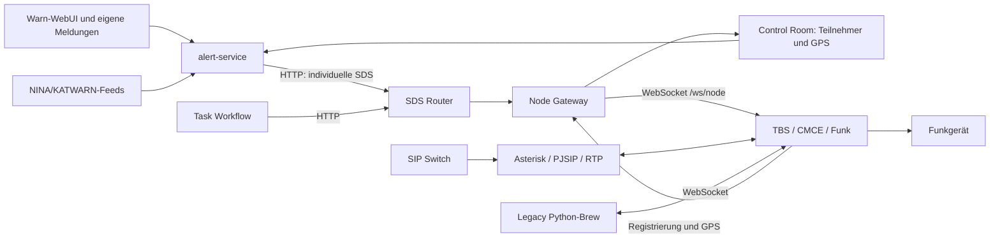
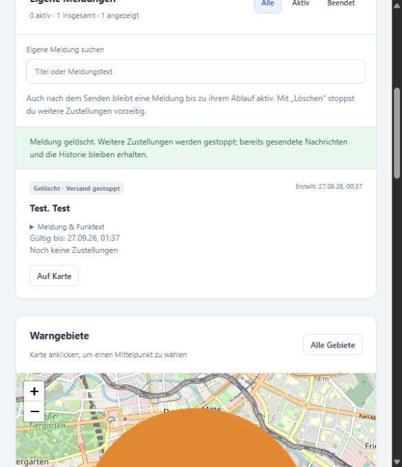

# Brainstorming: TBS-Container aktualisieren: Flottenupdate, KatWarn/NINA-Reparaturen, v1.9.0 und Brancharchiv

**Archivhinweis, 09.10.2026:** Diese Datei dokumentiert das im Titel beziehungsweise Quellenrahmen genannte Gespräch und dessen damalige Entscheidungen. Historische Kommandos, Planungen, Versionsangaben und Fehlerbilder bleiben erhalten; der heutige technische Stand steht in der [Gesamtroadmap](../roadmaps/gesamtroadmap.md) und in den [aktuellen Dienstanleitungen](../services/README.md). Die Archivaufnahme bestätigt keine spätere Implementierung oder Live-Abnahme.

Stand der Repository- und Quellenprüfung: **06.10.2026**. Historische Ergebnisse beziehen sich auf die jeweils genannten Daten und Commits.

## 1. Projektstand, Quellenumfang und Nachweisstufen

| Feld | Wert |
|---|---|
| Historischer Zeitraum | 26.–27.09.2026; Sitzungsbeginn 26.09.2026 17:26 Uhr Europe/Berlin |
| Erstellung dieser Entwicklungsnotizen | **06.10.2026**, Europe/Berlin |
| Repository / Ablagebranch | `JanHG98/netcore-tetra` / ausschließlich **`Archiving`** |
| Geprüfter Archiv-Ausgangsstand | `Archiving@0ca574aae4a06691d1f688e6f664eda96e3a8b0c` |
| Zusätzlich geprüfter Entwicklungsstand | `main@9116c15d645458f99e236712b67a1ad970432791` |
| Historisch ausgerollte Testbasis | `32e0e87d0994107dd007a541df308eae7c691ed2`, damals `katwarn/nina`, mit gezielt reparierter Cargo-Lockdatei und späteren separaten Reparaturen |
| Historischer regulärer Release | `v1.9.0` → `086a81fa8820ef579c475a65a38e3d23644c52f0` |

**Leseregel:** Die Abschnitte 2–9 beschreiben die Arbeit vom September. Abschnitt 10 beschreibt gesondert die Prüfung vom 06.10.2026. Der geprüfte Code ist kein rückwirkender Beleg dafür, dass eine Funktion damals schon auf einem Container lief. Ein erfolgreiches Update ist kein vollständiger Funktionstest.

Die folgenden Begriffe werden ausdrücklich unterschieden:

| Stufe | Bedeutung in diesem Dokument |
|---|---|
| **Idee** | Erörterte Möglichkeit ohne Umsetzungsbeschluss. |
| **Beschlossen/geplant** | Gewünschtes oder als nächster Schritt festgelegtes Verhalten; noch kein Ausführungsbeweis. |
| **Implementiert** | Datei/Code ist vorhanden oder eine Repositoryänderung nachgewiesen. Bei lokalen Hilfsdateien wird das ausdrücklich angegeben. |
| **Getestet** | Konkrete statische Prüfung, lokaler Test, Simulation, CI oder echter HTTP-Test liegt vor; Art und Grenzen werden genannt. |
| **Im Betrieb bestätigt** | Tatsächliche Betreiber-/Geräteausgabe oder ausdrückliche Betreiberbestätigung vorhanden. Umfang der Bestätigung bleibt begrenzt. |
| **Unbestätigt/offen** | Kein ausreichender Nachweis im ausgewerteten Material. |

### 1.1 Zugängliche und ausgewertete Quellen

- Betriebsnotizen, spätere Korrekturen und das ursprüngliche lokale Sitzungsprotokoll liegen unter `C:\Users\janho\.codex\sessions\2026\09\26\rollout-2026-09-26T17-26-00-01a0de52-c038-71c2-b7b0-4bc2da75addd.jsonl`. Die Septemberarbeit und die Prüfung vom Oktober werden getrennt geführt.
- Alle sechs im dokumentierten Arbeitsstand genannten Textanhänge sind zugänglich; Inventar siehe Abschnitt 12.1. Sie enthalten den ersten Updatefehler, den Gesamtlauf, Nachläufe, den Basisstations-Funktest und die Asterisk-Diagnose.
- Die lokalen Verlaufslogs und zugeordneten Skripte unter `C:\Users\janho\NetCore-Updates` wurden geprüft. Neuere Dateien vom 28.09. aus anderer Arbeit werden nicht als Nachweis dieser Arbeitsphase verwendet.
- Lokale Generatoren, Prüfhilfen und Pakete im Projektarbeitsordner sowie `netcore-alert-fix`/`netcore-release` helfen, die tatsächlich erzeugten Reparaturen und Prüfungen zuzuordnen. Ihre bloße Existenz ist kein Nachweis der Remote-Ausführung.
- Git-Refs, aktuelle Dateien, PR #55, GitHub-Releases und die drei zugehörigen historischen CI-Läufe wurden am 06.10.2026 erneut gelesen.
- Ein historischer UI-Screenshot wurde unverändert aus dem Sitzungsprotokoll wiedergewonnen. Das kleine Favicon aus dem Bookmarkexport ist separat als dekoratives Asset eingeordnet; siehe Abschnitt 13.

### 1.2 Quellenlücken

Es fehlt keiner der sechs ausdrücklich referenzierten Textanhänge. Nicht vorhanden ist ein detailliertes finales Betreiberprotokoll für jede der drei zuletzt gelieferten Reparaturen. Die letzte Rückmeldung „sieht so weit gut aus“ und „KatWarn läuft“ ersetzt weder einen Task-Workflow-Readiness-Nachweis noch einen SIP-Telefonietest. Vollständige Proxmox-Inventarisierung, aktuelle Konfigurationsdateien aller Hosts, aktuelle Binary-Hashes, geprüfte Erreichbarkeit und geprüfter Funkbetrieb wurden bei der Quellenprüfung vom 06.10.2026 **nicht** erhoben.

Die Dokumentation übernimmt keine Passwörter, API-Token oder privaten Schlüssel. Vollständige Rohsitzungen und Betriebslogs werden nicht ins öffentliche Git kopiert; relevante Befunde werden mit lokaler Quellenzuordnung dokumentiert. Die lokalen Updatepakete sind hier als historische Artefakte beschrieben, aber nicht als neues Installationspaket veröffentlicht. Der Veröffentlichungsstand der Notizen ist über die Git-Historie nachvollziehbar und von den geprüften Quell-Commits zu unterscheiden.

## 2. Ziel und Ausgangslage

Ziel war eine einheitliche NetCore-Testbasis für TBS und **jeden** Container. Dafür sollten pro Ziel kopierbare Updateblöcke entstehen. Die Ausgangslage war uneinheitlich:

- `katwarn/nina` enthielt den neueren Funk-/SDS-/Warnsystemstand.
- `main` enthielt den neueren separaten Brew-Server sowie Wiki-/Dokumentationsarbeit; seine Git-Historie war gerade neu aufgesetzt worden.
- Windows-CMD, PowerShell und interaktive SSH-Sitzungen wurden gemischt benutzt. Lange mehrzeilige Blöcke ließen sich nicht zuverlässig einfügen.
- Nicht alle Dienstvarianten und IP-Adressen waren anfangs bekannt. Insbesondere Brew und TBS mussten nach ausdrücklichen Standortangaben anders behandelt werden als zuerst angenommen.

Der Auftrag entwickelte sich zu einem vollständigen, interaktiven 29-Ziel-Rollout mit Wiederaufnahme, einem Nachlauf für Fehlerfälle, drei gezielten Funktionsreparaturen, der Integration nach `main`, Release `v1.9.0` sowie Metadaten für historische Archiv-Releases.

„Auf den neuesten Stand“ bedeutete für diesen Entwicklungsstand **NetCore-Anwendungssoftware auf der vereinbarten Testbasis**. Ein pauschales Betriebssystem-, Firmware-, Asterisk-, Mosquitto- oder Piper-Upgrade war damit nicht nachgewiesen und wurde nicht als Ergebnis behauptet.

## 3. Endgültige Entscheidungen und ersetzte Annahmen

| Thema | Endgültige Festlegung | Begründung / Nachweis |
|---|---|---|
| Testbasis vor Release | TBS/Core auf `katwarn/nina`, konkret `32e0e87…`; Änderungen und Konfigurationen sichern | Festgelegt wurde die Funk-/Warn-Testbasis ausdrücklich. Ein beweglicher Branch allein wäre für Wiederholbarkeit zu ungenau. |
| Brew | **Bestehenden Legacy-Python-Brew/TBS-Connect erhalten**, nicht automatisch zum separaten Rust-Brew migrieren | Korrigiert: „Alter Python-TBS-Connect ist das brew“. Die frühere Auswahl „Brew aus main“ beschrieb eine zunächst angenommene andere Installation. |
| TBS | `10.0.1.20`, SSH-Benutzer `jan`, interaktives `sudo`, manuell unter root gestartet | Bestätigt: kein systemd; Verzeichnis `/opt/netcore-tetra`, Start `./target/release/bluestation-bs ./config.toml`. |
| Übrige Systeme | SSH als `root`; Fingerprint und Passwort interaktiv | Benutzer und Schrittfolge waren vorgegeben; keine Passwortspeicherung. |
| Home Assistant | `10.0.1.128` **vom Update ausnehmen** | Ausdrückliche Projektentscheidung. |
| Updatebedienung | Kurze Einstiege bzw. Dateien übertragen und per BAT nacheinander ausführen | Lange Copy/Paste-Blöcke wurden in CMD/SSH beschädigt. |
| Fehlerstrategie | Gesamtlauf zunächst Abbruch + Startnummer; Nachlauf/Restlauf später Fortsetzung mit nächstem Ziel und versionsbezogenem Überspringen erfolgreicher Ziele | Bereits erfolgreiche Updates sollten nicht erneut gebaut werden. |
| Lokale Daten | Konfiguration, Zugangsdaten, Datenbanken, Empfänger-/Versandhistorie, bestehende Python-Brew-Einstellungen erhalten | Aktualisieren ohne Neuinstallation/Zurücksetzen fachlicher Zustände. |
| Eigene Warnungen | Nach Versand auffindbar; Suche und Alle/Aktiv/Beendet; vor Ablauf löschen können | Expliziter Anforderung nach realem Warnversand. Löschen stoppt weitere Zustellungen, nicht bereits empfangene SDS. |
| Release | KatWarn/NINA mit vorhandenem main-Inhalt zusammenführen, geprüften regulären Release erstellen | Betriebsrückmeldung bestätigte funktionierenden Warnbetrieb und autorisierte Merge/Release. |
| Branchhistorie | Vor Löschen Tags an exakten alten Branchspitzen sichern; Archiv-Releases als Pre-Release | Squash-Merge erhält Code, aber nicht dieselbe einzelne Commit-Abstammung. |

**Überholt:** Die anfänglichen TBS-Annahmen systemd/automatisch erkannte Unit und ein anderer Konfigurationspfad sind für diese konkrete TBS nicht maßgeblich. Ebenso ist die zunächst vorgesehene neue Brew-Server-Variante durch die später bestätigte Python-Installation ersetzt. Die zuerst erzeugten 30 Blöcke sind nicht mit den finalen **29 tatsächlichen Updatezielen** gleichzusetzen.

## 4. Architektur, Schnittstellen und historisches Hostinventar

### 4.1 Für die behandelten Fehler maßgebliche Wege



Das Diagramm zeigt die für diese Arbeitsphase relevanten funktionalen Wege, nicht jeden internen Adapter des Gesamtsystems. Warnzustellung hängt von nutzbaren GPS-/Teilnehmerdaten, einer zuständigen erreichbaren TBS und dem SDS-Pfad ab. Die Warnzentrale führt dauerhafte Zuordnungen je Warnung/Gerät; Routerpersistenz und Idempotenz verhindern unbeabsichtigte Wiederholungen. „Von TBS angenommen“ ist dabei keine Empfangs- oder Lesebestätigung des Endgeräts.

Die Flotte besteht aus Rust- und Python-Diensten, HTTP-Verwaltung/Healthchecks, WebSocket-Verbindungen zum Funknetz und einem Asterisk-basierten SIP-Pfad. Der reguläre Installerbestand enthält gemeinsame Netzwerk-/Servicehilfen. Beispieladressen aus dem Open-Lab-Inventory sind nicht automatisch die tatsächlichen Adressen des Betreibers.

### 4.2 Finale Reihenfolge der 29 Updateziele

Die folgende Tabelle stammt aus Standortangaben und dem tatsächlich verwendeten BAT-Lauf. Ports sind **Web-/Managementports**, nicht die SSH-Ports. Alarm Workflow `8270` stammt aus der Dienstkonfiguration; die IP wurde über `hostname -I` bestätigt. Die Angaben sind historisches Inventar, kein aktueller Netzwerkscan.

| Position | Rolle | IP | Web-/Managementport | SSH-Benutzer / Besonderheit |
|---:|---|---|---:|---|
| 1 | Node Gateway | `10.0.1.179` | 8080 | root; `/ws/node` zur TBS |
| 2 | Subscriber Core | `10.0.1.153` | 8100 | root |
| 3 | Mobility Core | `10.0.1.150` | 8090 | root |
| 4 | Group Core | `10.0.1.157` | 8110 | root |
| 5 | Security Core | `10.0.1.149` | 8180 | root |
| 6 | KMF | `10.0.1.180` | 8190 | root |
| 7 | Call Control | `10.0.1.155` | 8120 | root |
| 8 | Media Switch | `10.0.1.159` | 8130 | root |
| 9 | Recorder | `10.0.1.170` | 8140 | root; erster Upload gescheitert, später nachgezogen |
| 10 | SDS Router | `10.0.1.169` | 8150 | root; tatsächliches SDS-Ziel für Task Workflow |
| 11 | Packet Core | `10.0.1.166` | 8160 | root |
| 12 | IP Gateway | `10.0.1.142` | 8170 | root |
| 13 | Transit | `10.0.1.151` | 8200 | root |
| 14 | Application Gateway | `10.0.1.144` | 8220 | root |
| 15 | IoT Gateway | `10.0.1.119` | 8240 | root |
| 16 | Hardware Gateway | `10.0.1.123` | 8250 | root |
| 17 | RF Monitor | `10.0.1.122` | 8260 | root |
| 18 | Alarm Workflow | `10.0.1.121` | 8270 | root |
| 19 | Task Workflow | `10.0.1.120` | 8280 | root; spätere SDS-Konfigurationskorrektur |
| 20 | Asset Management | `10.0.1.124` | 8290 | root |
| 21 | SIP Switch | `10.0.1.125` | 8300 | root; Asterisk getrennt prüfen |
| 22 | Media Library / Piper-Anbindung | `10.0.1.154` | 8230 | root; Speicherproblem |
| 23 | Provisioning Core | `10.0.1.106` | 8125 | root |
| 24 | Control Room | `10.0.1.156` | 9010 | root |
| 25 | Observability | `10.0.1.143` | 8210 | root |
| 26 | Warnzentrale / alert-service | `10.0.1.129` | 8310 | root |
| 27 | Directory | `10.0.1.23` | 8095 | root; vorhandenen Dienst/Python-Pfad erkennen |
| 28 | Legacy-Python-Brew / TBS-Connect | `10.0.1.22` | 8081 | root; `netcore-brew.service`, real `/var/opt/netcore-tetra/server.py` |
| 29 | TBS / SRV-M-TBS-01 | `10.0.1.20` | 8080 (Dashboard laut historischem Zielinventar) | jan → sudo → root; manueller Vordergrundprozess |

Home Assistant `10.0.1.128` mit `/home/overview` war nur Teil des Bookmarkexports und ausdrücklich ausgeschlossen. Die 29 Updateziele sind nicht mit den 26 Backend-Readiness-Prüfungen oder der Zahl der Inventory-Dienste gleichzusetzen; Directory, Brew und TBS sind Sonderrollen.

SSH verwendete Port **22**. Das lokale `NetCore-Ziele.json` enthält die ausführbare Zuordnung. Die Dateinummern der ursprünglichen 30er-Erzeugung blieben teilweise erhalten: Position 27 Directory verwendete `29-directory.sh`, Position 28 Python-Brew `30-tbs-connect.sh`, Position 29 TBS `27-tbs.sh`; für Positionen 1–26 entsprach der Präfix der Laufposition. Dateinummer und Resume-Position daher nicht blind gleichsetzen.

### 4.3 Relevante Pfade und Parameter

| Ort / Parameter | Bedeutung |
|---|---|
| `C:\Users\janho\NetCore-Updates` | Lokaler Windows-Ausgabeordner mit BATs, Shellskripten, Quellpaketen, Anleitungen und Verlaufslogs |
| `/opt/netcore-tetra` | TBS-Checkout und häufiger bestehender Quellpfad; nicht bei allen Sonderdiensten blind voraussetzen |
| `/opt/netcore-update-sources` | Separater Arbeitsbereich der historischen Update-/Nachlaufskripte |
| `/var/backups/netcore-update/`, `/var/lib/netcore-update-state/` | Update-Sicherungen und zustands-/versionsbezogene Erfolgsquittungen |
| `/opt/netcore-tetra/target/release/bluestation-bs` | Im Betrieb bestätigte manuell gestartete TBS-Binary |
| `/opt/netcore-tetra/config.toml` | Im Betrieb bestätigte TBS-Konfiguration |
| `/etc/netcore/<dienst>.toml` | Übliche zentrale Dienstkonfiguration; pro Unit/Startargument prüfen |
| `/etc/netcore/alert-service.toml`, `/etc/netcore/alert-service.env` | Warnkonfiguration und Secret-Umgebung; Inhalte nicht ins Archiv übernehmen |
| `/etc/netcore/lxc-network.env` | Durch gemeinsame Netzwerkinstallation ermittelte LXC-Endpunktdaten |
| `/etc/asterisk/netcore-pjsip.conf`, `netcore-extensions.conf`, `netcore-rtp.conf` | Drei vom SIP Switch erzeugte Includes; Gruppe `asterisk`, Modus `0640` |
| `/var/lib/asterisk/core` | In der Startdiagnose vorhandener Core-Dump, 77.352.960 Bytes; kein ausgewerteter Backtrace im dokumentierten Arbeitsstand |
| `/var/backups/netcore-fixes/` | Sicherungen der drei gezielten Reparaturen einschließlich Metadaten |
| `/root/netcore-nachlauf-<position>.log`, `/root/netcore-restlauf-<position>.log` | Ausführliche Linux-Protokolle der Nach-/Restläufe |
| `/root/netcore-fix-warn.log`, `netcore-fix-task.log`, `netcore-fix-sip.log` | Reparaturprotokolle, deren finale Betriebsausgaben im dokumentierten Arbeitsstand fehlen |
| `CARGO_BUILD_JOBS=1` | RAM-schonender Rust-Build; unnötiges `cargo clean` vermeiden |
| `umask 077` | Restriktiver Updatekontext; war ohne explizite Gruppenleserechte für Asterisk problematisch |

### 4.4 Zum Prüfstand vom 06.10.2026 geprüfte Schnittstellen und Beispielwerte

Die Werte dieses Absatzes sind **Repository-Beispiele/Implementierungsparameter**, keine aus den Betriebshosts ausgelesenen geprüften Einstellungen:

- Warn-Dienst: HTTP `0.0.0.0:8310`; Zugriffsschutz standardmäßig aktiv; SQLite `/var/lib/netcore-alert-service/alerts.sqlite3` mit `WAL`, `synchronous=FULL`, Fremdschlüsseln, Tabellen `alerts`, `aliases`, `deliveries`, `metadata`. `(alert_id, issi)` und ein eindeutiger Idempotenzschlüssel sichern die Gerätezuordnung.
- `system-backend/alert-service/config/alert-service.example.toml`: Control Room `http://control-room:9010`, SDS Router `http://sds-router:8150`, Beispiel-Quell-ISSI `9999`, Poll 5 s, GPS-Alter höchstens 3600 s, Node-Alter 120 s, HTTP-Timeout 10 s. Der tatsächliche historische Funktest benutzte die abweichende Quell-ISSI `4010112`.
- NINA-Basis `https://warnung.bund.de/api31`, Quellen `mowas/katwarn/biwapp/dwd/lhp`, Poll 60 s, veraltete Feed-Daten höchstens 300 s; Versand standardmäßig deaktiviert, TTL 300 s, Textlimit 120. Das belegt die konfigurierte Integration, keine geprüfte Verfügbarkeit externer Feeds.
- Teilnehmer/GPS über Control-Room-GET `/api/subscribers?online=true` und `/api/nodes`; Routerstatus `/api/v1/status`; individuelle SDS Type 4, Protocol-ID **130**, `at_most_once=true`, `force_nodes`, absolute Ablaufzeit, SHA-256-basierter Alert-/ISSI-Key. Für noch rücknehmbare Routeraufträge POST `/api/v1/messages/<id>/cancel`.
- Eigene Warnung löschen: autorisiertes DELETE `/api/v1/alerts/<id>`, bei Erfolg `deleted=true`, `history_preserved=true`; in SQLite Soft Delete mit `removed=1`. Der weitere Versand liest die aktuelle Warnung erneut. Der technische Routerstatus `delivered` wird auf Warnseite als `accepted` eingeordnet und bedeutet hier TBS-Annahme; das ist keine Empfangs- oder Lesebestätigung des Funkgeräts.
- Warnsystem-Unit `netcore-alert-service.service`: Benutzer/Gruppe `netcore-alert`, Programmverzeichnis `/usr/local/lib/netcore-alert-service`, Konfiguration `/etc/netcore/alert-service.toml`, EnvironmentFile `/etc/netcore/alert-service.env`, StateDirectory `/var/lib/netcore-alert-service`, `UMask=0027`, Restart 5 s.
- SIP-Unit `netcore-sip-switch.service`: `/usr/local/bin/netcore-sip-switch --config /etc/netcore/sip-switch.toml`, root, nach/mit `asterisk.service`, Restart 2 s. AGI-Pfad `/var/lib/asterisk/agi-bin/netcore-sip-route.py`; Renderdefaults SIP-Bind `0.0.0.0:5060`, RTP **10000–20000**. Die Managementoberfläche auf 8300 ist kein SIP-Port.
- Task-Unit `netcore-task-workflow.service`: `/usr/local/bin/netcore-task-workflow --config /etc/netcore/task-workflow.toml`, root, Restart 2 s, Zustand/Events/Audit unter `/var/lib/netcore-task-workflow`. Beispiel-MQTT `localhost:1883`, Topicpräfix `netcore/v1`; Dependency-Poll 5 s, Router-Health-Timeout 2 s. `/health/ready` berücksichtigt eingeschaltete MQTT- und SDS-Abhängigkeiten; nur das SDS-Ziel zu reparieren garantiert nicht jede weitere Abhängigkeit.

Diese Defaults erklären Zuständigkeiten und Fehlersuche. Geheimnisse aus Environment-Dateien oder der bestehenden Brew-Konfiguration wurden nicht übernommen.

## 5. Updateabläufe, Fehlerentwicklung und funktionierende Lösungen

### 5.1 Erster Block: Cargo-Lockdatei und tatsächliche Buildprüfung

Der erste ausgelieferte Block scheiterte im ersten Betriebsversuch bereits am Node Gateway. Die erste Prüfung der Blöcke hatte Bash-/eingebettete-Python-Syntax und ausgewählte Fehlerpfade abgedeckt, aber keinen tatsächlichen Linux-Gesamtbuild. Der anschließend gemeldete Cargo-Fehler wurde lokal reproduziert.

Die Root-`Cargo.lock` passte nicht vollständig zum Workspace: unter anderem fehlten IoT-Gateway-Abhängigkeiten sowie Feature-Abhängigkeiten von `chrono`/`uuid`. Die Korrektur ergänzte die Lockstruktur **ohne Crate-Versionsanhebung**. 21 betroffene Helper wurden konsistent korrigiert; unbekannte lokal veränderte Lockdateien wurden nicht blind ersetzt. `cargo metadata --locked` wurde für Linux x86_64 und ARM64 sowie die separate Brew-Lockdatei geprüft. Alle 30 damaligen Shellblöcke wurden syntaktisch geprüft.

Historische SHA-256 der ursprünglichen Lockdatei: `a26cbb99a4d488e6bd6737e0eb87b1dd0fc5d831f3c060ba5f3efe753fdd2c83`; reparierte Fassung: `003e6daaaf2ca6e81f577427f2ad9663b8be7dd911e151de4f21456cc374a179`. Lockprüfung und Build sollten vor dem Dienststopp erfolgen. Alte angehängte Journalzeilen wurden nicht als Ursache des neuen Cargo-Abbruchs ausgegeben.

**Ergebnis:** Lokal reproduzierter Fehler und gezielte Reparatur; später erfolgreiche echte Betreiberbuilds und Linux-CI. Eine reine Cargo-Metadatenprüfung wurde nicht als vollständiger Build gewertet. Der endgültige Lockfix ist in PR #55 / v1.9.0 enthalten.

### 5.2 Lange Shellblöcke, CMD/PowerShell und interaktives SSH

Im Betriebsprotokoll dokumentiert sind beschädigte Blöcke beim Einfügen in SSH aus CMD. Daraufhin wurden kürzere Einstiege und einzelne `.sh`-Dateien zum Übertragen erstellt. Ein weiterer Fehler entstand durch CMD-Syntax in PowerShell:

```text
scp "%USERPROFILE%\NetCore-Updates\01-node-gateway.sh" ...
stat local "%USERPROFILE%/...": No such file or directory
```

`%USERPROFILE%` wird in CMD expandiert, in PowerShell verwendet man `$env:USERPROFILE`. Ebenso gehört kein Backslash vor das `@` in `root@10.0.1.179`. Danach wurde eine BAT vorgesehen, die die Container nacheinander kontaktiert und die interaktiven Fingerprint-/Passwortabfragen jeweils abwartet. Die noch fehlenden IPs und der TBS-Benutzer wurden vor Fertigstellung erfragt.

Der finale BAT-Einstieg verwendete für jedes Ziel einen Upload und einen separaten SSH-Aufruf; TBS erhielt einen eigenen Startschritt. Ein lokaler Test im echten CMD-Interpreter durchlief 29 Ziele mit **59 sequentiellen SCP-/SSH-Aufrufen als Attrappen**. Fehlerabbruch, Wiederaufnahme, ungültige Startnummer und fehlende Dateien wurden geprüft. Das testete die Windows-Steuerung, nicht die Live-Erreichbarkeit.

### 5.3 Gesamtlauf, Nachlauf und Restlauf

| Zeitpunkt / Stufe | Tatsächlich belegtes Ergebnis |
|---|---|
| 26.09. 18:42–19:24, Positionen 1–8 | Erfolgreiche Software-Updates laut `NetCore-Update-Verlauf.log` |
| Position 9 Recorder | Zwei Uploadfehler `Exit=255`; Fortsetzung erfolgte ausdrücklich mit Position 10 fort |
| Positionen 10–20 | Erfolgreiche Updates; Task Workflow „OK“ bedeutete noch keine erreichbare SDS-Abhängigkeit |
| Position 21 SIP Switch | Ebenfalls Upload `Exit=255`, später nachgezogen |
| Position 22 Media Library | Erst zwei Updatefehler `Exit=128`, später zusätzlich Upload-/Schreibfehler bei vollem Dateisystem |
| Positionen 23–26 | Provisioning, Control Room, Observability und Warnzentrale erfolgreich aktualisiert |
| Positionen 27–28 | Directory und Legacy-Brew scheiterten vor Dienstersatz an Sicherungs-/Pfadproblemen |
| Position 29 TBS | Update um 21:04:13 erfolgreich; erster anschließender Vordergrund-/SSH-Lauf endete um 21:07:56 mit `Exit=255` |
| Nachlauf 26.09. 21:51/21:52 | Recorder und SIP-Software erfolgreich aktualisiert; Asterisk-Funktionsproblem blieb bestehen |
| Nachlauf 27.09. 00:07:05 | Media Library nach Plattenvergrößerung erfolgreich aktualisiert |
| Restlauf 27.09. 00:13:14 / 00:14:00 | Directory und Python-Brew erfolgreich aktualisiert |

Alle Zeiten dieser Tabelle sind die lokalen Windows-Protokollzeiten in Europe/Berlin. Linuxausgaben mit `+00:00` liegen in UTC und dürfen nicht ohne Umrechnung daneben sortiert werden.

**Gesamtergebnis:** Die drei Verläufe belegen zusammen **29/29 erfolgreiche Software-Updates**. Die spätere HTTP-Prüfung gegen 26 Backend-Endpunkte ergab jedoch **24/26 bereit**, Task Workflow und SIP Switch meldeten `503`. Damit war der Rollout als Softwareaktion abgeschlossen, die fachliche Betriebsbereitschaft aber noch nicht vollständig.

Der Nachlauf bearbeitete nur die ausstehenden Rollen 9, 21, 22, 27 und 28. Ein geprüftes lokales Paket `NetCore-Quellen-32e0e87.tar.gz` ersetzte die erneute Abhängigkeit vom Git-Download auf jedem Ziel. Archivinhalt, Pfade, SHA-Prüfung und Commitprovenienz wurden vor Nutzung geprüft. Die späteren Restläufe bearbeiteten Directory/Brew und erkannten den bereits vorhandenen Erfolg der Media Library, statt diese unnötig neu zu bauen. `NetCore-Nachlauf.bat` leitete zuletzt auf den korrigierten Restlauf weiter.

Media Library hatte vorher Git-Transportfehler `Broken pipe`, `curl 56 Recv failure: Connection reset by peer`, `early EOF` und `invalid index-pack output` gezeigt. Das Quellpaket war **39.981.229 Bytes** groß, SHA-256 `5edb6b5db8dbb94a2dee8d57a479a46641610b6c1225396c8f0061a55fded49a`. Es enthielt einen Git-Objektexport und eine minimale echte `.git`-Basis für die Build-Provenienz, aber keine übernommenen lokalen Hooks/Credentials/Remotes/Reflogs. Entpacker prüften erlaubte Pfade und Dateitypen. „Lokales Quellpaket“ bedeutet nicht vollständigen Offlinebuild: Cargo kann weiterhin Netz für Abhängigkeiten benötigen.

Bei Recorder/SIP meldete der ursprüngliche Upload `Connection closed by ... port 22`; die genaue serverseitige SSH-Ursache ist nicht belegt. Der später erfolgreiche Nachlauf ersetzt diese fehlende Ursachenanalyse nicht.

### 5.4 Media Library: Speicher statt Inodes

Die am Zielsystem ausgeführten `df`-Prüfungen zeigten:

- Root-Dateisystem `VirtualMachines_OSData/subvol-138-disk-0`: **10 GiB**, praktisch voll, nur **30 MiB** verfügbar, Anzeige **100 %**.
- Inodes: **68 %** genutzt, also kein akuter Inodemangel.
- `/tmp` lag auf einem separaten, leeren **40-GiB-tmpfs**; freier RAM-/tmpfs-Platz beseitigte den Engpass auf `/` nicht.
- `du`: `/var/log` **7,5 GiB**, `/var` **8,0 GiB**, `/opt` ca. **380 MiB**, `/root` ca. **891 MiB**. Die Medien-/Programmverzeichnisse waren nicht der Hauptverbraucher.

Die Abhilfe war die Vergrößerung des Volumes; danach gelang das Update. Es wurde kein pauschales Löschen von Medien, Datenbanken oder Logverzeichnissen als durchgeführte Lösung ausgegeben.

Die korrigierte Vorprüfung lief vor dem großen Upload direkt über SSH und brauchte keine erst hochzuladende Skriptdatei auf dem vollen Ziel. Für den Rust-Build verlangte sie vorsorglich 4 GiB frei auf `/opt`, 512 MiB auf `/root`, 256 MiB auf `/var` und prüfte auch Inodes. Auf derselben Partition sind diese Schwellen **nicht zu addieren**; maßgeblich ist die größte. Das sind Vorprüfwerte, keine gemessene garantierte Buildgröße.

Für Directory/Brew galten `/root` 256 MiB, `/opt` 256 MiB, `/var` 64 MiB; mindestens 5000 freie Inodes waren vorgesehen. Bei Unterschreitung: Exit 28 vor dem Upload. Der historische Transport war `ssh ... "bash -s -- SYSTEM" < NetCore-Speicherpruefung.sh` aus CMD; die Platzprüfung, der Upload und die Ausführung erklären drei mögliche interaktive SSH-Anmeldungen je Restlaufziel.

**Offen:** Ursache des starken `/var/log`-Wachstums, Rotation und Journald-Limits sind nicht abschließend geklärt. Die Plattenvergrößerung behob den akuten Engpass, nicht nachweislich seine Ursache.

### 5.5 Directory und Legacy-Brew: Sicherung vor dem Austausch

Beide Nachläufe meldeten:

```text
cp: 'etc/systemd/system': No such file or directory
Vor dem Austausch abgebrochen; vorhandener Dienst unverändert.
```

Der fehlerhafte Sicherungsweg mit `cp --parents` scheiterte beim Aufbau der Ziel-Elternpfade. Die korrigierte Sicherungsfunktion legte Elternverzeichnisse ausdrücklich an und kopierte Dateien mit Metadaten. Fehlende Quellen, Rechte und Fehler beim Kopieren wurden gezielt geprüft. Ein Erfolg durfte erst nach vollständig gelungener Sicherung zum Ersetzen führen. Das war ein Fehler der erzeugten Updatehilfe, kein Nachweis einer fehlenden gesamten systemd-Installation.

Für Brew wurde die reale Unit `netcore-brew.service` und das reale Skript `/var/opt/netcore-tetra/server.py` ermittelt. Der Dienst blieb die vorhandene Python-Variante mit ihren lokalen Einstellungen. Die Folgeausgabe und der Restlauf belegen den erfolgreichen Abschluss beider Updates um 00:13 bzw. 00:14 Uhr am 27.09.

Directory verwendete `netcore-directory.service`, installiertes Skript `/opt/netcore-directory/netcore_directory_server.py`, Repositoryquelle `system-backend/directory/netcore-directory.py`; `/api/health` meldete danach `ok:true`, Version `0.2.0`. Brew-Quelle war `system-backend/tbs-connect/server.py`. Erhalten wurden die vorhandenen Konfigurationsfelder `LISTEN_HOST`, `LISTEN_PORT`, `REALM`, `ADMIN_USER`, `ADMIN_PASS`, `NODES_FILE`, `FERNET_KEY`, ohne deren vertrauliche Werte in die Dokumentation zu übernehmen. Die Helfer werteten Unit-/WorkingDirectory-/ExecStart-Pfade aus und verwendeten für diese Sonderfälle Python-Standardbibliothek, ohne zwingend `curl`, `tomllib` oder einen Git-Download vorauszusetzen. Eine Datei-/Metadatensicherung ist kein vollständiger Datenbank- oder Volume-Snapshot.

### 5.6 TBS ohne systemd

Die TBS wurde weiterhin manuell gestartet als root in `/opt/netcore-tetra` mit `./config.toml`. Ein vorhandener generischer `install/update-basisstation.sh` für systemd ist deshalb nicht automatisch das richtige Betriebsverfahren für diesen Host. Die BAT musste über `jan` anmelden, ein Terminal für `sudo` bereitstellen und den bisherigen Start beibehalten.

`TBS-Starten.bat` sollte einen Start ohne erneuten Build ermöglichen. Das Vordergrundfenster muss für diesen Betriebsmodus offen bleiben. Der erste `Exit=255` nach dem erfolgreichen TBS-Update belegt nur das Ende/Problem der SSH-Sitzung; der spätere Betriebslog belegt einen erneut laufenden Funkbetrieb. Eine Umstellung auf systemd wurde für diesen Entwicklungsstand nicht als endgültige Projektentscheidung umgesetzt.

Der historische TBS-Updatehelfer baute `cargo build --release --locked -p bluestation-bs` mit `CARGO_BUILD_JOBS=1` und prüfte `media_library_top_level_section_parses` sowie `media_library_unknown_field_is_rejected`. Obsolete lokale TTS-Einträge wurden mit `install/remove-local-tts-config.py` aus einer zuvor gesicherten Konfigurationskopie entfernt; „Konfiguration erhalten“ bedeutet hier nicht bytegleiche Unverändertheit aller überholten Felder. Beim Stoppen wurde nur die passende `/proc/*/exe`-Instanz adressiert: SIGINT mit 20 s, danach SIGTERM mit 10 s, kein SIGKILL; bei weiterlaufendem Prozess Abbruch vor Austausch. Der spätere Starthelfer prüfte, ob bereits eine TBS lief.

Davon getrennt bleibt der geprüfte generische systemd-Updater: Er verlangt eine erkannte Unit und hat eigene Konfigurations-/TTS-Defaults. Die Warninstallationsanleitung setzt für diesen Servicepfad `MIGRATE_LOCAL_TTS_CONFIG=0 DISABLE_LOCAL_PIPER=0`, um vorhandene TTS/Piper-Einstellungen zu bewahren, und dokumentiert für die manuelle TBS einen separaten Build-/Binarytausch. Alte BAT-Sonderlogik und geprüfte generische Anleitung nicht ungeprüft vermischen.

## 6. Eigene Warnmeldungen: realer Versand, Auffindbarkeit und frühes Löschen

### 6.1 Im Betrieb bestätigter Ausgangstest

Im Betriebsprotokoll dokumentiert ist ausdrücklich, dass die Aussendung einer eigenen Meldung funktioniert. Im beigefügten TBS-Log ist die Test-SDS `EIGEN: Test. Test` von `4010112` an ISSI `5102` mit **168 Bit** Nutzdaten sowie anschließend `U-STATUS MessageReceived` mit Referenz `1` und zentraler Weitergabe nachvollziehbar. Das ist ein konkreter On-Air-/Empfangsbeleg für diesen Testfall, keine Abnahme jeder Warnquelle oder aller Endgeräte.

Das Log zeigt außerdem `ws://10.0.1.22:8081` für Brew und `ws://10.0.1.179:8080/ws/node` für Node Gateway, den Übergang aus anfänglichem Degraded/Recovering in Online sowie Dual-Carrier-Kanäle **720/721**. Startmeldungen über RX-Overrun/TX-Late bleiben Diagnosehinweise; der erfolgreiche einzelne Warnversand beweist keinen störungsfreien RF-Dauerlauf.

Für eine spätere Reproduktion wichtige historische Parameter aus genau diesem TBS-Log:

| Parameter | Beobachteter Wert / Einordnung |
|---|---|
| Versionsbanner | `v1.3.0-32e0e87d`; Cargo-Paketversion und Git-Commit zusammen lesen, nicht allein `1.3.0` als fehlgeschlagenes Update deuten |
| Plattform | Linux aarch64, Pi-Kernel `6.18.39+rpt-rpi-2712` |
| SDR | SXceiver, Hardware 1.2, SoapySX-Commitpräfix `9705147`, Clock 38,4 MHz, Samplerate 600 kHz |
| Carrier | 720/721; DL 418,000/418,025 MHz, UL 408,000/408,025 MHz |
| Centerfrequenzen | RX 408,0125 MHz, TX 418,0125 MHz |
| Netzkennung | MCC 901, MNC 1510, Colour Code 1, LA 1 |
| Gateway-Subprotokoll | `netcore-control-room-node-v1` |
| SNDCP | Interface `ntetra0`, Netz `10.0.0.0/24`, NAT/Masquerade |
| Medien | `/var/lib/netcore/recordings`, `/var/lib/netcore/audio`, Cache `/var/cache/netcore/audio`, NFS `/mnt/nfs-share` |
| Timing | RF-Vorlauf 720 ms, Group-Release-Guard 6 s |

Die betreffenden Logzeilen 449–477 zeigen den Downlink um `00:17:06.665` und den Empfangsreport um `00:17:06.949` in der im Log verwendeten Uhrzeit. Das sind aufgezeichnete Konfigurations-/Testwerte, keine neuen Frequenzvorgaben. Auch ALSA-/Audiogerätewarnungen stehen im Log; Audio-, Speicher- und RF-Dauerabnahme bleiben gesondert.

### 6.2 Ursache des vermeintlichen Verschwindens

Die gemeinsame Warnliste war nach Aktualisierung sortiert. Wiederholte NINA-Abrufe konnten eigene Meldungen nach unten verdrängen, obwohl deren Laufzeit noch nicht abgelaufen war. Die Meldungen ließen sich deshalb nicht zuverlässig wiederfinden oder löschen. Es lag kein ausreichender Beleg vor, dass die Meldung selbst aus der persistenten Datenbank verschwunden war.

### 6.3 Implementierte Lösung und Semantik

- Eigener Bereich **Eigene Meldungen**, unabhängig von der gemeinsamen Feed-Reihenfolge.
- Stabile Sortierung nach Erstellung, Suchfeld und Filter **Alle / Aktiv / Beendet**.
- Eigene gesendete Meldungen bleiben auffindbar und können schon vor Ablauf über **Löschen → Jetzt löschen** beendet werden.
- Gelöschte Meldungen bleiben als **Gelöscht · Versand gestoppt** nachvollziehbar; bisherige Empfänger-/Zustellhistorie bleibt bestehen.
- Bereits empfangene SDS auf Funkgeräten werden nicht zurückgerufen. Es wird durch diese Aktion keine zusätzliche Entwarnungs-SDS erzeugt.
- Ein verspäteter älterer Statusabruf darf eine gerade angelegte oder gelöschte Meldung nicht wieder mit altem UI-Zustand überschreiben; die Versions-/Reihenfolgeprüfung wurde ergänzt.

Die gezielte Vor-Ort-Reparatur betraf die drei statischen Webdateien `index.html`, `app.js`, `style.css`, erforderte keinen Dienstneustart und änderte weder Warn-Datenbank noch Token. Danach war ein hartes Neuladen der UI mit Strg+F5 vorgesehen. API-/Persistenzverhalten und der vorhandene Löschpfad wurden mitgeprüft.

**Status:** Implementiert, lokal/browserseitig getestet, in Linux-CI abgedeckt und später mit PR #55 in v1.9.0 integriert. Die allgemeine positive Betriebsrückmeldung am Ende ist vorhanden; ein detailliertes Remote-UI-Abnahmeprotokoll nach Ausführung der Reparatur fehlt. Der archivierte Screenshot zeigt den **lokalen** Test, nicht die produktive Warnzentrale.

## 7. Task Workflow und SIP/Asterisk: Diagnose und gezielte Reparaturen

### 7.1 Task Workflow: falsches SDS-Ziel

Die erste Diagnose ergab `sds_router.enabled = true`, aber als Ziel **`http://127.0.0.1:8150`**. Dort war auf dem Task-Workflow-Container kein SDS Router erreichbar. Der tatsächliche Router **`http://10.0.1.169:8150`** antwortete mit HTTP 200 und `status: live`. Proxy-Variablen im Dienst waren nicht gesetzt.

Zusätzlich war die zunächst abgefragte lokale Readiness-Adresse irreführend, wenn der Dienst an die Container-IP statt an Loopback gebunden war. Die Diagnose wurde deshalb auf die konfigurierte Serveradresse umgestellt und gab bei fehlender Bereitschaft anschließend auch einen Fehlercode zurück. Das frühere Diagnose-`Exit 0` bestätigte nur das erfolgreiche Auslesen, nicht den Dienstzustand.

Die Reparatur änderte gezielt `[sds_router].base_url` von Loopback auf `.169`, erhielt andere Werte und Kommentare, prüfte den Router vorher, startete Task Workflow neu und prüfte anschließend dessen konfigurierte `/health/ready`-Adresse. Ein unbekanntes vorheriges SDS-Ziel wurde nicht ungefragt überschrieben.

**Status:** Lokales Reparaturpaket implementiert und getestet. Kein detaillierter nachfolgender Betreiber-Readiness-Beleg für diesen Entwicklungsstand. Die IP `.169` ist eine **installationsspezifische Konfiguration**, keine globale Repositoryvorgabe; die Beispielkonfiguration hat weiterhin Loopback.

### 7.2 SIP/Asterisk: von Statusdiagnose bis zum reproduzierbaren Rechtefehler

Die Diagnose des SIP Switch ergab Asterisk aktiviert, `/usr/sbin/asterisk` vorhanden, CLI-Aufruf fehlgeschlagen und keinen erreichbaren Asterisk-Control-Socket. `systemctl`/Journal belegten SIGSEGV, eine Restart-Schleife bis Zähler **172** und Startbegrenzung. Installiert war **Asterisk `22.2.0~dfsg+~cs6.15.60671435-2`**, Debian-Paketversion `1:22.2.0~dfsg+~cs6.15.60671435-2`.

`coredumpctl` war nicht installiert; zunächst lagen keine auswertbaren gespeicherten Meldungen vor. Eine ausdrücklich begrenzte Vordergrunddiagnose startete Asterisk einmal für höchstens **20 Sekunden**, nur wenn nicht schon ein Prozess lief, und änderte keine Konfiguration. Sie zeigte unmittelbar vor `Exit 139`:

```text
Parsing '/etc/asterisk/netcore-pjsip.conf': Not found (Permission denied)
The file 'netcore-pjsip.conf' was listed as a #include but it does not exist.
```

`Exit 139` entspricht SIGSEGV; `Exit 124` wäre das Zeitlimit gewesen. Die Meldung „does not exist“ war hier durch den unmittelbar davor gemeldeten fehlenden Zugriff zu relativieren. LDAP-/curl-Konfigurationshinweise und ein nicht zugängliches Startverzeichnis erschienen ebenfalls, sind aber nicht als bewiesene Absturzursache zu behandeln.

Der alte Renderer schrieb temporäre Includes ohne explizite Gruppenleserechte. Unter der restriktiven root-`umask 077` des Updatekontexts entstanden für den Benutzer `asterisk` unlesbare Dateien. Die Reparatur adressierte diesen konkret nachgewiesenen Fehler:

1. Dateien sichern und den dauerhaft korrigierten Renderer installieren: temporäre Datei im Zielverzeichnis, schreiben/flushen, `fchown` auf Asterisk-Gruppe als root, `fchmod(0640)`, `fsync`, atomarer `os.replace`; temporäre Reste auch im Fehlerfall entfernen.
2. Bestehende NetCore-Includes auf Gruppe `asterisk`, Modus **`0640`** setzen und ihre Lesbarkeit ausdrücklich als Benutzer `asterisk` prüfen.
3. Mit `systemctl reset-failed asterisk.service` die Startbegrenzung zurücksetzen und Asterisk starten.
4. Mit dem korrigierten Renderer erneut unter `umask 077` rendern, erneut die Lesbarkeit als `asterisk` prüfen und `asterisk -rx 'core reload'` ausführen.
5. `netcore-sip-switch.service` neu starten; Asterisk wiederholt auf Aktivität/CLI und den SIP-Status prüfen.
6. Bei Fehlern die gesicherten Dateien wiederherstellen; Asterisk nach fehlgeschlagener Reparatur gestoppt lassen, um keine weitere Absturzschleife auszulösen.

**Beweisgrenze:** Der Rechtefehler ist durch Log, Code und Regressionstest belegt. Ein symbolisierter Core-Backtrace, der die interne SIGSEGV-Ursache abschließend beweist, fehlt. Die Befunde bestätigen keine vollständige PBX-/TBS-Anmelde- oder bidirektionale Sprach-/RTP-Abnahme.

### 7.3 Gemeinsames Reparaturpaket und Schutz lokaler Zustände

`NetCore-Drei-Korrekturen.bat` führte nacheinander Warn-UI, Task Workflow und SIP aus. Einzelaufrufe waren `Warn-UI-Reparieren.bat`, `Task-Workflow-Reparieren.bat`, `SIP-Switch-Reparieren.bat`. Zu jedem Ziel gehörten Upload und Ausführung mit interaktiver Anmeldung. Nach einem Fehler sollten andere Ziele weiterhin bearbeitet werden; der Gesamtfehlerstatus blieb erhalten.

Das kleine Paket `NetCore-Korrekturen-2026-09-27.tar.gz` und eine Datei-Hashprüfung akzeptierten nur den bekannten vorherigen Programmstand `32e0e87…` oder dieselbe bereits angewendete Korrektur. Unbekannte lokale Programmänderungen wurden abgelehnt. Backups lagen unter `/var/backups/netcore-fixes/`; ein Fehler nach dem Austausch löste Rollback aus. Die ZIP `NetCore-Drei-Korrekturen.zip` enthielt Sammel-/Einzelstarter und Anleitung.

**Wichtig für eine Fortsetzung:** Ein erneutes Ausrollen des alten großen Quellpakets `32e0e87` kann diese späteren Programmkorrekturen wieder ersetzen. Nach Releaseintegration wurde deshalb `main` bzw. für den damaligen geprüften Stand `v1.9.0` empfohlen. Die alten Patch-BATs sind keine universelle Aktualisierung eines beliebigen geprüften Checkouts.

## 8. Tatsächlich verwendete und nur vorbereitete Befehle

Die folgenden Beispiele dokumentieren den historischen Ablauf. Sie sind keine Aufforderung, im Rahmen dieser Archivierung erneut Dienste zu ändern.

### 8.1 Windows-Einstiege

**Tatsächlich am Zielsystem ausgeführt:** Gesamt-BAT, Wiederaufnahme über Startpositionen, Nachlauf und Restlauf. Der Einstieg in CMD war:

```cmd
cd /d "%USERPROFILE%\NetCore-Updates"
NetCore-Alle-Updates.bat
```

Die Wiederaufnahme erfolgte über die Startpositionsauswahl, unter anderem ab 9/10, 21/22/23, 27/28/29. Ein willkürlich angenommener Kommandozeilenparameter ist hier nicht vorausgesetzt.

**Geliefert und lokal getestet; finale Remote-Einzelausgaben fehlen:**

```cmd
cd /d "%USERPROFILE%\NetCore-Updates"
NetCore-Drei-Korrekturen.bat
```

**Korrigierte Syntax, als Transferbeispiel:**

```powershell
scp "$env:USERPROFILE\NetCore-Updates\01-node-gateway.sh" root@10.0.1.179:nc-update.sh
```

```cmd
scp "%USERPROFILE%\NetCore-Updates\01-node-gateway.sh" root@10.0.1.179:nc-update.sh
```

### 8.2 Tatsächlich durch den Betreiber ausgeführte Speicherdiagnosen

```cmd
ssh root@10.0.1.154 "df -h / /root /opt /var /tmp; df -i / /root /opt /var /tmp"
ssh root@10.0.1.154 "du -xhd1 /opt /root /var 2>/dev/null"
```

Diese Befehle waren lesend. Ihre Ergebnisse begründeten die anschließende durchgeführte Plattenvergrößerung.

### 8.3 Im Betrieb bestätigter manueller TBS-Start

```text
SSH-Anmeldung: jan@10.0.1.20
Rechtewechsel: sudo -i
```

```bash
cd /opt/netcore-tetra
./target/release/bluestation-bs ./config.toml
```

Dieser Betriebsweg ist ausdrücklich bestätigt; später wurde ein tatsächliches Funklog dokumentiert. Ein fortbestehender systemd-Autostart wird daraus nicht abgeleitet.

### 8.4 Diagnosehelfer und Releasecheckout

`SIP-Switch-Pruefen.bat`, `Task-Workflow-Pruefen.bat`, `SIP-Absturz-Pruefen.bat` und `SIP-Startdiagnose.bat` wurden durch den Betreiber ausgeführt; die Ausgaben sind im dokumentierten Arbeitsstand. Die Startdiagnose war die einzige dieser Diagnosestufen mit bewusstem begrenztem Asterisk-Startversuch. `TBS-Starten.bat` wurde als separater Startweg ohne Neubau geliefert.

**Nach dem Release dokumentiert, kein dadurch belegter weiterer Flottenrollout:**

```bash
git clone --branch v1.9.0 --single-branch https://github.com/JanHG98/netcore-tetra.git netcore-tetra-v1.9.0
```

Bei alten Checkouts wurde ein explizites `git fetch origin main:refs/remotes/origin/main` und danach `git switch --detach origin/main` statt eines blinden `git pull` über die neu aufgebaute Historie beschrieben. Lokale Änderungen/Konfigurationen müssen dabei vorher zugeordnet und gesichert sein. Dieser Prüfdurchlauf vom 06.10.2026 führte diese Befehle auf keinem Betriebshost aus.

## 9. Tests, Releaseintegration und historisches Brancharchiv

### 9.1 Nachgewiesene Prüfungen mit Grenzen

| Prüfung | Belegtes Ergebnis | Grenze |
|---|---|---|
| Ursprüngliche Updateblöcke | Syntax, eingebettetes Python, ausgewählte Health-/Rollbackpfade geprüft | Kein vollständiger Linux-Build; erster realer Cargo-Fehler kam danach |
| Lockdatei-Reparatur | Originalfehler reproduziert; 21 Helper konsistent; locked-Metadaten für x86_64/ARM64; keine Paketversionsänderung; unbekannter Hash abgelehnt | Metadatenprüfung allein ist kein Build |
| 29-Ziel-BAT | Echter CMD-Interpreter, 59 sequentielle SSH/SCP-Attrappen; Reihenfolge, Abbruch, Resume, falsche Startnummer, fehlende Dateien | Keine echte SSH-Installation durch diese Tests |
| Nach-/Restlauf | Quellpaket-/Pfad-/Commitprüfung, Fehlerfortsetzung, Erfolgsauslassung, Backupeltern/Rechte, Speicher-/Inodeabbruch | Zielsystemerfolg separat aus Betreiberlogs |
| Reparaturtests | 5 gezielte Tests: atomarer Writer, konfigurierte Healthadresse, Rollback nach mittlerem Schreibfehler, Versionsschutz, SDS-Konfigurationsänderung ohne Verlust anderer Werte/Kommentare | Lokale Testdaten |
| Warn-Dienst | 76 Python-Tests | Automatisierte Szenarien, keine allgemeine Funkabnahme |
| Warn-UI | 10 Node/UI-Tests und Browserlauf für Erstellung/Wiederfinden/vorzeitiges Löschen | Lokale Fixture `127.0.0.1:18765`; keine Funk-SDS ausgesendet |
| Asterisk-Dateirechte | 3 Tests in Linux-CI erfolgreich, darunter echte Unix-Modi/Gruppe unter umask 077 | Unter Windows lokal nur 1 ausgeführt, 2 Unix-Tests übersprungen |
| SIP-Regressionsskripte lokal | Windows-Ausführung scheiterte am Unix-Modul `fcntl` | Nicht als bestandener lokaler Test zählen; Linux-CI maßgeblich |
| SDS Router / Call Control / Control Room | CI: 22 / 5 / 8 Rust-Tests | Prüft Softwareverhalten; keine vollständige Anlagenabnahme |
| Warn-/Router-HTTP-Integration | Reale Loopback-HTTP-Dienste; Replay/Konflikt, absolute Deadline, Cancellation, zwei Neustarts, persistente Tombstones, kurze SDS/Status | Kein realer Gateway-/Funkgeräteversand |
| Control-Room-HTTP-Integration | Gateway-Snapshot, Registrierung/GPS, zuständige TBS, Relogin ohne Duplikat, Disconnect blockiert Versand | Simulierter Gateway-/Teilnehmerkontext |
| TBS-SDS und Radio-CI | 4 zentrale SDS-Handler-Tests, TBS-Debugbuild; Funk-/SIP-/Scheduler-Regressionen und Releasebuild | Kein vollständiger RF-/Handover-/Dauerlastnachweis |
| Reale Flotte | 29 Updateerfolge; anschließend 24/26 Backend-Endpunkte bereit | Noch offene Task-/SIP-Abhängigkeiten |
| Reales Funkgerät | Eigene Testwarnung ausgesendet, `MessageReceived` im TBS-Log; Betriebsrückmeldung bestätigt Funktion | Ein konkreter Test, nicht alle Geräte/Funkfälle |

Die Prüfzahlen stammen aus historischen Testausgaben und CI-Belegen. Am 06.10. wurden CI-Metadaten und Code erneut gelesen; die komplette September-Testserie wurde für diesen reinen Dokumentationsauftrag nicht neu ausgeführt.

### 9.2 Sechs erfolgreiche Linux-CI-Jobs

Alle folgenden Jobs gehören zum geprüften PR-Head `b4667e09a48e4ee66cd3166e29298b8a510f7c09`; ihr Ergebnis `completed/success` wurde am 06.10.2026 erneut über GitHub bestätigt:

| Workflow / Link | Run-ID | Erfolgreiche Jobs |
|---|---:|---|
| [Warning service](https://github.com/JanHG98/netcore-tetra/actions/runs/36277876092) | 36277876092 | `warnings`, `tbs-sds` |
| [Radio traffic regression tests](https://github.com/JanHG98/netcore-tetra/actions/runs/36277876095) | 36277876095 | `slotter` |
| [Asterisk installer tests](https://github.com/JanHG98/netcore-tetra/actions/runs/36277876177) | 36277876177 | `selection`, `trixie-source (ubuntu-24.04)`, `trixie-source (ubuntu-24.04-arm)` |

Die Trixie-Tests prüften Installerwahl, Wiederverwendung einer installierten Binary/Erhalt lokaler Konfiguration sowie Asterisk/PJSIP-Start in den CI-Containern. Sie beweisen nicht, dass die konkrete PBX-Anlage des Betreibers danach korrekt telefonierte.

### 9.3 Zusammenführung trotz neu aufgesetzter main-Historie

Die frühere main-Spitze `32af356ec276dd651f9e6be4d05f2baeb5e2d100` und der neue Root-Commit `45cd9b6c3f001c99a1516ab86db7f767be806a91` hatten denselben Dateibaum. Die History-Neuaufstellung wurde daher nicht durch ein ungeprüftes Zusammenführen alter Commitlinien rückgängig gemacht.

Ein sauberer Dreiwege-Dateibaum-Merge zwischen archiviertem main und `katwarn/nina` wurde berechnet und auf die neue main-Historie angewendet. Gemeinsame alte Basis war `c128a83cd3eef463de1e7e0c909af1fff4b84b36` (`v1.9.0-beta.1`). Der zunächst kombinierte Baum war `5fef4c08ef1a60d83120717bcfc2fc8e759e4552`; danach kamen die geprüften Warn-UI-/SIP-/Lock-/CI-/Dokumentationskorrekturen hinzu.

| Referenz | Nachgewiesener Wert |
|---|---|
| Integrationsbranch | `release/katwarn-main-v1.9.0` |
| PR | [#55: v1.9.0: NINA/KATWARN, eigene Meldungen und geprüfte Funk-/SDS-Korrekturen](https://github.com/JanHG98/netcore-tetra/pull/55) |
| Getesteter Head | `b4667e09a48e4ee66cd3166e29298b8a510f7c09` |
| Squash-Ergebnis auf main | `086a81fa8820ef579c475a65a38e3d23644c52f0` |
| Getesteter und veröffentlichter Dateibaum | `b9d30f1431d6834bc07f23fbe007b2a19ff83bf1` |
| Mergezeit | 26.09.2026 23:02:03 UTC = 27.09.2026 01:02:03 Europe/Berlin |
| Release | [v1.9.0](https://github.com/JanHG98/netcore-tetra/releases/tag/v1.9.0), ID `397424927` |
| Veröffentlichung | 26.09.2026 23:02:27 UTC = 27.09.2026 01:02:27 Europe/Berlin |
| Releaseart | Regulär, `draft=false`, `prerelease=false`; keine hochgeladenen Binary-Assets |

Der neuere separate `misc/brew-server`, die Wiki-Überarbeitung und `CODE_OF_CONDUCT.md` blieben gegenüber dem damaligen main-Snapshot erhalten. Das bedeutet keine Migration der tatsächlich betriebenen Python-Brew-Instanz. Relevante CI-Builds wurden auf `--locked` umgestellt; `Docs/RELEASE_v1.9.0.md`, README und Warninstallationsanleitungen beschreiben den neuen gemeinsamen Stand.

Die Aussage „KatWarn läuft“ ist der begrenzte Betreiberbefund, auf dessen Grundlage Merge und Release festgelegt wurden. Der Release entstand zusätzlich erst nach den genannten CI-Prüfungen. Ein vollständiger anschließender v1.9.0-Neurollout auf alle 29 Ziele ist nicht dokumentiert; ursprünglich liefen diese auf `32e0e87` plus Reparaturen.

### 9.4 Archiv-Tags und Branchlöschung

Nach dem Squash-Merge waren die Codeänderungen integriert, aber ursprüngliche Zwischencommits hatten nicht automatisch denselben Platz in der neuen main-Abstammung. Vor Erstellung der Archiv-Tags waren 6 Commits des alten main-Archivs und 20 Commits des KatWarn-Branches durch die übrigen damaligen Branches/Release-Tags nicht abgedeckt. Diese Zahlen beschreiben den damaligen Ref-Zustand, nicht die geprüfte Erreichbarkeit.

Für die Branchbereinigung wurden kopierbare Titel, Tags und Beschreibungen für Pre-Releases vorbereitet. Die drei Veröffentlichungen waren zunächst noch nicht ausgeführt. `main_old` war bereits identisch mit `v1.8.0`; das zusätzliche Archiv-Release diente deshalb der Benennung, nicht der zusätzlichen Codesicherung.

| Alter Branch | Vorgeschlagener und zum Prüfstand vom 06.10.2026 vorhandener Tag | Exakter Commit |
|---|---|---|
| `archive/pre-contributor-reset-2026-09-26` | `archive-pre-contributor-reset-2026-09-26` | `32af356ec276dd651f9e6be4d05f2baeb5e2d100` |
| `katwarn/nina` | `archive-katwarn-nina-2026-09-27` | `32e0e87d0994107dd007a541df308eae7c691ed2` |
| `main_old` | `archive-main-old-2026-09-27` | `f0a4ae39ba8d7d54597732de09bf2025ba45b403`, identisch mit `v1.8.0` |

Ein neuer Tag musste im GitHub-Releaseformular jeweils den richtigen alten Branch als Target verwenden; ein versehentlich auf main angelegter Tag hätte die alte Einzelhistorie nicht gesichert. Nach erfolgreicher Veröffentlichung durfte der Branch gelöscht werden, während der Tag bestehen blieb. Bereits laufende Container/TBS werden durch das Löschen eines GitHub-Branches nicht verändert; ausdrücklich auf diesen Branch zielende künftige Updatebefehle funktionieren danach nicht mehr.

## 10. Zusätzlich überprüfter Repository-Stand am 06.10.2026

### 10.1 Branches und Releases zum Prüfstand vom 06.10.2026

`git ls-remote --heads --tags` zeigte am Prüftag als Branches nur **`main`** und **`Archiving`**. Die drei alten Branches und der Integrationsbranch sind nicht mehr vorhanden. Alle drei Archiv-Tags zeigen exakt auf die in Abschnitt 9.4 genannten Commits. Die GitHub-API bestätigt die zugehörigen Releases jeweils mit `draft=false`, `prerelease=true`:

| Archiv-Release | Veröffentlichungszeit UTC |
|---|---|
| [Vor Contributor-Reset](https://github.com/JanHG98/netcore-tetra/releases/tag/archive-pre-contributor-reset-2026-09-26) | 26.09.2026 23:11:43 |
| [KatWarn/NINA](https://github.com/JanHG98/netcore-tetra/releases/tag/archive-katwarn-nina-2026-09-27) | 26.09.2026 23:12:32 |
| [main_old](https://github.com/JanHG98/netcore-tetra/releases/tag/archive-main-old-2026-09-27) | 26.09.2026 23:13:26 |

Die Prüfung vom 06.10.2026 schließt die damalige Nachweislücke für die Tag-Veröffentlichung und den geprüften Branchzustand. Sie bestimmt nicht rückwirkend den exakten Zeitpunkt jeder Branchlöschung. Die Archivierungsaufgabe vom Oktober löscht selbst keine Branches oder Tags.

### 10.2 Codeabgleich: damals implementiert und zum Prüfstand vom 06.10.2026 weiter vorhanden

Die hier maßgeblichen Produktcodepfade sind zwischen geprüftem `Archiving@0ca574a` und `main@9116c15` identisch. Außerhalb von `Docs/archive/` bestehen Unterschiede in AGENTS-/Roadmap-/README-/Dokumentationsdateien; daraus wird keine Codeabweichung dieser Reparaturen konstruiert. Gegenüber v1.9.0 gab es spätere WebUI-/Designarbeit, insbesondere PR #59. Die konkrete Installation dieser neueren Oberfläche auf den historischen Hosts ist unbestätigt.

| Gegenstand | Geprüfter Befund | Belegpfade |
|---|---|---|
| Eigene Warnmeldungen verwalten | Eigene Liste, Filter, Suche und Löschverwaltung vorhanden; Kernlogik gegenüber v1.9.0 erhalten | `system-backend/alert-service/static/app.js`, `static/index.html`, `static/style.css`; `tests/test_*_ui.cjs` |
| Warn-API / Persistenz | Vorhandener Lösch-/Storno-/Historienpfad; keine Rückholung bereits empfangener SDS zugesagt | `system-backend/alert-service/` einschließlich Python-Anwendung und Tests; `Docs/RELEASE_v1.9.0.md` |
| SIP-Includerechte | `write_asterisk_config` mit expliziter Gruppe/0640/atomarem Austausch weiterhin vorhanden | `system-backend/sip-switch/src/netcore_sip_switch.py`, `tools/test_sip_config_permissions.py` |
| Task Workflow | Konfigurierbares SDS-Ziel/Readiness vorhanden; Beispiel weiterhin Loopback | `system-backend/task-workflow/src/netcore_task_workflow.py`, `system-backend/task-workflow/config/task-workflow.example.toml` |
| TBS-Update | Generischer systemd-Updater ist vorhanden; für die hier manuell gestartete TBS gilt der ausdrücklich dokumentierte Sonderfall | `install/update-basisstation.sh`, `Docs/KATWARN_NINA_INSTALL_UPDATE.md`, `Docs/RELEASE_v1.9.0.md` |
| Gemeinsamer LXC-Netzwerkpfad | Installationshilfe passt reale bind-/public-/advertised-Endpunkte an | `system-backend/shared/install/lxc-network.sh` |
| Reproduzierbarer Release | v1.9.0 und PR55-Merge-SHA stimmen weiterhin; relevante Workflows/Lockdatei vorhanden | `Cargo.lock`, `.github/workflows/alert-service-tests.yml`, `.github/workflows/asterisk-installer-tests.yml`, `.github/workflows/phy-slotter-tests.yml` |

**Nicht gleichsetzen:** Ein zum Prüfstand vom 06.10.2026 unverändert vorhandener Fix beweist nicht seine geprüfte Installation auf `.129`, `.120` oder `.125`. Die Task-IP-Korrektur `.169` war bewusst lokal. Ein geprüfter Beispielwert `127.0.0.1` widerlegt die damalige lokale Korrektur nicht, zeigt aber den weiterhin nötigen Konfigurationsschritt bei getrennten Containern.

### 10.3 Zum Prüfstand vom 06.10.2026 weiterhin offener Reviewbefund: alte Telemetrie-Zeitmarke

[Reviewkommentar zu PR #55](https://github.com/JanHG98/netcore-tetra/pull/55#discussion_r4113225528), erstellt am 26.09.2026 **23:02:25 UTC**, also **nach dem Merge um 23:02:03 UTC**, meldet einen P2-Fall: Die pro Node gespeicherte `gateway_latest_telemetry`-Zeitmarke wird bei Sessionwechsel/Disconnect nicht zurückgesetzt. Nach Uhr-Rücksprung oder einem zuvor akzeptierten leicht zukünftigen Zeitstempel können neue Registrierungs-/GPS-Ereignisse als zu alt verworfen werden, bis die Uhr aufgeholt hat.

Die statische Prüfung am 06.10. bestätigt den Anschlussbedarf in `bins/netcore-control-room/src/state.rs`, das gegenüber v1.9.0 unverändert ist:

- Bei verschwundener Node wird `gateway_sessions` entfernt; beim Sessionwechsel wird die Präsenz ungültig gemacht.
- `gateway_disconnected` leert die Sessions, aber nicht die zugehörige Telemetrie-Zeitmarke.
- `gateway_latest_telemetry` wird initialisiert, geprüft und überschrieben, jedoch im relevanten Code nicht bei diesem Lebenszykluswechsel entfernt.
- Vorhandene Tests in `bins/netcore-control-room/src/gateway.rs` prüfen Reconnect, Präsenzinvalidierung und ältere Ereignisse, aber keinen neuen Sessionkontext nach Uhr-Rücksprung.

**Status:** Zum Prüfstand vom 06.10.2026 statisch bestätigter offener Codebefund, kein für diesen Entwicklungsstand beobachteter Betriebsausfall. Die sechs grünen CI-Jobs bleiben korrekt; sie deckten diesen zusätzlichen Fall nicht ab. Es wäre falsch, aus der damaligen Freigabe „keine offenen Reviewpunkte“ für alle später eingegangenen Kommentare abzuleiten. Eine Behebung gehört in einen separaten Codeauftrag, nicht in diesen Archivcommit.

### 10.4 Geprüfte Gesamtprioritäten bleiben getrennt

Der aktuelle main enthält inzwischen eine zentrale [ROADMAP.md](https://github.com/JanHG98/netcore-tetra/blob/9116c15d645458f99e236712b67a1ad970432791/ROADMAP.md). Dort bleibt **Z01.1**, der Vergleich fehlender Deployment-/Syslog-Arbeit und Vorbereitung eines Integrationsplans, der erste Gesamtschritt. Die zentrale Gruppenbefehlsausführung Z02.5 ist als parallele P0-Arbeit aufgenommen. Diese späteren Projektentscheidungen stammen nicht aus dem historischen Rollout.

Die offenen Punkte dieser Arbeitsphase werden nachfolgend als Kandidaten für Z01/Z03/Z05 bzw. gezielte Stabilitätsarbeit festgehalten. Es wird keine Roadmap außerhalb `Docs/archive/` geändert und keine neue technische Priorität stillschweigend über die bestehende Gesamtfolge gesetzt.

## 11. Offene Aufgaben, Roadmap-Kandidaten und konkrete Fortsetzung

| ID | Status / Herkunft | Konkreter nächster Schritt und Abnahme |
|---|---|---|
| TBS-UPD-01 | **Beschlossen/geplant, Betriebsnachweise ergänzen** | Für alle 29 historischen Rollen tatsächliche aktuelle Source-SHA, Binaryversion, Konfigurationspfad und Dienst-/Startart erfassen. Alten `32e0e87`-Rollout plus Patches von echtem v1.9.0/geprüftem main unterscheiden. Mit Z01-Bestandsabgleich verbinden. |
| TBS-UPD-02 | **Implementiert/getestet, Remote-Abnahme offen** | Warn-UI auf `.129` öffnen, eigene Meldung erstellen, senden, über Suche/Filter wiederfinden, vor Ablauf löschen und nach Refresh/Neustart Historie/Versandstopp belegen. Keine bereits empfangene SDS-Rückholung erwarten. |
| TBS-UPD-03 | **Lokale Reparatur implementiert/getestet, Betrieb unbestätigt** | Task Workflow auf `.120`: effektives SDS-Ziel `.169`, konfigurierte Bindadresse und `/health/ready` prüfen; einen echten fachlichen Task→SDS-Auftrag mit nachvollziehbarem Ergebnis testen. |
| TBS-UPD-04 | **Repositoryfix implementiert/CI-getestet, Telefonie offen** | Auf `.125` Include-Eigentümer/Gruppe/0640 auch nach erneutem Rendern unter umask077 prüfen; Asterisk-CLI/Readiness, PBX-/TBS-Registrierung und bidirektionale Telefonie/RTP einschließlich Rufabbau testen. Bei verbleibendem SIGSEGV Core-Dump symbolisiert auswerten. |
| TBS-UPD-05 | **Akut im Betrieb behoben, Ursache offen** | Media Library: freien Platz erneut erfassen; größte Logquellen, Journald/Rotation und Wachstum über Zeit prüfen. Keine Medien pauschal löschen. Eine dauerhafte Speichergrenze/Rotation wäre ein eigener Betriebsänderungsauftrag. |
| TBS-UPD-06 | **Zum Prüfstand vom 06.10.2026 statisch belegter offener Fehler** | Telemetrie-Watermark an Node-/Session-Lebenszyklus koppeln; Regression für Reconnect/Disconnect/Nodeverlust und Uhr-Rücksprung ergänzen, ohne legitime Reihenfolgeprüfung innerhalb einer Session aufzuheben. Danach Warnzustellung/GPS erneut integrieren. |
| TBS-UPD-07 | **Beschlossen/geplant, teilweise durch Tags erledigt** | Weitere Updateanleitungen und lokal verwendete BATs auf veraltete `katwarn/nina`-Fetches prüfen. Historische Pakete eindeutig als alt kennzeichnen; für neue Rollouts freigegebenen aktuellen Commit verwenden. Archiv-Tags unverändert erhalten. |
| TBS-UPD-08 | **Im Betrieb teilweise bestätigt, Dauerabnahme offen** | TBS nach Update/Neustart mit tatsächlichem Startmodus abnehmen; RX/TX-Warnungen, Registrierung, kurze SDS/Status, eigene Warnung und dualen Carrier unter Last beobachten. Einzelner Warnempfang ist keine vollständige RF-Stabilitätsabnahme. |
| TBS-UPD-09 | **Testgrenze / weiterer Wunsch** | Wiederholbare Ende-zu-Ende-Nachweise mit Host-/Geräte-/Firmware-/Quellstand dokumentieren; Annahme, Aussendung, Empfang und Lesen getrennt kennzeichnen. Restore/Handover laufender Rufe und laufende SIP-Dialogmigration bleiben eigenständige spätere Funktionen. |
| TBS-UPD-10 | **Lokale Artefakte vorhanden, Langzeitablage offen** | Falls die alten Reparaturpakete dauerhaft erhalten werden sollen, sie separat prüfen/sanitieren und in einer gesonderten Archivierung versionieren. Dieses Dokument liefert die Dateinamen/Logik, aber nicht alle BAT-/Tar-Binaries. |

Für die unmittelbare Fortsetzung zuerst die aktuelle Gesamtroadmap und den wirklich installierten Stand lesen. Unabhängig davon ist der Reviewfall TBS-UPD-06 ein klar abgegrenzter Code-/Regressionstestauftrag. Auf laufenden Containern sind die fehlenden Einzelnachweise TBS-UPD-02 bis -05 gezielt zu erheben; ein erneuter kompletter Altrollout ist dafür nicht erforderlich. Es wurden keine Termine, neuen Automationen oder pauschalen Betriebseingriffe beschlossen.

## 12. Quellen-, Datei- und Referenzverzeichnis

### 12.1 Zugehörige Originalanhänge

Alle folgenden Anhänge heißen lokal `Eingefügter Text.txt` unter `C:\Users\janho\.codex\attachments\<ID>\`. Sie wurden gelesen, aber nicht unverändert veröffentlicht.

| ID | Größe | Inhalt / Rolle |
|---|---:|---|
| `9e87e870-e28a-4237-9ecd-0d2a5d128919` | 9.049 Bytes | Erster Node-Gateway-Updatefehler; Grundlage der Cargo-/Blockkorrektur |
| `c40cb5d0-9620-46d2-984c-57f2749505f8` | 153.061 Bytes | Voller Windows-Gesamtlauf mit Uploads, Builds, Fehlern und TBS-Update |
| `bfb5617d-c94b-4a2a-8b69-51dd9d91e8ad` | 15.515 Bytes | Nachlauf, Recorder/SIP, Media-Speicher- und Directory/Brew-Sicherungsfehler |
| `484392d2-5012-44af-8171-221b2f91412a` | 5.318 Bytes | Korrigierter Restlauf und erfolgreiche Directory-/Brew-Aktualisierung |
| `002a9db9-4947-448b-9d37-21bd75ef7940` | 336.051 Bytes | Basisstationsstart und eigener Warn-/SDS-Funktest; maßgeblicher Betriebsbeleg |
| `572780d6-c08e-4e04-b1a5-419af1a63ea7` | 7.753 Bytes | Asterisk-Status/Journal mit SIGSEGV und Restartlimit |

Zusätzliche Diagnoseausgaben wurden direkt als Betriebsnotizen dokumentiert: `df`, `du`, Asterisk-Version/Pakete, fehlendes `coredumpctl`, 20-Sekunden-Startdiagnose und die erste Task-/SIP-Abhängigkeitsprüfung. Die ursprüngliche IP-Liste ist ein HTML-Bookmarkexport mit anschließend ergänzten Adressen; ihre Browserports sind keine SSH-Portangaben.

### 12.2 Lokale historische Werkzeuge und Ergebnisse

| Artefakt | Zweck |
|---|---|
| `NetCore-Updatebloecke.html` | Lokale Anleitung mit langer/kurzer Ansicht und später BAT-Paket; historisch unter `127.0.0.1:18764` gezeigt, kein dauerhafter öffentlicher Link |
| `NetCore-Alle-Updates.bat`, `NetCore-BAT-Anleitung.md` | Sequenzieller Gesamtlauf / Wiederaufnahme |
| `NetCore-Nachlauf.bat`, `NetCore-Restliche-Updates.bat` | Begrenzter Nach-/Restlauf; zuletzt Weiterleitung auf korrigierte Restfassung |
| `NetCore-Quellen-32e0e87.tar.gz` | Vollständige geprüfte alte Quellbasis für Offline-/SCP-Verteilung |
| `NetCore-Drei-Korrekturen.bat`, `NetCore-Drei-Korrekturen.zip` | Kombinierte Warn-/Task-/SIP-Reparatur |
| `NetCore-Korrekturen-2026-09-27.tar.gz`, `NetCore-Korrekturen-Anleitung.md` | Kleines Reparaturpayload und Ausführungserläuterung |
| `NetCore-Update-Verlauf.log`, `NetCore-Nachlauf-Verlauf.log`, `NetCore-Restliche-Updates-Verlauf.log` | Nachweis der 29 tatsächlichen Updateerfolge und vorherigen Fehler |
| `SIP-Switch-Pruefen.bat`, `Task-Workflow-Pruefen.bat` | Lesende Abhängigkeitsdiagnose; später konfigurierte Bindadresse/Fehlercode korrigiert |
| `SIP-Absturz-Pruefen.bat`, `SIP-Startdiagnose.bat` | Crashspuren bzw. begrenzter Vordergrundstart |
| `TBS-Starten.bat` | Manueller TBS-Start ohne erneuten Build |
| `build_update_blocks.py`, `build_update_bat.py`, `build_source_bundle.py`, `build_recovery.py`, `build_remaining_updates.py` | Lokale Erzeugung der historischen Pakete im Projektarbeitsordner |
| `verify_update_blocks.py`, `verify_update_cargo.py`, `verify_update_special_hosts.py`, `verify_update_bat.py`, `verify_recovery.py`, `verify_backup_paths.py`, `verify_remaining_updates.py` | Lokale Syntax-/Fehler-/CMD-/Sicherungsprüfungen |
| `update_fixes/` | Lokale Erstellung/Prüfung der gezielten Fixes; `publish_netcore_release.py` prüfte PR-/main-SHAs, CI und Tag vor Veröffentlichung |

Der Workspace ist `C:\Users\janho\.codex\.chatgpt-projects\g-p-6a01f2ddb85c8191b93bf905c1d1e427`. `sources/` ist ausschließlich synchronisiertes, schreibgeschütztes Referenzmaterial. Die im dokumentierten Arbeitsstand verwendeten Arbeitskopien `netcore-update-reference`, `netcore-alert-fix`, `netcore-release` können lokale Reständerungen enthalten; dieses Archiv wurde deshalb in einem eigenen Checkout erzeugt.

### 12.3 Maßgebliche Repositoryquellen

Die folgenden relativen Links verweisen innerhalb desselben Archivbranches auf Repositorydateien. Für reproduzierbare geprüfte Codebelege zusätzlich den in Abschnitt 1 genannten main-SHA verwenden.

- [Release v1.9.0](../RELEASE_v1.9.0.md) und [NINA/KATWARN-Installation/Update](../KATWARN_NINA_INSTALL_UPDATE.md).
- [Zentrales Rollout](../CENTRAL_NETWORK_ROLLOUT.md), [SDS-/Call-Control-Fallback-Reparatur](../SDS_CALL_CONTROL_FALLBACK_REPARATUR.md), [Open-Lab-Inventory](../../deploy/open-lab/inventory.example.toml).
- [TBS-Updater](../../install/update-basisstation.sh), [LXC-Netzwerkhilfe](../../system-backend/shared/install/lxc-network.sh).
- [Warn-Dienst](../../system-backend/alert-service/), [Warn-UI](../../system-backend/alert-service/static/app.js), [SDS Router](../../system-backend/sds-router/).
- [Control-Room-Zustand](../../bins/netcore-control-room/src/state.rs), [Gateway-Regressionstests](../../bins/netcore-control-room/src/gateway.rs).
- [SIP-Switch-Renderer](../../system-backend/sip-switch/src/netcore_sip_switch.py), [Rechtetests](../../tools/test_sip_config_permissions.py), [Task Workflow](../../system-backend/task-workflow/).
- [Legacy TBS-Connect](../../system-backend/tbs-connect/), [separater Brew-Server](../../misc/brew-server/), [Directory](../../system-backend/directory/).
- [PR #55](https://github.com/JanHG98/netcore-tetra/pull/55), [veröffentlichter Commit](https://github.com/JanHG98/netcore-tetra/commit/086a81fa8820ef579c475a65a38e3d23644c52f0), [späterer Reviewbefund](https://github.com/JanHG98/netcore-tetra/pull/55#discussion_r4113225528).

## 13. Archivierte Bilder und Provenienz

### 13.1 Lokaler Warn-UI-Test nach vorzeitigem Löschen



- Originalformat JPEG, **586 × 681 Pixel**, **46.038 Bytes**.
- Unverändert extrahiert aus dem historischen Toolergebnis der Sitzung, Ordinal 1505 / JSONL-Zeile 1506, `payload.output[2].image_url`.
- Zeitpunkt `2026-09-26T22:38:24.220Z`, entsprechend **27.09.2026 00:38:24 Europe/Berlin**.
- SHA-256: `702682e4a4a025e5c25eac4a59d9731d72fcfa65b63b224e13993f34d81255bc`.
- Dargestellt ist die lokale Fixture `127.0.0.1:18765` mit Testmeldung „Test. Test“, Ablauf 01:37, Kennzeichnung **Gelöscht · Versand gestoppt**, ohne Zustellungen. Die Berliner Karte ist Testkontext.
- Beweiswert: Bedienung/Anzeige des lokalen Tests; **kein** Screenshot des realen Warncontainers und **kein** Nachweis von Funkzustellung. Keine Zugangsdaten sind sichtbar.

### 13.2 Dekoratives Favicon aus dem Bookmarkexport

Der Bookmarkexport enthält zusätzlich ein 16×16-PNG-Favicon zu Home Assistant. Es ist nur Bookmark-Dekoration, keine technische Anlagenabbildung. Home Assistant war vom Update ausgeschlossen. Das originale kleine Asset ist unter [home-assistant-bookmark-favicon.png](assets/2026-10-06_tbs-container-updates-katwarn-release/home-assistant-bookmark-favicon.png) abgelegt.

PNG, 496 Bytes, SHA-256 `3093a9300fd1f55c7f0ac7b510b0159a7c8bd1bee6a31a90574caea3d6c9ac08`; unverändert aus dem Bookmarkexport in der Sitzung, Ordinal 582 / JSONL-Zeile 583, Zeitpunkt `2026-09-26T16:23:08.043Z`. Es enthält keine Zugangsdaten.

Im historischen Verlauf wurde kein weiterer eigenständiger Bildanhang gefunden. Der zugeordnete Visualisierungsordner ist zum Prüfstand vom 06.10.2026 leer; Bilder in anderen lokalen Archivordnern stammen aus anderen Arbeitsphasen und wurden nicht als Bilder dieser Arbeitsphase übernommen. Es wurde keine neue Abbildung als angeblich historischer Screenshot erzeugt.

## 14. Ablage und erhaltene Inhalte

Die Veröffentlichung der Archivnotizen umfasst diese Markdown-Datei, den Indexeintrag und zugehörige Bildassets. Produktänderungen und ein weiterer Flottenrollout sind damit nicht belegt.

Ein isolierter Checkout vermeidet die Übernahme lokaler Programmänderungen anderer Arbeit. Beim Checkout trat ein Windows-Pfadlängenproblem bei einem bereits vorhandenen fremden Archivbild auf; `core.longpaths=true` und gezieltes Wiederherstellen genau dieser bestehenden Datei brachten den Checkout wieder auf unveränderten Ausgangsstand. Dieses fremde Bild gehört nicht zum neuen Commit.

Die lokale Abschlussprüfung bestätigte gültige relative Dokument-/Bildlinks, geschlossene Codeblöcke, unveränderte bestehende Indexzeilen, genau einen neuen Indexeintrag und die SHA-256 beider Originalbilder. Eine zusätzliche Prüfung fand keine typischen Token-/Private-Key-Muster; die selektive Quellenübernahme und die visuelle Bildprüfung ergänzen diese begrenzte automatische Kontrolle. Die historischen und geprüften Fachaussagen wurden separat gegengelesen; insbesondere Reparaturreihenfolge, TBS-Konfigurationsmigration und Zustellstatus wurden präzisiert.
