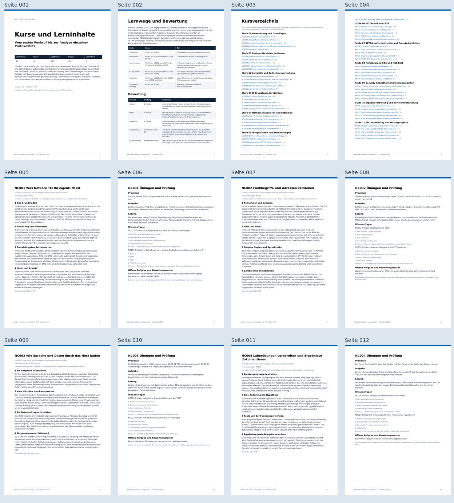

# NetCore Academy: erhaltene Inhalte und rekonstruierte Bildvorschauen

Zugehörige Abschlussdokumentation: [NetCore Academy](../../2026-10-06_netcore-academy-moodle-kurssystem-noob-bis-bitdecoder.md).

Die HTML-, PDF- und ZIP-Dateien sind unveränderte erhaltene Originalartefakte der Academy-Ausgabe 1.0 vom 2026-10-05. `SHA256SUMS` dokumentiert die archivierten Dateibytes. Das ZIP enthält sämtliche 60 Kurse, 240 Lektionen, Praxis-/Prüfungsdaten, native Moodle-Book-Kapitel, CSV/JSON und das ausführbare Lehrprogramm.

| Artefakt | Zweck |
| --- | --- |
| [NetCore_Academy_Kurssystem.html](NetCore_Academy_Kurssystem.html) | Durchsuchbares Offline-Kursbuch |
| [NetCore_Academy_Kurssystem.pdf](NetCore_Academy_Kurssystem.pdf) | Finales Kursbuch, 135 Seiten |
| [NetCore_Academy_Kursinhalte.zip](NetCore_Academy_Kursinhalte.zip) | Bearbeitbare Inhalte, Moodle-Teilimporte und acht Lehrlabore |
| [pruefbericht-2026-10-06.json](pruefbericht-2026-10-06.json) | Heute erneut ausgeführte Inhalts-/Formatprüfungen und Grenzen |
| [laborergebnisse-2026-10-06.json](laborergebnisse-2026-10-06.json) | Erneut erzeugte Ergebnisse aller acht Lehrlabore |
| [quelleninventar.json](quelleninventar.json) | 25 PDF-Anhänge mit Seitenzahl, Größe und SHA-256; Norm-PDFs selbst nicht kopiert |
| [bildmanifest.json](bildmanifest.json) | Herkunft, Seitenbezug, Größe und SHA-256 der Bildrekonstruktionen |

## Bildbelege

Die ursprünglichen PNG-Vorschauen des Fachchats sind nach der Workspace-Bereinigung nicht mehr vorhanden. Die folgenden Bilder wurden am 2026-10-06 aus dem unveränderten finalen PDF rekonstruiert. Sie zeigen dieselben erhaltenen finalen Seiteninhalte, sind aber keine bytegleichen ursprünglichen Bilddateien. Die Zwischenfassung mit 138 Seiten ist nicht erhalten.

| Bild | Seiten | Art |
| --- | --- | --- |
| [kontakt-01.png](bilder/kontakt-01.png) | 1, 2, 3, 4, 5, 6, 7, 8, 9, 10, 11, 12 | Kontaktbogen, neu gerendert |
| [kontakt-02.png](bilder/kontakt-02.png) | 13, 14, 15, 16, 17, 18, 19, 20, 21, 22, 23, 24 | Kontaktbogen, neu gerendert |
| [kontakt-03.png](bilder/kontakt-03.png) | 25, 26, 27, 28, 29, 30, 31, 32, 33, 34, 35, 36 | Kontaktbogen, neu gerendert |
| [kontakt-04.png](bilder/kontakt-04.png) | 37, 38, 39, 40, 41, 42, 43, 44, 45, 46, 47, 48 | Kontaktbogen, neu gerendert |
| [kontakt-05.png](bilder/kontakt-05.png) | 49, 50, 51, 52, 53, 54, 55, 56, 57, 58, 59, 60 | Kontaktbogen, neu gerendert |
| [kontakt-06.png](bilder/kontakt-06.png) | 61, 62, 63, 64, 65, 66, 67, 68, 69, 70, 71, 72 | Kontaktbogen, neu gerendert |
| [kontakt-07.png](bilder/kontakt-07.png) | 73, 74, 75, 76, 77, 78, 79, 80, 81, 82, 83, 84 | Kontaktbogen, neu gerendert |
| [kontakt-08.png](bilder/kontakt-08.png) | 85, 86, 87, 88, 89, 90, 91, 92, 93, 94, 95, 96 | Kontaktbogen, neu gerendert |
| [kontakt-09.png](bilder/kontakt-09.png) | 97, 98, 99, 100, 101, 102, 103, 104, 105, 106, 107, 108 | Kontaktbogen, neu gerendert |
| [kontakt-10.png](bilder/kontakt-10.png) | 109, 110, 111, 112, 113, 114, 115, 116, 117, 118, 119, 120 | Kontaktbogen, neu gerendert |
| [kontakt-11.png](bilder/kontakt-11.png) | 121, 122, 123, 124, 125, 126, 127, 128, 129, 130, 131, 132 | Kontaktbogen, neu gerendert |
| [kontakt-12.png](bilder/kontakt-12.png) | 133, 134, 135 | Kontaktbogen, neu gerendert |
| [detail-117.png](bilder/detail-117.png) | 117 | Detailseite, neu gerendert |
| [detail-128.png](bilder/detail-128.png) | 128 | Detailseite, neu gerendert |
| [detail-129.png](bilder/detail-129.png) | 129 | Detailseite, neu gerendert |

