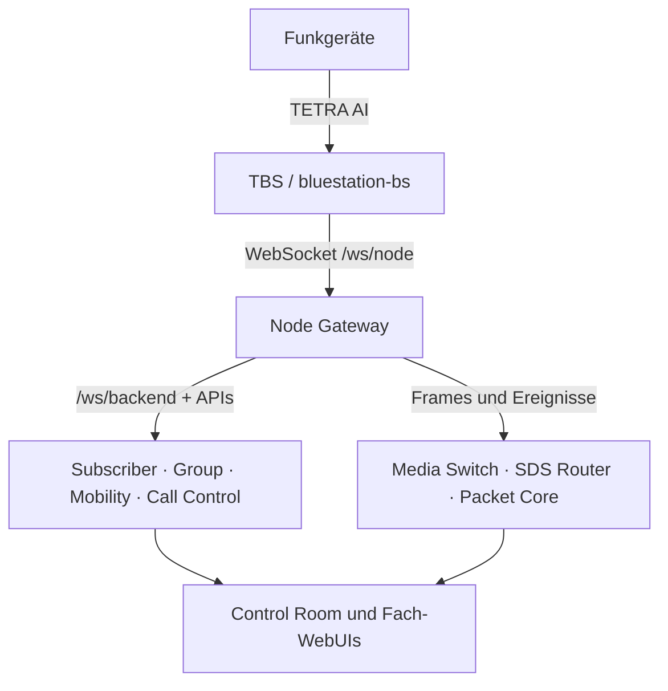

# Architektur und Datenwege

NetCore Tetra trennt die **zeitkritische Funkkante** von netzweiten Fachkernen. Eine TBS betreibt die Luftschnittstelle und kann im lokalen Modus weiterarbeiten. Der Node Gateway vermittelt die Anbindung an zentrale Dienste; Control Room und andere Oberflächen greifen auf deren Zustände zu.

Die Pfeile zeigen Verantwortungsbereiche, keine vollständige Portliste. [[Netzwerk-und-Ports]] nennt die tatsächlich konfigurierbaren Transportwege.

## Zuständigkeiten

| Ebene | Komponenten | Autorität |
|---|---|---|
| Funkkante | SDR, PHY/MAC/LLC/MLE, lokale MM/CMCE, TBS-Dashboard, Mediencache | aktuelle Zelle, lokale Registrierung, Signalisierung, RF-Timing, lokaler Fallback |
| Vermittlung | Node Gateway, Subscriber/Group/Mobility, Call Control, Media Switch, SDS Router | netzweite Teilnehmer-/Gruppen- und Rufzustände, codierte Sprachframes, SDS-Verteilung |
| Paket und Sicherheit | Packet Core, IP Gateway, Security Core, KMF, Transit | PDP/IPv4, Policies/Schlüssel, regionale Verbindungen |
| Anwendungen | SIP Switch, IoT Gateway, Media Library, Workflows, RF Monitor, weitere | Telefonie, MQTT, Medien, Alarme und Diagnosen |
| Bedienung | lokales Dashboard, Directory, Provisioning Core, Control Room, Observability | lokale Steuerung, Metadatenpflege, Teilnehmeranlage, Leitstellenansicht, Metriken |

Die vollständige Zuordnung aller 24 Inventory-Dienste steht im [[Dienstkatalog]]. **Directory** ist der Namens-/Metadatendienst; **Subscriber Core** und **Group Core** führen die zugehörigen netzweiten Profile und Policies. Gleiche Bezeichnungen ersetzen keine fachliche Zuständigkeit.

## Kritische Abläufe

### Registrierung und Affiliation

Das Funkgerät findet SYNC/SYSINFO, meldet sich per Location Update an der TBS und affiliiert sich gegebenenfalls mit einer GSSI. Lokale Zulassung, zentrale Policy, aktuelle Registrierung und tatsächliche Erreichbarkeit sind getrennt zu prüfen. Mehr dazu unter [[Registration-and-Affiliation]] und [[ISSI-and-GSSI]].

### Ruf und Sprache

Die TBS führt ihre CMCE- und Floor-Zustände am Funk. Für zentrale Rufe entscheidet Call Control über Rufzweige; Media Switch transportiert codierte TETRA-Sprachframes zwischen den Knoten. Ein registrierter SIP-Trunk ist ein anderer Pfad: native TBS-Bridge → lokaler Asterisk → zentraler SIP Switch → bestehende PBX. [[Calls]] · [[SIP-und-Brew]]

### SDS, Status und Automationen

SDS und U-STATUS können lokal verarbeitet werden; der zentrale SDS Router ergänzt Routing und Warteschlangen. Der IoT Gateway veröffentlicht Ereignisse und Zustände per MQTT. Eine Nachricht im TBS-Log belegt noch nicht, dass sie beim Broker oder in Home Assistant ankam. [[SDS-and-U-STATUS]] · [[MQTT-und-Home-Assistant]]

### Packet Data

SNDCP und lokale TBS-Funktionen treffen auf Packet Core und IP Gateway. TUN, NAT, Firewall und WAP/Testdienste sind eigenständige Grenzen. Der Zugang zu einer WebUI beweist keinen funktionierenden Datentransfer über das Endgerät. [[Paketdaten-und-WAP]]

## Ausfall und Wiederkehr

Im [Edge-Fallback-Konzept](https://github.com/JanHG98/netcore-tetra/blob/main/Docs/EDGE_FALLBACK.md) unterscheidet die TBS `online`, `degraded`, `isolated` und `recovering`. Eine Service-Matrix besitzt eine Ablaufzeit; lokale Calls, SDS und installierte Schlüssel können je nach Konfiguration weiterlaufen. Zentrale Routen, neue Schlüsselverteilung und netzweite Dienste sind im Ausfall begrenzt. Ein altes Sprachframe wird nicht „nachgesendet“; begrenzte SDS-/Steuerereignisse können aus einem lokalen Spool wieder eingespielt werden. [[Backup-and-Fallback]] · [[Mehrzellenbetrieb]]

## Quellorte

- TBS: [`bins/bluestation-bs`](https://github.com/JanHG98/netcore-tetra/tree/main/bins/bluestation-bs), [`crates/tetra-entities`](https://github.com/JanHG98/netcore-tetra/tree/main/crates/tetra-entities)
- Backends: [`system-backend`](https://github.com/JanHG98/netcore-tetra/tree/main/system-backend)
- Deployment: [`deploy/open-lab`](https://github.com/JanHG98/netcore-tetra/tree/main/deploy/open-lab)
- Verträge und Befunde: [`Docs/`](https://github.com/JanHG98/netcore-tetra/tree/main/Docs), insbesondere [Integrationshinweise](https://github.com/JanHG98/netcore-tetra/blob/main/Docs/CENTRAL_NETWORK_ROLLOUT.md)
